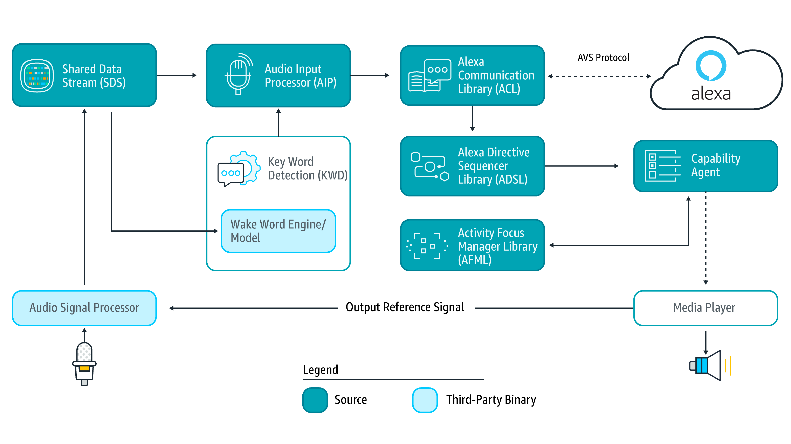

# AVS Device SDK
[](https://github.com/lankahsu520/HelperX)
[![GitHub license][license-image]][license-url]
[![GitHub stars][stars-image]][stars-url]
[![GitHub forks][forks-image]][forks-url]
[![GitHub issues][issues-image]][issues-image]
[![GitHub watchers][watchers-image]][watchers-image]

[license-image]: https://img.shields.io/github/license/lankahsu520/HelperX.svg
[license-url]: https://github.com/lankahsu520/HelperX/blob/master/LICENSE
[stars-image]: https://img.shields.io/github/stars/lankahsu520/HelperX.svg
[stars-url]: https://github.com/lankahsu520/HelperX/stargazers
[forks-image]: https://img.shields.io/github/forks/lankahsu520/HelperX.svg
[forks-url]: https://github.com/lankahsu520/HelperX/network
[issues-image]: https://img.shields.io/github/issues/lankahsu520/HelperX.svg
[issues-url]: https://github.com/lankahsu520/HelperX/issues
[watchers-image]: https://img.shields.io/github/watchers/lankahsu520/HelperX.svg
[watchers-url]: https://github.com/lankahsu520/HelperX/watchers

# 1. [Alexa Voice Service](https://developer.amazon.com/en-US/docs/alexa/alexa-voice-service/get-started-with-alexa-voice-service.html)



## 1.1. [AVS Device SDK 3.X](https://developer.amazon.com/en-US/docs/alexa/avs-device-sdk/overview.html)

# 2. [AVS Device SDK Repository](https://github.com/alexa/avs-device-sdk)

## 2.1. Depend on

- [openssl](https://www.openssl.org)
- [zlib](https://zlib.net)
- [portaudio](http://www.portaudio.com)
- [libxml2](http://xmlsoft.org)
- [libcares](https://c-ares.org)

```bash
$ sudo apt-get install libc-ares-dev
```

- [libev](http://software.schmorp.de/pkg/libev.html)

```bash
$ sudo apt-get install libev-dev
```

- [nghttp2](https://github.com/nghttp2/nghttp2) (openssl, zlib, libev, libcares)
- [curl](https://curl.haxx.se) (openssl, nghttp2)
- [libffi](https://sourceware.org/libffi)
- [glib](https://gitlab.gnome.org/GNOME/glib) (libffi, zlib)
- [orc](https://github.com/GStreamer/orc)
- [gstreamer](https://github.com/GStreamer/gstreamer) (glib)

```bash
$ sudo apt-get --yes install libgstreamer1.0-dev
$ sudo apt-get --yes install libgstreamer-plugins-base1.0-dev
$ sudo apt-get --yes install libgstreamer-plugins-good1.0-dev
$ sudo apt-get --yes install libgstreamer-plugins-bad1.0-dev
```

- gst-plugins-base

- gst-plugins-good
- gst-plugins-ugly
- [sqlite](http://www.sqlite.org)
- 

# Appendix

# I. Study

#### A. [Alexa交叉编译 (avs-device-sdk)](https://blog.csdn.net/qq_38731735/article/details/120869805)

#### B. [在 Raspberry Pi 上使用 AVS Device SDK 實現智慧音箱](https://ellis-wu.github.io/2019/07/15/avs-device-sdk-installation/)

# II. Debug

## II.1. configure: error: applications were requested (--enable-app) but dependencies are not met
```bash
$ sudo apt-get install libcunit1 libcunit1-doc libcunit1-dev
$ sudo apt-get install libc-ares-dev
```

## II.2. -- Could NOT find GTest (missing: GTEST_LIBRARY GTEST_INCLUDE_DIR GTEST_MAIN_LIBRARY)

```bash
$ sudo apt-get install libgtest-dev
```

# III. Glossary

# IV. Tool Usage


# Author

Created and designed by [Lanka Hsu](lankahsu@gmail.com).

# License

[HelperX](https://github.com/lankahsu520/HelperX) is available under the BSD-3-Clause license. See the LICENSE file for more info.
