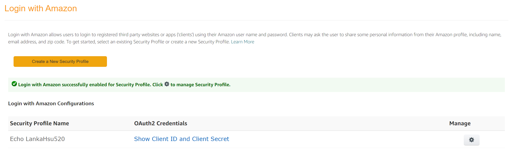

# AVS Device SDK
[](https://github.com/lankahsu520/HelperX)
[![GitHub license][license-image]][license-url]
[![GitHub stars][stars-image]][stars-url]
[![GitHub forks][forks-image]][forks-url]
[![GitHub issues][issues-image]][issues-image]
[![GitHub watchers][watchers-image]][watchers-image]

[license-image]: https://img.shields.io/github/license/lankahsu520/HelperX.svg
[license-url]: https://github.com/lankahsu520/HelperX/blob/master/LICENSE
[stars-image]: https://img.shields.io/github/stars/lankahsu520/HelperX.svg
[stars-url]: https://github.com/lankahsu520/HelperX/stargazers
[forks-image]: https://img.shields.io/github/forks/lankahsu520/HelperX.svg
[forks-url]: https://github.com/lankahsu520/HelperX/network
[issues-image]: https://img.shields.io/github/issues/lankahsu520/HelperX.svg
[issues-url]: https://github.com/lankahsu520/HelperX/issues
[watchers-image]: https://img.shields.io/github/watchers/lankahsu520/HelperX.svg
[watchers-url]: https://github.com/lankahsu520/HelperX/watchers

# 1. [Alexa Voice Service](https://developer.amazon.com/en-US/docs/alexa/alexa-voice-service/get-started-with-alexa-voice-service.html)

> Alexa 的官方網站。


> [AVS integration with AWS IoT](https://developer.amazon.com/en-US/docs/alexa/alexa-voice-service/deprecated-features.html)
> 	As of Nov 15, 2022, the AVS Integration with the AWS IoT program is no longer available


## 1.1. [AVS Device SDK 3.X](https://developer.amazon.com/en-US/docs/alexa/avs-device-sdk/overview.html)

# 2. [AVS Device SDK Repository](https://github.com/alexa/avs-device-sdk)

## 2.1. Depend on

- [openssl](https://www.openssl.org)
- [zlib](https://zlib.net)
- [portaudio](http://www.portaudio.com)
- [libxml2](http://xmlsoft.org)
- [libcares](https://c-ares.org)

```bash
$ sudo apt-get install libc-ares-dev
```

- [libev](http://software.schmorp.de/pkg/libev.html)

```bash
$ sudo apt-get install libev-dev
```

- [nghttp2](https://github.com/nghttp2/nghttp2) (openssl, zlib, libev, libcares)
- [curl](https://curl.haxx.se) (openssl, nghttp2)
- [libffi](https://sourceware.org/libffi)
- [glib](https://gitlab.gnome.org/GNOME/glib) (libffi, zlib)
- [orc](https://github.com/GStreamer/orc)
- [gstreamer](https://github.com/GStreamer/gstreamer) (glib)

```bash
$ sudo apt-get --yes install libgstreamer1.0-dev
$ sudo apt-get --yes install libgstreamer-plugins-base1.0-dev
$ sudo apt-get --yes install libgstreamer-plugins-good1.0-dev
$ sudo apt-get --yes install libgstreamer-plugins-bad1.0-dev
```

- gst-plugins-base
- gst-plugins-good
- gst-plugins-ugly
- [sqlite](http://www.sqlite.org)

## 2.2. Build on ubuntu64

```bash
$ cd $HOME/sdk-folder/sdk-build
$ cmake $HOME/sdk-folder/sdk-source/avs-device-sdk \
    -DGSTREAMER_MEDIA_PLAYER=ON \
    -DPORTAUDIO=ON \
    -DPKCS11=OFF \
    -DPORTAUDIO_LIB_PATH=$PORTAUDIO_LIB_PATH \
    -DPORTAUDIO_INCLUDE_DIR=/usr/include \
    -DCMAKE_BUILD_TYPE=DEBUG

$ make SampleApp
```

# 3. Register A Device - [Amazon Developer](https://developer.amazon.com/alexa/console/avs/products)

#### A. Product name


#### B. Touch-initiated, Hands-free, etc.


#### C. LWA Security Profile


#### D. Platform information


#### E. FINISH


#### F. config.json
```json
{
 "deviceInfo": {
  "clientId": "amzn1.application-oa2-client.xxxxxx",
  "productId": "EchoLankaHsu520"
 }
}
```
# 4. Enable Security Profile - [LWA Console](https://developer.amazon.com/lwa/sp/overview.html)

#### A. Select Security Profile


#### B. Enabled



# 5. Startup on ???

## 5.1. [ubuntu](https://developer.amazon.com/en-US/docs/alexa/avs-device-sdk/ubuntu.html)

#### A. AlexaClientSDKConfig.json

```bash
$ cd $HOME/sdk-folder/sdk-source/avs-device-sdk/tools/Install

$ . genConfig.sh \
	config.json \
	12345 \
	$HOME/sdk-folder/db \
	$HOME/sdk-folder/sdk-source/avs-device-sdk \
	$HOME/sdk-folder/sdk-build/Integration/AlexaClientSDKConfig.json \
	-DSDK_CONFIG_MANUFACTURER_NAME="Ubuntu" \
	-DSDK_CONFIG_DEVICE_DESCRIPTION="Ubuntu"
```

#### B. Run 1st

```bash
$ cd $HOME/sdk-folder/sdk-build/
$ ./SampleApplications/ConsoleSampleApplication/src/SampleApp ./Integration/AlexaClientSDKConfig.json 
```

#### C. Please the below log messages

```log
######################################################
#       > > > > > NOT YET AUTHORIZED < < < < <       #
######################################################

############################################################################################
#     To authorize, browse to: 'https://amazon.com/us/code' and enter the code: {XXXX}     #
############################################################################################
```

#### D. Relaunch - Enable debug logs

```bash
# To relaunch the Sample App with DEBUG9
$ cd $HOME/sdk-folder/sdk-build
$ ./SampleApplications/ConsoleSampleApplication/src/SampleApp ./Integration/AlexaClientSDKConfig.json DEBUG9
```

## 5.2. [Raspberry Pi](https://developer.amazon.com/en-US/docs/alexa/avs-device-sdk/raspberry-pi.html)

#### A. AlexaClientSDKConfig.json

```bash
$ cd $HOME/sdk-folder/sdk-source/avs-device-sdk/tools/Install

$ . genConfig.sh \
	config.json \
	12345 \
	$HOME/sdk-folder/db \
	$HOME/sdk-folder/sdk-source/avs-device-sdk \
	$HOME/sdk-folder/sdk-build/Integration/AlexaClientSDKConfig.json \
	-DSDK_CONFIG_MANUFACTURER_NAME="raspberrypi" \
	-DSDK_CONFIG_DEVICE_DESCRIPTION="raspberrypi"
```

##### A.1. list all available recording devices

```bash
$ arecord -l
```

##### A.2. list all playback devices

```bash
$ aplay -l
```

##### A.3. update ~/.asoundrc

```bash
pcm.!default {
  type asym
   playback.pcm {
     type plug
     slave.pcm "hw:0,0"
   }
   capture.pcm {
     type plug
     slave.pcm "hw:1,0"
   }
}
```

#### B. Run 1st

```bash
$ cd $HOME/sdk-folder/sdk-build/

$ export PA_ALSA_PLUGHW=1 

$ ./SampleApplications/ConsoleSampleApplication/src/SampleApp ./Integration/AlexaClientSDKConfig.json 
```

#### C. Please the below log messages

```log
######################################################
#       > > > > > NOT YET AUTHORIZED < < < < <       #
######################################################

############################################################################################
#     To authorize, browse to: 'https://amazon.com/us/code' and enter the code: {XXXX}     #
############################################################################################
```

#### D. Relaunch - Enable debug logs

```bash
# To relaunch the Sample App with DEBUG9
$ cd $HOME/sdk-folder/sdk-build
$ ./SampleApplications/ConsoleSampleApplication/src/SampleApp ./Integration/AlexaClientSDKConfig.json DEBUG9
```

# Appendix

# I. Study

## I.1. [Alexa交叉编译 (avs-device-sdk)](https://blog.csdn.net/qq_38731735/article/details/120869805)

## I.2. Official - [Build the Alexa Voice Service Device SDK](https://developer.amazon.com/en-US/docs/alexa/avs-device-sdk/build-the-sdk.html)

## I.3. Official - [Build with Amazon's Newest Devices & Services](https://developer.amazon.com/en-US/alexa/devices/alexa-built-in)

## I.4. [在 Raspberry Pi 上使用 AVS Device SDK 實現智慧音箱](https://ellis-wu.github.io/2019/07/15/avs-device-sdk-installation/)

## I.5. [更換 AVS Device SDK 的喚醒詞](https://ellis-wu.github.io/2019/07/17/avs-device-sdk-wwe/)

## I.6. [如何用树莓派搭建亚马逊语音助手，Raspberry Pi Alexa](https://www.labno3.com/2021/01/15/raspberry-pi-alexa-build-your-own-amazon-echo/)

## I.7. [Raspberry Pi Alexa: Build your own Amazon Echo](https://pimylifeup.com/raspberry-pi-alexa/)

# II. Debug

## II.1. configure: error: applications were requested (--enable-app) but dependencies are not met
```bash
$ sudo apt-get install libcunit1 libcunit1-doc libcunit1-dev
$ sudo apt-get install libc-ares-dev
```

## II.2. -- Could NOT find GTest (missing: GTEST_LIBRARY GTEST_INCLUDE_DIR GTEST_MAIN_LIBRARY)

```bash
$ sudo apt-get install libgtest-dev
```

## II.3. Could NOT find LibArchive (missing: LibArchive_LIBRARY LibArchive_INCLUDE_DIR)

```bash
$ sudo apt-get install -y libarchive-dev
```

## II.4. undefined reference to symbol 'pthread_getspecific@@GLIBC_2.2.5'

- ExtensionPath.cmake

```cmake
SET(CMAKE_CXX_FLAGS "${CMAKE_CXX_FLAGS} -pthread")
```

# III. Glossary

# IV. Tool Usage


# Author

Created and designed by [Lanka Hsu](lankahsu@gmail.com).

# License

[HelperX](https://github.com/lankahsu520/HelperX) is available under the BSD-3-Clause license. See the LICENSE file for more info.
