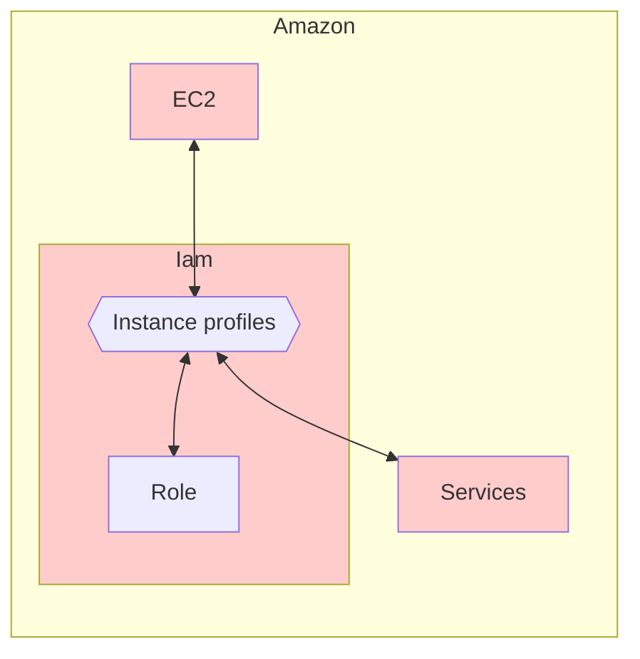
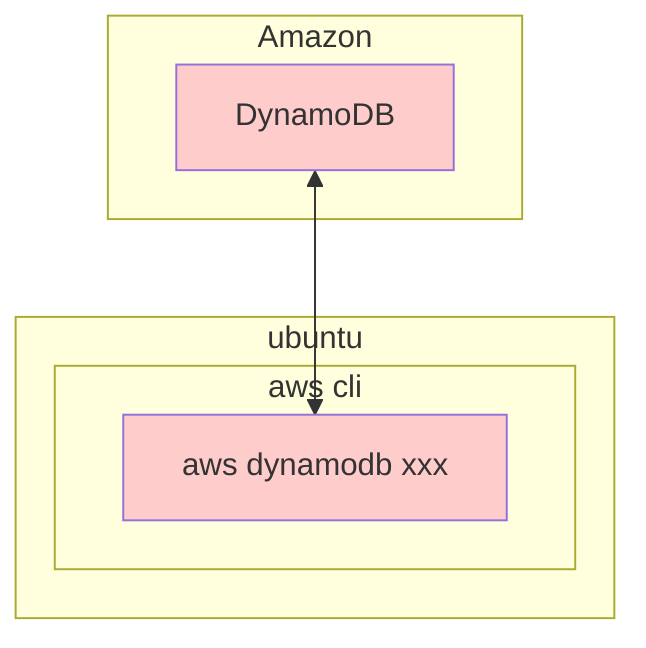
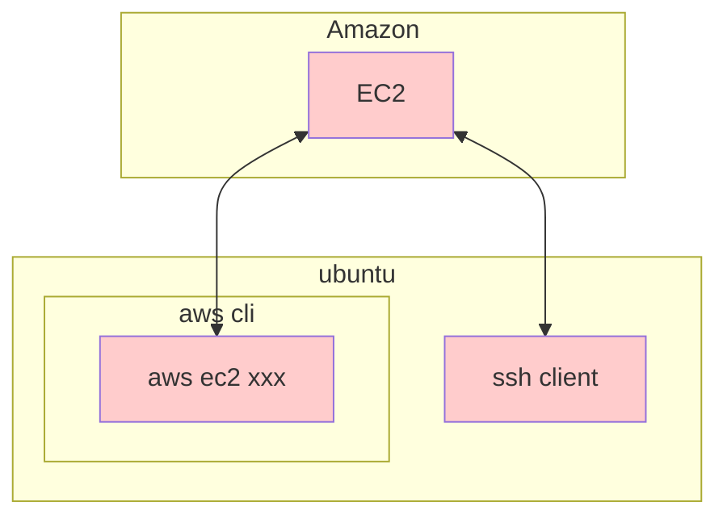
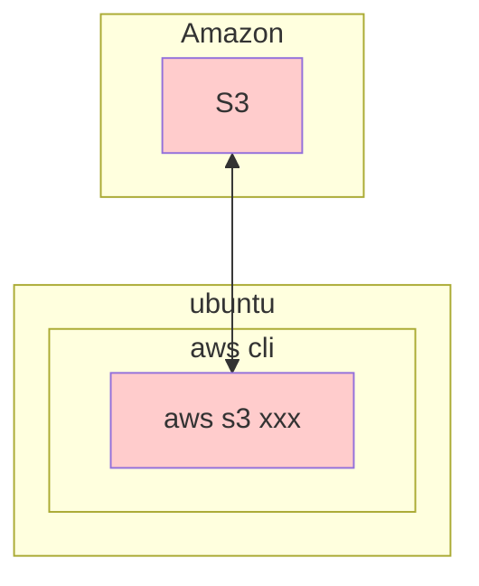
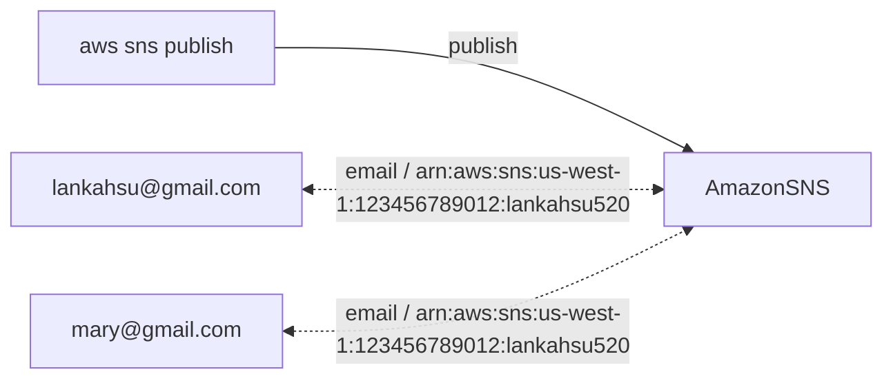

# [AWS Command Line Interface](https://docs.aws.amazon.com/zh_tw/cli/latest/userguide/cli-chap-welcome.html)
[](https://github.com/lankahsu520/HelperX)
[![GitHub license][license-image]][license-url]
[![GitHub stars][stars-image]][stars-url]
[![GitHub forks][forks-image]][forks-url]
[![GitHub issues][issues-image]][issues-image]
[![GitHub watchers][watchers-image]][watchers-image]

[license-image]: https://img.shields.io/github/license/lankahsu520/HelperX.svg
[license-url]: https://github.com/lankahsu520/HelperX/blob/master/LICENSE
[stars-image]: https://img.shields.io/github/stars/lankahsu520/HelperX.svg
[stars-url]: https://github.com/lankahsu520/HelperX/stargazers
[forks-image]: https://img.shields.io/github/forks/lankahsu520/HelperX.svg
[forks-url]: https://github.com/lankahsu520/HelperX/network
[issues-image]: https://img.shields.io/github/issues/lankahsu520/HelperX.svg
[issues-url]: https://github.com/lankahsu520/HelperX/issues
[watchers-image]: https://img.shields.io/github/watchers/lankahsu520/HelperX.svg
[watchers-url]: https://github.com/lankahsu520/HelperX/watchers

# 1. aws cli v2

## 1.1. Run on Local PC

### 1.1.1. Install

```bash
$ curl "https://awscli.amazonaws.com/awscli-exe-linux-x86_64.zip" -o "awscliv2.zip"
$ unzip awscliv2.zip
$ sudo ./aws/install
```
### 1.1.2. Access Key

```bash
$ export AWS_ACCESS_KEY_ID=<access_key>
$ export AWS_SECRET_ACCESS_KEY=<secret_key>
$ export AWS_DEFAULT_REGION=us-west-2
```
```bash
$ aws configure
AWS Access Key ID [None]: 
AWS Secret Access Key [None]: 
Default region name [None]:ap-northeast-1
Default output format [None]:json
```
#### A. ~/.aws/credentials

```bash
$ export AWS_SHARED_CREDENTIALS_FILE="$HOME/.aws/credentials"
$ echo $AWS_SHARED_CREDENTIALS_FILE

$ cat ~/.aws/credentials
[default]
aws_access_key_id = 
aws_secret_access_key =

$ aws configure get aws_access_key_id
$ aws configure get aws_secret_access_key
```

#### B. ~/.aws/config

```bash
$ export AWS_CONFIG_FILE="$HOME/.aws/config"
$ echo $AWS_CONFIG_FILE

$ cat ~/.aws/config
[default]
region = ap-northeast-1
output = json
cli_binary_format=raw-in-base64-out
cli_pager =

# The following example sets the default to disable the use of a pager.
# 避免進到 Pager 閱讀
$ aws configure set cli_pager ""

$ aws configure set region eu-west-1
$ aws configure set output json
```

#### C. Others

```bash
AWS_ROLE_ARN
AWS_WEB_IDENTITY_TOKEN_FILE
AWS_ROLE_SESSION_NAME

AWS_CONTAINER_CREDENTIALS_RELATIVE_URI

AWS_EC2_METADATA_DISABLED
```

## 1.2. Run on EC2 (ubuntu release)

### 1.2.1. AWS EC2

> 這邊有幾個方式可以知道目前的環境是否在 ec2

#### A. metadata

```bash
$ curl -s http://169.254.169.254/latest/meta-data
ami-id
ami-launch-index
ami-manifest-path
block-device-mapping/
events/
hostname
iam/
identity-credentials/
instance-action
instance-id
instance-life-cycle
instance-type
ipv6
local-hostname
local-ipv4
mac
managed-ssh-keys/
metrics/
network/
placement/
profile
public-hostname
public-ipv4
public-keys/
reservation-id
security-groups
services/
system
```

#### B. DMI BIOS

```bash
$ sudo dmidecode -s system-manufacturer
Amazon EC2
```

#### C. UUID

> ec2 開頭
>
> ec2xxxxx-xxxx-xxxx-xxxx-xxxxxxxxxxxx

```bash
$ sudo cat /sys/devices/virtual/dmi/id/product_uuid
ec2ab84b-4a2d-4d35-b947-f2dfef5eb50d
```

# 2. [IAM (AWS Identity and Access Management)](https://docs.aws.amazon.com/zh_tw/IAM/latest/UserGuide/introduction.html)

> AWS Identity and Access Management (IAM) 是一種 Web 服務，可協助您安全地控制對 資源的 AWS 存取。透過 IAM，您可以管理許可，以控制使用者可以存取哪些 AWS 資源。您可以使用 IAM 來控制能通過身分驗證 (登入) 和授權使用資源的 (具有許可) 的人員。IAM 提供控制 AWS 帳戶身分驗證和授權所需的基礎設施。

> 很複雜，建議有專人來管理。IAM 沒有設定好，後面的功能都無法使用。

## 2.1. Users / Roles

#### A. Users

```bash
$ aws sts get-caller-identity
{
    "UserId": "AID123456789012345678",
    "Account": "123456789012",
    "Arn": "arn:aws:iam::123456789012:user/Lanka"
}

$ AWS_STS_ARN=`aws sts get-caller-identity --query "Arn" --output text`

$ AWS_IDENTITY_TYPE=`echo $AWS_STS_ARN | awk -F':' '{print $6}' | awk -F'/' '{print $1}'`
$ echo $AWS_IDENTITY_TYPE
user

$ AWS_USER_NAME=`echo $AWS_STS_ARN | awk -F'/' '{print $2}'`
$ echo $AWS_USER_NAME
Lanka

$ aws iam get-user
{
    "User": {
        "Path": "/",
        "UserName": "Lanka",
        "UserId": "AID123456789012345678",
        "Arn": "arn:aws:iam::123456789012:user/Lanka",
        "CreateDate": "2019-10-31T03:50:05Z",
        "PasswordLastUsed": "2025-03-11T06:32:04Z",
        "Tags": [
            {
                "Key": "AKIA4123456789012345",
                "Value": "build20-vbx"
            },
            {
                "Key": "AKIA4123456789000000",
                "Value": "KVS WebRTC Viewer"
            }
        ]
    }
}

$ AWS_DEFAULT_REGION=`aws configure get region`
$ echo $AWS_DEFAULT_REGION
us-west-1
```

#### B. Roles

```bash
$ curl -s http://169.254.169.254/latest/meta-data/iam/security-credentials
Lanka-ec2-role

$ aws sts get-caller-identity
{
    "UserId": "AID123456789012345678",
    "Account": "123456789012",
    "Arn": "arn:aws:sts::123456789012:assumed-role/Lanka-ec2-role/i-123456789012aabbc"
}

$ AWS_STS_ARN=`aws sts get-caller-identity --query "Arn" --output text`

$ AWS_IDENTITY_TYPE=`echo $AWS_STS_ARN | awk -F':' '{print $6}' | awk -F'/' '{print $1}'`
$ echo $AWS_IDENTITY_TYPE
assumed-role

$ AWS_ROLE_NAME=`echo $AWS_STS_ARN | awk -F'/' '{print $2}'`
$ echo $AWS_ROLE_NAME
Lanka-ec2-role
# or
$ AWS_ROLE_NAME=`curl -s http://169.254.169.254/latest/meta-data/iam/security-credentials`
$ echo $AWS_ROLE_NAME
Lanka-ec2-role

$ aws iam get-role --role-name $AWS_ROLE_NAME
{
    "Role": {
        "Path": "/",
        "RoleName": "Lanka-ec2-role",
        "RoleId": "ARO123456789012345678",
        "Arn": "arn:aws:iam::123456789012:role/Lanka-ec2-role",
        "CreateDate": "2022-05-06T03:10:38Z",
        "AssumeRolePolicyDocument": {
            "Version": "2012-10-17",
            "Statement": [
                {
                    "Effect": "Allow",
                    "Principal": {
                        "Service": "ec2.amazonaws.com"
                    },
                    "Action": "sts:AssumeRole"
                }
            ]
        },
        "MaxSessionDuration": 3600,
        "RoleLastUsed": {
            "LastUsedDate": "2025-03-13T08:12:44Z",
            "Region": "ap-northeast-1"
        }
    }
}

$ AWS_ROLE_ARN=`aws iam get-role --role-name $AWS_ROLE_NAME --query 'Role.Arn' --output text`
$ echo "AWS_ROLE_ARN=$AWS_ROLE_ARN"

$ AWS_INSTANCE_ID=`curl -s http://169.254.169.254/latest/meta-data/instance-id`
$ echo "AWS_INSTANCE_ID=$AWS_INSTANCE_ID"

$ AWS_DEFAULT_REGION=`aws configure list | awk '/region/ {print $2}'`
$ echo $AWS_DEFAULT_REGION
```

## 2.2. Access Key

```bash
echo "AWS_STS_ARN=$AWS_STS_ARN"
echo "AWS_IDENTITY_TYPE=$AWS_IDENTITY_TYPE"
echo "AWS_USER_NAME=$AWS_USER_NAME"
echo "AWS_ROLE_NAME=$AWS_ROLE_NAME"
echo "AWS_ROLE_ARN=$AWS_ROLE_ARN"
echo "AWS_INSTANCE_ID=$AWS_INSTANCE_ID"

echo "AWS_DEFAULT_REGION=$AWS_DEFAULT_REGION"

echo "AWS_ACCESS_KEY_ID=$AWS_ACCESS_KEY_ID"
echo "AWS_SECRET_ACCESS_KEY=$AWS_SECRET_ACCESS_KEY"
echo
echo "AWS_SESSION_TOKEN=$AWS_SESSION_TOKEN"
echo "AWS_SESSION_LASTUPDATED=$AWS_SESSION_LASTUPDATED"
echo "AWS_SESSION_EXPIRATION=$AWS_SESSION_EXPIRATION"
echo
date +"%Y-%m-%d %T"
```

#### A. Users

```bash
AWS_USER_NAME=`aws sts get-caller-identity --query "Arn" --output text | awk -F'/' '{print $2}'`
echo "AWS_USER_NAME=$AWS_USER_NAME"

AWS_ACCESS_KEY_ID=`aws configure get aws_access_key_id`
AWS_SECRET_ACCESS_KEY=`aws configure get aws_secret_access_key`
```

#### B. Roles

```bash
$ curl -s http://169.254.169.254/latest/meta-data/iam/security-credentials/Lanka-ec2-role
{
  "Code" : "Success",
  "LastUpdated" : "2025-03-14T06:33:02Z",
  "Type" : "AWS-HMAC",
  "AccessKeyId" : "AKIA4123456789012345",
  "SecretAccessKey" : "abws8Hq2KiQ2AyJmhl0tm8OowIyCNOJqFgNIfBQ6",
  "Token" : "IQoJb3JpZ2luX2VjEJv//////////wEaCWV1LXdlc3QtMSJGMEQCIEHNABUE+YXbkLes8ljkX+eQjk//////////8BEAMaDDg3NzQwOTE1Mjg2NiIMTFDRHdPHmEAOghWGKpAF3hBSOFFIhRYFJ/0iCQvC/1vrw9luDVFV2+FZhcDqzjGA82qmSa5wIMfCnEE2082b61UF3vXWscCA51WHPYnckIHrJq6ZdgiSZGxoLbGJltRaIYdgDCwJ7yZaJSwyHcOHoeQUQQleJ15c6b9r7+QIYHsBdtzRS7seJRIDUgXZ2iw6ani0dT/pM6Rxb8CBI1xF9xTmoL4MMD+qCOmiNvSVB0xRPDZfPMeq9gCK+USvwTzlFTkK1s0GLwfhABRlzeKzKaIZgQ94ElHyaaPdqyLRHw8IHg1/NRua/+ZT1geBMMu80bhFW6x84PtFjSB7+35rdw5oc+kFSeZ7x+P7vOhglqylQOfmHfHx1s7qVF2ZLN9zFAoAqazaCykdY+l+54YDRtKbri0u3iIEq6QWa25cBL/SjlGbqefV0WgI0em69gWlwPE5UW4f41n0ystpEaDihe8bZtA78LzwDw8LoZkwaJGnAgahjPwvyhIFaWCazU4+e8x4hBx0L8qiWKAmsmNOv64kTXavczlilqR4cQPeYL5XQu+bLV3HNCX3tX55skaAIqKnTwvzRk29Q1ixNWYzel8TUU92Qu3/RQrXyB0Z59XUo7v94X/nnkQamGVSfzeDmGUqFY6w9ykYU7",
  "Expiration" : "2025-03-14T12:58:46Z"
}
```

```bash
AWS_ROLE_NAME=`curl -s http://169.254.169.254/latest/meta-data/iam/security-credentials`
echo "AWS_ROLE_NAME=$AWS_ROLE_NAME"

# MaxSessionDuration = 43200
aws iam update-role --role-name $AWS_ROLE_NAME --max-session-duration 43200

AWS_CREDENTIALS=`curl -s http://169.254.169.254/latest/meta-data/iam/security-credentials/$AWS_ROLE_NAME`

#echo "AWS_CREDENTIALS=$AWS_CREDENTIALS"

AWS_ACCESS_KEY_ID=$(echo $AWS_CREDENTIALS | jq -r '.AccessKeyId')
AWS_SECRET_ACCESS_KEY=$(echo $AWS_CREDENTIALS | jq -r '.SecretAccessKey')
AWS_SESSION_TOKEN=$(echo $AWS_CREDENTIALS | jq -r '.Token')

AWS_SESSION_LASTUPDATED=$(echo $AWS_CREDENTIALS | jq -r '.LastUpdated')
AWS_SESSION_EXPIRATION=$(echo $AWS_CREDENTIALS | jq -r '.Expiration')
```

## 2.3. Policies

```bash
aws iam list-policies
```

#### A. Users

```bash
aws iam list-attached-user-policies --user-name $AWS_USER_NAME
```

#### B. Roles

```bash
aws iam list-attached-role-policies --role-name $AWS_ROLE_NAME
```

## 2.4. Instance profiles

> 這邊想像成是把 roles 放入 Instance profile 裏



### 2.4.1. instance-profile

```bash
# 新增 instance-profile
$ aws iam create-instance-profile \
 --instance-profile-name KVSWebRTCInstanceProfile

# 列出 instance-profile
$ aws iam list-instance-profiles \
 --query 'InstanceProfiles[*].InstanceProfileName' \
 --output table

# 刪除 instance-profile
$ aws iam delete-instance-profile \
 --instance-profile-name KVSWebRTCInstanceProfile
```

### 2.4.2. instance-profile and role

```bash
# 將 Lanka-ec2-role 加入 KVSWebRTCInstanceProfile
$ aws iam add-role-to-instance-profile \
 --instance-profile-name KVSWebRTCInstanceProfile \
 --role-name Lanka-ec2-role

# 查看 KVSWebRTCInstanceProfile 下的 roles
$ aws iam get-instance-profile \
 --instance-profile-name KVSWebRTCInstanceProfile \
 --query 'InstanceProfile.Roles[*].RoleName' --output table

# 查看 Lanka-ec2-role 加入了 instance-profile
$ aws iam list-instance-profiles-for-role \
 --role-name Lanka-ec2-role \
 --query 'InstanceProfiles[*].InstanceProfileName' --output table

# 將 Lanka-ec2-role 從 KVSWebRTCInstanceProfile 移出
$ aws iam remove-role-from-instance-profile \
 --instance-profile-name KVSWebRTCInstanceProfile \
 --role-name Lanka-ec2-role
```

### 2.4.3. instance-profile and ec2

```bash
# 查看個別的 ec2 與綁定的 instance-profile
$ aws ec2 describe-instances \
 --query 'Reservations[*].Instances[*].[InstanceId, IamInstanceProfile.Arn]' \
 --output table

# 查看 i-0123456789abcdef0 與綁定的 instance-profile
$ aws ec2 describe-instances \
 --instance-ids i-0123456789abcdef0 \
 --query 'Reservations[*].Instances[*].IamInstanceProfile.Arn' --output text
```

# 3. AWS Services

## 3.1. [DynamoDB](https://docs.aws.amazon.com/zh_tw/amazondynamodb/latest/developerguide/GettingStartedDynamoDB.html)



### 3.1.1. [DynamoDB Dashboard](https://eu-west-1.console.aws.amazon.com/dynamodbv2/home?region=eu-west-1#service)

### 3.1.2. [aws dynamodb xxx](https://docs.aws.amazon.com/zh_tw/cli/latest/userguide/cli-services-dynamodb.html)

#### [create-table](https://awscli.amazonaws.com/v2/documentation/api/latest/reference/dynamodb/create-table.html)

```bash
$ aws dynamodb create-table \
    --table-name Music \
    --attribute-definitions \
        AttributeName=Artist,AttributeType=S \
        AttributeName=SongTitle,AttributeType=S \
    --key-schema \
        AttributeName=Artist,KeyType=HASH \
        AttributeName=SongTitle,KeyType=RANGE \
    --provisioned-throughput \
        ReadCapacityUnits=5,WriteCapacityUnits=5 \
    --table-class STANDARD
```

```json
{
    "TableDescription": {
        "AttributeDefinitions": [
            {
                "AttributeName": "Artist",
                "AttributeType": "S"
            },
            {
                "AttributeName": "SongTitle",
                "AttributeType": "S"
            }
        ],
        "TableName": "Music",
        "KeySchema": [
            {
                "AttributeName": "Artist",
                "KeyType": "HASH"
            },
            {
                "AttributeName": "SongTitle",
                "KeyType": "RANGE"
            }
        ],
        "TableStatus": "CREATING",
        "CreationDateTime": "2022-04-13T13:19:42.957000+08:00",
        "ProvisionedThroughput": {
            "NumberOfDecreasesToday": 0,
            "ReadCapacityUnits": 5,
            "WriteCapacityUnits": 5
        },
        "TableSizeBytes": 0,
        "ItemCount": 0,
        "TableArn": "arn:aws:dynamodb:ap-northeast-1:123456789012:table/Music",
        "TableId": "25e42645-c399-4c68-aac6-f7b7084bd23e",
        "TableClassSummary": {
            "TableClass": "STANDARD"
        }
    }
}
```

```
An error occurred (ResourceInUseException) when calling the CreateTable operation: Table already exists: Music
```

#### [describe-table](https://awscli.amazonaws.com/v2/documentation/api/latest/reference/dynamodb/describe-table.html)

```bash
$ aws dynamodb describe-table --table-name Music | grep TableStatus
```

```
"TableStatus": "ACTIVE",
```

#### [put-item](https://awscli.amazonaws.com/v2/documentation/api/latest/reference/dynamodb/put-item.html)

```bash
$ aws dynamodb execute-statement --statement "INSERT INTO Music  \
                VALUE  \
                {'Artist':'No One You Know','SongTitle':'Call Me Today', 'AlbumTitle':'Somewhat Famous', 'Awards':'1'}"

$ aws dynamodb execute-statement --statement "INSERT INTO Music  \
                VALUE  \
                {'Artist':'No One You Know','SongTitle':'Howdy', 'AlbumTitle':'Somewhat Famous', 'Awards':'2'}"

$ aws dynamodb execute-statement --statement "INSERT INTO Music  \
                VALUE  \
                {'Artist':'Acme Band','SongTitle':'Happy Day', 'AlbumTitle':'Songs About Life', 'Awards':'10'}"
                            
$ aws dynamodb execute-statement --statement "INSERT INTO Music  \
                VALUE  \
                {'Artist':'Acme Band','SongTitle':'PartiQL Rocks', 'AlbumTitle':'Another Album Title', 'Awards':'8'}"
```

```json
{
    "Items": []
}
```

```
An error occurred (DuplicateItemException) when calling the ExecuteStatement operation: Duplicate primary key exists in table
```

#### [get-item](https://awscli.amazonaws.com/v2/documentation/api/latest/reference/dynamodb/get-item.html)

```bash
$ aws dynamodb get-item --consistent-read \
    --table-name Music \
    --key '{ "Artist": {"S": "Acme Band"}, "SongTitle": {"S": "Happy Day"}}'
```

```json
{
    "Item": {
        "AlbumTitle": {
            "S": "Songs About Life"
        },
        "Awards": {
            "S": "10"
        },
        "Artist": {
            "S": "Acme Band"
        },
        "SongTitle": {
            "S": "Happy Day"
        }
    }
}
```

#### [scan](https://awscli.amazonaws.com/v2/documentation/api/latest/reference/dynamodb/scan.html)

```bash
$ aws dynamodb scan --table-name Music
```

```json
{
    "Items": [
        {
            "AlbumTitle": {
                "S": "Somewhat Famous"
            },
            "Awards": {
                "S": "1"
            },
            "Artist": {
                "S": "No One You Know"
            },
            "SongTitle": {
                "S": "Call Me Today"
            }
        },
        {
            "AlbumTitle": {
                "S": "Somewhat Famous"
            },
            "Awards": {
                "S": "2"
            },
            "Artist": {
                "S": "No One You Know"
            },
            "SongTitle": {
                "S": "Howdy"
            }
        },
        {
            "AlbumTitle": {
                "S": "Songs About Life"
            },
            "Awards": {
                "S": "10"
            },
            "Artist": {
                "S": "Acme Band"
            },
            "SongTitle": {
                "S": "Happy Day"
            }
        },
        {
            "AlbumTitle": {
                "S": "Another Album Title"
            },
            "Awards": {
                "S": "8"
            },
            "Artist": {
                "S": "Acme Band"
            },
            "SongTitle": {
                "S": "PartiQL Rocks"
            }
        }
    ],
    "Count": 4,
    "ScannedCount": 4,
    "ConsumedCapacity": null
}
```

## 3.2. [EC2 (Amazon Elastic Compute Cloud)](https://docs.aws.amazon.com/zh_tw/AWSEC2/latest/UserGuide/concepts.html)



### 3.2.1. [EC2 Dashboard](https://eu-west-1.console.aws.amazon.com/ec2/home?region=eu-west-1)

### 3.2.2. [aws ec2 xxx](https://docs.aws.amazon.com/zh_tw/cli/latest/userguide/cli-services-ec2.html)

>因為本身就是虛擬運算，設定起來也較複雜，不建議使用 AWS CLI；請多加使用 Dashboard。

### 3.2.3. ec2metadata xxx

```bash
# please use ssh to link with ec2
$ ec2metadata --instance-id
i-01234567890abcdef

$ ec2metadata --instance-type
t3.medium

$ ec2metadata --public-ipv4
199.199.199.199

$ ec2metadata --public-hostname
ec2-199-199-199-199.eu-west-1.compute.amazonaws.com

or
$ curl http://169.254.169.254/latest/meta-data/public-hostname
ec2-199-199-199-199.eu-west-1.compute.amazonaws.com
```

## 3.3. [S3 (Amazon Simple Storage Service)](https://docs.aws.amazon.com/zh_tw/AmazonS3/latest/userguide/Welcome.html)



### 3.3.1. [S3 Dashboard](https://s3.console.aws.amazon.com/s3/buckets?region=eu-west-1)

### 3.3.2. [aws s3 xxx](https://docs.aws.amazon.com/zh_tw/cli/latest/userguide/cli-services-s3.html)

#### [cp](https://docs.aws.amazon.com/cli/latest/reference/s3/cp.html)

> copies a single file to a specified bucket and key

```bash
$ aws s3 cp s3://utilx9/demo_000.c ./
$ aws s3 demo_000.c cp s3://utilx9
```

```bash
# to create a folder - demo
$ aws s3 demo_000.c cp s3://utilx9/demo/demo_000.c
```

#### [ls](https://docs.aws.amazon.com/cli/latest/reference/s3/ls.html)

>copies a single file to a specified bucket and key

```bash
$ aws s3 ls
$ aws s3 ls s3://utilx9
```

#### [mb](https://docs.aws.amazon.com/cli/latest/reference/s3/mb.html)

>creates a bucket

```bash
$ aws s3 mb s3://helperx
```

#### [mv](https://docs.aws.amazon.com/cli/latest/reference/s3/mv.html)

> move a file

```bash
$ aws s3 mv s3://helperx/README.md s3://helperx/README_bak.md
```

#### [rb](https://docs.aws.amazon.com/cli/latest/reference/s3/rb.html)

>removes a bucket

```bash
$ aws s3 rb s3://helperx
```

#### [rm](https://docs.aws.amazon.com/cli/latest/reference/s3/rm.html)

>deletes a single s3 object

```bash
$ aws s3 rm s3://utilx9/demo_000.c
```

#### [sync](https://awscli.amazonaws.com/v2/documentation/api/latest/reference/s3/sync.html)

> Syncs directories and S3 prefixes

```bash
$ aws s3 sync s3://helperx s3://helperx_Bak
```

### 3.3.3. [aws s3api](https://awscli.amazonaws.com/v2/documentation/api/latest/reference/s3api/index.html)

#### [get-bucket-notification-configuration](https://awscli.amazonaws.com/v2/documentation/api/latest/reference/s3api/get-bucket-notification-configuration.html)

> Returns the notification configuration of a bucket.

```bash
$ aws s3api get-bucket-notification-configuration \
	--bucket lambdax9 --output yaml

$ aws s3api get-bucket-notification-configuration \
	--bucket lambdax9 --output json

```

- s3_notification.yml

```json
LambdaFunctionConfigurations:
- Events:
  - s3:ObjectCreated:*
  - s3:ObjectRemoved:*
  Id: bbecdad0-0539-4d92-a563-1ae812316dd0
  LambdaFunctionArn: arn:aws:lambda:us-west-1:123456789012:function:LambdaHello-function-bLJNjfr7pRL5

```

#### [put-bucket-notification-configuration](https://awscli.amazonaws.com/v2/documentation/api/latest/reference/s3api/put-bucket-notification-configuration.html)

>Enables notifications of specified events for a bucket.

- s3_notification.json

```bash
$ aws s3api put-bucket-notification-configuration \
	--bucket lambdax9 \
	--notification-configuration file://s3_notification.json
```

```json
{
	"LambdaFunctionConfigurations": [{
			"LambdaFunctionArn": "arn:aws:lambda:us-west-1:123456789012:function:LambdaHello-function-bLJNjfr7pRL5",
			"Events": [
				"s3:ObjectCreated:*",
				"s3:ObjectRemoved:*"
			]
		}
	]
}
```

- s3_notification_null.json

```bash
$ aws s3api put-bucket-notification-configuration \
	--bucket lambdax9 \
	--notification-configuration file://s3_notification_null.json
```

```json
{
}
```


## 3.4. [S3 Glacier](https://docs.aws.amazon.com/zh_tw/amazonglacier/latest/dev/introduction.html)

> 因為不適用正常檔案存取方式，先不花時間研究。

### 3.4.1. [S3 Glacier](https://eu-west-1.console.aws.amazon.com/sns/v3/home?region=eu-west-1#/dashboard)

### 3.4.2. [aws glacier xxx](https://docs.aws.amazon.com/zh_tw/cli/latest/userguide/cli-services-glacier.html)

## 3.5. [SNS (Amazon Simple Notification Service)](https://docs.aws.amazon.com/zh_tw/sns/latest/dg/welcome.html)

> publish a message to AmazonSNS, then send ([protocol](https://awscli.amazonaws.com/v2/documentation/api/latest/reference/sns/subscribe.html)) to subscriber(s)



### 3.5.1. [SNS Dashboard](https://eu-west-1.console.aws.amazon.com/sns/v3/home?region=eu-west-1#/dashboard)

### 3.5.2. [aws sns xxx](https://docs.aws.amazon.com/zh_tw/cli/latest/userguide/cli-services-s3.html)

#### [create-topic](https://awscli.amazonaws.com/v2/documentation/api/latest/reference/sns/create-topic.html)

```bash
$ aws sns create-topic --name lankahsu520
{
    "TopicArn": "arn:aws:sns:eu-west-1:123456789012:lankahsu520"
}
```

#### [delete-topic](https://awscli.amazonaws.com/v2/documentation/api/latest/reference/sns/delete-topic.html)

```bash
$ aws sns delete-topic --topic-arn arn:aws:sns:eu-west-1:123456789012:lankahsu520
```

#### [subscribe](https://awscli.amazonaws.com/v2/documentation/api/latest/reference/sns/subscribe.html)

>The protocol that you want to use. Supported protocols include:
>- `http` – delivery of JSON-encoded message via HTTP POST
>- `https` – delivery of JSON-encoded message via HTTPS POST
>- `email` – delivery of message via SMTP
>- `email-json` – delivery of JSON-encoded message via SMTP
>- `sms` – delivery of message via SMS
>- `sqs` – delivery of JSON-encoded message to an Amazon SQS queue
>- `application` – delivery of JSON-encoded message to an EndpointArn for a mobile app and device
>- `lambda` – delivery of JSON-encoded message to an Lambda function
>- `firehose` – delivery of JSON-encoded message to an Amazon Kinesis Data Firehose delivery stream.

```bash
$ aws sns subscribe --topic-arn arn:aws:sns:us-west-1:123456789012:lankahsu520 --protocol email --notification-endpoint lankahsu@gmail.com
{
    "SubscriptionArn": "pending confirmation"
}
```

#### [list-subscriptions](https://awscli.amazonaws.com/v2/documentation/api/latest/reference/sns/list-subscriptions.html)

```bash
$ aws sns list-subscriptions
{
    "Subscriptions": [
        {
            "SubscriptionArn": "arn:aws:sns:eu-west-1:123456789012:lankahsu520:9aaa9c9a-8dba-45b6-999b-7871bad374d2",
            "Owner": "123456789012",
            "Protocol": "email",
            "Endpoint": "lankahsu@gmail.com",
            "TopicArn": "arn:aws:sns:eu-west-1:123456789012:lankahsu520"
        },
    ]
}
```

#### [list-topics](https://awscli.amazonaws.com/v2/documentation/api/latest/reference/sns/list-topics.html)

```bash
$ aws sns list-topics
```

#### [publish](https://awscli.amazonaws.com/v2/documentation/api/latest/reference/sns/publish.html)

```bash
$ aws sns publish --topic-arn arn:aws:sns:us-west-1:123456789012:lankahsu520 --message "Hello World!"
{
    "MessageId": "2e91a93d-8b5c-5f66-8da9-f5224ebfb6f2"
}
```

#### [unsubscribe](https://awscli.amazonaws.com/v2/documentation/api/latest/reference/sns/unsubscribe.html)

```bash
$ aws sns unsubscribe --subscription-arn arn:aws:sns:eu-west-1:123456789012:lankahsu520:9aaa9c9a-8dba-45b6-999b-7871bad374d2
```

#### [list-subscriptions](https://awscli.amazonaws.com/v2/documentation/api/latest/reference/sns/list-subscriptions.html)

```bash
$ aws sns list-subscriptions
{
    "Subscriptions": [
        {
            "SubscriptionArn": "arn:aws:sns:eu-west-1:123456789012:lankahsu520:9aaa9c9a-8dba-45b6-999b-7871bad374d2",
            "Owner": "123456789012",
            "Protocol": "email",
            "Endpoint": "lankahsu@gmail.com",
            "TopicArn": "arn:aws:sns:eu-west-1:123456789012:lankahsu520"
        },
    ]
}
```

## 3.6. [KVS (Kinesis Video Streams)](https://docs.aws.amazon.com/zh_tw/kinesisvideostreams/latest/dg/what-is-kinesis-video.html)

### 3.6.0. export

```bash
export AWS_KVS_STREAM_NAME=HelloLanka520
export AWS_KVS_STREAM_NAME_ARG="--stream-name ${AWS_KVS_STREAM_NAME}"

export AWS_KVS_STREAM_STARTDATE="2024-10-10"
export AWS_KVS_STREAM_STARTTIMESTAMP="${AWS_KVS_STREAM_STARTDATE}T00:00:00+08:00"
export AWS_KVS_STREAM_ENDTIMESTAMP="${AWS_KVS_STREAM_STARTDATE}T23:59:59+08:00"
export AWS_KVS_STREAM_FRAME_SEL="'{\"FragmentSelectorType\":\"SERVER_TIMESTAMP\",\"TimestampRange\": {\"StartTimestamp\":\"${AWS_KVS_STREAM_STARTTIMESTAMP}\",\"EndTimestamp\":\"${AWS_KVS_STREAM_ENDTIMESTAMP}\"}}'"
export AWS_KVS_STREAM_FRAME_SEL_ARG="--fragment-selector ${AWS_KVS_STREAM_FRAME_SEL}"

export AWS_KVS_STREAM_STARTDATE_CLIP="2024-10-10"
export AWS_KVS_STREAM_STARTTIMESTAMP_CLIP="${AWS_KVS_STREAM_STARTDATE_CLIP}T11:30:00+08:00"
export AWS_KVS_STREAM_ENDTIMESTAMP_CLIP="${AWS_KVS_STREAM_STARTDATE_CLIP}T11:40:59+08:00"
export AWS_KVS_STREAM_FRAME_SEL_CLIP="'{\"FragmentSelectorType\":\"SERVER_TIMESTAMP\",\"TimestampRange\": {\"StartTimestamp\":\"${AWS_KVS_STREAM_STARTTIMESTAMP_CLIP}\",\"EndTimestamp\":\"${AWS_KVS_STREAM_ENDTIMESTAMP_CLIP}\"}}'"
export AWS_KVS_STREAM_FRAME_SEL_CLIP_ARG="--clip-fragment-selector ${AWS_KVS_STREAM_FRAME_SEL_CLIP}"

export AWS_KVS_STREAM_ENDPOINT="https://b-fd02c7db.kinesisvideo.us-east-1.amazonaws.com"
export AWS_KVS_STREAM_ENDPOINT_ARG="--endpoint-url ${AWS_KVS_STREAM_ENDPOINT}"

export AWS_KVS_STREAM_OUTPUT="text"
export AWS_KVS_STREAM_OUTPUT_ARG="--output ${AWS_KVS_STREAM_OUTPUT}"

export AWS_KVS_STREAM_OUTPUT_MP4=/work/HelloLanka520-${AWS_KVS_STREAM_STARTDATE}.mp4
export AWS_KVS_STREAM_OUTPUT_MKV_LAST=/work/HelloLanka520-last.mkv

echo "AWS_KVS_STREAM_STARTTIMESTAMP=${AWS_KVS_STREAM_STARTTIMESTAMP}"
echo "AWS_KVS_STREAM_ENDTIMESTAMP=${AWS_KVS_STREAM_ENDTIMESTAMP}"
echo "AWS_KVS_STREAM_ENDPOINT=${AWS_KVS_STREAM_ENDPOINT}"
```

### 3.6.1. [KVS Dashboard](https://us-east-1.console.aws.amazon.com/dashboard)

### 3.6.2. aws [kinesisvideo](https://awscli.amazonaws.com/v2/documentation/api/latest/reference/kinesisvideo/index.html) xxx

#### [describe-stream](https://awscli.amazonaws.com/v2/documentation/api/latest/reference/kinesisvideo/describe-stream.html)

> Returns the most current information about the specified stream. You must specify either the `StreamName` or the `StreamARN`.

```bash
$ DO_COMMAND="aws kinesisvideo \
 describe-stream \
 ${AWS_KVS_STREAM_NAME_ARG}"

[aws kinesisvideo describe-stream --stream-name HelloLanka520]
{
    "StreamInfo": {
        "DeviceName": "Kinesis_Video_Device",
        "StreamName": "HelloLanka520",
        "StreamARN": "arn:aws:kinesisvideo:us-east-1:",
        "MediaType": "video/h264,audio/aac",
        "KmsKeyId": "arn:aws:kms:us-east-1::",
        "Version": "",
        "Status": "ACTIVE",
        "CreationTime": "2024-10-10T11:23:20.451000+08:00",
        "DataRetentionInHours": 24
    }
}
```

#### [get-data-endpoint](https://awscli.amazonaws.com/v2/documentation/api/latest/reference/kinesisvideo/get-data-endpoint.html)

> Gets an endpoint for a specified stream for either reading or writing. Use this endpoint in your application to read from the specified stream (using the `GetMedia` or `GetMediaForFragmentList` operations) or write to it (using the `PutMedia` operation).

> `--api-name` (string)
>
> The name of the API action for which to get an endpoint.
> 
> Possible values:
> 
> - `PUT_MEDIA`

```bash
```

> - `GET_MEDIA`

```bash
export AWS_KVS_STREAM_ENDPOINT_MEDIA=`aws kinesisvideo get-data-endpoint --stream-name ${AWS_KVS_STREAM_NAME} --output text --api-name GET_MEDIA`
export AWS_KVS_STREAM_ENDPOINT_MEDIA_ARG="--endpoint-url ${AWS_KVS_STREAM_ENDPOINT_MEDIA}"
```

> - `LIST_FRAGMENTS`

```bash
export AWS_KVS_STREAM_ENDPOINT_LIST=`aws kinesisvideo get-data-endpoint --stream-name ${AWS_KVS_STREAM_NAME} --output text --api-name LIST_FRAGMENTS`
export AWS_KVS_STREAM_ENDPOINT_LIST_ARG="--endpoint-url ${AWS_KVS_STREAM_ENDPOINT_LIST}"
```

> - `GET_MEDIA_FOR_FRAGMENT_LIST`

```bash

```

> - `GET_HLS_STREAMING_SESSION_URL`

```bash
export AWS_KVS_STREAM_ENDPOINT_HLS=`aws kinesisvideo get-data-endpoint --stream-name ${AWS_KVS_STREAM_NAME} --output text --api-name GET_HLS_STREAMING_SESSION_URL`
export AWS_KVS_STREAM_ENDPOINT_HLS_ARG="--endpoint-url ${AWS_KVS_STREAM_ENDPOINT_HLS}"
```

> - `GET_DASH_STREAMING_SESSION_URL`

```
```

> - `GET_CLIP`

```bash
export AWS_KVS_STREAM_ENDPOINT_CLIP=`aws kinesisvideo get-data-endpoint --stream-name ${AWS_KVS_STREAM_NAME} --output text --api-name GET_CLIP`
export AWS_KVS_STREAM_ENDPOINT_CLIP_ARG="--endpoint-url ${AWS_KVS_STREAM_ENDPOINT_CLIP}"
```

> - `GET_IMAGES`

```bash
export AWS_KVS_STREAM_ENDPOINT_IMAGES=`aws kinesisvideo get-data-endpoint --stream-name ${AWS_KVS_STREAM_NAME} --output text --api-name GET_IMAGES`
export AWS_KVS_STREAM_ENDPOINT_IMAGES_ARG="--endpoint-url ${AWS_KVS_STREAM_ENDPOINT_IMAGES}"
```

### 3.6.3. aws [kinesis-video-archived-media](https://awscli.amazonaws.com/v2/documentation/api/latest/reference/kinesis-video-archived-media/index.html) xxx

#### [get-clip](https://awscli.amazonaws.com/v2/documentation/api/latest/reference/kinesis-video-archived-media/get-clip.html)

> Downloads an MP4 file (clip) containing the archived, on-demand media from the specified video stream over the specified time range.

> must have endpoint-url

```bash
export AWS_KVS_STREAM_ENDPOINT_CLIP=`aws kinesisvideo get-data-endpoint --stream-name ${AWS_KVS_STREAM_NAME} --output text --api-name GET_CLIP`
export AWS_KVS_STREAM_ENDPOINT_CLIP_ARG="--endpoint-url ${AWS_KVS_STREAM_ENDPOINT_CLIP}"
```

```bash
$ DO_COMMAND="aws kinesis-video-archived-media \
 get-clip \
 ${AWS_KVS_STREAM_NAME_ARG} \
 ${AWS_KVS_STREAM_ENDPOINT_CLI_ARG} \
 ${AWS_KVS_STREAM_FRAME_SEL_CLIP_ARG} \
 ${AWS_KVS_STREAM_OUTPUT_MP4}"

$ eval-it $DO_COMMAND
[aws kinesis-video-archived-media get-clip --stream-name HelloLanka520 --endpoint-url https://b-fd02c7db.kinesisvideo.us-east-1.amazonaws.com --clip-fragment-selector '{"FragmentSelectorType":"SERVER_TIMESTAMP","TimestampRange": {"StartTimestamp":"2024-10-10T11:30:00+08:00","EndTimestamp":"2024-10-10T11:40:59+08:00"}}' /work/HelloLanka520-2024-10-10.mp4]
{
    "ContentType": "video/mp4"
}
```

#### [list-fragments](https://awscli.amazonaws.com/v2/documentation/api/latest/reference/kinesis-video-archived-media/list-fragments.html)

> Returns a list of Fragment objects from the specified stream and timestamp range within the archived data

> must have endpoint-url

```bash
export AWS_KVS_STREAM_ENDPOINT_LIST=`aws kinesisvideo get-data-endpoint --stream-name ${AWS_KVS_STREAM_NAME} --output text --api-name LIST_FRAGMENTS`
export AWS_KVS_STREAM_ENDPOINT_LIST_ARG="--endpoint-url ${AWS_KVS_STREAM_ENDPOINT_LIST}"
```

```bash
$ DO_COMMAND="aws kinesis-video-archived-media \
 list-fragments \
 ${AWS_KVS_STREAM_NAME_ARG} \
 ${AWS_KVS_STREAM_ENDPOINT_LIST_ARG} \
 ${AWS_KVS_STREAM_FRAME_SEL_ARG} \
 ${AWS_KVS_STREAM_OUTPUT_ARG} \
 --max-items 5 | sort -k 6"

$ eval-it $DO_COMMAND
[aws kinesis-video-archived-media list-fragments --stream-name HelloLanka520 --endpoint-url https://b-fd02c7db.kinesisvideo.us-east-1.amazonaws.com --fragment-selector '{"FragmentSelectorType":"SERVER_TIMESTAMP","TimestampRange": {"StartTimestamp":"2024-10-10T00:00:00+08:00","EndTimestamp":"2024-10-10T23:59:59+08:00"}}' --output text --max-items 5 | sort -k 6]

```

```bash
$ export AWS_KVS_STREAM_STARTTOKEN="eyJOZXh0VG9rZW4iOiBudWxsLCAiYm90b190cnVuY2F0ZV9hbW91bnQiOiA1fQ=="
$ export AWS_KVS_STREAM_STARTTOKEN_ARG="--starting-token ${AWS_KVS_STREAM_STARTTOKEN}"

$ DO_COMMAND="aws kinesis-video-archived-media \
 list-fragments \
  ${AWS_KVS_STREAM_NAME_ARG} \
  ${AWS_KVS_STREAM_ENDPOINT_LIST_ARG} \
  ${AWS_KVS_STREAM_FRAME_SEL_ARG} \
  ${AWS_KVS_STREAM_STARTTOKEN_ARG} \
  ${AWS_KVS_STREAM_OUTPUT_ARG} \
  --max-items 5 | sort -k 6"

$ eval-it $DO_COMMAND
```

### 3.6.4. aws [kinesis-video-media](https://awscli.amazonaws.com/v2/documentation/api/latest/reference/kinesis-video-media/index.html) xxx

#### [get-media](https://awscli.amazonaws.com/v2/documentation/api/latest/reference/kinesis-video-media/get-media.html)

> Use this API to retrieve media content from a Kinesis video stream. In the request, you identify the stream name or stream Amazon Resource Name (ARN), and the starting chunk. Kinesis Video Streams then returns a stream of chunks in order by fragment number.

> Video stream -> a mkv file

```bash
export AWS_KVS_STREAM_ENDPOINT_MEDIA=`aws kinesisvideo get-data-endpoint --stream-name ${AWS_KVS_STREAM_NAME} --output text --api-name GET_MEDIA`
export AWS_KVS_STREAM_ENDPOINT_MEDIA_ARG="--endpoint-url ${AWS_KVS_STREAM_ENDPOINT_MEDIA}"

export AWS_KVS_STREAM_FRAME_LAST="'{\"StartSelectorType\":\"NOW\"}'"
export AWS_KVS_STREAM_FRAME_LAST_ARG="--start-selector ${AWS_KVS_STREAM_FRAME_LAST}"

$ DO_COMMAND="aws kinesis-video-media \
 get-media \
 ${AWS_KVS_STREAM_NAME_ARG} \
 ${AWS_KVS_STREAM_ENDPOINT_MEDIA_ARG} \
 ${AWS_KVS_STREAM_FRAME_LAST_ARG} \
 ${AWS_KVS_STREAM_OUTPUT_MKV_LAST}"

$ eval-it $DO_COMMAND
[aws kinesis-video-media get-media --stream-name HelloLanka520 --endpoint-url https://s-356988f0.kinesisvideo.us-east-1.amazonaws.com --start-selector '{"StartSelectorType":"NOW"}' /work/HelloLanka520-last.mkv]
{
    "ContentType": "video/webm"
}
```

# Appendix

# I. Study
## I.1. Official - [AWS CLI Command Reference](https://awscli.amazonaws.com/v2/documentation/api/latest/index.html)

# II. Debug

## II.2. Official - An error occurred (NoSuchBucket) when calling the ListObjectsV2 operation: The specified bucket does not exist

> 至 S3 console 建立該 Bucket，再用 aws s3 操作即可。
>
> 這有可能只是aws 自身的 bug 。

# III. Glossary

# IV. Tool Usage

## IV.1. aws Usage

```bash
$ aws --version
aws-cli/2.4.13 Python/3.8.8 Linux/5.15.0-52-generic exe/x86_64.ubuntu.20 prompt/off

$ aws

usage: aws [options] <command> <subcommand> [<subcommand> ...] [parameters]
To see help text, you can run:

  aws help
  aws <command> help
  aws <command> <subcommand> help

aws: error: the following arguments are required: command

$ aws help
$ aws <command> help
$ aws <command> <subcommand> help

$ aws sts get-caller-identity
```

## IV.2. bash

```bash
#******************************************************************************
#** 20. Shell Scripts **
#******************************************************************************
function eval-it()
{
	DO_COMMAND="$*"
	[ ! -z "${ECHO_COMMAND}" ] && echo "[${DO_COMMAND}]"
	eval "${DO_COMMAND}"
}

function eval-do()
{
	eval-it "${DO_COMMAND}"
}


#******************************************************************************
#** aws cli (iam) **
#******************************************************************************
function aws-iam-environment-key()
{
	echo "AWS_STS_ARN=$AWS_STS_ARN"
	echo "AWS_IDENTITY_TYPE=$AWS_IDENTITY_TYPE"
	echo "AWS_USER_NAME=$AWS_USER_NAME"
	echo "AWS_ROLE_NAME=$AWS_ROLE_NAME"
	echo "AWS_DEFAULT_REGION=${AWS_DEFAULT_REGION}"

	echo "AWS_ACCESS_KEY_ID=$AWS_ACCESS_KEY_ID"
	echo "AWS_SECRET_ACCESS_KEY=$AWS_SECRET_ACCESS_KEY"
	echo
	echo "AWS_SESSION_TOKEN=$AWS_SESSION_TOKEN"
	echo "AWS_SESSION_LASTUPDATED=$AWS_SESSION_LASTUPDATED"
	echo "AWS_SESSION_EXPIRATION=$AWS_SESSION_EXPIRATION"
	echo
	date +"%Y-%m-%d %T"
}

function aws-iam-environment-file()
{
	echo
	echo "--------------------------------------------------"
	[ ! -v AWS_SHARED_CREDENTIALS_FILE ] && export AWS_SHARED_CREDENTIALS_FILE="$HOME/.aws/credentials"
	echo "AWS_SHARED_CREDENTIALS_FILE=${AWS_SHARED_CREDENTIALS_FILE}"
	if [ ! -z "${AWS_SHARED_CREDENTIALS_FILE}" ] && [ -f "${AWS_SHARED_CREDENTIALS_FILE}" ]; then
		DO_COMMAND="(cat ${AWS_SHARED_CREDENTIALS_FILE})"
		eval-it "$DO_COMMAND"
	else
		echo "Can't find AWS_SHARED_CREDENTIALS_FILE !!! ($HOME/.aws/credentials)"
	fi

	echo
	echo "--------------------------------------------------"
	[ ! -v AWS_CONFIG_FILE ] && export AWS_CONFIG_FILE="$HOME/.aws/config"
	echo "AWS_CONFIG_FILE=${AWS_CONFIG_FILE}"
	if [ ! -z "${AWS_CONFIG_FILE}" ] && [ -f "${AWS_CONFIG_FILE}" ]; then
		DO_COMMAND="(cat ${AWS_CONFIG_FILE})"
		eval-it "$DO_COMMAND"
	else
		echo "Can't find AWS_CONFIG_FILE !!! ($HOME/.aws/config)"
	fi

	echo
}

function aws-iam-environment-all()
{
	aws-iam-environment-key
	aws-iam-environment-file
}

function aws-iam-export-unset()
{
	unset AWS_STS_ARN
	unset AWS_IDENTITY_TYPE
	unset AWS_USER_NAME
	unset AWS_ROLE_NAME

	unset AWS_ACCESS_KEY_ID
	unset AWS_SECRET_ACCESS_KEY
	unset AWS_DEFAULT_REGION

	unset AWS_SESSION_TOKEN
	unset AWS_SESSION_LASTUPDATED
	unset AWS_SESSION_EXPIRATION

	aws-iam-environment-key
}

function aws-iam-export-set()
{
	aws-iam-export-unset

	export AWS_STS_ARN=`aws sts get-caller-identity --query "Arn" --output text`
	export AWS_IDENTITY_TYPE=`echo $AWS_STS_ARN | awk -F':' '{print $6}' | awk -F'/' '{print $1}'`

	if [ "${AWS_IDENTITY_TYPE}" = "user" ]; then
		export AWS_USER_NAME=`echo $AWS_STS_ARN | awk -F'/' '{print $2}'`
		#echo "AWS_USER_NAME=$AWS_USER_NAME"

		export AWS_DEFAULT_REGION=`aws configure get region`

		export AWS_ACCESS_KEY_ID=`aws configure get aws_access_key_id`
		export AWS_SECRET_ACCESS_KEY=`aws configure get aws_secret_access_key`
	else
		#AWS_ROLE_NAME=`curl -s http://169.254.169.254/latest/meta-data/iam/security-credentials`
		export AWS_ROLE_NAME=`echo $AWS_STS_ARN | awk -F'/' '{print $2}'`
		#echo "AWS_ROLE_NAME=$AWS_ROLE_NAME"

		export AWS_DEFAULT_REGION=`aws configure list | awk '/region/ {print $2}'`

		export AWS_CREDENTIALS=`curl -s http://169.254.169.254/latest/meta-data/iam/security-credentials/$AWS_ROLE_NAME`
		#echo "AWS_CREDENTIALS=$AWS_CREDENTIALS"

		export AWS_ACCESS_KEY_ID=$(echo $AWS_CREDENTIALS | jq -r '.AccessKeyId')
		export AWS_SECRET_ACCESS_KEY=$(echo $AWS_CREDENTIALS | jq -r '.SecretAccessKey')

		export AWS_SESSION_TOKEN=$(echo $AWS_CREDENTIALS | jq -r '.Token')
		export AWS_SESSION_LASTUPDATED=$(echo $AWS_CREDENTIALS | jq -r '.LastUpdated')
		export AWS_SESSION_EXPIRATION=$(echo $AWS_CREDENTIALS | jq -r '.Expiration')
	fi

	aws-iam-environment-key
}


#******************************************************************************
#** aws cli (S3) **
#******************************************************************************
export S3_BUCKET_NAME=lambdax9

function aws-s3-environment()
{
	echo "S3_BUCKET_NAME=${S3_BUCKET_NAME}"
}

function aws-s3-ls()
{
	aws-s3-environment
	DO_COMMAND="(aws s3 ls s3://${S3_BUCKET_NAME})"
	eval-it "$DO_COMMAND"
}

function aws-s3-mb()
{
	HINT="Usage: ${FUNCNAME[0]} <bucket>"
	BUCKET1="$1"

	if [ ! -z "${BUCKET1}" ]; then
		DO_COMMAND="(aws s3 mb s3://${BUCKET1})"
		eval-it "$DO_COMMAND"
	else
		echo $HINT
	fi
}

function aws-s3-rb()
{
	HINT="Usage: ${FUNCNAME[0]} <bucket>"
	BUCKET1="$1"

	if [ ! -z "${BUCKET1}" ]; then
		DO_COMMAND="(aws s3 rb s3://${BUCKET1})"
		eval-it "$DO_COMMAND"
	else
		echo $HINT
	fi
}

#alias aws-s3-pull="aws-s3-environment; aws s3 cp s3://${S3_BUCKET_NAME}/$1 ./"
function aws-s3-pull()
{
	aws-s3-environment

	HINT="Usage: ${FUNCNAME[0]} <file>"
	FILE1="$1"

	if [ ! -z "${FILE1}" ]; then
		DO_COMMAND="(aws s3 cp s3://${S3_BUCKET_NAME}/${FILE1} ./)"
		eval-it "$DO_COMMAND"
		#echo "aws s3 cp s3://${S3_BUCKET_NAME}/${FILE1} ./"
	else
		echo $HINT
	fi
}

#alias aws-s3-push="aws s3 cp ${1} s3://${S3_BUCKET_NAME}"
function aws-s3-push()
{
	aws-s3-environment

	HINT="Usage: ${FUNCNAME[0]} <file>"
	FILE1="$1"

	if [ ! -z "${FILE1}" ]; then
		DO_COMMAND="(aws s3 cp ${FILE1} s3://${S3_BUCKET_NAME}/)"
		eval-it "$DO_COMMAND"
		#echo "aws s3 cp s3://${S3_BUCKET_NAME}/${FILE1}"
	else
		echo $HINT
	fi
}

function aws-s3-pull-bash_aliases()
{
	DO_COMMAND="(cd /tmp; aws-s3-pull .bash_aliases; chmod 775 .bash_aliases; cp .bash_aliases ~/)"
	eval-it "$DO_COMMAND"
}

alias aws-s3-pull-bash_aliases-reset="aws-s3-pull-bash_aliases; . ~/.bash_aliases"

function aws-s3-push-bash_aliases()
{
	aws-s3-push ~/.bash_aliases
}

#alias aws-s3-rm="aws s3 rm s3://${S3_BUCKET_NAME}/$1"
function aws-s3-rm()
{
	aws-s3-environment

	HINT="Usage: ${FUNCNAME[0]} <file>"
	FILE1="$1"

	if [ ! -z "${FILE1}" ]; then
		DO_COMMAND="(aws s3 rm s3://${S3_BUCKET_NAME}/${FILE1})"
		eval-it "$DO_COMMAND"
		#echo "aws s3 rm s3://${S3_BUCKET_NAME}/${FILE1}"
	else
		echo $HINT
	fi
}


#******************************************************************************
#** aws cli (kvs) **
#******************************************************************************
function aws-kvs-environment()
{
	echo
	echo "--------------------------------------------------"
	aws-iam-environment-key

	echo "-- KVS Video streams -----------------------------"
	echo "AWS_KVS_STREAM_NAME=${AWS_KVS_STREAM_NAME}"
	echo "AWS_KVS_STREAM_CLIP_FRAME_SEL_ARG=${AWS_KVS_STREAM_CLIP_FRAME_SEL_ARG}"
	echo "AWS_KVS_STREAM_ENDPOINT_ARG=${AWS_KVS_STREAM_ENDPOINT_ARG}"

	echo "-- Signaling channels ----------------------------"
	echo "LOG_LEVEL_VERBOSE=1"
	echo "LOG_LEVEL_DEBUG=2"
	echo "LOG_LEVEL_INFO=3"
	echo "LOG_LEVEL_WARN=4"
	echo "LOG_LEVEL_ERROR=5"
	echo "LOG_LEVEL_FATAL=6"
	echo "LOG_LEVEL_SILENT=7"
	echo "LOG_LEVEL_PROFILE=8"

	echo
	echo "AWS_KVS_LOG_LEVEL=${AWS_KVS_LOG_LEVEL}"
	echo "AWS_KVS_LOG_CONFIGURATION=${AWS_KVS_LOG_CONFIGURATION}"

	echo "DEBUG_LOG_SDP=${DEBUG_LOG_SDP}"

	echo "AWS_ENABLE_FILE_LOGGING=${AWS_ENABLE_FILE_LOGGING}"

	echo "AWS_KVS_CHANNEL_NAME=${AWS_KVS_CHANNEL_NAME}"

	echo "-- Others ----------------------------------------"

	echo "GST_PLUGIN_PATH=${GST_PLUGIN_PATH}"
	echo "LD_LIBRARY_PATH=${LD_LIBRARY_PATH}"

	echo "--------------------------------------------------"
	echo
}

```

# Author

> Created and designed by [Lanka Hsu](lankahsu@gmail.com).

# License

> [HelperX](https://github.com/lankahsu520/HelperX) is available under the BSD-3-Clause license. See the LICENSE file for more info.

