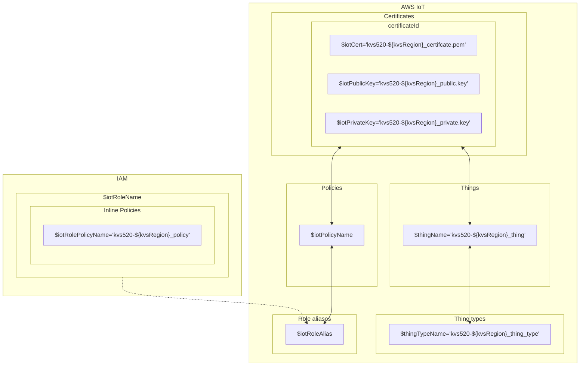

# [AWS Command Line Interface](https://docs.aws.amazon.com/zh_tw/cli/latest/userguide/cli-chap-welcome.html)
[](https://github.com/lankahsu520/HelperX)
[![GitHub license][license-image]][license-url]
[![GitHub stars][stars-image]][stars-url]
[![GitHub forks][forks-image]][forks-url]
[![GitHub issues][issues-image]][issues-image]
[![GitHub watchers][watchers-image]][watchers-image]

[license-image]: https://img.shields.io/github/license/lankahsu520/HelperX.svg
[license-url]: https://github.com/lankahsu520/HelperX/blob/master/LICENSE
[stars-image]: https://img.shields.io/github/stars/lankahsu520/HelperX.svg
[stars-url]: https://github.com/lankahsu520/HelperX/stargazers
[forks-image]: https://img.shields.io/github/forks/lankahsu520/HelperX.svg
[forks-url]: https://github.com/lankahsu520/HelperX/network
[issues-image]: https://img.shields.io/github/issues/lankahsu520/HelperX.svg
[issues-url]: https://github.com/lankahsu520/HelperX/issues
[watchers-image]: https://img.shields.io/github/watchers/lankahsu520/HelperX.svg
[watchers-url]: https://github.com/lankahsu520/HelperX/watchers

# 1. aws cli v2

## 1.1. Run on Local PC

### 1.1.1. Install

```bash
$ curl "https://awscli.amazonaws.com/awscli-exe-linux-x86_64.zip" -o "awscliv2.zip"
$ unzip awscliv2.zip
$ sudo ./aws/install
```
### 1.1.2. Access Key

> 主要是設定使用的 Access Key，你可以想像是 GitHub personal access token

#### A. Environment

```bash
$ export AWS_DEFAULT_REGION=us-west-2

$ export AWS_ACCESS_KEY_ID=<access_key>
$ export AWS_SECRET_ACCESS_KEY=<secret_key>
```
#### B. configure

```bash
$ aws configure
AWS Access Key ID [None]: 
AWS Secret Access Key [None]: 
Default region name [None]:ap-northeast-1
Default output format [None]:json
```
##### B.1. ~/.aws/credentials

```bash
$ export AWS_SHARED_CREDENTIALS_FILE="$HOME/.aws/credentials"

$ cat ~/.aws/credentials
[default]
aws_access_key_id = 
aws_secret_access_key =

$ aws configure get aws_access_key_id
$ aws configure get aws_secret_access_key
```

##### B.2. ~/.aws/config

```bash
$ export AWS_CONFIG_FILE="$HOME/.aws/config"

$ cat ~/.aws/config
[default]
region = ap-northeast-1
output = json
cli_binary_format=raw-in-base64-out
cli_pager =

# The following example sets the default to disable the use of a pager.
# 避免進到 Pager 閱讀
$ aws configure set cli_pager ""

$ aws configure set region eu-west-1
$ aws configure set output json
```

#### C. Others

```bash
AWS_ROLE_ARN
AWS_WEB_IDENTITY_TOKEN_FILE
AWS_ROLE_SESSION_NAME

AWS_CONTAINER_CREDENTIALS_RELATIVE_URI

AWS_EC2_METADATA_DISABLED
```

## 1.2. Run on EC2 (ubuntu release)

> 因為 EC2 本身就是 AWS 裏的 service，相關的設定在建立時就已經包含在裏面，省去一些功夫。

### 1.2.1. AWS EC2

> 這邊有幾個方式可以知道目前的環境是否在 ec2

#### A. metadata

```bash
$ curl -s http://169.254.169.254/latest/meta-data
ami-id
ami-launch-index
ami-manifest-path
block-device-mapping/
events/
hostname
iam/
identity-credentials/
instance-action
instance-id
instance-life-cycle
instance-type
ipv6
local-hostname
local-ipv4
mac
managed-ssh-keys/
metrics/
network/
placement/
profile
public-hostname
public-ipv4
public-keys/
reservation-id
security-groups
services/
system
```

#### B. DMI BIOS

```bash
$ sudo dmidecode -s system-manufacturer
Amazon EC2
```

#### C. UUID

> ec2 開頭
>
> ec2xxxxx-xxxx-xxxx-xxxx-xxxxxxxxxxxx

```bash
$ sudo cat /sys/devices/virtual/dmi/id/product_uuid
ec2ab84b-4a2d-4d35-b947-f2dfef5eb50d
```

# 2. [IAM (AWS Identity and Access Management)](https://docs.aws.amazon.com/zh_tw/IAM/latest/UserGuide/introduction.html)

> AWS Identity and Access Management (IAM) 是一種 Web 服務，可協助您安全地控制對 資源的 AWS 存取。透過 IAM，您可以管理許可，以控制使用者可以存取哪些 AWS 資源。您可以使用 IAM 來控制能通過身分驗證 (登入) 和授權使用資源的 (具有許可) 的人員。IAM 提供控制 AWS 帳戶身分驗證和授權所需的基礎設施。

> 很複雜，建議有專人來管理。IAM 沒有設定好，後面的功能都無法使用。

## 2.1. Users / Roles

#### A. Users

```bash
$ aws sts get-caller-identity
{
    "UserId": "AID123456789012345678",
    "Account": "123456789012",
    "Arn": "arn:aws:iam::123456789012:user/Lanka"
}

$ AWS_STS_ARN=`aws sts get-caller-identity --query "Arn" --output text`

$ AWS_IDENTITY_TYPE=`echo $AWS_STS_ARN | awk -F':' '{print $6}' | awk -F'/' '{print $1}'`
$ echo $AWS_IDENTITY_TYPE
user

$ AWS_USER_NAME=`echo $AWS_STS_ARN | awk -F'/' '{print $2}'`
$ echo $AWS_USER_NAME
Lanka

$ aws iam get-user
{
    "User": {
        "Path": "/",
        "UserName": "Lanka",
        "UserId": "AID123456789012345678",
        "Arn": "arn:aws:iam::123456789012:user/Lanka",
        "CreateDate": "2019-10-31T03:50:05Z",
        "PasswordLastUsed": "2025-03-11T06:32:04Z",
        "Tags": [
            {
                "Key": "AKIA4123456789012345",
                "Value": "build20-vbx"
            },
            {
                "Key": "AKIA4123456789000000",
                "Value": "KVS WebRTC Viewer"
            }
        ]
    }
}

$ AWS_DEFAULT_REGION=`aws configure get region`
$ echo $AWS_DEFAULT_REGION
us-west-1
```

#### B. Roles

> 因為 AWS 的 services 很多，建議在命名時附上 service name，方便管理。

```bash
$ curl -s http://169.254.169.254/latest/meta-data/iam/security-credentials
Lanka-ec2-role

$ aws sts get-caller-identity
{
    "UserId": "AID123456789012345678",
    "Account": "123456789012",
    "Arn": "arn:aws:sts::123456789012:assumed-role/Lanka-ec2-role/i-123456789012aabbc"
}

$ AWS_STS_ARN=`aws sts get-caller-identity --query "Arn" --output text`

$ AWS_IDENTITY_TYPE=`echo $AWS_STS_ARN | awk -F':' '{print $6}' | awk -F'/' '{print $1}'`
$ echo $AWS_IDENTITY_TYPE
assumed-role

$ AWS_ROLE_NAME=`echo $AWS_STS_ARN | awk -F'/' '{print $2}'`
$ echo $AWS_ROLE_NAME
Lanka-ec2-role
# or
$ AWS_ROLE_NAME=`curl -s http://169.254.169.254/latest/meta-data/iam/security-credentials`
$ echo $AWS_ROLE_NAME
Lanka-ec2-role

$ aws iam get-role --role-name $AWS_ROLE_NAME
{
    "Role": {
        "Path": "/",
        "RoleName": "Lanka-ec2-role",
        "RoleId": "ARO123456789012345678",
        "Arn": "arn:aws:iam::123456789012:role/Lanka-ec2-role",
        "CreateDate": "2022-05-06T03:10:38Z",
        "AssumeRolePolicyDocument": {
            "Version": "2012-10-17",
            "Statement": [
                {
                    "Effect": "Allow",
                    "Principal": {
                        "Service": "ec2.amazonaws.com"
                    },
                    "Action": "sts:AssumeRole"
                }
            ]
        },
        "MaxSessionDuration": 3600,
        "RoleLastUsed": {
            "LastUsedDate": "2025-03-13T08:12:44Z",
            "Region": "ap-northeast-1"
        }
    }
}

$ AWS_ROLE_ARN=`aws iam get-role --role-name $AWS_ROLE_NAME --query 'Role.Arn' --output text`
$ echo "AWS_ROLE_ARN=$AWS_ROLE_ARN"

$ AWS_DEFAULT_REGION=`aws configure list | awk '/region/ {print $2}'`
$ echo $AWS_DEFAULT_REGION
```

## 2.2. Access Key

```bash
echo "AWS_STS_ARN=$AWS_STS_ARN"
echo "AWS_IDENTITY_TYPE=$AWS_IDENTITY_TYPE"
echo "AWS_USER_NAME=$AWS_USER_NAME"
echo "AWS_ROLE_NAME=$AWS_ROLE_NAME"
echo "AWS_ROLE_ARN=$AWS_ROLE_ARN"
echo "AWS_INSTANCE_ID=$AWS_INSTANCE_ID"

echo "AWS_DEFAULT_REGION=$AWS_DEFAULT_REGION"

echo "AWS_ACCESS_KEY_ID=$AWS_ACCESS_KEY_ID"
echo "AWS_SECRET_ACCESS_KEY=$AWS_SECRET_ACCESS_KEY"
echo
echo "AWS_SESSION_TOKEN=$AWS_SESSION_TOKEN"
echo "AWS_SESSION_LASTUPDATED=$AWS_SESSION_LASTUPDATED"
echo "AWS_SESSION_EXPIRATION=$AWS_SESSION_EXPIRATION"
echo
date +"%Y-%m-%d %T"
```

#### A. Users

```bash
AWS_USER_NAME=`aws sts get-caller-identity --query "Arn" --output text | awk -F'/' '{print $2}'`
echo "AWS_USER_NAME=$AWS_USER_NAME"

AWS_ACCESS_KEY_ID=`aws configure get aws_access_key_id`
AWS_SECRET_ACCESS_KEY=`aws configure get aws_secret_access_key`
```

#### B. Roles

```bash
$ curl -s http://169.254.169.254/latest/meta-data/iam/security-credentials/Lanka-ec2-role
{
  "Code" : "Success",
  "LastUpdated" : "2025-03-14T06:33:02Z",
  "Type" : "AWS-HMAC",
  "AccessKeyId" : "AKIA4123456789012345",
  "SecretAccessKey" : "abws8Hq2KiQ2AyJmhl0tm8OowIyCNOJqFgNIfBQ6",
  "Token" : "IQoJb3JpZ2luX2VjEJv//////////wEaCWV1LXdlc3QtMSJGMEQCIEHNABUE+YXbkLes8ljkX+eQjk//////////8BEAMaDDg3NzQwOTE1Mjg2NiIMTFDRHdPHmEAOghWGKpAF3hBSOFFIhRYFJ/0iCQvC/1vrw9luDVFV2+FZhcDqzjGA82qmSa5wIMfCnEE2082b61UF3vXWscCA51WHPYnckIHrJq6ZdgiSZGxoLbGJltRaIYdgDCwJ7yZaJSwyHcOHoeQUQQleJ15c6b9r7+QIYHsBdtzRS7seJRIDUgXZ2iw6ani0dT/pM6Rxb8CBI1xF9xTmoL4MMD+qCOmiNvSVB0xRPDZfPMeq9gCK+USvwTzlFTkK1s0GLwfhABRlzeKzKaIZgQ94ElHyaaPdqyLRHw8IHg1/NRua/+ZT1geBMMu80bhFW6x84PtFjSB7+35rdw5oc+kFSeZ7x+P7vOhglqylQOfmHfHx1s7qVF2ZLN9zFAoAqazaCykdY+l+54YDRtKbri0u3iIEq6QWa25cBL/SjlGbqefV0WgI0em69gWlwPE5UW4f41n0ystpEaDihe8bZtA78LzwDw8LoZkwaJGnAgahjPwvyhIFaWCazU4+e8x4hBx0L8qiWKAmsmNOv64kTXavczlilqR4cQPeYL5XQu+bLV3HNCX3tX55skaAIqKnTwvzRk29Q1ixNWYzel8TUU92Qu3/RQrXyB0Z59XUo7v94X/nnkQamGVSfzeDmGUqFY6w9ykYU7",
  "Expiration" : "2025-03-14T12:58:46Z"
}
```

```bash
AWS_ROLE_NAME=`curl -s http://169.254.169.254/latest/meta-data/iam/security-credentials`
echo "AWS_ROLE_NAME=$AWS_ROLE_NAME"

# MaxSessionDuration = 43200
aws iam update-role --role-name $AWS_ROLE_NAME --max-session-duration 43200

AWS_CREDENTIALS=`curl -s http://169.254.169.254/latest/meta-data/iam/security-credentials/$AWS_ROLE_NAME`
#echo "AWS_CREDENTIALS=$AWS_CREDENTIALS"

AWS_ACCESS_KEY_ID=$(echo $AWS_CREDENTIALS | jq -r '.AccessKeyId')
AWS_SECRET_ACCESS_KEY=$(echo $AWS_CREDENTIALS | jq -r '.SecretAccessKey')
AWS_SESSION_TOKEN=$(echo $AWS_CREDENTIALS | jq -r '.Token')

AWS_SESSION_LASTUPDATED=$(echo $AWS_CREDENTIALS | jq -r '.LastUpdated')
AWS_SESSION_EXPIRATION=$(echo $AWS_CREDENTIALS | jq -r '.Expiration')
```

## 2.3. Policies

> [ChatGPT] attached-role-policies 和 role-policies 的差別
>
> 在 AWS 中，`attached-role-policies` 和 `role-policies` 都涉及到 IAM **Role** 與其 **Policy** 的關聯，但它們有不同的用途和行為。這裡是它們的區別：
>
> ### 1. **Attached Role Policies (`list-attached-role-policies`)**
>
> 這些是 **管理型政策**（Managed Policies）附加到角色（IAM Role）上的。管理型政策可以由 AWS 預先定義，或者由使用者創建，並且可以附加到多個 IAM 角色、使用者或群組。
>
> #### **特點：**
>
> - **管理型政策**（Managed Policies）：這些政策是由 AWS 管理或由使用者創建的可重複使用的政策。它們是獨立的 AWS 資源，並且可以多次附加到不同的角色、使用者或群組。
> - 這些政策可以在 AWS 管理控制台或透過 AWS CLI 進行修改。
> - 一個角色可以附加多個 **管理型政策**，而且多個角色可以共用同一個政策。
>
> ### 2. **Role Policies (`list-role-policies`)**
>
> 這些是 **內聯政策**（Inline Policies），是直接嵌入到 **角色** 中的，與角色密切相關，並且不能被其他角色共用。內聯政策是與角色本身捆綁的，不能單獨重用或附加到其他角色。
>
> #### **特點：**
>
> - **內聯政策**：這些是角色的內部政策，完全嵌入於角色的配置中。它們無法重複使用或附加到其他角色，並且通常由使用者根據角色的具體需求創建。
> - 每個角色可以有多個內聯政策。
> - 如果角色被刪除，這些內聯政策也會被刪除。

### 2.3.1. list

```bash
aws iam list-policies
```

#### A. Users

```bash
aws iam list-attached-user-policies --user-name $AWS_USER_NAME
aws iam list-user-policies --user-name $AWS_USER_NAME
```

#### B. Roles

```bash
aws iam list-attached-role-policies --role-name $AWS_ROLE_NAME
aws iam list-role-policies --role-name $AWS_ROLE_NAME
```

## 2.4. Instance profiles

> 這邊想像成是把 roles 放入 Instance profile 裏


### 2.4.1. instance-profile

```bash
# 新增 instance-profile
$ aws iam create-instance-profile \
 --instance-profile-name KVSWebRTCInstanceProfile

# 列出 instance-profile
$ aws iam list-instance-profiles \
 --query 'InstanceProfiles[*].InstanceProfileName' \
 --output table

# 刪除 instance-profile
$ aws iam delete-instance-profile \
 --instance-profile-name KVSWebRTCInstanceProfile
```

### 2.4.2. instance-profile and role

```bash
# 將 Lanka-ec2-role 加入 KVSWebRTCInstanceProfile
$ aws iam add-role-to-instance-profile \
 --instance-profile-name KVSWebRTCInstanceProfile \
 --role-name Lanka-ec2-role

# 查看 KVSWebRTCInstanceProfile 下的 roles
$ aws iam get-instance-profile \
 --instance-profile-name KVSWebRTCInstanceProfile \
 --query 'InstanceProfile.Roles[*].RoleName' --output table

# 查看 Lanka-ec2-role 加入了 instance-profile
$ aws iam list-instance-profiles-for-role \
 --role-name Lanka-ec2-role \
 --query 'InstanceProfiles[*].InstanceProfileName' --output table

# 將 Lanka-ec2-role 從 KVSWebRTCInstanceProfile 移出
$ aws iam remove-role-from-instance-profile \
 --instance-profile-name KVSWebRTCInstanceProfile \
 --role-name Lanka-ec2-role
```

### 2.4.3. instance-profile and ec2

```bash
$ AWS_EC2_INSTANCE_ID=`curl -s http://169.254.169.254/latest/meta-data/instance-id`
$ echo "AWS_EC2_INSTANCE_ID=$AWS_EC2_INSTANCE_ID"

# 查看個別的 ec2 與綁定的 instance-profile
$ aws ec2 describe-instances \
 --query 'Reservations[*].Instances[*].[InstanceId, IamInstanceProfile.Arn]' \
 --output table

# 查看 i-0123456789abcdef0 與綁定的 instance-profile
$ aws ec2 describe-instances \
 --instance-ids $AWS_EC2_INSTANCE_ID \
 --query 'Reservations[*].Instances[*].IamInstanceProfile.Arn' --output text
```

# 3. [AWS IoT](https://docs.aws.amazon.com/zh_tw/iot/latest/developerguide/connect-to-iot.html)

## 3.1. [Registry](https://docs.aws.amazon.com/iot/latest/developerguide/thing-registry.html)

> 前面 IAM 是管理“人”的權限，這邊就是“設備”的權限。權限設定沒有完成，所有的操作都會失敗。
>

> 請參考 [generate-iot-credential.sh](https://github.com/awslabs/amazon-kinesis-video-streams-webrtc-sdk-c/blob/master/scripts/generate-iot-credential.sh)。範例是以 Amazon Kinesis Video Streams 的連線要求為主。
>
> 手續很多，如果是用 AWS 的 Dashboard 可能會有遺漏，而且不適合交接。



### 3.1.1. environment

#### A. set


```bash
# kvsRegion 只是用於命名，要確定環境 AWS cli 使用的 Region 為主
#kvsRegion="eu-west-1"
kvsRegion=`aws configure list | awk '/region/ {print $2}'`
# or
[ -z $kvsRegion ] && kvsRegion=`aws configure get region`

prefixName="kvs520"
thingName="${prefixName}-${kvsRegion}_thing"
thingTypeName="${prefixName}-${kvsRegion}_thing_type"

iotPolicyName="${prefixName}-${kvsRegion}_iot_policy"
iotRolePolicyName="${prefixName}-${kvsRegion}_policy"
iotRoleName="${prefixName}-${kvsRegion}_role"
iotRoleAlias="${prefixName}-${kvsRegion}_role_alias"
iotRoleSessionDuration=43200
iotRoleAliasSessionDuration=43200

iotCert="${prefixName}-${kvsRegion}_certifcate.pem"
iotPublicKey="${prefixName}-${kvsRegion}_public.key"
iotPrivateKey="${prefixName}-${kvsRegion}_private.key"
iotCaCert="${prefixName}-${kvsRegion}_cacert.pem"
```

#### B. print

```bash
echo "thingName=$thingName"
echo "thingTypeName=$thingTypeName"

echo "iotPolicyName=$iotPolicyName"
echo "iotRolePolicyName=$iotRolePolicyName"
echo "iotRoleName=$iotRoleName"
echo "iotRoleAlias=$iotRoleAlias"
echo "iotRoleSessionDuration=$iotRoleSessionDuration"
echo "iotRoleAliasSessionDuration=$iotRoleAliasSessionDuration"

echo "iotCert=$iotCert"
echo "iotPublicKey=$iotPublicKey"
echo "iotPrivateKey=$iotPrivateKey"
echo "iotCaCert=$iotCaCert"
```

| **Thing types**                                              | Things                     | IAM Role<br>IoT Role                                | Inline Policies                                              | IoT Policies                    |
| ------------------------------------------------------------ | -------------------------- | ------------------------------------------------------------ | ------------------------------------------------------------ | ------------------------------- |
| kvs520-${kvsRegion}_thing_type                              | kvs520-${kvsRegion}_thing | kvs520-${kvsRegion}_role_alias | kvs520-${kvsRegion}_policy                                  | kvs520-${kvsRegion}_iot_policy |
|  |  | kvs520-${kvsRegion}_role |  |  |

### 3.1.2. thing type & thing

```bash
thingTypeName="${prefixName}-${kvsRegion}_thing_type"

thingName="${prefixName}-${kvsRegion}_thing"
```

#### A. create

```bash
# Step 1: Create an IoT Thing Type and an IoT Thing
# The following example command creates a thing type $thingTypeName
$ aws --profile default  iot create-thing-type --thing-type-name $thingTypeName > iot-thing-type.json
$ cat iot-thing-type.json

# And this example command creates the $thingName thing of the $thingTypeName thing type:
$ aws --profile default  iot create-thing --thing-name $thingName --thing-type-name $thingTypeName > iot-thing.json
$ cat iot-thing.json
```

#### B. delete

```bash
# 先列出與此 Thing Type 相關聯的 Things
$ aws iot list-things --thing-type-name $thingTypeName
# 先列出與此 Thing Type 相關聯的 Things，只秀出 thingName
$ aws iot list-things --thing-type-name $thingTypeName --query 'things[*].thingName' --output text

# 先刪除指定 thing
$ aws iot delete-thing --thing-name $thingName
# 棄用指定 thing type
$ aws iot deprecate-thing-type --thing-type-name $thingTypeName
# 獲取指定 thing type 的資訊
$ aws iot describe-thing-type --thing-type-name $thingTypeName
# 先等待 5mins
$ echo "Please wait for 5 minutes after deprecation ..."; sleep 300
# 再刪除指定 thing type
$ aws iot delete-thing-type --thing-type-name $thingTypeName
```

#### C. get

```bash
# 獲取指定 thing type 的資訊
$ aws iot describe-thing-type --thing-type-name $thingTypeName
# 獲取指定 thing 的資訊
$ aws iot describe-thing --thing-name $thingName
```

#### D. list

```bash
# 列出 all thing-types
$ aws iot list-thing-types

# 列出 all things
$ aws iot list-things

# 先列出與此 Thing Type 相關聯的 Things，只秀出 thingName
$ aws iot list-things --thing-type-name $thingTypeName --query 'things[*].thingName' --output text
```

### 3.1.3. Role & Role Alias & Inline Policies & AWS IoT policy

> 該設備還是要綁定 Role

```bash
iotPolicyName="${prefixName}-${kvsRegion}_iot_policy"
iotRolePolicyName="${prefixName}-${kvsRegion}_policy"
iotRoleName="${prefixName}-${kvsRegion}_role"
iotRoleAlias="${prefixName}-${kvsRegion}_role_alias"
iotRoleSessionDuration=43200
iotRoleAliasSessionDuration=43200
```

#### A. create

##### A.1. create an IAM Role

```bash
# Step 2: Create an IAM Role to be Assumed by IoT
# You can use the following trust policy JSON for the iam-policy-document.json:
$ cat > iam-policy-document.json <<EOF
{
  "Version": "2012-10-17",
  "Statement": [{
      "Effect": "Allow",
      "Principal": {
        "Service": "credentials.iot.amazonaws.com"
      },
      "Action": "sts:AssumeRole"
    }
  ]
}
EOF

# Create an IAM role.
$ aws --profile default  iam create-role --role-name $iotRoleName --assume-role-policy-document 'file://iam-policy-document.json' --max-session-duration $iotRoleSessionDuration > iam-role.json
$ cat iam-role.json
```

##### A.2. create the IAM policy

```bash
# You can use the following IAM policy JSON for the iam-permission-document.json:
$ cat  > iam-permission-document.json  <<EOF
{
  "Version": "2012-10-17",
  "Statement": [{
      "Effect": "Allow",
      "Action": [
        "kinesisvideo:DescribeSignalingChannel",
        "kinesisvideo:CreateSignalingChannel",
        "kinesisvideo:DeleteSignalingChannel",
        "kinesisvideo:GetSignalingChannelEndpoint",
        "kinesisvideo:GetIceServerConfig",
        "kinesisvideo:ConnectAsMaster",
        "kinesisvideo:ConnectAsViewer",
        "kinesisvideo:DescribeStream",
        "kinesisvideo:CreateStream",
        "kinesisvideo:GetDataEndpoint",
        "kinesisvideo:PutMedia"
      ],
      "Resource": [
        "arn:aws:kinesisvideo:*:*:channel/*/*",
        "arn:aws:kinesisvideo:*:*:stream/*/*"
      ]
    }
  ]
}
EOF
$ cat iam-permission-document.json

# Next, you must attach a permissions policy to the IAM role you created above. 
$ aws --profile default iam put-role-policy --role-name $iotRoleName --policy-name $iotRolePolicyName --policy-document 'file://iam-permission-document.json'
```

##### A.3. create a Role Alias

```bash
# Next, create a Role Alias for your IAM Role
$ aws --profile default  iot create-role-alias --role-alias $iotRoleAlias --role-arn $(jq --raw-output '.Role.Arn' iam-role.json) --credential-duration-seconds $iotRoleAliasSessionDuration > iot-role-alias.json
```

##### A.4. create the AWS IoT policy

```bash
# You can use the following command to create the iot-policy-document.json document JSON:
$ cat > iot-policy-document.json <<EOF
{
  "Version": "2012-10-17",
  "Statement": [{
      "Effect": "Allow",
      "Action": ["iot:Connect"],
      "Resource": "$(jq --raw-output '.roleAliasArn' iot-role-alias.json)"
    }, {
      "Effect": "Allow",
      "Action": ["iot:AssumeRoleWithCertificate"],
      "Resource": "$(jq --raw-output '.roleAliasArn' iot-role-alias.json)"
    }
  ]
}
EOF

# Now you can create the policy that will enable IoT to assume role with the certificate (once it is attached) using the role alias.
$ aws --profile default iot create-policy --policy-name $iotPolicyName --policy-document 'file://iot-policy-document.json'
```

#### B. delete

```bash
$ aws iot list-role-aliases
# 刪除指定 iot role alias
$ aws iot delete-role-alias --role-alias $iotRoleAlias

# 先列出與此 role 相關聯的 role policy，只秀出 PolicyNames
$ aws iam list-role-policies --role-name $iotRoleName --query 'PolicyNames[]' --output text

# 先刪除指定 role policy
$ aws iam delete-role-policy --role-name $iotRoleName --policy-name $iotRolePolicyName
# 再刪除指定 role
$ aws iam delete-role --role-name $iotRoleName
```

#### C. get

```bash
# 獲取指定 role alias 的資訊
$ aws iot describe-role-alias --role-alias $iotRoleAlias

# 獲取指定 role 的資訊
$ aws iam get-role --role-name $iotRoleName
# 獲取指定 role policy 的資訊
$ aws iam get-role-policy --role-name $iotRoleName --policy-name $iotRolePolicyName

# 獲取指定 iot policy 的資訊
$ aws iot get-policy --policy-name $iotPolicyName
# 獲取指定 iot policy 的部分資訊 - policyDocument
$ aws iot get-policy --policy-name $iotPolicyName --query 'policyDocument' --output text
# 獲取指定 iot policy 的部分資訊 - policyDocument.Statement[].Resource
$ aws iot get-policy --policy-name $iotPolicyName --query 'policyDocument' --output text | jq '.Statement[].Resource'
```

#### D. list

```bash
# 列出 all list-role-aliases
$ aws iot list-role-aliases --query 'roleAliases[]' --output json | jq -r '.[]' 
$ aws iot list-role-aliases --query 'roleAliases[]' --output json | jq -r '.[]' | xargs -I {} aws iot describe-role-alias --role-alias {}

# 列出 all iam llist-attached-role-policies
$ aws iam list-attached-role-policies --role-name $iotRoleName --query 'AttachedPolicies[].PolicyName' --output text
# 列出 all iam list-role-policies
$ aws iam list-role-policies --role-name $iotRoleName --query 'PolicyNames[]' --output text

# 列出 all iot list-policies
$ aws iot list-policies
# 只列出 policyName
$ aws iot list-policies --query 'policies[].policyName' --output json | jq -r '.[]'
```

### 3.1.4. X.509 Certificate

```bash
iotCert="${prefixName}-${kvsRegion}_certifcate.pem"
iotPublicKey="${prefixName}-${kvsRegion}_public.key"
iotPrivateKey="${prefixName}-${kvsRegion}_private.key"
iotCaCert="${prefixName}-${kvsRegion}_cacert.pem"
```

#### A. create

```bash
# Step 3: Create and Configure the X.509 Certificate
# Create the certificate to which you must attach the policy for IoT that you created above.
$ aws --profile default  iot create-keys-and-certificate --set-as-active --certificate-pem-outfile $iotCert --public-key-outfile $iotPublicKey --private-key-outfile $iotPrivateKey > certificate

# Attach the policy for IoT (KvsCameraIoTPolicy created above) to this certificate.
$ aws --profile default  iot attach-policy --policy-name $iotPolicyName --target $(jq --raw-output '.certificateArn' certificate)

# Attach your IoT thing (kvs_example_camera_stream) to the certificate you just created:
$ aws --profile default  iot attach-thing-principal --thing-name $thingName --principal $(jq --raw-output '.certificateArn' certificate)

# In order to authorize requests through the IoT credentials provider, you need the IoT credentials endpoint which is unique to your AWS account ID. You can use the following command to get the IoT credentials endpoint.
$ aws --profile default  iot describe-endpoint --endpoint-type iot:CredentialProvider --output text > iot-credential-provider.txt

# In addition to the X.509 cerficiate created above, you must also have a CA certificate to establish trust with the back-end service through TLS. You can get the CA certificate using the following command:
$ curl --silent 'https://www.amazontrust.com/repository/SFSRootCAG2.pem' --output $iotCaCert
```

#### B. delete

```bash
# 解除 thing 與 certificate 的綁定
$ aws iot detach-thing-principal --thing-name $thingName --principal $(jq --raw-output '.certificateArn' certificate)

# 解除 policy 與 certificate 的綁定
$ aws iot detach-policy --policy-name $iotPolicyName --target $(jq --raw-output '.certificateArn' certificate)

# 刪除 certificate
$ aws iot delete-certificate --certificate-id $(jq --raw-output '.certificateId' certificate)
```

#### C. get

```bash
$ aws iot describe-certificate --certificate-id $(jq --raw-output '.certificateId' certificate)
```

#### D. list

```bash
# 列出 all list-certificates
$ aws iot list-certificates
# 獲取指定 iot certificates 的部分資訊 - certificateId
$ aws iot list-certificates --query 'certificates[]' --output json | jq -r '.[].certificateId'
# 獲取指定 iot certificates 的部分資訊 - certificateId，並且直接查詢相關資訊
$ aws iot list-certificates --query 'certificates[]' --output json | jq -r '.[].certificateId' | xargs -I {} aws iot describe-certificate --certificate-id {}

# 列出 certificate 下的 policies
$ aws iot list-attached-policies --target $(jq --raw-output '.certificateArn' certificate)
# 列出 certificate 下的 things
$ aws iot list-principal-things --principal $(jq --raw-output '.certificateArn' certificate)

# 列出 policy 下的 certificate
$ aws iot list-policy-principals --policy-name $iotPolicyName
# 列出 thing 下的 certificate
$ aws iot list-thing-principals --thing-name $thingName
```

### 3.1.5. Test

```bash
$ ll ./
total 60
drwxrwxr-x 2 root   root 4096 Mar 26 03:48 ./
drwxrwxrwx 7 root   root 4096 Mar 26 03:44 ../
-rw-rw-r-- 1 lanka lanka 3728 Mar 26 03:00 certificate
-rw-rw-r-- 1 lanka lanka  617 Mar 25 03:29 iam-permission-document.json
-rw-rw-r-- 1 lanka lanka  198 Mar 25 03:16 iam-policy-document.json
-rw-rw-r-- 1 lanka lanka  630 Mar 25 03:17 iam-role.json
-rw-rw-r-- 1 lanka lanka   55 Mar 26 03:01 iot-credential-provider.txt
-rw-rw-r-- 1 lanka lanka  390 Mar 25 04:47 iot-policy-document.json
-rw-rw-r-- 1 lanka lanka  149 Mar 25 04:05 iot-role-alias.json
-rw-rw-r-- 1 lanka lanka  212 Mar 25 02:38 iot-thing-type.json
-rw-rw-r-- 1 lanka lanka  186 Mar 25 02:45 iot-thing.json
-rw-rw-r-- 1 lanka lanka 1424 Mar 26 03:13 kvs520-eu-west-1_cacert.pem
-rw------- 1 lanka lanka 1220 Mar 26 03:00 kvs520-eu-west-1_certifcate.pem
-rw------- 1 lanka lanka 1679 Mar 26 03:00 kvs520-eu-west-1_private.key
-rw------- 1 lanka lanka  451 Mar 26 03:00 kvs520-eu-west-1_public.key
```

```bash
export AWS_IOT_CORE_CERT_PATH="/work/IoT/awsKey"

export AWS_IOT_CORE_CA_CERT=$(pwd)"/"$iotCaCert

export AWS_IOT_CORE_CREDENTIAL_ENDPOINT=$(cat iot-credential-provider.txt)
export AWS_IOT_CORE_CERT="${AWS_IOT_CORE_CERT_PATH}/${iotCert}"
export AWS_IOT_CORE_PRIVATE_KEY="${AWS_IOT_CORE_CERT_PATH}/${iotPrivateKey}"

export AWS_IOT_CORE_ROLE_ALIAS=$iotRoleAlias
export AWS_IOT_CORE_THING_NAME=$thingName
```

```bash
curl \
 --cert $AWS_IOT_CORE_CERT \
 --key $AWS_IOT_CORE_PRIVATE_KEY \
 --cacert $AWS_IOT_CORE_CA_CERT \
 https://$AWS_IOT_CORE_CREDENTIAL_ENDPOINT/role-aliases/$AWS_IOT_CORE_ROLE_ALIAS/credentials
```

# 4. AWS Services

## 4.1. [DynamoDB](https://docs.aws.amazon.com/zh_tw/amazondynamodb/latest/developerguide/GettingStartedDynamoDB.html)


### 4.1.1. [DynamoDB Dashboard](https://eu-west-1.console.aws.amazon.com/dynamodbv2/home?region=eu-west-1#service)

### 4.1.2. [aws dynamodb xxx](https://docs.aws.amazon.com/zh_tw/cli/latest/userguide/cli-services-dynamodb.html)

#### [create-table](https://awscli.amazonaws.com/v2/documentation/api/latest/reference/dynamodb/create-table.html)

```bash
$ aws dynamodb create-table \
    --table-name Music \
    --attribute-definitions \
        AttributeName=Artist,AttributeType=S \
        AttributeName=SongTitle,AttributeType=S \
    --key-schema \
        AttributeName=Artist,KeyType=HASH \
        AttributeName=SongTitle,KeyType=RANGE \
    --provisioned-throughput \
        ReadCapacityUnits=5,WriteCapacityUnits=5 \
    --table-class STANDARD
```

```json
{
    "TableDescription": {
        "AttributeDefinitions": [
            {
                "AttributeName": "Artist",
                "AttributeType": "S"
            },
            {
                "AttributeName": "SongTitle",
                "AttributeType": "S"
            }
        ],
        "TableName": "Music",
        "KeySchema": [
            {
                "AttributeName": "Artist",
                "KeyType": "HASH"
            },
            {
                "AttributeName": "SongTitle",
                "KeyType": "RANGE"
            }
        ],
        "TableStatus": "CREATING",
        "CreationDateTime": "2022-04-13T13:19:42.957000+08:00",
        "ProvisionedThroughput": {
            "NumberOfDecreasesToday": 0,
            "ReadCapacityUnits": 5,
            "WriteCapacityUnits": 5
        },
        "TableSizeBytes": 0,
        "ItemCount": 0,
        "TableArn": "arn:aws:dynamodb:ap-northeast-1:123456789012:table/Music",
        "TableId": "25e42645-c399-4c68-aac6-f7b7084bd23e",
        "TableClassSummary": {
            "TableClass": "STANDARD"
        }
    }
}
```

```
An error occurred (ResourceInUseException) when calling the CreateTable operation: Table already exists: Music
```

#### [describe-table](https://awscli.amazonaws.com/v2/documentation/api/latest/reference/dynamodb/describe-table.html)

```bash
$ aws dynamodb describe-table --table-name Music | grep TableStatus
```

```
"TableStatus": "ACTIVE",
```

#### [put-item](https://awscli.amazonaws.com/v2/documentation/api/latest/reference/dynamodb/put-item.html)

```bash
$ aws dynamodb execute-statement --statement "INSERT INTO Music  \
                VALUE  \
                {'Artist':'No One You Know','SongTitle':'Call Me Today', 'AlbumTitle':'Somewhat Famous', 'Awards':'1'}"

$ aws dynamodb execute-statement --statement "INSERT INTO Music  \
                VALUE  \
                {'Artist':'No One You Know','SongTitle':'Howdy', 'AlbumTitle':'Somewhat Famous', 'Awards':'2'}"

$ aws dynamodb execute-statement --statement "INSERT INTO Music  \
                VALUE  \
                {'Artist':'Acme Band','SongTitle':'Happy Day', 'AlbumTitle':'Songs About Life', 'Awards':'10'}"
                            
$ aws dynamodb execute-statement --statement "INSERT INTO Music  \
                VALUE  \
                {'Artist':'Acme Band','SongTitle':'PartiQL Rocks', 'AlbumTitle':'Another Album Title', 'Awards':'8'}"
```

```json
{
    "Items": []
}
```

```
An error occurred (DuplicateItemException) when calling the ExecuteStatement operation: Duplicate primary key exists in table
```

#### [get-item](https://awscli.amazonaws.com/v2/documentation/api/latest/reference/dynamodb/get-item.html)

```bash
$ aws dynamodb get-item --consistent-read \
    --table-name Music \
    --key '{ "Artist": {"S": "Acme Band"}, "SongTitle": {"S": "Happy Day"}}'
```

```json
{
    "Item": {
        "AlbumTitle": {
            "S": "Songs About Life"
        },
        "Awards": {
            "S": "10"
        },
        "Artist": {
            "S": "Acme Band"
        },
        "SongTitle": {
            "S": "Happy Day"
        }
    }
}
```

#### [scan](https://awscli.amazonaws.com/v2/documentation/api/latest/reference/dynamodb/scan.html)

```bash
$ aws dynamodb scan --table-name Music
```

```json
{
    "Items": [
        {
            "AlbumTitle": {
                "S": "Somewhat Famous"
            },
            "Awards": {
                "S": "1"
            },
            "Artist": {
                "S": "No One You Know"
            },
            "SongTitle": {
                "S": "Call Me Today"
            }
        },
        {
            "AlbumTitle": {
                "S": "Somewhat Famous"
            },
            "Awards": {
                "S": "2"
            },
            "Artist": {
                "S": "No One You Know"
            },
            "SongTitle": {
                "S": "Howdy"
            }
        },
        {
            "AlbumTitle": {
                "S": "Songs About Life"
            },
            "Awards": {
                "S": "10"
            },
            "Artist": {
                "S": "Acme Band"
            },
            "SongTitle": {
                "S": "Happy Day"
            }
        },
        {
            "AlbumTitle": {
                "S": "Another Album Title"
            },
            "Awards": {
                "S": "8"
            },
            "Artist": {
                "S": "Acme Band"
            },
            "SongTitle": {
                "S": "PartiQL Rocks"
            }
        }
    ],
    "Count": 4,
    "ScannedCount": 4,
    "ConsumedCapacity": null
}
```

## 4.2. [EC2 (Amazon Elastic Compute Cloud)](https://docs.aws.amazon.com/zh_tw/AWSEC2/latest/UserGuide/concepts.html)


### 4.2.1. [EC2 Dashboard](https://eu-west-1.console.aws.amazon.com/ec2/home?region=eu-west-1)

### 4.2.2. [aws ec2 xxx](https://docs.aws.amazon.com/zh_tw/cli/latest/userguide/cli-services-ec2.html)

>因為本身就是虛擬運算，設定起來也較複雜，不建議使用 AWS CLI；請多加使用 Dashboard。

### 4.2.3. ec2metadata xxx

```bash
# please use ssh to link with ec2
$ ec2metadata --instance-id
i-01234567890abcdef
#or
$ curl -s http://169.254.169.254/latest/meta-data/instance-id
i-01234567890abcdef

$ ec2metadata --instance-type
t3.medium

$ ec2metadata --public-ipv4
199.199.199.199

$ ec2metadata --public-hostname
ec2-199-199-199-199.eu-west-1.compute.amazonaws.com
#or
$ curl http://169.254.169.254/latest/meta-data/public-hostname
ec2-199-199-199-199.eu-west-1.compute.amazonaws.com
```

## 4.3. [S3 (Amazon Simple Storage Service)](https://docs.aws.amazon.com/zh_tw/AmazonS3/latest/userguide/Welcome.html)


### 4.3.1. [S3 Dashboard](https://s3.console.aws.amazon.com/s3/buckets?region=eu-west-1)

### 4.3.2. [aws s3 xxx](https://docs.aws.amazon.com/zh_tw/cli/latest/userguide/cli-services-s3.html)

#### [cp](https://docs.aws.amazon.com/cli/latest/reference/s3/cp.html)

> copies a single file to a specified bucket and key

```bash
$ aws s3 cp s3://utilx9/demo_000.c ./
$ aws s3 demo_000.c cp s3://utilx9
```

```bash
# to create a folder - demo
$ aws s3 demo_000.c cp s3://utilx9/demo/demo_000.c
```

#### [ls](https://docs.aws.amazon.com/cli/latest/reference/s3/ls.html)

>copies a single file to a specified bucket and key

```bash
$ aws s3 ls
$ aws s3 ls s3://utilx9
```

#### [mb](https://docs.aws.amazon.com/cli/latest/reference/s3/mb.html)

>creates a bucket

```bash
$ aws s3 mb s3://helperx
```

#### [mv](https://docs.aws.amazon.com/cli/latest/reference/s3/mv.html)

> move a file

```bash
$ aws s3 mv s3://helperx/README.md s3://helperx/README_bak.md
```

#### [rb](https://docs.aws.amazon.com/cli/latest/reference/s3/rb.html)

>removes a bucket

```bash
$ aws s3 rb s3://helperx
```

#### [rm](https://docs.aws.amazon.com/cli/latest/reference/s3/rm.html)

>deletes a single s3 object

```bash
$ aws s3 rm s3://utilx9/demo_000.c
```

#### [sync](https://awscli.amazonaws.com/v2/documentation/api/latest/reference/s3/sync.html)

> Syncs directories and S3 prefixes

```bash
$ aws s3 sync s3://helperx s3://helperx_Bak
```

### 4.3.3. [aws s3api](https://awscli.amazonaws.com/v2/documentation/api/latest/reference/s3api/index.html)

#### [get-bucket-notification-configuration](https://awscli.amazonaws.com/v2/documentation/api/latest/reference/s3api/get-bucket-notification-configuration.html)

> Returns the notification configuration of a bucket.

```bash
$ aws s3api get-bucket-notification-configuration \
	--bucket lambdax9 --output yaml

$ aws s3api get-bucket-notification-configuration \
	--bucket lambdax9 --output json
```

- s3_notification.yml

```json
LambdaFunctionConfigurations:
- Events:
  - s3:ObjectCreated:*
  - s3:ObjectRemoved:*
  Id: bbecdad0-0539-4d92-a563-1ae812316dd0
  LambdaFunctionArn: arn:aws:lambda:us-west-1:123456789012:function:LambdaHello-function-bLJNjfr7pRL5

```

#### [put-bucket-notification-configuration](https://awscli.amazonaws.com/v2/documentation/api/latest/reference/s3api/put-bucket-notification-configuration.html)

>Enables notifications of specified events for a bucket.

- s3_notification.json

```bash
$ aws s3api put-bucket-notification-configuration \
	--bucket lambdax9 \
	--notification-configuration file://s3_notification.json
```

```json
{
	"LambdaFunctionConfigurations": [{
			"LambdaFunctionArn": "arn:aws:lambda:us-west-1:123456789012:function:LambdaHello-function-bLJNjfr7pRL5",
			"Events": [
				"s3:ObjectCreated:*",
				"s3:ObjectRemoved:*"
			]
		}
	]
}
```

- s3_notification_null.json

```bash
$ aws s3api put-bucket-notification-configuration \
	--bucket lambdax9 \
	--notification-configuration file://s3_notification_null.json
```

```json
{
}
```


## 4.4. [S3 Glacier](https://docs.aws.amazon.com/zh_tw/amazonglacier/latest/dev/introduction.html)

> 因為不適用正常檔案存取方式，先不花時間研究。

### 4.4.1. [S3 Glacier](https://eu-west-1.console.aws.amazon.com/sns/v3/home?region=eu-west-1#/dashboard)

### 4.4.2. [aws glacier xxx](https://docs.aws.amazon.com/zh_tw/cli/latest/userguide/cli-services-glacier.html)

## 4.5. [SNS (Amazon Simple Notification Service)](https://docs.aws.amazon.com/zh_tw/sns/latest/dg/welcome.html)

> publish a message to AmazonSNS, then send ([protocol](https://awscli.amazonaws.com/v2/documentation/api/latest/reference/sns/subscribe.html)) to subscriber(s)


### 4.5.1. [SNS Dashboard](https://eu-west-1.console.aws.amazon.com/sns/v3/home?region=eu-west-1#/dashboard)

### 4.5.2. [aws sns xxx](https://docs.aws.amazon.com/zh_tw/cli/latest/userguide/cli-services-s3.html)

#### [create-topic](https://awscli.amazonaws.com/v2/documentation/api/latest/reference/sns/create-topic.html)

```bash
$ aws sns create-topic --name lankahsu520
{
    "TopicArn": "arn:aws:sns:eu-west-1:123456789012:lankahsu520"
}
```

#### [delete-topic](https://awscli.amazonaws.com/v2/documentation/api/latest/reference/sns/delete-topic.html)

```bash
$ aws sns delete-topic --topic-arn arn:aws:sns:eu-west-1:123456789012:lankahsu520
```

#### [subscribe](https://awscli.amazonaws.com/v2/documentation/api/latest/reference/sns/subscribe.html)

>The protocol that you want to use. Supported protocols include:
>- `http` – delivery of JSON-encoded message via HTTP POST
>- `https` – delivery of JSON-encoded message via HTTPS POST
>- `email` – delivery of message via SMTP
>- `email-json` – delivery of JSON-encoded message via SMTP
>- `sms` – delivery of message via SMS
>- `sqs` – delivery of JSON-encoded message to an Amazon SQS queue
>- `application` – delivery of JSON-encoded message to an EndpointArn for a mobile app and device
>- `lambda` – delivery of JSON-encoded message to an Lambda function
>- `firehose` – delivery of JSON-encoded message to an Amazon Kinesis Data Firehose delivery stream.

```bash
$ aws sns subscribe --topic-arn arn:aws:sns:us-west-1:123456789012:lankahsu520 --protocol email --notification-endpoint lankahsu@gmail.com
{
    "SubscriptionArn": "pending confirmation"
}
```

#### [list-subscriptions](https://awscli.amazonaws.com/v2/documentation/api/latest/reference/sns/list-subscriptions.html)

```bash
$ aws sns list-subscriptions
{
    "Subscriptions": [
        {
            "SubscriptionArn": "arn:aws:sns:eu-west-1:123456789012:lankahsu520:9aaa9c9a-8dba-45b6-999b-7871bad374d2",
            "Owner": "123456789012",
            "Protocol": "email",
            "Endpoint": "lankahsu@gmail.com",
            "TopicArn": "arn:aws:sns:eu-west-1:123456789012:lankahsu520"
        },
    ]
}
```

#### [list-topics](https://awscli.amazonaws.com/v2/documentation/api/latest/reference/sns/list-topics.html)

```bash
$ aws sns list-topics
```

#### [publish](https://awscli.amazonaws.com/v2/documentation/api/latest/reference/sns/publish.html)

```bash
$ aws sns publish --topic-arn arn:aws:sns:us-west-1:123456789012:lankahsu520 --message "Hello World!"
{
    "MessageId": "2e91a93d-8b5c-5f66-8da9-f5224ebfb6f2"
}
```

#### [unsubscribe](https://awscli.amazonaws.com/v2/documentation/api/latest/reference/sns/unsubscribe.html)

```bash
$ aws sns unsubscribe --subscription-arn arn:aws:sns:eu-west-1:123456789012:lankahsu520:9aaa9c9a-8dba-45b6-999b-7871bad374d2
```

#### [list-subscriptions](https://awscli.amazonaws.com/v2/documentation/api/latest/reference/sns/list-subscriptions.html)

```bash
$ aws sns list-subscriptions
{
    "Subscriptions": [
        {
            "SubscriptionArn": "arn:aws:sns:eu-west-1:123456789012:lankahsu520:9aaa9c9a-8dba-45b6-999b-7871bad374d2",
            "Owner": "123456789012",
            "Protocol": "email",
            "Endpoint": "lankahsu@gmail.com",
            "TopicArn": "arn:aws:sns:eu-west-1:123456789012:lankahsu520"
        },
    ]
}
```

## 4.6. [KVS (Kinesis Video Streams)](https://docs.aws.amazon.com/zh_tw/kinesisvideostreams/latest/dg/what-is-kinesis-video.html)

### 4.6.0. export

```bash
export AWS_KVS_STREAM_NAME=HelloLanka520
export AWS_KVS_STREAM_NAME_ARG="--stream-name ${AWS_KVS_STREAM_NAME}"

export AWS_KVS_STREAM_STARTDATE="2024-10-10"
export AWS_KVS_STREAM_STARTTIMESTAMP="${AWS_KVS_STREAM_STARTDATE}T00:00:00+08:00"
export AWS_KVS_STREAM_ENDTIMESTAMP="${AWS_KVS_STREAM_STARTDATE}T23:59:59+08:00"
export AWS_KVS_STREAM_FRAME_SEL="'{\"FragmentSelectorType\":\"SERVER_TIMESTAMP\",\"TimestampRange\": {\"StartTimestamp\":\"${AWS_KVS_STREAM_STARTTIMESTAMP}\",\"EndTimestamp\":\"${AWS_KVS_STREAM_ENDTIMESTAMP}\"}}'"
export AWS_KVS_STREAM_FRAME_SEL_ARG="--fragment-selector ${AWS_KVS_STREAM_FRAME_SEL}"

export AWS_KVS_STREAM_STARTDATE_CLIP="2024-10-10"
export AWS_KVS_STREAM_STARTTIMESTAMP_CLIP="${AWS_KVS_STREAM_STARTDATE_CLIP}T11:30:00+08:00"
export AWS_KVS_STREAM_ENDTIMESTAMP_CLIP="${AWS_KVS_STREAM_STARTDATE_CLIP}T11:40:59+08:00"
export AWS_KVS_STREAM_FRAME_SEL_CLIP="'{\"FragmentSelectorType\":\"SERVER_TIMESTAMP\",\"TimestampRange\": {\"StartTimestamp\":\"${AWS_KVS_STREAM_STARTTIMESTAMP_CLIP}\",\"EndTimestamp\":\"${AWS_KVS_STREAM_ENDTIMESTAMP_CLIP}\"}}'"
export AWS_KVS_STREAM_FRAME_SEL_CLIP_ARG="--clip-fragment-selector ${AWS_KVS_STREAM_FRAME_SEL_CLIP}"

export AWS_KVS_STREAM_ENDPOINT="https://b-fd02c7db.kinesisvideo.us-east-1.amazonaws.com"
export AWS_KVS_STREAM_ENDPOINT_ARG="--endpoint-url ${AWS_KVS_STREAM_ENDPOINT}"

export AWS_KVS_STREAM_OUTPUT="text"
export AWS_KVS_STREAM_OUTPUT_ARG="--output ${AWS_KVS_STREAM_OUTPUT}"

export AWS_KVS_STREAM_OUTPUT_MP4=/work/HelloLanka520-${AWS_KVS_STREAM_STARTDATE}.mp4
export AWS_KVS_STREAM_OUTPUT_MKV_LAST=/work/HelloLanka520-last.mkv

echo "AWS_KVS_STREAM_STARTTIMESTAMP=${AWS_KVS_STREAM_STARTTIMESTAMP}"
echo "AWS_KVS_STREAM_ENDTIMESTAMP=${AWS_KVS_STREAM_ENDTIMESTAMP}"
echo "AWS_KVS_STREAM_ENDPOINT=${AWS_KVS_STREAM_ENDPOINT}"
```

### 4.6.1. [KVS Dashboard](https://us-east-1.console.aws.amazon.com/dashboard)

### 4.6.2. aws [kinesisvideo](https://awscli.amazonaws.com/v2/documentation/api/latest/reference/kinesisvideo/index.html) xxx

#### [describe-stream](https://awscli.amazonaws.com/v2/documentation/api/latest/reference/kinesisvideo/describe-stream.html)

> Returns the most current information about the specified stream. You must specify either the `StreamName` or the `StreamARN`.

```bash
$ DO_COMMAND="aws kinesisvideo \
 describe-stream \
 ${AWS_KVS_STREAM_NAME_ARG}"

[aws kinesisvideo describe-stream --stream-name HelloLanka520]
{
    "StreamInfo": {
        "DeviceName": "Kinesis_Video_Device",
        "StreamName": "HelloLanka520",
        "StreamARN": "arn:aws:kinesisvideo:us-east-1:",
        "MediaType": "video/h264,audio/aac",
        "KmsKeyId": "arn:aws:kms:us-east-1::",
        "Version": "",
        "Status": "ACTIVE",
        "CreationTime": "2024-10-10T11:23:20.451000+08:00",
        "DataRetentionInHours": 24
    }
}
```

#### [get-data-endpoint](https://awscli.amazonaws.com/v2/documentation/api/latest/reference/kinesisvideo/get-data-endpoint.html)

> Gets an endpoint for a specified stream for either reading or writing. Use this endpoint in your application to read from the specified stream (using the `GetMedia` or `GetMediaForFragmentList` operations) or write to it (using the `PutMedia` operation).

> `--api-name` (string)
>
> The name of the API action for which to get an endpoint.
> 
> Possible values:
> 
> - `PUT_MEDIA`

```bash
```

> - `GET_MEDIA`

```bash
export AWS_KVS_STREAM_ENDPOINT_MEDIA=`aws kinesisvideo get-data-endpoint --stream-name ${AWS_KVS_STREAM_NAME} --output text --api-name GET_MEDIA`
export AWS_KVS_STREAM_ENDPOINT_MEDIA_ARG="--endpoint-url ${AWS_KVS_STREAM_ENDPOINT_MEDIA}"
```

> - `LIST_FRAGMENTS`

```bash
export AWS_KVS_STREAM_ENDPOINT_LIST=`aws kinesisvideo get-data-endpoint --stream-name ${AWS_KVS_STREAM_NAME} --output text --api-name LIST_FRAGMENTS`
export AWS_KVS_STREAM_ENDPOINT_LIST_ARG="--endpoint-url ${AWS_KVS_STREAM_ENDPOINT_LIST}"
```

> - `GET_MEDIA_FOR_FRAGMENT_LIST`

```bash

```

> - `GET_HLS_STREAMING_SESSION_URL`

```bash
export AWS_KVS_STREAM_ENDPOINT_HLS=`aws kinesisvideo get-data-endpoint --stream-name ${AWS_KVS_STREAM_NAME} --output text --api-name GET_HLS_STREAMING_SESSION_URL`
export AWS_KVS_STREAM_ENDPOINT_HLS_ARG="--endpoint-url ${AWS_KVS_STREAM_ENDPOINT_HLS}"
```

> - `GET_DASH_STREAMING_SESSION_URL`

```
```

> - `GET_CLIP`

```bash
export AWS_KVS_STREAM_ENDPOINT_CLIP=`aws kinesisvideo get-data-endpoint --stream-name ${AWS_KVS_STREAM_NAME} --output text --api-name GET_CLIP`
export AWS_KVS_STREAM_ENDPOINT_CLIP_ARG="--endpoint-url ${AWS_KVS_STREAM_ENDPOINT_CLIP}"
```

> - `GET_IMAGES`

```bash
export AWS_KVS_STREAM_ENDPOINT_IMAGES=`aws kinesisvideo get-data-endpoint --stream-name ${AWS_KVS_STREAM_NAME} --output text --api-name GET_IMAGES`
export AWS_KVS_STREAM_ENDPOINT_IMAGES_ARG="--endpoint-url ${AWS_KVS_STREAM_ENDPOINT_IMAGES}"
```

### 4.6.3. aws [kinesis-video-archived-media](https://awscli.amazonaws.com/v2/documentation/api/latest/reference/kinesis-video-archived-media/index.html) xxx

#### [get-clip](https://awscli.amazonaws.com/v2/documentation/api/latest/reference/kinesis-video-archived-media/get-clip.html)

> Downloads an MP4 file (clip) containing the archived, on-demand media from the specified video stream over the specified time range.

> must have endpoint-url

```bash
export AWS_KVS_STREAM_ENDPOINT_CLIP=`aws kinesisvideo get-data-endpoint --stream-name ${AWS_KVS_STREAM_NAME} --output text --api-name GET_CLIP`
export AWS_KVS_STREAM_ENDPOINT_CLIP_ARG="--endpoint-url ${AWS_KVS_STREAM_ENDPOINT_CLIP}"
```

```bash
$ DO_COMMAND="aws kinesis-video-archived-media \
 get-clip \
 ${AWS_KVS_STREAM_NAME_ARG} \
 ${AWS_KVS_STREAM_ENDPOINT_CLI_ARG} \
 ${AWS_KVS_STREAM_FRAME_SEL_CLIP_ARG} \
 ${AWS_KVS_STREAM_OUTPUT_MP4}"

$ eval-it $DO_COMMAND
[aws kinesis-video-archived-media get-clip --stream-name HelloLanka520 --endpoint-url https://b-fd02c7db.kinesisvideo.us-east-1.amazonaws.com --clip-fragment-selector '{"FragmentSelectorType":"SERVER_TIMESTAMP","TimestampRange": {"StartTimestamp":"2024-10-10T11:30:00+08:00","EndTimestamp":"2024-10-10T11:40:59+08:00"}}' /work/HelloLanka520-2024-10-10.mp4]
{
    "ContentType": "video/mp4"
}
```

#### [list-fragments](https://awscli.amazonaws.com/v2/documentation/api/latest/reference/kinesis-video-archived-media/list-fragments.html)

> Returns a list of Fragment objects from the specified stream and timestamp range within the archived data

> must have endpoint-url

```bash
export AWS_KVS_STREAM_ENDPOINT_LIST=`aws kinesisvideo get-data-endpoint --stream-name ${AWS_KVS_STREAM_NAME} --output text --api-name LIST_FRAGMENTS`
export AWS_KVS_STREAM_ENDPOINT_LIST_ARG="--endpoint-url ${AWS_KVS_STREAM_ENDPOINT_LIST}"
```

```bash
$ DO_COMMAND="aws kinesis-video-archived-media \
 list-fragments \
 ${AWS_KVS_STREAM_NAME_ARG} \
 ${AWS_KVS_STREAM_ENDPOINT_LIST_ARG} \
 ${AWS_KVS_STREAM_FRAME_SEL_ARG} \
 ${AWS_KVS_STREAM_OUTPUT_ARG} \
 --max-items 5 | sort -k 6"

$ eval-it $DO_COMMAND
[aws kinesis-video-archived-media list-fragments --stream-name HelloLanka520 --endpoint-url https://b-fd02c7db.kinesisvideo.us-east-1.amazonaws.com --fragment-selector '{"FragmentSelectorType":"SERVER_TIMESTAMP","TimestampRange": {"StartTimestamp":"2024-10-10T00:00:00+08:00","EndTimestamp":"2024-10-10T23:59:59+08:00"}}' --output text --max-items 5 | sort -k 6]

```

```bash
$ export AWS_KVS_STREAM_STARTTOKEN="eyJOZXh0VG9rZW4iOiBudWxsLCAiYm90b190cnVuY2F0ZV9hbW91bnQiOiA1fQ=="
$ export AWS_KVS_STREAM_STARTTOKEN_ARG="--starting-token ${AWS_KVS_STREAM_STARTTOKEN}"

$ DO_COMMAND="aws kinesis-video-archived-media \
 list-fragments \
  ${AWS_KVS_STREAM_NAME_ARG} \
  ${AWS_KVS_STREAM_ENDPOINT_LIST_ARG} \
  ${AWS_KVS_STREAM_FRAME_SEL_ARG} \
  ${AWS_KVS_STREAM_STARTTOKEN_ARG} \
  ${AWS_KVS_STREAM_OUTPUT_ARG} \
  --max-items 5 | sort -k 6"

$ eval-it $DO_COMMAND
```

### 4.6.4. aws [kinesis-video-media](https://awscli.amazonaws.com/v2/documentation/api/latest/reference/kinesis-video-media/index.html) xxx

#### [get-media](https://awscli.amazonaws.com/v2/documentation/api/latest/reference/kinesis-video-media/get-media.html)

> Use this API to retrieve media content from a Kinesis video stream. In the request, you identify the stream name or stream Amazon Resource Name (ARN), and the starting chunk. Kinesis Video Streams then returns a stream of chunks in order by fragment number.

> Video stream -> a mkv file

```bash
export AWS_KVS_STREAM_ENDPOINT_MEDIA=`aws kinesisvideo get-data-endpoint --stream-name ${AWS_KVS_STREAM_NAME} --output text --api-name GET_MEDIA`
export AWS_KVS_STREAM_ENDPOINT_MEDIA_ARG="--endpoint-url ${AWS_KVS_STREAM_ENDPOINT_MEDIA}"

export AWS_KVS_STREAM_FRAME_LAST="'{\"StartSelectorType\":\"NOW\"}'"
export AWS_KVS_STREAM_FRAME_LAST_ARG="--start-selector ${AWS_KVS_STREAM_FRAME_LAST}"

$ DO_COMMAND="aws kinesis-video-media \
 get-media \
 ${AWS_KVS_STREAM_NAME_ARG} \
 ${AWS_KVS_STREAM_ENDPOINT_MEDIA_ARG} \
 ${AWS_KVS_STREAM_FRAME_LAST_ARG} \
 ${AWS_KVS_STREAM_OUTPUT_MKV_LAST}"

$ eval-it $DO_COMMAND
[aws kinesis-video-media get-media --stream-name HelloLanka520 --endpoint-url https://s-356988f0.kinesisvideo.us-east-1.amazonaws.com --start-selector '{"StartSelectorType":"NOW"}' /work/HelloLanka520-last.mkv]
{
    "ContentType": "video/webm"
}
```

# Appendix

# I. Study
## I.1. Official - [AWS CLI Command Reference](https://awscli.amazonaws.com/v2/documentation/api/latest/index.html)

# II. Debug

## II.2. Official - An error occurred (NoSuchBucket) when calling the ListObjectsV2 operation: The specified bucket does not exist

> 至 S3 console 建立該 Bucket，再用 aws s3 操作即可。
>
> 這有可能只是aws 自身的 bug 。

# III. Glossary

# IV. Tool Usage

## IV.1. aws Usage

```bash
$ aws --version
aws-cli/2.4.13 Python/3.8.8 Linux/5.15.0-52-generic exe/x86_64.ubuntu.20 prompt/off

$ aws

usage: aws [options] <command> <subcommand> [<subcommand> ...] [parameters]
To see help text, you can run:

  aws help
  aws <command> help
  aws <command> <subcommand> help

aws: error: the following arguments are required: command

$ aws help
$ aws <command> help
$ aws <command> <subcommand> help

$ aws sts get-caller-identity
```

# Author

> Created and designed by [Lanka Hsu](lankahsu@gmail.com).

# License

> [HelperX](https://github.com/lankahsu520/HelperX) is available under the BSD-3-Clause license. See the LICENSE file for more info.

