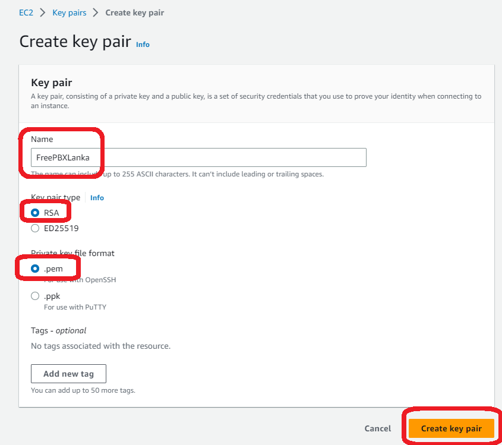

# FreePBX Server on AWS
[](https://github.com/lankahsu520/HelperX)
[![GitHub license][license-image]][license-url]
[![GitHub stars][stars-image]][stars-url]
[![GitHub forks][forks-image]][forks-url]
[![GitHub issues][issues-image]][issues-image]
[![GitHub watchers][watchers-image]][watchers-image]

[license-image]: https://img.shields.io/github/license/lankahsu520/HelperX.svg
[license-url]: https://github.com/lankahsu520/HelperX/blob/master/LICENSE
[stars-image]: https://img.shields.io/github/stars/lankahsu520/HelperX.svg
[stars-url]: https://github.com/lankahsu520/HelperX/stargazers
[forks-image]: https://img.shields.io/github/forks/lankahsu520/HelperX.svg
[forks-url]: https://github.com/lankahsu520/HelperX/network
[issues-image]: https://img.shields.io/github/issues/lankahsu520/HelperX.svg
[issues-url]: https://github.com/lankahsu520/HelperX/issues
[watchers-image]: https://img.shields.io/github/watchers/lankahsu520/HelperX.svg
[watchers-url]: https://github.com/lankahsu520/HelperX/watchers

> 目前照著網路大作操作後，還是失敗收場，希望有成功之士能告知一二。

# 1. FreePBX Server on AWS (Fail)

## 1.1. [EC2 Key Pairs](https://us-east-1.console.aws.amazon.com/ec2/home?region=us-east-1#KeyPairs:)




## 1.2. [EC2 Instances](https://us-east-1.console.aws.amazon.com/ec2/home?region=us-east-1#Instances:)


## 1.3. SSH Connect


## 1.4. [Setup FreePBX](https://cloudinfrastructureservices.co.uk/how-to-setup-freepbx-on-azure-aws-gcp/)

```bash
sudo -i
```
### 1.4.1. Setup FreePBX MySQL Database Connection

```bash
cat <<EOF > /etc/odbcinst.ini
[MySQL]
Description = ODBC for MySQL (MariaDB)
Driver = /usr/local/lib/libmaodbc.so
FileUsage = 1
EOF
```

```bash
cat <<EOF > /etc/odbc.ini
[MySQL-asteriskcdrdb]
Description = MySQL connection to 'asteriskcdrdb' database
Driver = MySQL
Server = localhost
Database = asteriskcdrdb
Port = 3306
Socket = /var/run/mysqld/mysqld.sock
EOF
```

### 1.4.2. Start FreePBX Server

```bash
cd /usr/src
wget http://mirror.freepbx.org/modules/packages/freepbx/freepbx-15.0-latest.tgz
tar vxfz freepbx-15.0-latest.tgz
rm -f freepbx-15.0-latest.tgz
touch /etc/asterisk/{modules,cdr}.conf
cd freepbx
./start_asterisk start
./install -n

```

### 1.4.3. Setup FreePBX SMTP Alerts (Postfix)

```bash
rm /var/lib/dpkg/lock*
rm /var/cache/apt/archives/lock
rm /var/lib/apt/lists/lock

sudo apt-get update
sudo apt-get install postfix -y

```

```bash
# Authentication to Postfix
$ nano /etc/postfix/main.cf
```

- main.cf

```main.cf
relayhost = [smtp.gmail.com]:587
smtp_sasl_auth_enable = yes
smtp_sasl_password_maps = hash:/etc/postfix/sasl_passwd
smtp_sasl_security_options = noanonymous
smtp_use_tls = yes
```

```bash
$ nano /etc/postfix/sasl_passwd
```

- sasl_passwd

```sasl_passwd
[smtp.gmail.com]:587 lankahsu@gmail.com:lankahsu520

```

```bash
$ postmap hash:/etc/postfix/sasl_passwd
$ sudo postfix reload
$ lsof -i :25
COMMAND    PID USER   FD   TYPE DEVICE SIZE/OFF NODE NAME
sendmail- 1461 root    4u  IPv4  22088      0t0  TCP localhost:smtp (LISTEN)
$ kill -9 1461
$ apt-get install -y mailutils
$ sudo postfix start

# Force postfix to rewrite from address
# For ISPs like 1and1 that will reject the message if the from user and the sending 
# user don't match you can add these rules to /etc/postfix/generic replacing all 
# "emailfromaddress@real-domain.com" with the real data used above for authentication.
$ nano /etc/postfix/generic
```

- generic

```generic
root lankahsu@gmail.com
root@localhost lankahsu@gmail.com
root@localhost.localdomain lankahsu@gmail.com
root@freepbx lankahsu@gmail.com
root@freepbx.localdomain lankahsu@gmail.com
asterisk lankahsu@gmail.com
asterisk@localhost lankahsu@gmail.com
asterisk@localhost.localdomain lankahsu@gmail.com
asterisk@freepbx lankahsu@gmail.com
asterisk@freepbx.localdomain lankahsu@gmail.com
vm@asterisk lankahsu@gmail.com
```

```bash
$ nano /etc/postfix/main.cf

```

- main.cf

```main.cf
# Add the following to the end of /etc/postfix/main.cf 
smtp_generic_maps = hash:/etc/postfix/generic

```

```bash
$ postmap /etc/postfix/generic
$ service postfix restart
```

## 1.5. Browse the Web of FreePBXLanka


### 1.51. Applications / Extensions / SIP[chan_pjsip] Extensions

#### A. Add New SIP [chan_pjsip] Extension

```cfg
User Extension: 0000
Display Name: lanka
Outbound CID: +19990000000
Secret: c5b30a90f21574a5fbf5c11ed64b6abe

Username: lanka
Password For New User: 0360525df6e60c6ce339ed280e9551c9
```

### 1.5.2. Settings / Asterisk SIP Settings

#### A. SIP Settings [chan_pjsip]

##### A.1. udp

```cfg
udp - 0.0.0.0 - All

```

##### A.2. 0.0.0.0 (udp)

```cfg
Port to Listen On: 5060

```

##### A.3. TLS/SSL/SRTP Settings

> SIP Trunk using TLS

```cfg
Certificate Manager: default
SSL Method: tlsv1_2
Verify Client: Yes
Verify Server: No
```

### 1.5.3. Connectivity / Trunks 

#### A. Add Trunk / Add SIP(chan_pjsip) Trunk

##### A.1. General

```cfg
Trunk Name: Trunk_to_Amazon_VC

Maximum Channels: 10
```

##### A.2. pjsip Settings / General

```cfg
Authentication: None
SIP Server: ec2-3-89-33-36.compute-1.amazonaws.com
SIP Server Port: 5060
Context: from-pstn
Transport: 0.0.0.0-udp
```

or

```cfg
SIP Server Port: 5061
Context: from-pstn
Transport: 0.0.0.0-tls
```

##### A.3. pjsip Settings / Advanced

```cfg
Qualify Frequency: 60
From Domain: ec2-3-89-33-36.compute-1.amazonaws.com
Send RPID/PAI: Send-P-Asserted-Identity header
```

##### A.4. pjsip Settings / Codes

### 1.5.4. Connectivity / Outbound Routes

#### A. Add Outbound Route

##### A.1. Route Setting

```cfg
Route Name: Route_To_AmazonVC
Trunk Sequence for Matched Routes: Trunk_to_Amazon_VC
```

##### A.2. Dial Patterns

```cfg
+1,9,9999XXXXXXX,
```

### 1.5.5. Connectivity / Outbound Routes

#### A. Add Inbound Route

```cfg
Description: InboundRouteforAmazonVC
Set Destination: 0000 9990000000
```

# 2. Phone2SIP

>其實上面的步驟做完之後，去查看網路port 開放狀況 nmap -sNU localhost，馬上知道結果。
>
>其實我後來有去將 ec2 Inbound rules 和 Outbound rules 全部開放也沒有，因為 5060 沒有 Listen，開這些有用哦！爛東西！然後呢？然後呢？
>
>後續網路也沒有介紹如何連結至 FreePBX，爛！

# Appendix

# I. Study

## I.1. Youtube - [How to Setup FreePBX Server on AWS (VoIP Asterisk Solution)](https://www.youtube.com/watch?v=MVoI8Qv5tFU)

## I.2. [How to Install FreePBX on Ubuntu 20.04 (Open Source PBX Tutorial)](https://cloudinfrastructureservices.co.uk/how-to-install-freepbx-on-ubuntu-20-04/)

## I.6. [How to Setup FreePBX Server on Azure/AWS/GCP (FreePBX Hosting)](https://cloudinfrastructureservices.co.uk/how-to-setup-freepbx-on-azure-aws-gcp/)

# II. Debug

# III. Glossary

# IV. Tool Usage

# V. ErrorNO

# Author

> Created and designed by [Lanka Hsu](lankahsu@gmail.com).

# License

> [HelperX](https://github.com/lankahsu520/HelperX) is available under the BSD-3-Clause license. See the LICENSE file for more info.

