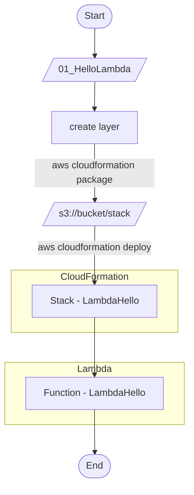
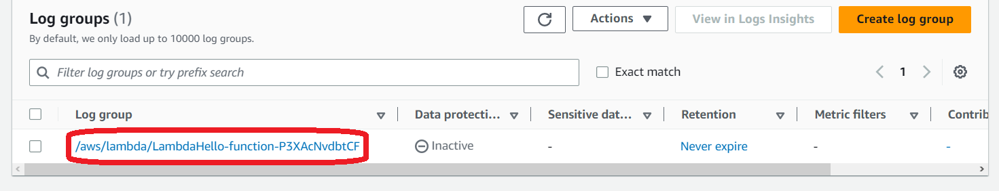
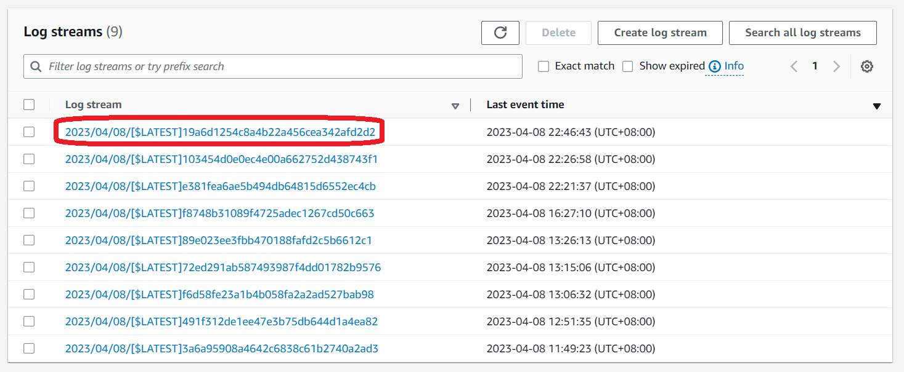
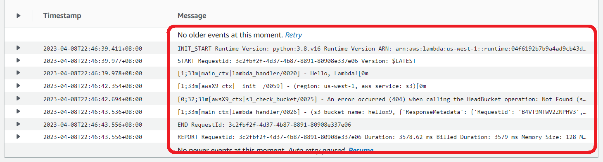
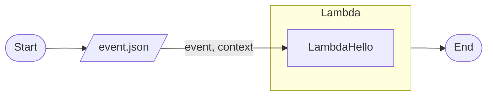
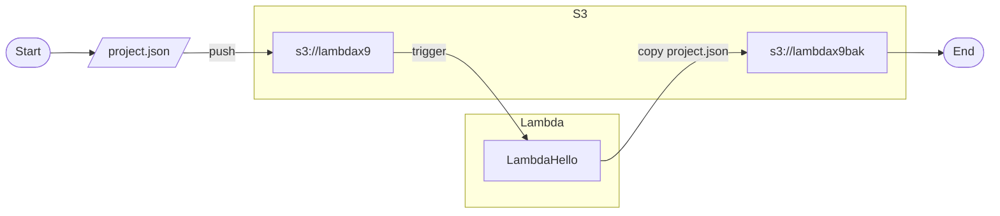
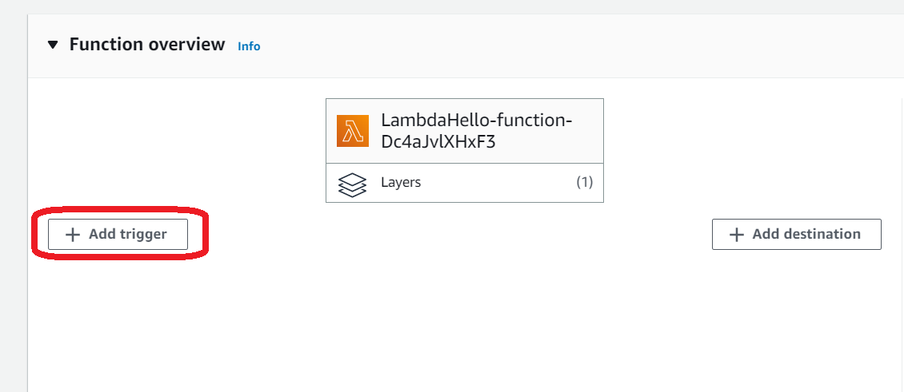
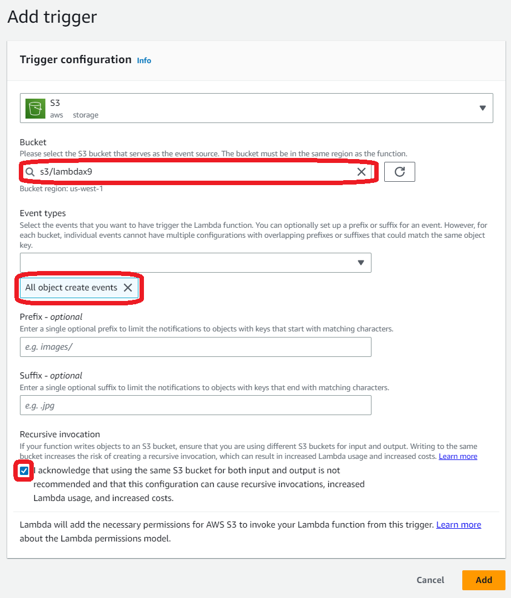

# [AWS Lambda](https://aws.amazon.com/tw/lambda/?nc1=h_ls)

[](https://github.com/lankahsu520/HelperX)
[![GitHub license][license-image]][license-url]
[![GitHub stars][stars-image]][stars-url]
[![GitHub forks][forks-image]][forks-url]
[![GitHub issues][issues-image]][issues-image]
[![GitHub watchers][watchers-image]][watchers-image]

[license-image]: https://img.shields.io/github/license/lankahsu520/HelperX.svg
[license-url]: https://github.com/lankahsu520/HelperX/blob/master/LICENSE
[stars-image]: https://img.shields.io/github/stars/lankahsu520/HelperX.svg
[stars-url]: https://github.com/lankahsu520/HelperX/stargazers
[forks-image]: https://img.shields.io/github/forks/lankahsu520/HelperX.svg
[forks-url]: https://github.com/lankahsu520/HelperX/network
[issues-image]: https://img.shields.io/github/issues/lankahsu520/HelperX.svg
[issues-url]: https://github.com/lankahsu520/HelperX/issues
[watchers-image]: https://img.shields.io/github/watchers/lankahsu520/HelperX.svg
[watchers-url]: https://github.com/lankahsu520/HelperX/watchers

# 1. [AWS Lambda (Developer Guide)](https://docs.aws.amazon.com/zh_tw/lambda/latest/dg/welcome.html)

> Run code without thinking about servers or clusters

> 一般我們寫程式，都是稱為 application，而 Lambda 是稱為 function. 

## 1.1. How it works

#### A. File processing

#### B. Stream processing

#### C. Web applications

#### D. IoT backends

#### E. Mobile backends


# 2. Sample

## 2.1. Hello world (on console)

### 2.1.1. Create and Execution

#### A. Sign in as IAM user

> **Account ID (12 digits)** : 123456789012
>
> 請先登入 https://123456789012.signin.aws.amazon.com/console


#### B. [AWS Lambda](https://us-west-1.console.aws.amazon.com/lambda/home?region=us-west-1#/)


#### C. Create function


##### C.1. index.js

```node.js
console.log('Loading function');

exports.handler = async (event, context) => {
    //console.log('Received event:', JSON.stringify(event, null, 2));
    console.log('value1 =', event.key1);
    console.log('value2 =', event.key2);
    console.log('value3 =', event.key3);
    return event.key1;  // Echo back the first key value
    // throw new Error('Something went wrong');
};

```

##### C.2. lambda_function.py

```python
import json

print('Loading function')


def lambda_handler(event, context):
    #print("Received event: " + json.dumps(event, indent=2))
    print("value1 = " + event['key1'])
    print("value2 = " + event['key2'])
    print("value3 = " + event['key3'])
    return event['key1']  # Echo back the first key value
    #raise Exception('Something went wrong')

```


#### D. create a test event - SAVE / TEST


#### E. Execution result


### 2.1.2. [CloudWatch](https://us-west-1.console.aws.amazon.com/cloudwatch/home?region=us-west-1#)

> 特別注意，在 [CloudWatch](https://us-west-1.console.aws.amazon.com/cloudwatch/home?region=us-west-1#) 中傳遞的 event 都是用 '字串'。
>
> 一般 JSON都是使用 "字串"


### 2.1.3. [IAM](https://us-east-1.console.aws.amazon.com/iamv2/home?region=us-east-1#/roles)


## 2.2. [aws-lambda-developer-guide](https://github.com/awsdocs/aws-lambda-developer-guide)

> 這邊不幫忙演示其操作。請閱讀內部的 README.md。

# 3. How to Become a AWS Lambda Collaborator

## 3.1. [LambdaHello](https://github.com/lankahsu520/LambdaHello)
> 先從一個簡單的 開始。學會部署第一隻程式至 Lambda。
> 因為部署的方式很多種，至於學習那一種，就要看自己的選擇。
- [LambdaHello](https://github.com/lankahsu520/LambdaHello) / [01_HelloLambda](https://github.com/lankahsu520/LambdaHello/tree/main/01_HelloLambda) 



#### A. 學習目標

##### A.1. Deploy 部署

> 這邊透過 [CloudFormation ](https://us-west-1.console.aws.amazon.com/cloudformation/home?region=us-west-1#/) 進行部署。

##### A.2. 撰寫 Makefile 

> 建議使用 Makefile，可以建立depend 的關係。Shell Script 感覺會比較混亂。

##### A.3. Run on local

> 在 Deploy  前，記得在本地端執行。 

##### A.4. Debug by [CloudWatch](https://us-west-1.console.aws.amazon.com/cloudwatch/home?region=us-west-1#)

> deploy 之前記得在 Local 執行，查看相關 log messages。部署後也要再從 [CloudWatch](https://us-west-1.console.aws.amazon.com/cloudwatch/home?region=us-west-1#) 中確認。





## 3.2. Handle event, context
> 新增 event.json 和模擬參數傳遞
- [LambdaHello](https://github.com/lankahsu520/LambdaHello) / [02_HelloLambda_with_payload](https://github.com/lankahsu520/LambdaHello/tree/main/02_HelloLambda_with_payload)


## 3.3. Lambda and S3

> 已經知道擺放程式和參數傳遞之後，就是要學習怎麼亙動。([Tutorial: Using an Amazon S3 trigger to invoke a Lambda function](https://docs.aws.amazon.com/lambda/latest/dg/with-s3-example.html))
> 本範例：
>
> 1. 上傳檔案至 s3://lambdax9
> 2. Trigger function - LambdaHello
> 3. 將檔案複製至 s3://lambdax9bak
- [LambdaHello](https://github.com/lankahsu520/LambdaHello) / [03_HelloLambda_rw_s3](https://github.com/lankahsu520/LambdaHello/tree/main/03_HelloLambda_rw_s3)





#### A. 學習目標

##### A.1. Create Trigger

> 這邊用 S3 當範例，因為 S3 裏的檔案變動，利用 aws cli 就可以了。

```bash
$ S3_BUCKET_NAME=lambdax9bak; aws-ls
$ S3_BUCKET_NAME=lambdax9; aws-ls
$ S3_BUCKET_NAME=lambdax9; aws-push out.yml
$ S3_BUCKET_NAME=lambdax9; aws-rm out.yml

```

## 3.4. Deploy S3 trigger

> 之前已經學會 deploy，前段也用 Console 設定了相關 Trigger ，那為什麼還要進行這章節。
> 主要是希望把整個流程和程式當成一個專案進行部署。不知各位在公司定版時，進行程式部署時，是否還要一個員工，這個 Console 按按，那個 Console 按按。
>
> 總會有人挑戰我，你只會  S3 哦，其它呢？其它呢？
>
> 我又不是 AWS 專案，也不是它們的員工，我也是做中學，學中做。

- [LambdaHello](https://github.com/lankahsu520/LambdaHello) / [04_HelloLambda_deployS3trigger](https://github.com/lankahsu520/LambdaHello/tree/main/04_HelloLambda_deployS3trigger)

#### A. 學習目標

##### A.1. 一鍵部署

> 當所有的步驟達到“一鍵部署”之後，才有可能進行下一步“自動部署”。

##### A.2. 一鍵刪除部署

> 記住 AWS 所有的東西都要錢；部署後，一定會忘了曾經做過什麼，所以學會“一鍵部署“是很重要的，而“一鍵刪除部署”更是能解決不需要的燒錢功能。

# Appendix

# I. Study

> 目前網路上並沒有發現善心人士的心得，只能專心於官方提供的文件

#### A. Official - [AWS Lambda (Developer Guide)](https://docs.aws.amazon.com/lambda/latest/dg/welcome.html)

#### B. [Python for AWS Lambda Functions: A Beginner’s Guide](https://codesolid.com/python-and-aws-lambda-functions/)

# II. Debug

#### A. An error occurred (ValidationError) when calling the CreateChangeSet operation: Stack:arn:aws:cloudformation:eu-west-1:123456789012:stack/blank520/5270ab20-d557-11ed-afb2-0a14943d5521 is in ROLLBACK_COMPLETE state and can not be updated.

```bash
# 修改 region
$ vi ~/.aws/config
region =

```

#### B. json.decoder.JSONDecodeError: Expecting property name enclosed in double quotes: line 2 column 2 (char 3)

>python json.load 時發生此問題時，to replace ' -> "

# III. Glossary

####  AI, Artificial Intelligence

>人工智慧 (AI) 是電腦科學的一個領域，致力於解決與人類智慧相關的常見認知問題，例如學習、解決問題和模式辨識。人工智慧 (通常簡稱為 "AI") 呈現出機器人或未來世界的景像，也就是說，AI 不再是科幻小說中虛構的機器人，而真正成為現代高階電腦科學中的現實。

#### [CSAT, Customer satisfaction][1]

[1]: https://www.qualtrics.com/hk/experience-management/customer/what-is-csat/ "qualtrics"
>CSAT是[顧客滿意度](https://www.qualtrics.com/au/experience-management/customer/customer-satisfaction/)得分的簡稱。它是商業上經常使用的一個指標，在所有類型的企業中，都可以以CSAT作為客戶服務和產品質量的關鍵績效指標。雖然顧客滿意度是一個籠統的概念，但CSAT可以將其轉化成更明確的指標，以百分比表示。例如，100%是非常好的，而0%則是非常糟糕的。

#### ML, Machine Learning

>是一項用於建立機器學習模型並產生預測結果的受管服務，可協助開發穩定且可擴展的智慧應用程式。

# IV. Tool Usage


# Author

Created and designed by [Lanka Hsu](lankahsu@gmail.com).

# License

[HelperX](https://github.com/lankahsu520/HelperX) is available under the BSD-3-Clause license. See the LICENSE file for more info.
