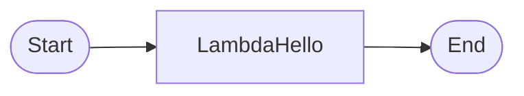

# [AWS Lambda](https://aws.amazon.com/tw/lambda/?nc1=h_ls)

[](https://github.com/lankahsu520/HelperX)
[![GitHub license][license-image]][license-url]
[![GitHub stars][stars-image]][stars-url]
[![GitHub forks][forks-image]][forks-url]
[![GitHub issues][issues-image]][issues-image]
[![GitHub watchers][watchers-image]][watchers-image]

[license-image]: https://img.shields.io/github/license/lankahsu520/HelperX.svg
[license-url]: https://github.com/lankahsu520/HelperX/blob/master/LICENSE
[stars-image]: https://img.shields.io/github/stars/lankahsu520/HelperX.svg
[stars-url]: https://github.com/lankahsu520/HelperX/stargazers
[forks-image]: https://img.shields.io/github/forks/lankahsu520/HelperX.svg
[forks-url]: https://github.com/lankahsu520/HelperX/network
[issues-image]: https://img.shields.io/github/issues/lankahsu520/HelperX.svg
[issues-url]: https://github.com/lankahsu520/HelperX/issues
[watchers-image]: https://img.shields.io/github/watchers/lankahsu520/HelperX.svg
[watchers-url]: https://github.com/lankahsu520/HelperX/watchers

# 1. [AWS Lambda (Developer Guide)](https://docs.aws.amazon.com/zh_tw/lambda/latest/dg/welcome.html)

> Run code without thinking about servers or clusters

> 一般我們寫程式，都是稱為 application，而 Lambda 是稱為 function. 

## 1.1. How it works

#### A. File processing

#### B. Stream processing

#### C. Web applications

#### D. IoT backends

#### E. Mobile backends


# 2. Sample

## 2.1. Hello world (on console)

### 2.1.1. Create and Execution

#### A. Sign in as IAM user

> **Account ID (12 digits)** : 123456789012
>
> 請先登入 https://123456789012.signin.aws.amazon.com/console


#### B. [AWS Lambda](https://us-west-1.console.aws.amazon.com/lambda/home?region=us-west-1#/)


#### C. Create function


##### C.1. index.js

```node.js
console.log('Loading function');

exports.handler = async (event, context) => {
    //console.log('Received event:', JSON.stringify(event, null, 2));
    console.log('value1 =', event.key1);
    console.log('value2 =', event.key2);
    console.log('value3 =', event.key3);
    return event.key1;  // Echo back the first key value
    // throw new Error('Something went wrong');
};

```

##### C.2. lambda_function.py

```python
import json

print('Loading function')


def lambda_handler(event, context):
    #print("Received event: " + json.dumps(event, indent=2))
    print("value1 = " + event['key1'])
    print("value2 = " + event['key2'])
    print("value3 = " + event['key3'])
    return event['key1']  # Echo back the first key value
    #raise Exception('Something went wrong')

```


#### D. create a test event - SAVE / TEST


#### E. Execution result


### 2.1.2. [CloudWatch](https://us-west-1.console.aws.amazon.com/cloudwatch/home?region=us-west-1#)


### 2.1.3. [IAM](https://us-east-1.console.aws.amazon.com/iamv2/home?region=us-east-1#/roles)


## 2.2. [aws-lambda-developer-guide](https://github.com/awsdocs/aws-lambda-developer-guide)

> Blank 函數範例應用程式利用一個呼叫 Lambda API 的函數來示範 Lambda 中的一般操作。它示範如何使用記錄、環境變數、AWS X-Ray 追蹤、Layer、單元測試和 AWS 開發套件。探索此應用程式可了解如何使用您的程式設計語言建置 Lambda 函數，或以它做為自有專案的起點。
>
> follow the README.md

#### A. To download

```bash
$ git clone https://github.com/awsdocs/aws-lambda-developer-guide.git
$ cd aws-lambda-developer-guide/sample-apps/blank-python

$ pip3 install jsonpickle
$ pip3 install aws_xray_sdk
$ pip3 install boto3
$ pip3 install testresources
$ pip3 install --upgrade launchpadlib
```
#### B. To Run on local

##### B.1. sample-apps\blank-python\function\lambda_function.test.py

> fix event = jsonpickle.decode(ba) raise TypeError("Input string must be text, not bytes")

```bash
$ vi sample-apps\blank-python\function\lambda_function.test.py

		try:
      ba = bytearray(file.read())
      event = jsonpickle.decode(ba.decode('utf-8'))
      logger.warning('## EVENT')
      logger.warning(jsonpickle.encode(event))

```

##### B.2. Run

```
$ ./0-run-tests.sh
## EVENT
{"Records": [{"messageId": "19dd0b57-b21e-4ac1-bd88-01bbb068cb78", "receiptHandle": "MessageReceiptHandle", "body": "Hello from SQS!", "attributes": {"ApproximateReceiveCount": "1", "SentTimestamp": "1523232000000", "SenderId": "123456789012", "ApproximateFirstReceiveTimestamp": "1523232000001"}, "messageAttributes": {}, "md5OfBody": "7b270e59b47ff90a553787216d55d91d", "eventSource": "aws:sqs", "eventSourceARN": "arn:aws:sqs:us-west-2:123456789012:MyQueue", "awsRegion": "us-west-2"}]}
{'TotalCodeSize': 773, 'FunctionCount': 2}
.
----------------------------------------------------------------------
Ran 1 test in 0.146s

OK

```
#### C. To create a new bucket (It will create a new bucket in S3)
```bash
$ ./1-create-bucket.sh
make_bucket: lambda-artifacts-5d63c7b31336e36e

```

#### D. To build a Lambda layer

```bash
$ ./2-build-layer.sh
Collecting jsonpickle==1.3
  Using cached jsonpickle-1.3-py2.py3-none-any.whl (32 kB)
Collecting aws-xray-sdk==2.4.3
  Using cached aws_xray_sdk-2.4.3-py2.py3-none-any.whl (87 kB)
Collecting wrapt
  Using cached wrapt-1.15.0-cp38-cp38-manylinux_2_5_x86_64.manylinux1_x86_64.manylinux_2_17_x86_64.manylinux2014_x86_64.whl (81 kB)
Collecting botocore>=1.11.3
  Using cached botocore-1.29.103-py3-none-any.whl (10.6 MB)
Processing /home/lanka/.cache/pip/wheels/a0/0b/ee/e6994fadb42c1354dcccb139b0bf2795271bddfe6253ccdf11/future-0.18.3-py3-none-any.whl
Collecting jmespath<2.0.0,>=0.7.1
  Using cached jmespath-1.0.1-py3-none-any.whl (20 kB)
Collecting urllib3<1.27,>=1.25.4
  Using cached urllib3-1.26.15-py2.py3-none-any.whl (140 kB)
Collecting python-dateutil<3.0.0,>=2.1
  Using cached python_dateutil-2.8.2-py2.py3-none-any.whl (247 kB)
Collecting six>=1.5
  Using cached six-1.16.0-py2.py3-none-any.whl (11 kB)
Installing collected packages: jsonpickle, wrapt, jmespath, urllib3, six, python-dateutil, botocore, future, aws-xray-sdk
Successfully installed aws-xray-sdk-2.4.3 botocore-1.29.103 future-0.18.3 jmespath-1.0.1 jsonpickle-1.3 python-dateutil-2.8.2 six-1.16.0 urllib3-1.26.15 wrapt-1.15.0

```

#### E. To deploy the application

```bash
$ ./3-deploy.sh
Uploading to 3115f4e1f511ea0befef6922e2716e34  13160846 / 13160846.0  (100.00%)
Successfully packaged artifacts and wrote output template to file out.yml.
Execute the following command to deploy the packaged template
aws cloudformation deploy --template-file /work/codebase/xbox/AWS/AWSLambda/aws-lambda-developer-guide/sample-apps/blank-python/out.yml --stack-name <YOUR STACK NAME>

Waiting for changeset to be created..
Waiting for stack create/update to complete

Successfully created/updated stack - blank-python

```

#### F. To invoke the function

```bash
# add cli_binary_format=raw-in-base64-out, to fix Invalid base64
$ cat ~/.aws/config
[default]
region = us-west-1
output = json
cli_binary_format=raw-in-base64-out

```

```bash
./4-invoke.sh
{
    "StatusCode": 200,
    "ExecutedVersion": "$LATEST"
}
{"TotalCodeSize": 26325013, "FunctionCount": 3}
{
    "StatusCode": 200,
    "ExecutedVersion": "$LATEST"
}
{"TotalCodeSize": 26325013, "FunctionCount": 3}

```

#### G. To delete the application

```bash
$ ./5-cleanup.sh
Deleted blank-python stack.
Delete deployment artifacts and bucket (lambda-artifacts-936c7a7b0eed2088)? (y/n)y
delete: s3://lambda-artifacts-936c7a7b0eed2088/d80ce43fb31ca44632b5b761801203cb
delete: s3://lambda-artifacts-936c7a7b0eed2088/3115f4e1f511ea0befef6922e2716e34
remove_bucket: lambda-artifacts-936c7a7b0eed2088
Delete function log group (/aws/lambda/blank-python-function-F75ut0BBpl5x)? (y/n)y

```

## 2.3. [LambdaHello](https://github.com/lankahsu520/LambdaHello)

> 一個簡單的 Hello, Lambda!

# 3. How to Become a AWS Lambda Collaborator

## 3.1. [LambdaHello](https://github.com/lankahsu520/LambdaHello)

> 先從一個簡單的 [LambdaHello](https://github.com/lankahsu520/LambdaHello) 開始。學會佈署第一隻程式至 Lambda。
>
> 因為佈署的方式很多種，至於學習那一種，就要看自己的選擇。



## 3.2. Handle event, context
> 參數傳遞


# Appendix

# I. Study

> 目前網路上並沒有發現善心人士的心得，只能專心於官方提供的文件

#### A. Official - [AWS Lambda (Developer Guide)](https://docs.aws.amazon.com/lambda/latest/dg/welcome.html)

#### B. [Python for AWS Lambda Functions: A Beginner’s Guide](https://codesolid.com/python-and-aws-lambda-functions/)

# II. Debug

#### A. An error occurred (ValidationError) when calling the CreateChangeSet operation: Stack:arn:aws:cloudformation:eu-west-1:123456789012:stack/blank520/5270ab20-d557-11ed-afb2-0a14943d5521 is in ROLLBACK_COMPLETE state and can not be updated.

```bash
# 修改 region
$ vi ~/.aws/config
region =

```

# III. Glossary

####  AI, Artificial Intelligence

>人工智慧 (AI) 是電腦科學的一個領域，致力於解決與人類智慧相關的常見認知問題，例如學習、解決問題和模式辨識。人工智慧 (通常簡稱為 "AI") 呈現出機器人或未來世界的景像，也就是說，AI 不再是科幻小說中虛構的機器人，而真正成為現代高階電腦科學中的現實。

#### [CSAT, Customer satisfaction][1]

[1]: https://www.qualtrics.com/hk/experience-management/customer/what-is-csat/ "qualtrics"
>CSAT是[顧客滿意度](https://www.qualtrics.com/au/experience-management/customer/customer-satisfaction/)得分的簡稱。它是商業上經常使用的一個指標，在所有類型的企業中，都可以以CSAT作為客戶服務和產品質量的關鍵績效指標。雖然顧客滿意度是一個籠統的概念，但CSAT可以將其轉化成更明確的指標，以百分比表示。例如，100%是非常好的，而0%則是非常糟糕的。

#### ML, Machine Learning

>是一項用於建立機器學習模型並產生預測結果的受管服務，可協助開發穩定且可擴展的智慧應用程式。

# IV. Tool Usage


# Author

Created and designed by [Lanka Hsu](lankahsu@gmail.com).

# License

[HelperX](https://github.com/lankahsu520/HelperX) is available under the BSD-3-Clause license. See the LICENSE file for more info.
