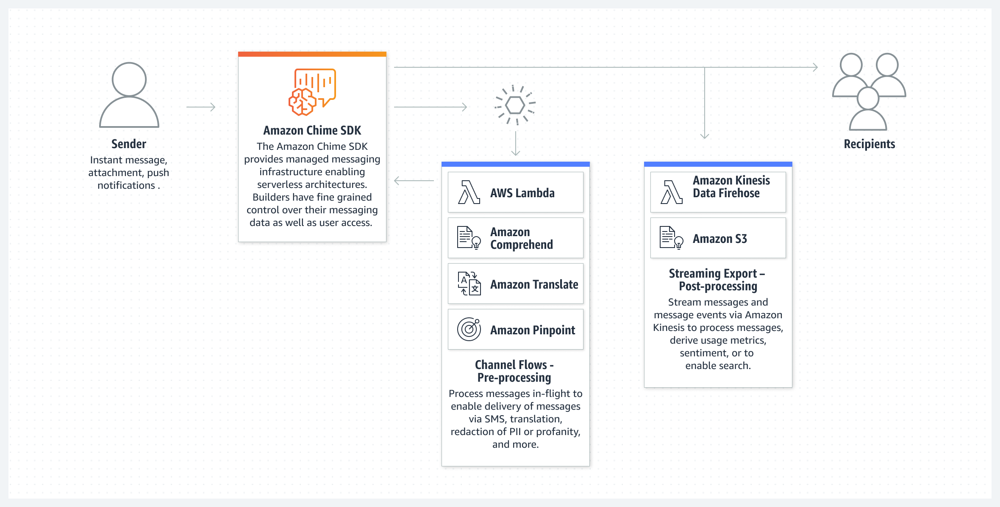

# [Amazon Chime](https://aws.amazon.com/tw/chime/)

[![GitHub license][license-image]][license-url]
[![GitHub stars][stars-image]][stars-url]
[![GitHub forks][forks-image]][forks-url]
[![GitHub issues][issues-image]][issues-image]
[![GitHub watchers][watchers-image]][watchers-image]

[license-image]: https://img.shields.io/github/license/lankahsu520/HelperX.svg
[license-url]: https://github.com/lankahsu520/HelperX/blob/master/LICENSE
[stars-image]: https://img.shields.io/github/stars/lankahsu520/HelperX.svg
[stars-url]: https://github.com/lankahsu520/HelperX/stargazers
[forks-image]: https://img.shields.io/github/forks/lankahsu520/HelperX.svg
[forks-url]: https://github.com/lankahsu520/HelperX/network
[issues-image]: https://img.shields.io/github/issues/lankahsu520/HelperX.svg
[issues-url]: https://github.com/lankahsu520/HelperX/issues
[watchers-image]: https://img.shields.io/github/watchers/lankahsu520/HelperX.svg
[watchers-url]: https://github.com/lankahsu520/HelperX/watchers

# 1. [Amazon Chime (Administration Guide)](https://docs.aws.amazon.com/chime/latest/ag/what-is-chime.html)

## 1.1. [Amazon Chime SDK](https://aws.amazon.com/chime/chime-sdk/)

> Embed intelligent real-time communication capabilities into your applications

#### A. PSTN Audio

#### B. SIP Trunking

#### C. Messaging

#### D. WebRTC with Live Transcription

#### E. WebRTC with Live PSTN Audio

# Appendix

# I. Study

> 目前網路上並沒有發現善心人士的心得，只能專心於官方提供的文件

## I.1. Official - [Amazon Chime (Administration Guide)](https://docs.aws.amazon.com/chime/latest/ag/what-is-chime.html)

## I.2. Official - [Amazon Chime (User Guide)](https://docs.aws.amazon.com/chime/latest/ug/what-is-chime.html)

## I.3. Official - [Amazon Chime SDK (Developer Guide)](https://docs.aws.amazon.com/chime-sdk/latest/dg/what-is-chime-sdk.html)

## I.4. Official - [Amazon Chime SDK resources](https://aws.amazon.com/chime/chime-sdk/resources/)

## I.5. [Add conversational AI to any contact center with Amazon Lex and the Amazon Chime SDK](https://aws.amazon.com/tw/blogs/machine-learning/add-conversational-ai-to-any-contact-center-with-amazon-lex-and-the-amazon-chime-sdk/)

## I.6. [amazon-chime-pstn-audio-with-amazon-lex](https://github.com/aws-samples/amazon-chime-pstn-audio-with-amazon-lex)

# II. Debug

# III. Glossary

# IV. Tool Usage

# Author

Created and designed by [Lanka Hsu](lankahsu@gmail.com).

# License

[HelperX](https://github.com/lankahsu520/HelperX) is available under the BSD-3-Clause license. See the LICENSE file for more info.
