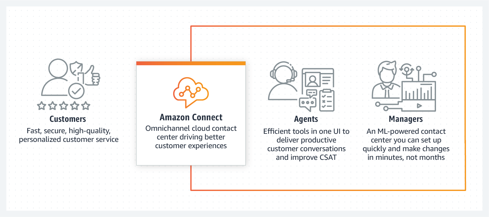

# [Amazon Connect](https://aws.amazon.com/tw/connect/)

[![GitHub license][license-image]][license-url]
[![GitHub stars][stars-image]][stars-url]
[![GitHub forks][forks-image]][forks-url]
[![GitHub issues][issues-image]][issues-image]
[![GitHub watchers][watchers-image]][watchers-image]

[license-image]: https://img.shields.io/github/license/lankahsu520/HelperX.svg
[license-url]: https://github.com/lankahsu520/HelperX/blob/master/LICENSE
[stars-image]: https://img.shields.io/github/stars/lankahsu520/HelperX.svg
[stars-url]: https://github.com/lankahsu520/HelperX/stargazers
[forks-image]: https://img.shields.io/github/forks/lankahsu520/HelperX.svg
[forks-url]: https://github.com/lankahsu520/HelperX/network
[issues-image]: https://img.shields.io/github/issues/lankahsu520/HelperX.svg
[issues-url]: https://github.com/lankahsu520/HelperX/issues
[watchers-image]: https://img.shields.io/github/watchers/lankahsu520/HelperX.svg
[watchers-url]: https://github.com/lankahsu520/HelperX/watchers

# 1. [Amazon Connect (Administrator Guide)](https://docs.aws.amazon.com/connect/latest/adminguide/what-is-amazon-connect.html)

## 1.1. How it works

> 剛開始接觸時，完全搞不清能帶來什跨時代的進步；就舉客服中心為例，客戶+一通電話+客服專員，三個元素加起來便可進行一連串的亙動，而 Connect 的導入是否真的有任何幫助？目前所知甚少，只能繼續看下去。

## 1.2. AWS and Amazon Connect

# Appendix

# I. Study

> 目前網路上並沒有發現善心人士的心得，只能專心於官方提供的文件

## I.1. Official - [Amazon Connect (Administrator Guide)](https://docs.aws.amazon.com/connect/latest/adminguide/what-is-amazon-connect.html)

# II. Debug

# III. Glossary

####  AI, Artificial Intelligence

>人工智慧 (AI) 是電腦科學的一個領域，致力於解決與人類智慧相關的常見認知問題，例如學習、解決問題和模式辨識。人工智慧 (通常簡稱為 "AI") 呈現出機器人或未來世界的景像，也就是說，AI 不再是科幻小說中虛構的機器人，而真正成為現代高階電腦科學中的現實。

#### [CSAT, Customer satisfaction][1]

[1]: https://www.qualtrics.com/hk/experience-management/customer/what-is-csat/ "qualtrics"
>CSAT是[顧客滿意度](https://www.qualtrics.com/au/experience-management/customer/customer-satisfaction/)得分的簡稱。它是商業上經常使用的一個指標，在所有類型的企業中，都可以以CSAT作為客戶服務和產品質量的關鍵績效指標。雖然顧客滿意度是一個籠統的概念，但CSAT可以將其轉化成更明確的指標，以百分比表示。例如，100%是非常好的，而0%則是非常糟糕的。

#### ML, Machine Learning

>是一項用於建立機器學習模型並產生預測結果的受管服務，可協助開發穩定且可擴展的智慧應用程式。

# IV. Tool Usage

# Author

> Created and designed by [Lanka Hsu](lankahsu@gmail.com).

# License

> [HelperX](https://github.com/lankahsu520/HelperX) is available under the BSD-3-Clause license. See the LICENSE file for more info.
