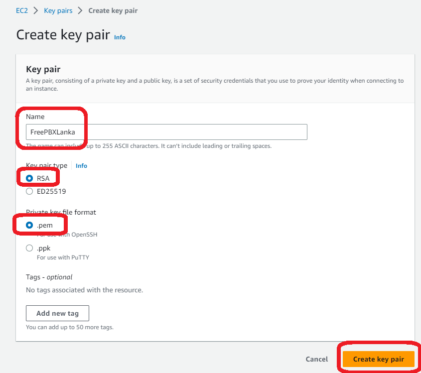
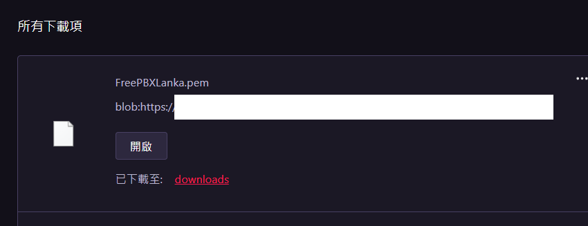

# [Amazon EC2](https://aws.amazon.com/tw/ec2/)

[](https://github.com/lankahsu520/HelperX)
[![GitHub license][license-image]][license-url]
[![GitHub stars][stars-image]][stars-url]
[![GitHub forks][forks-image]][forks-url]
[![GitHub issues][issues-image]][issues-image]
[![GitHub watchers][watchers-image]][watchers-image]

[license-image]: https://img.shields.io/github/license/lankahsu520/HelperX.svg
[license-url]: https://github.com/lankahsu520/HelperX/blob/master/LICENSE
[stars-image]: https://img.shields.io/github/stars/lankahsu520/HelperX.svg
[stars-url]: https://github.com/lankahsu520/HelperX/stargazers
[forks-image]: https://img.shields.io/github/forks/lankahsu520/HelperX.svg
[forks-url]: https://github.com/lankahsu520/HelperX/network
[issues-image]: https://img.shields.io/github/issues/lankahsu520/HelperX.svg
[issues-url]: https://github.com/lankahsu520/HelperX/issues
[watchers-image]: https://img.shields.io/github/watchers/lankahsu520/HelperX.svg
[watchers-url]: https://github.com/lankahsu520/HelperX/watchers

# 1. [Amazon Elastic Compute Cloud (User Guide for Linux Instances)](https://docs.aws.amazon.com/AWSEC2/latest/UserGuide/concepts.html)

> 一般都是用 Console 設定即可。這邊就不細究內容。

# Appendix

# I. Study

## I.1. Official - [[Amazon Elastic Compute Cloud (User Guide for Linux Instances)](https://docs.aws.amazon.com/AWSEC2/latest/UserGuide/concepts.html)](https://docs.aws.amazon.com/chime/latest/ag/what-is-chime.html)

## I.2. [How to add a new key pair to your exisitng AWS ec2 Instance](https://linux.how2shout.com/add-a-new-key-pair-to-your-exisitng-aws-ec2-instances/)

#### A. Add new Key pair






#### B. Extract the Public key from the private key

```bash
ssh-keygen -y -f ./FreePBXLanka.pem
```

```bash
$ pwd
/root
$ sudo nano .ssh/authorized_keys
# Paste the key
$ sudo nano /home/ec2-user/.ssh/authorized_keys
# Paste the key
$ sudo nano /etc/ssh/sshd_config
# Paste the below line
AllowUsers ec2-user
$ sudo systemctl restart sshd
```

# II. Debug

# III. Glossary

# IV. Tool Usage


# Author

Created and designed by [Lanka Hsu](lankahsu@gmail.com).

# License

[HelperX](https://github.com/lankahsu520/HelperX) is available under the BSD-3-Clause license. See the LICENSE file for more info.
