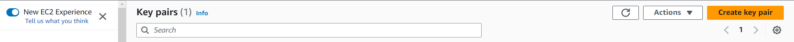

# [Amazon EC2](https://aws.amazon.com/tw/ec2/)

[](https://github.com/lankahsu520/HelperX)
[![GitHub license][license-image]][license-url]
[![GitHub stars][stars-image]][stars-url]
[![GitHub forks][forks-image]][forks-url]
[![GitHub issues][issues-image]][issues-image]
[![GitHub watchers][watchers-image]][watchers-image]

[license-image]: https://img.shields.io/github/license/lankahsu520/HelperX.svg
[license-url]: https://github.com/lankahsu520/HelperX/blob/master/LICENSE
[stars-image]: https://img.shields.io/github/stars/lankahsu520/HelperX.svg
[stars-url]: https://github.com/lankahsu520/HelperX/stargazers
[forks-image]: https://img.shields.io/github/forks/lankahsu520/HelperX.svg
[forks-url]: https://github.com/lankahsu520/HelperX/network
[issues-image]: https://img.shields.io/github/issues/lankahsu520/HelperX.svg
[issues-url]: https://github.com/lankahsu520/HelperX/issues
[watchers-image]: https://img.shields.io/github/watchers/lankahsu520/HelperX.svg
[watchers-url]: https://github.com/lankahsu520/HelperX/watchers

# 1. [Amazon Elastic Compute Cloud (User Guide for Linux Instances)](https://docs.aws.amazon.com/AWSEC2/latest/UserGuide/concepts.html)

> 一般都是用 Console 設定即可。


# 2. Connect & Security

## 2.1. [Key Pairs](https://eu-west-1.console.aws.amazon.com/ec2/home?region=eu-west-1#KeyPairs:)

> [How to add a new key pair to your exisitng AWS ec2 Instance](https://linux.how2shout.com/add-a-new-key-pair-to-your-exisitng-aws-ec2-instances/)

#### A. Add new Key pair




#### B. Extract the Public key from the private key

```bash
ssh-keygen -y -f ./FreePBXLanka.pem
```

```bash
$ pwd
/root
$ sudo nano .ssh/authorized_keys
# Paste the key
$ sudo vi /home/ec2-user/.ssh/authorized_keys
# Paste the key
$ sudo vi /etc/ssh/sshd_config
# Paste the below line
AllowUsers ec2-user
$ sudo systemctl restart sshd
```

## 2.2. Connect

### 2.2.1. SSH client

> 最簡單的方式就是利用 ssh client 進行連線。
>
> 需求：
>
> - [x] ssh client
>
>
> - [x] Public IPv4
>
>
> - [x] Key pair


### 2.2.2. [EC2 Instance Connect](https://docs.aws.amazon.com/zh_tw/AWSEC2/latest/UserGuide/connect-linux-inst-eic.html)

> 最簡單的方式就是利用 ssh client 進行連線。
>
> 需求：
>
> - [x]  AWS CLI version 2
> - [x] Public IPv4

```bash
$ export AWS_EC2_INSTANCE_ID=i-1234567890example
$ export AWS_EC2_INSTANCE_USER=ubuntu

$ aws ec2-instance-connect ssh \
  --instance-id $AWS_EC2_INSTANCE_ID \
  --os-user $AWS_EC2_INSTANCE_USER
```

### 2.2.3. [EC2 Instance Connect Endpoint](https://docs.aws.amazon.com/zh_tw/AWSEC2/latest/UserGuide/connect-with-ec2-instance-connect-endpoint.html)


> [使用 EC2 Instance Connect Endpoint 連線](https://docs.aws.amazon.com/zh_tw/AWSEC2/latest/UserGuide/connect-with-ec2-instance-connect-endpoint.html)

> 使用 AWS CLI
>
> 需求：
>
> - [x]  AWS CLI version 2
> - [x] Private IPv4

```bash
$ export AWS_EC2_INSTANCE_ID=i-1234567890example
$ export AWS_EC2_INSTANCE_USER=ubuntu

$ aws ec2-instance-connect ssh \
  --instance-id $AWS_EC2_INSTANCE_ID \
  --os-user $AWS_EC2_INSTANCE_USER --connection-type eice
```

# 3. Networking

## 3.1. Public subnet and internet gateway


## 3.2. Private subnet and NAT gateway


### 3.2.1. Setting

> 請參考 I.3. 進行相關的設定。你也可以照著以下的步驟進行。
>
> NAT gateway 要收錢，<font color="red">$0.045/hr + $0.045/GB</font> ( 假設每月傳輸 1GB，就要 $32.85 + $0.045 = $ 32.895 美元)

> AWS Region: eu-west-1

#### A. create VPC*1

> 請至 [VPC dashboard](https://eu-west-1.console.aws.amazon.com/vpcconsole/home?region=eu-west-1#Home:) 建立1個 vpc

> **vpc**: vpc-00000000 (172.31.0.0/16)

#### B. create subnet *2

> [VPC dashboard](https://eu-west-1.console.aws.amazon.com/vpcconsole/home?region=eu-west-1#Home:)
>
> 請至 [Subnets](https://eu-west-1.console.aws.amazon.com/vpcconsole/home?region=eu-west-1#subnets:) 建立2個 subnets

> **Public subnet**: subnet-66666666666666666
>
> IPv4 CIDR: 172.31.0.0/20

> **Private subnet**: subnet-77777777777777777
>
> IPv4 CIDR: 172.31.16.0/20

#### C. create Internet gateway * 1

> 請至 [Internet gateways](https://eu-west-1.console.aws.amazon.com/vpcconsole/home?region=eu-west-1#igws:) 建立1個 Internet gateway

> **igw**: igw-11111111

#### D. create NAT gateway * 1

> 請至 [NAT gateways](https://eu-west-1.console.aws.amazon.com/vpcconsole/home?region=eu-west-1#NatGateways:) 建立1個 Nat gateway

> **nat**: nat-22222222222222222
>
> Primary public IPv4 address: 請申請 1個
>
> Subnet: subnet-66666666666666666
>
> Connectivity type: Public (如果要連外部網路)

#### E. create route table * 2

> 請至 [Route tables](https://eu-west-1.console.aws.amazon.com/vpcconsole/home?region=eu-west-1#RouteTables:) 建立2個 route table

> **Public route**: rtb-33333333333333333
>
> routes:
>
> ​	0.0.0.0/0 -> **igw**: igw-11111111
>
> subnet associations:
>
> ​	subnet-66666666666666666

> **Private route**: rtb-44444444444444444
>
> routes:
>
> ​	0.0.0.0/0 -> **nat**: nat-22222222222222222
>
> subnet associations:
>
> ​	subnet-77777777777777777

#### F.  ceate EC2 Instance (private)

> 在建立 EC2 時請選擇
>
> Subnet: subnet-66666666666666666
>
> Auto-assign public: Disable

> 如果是要改動現有 EC2 的 Subnet 是不行的。請參考 I.2. 。

# 4. Cost

## 4.1. [On-Demand Pricing](https://aws.amazon.com/ec2/pricing/on-demand/?nc1=h_ls)

> AWS Region: eu-west-1
>
> Operating system: Linux
>
> `t3.medium` 為 x86，相容大多數應用程式；`t4g.medium` 為 ARM，部分套件/映像需特別編譯。

| Instance name | On-Demand hourly rate | vCPU | Memory  | Storage  | Network performance |
| ------------- | --------------------- | ---- | ------- | -------- | ------------------- |
| t4g.nano      | $0.0042               | 2    | 0.5 GiB | EBS Only | Up to 5 Gigabit     |
| t4g.micro     | $0.0084               | 2    | 1 GiB   | EBS Only | Up to 5 Gigabit     |
| t4g.small     | $0.0168               | 2    | 2 GiB   | EBS Only | Up to 5 Gigabit     |
| t4g.medium    | $0.0336               | 2    | 4 GiB   | EBS Only | Up to 5 Gigabit     |
| t4g.large     | $0.0672               | 2    | 8 GiB   | EBS Only | Up to 5 Gigabit     |
| t4g.xlarge    | $0.1344               | 4    | 16 GiB  | EBS Only | Up to 5 Gigabit     |
| t4g.2xlarge   | $0.2688               | 8    | 32 GiB  | EBS Only | Up to 5 Gigabit     |
| t3.nano       | $0.0052               | 2    | 0.5 GiB | EBS Only | Up to 5 Gigabit     |
| t3.micro      | $0.0104               | 2    | 1 GiB   | EBS Only | Up to 5 Gigabit     |
| t3.small      | $0.0208               | 2    | 2 GiB   | EBS Only | Up to 5 Gigabit     |
| t3.medium     | $0.0416               | 2    | 4 GiB   | EBS Only | Up to 5 Gigabit     |
| t3.large      | $0.0832               | 2    | 8 GiB   | EBS Only | Up to 5 Gigabit     |
| t3.xlarge     | $0.1664               | 4    | 16 GiB  | EBS Only | Up to 5 Gigabit     |
| t3.2xlarge    | $0.3328               | 8    | 32 GiB  | EBS Only | Up to 5 Gigabit     |
| t3a.nano      | $0.0047               | 2    | 0.5 GiB | EBS Only | Up to 5 Gigabit     |
| t3a.micro     | $0.0094               | 2    | 1 GiB   | EBS Only | Up to 5 Gigabit     |
| t3a.small     | $0.0188               | 2    | 2 GiB   | EBS Only | Up to 5 Gigabit     |
| t3a.medium    | $0.0376               | 2    | 4 GiB   | EBS Only | Up to 5 Gigabit     |
| t3a.large     | $0.0752               | 2    | 8 GiB   | EBS Only | Up to 5 Gigabit     |
| t3a.xlarge    | $0.1504               | 4    | 16 GiB  | EBS Only | Up to 5 Gigabit     |

## 4.2. Data Transfer

> 針對網路使用進行試算，美金計價。
>
> 因為大部分都是對外才收錢，所以著重在 Internet 上。
>

> [AWS Public IPv4 收費機制與費用優化策略](https://aws.amazon.com/tw/events/taiwan/techblogs/aws-public-ipv4-address-charge/): Public IPv4
>
> [Amazon VPC 定價](https://aws.amazon.com/tw/vpc/pricing/) : NAT GW → Internet
>
> [Amazon EC2 隨需定價](https://aws.amazon.com/tw/ec2/pricing/on-demand/) : EC2 → Internet
>
> [AWS PrivateLink 定價](https://aws.amazon.com/tw/privatelink/pricing/?nc1=h_ls) : VPC Endpoint

> (EC2 + Public IPv4) *1 要花費 3.92/月

> (EC2 + Public IPv4) * 10 要花費 36.77/月

> (EC2 + NAT GW + Public IPv4) *1 要花費 36.635/月


# I. Study

## I.1. Official - [[Amazon Elastic Compute Cloud (User Guide for Linux Instances)](https://docs.aws.amazon.com/AWSEC2/latest/UserGuide/concepts.html)](https://docs.aws.amazon.com/chime/latest/ag/what-is-chime.html)


## I.2. [How do I move my EC2 instance to another subnet, Availability Zone, or VPC?](https://www.youtube.com/watch?v=ZqLPbfh2sQk)

## I.3. [Mastering AWS: NAT Gateway Setup in Your VPC - A Step-by-Step Tutorial (Part-14)](https://www.youtube.com/watch?v=ydxEeVAqVdo)

# II. Debug

# III. Glossary

# IV. Tool Usage


# Author

> Created and designed by [Lanka Hsu](lankahsu@gmail.com).

# License

> [HelperX](https://github.com/lankahsu520/HelperX) is available under the BSD-3-Clause license. See the LICENSE file for more info.
