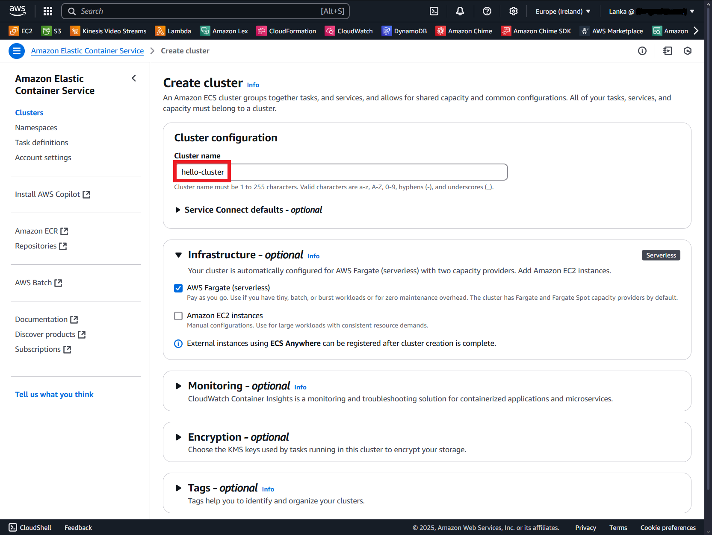

# [Amazon ECS](https://aws.amazon.com/tw/ecs/)

[](https://github.com/lankahsu520/HelperX)
[![GitHub license][license-image]][license-url]
[![GitHub stars][stars-image]][stars-url]
[![GitHub forks][forks-image]][forks-url]
[![GitHub issues][issues-image]][issues-image]
[![GitHub watchers][watchers-image]][watchers-image]

[license-image]: https://img.shields.io/github/license/lankahsu520/HelperX.svg
[license-url]: https://github.com/lankahsu520/HelperX/blob/master/LICENSE
[stars-image]: https://img.shields.io/github/stars/lankahsu520/HelperX.svg
[stars-url]: https://github.com/lankahsu520/HelperX/stargazers
[forks-image]: https://img.shields.io/github/forks/lankahsu520/HelperX.svg
[forks-url]: https://github.com/lankahsu520/HelperX/network
[issues-image]: https://img.shields.io/github/issues/lankahsu520/HelperX.svg
[issues-url]: https://github.com/lankahsu520/HelperX/issues
[watchers-image]: https://img.shields.io/github/watchers/lankahsu520/HelperX.svg
[watchers-url]: https://github.com/lankahsu520/HelperX/watchers

# 1. Amazon Elastic Container Service

> Amazon Elastic Container Service (Amazon ECS) 是全受管容器協同運作服務，協助您更高效地部署、管理和擴展容器化應用程式。它與 AWS 環境深度整合，為使用 Amazon ECS Anywhere 的進階安全功能，在雲端和內部部署中執行容器工作負載提供簡單易用的解決方案。

> 這邊要先清楚什麼是容器（Container），而虛擬機（Virtual Machine）又是什麼。[helper_Docker.md](https://github.com/lankahsu520/HelperX/blob/master/helper_Docker.md) 可以透過 Docker 來了解。

> 拜讀 Developer Guide 和網路文章後，還是完全沒有進展，這篇或許可以讓你有成就感。
>
> 此篇只是讓大家起個頭，了解運作後，再針對個人需求進行發展。

# 2. ECS vs EC2

## 2.1. Cost

> 成本很重要！

### 2.1.1. Task Allocation vs. Resource Capacity

> 當然執行數量少時看不出差異，但當需求量提高，兩邊的差異就會很明顯。
>
> 這邊假設在同一時間下，需要啟動 1,000 tasks，每月的費用的如下。

> 先看看需求，假設同時啟動1,000 tasks，每月的費用的如下。

|           | task(s) | ECS Fargate (0.25 vCPU, 128MB RAM)                           | EC2 t3.medium (vCPU:2, RAM: 4GB) |
| --------- | ------- | ------------------------------------------------------------ | -------------------------------- |
| USD/month | 1000    | (0.25 * 0.04048 + 0.125 * 0.004445) * 24 * 7.68 *1000= 7689.6 | 33                               |
| USD/month | 1       | (0.25 * 0.04048 + 0.125 * 0.004445) * 24 * 7.68 *1= 7.689    | 33                               |

#### A. Managing Multiple Tasks with Limited Resources

> 此情境就好比訂購系統，當特惠時節提高處理單元（1000 個）；之後維持基本處理單元（10 個）就行，


#### B. Independent Resource Allocation per Task

> 每個處理單元個別管理自己的資源，而且資源是無法分享。


### 2.1.2. Run time

> 執行時間的長和短，也是需要考量

## 2.2. Manage & Deploy

> 單究『無需管理伺服器』，在傳統思維裏，空間太小加空間，主機落後換主機；而 ECS 中，開發者要清楚知道如何註冊、部署等問題；相較之下，彼此之間的不同之處在那？或許只是換個方式。

> 另外，知道 「電腦」的人比較多，還是知道 Docker 的人多？

|      | ECS                          | EC2                                                          |
| ---- | ---------------------------- | ------------------------------------------------------------ |
| 擴展 | 無上限                       | 可擴展，限於使用中的 EC2 能力。使用者要先預估執行數量，例如每台 EC2可執行 1000 個tasks。 |
| 管理 | 不見得簡單。                 | 不見得容易。                                                 |
| 部署 | 要會 aws 的 magic language。 | 會 linux 的，就會。                                          |

# 3. Docker Image

## 3.1. Create a Docker Image with Dockerfile

```bash
FROM public.ecr.aws/amazonlinux/amazonlinux:latest

# Update installed packages and install Apache
RUN yum update -y && \
 yum install -y httpd

# Write hello world message
RUN echo 'Hello World!' > /var/www/html/index.html

# Configure Apache
RUN echo 'mkdir -p /var/run/httpd' >> /root/run_apache.sh && \
 echo 'mkdir -p /var/lock/httpd' >> /root/run_apache.sh && \
 echo '/usr/sbin/httpd -D FOREGROUND' >> /root/run_apache.sh && \
 chmod 755 /root/run_apache.sh

EXPOSE 80

CMD /root/run_apache.sh
```

```bash
$ docker build -t hello-world .
$ docker images --filter reference=hello-world
REPOSITORY    TAG       IMAGE ID       CREATED         SIZE
hello-world   latest    64d4dc0afe03   2 minutes ago   301MB


$ docker run -t -i -p 8888:80 hello-world

# open browser http://localhost:8888
```

## 3.2. Create a repository

```bash
$ export AWS_DEFAULT_REGION=eu-west-1
$ export AWS_DEFAULT_REGION=us-west-1
$ export AWS_REPOSITORY_NAME=hello-repository
$ export AWS_REPOSITORY_JSON=$AWS_REPOSITORY_NAME.json
$ export AWS_REPOSITORY_TAG=hello-world

$ aws ecr create-repository --repository-name $AWS_REPOSITORY_NAME --region $AWS_DEFAULT_REGION > $AWS_REPOSITORY_JSON
$ export AWS_REPOSITORY_URI=$(cat $AWS_REPOSITORY_JSON  | jq -r '.repository.repositoryUri')
$ echo $AWS_REPOSITORY_URI
123456789012.dkr.ecr.us-west-1.amazonaws.com/hello-repository

$ aws ecr describe-repositories --query 'repositories[]. [repositoryName, repositoryUri]' --output table
---------------------------------------------------------------------------------------
|                                DescribeRepositories                                 |
+------------------+------------------------------------------------------------------+
|  hello-repository|  123456789012.dkr.ecr.us-west-1.amazonaws.com/hello-repository   |
+------------------+------------------------------------------------------------------+
```


## 3.3. Tag the Docker Image

```bash
$ docker tag hello-world $AWS_REPOSITORY_URI
$ docker images
REPOSITORY                                                      TAG       IMAGE ID       CREATED          SIZE
123456789012.dkr.ecr.eu-west-1.amazonaws.com/hello-repository   latest    24e33260f209   44 minutes ago   301MB
hello-world                                                     latest    24e33260f209   44 minutes ago   301MB
public.ecr.aws/amazonlinux/amazonlinux                          latest    e049bd4be1b1   10 days ago      154MB
```

## 3.4. Push the Docker Image to Amazon ECR

```bash
$ aws ecr get-login-password --region $AWS_DEFAULT_REGION | docker login --username AWS --password-stdin $AWS_REPOSITORY_URI
WARNING! Your password will be stored unencrypted in /home/ubuntu/.docker/config.json.
Configure a credential helper to remove this warning. See
https://docs.docker.com/engine/reference/commandline/login/#credentials-store

Login Succeeded

$ docker push $AWS_REPOSITORY_URI

$ aws ecr describe-images --repository-name $AWS_REPOSITORY_NAME
{
    "imageDetails": [
        {
            "registryId": "123456789012",
            "repositoryName": "hello-repository",
            "imageDigest": "sha256:112f62a8d1a0cc277edc78994fb32ed2cc132555bccaf15c4b538a76e6471296",
            "imageTags": [
                "latest"
            ],
            "imageSizeInBytes": 144785629,
            "imagePushedAt": "2025-04-22T02:12:53.510000+02:00",
            "imageManifestMediaType": "application/vnd.docker.distribution.manifest.v2+json",
            "artifactMediaType": "application/vnd.docker.container.image.v1+json"
        }
    ]
}
```


## 3.5.  Delete the Docker Image from Amazon ECR

```bash
$ aws ecr delete-repository --repository-name $AWS_REPOSITORY_NAME --region $AWS_DEFAULT_REGION --force
```

# 4. ECS launch type

## 4.1. EC2

## 4.2. Farget


### 4.2.1. [Clusters](https://eu-west-1.console.aws.amazon.com/ecs/v2/clusters?region=eu-west-1)

#### A. AWS CLI

##### A.1. create-cluster

```bash
$ aws ecs create-cluster --cluster-name hello-cluster
{
    "cluster": {
        "clusterArn": "arn:aws:ecs:eu-west-1:123456789012:cluster/hello-cluster",
        "clusterName": "hello-cluster",
        "status": "ACTIVE",
        "registeredContainerInstancesCount": 0,
        "runningTasksCount": 0,
        "pendingTasksCount": 0,
        "activeServicesCount": 0,
        "statistics": [],
        "tags": [],
        "settings": [
            {
                "name": "containerInsights",
                "value": "disabled"
            }
        ],
        "capacityProviders": [],
        "defaultCapacityProviderStrategy": []
    }
}
```

##### A.2. delete-cluster

```bash
$ aws ecs delete-cluster --cluster hello-cluster
```

#### B. AWS Web Console

##### B.1. Create cluster


##### B.2. Cluster configuration

> **Cluster name**: hello-cluster



##### B.3. Create


##### B.4. List


### 4.2.2. ECS Execution Role

#### A. AWS CLI

##### A.1. create-role

```bash
$ aws iam create-role \
  --role-name ecsTaskExecutionRole \
  --assume-role-policy-document file://<(cat <<EOF
{
  "Version": "2012-10-17",
  "Statement": [
    {
      "Effect": "Allow",
      "Principal": {
        "Service": "ecs-tasks.amazonaws.com"
      },
      "Action": "sts:AssumeRole"
    }
  ]
}
EOF
)

# 附加 AWS 預設的執行權限
$ aws iam attach-role-policy \
  --role-name ecsTaskExecutionRole \
  --policy-arn arn:aws:iam::aws:policy/service-role/AmazonECSTaskExecutionRolePolicy

# 查詢 Role ARN
$ aws iam get-role --role-name ecsTaskExecutionRole --query 'Role.Arn' --output text
arn:aws:iam::123456789012:role/ecsTaskExecutionRole
```

##### A.2. delete-role

```bash
# 移除附加的 Policies
$ aws iam list-attached-role-policies --role-name ecsTaskExecutionRole
$ aws iam detach-role-policy --role-name ecsTaskExecutionRole --policy-arn arn:aws:iam::aws:policy/service-role/AmazonECSTaskExecutionRolePolicy

# 刪除 inline policy
$ aws iam list-role-policies --role-name ecsTaskExecutionRole
$ aws iam delete-role-policy --role-name ecsTaskExecutionRole --policy-name YourInlinePolicyName

# 刪除 Role
$ aws iam delete-role --role-name ecsTaskExecutionRole
```

#### B. AWS Web Console

> 建議先用 AWS CLI

### 4.2.3. [Task definitions](https://eu-west-1.console.aws.amazon.com/ecs/v2/task-definitions?region=eu-west-1)

#### A. AWS CLI

> **CPU**: 256 units (0.25 vCPU)
>
> **Memory**: 512 MiB (0.5 GB)

##### A.1. register-task-definition

```bash
$ export AWS_TASK_DEFINITION_JSON=hello-task-definition.json
$ vi $AWS_TASK_DEFINITION_JSON
{
    "family": "sample-fargate-v2", 
    "networkMode": "awsvpc",
    "executionRoleArn": "arn:aws:iam::123456789012:role/ecsTaskExecutionRole",
    "containerDefinitions": [
        {
            "name": "fargate-app", 
            "image": "123456789012.dkr.ecr.eu-west-1.amazonaws.com/hello-repository:latest", 
            "portMappings": [
                {
                    "containerPort": 80, 
                    "hostPort": 80, 
                    "protocol": "tcp"
                }
            ], 
            "essential": true
        }
    ], 
    "requiresCompatibilities": [
        "FARGATE"
    ], 
    "cpu": "256", 
    "memory": "512"
}

$ aws ecs register-task-definition --cli-input-json file://$AWS_TASK_DEFINITION_JSON
```

##### A.2. list-task-definitions

```bash
$ aws ecs list-task-definitions --family-prefix sample-fargate-v2
{
    "taskDefinitionArns": [
        "arn:aws:ecs:eu-west-1:123456789012:task-definition/sample-fargate-v2:1",
        "arn:aws:ecs:eu-west-1:123456789012:task-definition/sample-fargate-v2:2"
    ]
}

$ aws ecs list-task-definitions --family-prefix sample-fargate
{
    "taskDefinitionArns": [
        "arn:aws:ecs:eu-west-1:123456789012:task-definition/sample-fargate:4"
    ]
}
```

##### A.3. deregister-task-definition

```bash
$ aws ecs deregister-task-definition --task-definition arn:aws:ecs:eu-west-1:123456789012:task-definition/sample-fargate-v2:1
$ aws ecs deregister-task-definition --task-definition arn:aws:ecs:eu-west-1:123456789012:task-definition/sample-fargate-v2:2

$ aws ecs deregister-task-definition --task-definition arn:aws:ecs:eu-west-1:123456789012:task-definition/sample-fargate:4
```

#### B. AWS Web Console

##### B.1. Create definition


##### B.2. Create new revision with JSON

> 從 [Learn how to create a Linux task for the Fargate launch type](https://docs.aws.amazon.com/AmazonECS/latest/developerguide/getting-started-fargate.html) 擷取下來的；這邊真的要抱怨一下，前一個章節是介紹建立 container image，結果範例居然不使用該 image，寫這說明文件的人不知在想什麼？

```json
{
    "family": "sample-fargate", 
    "networkMode": "awsvpc", 
    "containerDefinitions": [
        {
            "name": "fargate-app", 
            "image": "public.ecr.aws/docker/library/httpd:latest", 
            "portMappings": [
                {
                    "containerPort": 80, 
                    "hostPort": 80, 
                    "protocol": "tcp"
                }
            ], 
            "essential": true, 
            "entryPoint": [
                "sh",
		"-c"
            ], 
            "command": [
                "/bin/sh -c \"echo '<html> <head> <title>Amazon ECS Sample App</title> <style>body {margin-top: 40px; background-color: #333;} </style> </head><body> <div style=color:white;text-align:center> <h1>Amazon ECS Sample App</h1> <h2>Congratulations!</h2> <p>Your application is now running on a container in Amazon ECS.</p> </div></body></html>' >  /usr/local/apache2/htdocs/index.html && httpd-foreground\""
            ]
        }
    ], 
    "requiresCompatibilities": [
        "FARGATE"
    ], 
    "cpu": "256", 
    "memory": "512"
}
```


##### B.3. List


### 4.2.3. Services

#### A. AWS CLI

##### A.1. create-service

```bash
$ export AWS_SERVICE_JSON=hello-service.json
$ export AWS_SERVICE_RESPONSE_JSON=hello-service-response.json
$ vi $AWS_SERVICE_JSON
{
    "cluster": "hello-cluster",
    "serviceName": "hello-service",
    "taskDefinition": "arn:aws:ecs:eu-west-1:123456789012:task-definition/sample-fargate-v2:2",
    "loadBalancers": [
    ],
    "desiredCount": 1,
    "launchType": "FARGATE",
    "platformVersion": "LATEST",
    "networkConfiguration": {
        "awsvpcConfiguration": {
            "subnets": [
                "subnet-f525c9be"
            ],
            "securityGroups": [
                "sg-03ae822762b0fe90f"
            ],
            "assignPublicIp": "ENABLED"
        }
    }
}

# 建立 Service
$ aws ecs create-service --cli-input-json file://$AWS_SERVICE_JSON > $AWS_SERVICE_RESPONSE_JSON
```

##### A.2. describe-services

```bash
$ aws ecs list-services --cluster hello-cluster --query "serviceArns[]" --output text
arn:aws:ecs:eu-west-1:123456789012:service/hello-cluster/hello-service

$ aws ecs describe-services \
  --cluster hello-cluster \
  --services hello-service \
  --query "services[0].{Status:status, TaskDefinition:taskDefinition, DesiredCount:desiredCount, RunningCount:runningCount}" \
  --output table
----------------------------------------------------------------------------------------------
|                                      DescribeServices                                      |
+----------------+---------------------------------------------------------------------------+
|  DesiredCount  |  1                                                                        |
|  RunningCount  |  1                                                                        |
|  Status        |  ACTIVE                                                                   |
|  TaskDefinition|  arn:aws:ecs:eu-west-1:123456789012:task-definition/sample-fargate-v2:2   |
+----------------+---------------------------------------------------------------------------+
```

##### A.3. delete-service

> 刪除前，記得先停止所有的 tasks

```bash
# 調整 Service 的 Desired Count；因此會停止所有的 tasks
$ aws ecs update-service --cluster hello-cluster --service hello-service --desired-count 0

# 強制刪除
$ aws ecs delete-service --cluster hello-cluster --service hello-service --force
```

#### B. AWS Web Console

##### B.1. Select cluster


##### B.2. Create service


##### B.3. Service configuration

> **Launch type**: FARGATE
>
> **Task definition family**: sample-fargate
>
> **Service name**: hello-service
>
> **Desired tasks**: 1
>
> **Networking**
>
> ​	**VPC**:
>
> ​	**Subnets**: subnet-f525c9be
>
> ​	**Security group name**: sg-03ae822762b0fe90f


##### B.4. List


### 4.2.4. Tasks

#### A. AWS CLI

##### A.1. list-tasks

```bash
$ aws ecs describe-services \
  --cluster hello-cluster \
  --services hello-service \
  --query "services[0].{Status:status, TaskDefinition:taskDefinition, DesiredCount:desiredCount, RunningCount:runningCount}" \
  --output table
----------------------------------------------------------------------------------------------
|                                      DescribeServices                                      |
+----------------+---------------------------------------------------------------------------+
|  DesiredCount  |  1                                                                        |
|  RunningCount  |  1                                                                        |
|  Status        |  ACTIVE                                                                   |
|  TaskDefinition|  arn:aws:ecs:eu-west-1:123456789012:task-definition/sample-fargate-v2:2   |
+----------------+---------------------------------------------------------------------------+

# 列出 tasks
$ aws ecs list-tasks --cluster hello-cluster --service-name hello-service --output text
TASKARNS        arn:aws:ecs:eu-west-1:123456789012:task/hello-cluster/12eea332beef474e8d49065c4feac657

# 列出 tasks
$ aws ecs list-tasks --cluster hello-cluster --output text
TASKARNS        arn:aws:ecs:eu-west-1:123456789012:task/hello-cluster/12eea332beef474e8d49065c4feac657

$ aws ecs list-tasks --cluster hello-cluster --desired-status RUNNING
$ aws ecs list-tasks --cluster hello-cluster --desired-status STOPPED

# 查看該 task 的內容
$ aws ecs describe-tasks \
  --cluster hello-cluster \
  --tasks 12eea332beef474e8d49065c4feac657 \
  --query 'tasks[*].[taskArn, lastStatus, desiredStatus, containerInstanceArn, startedAt]' \
  --output table
```

##### A.2. stop-task

> 只有 stop，沒有 lete

```bash
# 調整 Service 的 Desired Count；因此會停止所有的 tasks
$ aws ecs update-service --cluster hello-cluster --service hello-service --desired-count 0

# 停止特定的 task
$ aws ecs stop-task --cluster hello-cluster --task arn:aws:ecs:eu-west-1:123456789012:task/hello-cluster/12eea332beef474e8d49065c4feac657
```

#### B. AWS Web Console

##### B.1. Select task


##### B.2. Configuration


### 4.2.5. Show time

> http://34.244.233.173


# Appendix

# I. Study

## I.1. Official - [Amazon Elastic Container Service (Developer Guide)](https://docs.aws.amazon.com/AmazonECS/latest/developerguide/Welcome.html)

# II. Debug

# III. Glossary

# IV. Tool Usage


# Author

> Created and designed by [Lanka Hsu](lankahsu@gmail.com).

# License

> [HelperX](https://github.com/lankahsu520/HelperX) is available under the BSD-3-Clause license. See the LICENSE file for more info.
