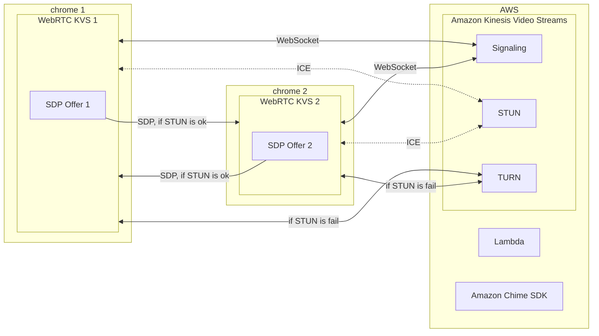

# [Amazon Kinesis Video Streams](https://aws.amazon.com/tw/kinesis/video-streams/)

[](https://github.com/lankahsu520/HelperX)
[![GitHub license][license-image]][license-url]
[![GitHub stars][stars-image]][stars-url]
[![GitHub forks][forks-image]][forks-url]
[![GitHub issues][issues-image]][issues-image]
[![GitHub watchers][watchers-image]][watchers-image]

[license-image]: https://img.shields.io/github/license/lankahsu520/HelperX.svg
[license-url]: https://github.com/lankahsu520/HelperX/blob/master/LICENSE
[stars-image]: https://img.shields.io/github/stars/lankahsu520/HelperX.svg
[stars-url]: https://github.com/lankahsu520/HelperX/stargazers
[forks-image]: https://img.shields.io/github/forks/lankahsu520/HelperX.svg
[forks-url]: https://github.com/lankahsu520/HelperX/network
[issues-image]: https://img.shields.io/github/issues/lankahsu520/HelperX.svg
[issues-url]: https://github.com/lankahsu520/HelperX/issues
[watchers-image]: https://img.shields.io/github/watchers/lankahsu520/HelperX.svg
[watchers-url]: https://github.com/lankahsu520/HelperX/watchers

# 1. [Amazon Kinesis Video Streams (Developer Guide)](https://docs.aws.amazon.com/kinesisvideostreams/latest/dg/what-is-kinesis-video.html)

> Amazon Kinesis Video Streams 可讓您安全輕鬆地將影片從連線裝置串流到 AWS，以進行分析、機器學習 (ML)、播放及其他處理。Kinesis Video Streams 可自動佈建和彈性地擴展所需的全部基礎設施，以便從數百萬台裝置導入串流影片資料。


>Amazon Kinesis Video Streams 中提供 **Video stream** 和 **Signaling channel** 兩種。

# 2. Video stream

## 2.1. Repository

### 2.1.1. [amazon-kinesis-video-streams-producer-sdk-cpp](https://github.com/awslabs/amazon-kinesis-video-streams-producer-sdk-cpp)

> Amazon Kinesis Video Streams Producer SDK for C++ is for developers to install and customize for their connected camera and other devices to securely stream video, audio, and time-encoded data to Kinesis Video Streams.

# 3. **Signaling channel** (WebRTC)

## 3.1. Repository

### 3.1.1. [amazon-kinesis-video-streams-pic](https://github.com/awslabs/amazon-kinesis-video-streams-pic)

> Amazon Kinesis Video Streams PIC provides the underlying tool API for the Amazon Kinesis Video Streams WebRTC SDK.

### 3.1.2. [amazon-kinesis-video-streams-producer-sdk-cpp](https://github.com/awslabs/amazon-kinesis-video-streams-producer-sdk-cpp)

> Amazon Kinesis Video Streams Producer SDK for C++ is for developers to install and customize for their connected camera and other devices to securely stream video, audio, and time-encoded data to Kinesis Video Streams.

### 3.1.3. [amazon-kinesis-video-streams-webrtc-sdk-c](https://github.com/awslabs/amazon-kinesis-video-streams-webrtc-sdk-c)

> Amazon Kinesis Video Streams Webrtc SDK is for developers to install and customize realtime communication between devices and enable secure streaming of video, audio to Kinesis Video Streams.



## 3.2. Build and Run

>[Release 1.10.2 of the Amazon Kinesis Video WebRTC C SDK](https://github.com/awslabs/amazon-kinesis-video-streams-webrtc-sdk-c/releases/tag/v1.10.2)
>
>[Source code(tar.gz)](https://github.com/awslabs/amazon-kinesis-video-streams-webrtc-sdk-c/archive/refs/tags/v1.10.2.tar.gz)

### 3.2.1. Build

```bash
# please download amazon-kinesis-video-streams-webrtc-sdk-c-1.10.2.tar.gz
$ rm -rf amazon-kinesis-video-streams-webrtc-sdk-c-1.10.2
$ tar -zxvf amazon-kinesis-video-streams-webrtc-sdk-c-1.10.2.tar.gz

$ cd amazon-kinesis-video-streams-webrtc-sdk-c-1.10.2
$ tree -L 1 ./
./
├── bench
├── certs
├── CMake
├── CMakeLists.txt
├── CODE_OF_CONDUCT.md
├── configs
├── CONTRIBUTING.md
├── Doxyfile
├── DoxygenLayout.xml
├── Introduction.md
├── LICENSE
├── NOTICE
├── README.md
├── samples
├── scripts
├── src
└── tst

8 directories, 9 files
```
```bash
$ cd amazon-kinesis-video-streams-webrtc-sdk-c-1.10.2

# to keep Dependencies
$ sed -i "s|  file(REMOVE_RECURSE|#  file(REMOVE_RECURSE|g" CMake/Utilities.cmake

$ (rm -rf build_xxx; mkdir -p build_xxx)

# 這邊採用原始設定
$ (cd build_xxx; cmake ..)

```
```bash
# 於 open-source 可以看到已經編譯了很多相關 libraries；
# 開發 Embedded Linux 的同仁，請查看裏面有無重複 libraries。
# libkvsCommon* from Amazon Kinesis Video Streams Producer SDK for C++
# libkvspic* from Amazon Kinesis Video Streams PIC
$ tree -L 2 open-source/
open-source/
├── bin
│   ├── c_rehash
│   └── openssl
├── include
│   ├── com
│   ├── libwebsockets
│   ├── libwebsockets.h
│   ├── lws_config.h
│   ├── openssl
│   ├── srtp2
│   └── usrsctp.h
├── lib
│   ├── cmake
│   ├── engines-1.1
│   ├── libcrypto.a
│   ├── libcrypto.so -> libcrypto.so.1.1
│   ├── libcrypto.so.1.1
│   ├── libkvsCommonLws.so -> libkvsCommonLws.so.1
│   ├── libkvsCommonLws.so.1 -> libkvsCommonLws.so.1.5.2
│   ├── libkvsCommonLws.so.1.5.2
│   ├── libkvspic.a
│   ├── libkvspicClient.a
│   ├── libkvspicState.a
│   ├── libkvspicUtils.a
│   ├── libsrtp2.a
│   ├── libssl.a
│   ├── libssl.so -> libssl.so.1.1
│   ├── libssl.so.1.1
│   ├── libusrsctp.a
│   ├── libwebsockets.a
│   ├── libwebsockets.so -> libwebsockets.so.19
│   ├── libwebsockets.so.19
│   └── pkgconfig
├── libkvsCommonLws
│   ├── build
│   ├── CMakeCache.txt
│   ├── CMakeFiles
│   ├── cmake_install.cmake
│   ├── CMakeLists.txt
│   └── Makefile
├── libopenssl
│   ├── build
│   ├── CMakeCache.txt
│   ├── CMakeFiles
│   ├── cmake_install.cmake
│   ├── CMakeLists.txt
│   └── Makefile
├── libsrtp
│   ├── build
│   ├── CMakeCache.txt
│   ├── CMakeFiles
│   ├── cmake_install.cmake
│   ├── CMakeLists.txt
│   └── Makefile
├── libusrsctp
│   ├── build
│   ├── CMakeCache.txt
│   ├── CMakeFiles
│   ├── cmake_install.cmake
│   ├── CMakeLists.txt
│   └── Makefile
└── libwebsockets
    ├── build
    ├── CMakeCache.txt
    ├── CMakeFiles
    ├── cmake_install.cmake
    ├── CMakeLists.txt
    ├── libwebsockets-leak-pipe-fix.patch
    ├── libwebsockets-old-gcc-fix-cast-cmakelists.patch
    └── Makefile

25 directories, 45 files
```

```bash
$ (cd build_xxx;make)
# or
$ (cd build_xxx;make VERBOSE=1)
```

```bash
$ tree -L 1 ./
.
├── CMakeCache.txt
├── CMakeFiles
├── cmake_install.cmake
├── h264SampleFrames
├── h265SampleFrames
├── libkvsWebrtcClient.so
├── libkvsWebrtcSignalingClient.so
├── libkvsWebRtcThreadpool.so
├── Makefile
├── opusSampleFrames
└── samples

5 directories, 6 files

$ tree -L 1 ./samples/
./samples/
├── CMakeFiles
├── cmake_install.cmake
├── discoverNatBehavior
├── h264SampleFrames
├── h265SampleFrames
├── kvsWebrtcClientMaster
├── kvsWebrtcClientMasterGstSample
├── kvsWebrtcClientViewer
├── kvsWebrtcClientViewerGstSample
├── Makefile
└── opusSampleFrames

4 directories, 7 files
```

### 3.2.2. Run

> Channel - HelloLankaKVS

```bash
export AWS_DEFAULT_REGION=ap-northeast-1
export AWS_KVS_LOG_LEVEL=1
export DEBUG_LOG_SDP=TRUE

export AWS_ACCESS_KEY_ID=AKI00000000000000000
export AWS_SECRET_ACCESS_KEY=KEY0000000000000000000000000/00000000000

./samples/kvsWebrtcClientMasterGstSample HelloLankaKVS
```

## 3.4. Watch Viewer

### 3.4.1. [KVS WebRTC Test Page](https://awslabs.github.io/amazon-kinesis-video-streams-webrtc-sdk-js/examples/index.html)

#### A. Input


#### B. Start Viewer


### 3.4.2. [Kinesis Video Streams](https://ap-northeast-1.console.aws.amazon.com/)

#### A. Search Channel


#### B. Select Channel


#### C. Start Viewer


## 3.5. Others

### 3.5.1. [alexa-sh-camera-webrtc](https://github.com/nachawat/alexa-sh-camera-webrtc)

> Sample Alexa skill to demonstrate WebRTC Integration with AWS KVS for Camera Streaming

### 3.5.2. [kvs_webrtc_example](https://github.com/mganeko/kvs_webrtc_example)

> example of Amazon Kinesis Video Streams WebRTC

# Appendix

# I. Study

## I.1. Official - [Amazon Kinesis Video Streams (Developer Guide)](https://docs.aws.amazon.com/kinesisvideostreams/latest/dg/what-is-kinesis-video.html)

## I.2. Official - [Kinesis Video Streams (Amazon Kinesis Video Streams WebRTC Developer Guide)](https://docs.aws.amazon.com/kinesisvideostreams-webrtc-dg/latest/devguide/what-is-kvswebrtc.html)

## I.3. [WebRTC中的ICE Candidate](https://zhuanlan.zhihu.com/p/476577799)

## I.4. [webRTC学习笔记](https://www.yuyoung32.com/post/webrtc学习笔记/)

# II. Debug

# III. Glossary

#### [NAT](https://zh.wikipedia.org/zh-tw/网络地址转换), **N**etwork **A**ddress **T**ranslation

> [維基百科]
>
> **網路位址轉譯**（英語：**N**etwork **A**ddress **T**ranslation，縮寫：**NAT**），又稱**IP動態偽裝**（英語：IP Masquerade）[[1\]](https://zh.wikipedia.org/zh-tw/网络地址转换#cite_note-1):176，是一種在IP[封包](https://zh.wikipedia.org/wiki/封包)通過[路由器](https://zh.wikipedia.org/wiki/路由器)或[防火牆](https://zh.wikipedia.org/wiki/防火牆)時重寫來源或目的[IP位址](https://zh.wikipedia.org/wiki/IP地址)或[埠](https://zh.wikipedia.org/wiki/端口)的技術。這種技術普遍應用於有多台主機，但只通過一個公有IP位址訪問[網際網路](https://zh.wikipedia.org/wiki/網際網路)的[私有網路](https://zh.wikipedia.org/wiki/私有网络)中。
>
> NAT技術部署方便，且得到了廣泛應用。然而，NAT也讓主機之間的通訊變得複雜，導致了通訊效率的降低。

#### [SDP](https://zh.wikipedia.org/zh-tw/会话描述协议), Session Description Protocol

>[維基百科]
>
>會話描述協議**（**Session Description Protocol**或簡寫**SDP**）描述的是[流媒體](https://zh.wikipedia.org/wiki/流媒体)的初始化參數。此協議由[IETF](https://zh.wikipedia.org/wiki/IETF)發表為 [RFC 2327](https://tools.ietf.org/html/rfc2327)。**
>
>SDP最初的時候是會話發布協議（Session Announcement Protocol或簡寫SAP）的一個部件，1998年4月推出第一版[[1\]](https://zh.wikipedia.org/zh-tw/会话描述协议#cite_note-1)，但是之後被廣泛用於和[RTSP](https://zh.wikipedia.org/wiki/RTSP)以及[SIP](https://zh.wikipedia.org/wiki/会话发起协议)協同工作，也可被單獨用來描述[多播](https://zh.wikipedia.org/wiki/多播)會話。

#### [STUN](https://zh.wikipedia.org/zh-tw/会话描述协议),  Session Traversal Utilities for NAT

> [維基百科] 
>
> STUN（用戶資料報協定[UDP]簡單穿越網路位址轉換器[NAT])伺服器允許所有的NAT客戶終端(如防火牆後邊的電腦)與位於局區域網以外的VOIP服務商實現電話通話。
>
> 通過STUN伺服器，客戶終端可以瞭解他們的公共位址、擋在他們前面的NAT類型和通過NAT與特定局部埠相連的因特網方埠。這些資訊將被用於建立客戶終端與VOIP服務商之間的UDP通信，以便實現通話。STUN協定在[RFC 3489](https://www.ietf.org/rfc/rfc3489.txt)中予以定義。
>
> 雖然是在UDP 埠3478連接STUN伺服器，但會暗示客戶終端在另外一個IP和埠號上實施測試（STUN伺服器有兩個IP位址）。RFC 規定這個埠和IP是隨意的。
#### [TURN](https://zh.wikipedia.org/zh-tw/TURN), Traversal Using Relay around NAT

> [維基百科]
>
> **TURN**（全名**Traversal Using Relay around NAT**），是一種資料傳輸協定（data-transfer protocol）。允許在TCP或UDP的連線上跨越[NAT](https://zh.wikipedia.org/wiki/网络地址转换)或[防火牆](https://zh.wikipedia.org/wiki/防火牆)。
>
> TURN是一個client-server協定。TURN的NAT穿透方法與[STUN](https://zh.wikipedia.org/wiki/STUN)類似，都是通過取得應用層中的公有位址達到NAT穿透。但實現TURN client的終端必須在通訊開始前與TURN server進行互動，並要求TURN server產生"relay port"，也就是relayed-transport-address。這時TURN server會建立peer，即遠端端點（remote endpoints），開始進行中繼（relay）的動作，TURN client利用relay port將資料傳送至peer，再由peer轉傳到另一方的TURN client。

# IV. Tool Usage

# V. Tools

## V.1. [KVS WebRTC Test Page](https://awslabs.github.io/amazon-kinesis-video-streams-webrtc-sdk-js/examples/index.html)

# Author

> Created and designed by [Lanka Hsu](lankahsu@gmail.com).

# License

> [HelperX](https://github.com/lankahsu520/HelperX) is available under the BSD-3-Clause license. See the LICENSE file for more info.
