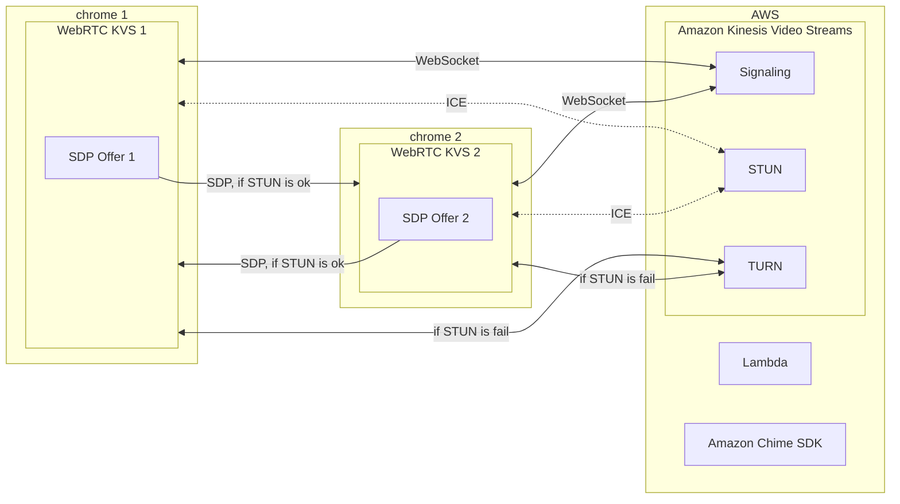

# [Amazon Kinesis Video Streams](https://aws.amazon.com/tw/kinesis/video-streams/)

[](https://github.com/lankahsu520/HelperX)
[![GitHub license][license-image]][license-url]
[![GitHub stars][stars-image]][stars-url]
[![GitHub forks][forks-image]][forks-url]
[![GitHub issues][issues-image]][issues-image]
[![GitHub watchers][watchers-image]][watchers-image]

[license-image]: https://img.shields.io/github/license/lankahsu520/HelperX.svg
[license-url]: https://github.com/lankahsu520/HelperX/blob/master/LICENSE
[stars-image]: https://img.shields.io/github/stars/lankahsu520/HelperX.svg
[stars-url]: https://github.com/lankahsu520/HelperX/stargazers
[forks-image]: https://img.shields.io/github/forks/lankahsu520/HelperX.svg
[forks-url]: https://github.com/lankahsu520/HelperX/network
[issues-image]: https://img.shields.io/github/issues/lankahsu520/HelperX.svg
[issues-url]: https://github.com/lankahsu520/HelperX/issues
[watchers-image]: https://img.shields.io/github/watchers/lankahsu520/HelperX.svg
[watchers-url]: https://github.com/lankahsu520/HelperX/watchers

# 1. [Amazon Kinesis Video Streams (Developer Guide)](https://docs.aws.amazon.com/kinesisvideostreams/latest/dg/what-is-kinesis-video.html)

> Amazon Kinesis Video Streams 可讓您安全輕鬆地將影片從連線裝置串流到 AWS，以進行分析、機器學習 (ML)、播放及其他處理。Kinesis Video Streams 可自動佈建和彈性地擴展所需的全部基礎設施，以便從數百萬台裝置導入串流影片資料。


>Amazon Kinesis Video Streams 中提供 **Video stream** 和 **Signaling channel** 兩種。

>兩邊最大的不同在於**Signaling channel** (WebRTC) 是提供雙向串流。

# 2. Video stream

## 2.1. Repository

### 2.1.1. [amazon-kinesis-video-streams-producer-sdk-cpp](https://github.com/awslabs/amazon-kinesis-video-streams-producer-sdk-cpp)

> Amazon Kinesis Video Streams Producer SDK for C++ is for developers to install and customize for their connected camera and other devices to securely stream video, audio, and time-encoded data to Kinesis Video Streams.

## 2.2. Build and Run

>[Release 3.4.1 of the Amazon Kinesis Video C++ Producer SDK](https://github.com/awslabs/amazon-kinesis-video-streams-producer-sdk-cpp/releases/tag/v3.4.1)
>
>[Source code(tar.gz)](https://github.com/awslabs/amazon-kinesis-video-streams-producer-sdk-cpp/archive/refs/tags/v3.4.1.tar.gz)

### 2.2.1. Build

```bash
# please download amazon-kinesis-video-streams-producer-sdk-cpp-3.4.1.tar.gz
$ rm -rf amazon-kinesis-video-streams-producer-sdk-cpp-3.4.1.tar.gz
$ tar -zxvf amazon-kinesis-video-streams-producer-sdk-cpp-3.4.1.tar.gz

$ cd amazon-kinesis-video-streams-producer-sdk-cpp-3.4.1
$ tree -L 1 ./
./
├── certs
├── CMake
├── CMakeLists.txt
├── docs
├── kvs_log_configuration
├── LICENSE
├── NOTICE
├── README.md
├── samples
├── src
└── tst

6 directories, 5 files
```

```bash
$ cd amazon-kinesis-video-streams-producer-sdk-cpp-3.4.1

$ (rm -rf build_xxx; mkdir -p build_xxx)

# To Include Building GStreamer Sample Programs
$ (cd build_xxx; cmake -DBUILD_GSTREAMER_PLUGIN=TRUE ..)
```

```bash
# 於 open-source 可以看到已經編譯了很多相關 libraries；
# 開發 Embedded Linux 的同仁，請查看裏面有無重複 libraries。
$ tree -L 3 open-source/
open-source/
└── local
    ├── bin
    │   ├── aclocal
    │   ├── aclocal-1.16
    │   ├── autoconf
    │   ├── autoheader
    │   ├── autom4te
    │   ├── automake
    │   ├── automake-1.16
    │   ├── autoreconf
    │   ├── autoscan
    │   ├── autoupdate
    │   ├── c_rehash
    │   ├── curl-config
    │   ├── ifnames
    │   └── openssl
    ├── include
    │   ├── curl
    │   ├── log4cplus
    │   └── openssl
    ├── lib
    │   ├── cmake
    │   ├── engines-1.1
    │   ├── libcrypto.a
    │   ├── libcrypto.so -> libcrypto.so.1.1
    │   ├── libcrypto.so.1.1
    │   ├── libcurl.so
    │   ├── liblog4cplus-2.0.so.3 -> liblog4cplus-2.0.so.3.2.2
    │   ├── liblog4cplus-2.0.so.3.2.2
    │   ├── liblog4cplus.la
    │   ├── liblog4cplus.so -> liblog4cplus-2.0.so.3.2.2
    │   ├── liblog4cplusU-2.0.so.3 -> liblog4cplusU-2.0.so.3.2.2
    │   ├── liblog4cplusU-2.0.so.3.2.2
    │   ├── liblog4cplusU.la
    │   ├── liblog4cplusU.so -> liblog4cplusU-2.0.so.3.2.2
    │   ├── libssl.a
    │   ├── libssl.so -> libssl.so.1.1
    │   ├── libssl.so.1.1
    │   └── pkgconfig
    └── share
        ├── aclocal
        ├── aclocal-1.16
        ├── autoconf
        ├── automake-1.16
        ├── doc
        ├── info
        └── man

18 directories, 29 files
```

```bash
$ (cd build_xxx;make)
# or
$ (cd build_xxx;make VERBOSE=1)
```

```bash
$ (cd build_xxx; tree -L 1 ./)
./
├── CMakeCache.txt
├── CMakeFiles
├── cmake_install.cmake
├── dependency
├── kvs_gstreamer_audio_video_sample
├── kvs_gstreamer_file_uploader_sample
├── kvs_gstreamer_multistream_sample
├── kvs_gstreamer_sample
├── kvssink_gstreamer_sample
├── libgstkvssink.so
├── libKinesisVideoProducer.so
└── Makefile

2 directories, 10 files
```

### 2.2.2. Run

> Channel - HelloLankaKVS

```bash
export AWS_DEFAULT_REGION=ap-northeast-1
export AWS_KVS_LOG_LEVEL=1
export DEBUG_LOG_SDP=TRUE

export AWS_ACCESS_KEY_ID=AKI00000000000000000
export AWS_SECRET_ACCESS_KEY=KEY0000000000000000000000000/00000000000
```

```bash
export GST_PLUGIN_PATH=`pwd`/build_xxx
export LD_LIBRARY_PATH=`pwd`/open-source/local/lib

# to check gstreamer plugin
$ gst-inspect-1.0 kvssink
Factory Details:
  Rank                     primary + 10 (266)
  Long-name                KVS Sink
  Klass                    Sink/Video/Network
  Description              GStreamer AWS KVS plugin
  Author                   AWS KVS <kinesis-video-support@amazon.com>

Plugin Details:
  Name                     kvssink
  Description              GStreamer AWS KVS plugin
  Filename                 /work/codebase/xbox/amazon-kinesis-video-streams-producer-sdk-cpp-3.4.1/build_xxx/libgstkvssink.so
  Version                  1.0
  License                  Proprietary
  Source module            kvssinkpackage
  Binary package           GStreamer
  Origin URL               http://gstreamer.net/
...
```

#### A. kvs_gstreamer_file_uploader_sample

> lanka520-h264andmp3.mp4

```bash
$ cd amazon-kinesis-video-streams-producer-sdk-cpp-3.4.1/build_xxx
$ ./kvs_gstreamer_file_uploader_sample HelloLankaKVS /work/lanka520-h264andmp3.mp4 0
```

#### B. kvs_gstreamer_audio_video_sample

##### B.1. audiosrc

```bash
# check audiosrc
$ arecord -l
**** List of CAPTURE Hardware Devices ****
card 0: I82801AAICH [Intel 82801AA-ICH], device 0: Intel ICH [Intel 82801AA-ICH]
  Subdevices: 1/1
  Subdevice #0: subdevice #0
card 0: I82801AAICH [Intel 82801AA-ICH], device 1: Intel ICH - MIC ADC [Intel 82801AA-ICH - MIC ADC]
  Subdevices: 1/1
  Subdevice #0: subdevice #0
card 1: w300 [w300], device 0: USB Audio [USB Audio]
  Subdevices: 1/1
  Subdevice #0: subdevice #0

$ aplay -l
**** List of PLAYBACK Hardware Devices ****
card 0: I82801AAICH [Intel 82801AA-ICH], device 0: Intel ICH [Intel 82801AA-ICH]
  Subdevices: 1/1
  Subdevice #0: subdevice #0
```

```bash
$ export AWS_KVS_AUDIO_DEVICE=hw:0,0
```

##### B.2. videosrc

```bash
$ sudo apt-get --yes install v4l-utils
$ v4l2-ctl --list-devices
w300: w300 (usb-0000:00:0b.0-1):
        /dev/video0
        /dev/video1
```

```bash
export AWS_KVS_VIDEO_DEVICE=/dev/video0
```

##### B.3. run

```bash
$ cd amazon-kinesis-video-streams-producer-sdk-cpp-3.4.1/build_xxx
$ ./kvs_gstreamer_audio_video_sample HelloLankaKVS
```

## 2.3. Watch Viewer

### 2.3.1. [Kinesis Video Streams](https://ap-northeast-1.console.aws.amazon.com/)

#### A. Search Stream name


#### B. Media playback


# 3. **Signaling channel** (WebRTC)

## 3.1. Repository

### 3.1.1. [amazon-kinesis-video-streams-pic](https://github.com/awslabs/amazon-kinesis-video-streams-pic)

> Amazon Kinesis Video Streams PIC provides the underlying tool API for the Amazon Kinesis Video Streams WebRTC SDK.

### 3.1.2. [amazon-kinesis-video-streams-producer-sdk-cpp](https://github.com/awslabs/amazon-kinesis-video-streams-producer-sdk-cpp)

> Amazon Kinesis Video Streams Producer SDK for C++ is for developers to install and customize for their connected camera and other devices to securely stream video, audio, and time-encoded data to Kinesis Video Streams.

### 3.1.3. [amazon-kinesis-video-streams-webrtc-sdk-c](https://github.com/awslabs/amazon-kinesis-video-streams-webrtc-sdk-c)

> Amazon Kinesis Video Streams Webrtc SDK is for developers to install and customize realtime communication between devices and enable secure streaming of video, audio to Kinesis Video Streams.



## 3.2. Build and Run

>[Release 1.10.2 of the Amazon Kinesis Video WebRTC C SDK](https://github.com/awslabs/amazon-kinesis-video-streams-webrtc-sdk-c/releases/tag/v1.10.2)
>
>[Source code(tar.gz)](https://github.com/awslabs/amazon-kinesis-video-streams-webrtc-sdk-c/archive/refs/tags/v1.10.2.tar.gz)

### 3.2.1. Build

```bash
# please download amazon-kinesis-video-streams-webrtc-sdk-c-1.10.2.tar.gz
$ rm -rf amazon-kinesis-video-streams-webrtc-sdk-c-1.10.2
$ tar -zxvf amazon-kinesis-video-streams-webrtc-sdk-c-1.10.2.tar.gz

$ cd amazon-kinesis-video-streams-webrtc-sdk-c-1.10.2
$ tree -L 1 ./
./
├── bench
├── certs
├── CMake
├── CMakeLists.txt
├── CODE_OF_CONDUCT.md
├── configs
├── CONTRIBUTING.md
├── Doxyfile
├── DoxygenLayout.xml
├── Introduction.md
├── LICENSE
├── NOTICE
├── README.md
├── samples
├── scripts
├── src
└── tst

8 directories, 9 files
```
```bash
$ cd amazon-kinesis-video-streams-webrtc-sdk-c-1.10.2

# to keep Dependencies
$ sed -i "s|  file(REMOVE_RECURSE|#  file(REMOVE_RECURSE|g" CMake/Utilities.cmake

$ (rm -rf build_xxx; mkdir -p build_xxx)

# 這邊採用原始設定
$ (cd build_xxx; cmake ..)

```
```bash
# 於 open-source 可以看到已經編譯了很多相關 libraries；
# 開發 Embedded Linux 的同仁，請查看裏面有無重複 libraries。
# libkvsCommon* from Amazon Kinesis Video Streams Producer SDK for C++
# libkvspic* from Amazon Kinesis Video Streams PIC
$ (tree -L 2 open-source/)
open-source/
├── bin
│   ├── c_rehash
│   └── openssl
├── include
│   ├── com
│   ├── libwebsockets
│   ├── libwebsockets.h
│   ├── lws_config.h
│   ├── openssl
│   ├── srtp2
│   └── usrsctp.h
├── lib
│   ├── cmake
│   ├── engines-1.1
│   ├── libcrypto.a
│   ├── libcrypto.so -> libcrypto.so.1.1
│   ├── libcrypto.so.1.1
│   ├── libkvsCommonLws.so -> libkvsCommonLws.so.1
│   ├── libkvsCommonLws.so.1 -> libkvsCommonLws.so.1.5.2
│   ├── libkvsCommonLws.so.1.5.2
│   ├── libkvspic.a
│   ├── libkvspicClient.a
│   ├── libkvspicState.a
│   ├── libkvspicUtils.a
│   ├── libsrtp2.a
│   ├── libssl.a
│   ├── libssl.so -> libssl.so.1.1
│   ├── libssl.so.1.1
│   ├── libusrsctp.a
│   ├── libwebsockets.a
│   ├── libwebsockets.so -> libwebsockets.so.19
│   ├── libwebsockets.so.19
│   └── pkgconfig
├── libkvsCommonLws
│   ├── build
│   ├── CMakeCache.txt
│   ├── CMakeFiles
│   ├── cmake_install.cmake
│   ├── CMakeLists.txt
│   └── Makefile
├── libopenssl
│   ├── build
│   ├── CMakeCache.txt
│   ├── CMakeFiles
│   ├── cmake_install.cmake
│   ├── CMakeLists.txt
│   └── Makefile
├── libsrtp
│   ├── build
│   ├── CMakeCache.txt
│   ├── CMakeFiles
│   ├── cmake_install.cmake
│   ├── CMakeLists.txt
│   └── Makefile
├── libusrsctp
│   ├── build
│   ├── CMakeCache.txt
│   ├── CMakeFiles
│   ├── cmake_install.cmake
│   ├── CMakeLists.txt
│   └── Makefile
└── libwebsockets
    ├── build
    ├── CMakeCache.txt
    ├── CMakeFiles
    ├── cmake_install.cmake
    ├── CMakeLists.txt
    ├── libwebsockets-leak-pipe-fix.patch
    ├── libwebsockets-old-gcc-fix-cast-cmakelists.patch
    └── Makefile

25 directories, 45 files
```

```bash
$ (cd build_xxx;make)
# or
$ (cd build_xxx;make VERBOSE=1)
```

```bash
$ (cd build_xxx; tree -L 1 ./)
.
├── CMakeCache.txt
├── CMakeFiles
├── cmake_install.cmake
├── h264SampleFrames
├── h265SampleFrames
├── libkvsWebrtcClient.so
├── libkvsWebrtcSignalingClient.so
├── libkvsWebRtcThreadpool.so
├── Makefile
├── opusSampleFrames
└── samples

5 directories, 6 files

$ (cd build_xxx; tree -L 1 ./samples/)
./samples/
├── CMakeFiles
├── cmake_install.cmake
├── discoverNatBehavior
├── h264SampleFrames
├── h265SampleFrames
├── kvsWebrtcClientMaster
├── kvsWebrtcClientMasterGstSample
├── kvsWebrtcClientViewer
├── kvsWebrtcClientViewerGstSample
├── Makefile
└── opusSampleFrames

4 directories, 7 files
```

### 3.2.2. Run

> Channel - HelloLankaKVS

```bash
export AWS_DEFAULT_REGION=ap-northeast-1
export AWS_KVS_LOG_LEVEL=1
export DEBUG_LOG_SDP=TRUE

export AWS_ACCESS_KEY_ID=AKI00000000000000000
export AWS_SECRET_ACCESS_KEY=KEY0000000000000000000000000/00000000000

./samples/kvsWebrtcClientMasterGstSample HelloLankaKVS
```

## 3.3. Watch Viewer

### 3.3.1. [KVS WebRTC Test Page](https://awslabs.github.io/amazon-kinesis-video-streams-webrtc-sdk-js/examples/index.html)

#### A. Input


#### B. Start Viewer


### 3.3.2. [Kinesis Video Streams](https://ap-northeast-1.console.aws.amazon.com/)

#### A. Search Signaling Channel Name


#### B. Select Signaling Channel Name


#### C. Start Viewer


## 3.4. Others

### 3.4.1. [alexa-sh-camera-webrtc](https://github.com/nachawat/alexa-sh-camera-webrtc)

> Sample Alexa skill to demonstrate WebRTC Integration with AWS KVS for Camera Streaming

### 3.4.2. [kvs_webrtc_example](https://github.com/mganeko/kvs_webrtc_example)

> example of Amazon Kinesis Video Streams WebRTC

# Appendix

# I. Study

## I.1. Official - [Amazon Kinesis Video Streams (Developer Guide)](https://docs.aws.amazon.com/kinesisvideostreams/latest/dg/what-is-kinesis-video.html)

## I.2. Official - [Kinesis Video Streams (Amazon Kinesis Video Streams WebRTC Developer Guide)](https://docs.aws.amazon.com/kinesisvideostreams-webrtc-dg/latest/devguide/what-is-kvswebrtc.html)

## I.3. Official - [什麼是 Amazon Kinesis Video Streams 與 Web RTC](https://docs.aws.amazon.com/zh_tw/kinesisvideostreams-webrtc-dg/latest/devguide/what-is-kvswebrtc.html)

## I.4. [helper_WebRTC](https://github.com/lankahsu520/HelperX/blob/master/helper_WebRTC.md) - WebRTC helper.

# II. Debug

# III. Glossary

# IV. Tool Usage

# V. Tools

## V.1. [KVS WebRTC Test Page](https://awslabs.github.io/amazon-kinesis-video-streams-webrtc-sdk-js/examples/index.html)

# Author

> Created and designed by [Lanka Hsu](lankahsu@gmail.com).

# License

> [HelperX](https://github.com/lankahsu520/HelperX) is available under the BSD-3-Clause license. See the LICENSE file for more info.
