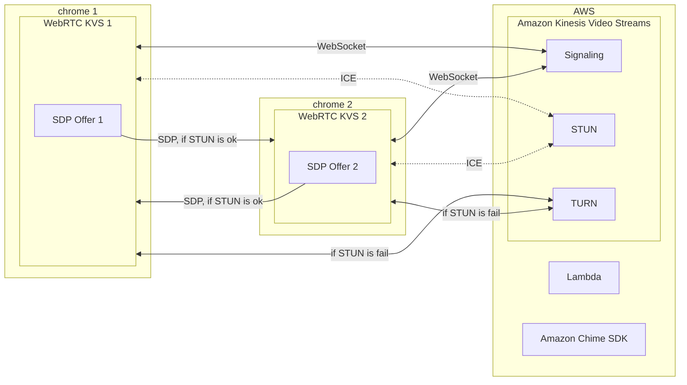

# [Amazon Kinesis Video Streams](https://aws.amazon.com/tw/kinesis/video-streams/)

[![GitHub license][license-image]][license-url]
[![GitHub stars][stars-image]][stars-url]
[![GitHub forks][forks-image]][forks-url]
[![GitHub issues][issues-image]][issues-image]
[![GitHub watchers][watchers-image]][watchers-image]

[license-image]: https://img.shields.io/github/license/lankahsu520/HelperX.svg
[license-url]: https://github.com/lankahsu520/HelperX/blob/master/LICENSE
[stars-image]: https://img.shields.io/github/stars/lankahsu520/HelperX.svg
[stars-url]: https://github.com/lankahsu520/HelperX/stargazers
[forks-image]: https://img.shields.io/github/forks/lankahsu520/HelperX.svg
[forks-url]: https://github.com/lankahsu520/HelperX/network
[issues-image]: https://img.shields.io/github/issues/lankahsu520/HelperX.svg
[issues-url]: https://github.com/lankahsu520/HelperX/issues
[watchers-image]: https://img.shields.io/github/watchers/lankahsu520/HelperX.svg
[watchers-url]: https://github.com/lankahsu520/HelperX/watchers

# 1. [Amazon Kinesis Video Streams (Developer Guide)](https://docs.aws.amazon.com/kinesisvideostreams/latest/dg/what-is-kinesis-video.html)

> Amazon Kinesis Video Streams 可讓您安全輕鬆地將影片從連線裝置串流到 AWS，以進行分析、機器學習 (ML)、播放及其他處理。Kinesis Video Streams 可自動佈建和彈性地擴展所需的全部基礎設施，以便從數百萬台裝置導入串流影片資料。

## 1.1. How it works

[

# 2. [amazon-kinesis-video-streams-producer-sdk-cpp](https://github.com/awslabs/amazon-kinesis-video-streams-producer-sdk-cpp)

> Amazon Kinesis Video Streams Producer SDK for C++ is for developers to install and customize for their connected camera and other devices to securely stream video, audio, and time-encoded data to Kinesis Video Streams.

# 3. [amazon-kinesis-video-streams-webrtc-sdk-c](https://github.com/awslabs/amazon-kinesis-video-streams-webrtc-sdk-c)

> Amazon Kinesis Video Streams Webrtc SDK is for developers to install and customize realtime communication between devices and enable secure streaming of video, audio to Kinesis Video Streams.

# Appendix

# I. Study

#### A. Official - [Amazon Kinesis Video Streams (Developer Guide)](https://docs.aws.amazon.com/kinesisvideostreams/latest/dg/what-is-kinesis-video.html)

#### B. Official - [Kinesis Video Streams (Amazon Kinesis Video Streams WebRTC Developer Guide)](https://docs.aws.amazon.com/kinesisvideostreams-webrtc-dg/latest/devguide/what-is-kvswebrtc.html)

#### C. [WebRTC中的ICE Candidate](https://zhuanlan.zhihu.com/p/476577799)

# II. Debug

# III. Glossary

#### [SDP](https://zh.wikipedia.org/zh-tw/会话描述协议), Session Description Protocol

>會話描述協議**（**Session Description Protocol**或簡寫**SDP**）描述的是[流媒體](https://zh.wikipedia.org/wiki/流媒体)的初始化參數。此協議由[IETF](https://zh.wikipedia.org/wiki/IETF)發表為 [RFC 2327](https://tools.ietf.org/html/rfc2327)。**
>
>SDP最初的時候是會話發布協議（Session Announcement Protocol或簡寫SAP）的一個部件，1998年4月推出第一版[[1\]](https://zh.wikipedia.org/zh-tw/会话描述协议#cite_note-1)，但是之後被廣泛用於和[RTSP](https://zh.wikipedia.org/wiki/RTSP)以及[SIP](https://zh.wikipedia.org/wiki/会话发起协议)協同工作，也可被單獨用來描述[多播](https://zh.wikipedia.org/wiki/多播)會話。

#### [STUN](https://zh.wikipedia.org/zh-tw/会话描述协议):  Session Traversal Utilities for NAT

> STUN（用戶資料報協定[UDP]簡單穿越網路位址轉換器[NAT])伺服器允許所有的NAT客戶終端(如防火牆後邊的電腦)與位於局區域網以外的VOIP服務商實現電話通話。
>
> 通過STUN伺服器，客戶終端可以瞭解他們的公共位址、擋在他們前面的NAT類型和通過NAT與特定局部埠相連的因特網方埠。這些資訊將被用於建立客戶終端與VOIP服務商之間的UDP通信，以便實現通話。STUN協定在[RFC 3489](https://www.ietf.org/rfc/rfc3489.txt)中予以定義。
>
> 雖然是在UDP 埠3478連接STUN伺服器，但會暗示客戶終端在另外一個IP和埠號上實施測試（STUN伺服器有兩個IP位址）。RFC 規定這個埠和IP是隨意的。
#### [TURN](https://zh.wikipedia.org/zh-tw/TURN), Traversal Using Relay around NAT

> **TURN**（全名**Traversal Using Relay around NAT**），是一種資料傳輸協定（data-transfer protocol）。允許在TCP或UDP的連線上跨越[NAT](https://zh.wikipedia.org/wiki/网络地址转换)或[防火牆](https://zh.wikipedia.org/wiki/防火牆)。
>
> TURN是一個client-server協定。TURN的NAT穿透方法與[STUN](https://zh.wikipedia.org/wiki/STUN)類似，都是通過取得應用層中的公有位址達到NAT穿透。但實現TURN client的終端必須在通訊開始前與TURN server進行互動，並要求TURN server產生"relay port"，也就是relayed-transport-address。這時TURN server會建立peer，即遠端端點（remote endpoints），開始進行中繼（relay）的動作，TURN client利用relay port將資料傳送至peer，再由peer轉傳到另一方的TURN client。

# IV. Tool Usage

# Author

Created and designed by [Lanka Hsu](lankahsu@gmail.com).

# License

[HelperX](https://github.com/lankahsu520/HelperX) is available under the BSD-3-Clause license. See the LICENSE file for more info.
