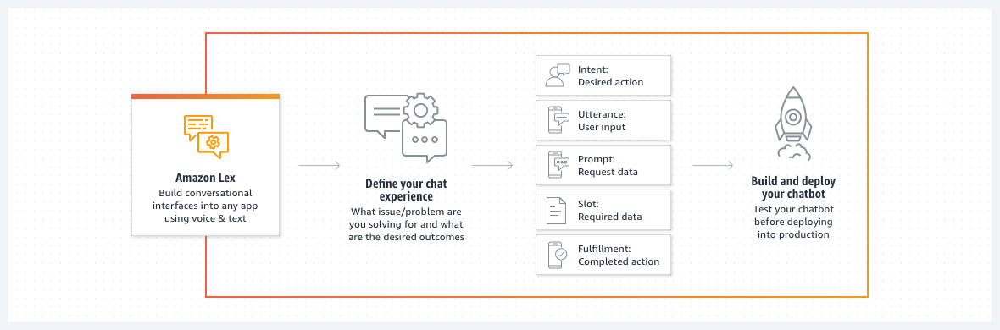

# [Amazon Lex](https://aws.amazon.com/tw/lex/)

[![GitHub license][license-image]][license-url]
[![GitHub stars][stars-image]][stars-url]
[![GitHub forks][forks-image]][forks-url]
[![GitHub issues][issues-image]][issues-image]
[![GitHub watchers][watchers-image]][watchers-image]

[license-image]: https://img.shields.io/github/license/lankahsu520/HelperX.svg
[license-url]: https://github.com/lankahsu520/HelperX/blob/master/LICENSE
[stars-image]: https://img.shields.io/github/stars/lankahsu520/HelperX.svg
[stars-url]: https://github.com/lankahsu520/HelperX/stargazers
[forks-image]: https://img.shields.io/github/forks/lankahsu520/HelperX.svg
[forks-url]: https://github.com/lankahsu520/HelperX/network
[issues-image]: https://img.shields.io/github/issues/lankahsu520/HelperX.svg
[issues-url]: https://github.com/lankahsu520/HelperX/issues
[watchers-image]: https://img.shields.io/github/watchers/lankahsu520/HelperX.svg
[watchers-url]: https://github.com/lankahsu520/HelperX/watchers

# 1. [Amazon Lex (V2 Developer Guide)](https://docs.aws.amazon.com/lexv2/latest/dg/what-is.html)

> Amazon Lex 是一種全受管人工智慧 (AI) 服務，具有用於設計、建置、測試和部署交談介面至應用程式的進階自然語言模型。

# Appendix

# I. Study

## I.1. Official - [Amazon Lex (V2 Developer Guide)](https://docs.aws.amazon.com/lexv2/latest/dg/what-is.html)

## I.2. [建立 Amazon Lex 聊天機器人](https://vocus.cc/article/62247106fd89780001cb0b48)

## I.3. [Amazon Lex 功能](https://aws.amazon.com/tw/lex/features/)

## I.4. [Amazon Lex V2 教學 1](https://aprilyang.home.blog/2022/05/14/lex-jeopardy-bot-1/)

# II. Debug

# III. Glossary

#### ASR, automatic speech recognition

#### NLU, natural language understanding

#### SLU, Speech Language Understanding

# IV. Tool Usage

# Author

Created and designed by [Lanka Hsu](lankahsu@gmail.com).

# License

[HelperX](https://github.com/lankahsu520/HelperX) is available under the BSD-3-Clause license. See the LICENSE file for more info.
