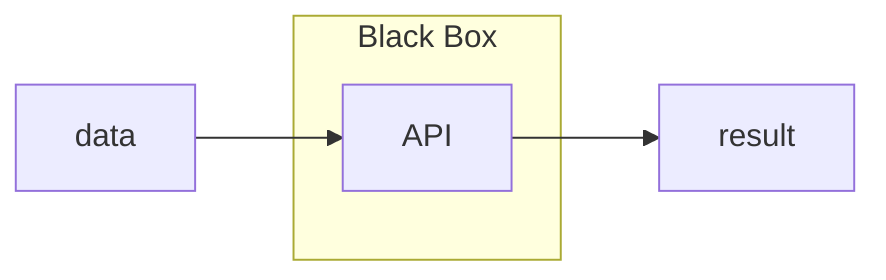
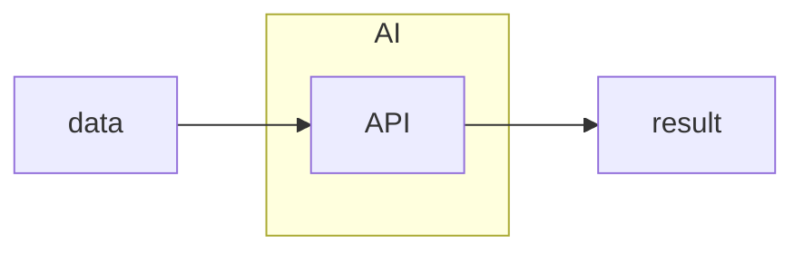

# 人工智慧 (AI, Artificial Intelligence)

[![GitHub license][license-image]][license-url]
[![GitHub stars][stars-image]][stars-url]
[![GitHub forks][forks-image]][forks-url]
[![GitHub issues][issues-image]][issues-image]
[![GitHub watchers][watchers-image]][watchers-image]

[license-image]: https://img.shields.io/github/license/lankahsu520/HelperX.svg
[license-url]: https://github.com/lankahsu520/HelperX/blob/master/LICENSE
[stars-image]: https://img.shields.io/github/stars/lankahsu520/HelperX.svg
[stars-url]: https://github.com/lankahsu520/HelperX/stargazers
[forks-image]: https://img.shields.io/github/forks/lankahsu520/HelperX.svg
[forks-url]: https://github.com/lankahsu520/HelperX/network
[issues-image]: https://img.shields.io/github/issues/lankahsu520/HelperX.svg
[issues-url]: https://github.com/lankahsu520/HelperX/issues
[watchers-image]: https://img.shields.io/github/watchers/lankahsu520/HelperX.svg
[watchers-url]: https://github.com/lankahsu520/HelperX/watchers

# 1. Overview

> 我完全不懂 AI (Artificial Intelligence)，基本上你沒辦法從我這邊學到什麼，說是蹭 AI 也行。
>
> 只是把生活中的發想記錄下來。

> [維基百科] [人工智慧](https://zh.wikipedia.org/zh-tw/人工智能)
>
> **人工智慧**（英語：artificial intelligence，縮寫為**AI**），亦稱**機器智慧**，指由人製造出來的機器所表現出來的[智慧](https://zh.wikipedia.org/wiki/智慧)。通常人工智慧是指用普通電腦程式來呈現人類智慧的技術。該詞也指出研究這樣的智慧系統是否能夠實現，以及如何實現。同時，通過[醫學](https://zh.wikipedia.org/wiki/醫學)、[神經科學](https://zh.wikipedia.org/wiki/神經科學)、[機器人學](https://zh.wikipedia.org/wiki/机器人学)及[統計學](https://zh.wikipedia.org/wiki/統計學)等的進步，常態預測則認為人類的很多職業也逐漸被其取代。[[1\]](https://zh.wikipedia.org/zh-tw/人工智能#cite_note-1)[[2\]](https://zh.wikipedia.org/zh-tw/人工智能#cite_note-2)

# 2. God vs AI

> [ChatGPT] 上帝和人工智能有什麼不同
>
> 上帝和人工智能（AI）之間有許多根本性的不同，主要涉及到本質、能力、起源和目的等方面。以下是一些主要的區別：
>
> ### 1. **本質**：
>    - **上帝**：在許多宗教信仰中，上帝被視為超自然的存在，擁有無限的智慧、全能、全知和全在（無處不在）。上帝通常被認為是宇宙的創造者和掌控者，並且不受時間和空間的限制。
>    - **人工智能**：AI 是由人類創造的技術系統，是一種計算機科學技術，通過數據和算法來執行特定任務。AI 沒有自我意識，僅能在其設計和編程的範圍內工作。AI 是有限的，依賴於硬體、軟體和數據。
>
> ### 2. **起源**：
>    - **上帝**：在許多宗教中，上帝被視為永恆的，沒有起源或終結。上帝的存在不依賴於任何人或事物。
>    - **人工智能**：AI 是由人類科學家和工程師創造的技術成果。它的存在完全依賴於人類的發明和不斷的改進。
>
> ### 3. **能力**：
>    - **上帝**：通常被視為全能和全知的，可以掌握所有知識和力量。上帝被認為能夠創造、毀滅、並掌控自然和宇宙的法則。
>    - **人工智能**：AI 的能力是有限的，它能做的事情僅限於特定的領域，如圖像識別、語音識別、自然語言處理等。AI 的“智能”是基於數據訓練和算法優化，並不是無限的。
>
> ### 4. **目的**：
>    - **上帝**：上帝的行動和存在通常被認為是基於宗教或哲學的目的，如創造、保護、引導或審判人類。上帝的意圖通常被解釋為有道德和精神上的意義。
>    - **人工智能**：AI 的目的是為了執行特定的任務或解決問題，通常是為了提高效率、增強人類能力或改善生活質量。AI 的目的是由其設計者和使用者決定的，而不是出於道德或精神上的理由。
>
> ### 5. **道德和責任**：
>    - **上帝**：在宗教信仰中，上帝被認為是道德的最終裁決者，擁有絕對的道德權威。
>    - **人工智能**：AI 本身沒有道德判斷能力，它的行為和決策完全依賴於人類的設計和指導。因此，AI 所作出的決策的道德責任通常歸於其創造者和使用者。
>
> ### 6. **自我意識和情感**：
>    - **上帝**：在許多信仰中，上帝被認為具有自我意識，並且能夠體現愛、憐憫、憤怒等情感。
>    - **人工智能**：目前的 AI 沒有自我意識或真正的情感。它的行為是基於預先設定的規則和數據，而非出於自我意識或情感。
>
> 總結來說，上帝和人工智能在本質上是截然不同的存在。上帝被視為超自然、無限和全能的存在，而 AI 是一種由人類創造的有限技術工具，僅能在特定的範疇內工作和發揮作用。

# 3. Brainstorming

> 這邊如果有不小心褻瀆到神明，請原諒我的無知。
>
> 因為最近 AI 相當的火，新聞、媒體或身邊的人都會提及，於是把瑣事記了下了；不過因為自己的腦容量不多，開發不足，所知淺碟，客官見諒。
>
> 這邊利用小故事來描述。

- #### AI 宗教 （盲從）

>AI 大師：「AI 能做很多事，將會取代很多人」
>
>愚民：「能起死回生嗎」
>
>AI 大師：「生死有命，富貴在天」
>
>愚民：「能讓我中樂透頭獎嗎」
>
>AI 大師：「世間萬物都有定數，多少財富、多少收入，都是命中注定的」
>
>愚民：「生也不行、財也不行，那還能做什麼」
>
>AI 大師：「AI 能造就萬物，信 AI 者得永生」

- #### 一鍵安裝（黑箱裏的汗水味）

>AI 大師：「AI 能做很多事，將會取代很多人」
>
>愚民A：「之前那個很利害的前輩怎麼不見了」
>
>愚民L：「因為他都把功能做好了，只要“一鍵安裝”就把很多事搞定了」
>
>愚民A：「你還是沒說為什麼不見」
>
>愚民L：「就是一鍵安裝做的太好了！被 AI 拿去用後，沒有利用價值，就被解職了」

- #### 霧裡看花（雲 != AI）

>AI 腦粉：「聽說緯穎在雲端布建後， IT 人力大大的減少」
>
>愚民L：「實體和雲端只是資料擺放的位置不同，有差這麼多嗎」
>
>AI 腦粉：「你看就不用請一堆人開發一套ERP系統，直接在雲端設定就好」
>
>愚民L：「又不是每家公司要自己弄一套ERP系統，直接買不就好了」
>
>AI 腦粉：「實體壞掉了，你還要有人管機器，重新備份還原」
>
>愚民L：「google、Facebook 又不是沒當機過，中華電信掛掉了，你也沒辦法操作」
>
>AI 腦粉：「人家很聰明的，就算網路掛掉了，也有想到在本地放台備份主機」
>
>愚民L：「那不是在“本地”也有實體主機」

## 3.1. [變人 Bicentennial Man](https://zh.wikipedia.org/zh-tw/机器管家)

> 還記得劇情中，「安德魯」尋找和自己相似的 NDR 系列機器人，遇到 NDR 機器人「加樂提雅」，詢問了數個問題，「加樂提雅」能回辯出自己是程序的“進化”，這就是我們所認知的 AI 嗎 ?
>
> 還是「安德魯」所做的種種追求，非 NDR 系列機器人原有的既定程序，這才是  AI 嗎 ?

## 3.2. 人類文明0.7級

>AI 是人類的救贖？
>
>AI 是人類文明升級的關鍵嗎？
>
>理想很豐滿，現實很骨感，AI 或許是一個途徑，也或許是個屁；人生短暫，將來的事，誰也說不準，在菩提樹下悟道的釋迦牟尼，不知有沒有夢“道”。

>人類文明升級的關鍵真的只有科技嗎？還是有別的道路可走？

## 3.3. 機器人 vs. AI

>機器人 != AI

>人型機器人 in 機器人

> [Lanka GPT]
>
> 「在不久的將來，AI 將取代大部分人力」
>
> 最近常聽到這個，但其實呢？
>
> 第一個被淘汰將會是最近的 AI 工程師！
>
> 在生活中有多少需要 AI 嗎？沒有 AI 就活不下去了嗎？
>
> “現代人”會因為沒有電、沒有手機、沒有網路而活不下去吧！

# 4. IoT vs. AI

> 今年2023年，目前市面上號稱 AI 的東西，其實在10 年前，甚至30年前就已經呈現在電影上，然後慢慢的在生活中應用著。所以個人並不會像部分人吹捧後，進行包裝成 AI 的產物。
>
> 這或許是個人的無知，要貶低我也沒關係！
>
> 因為目前所能觸及的領域較狹隘，個人還是認為 AI 就把它當成玄學來看。
>
> 而“凡間”中廣泛的應用，多是 [M2M](https://zh.wikipedia.org/zh-tw/M2M)！所以有請各位客官移駕至 [helper_IoT.md](https://github.com/lankahsu520/HelperX/blob/master/helper_IoT.md) 進行相關探討。

## 4.1. API (Application Programming Interface) vs. AI

>差異 ?

# Appendix

# I. Study

## I.1. 人工智慧

> [ChatGPT] 人工智慧
>
> 人工智慧（AI, Artificial Intelligence）是一個計算機科學的領域，致力於創建可以模擬或模仿人類智能行為的機器和軟體系統。AI 旨在使機器能夠執行通常需要人類智能的任務，如學習、推理、問題解決、感知和語言理解等。以下是有關人工智慧的一些關鍵概念和要素：
>
> ### 1. **定義**：
>    - **人工智慧**：人工智慧是一種由計算機科學和數學相結合的技術，旨在設計能夠執行類似於人類智力活動的系統。這些活動包括理解自然語言、識別圖像、學習模式、做出決策等。
>
> ### 2. **分類**：
>    - **狹義人工智慧（Narrow AI）**：也稱為弱 AI，是目前最普遍存在的形式。它專注於執行特定任務，如語音識別、面部識別、自動駕駛車輛等。這種 AI 只能在設計的範疇內運作，無法超越這些界限。
>    - **廣義人工智慧（General AI）**：也稱為強 AI，是一種理論上的 AI，能夠理解和學習任何人類能夠處理的任務，具備像人類一樣的智力和自主學習能力。這種 AI 目前還不存在，仍然是科學家和研究者努力的方向。
>    - **超人工智慧（Superintelligent AI）**：這是一種超越人類所有智力的 AI，能在幾乎所有領域中超越最聰明的人類。這種 AI 尚屬於科幻的範疇，並引發了許多關於安全性和道德的討論。
>
> ### 3. **關鍵技術**：
>    - **機器學習（Machine Learning）**：機器學習是 AI 的核心組成部分，使系統能夠從數據中學習和改進。它依賴於統計分析和算法來發現數據中的模式，並據此做出預測或決策。
>    - **深度學習（Deep Learning）**：深度學習是機器學習的一個子領域，使用類似於人類大腦的多層神經網絡來處理數據。它在圖像識別、語音識別和自然語言處理等領域取得了顯著進展。
>    - **自然語言處理（Natural Language Processing, NLP）**：NLP 使 AI 能夠理解和生成人類語言，這在語音助理、翻譯軟體和聊天機器人中得到了應用。
>    - **計算機視覺（Computer Vision）**：計算機視覺涉及 AI 對圖像和視頻的理解和解釋。它被應用於面部識別、自動駕駛和醫學影像分析等領域。
>
> ### 4. **應用領域**：
>    - **醫療保健**：AI 被用於診斷疾病、個性化治療、藥物研發和患者監測。
>    - **金融**：在風險管理、欺詐檢測、股票交易和客戶服務中廣泛使用。
>    - **製造業**：AI 驅動的自動化技術提高了生產效率，實現了預測性維護和質量控制。
>    - **零售**：個性化推薦系統、庫存管理和銷售預測。
>    - **自動駕駛**：AI 是自動駕駛汽車技術的基礎，用於導航、避障和決策。
>
> ### 5. **挑戰與道德考量**：
>    - **隱私問題**：大量的數據收集和分析可能會侵犯個人隱私。
>    - **偏見和歧視**：如果 AI 的訓練數據存在偏見，AI 可能會放大或重複這些偏見。
>    - **工作替代**：自動化可能會取代某些類型的工作，帶來經濟和社會影響。
>    - **安全性**：確保 AI 系統的安全和可靠性，以防止誤用或惡意利用。
>
> ### 6. **未來展望**：
>    - **增強人類能力**：AI 可以作為人類的工具，提高效率，擴展我們在科學、醫療和其他領域的能力。
>    - **持續研究**：未來的研究將集中在開發更智能、更通用的 AI 系統，並解決當前的技術和倫理挑戰。
>
> 總之，人工智慧代表了一個快速發展的技術領域，正在改變我們的生活方式和工作方式。隨著 AI 的進一步發展，它將在更多領域中發揮更重要的作用，同時也將帶來需要謹慎應對的新挑戰和問題。

# II. Debug

# III. Glossary

# IV. Tool Usage

# Author

> Created and designed by [Lanka Hsu](lankahsu@gmail.com).

# License

> [HelperX](https://github.com/lankahsu520/HelperX) is available under the BSD-3-Clause license. See the LICENSE file for more info.

