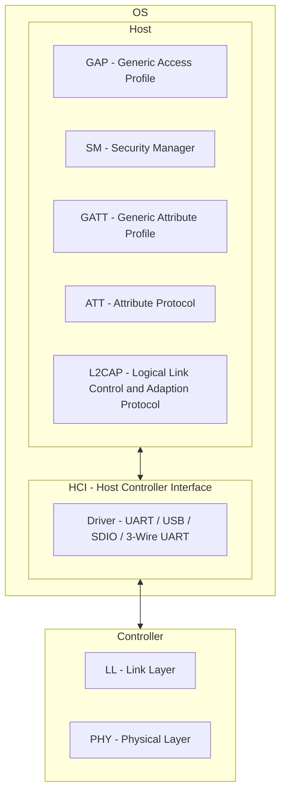

# BLE

[![GitHub license][license-image]][license-url]
[![GitHub stars][stars-image]][stars-url]
[![GitHub forks][forks-image]][forks-url]
[![GitHub issues][issues-image]][issues-image]
[![GitHub watchers][watchers-image]][watchers-image]

[license-image]: https://img.shields.io/github/license/lankahsu520/HelperX.svg
[license-url]: https://github.com/lankahsu520/HelperX/blob/master/LICENSE
[stars-image]: https://img.shields.io/github/stars/lankahsu520/HelperX.svg
[stars-url]: https://github.com/lankahsu520/HelperX/stargazers
[forks-image]: https://img.shields.io/github/forks/lankahsu520/HelperX.svg
[forks-url]: https://github.com/lankahsu520/HelperX/network
[issues-image]: https://img.shields.io/github/issues/lankahsu520/HelperX.svg
[issues-url]: https://github.com/lankahsu520/HelperX/issues
[watchers-image]: https://img.shields.io/github/watchers/lankahsu520/HelperX.svg
[watchers-url]: https://github.com/lankahsu520/HelperX/watchers

# 1. Overview

> You can call Bluetooth Low Energy, Bluetooth LE, BLE.
>
> Bluetooth Low Energy is a wireless, low-power personal area network that operates in the 2.4 GHz ISM band. Its goal is to connect devices over a relatively short range. BLE was created with IoT applications in mind, which has particular implications for its design. For example, IoT devices tend to be constrained and require extended battery use, so BLE favors low power consumption over continuous data transfer. In other words: when not in use, it goes into sleep mode to conserve energy.

## 1.1. Device rules
> It is asymmetry.
>
> Neither two central nor two peripheral devices can talk to each other. Communication is only possible between a central and a peripheral device.

#### A. Central Device

#### B. Peripheral Device

> which has limited functionality.

## 1.2. Server or Client

> The device mode should not be confused with its Generic Attribute Profile (GATT), where a device can either act as a server or a client.
>
> 這邊提到的就是在設備定義中有 Central 和 Peripheral 兩種。但是在功能面中，GATT 可以讓每一個設備同時具備 Server 和 Client 的 “功能”（為什麼不用“角色”這名詞，最近常發生與非理工的人討論 Server 和 Client時，他們常常搞不清傳輸是雙向的，只是觸發的時間有先後。 ）。

## 1.3. BLE vs Bluetooth Classic

> SIG introduced Bluetooth Low Energy in its 2010 Bluetooth 4.0 specification (with later, 2016 Bluetooth 5 specification, being devoted exclusively to BLE).
>
> Its main focus was on the growing market of health- and fitness-related devices and smart home and [indoor location](https://www.avsystem.com/blog/indoor-location-tracking/). 

|      | Bluetooth Classic | BLE                |
| ---- | ----------------- | ------------------ |
| 傳輸 | 連續且長時間傳輸  | 短時間的小封包傳輸 |
| 功耗 | 1   1 W        | 1/100   0.01~0.50 W              |
| 傳輸速率 | 1~3 Mbit/s | 125 Kbit/s~2 Mbit/s |
| 距離 | 100m | <100m |

# 2. Software Architecture

> 這邊為什麼多加一個 OS group，因為所有模組或是晶片都是嫁接在一個作業系統上，不管是 Linux 或是 RTOS，才會生出一個  UART 或 USB 接口。
>
> 很多文件和網頁都省略了作業系統，其實 HCI 這層就等同於 Driver；當我們看不到連上任何接口時，是要往那個地方送資料啊。另外 Host 也是一個麻煩處，裏面包含了加解密、資料格式定義等，是要每位設備開發者都要先把 BLE 規格讀過一遍才去開發嗎？

> 這邊就有些微詞，當你身為一個設備的開發者，拿到晶片廠的晶片，還要去幫晶片廠寫 HCI 和  Host Layer嗎？

> 在 Linux 之上有 BlueZ，這真的是造福大眾，由衷的感謝！

# Appendix

# I. Study

#### A. [BLE（16）—— BLE 层次（HOST/HCI/Controller）](https://blog.csdn.net/zhoutaopower/article/details/96477626)

#### B. [Everyone is using Bluetooth Low Energy – should you?](https://www.avsystem.com/blog/bluetooth-low-energy-ble/)

# II. Debug

# III. Tool Usage

# Author

Created and designed by [Lanka Hsu](lankahsu@gmail.com).

# License

[HelperX](https://github.com/lankahsu520/HelperX) is available under the BSD-3-Clause license. See the LICENSE file for more info.

