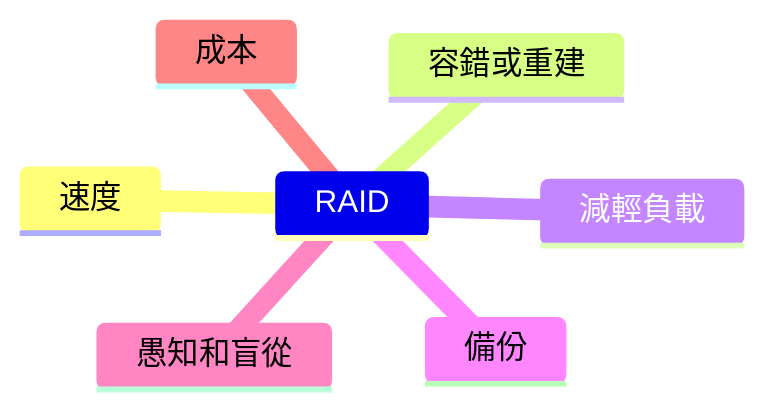
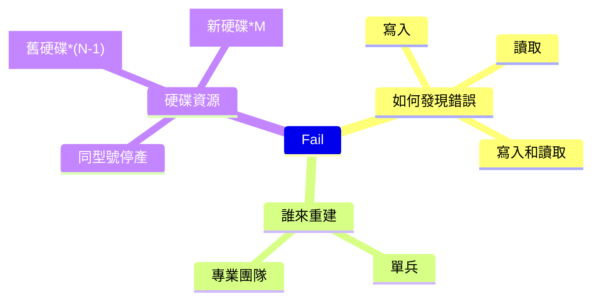

# Backup vs. RAID 

[![GitHub license][license-image]][license-url]
[![GitHub stars][stars-image]][stars-url]
[![GitHub forks][forks-image]][forks-url]
[![GitHub issues][issues-image]][issues-image]
[![GitHub watchers][watchers-image]][watchers-image]

[license-image]: https://img.shields.io/github/license/lankahsu520/HelperX.svg
[license-url]: https://github.com/lankahsu520/HelperX/blob/master/LICENSE
[stars-image]: https://img.shields.io/github/stars/lankahsu520/HelperX.svg
[stars-url]: https://github.com/lankahsu520/HelperX/stargazers
[forks-image]: https://img.shields.io/github/forks/lankahsu520/HelperX.svg
[forks-url]: https://github.com/lankahsu520/HelperX/network
[issues-image]: https://img.shields.io/github/issues/lankahsu520/HelperX.svg
[issues-url]: https://github.com/lankahsu520/HelperX/issues
[watchers-image]: https://img.shields.io/github/watchers/lankahsu520/HelperX.svg
[watchers-url]: https://github.com/lankahsu520/HelperX/watchers

# 1. Overview

> 人們應該是追求資料的健全保存後，再取得效能上的平衡。
>
> 而一般人細究 RAID 是沒有意義，要認知自身的需求，評估選擇有利的應用。

# 2. RAID   (**R**edundant **A**rray of **I**ndependent **D**isks)

> [維基百科]
>
> **容錯式磁碟陣列**（**RAID**, **R**edundant **A**rray of **I**ndependent **D**isks），舊稱**容錯式廉價磁碟陣列**（**R**edundant **A**rray of **I**nexpensive **D**isks），簡稱**磁碟陣列**。利用虛擬化儲存技術把多個硬碟組合起來，成為一個或多個硬碟陣列組，目的為提升效能或資料冗餘，或是兩者同時提升。
>
> 在運作中，取決於 RAID 層級不同，資料會以多種模式分散於各個硬碟，RAID 層級的命名會以 RAID 開頭並帶數字，例如：RAID 0、RAID 1、RAID 5、RAID 6、RAID 7、RAID 01、RAID 10、RAID 50、RAID 60。每種等級都有其理論上的優缺點，不同的等級在兩個目標間取得平衡，分別是增加資料可靠性以及增加記憶體（群）讀寫效能。
>
> 簡單來說，RAID把多個[硬碟](https://zh.wikipedia.org/wiki/硬碟)組合成為一個邏輯硬碟，因此，[作業系統](https://zh.wikipedia.org/wiki/作業系統)只會把它當作一個實體硬碟。RAID常被用在[伺服器](https://zh.wikipedia.org/wiki/伺服器)電腦上，並且常使用完全相同的硬碟作為組合。由於硬碟價格的不斷下降與RAID功能更加有效地與[主機板](https://zh.wikipedia.org/wiki/主機板)整合，它也成為普通使用者的一個選擇，特別是需要大容量儲存空間的工作，如：視訊與音訊製作。

## 2.0. Mind

> 這邊不討論，硬碟壞了，而要從中把資料提取出來。

### 2.0.1. 追求目的

### 2.0.2. 當錯誤發生時

> 資料和硬碟是重點，其它不在此項考慮（如電源燒壞，螢幕不亮）
>
> 注意：假設情況如由 N 顆碟組成的 RAID，此時壞掉一顆硬碟，你將可能需另外準備 M 顆新的硬碟。
>
> M=N

## 2.1. RAID 0

> 實體 Disk * 2 (up)
>
> Physical Drives 1TB + 1TB = 2TB Logical Drive(Array)
>
>  無『容錯功能 Fault Tolerant 』
>
> 任何1台硬碟受損，RAID 0 即損毀，無法讀取內部資料。

>只要1台硬碟受損，就救不回來了！

## 2.2. RAID 1

> 實體 Disk * 2^n (n>=1)
>
> Physical Drives 1TB + 1TB = 1TB Logical Drive(Array)
>
> 無『容錯功能 Fault Tolerant』
>
> 鏡像功能（Mirror）將一隻檔案自動變成兩份
>
> 其中一台硬碟機發生問題，只要另一台仍為正常狀態，便可以維持其RAID 1功能正常運作。

>只要不是兩顆同時壞，更換壞掉的那顆即可，資料複製就可完成重建。相對的很簡單！
>
>一般人能排除。
>
>當然同時壞，就沒救了。

## 2.3. RAID 5

>實體 Disk * 3 (up)
>
>Physical Drives 1TB + 1TB + 1TB = 2 TB Logical Drive(Array) + 1 TB Parity Blocks
>
> Parity 運算
>
>若有一台硬碟故障時，RAID 5 Status會顯示『RAID Degraded』，但還是可以正常讀寫資料，當下最重要、該盡快處理的，不是立刻更換正常硬碟將 RAID 5 Rebuild，正確、安全的做法是趁 RAID 5還能夠讀取資料時，趕快將資料備份出來，事後再作重建 Rebuild。

>先不考慮 Parity 壞掉。就算一台硬碟壞了，而通常 RAID 5 內的硬碟都是相同廠牌型號，所以硬碟品質基本上是相同。注意，先備份！

## 2.4. RAID 6

>實體 Disk * 4 (up)
>
>Physical Drives 1TB + 1TB = 2 TB Logical Drive(Array) + 2 TB Parity Blocks
>
>Parity 運算
>
>同時發生兩台硬碟機故障時，也能夠容許、並維持磁碟陣列持續正常運作，儲存、寫入資料不受影響，實際上不會因為壞兩台硬碟，而導致整組 RAID 6 Offline 的情況。

## 2.5. RAID 7

## 2.6. RAID 01

## 2.7. RAID 10

## 2.8. RAID 50

## 2.9. RAID 60

## 2.X. RAID 迷思

> 一般人常有的迷思，並不是說使用 RAID 就萬能，真的有如神助 ?

#### A. RAID 不等同於是備份。

#### B. 空間的使用量一定變少！

#### C. 速度真的比較快 ?

#### D. 真的比較保險 ?

#### E. 出事了，可能附帶的成本更加沉重！
>專業的不見得是好的。

#### F. 硬碟停產，全部是否要淘汰換新 ?

#### G. 有可能要求救於專業的『[RAID資料救援](https://www.linwei.com.tw/process-detail/raid_diska/)』
>因為文章是引用它們的，所以就幫它們打廣告。

# 3. Backup

>[維基百科]
>
>**備份**（英語：backup），在[資訊科技](https://zh.wikipedia.org/wiki/信息技术)與[資料管理](https://zh.wikipedia.org/wiki/数据管理)領域，指將[檔案系統](https://zh.wikipedia.org/wiki/文件系统)或[資料庫](https://zh.wikipedia.org/wiki/数据库)系統中的資料加以[複製](https://zh.wikipedia.org/wiki/复制)；一旦發生災難或錯誤操作時，得以方便且及時地恢復系統的有效資料和正常運作。重要資料應當[異地備援](https://zh.wikipedia.org/wiki/異地備援)，降低風險。

# Appendix

# I. Study

## I.1. [RAID](https://zh.wikipedia.org/zh-tw/RAID)

## I.2. [RAID 0是什麼？看完這一篇就理解基礎（2022最新）](https://www.linwei.com.tw/forum-detail/13/)

## I.3. [RAID 1是什麼？一篇就理解架構與原理（2022最新）](https://www.linwei.com.tw/forum-detail/12/)

## I.4. [RAID 5 是什麼？一篇搞懂其原理與架構（2022年最新）](https://www.linwei.com.tw/forum-detail/11/)

## I.5. [RAID 6 是什麼？帶你了解其原理與架構（2022年最新）](https://www.linwei.com.tw/forum-detail/52/)

# II. Debug

# III. Glossary

#### Block Striping, 

> [ChatGPT]
>
> "Block Striping" 是一種在資料存儲和數據管理中使用的技術，通常應用於儲存系統、RAID（Redundant Array of Independent Disks）組態、分散式儲存和雲儲存等場景中。它的主要目標是提高數據的存取速度和容錯性。
>
> Block Striping 通常涉及將數據分成固定大小的區塊（或稱為 "块"）並將這些區塊分佈到多個儲存設備或磁盤上，而不僅僅將數據寫入單個儲存設備。這樣做有幾個優勢：
>
> 1. **提高性能：** 通過將數據分散到多個設備上，可以平行處理讀取和寫入操作，從而提高了存取速度。不同的區塊可以同時在不同的磁盤上進行讀寫，從而減少了 I/O 瓶頸。
> 2. **容錯性：** 如果其中一個磁盤失效，只需重新創建並還原失敗的區塊，而不需要從頭開始重建整個儲存系統。這提高了系統的容錯性，減少了數據損失的風險。
> 3. **平衡負載：** 通過均勻分佈區塊到多個磁盤上，可以實現負載平衡，確保每個磁盤的使用率大致相等，從而提高了整個系統的效率。
>
> Block Striping 的實現方式可以因不同應用和系統而異。在 RAID 組態中，常見的 RAID 級別，如 RAID 0 和 RAID 5，使用了 Block Striping 技術。在分散式儲存系統中，數據通常被分為許多區塊，然後分佈到不同的伺服器或節點上。
>
> 總之，Block Striping 是一種用於提高數據存取速度、容錯性和負載平衡的技術，通過將數據分區到多個儲存設備上實現這些優勢。

#### Data Striping,

>[ChatGPT]
>
>"Data Striping"（數據分段）是一種資料儲存和管理技術，通常應用於儲存系統、RAID（Redundant Array of Independent Disks）組態、分散式儲存和儲存虛擬化等領域。它的主要目標是改進數據的存取速度和效能。
>
>Data Striping 類似於 Block Striping，但它將數據分成不同大小的區段（或稱為 "條帶" 或 "段"），然後按照固定的順序依次存儲在多個儲存設備或磁盤上。這樣做的主要優勢是：
>
>1. **提高性能：** 數據分段使得在多個設備之間進行平行讀寫操作成為可能。不同的數據段可以同時在不同的磁盤或設備上進行存取，從而提高了數據存取的速度和效能。
>2. **負載平衡：** 通過分散數據段到多個設備上，可以實現負載平衡，確保每個儲存設備的使用率大致相等，這有助於提高整個系統的效率。
>3. **容錯性：** 類似於 Block Striping，如果其中一個磁盤失效，只需重新創建和還原失敗的數據段，而不需要重建整個儲存系統，這提高了容錯性。
>
>Data Striping 的實現方式可以因不同應用和系統而異。在 RAID 組態中，常見的 RAID 級別，如 RAID 0，使用了 Data Striping 技術。在分散式儲存系統中，數據通常被分為不同的段，然後分佈到不同的伺服器或節點上。
>
>總之，Data Striping 是一種用於提高數據存取速度、負載平衡和容錯性的技術，通過將數據分段並分佈到多個儲存設備上實現這些優勢。這有助於優化儲存系統的性能和可用性。

#### Block Striping vs Data Striping,

>我看不出有什麼不同。
>
>[ChatGPT]
>
>"Block Striping" 和 "Data Striping" 都是資料存儲和管理技術，旨在提高數據存取速度、效能和容錯性，但它們有一些關鍵差異：
>
>1. **分割單位：**
>   - **Block Striping（區塊分段）：** Block Striping 將數據分成固定大小的區塊或块，然後將這些區塊分佈到多個儲存設備或磁盤上。每個區塊是獨立的，不關心其內容。
>   - **Data Striping（數據分段）：** Data Striping 將數據分成不同大小的區段或段，然後按照固定的順序依次存儲在多個儲存設備或磁盤上。每個數據段是有意義的數據片段，通常包含一個文件或一個文件的一部分。
>2. **用途和結構：**
>   - **Block Striping：** Block Striping 主要用於提高數據存取的速度和效能。它可以在多個磁盤之間平行處理讀取和寫入操作，從而加速數據存取。
>   - **Data Striping：** Data Striping 通常在多個設備之間分佈有關同一數據集的不同部分。這有助於實現負載平衡、提高容錯性和分佈數據。
>3. **數據組織：**
>   - **Block Striping：** 在 Block Striping 中，數據被劃分為相同大小的块，並且每個块可以獨立處理。
>   - **Data Striping：** 在 Data Striping 中，數據被劃分為不同大小的段，這些段通常是有關同一數據集的部分。
>4. **容錯性：**
>   - **Block Striping：** 在一些 Block Striping 應用中，單個磁盤的故障可能會影響整個块的完整性，這可能需要重建整個块。
>   - **Data Striping：** 在 Data Striping 中，如果單個設備或磁盤失效，只需重新創建和還原失敗的數據段，而不需要重建整個段，這提高了容錯性。
>
>總之，Block Striping 和 Data Striping 都是用於改善數據存取效能和容錯性的技術，但它們區分在於數據的分割方式和用途。 Block Striping 主要關注數據存取速度，而 Data Striping 關注數據的分佈和組織，以實現負載平衡和容錯性。选择使用哪種技術取決於特定應用的需求。

# IV. Tool Usage

# Author

Created and designed by [Lanka Hsu](lankahsu@gmail.com).

# License

[HelperX](https://github.com/lankahsu520/HelperX) is available under the BSD-3-Clause license. See the LICENSE file for more info.

