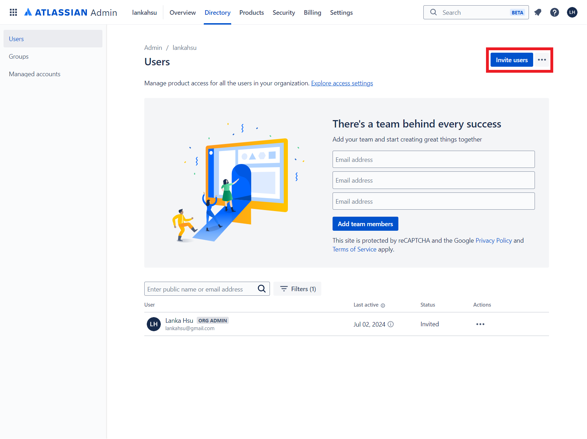
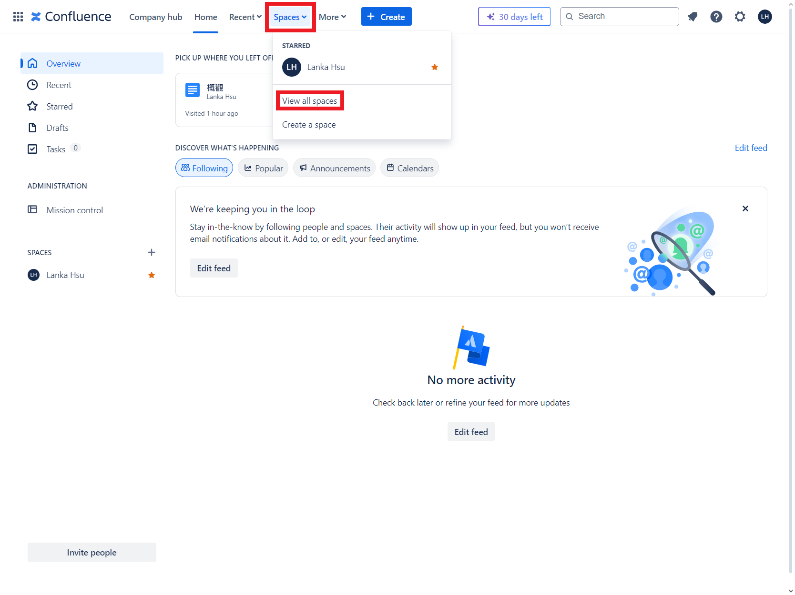
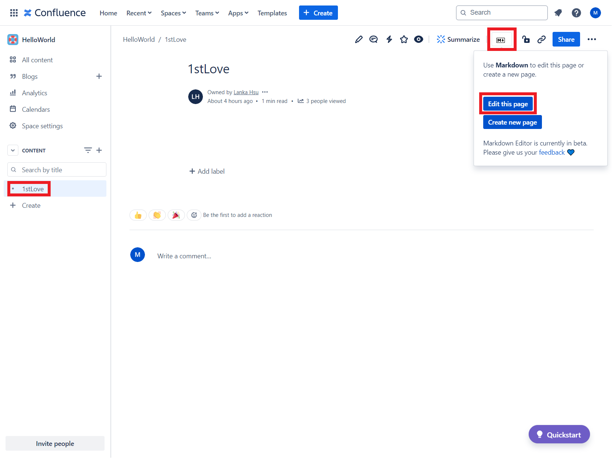

# [Confluence](https://www.atlassian.com/software/confluence)

[![GitHub license][license-image]][license-url]
[![GitHub stars][stars-image]][stars-url]
[![GitHub forks][forks-image]][forks-url]
[![GitHub issues][issues-image]][issues-image]
[![GitHub watchers][watchers-image]][watchers-image]

[license-image]: https://img.shields.io/github/license/lankahsu520/HelperX.svg
[license-url]: https://github.com/lankahsu520/HelperX/blob/master/LICENSE
[stars-image]: https://img.shields.io/github/stars/lankahsu520/HelperX.svg
[stars-url]: https://github.com/lankahsu520/HelperX/stargazers
[forks-image]: https://img.shields.io/github/forks/lankahsu520/HelperX.svg
[forks-url]: https://github.com/lankahsu520/HelperX/network
[issues-image]: https://img.shields.io/github/issues/lankahsu520/HelperX.svg
[issues-url]: https://github.com/lankahsu520/HelperX/issues
[watchers-image]: https://img.shields.io/github/watchers/lankahsu520/HelperX.svg
[watchers-url]: https://github.com/lankahsu520/HelperX/watchers

# 1. Overview

>就是文件管理系統，相較於使用 Google Drive，一樣有共同編輯的功能，但是少了檔案的概念。
>
>本篇主要是嘗試使用此系統，配合個人的使用習慣，將遇到的相關問題記錄下來而已。

> [維基百科](https://zh.wikipedia.org/zh-tw/Confluence) **Confluence** 是一款建基於網路企業[維基](https://zh.wikipedia.org/wiki/維基) (collaboration software) 的軟體，由澳洲軟體公司艾特萊森[Atlassian](https://zh.wikipedia.org/wiki/Atlassian)所開發，[[1\]](https://zh.wikipedia.org/zh-tw/Confluence#cite_note-1) 使用[Java](https://zh.wikipedia.org/wiki/Java)編寫，並於2004年推出。Confluence 獨立軟體內建Tomcat網頁瀏覽器與[hsql](https://zh.wikipedia.org/wiki/HSQLDB)資料庫，同時也支援其他資料庫[[2\]](https://zh.wikipedia.org/zh-tw/Confluence#cite_note-2)。
>
> 開發公司在市場上將Confluence定位為[企業軟體](https://zh.wikipedia.org/wiki/企業軟體)，可做為公司內部使用軟體或於[SaaS](https://zh.wikipedia.org/wiki/SaaS)或於[AWS](https://zh.wikipedia.org/wiki/亞馬遜雲端運算服務)上使用[[3\]](https://zh.wikipedia.org/zh-tw/Confluence#cite_note-3)[[4\]](https://zh.wikipedia.org/zh-tw/Confluence#cite_note-4)。

# 2. Confluence

>請自行使用個人帳號建立並登入，這樣才有管理者權限。它提供30天的免費試用。
>
>這邊為什麼建議個人建立，因為如果使用公司建立的空間，如果遇到權限的問題，在網頁是不會有任何提示的，而你將無從解決。

## 2.1. My Home

### 2.1.1. Change Language & Region

#### A. Manage Account

#### B. Account preferences

### 2.1.2. Atlassian Homepage

> go to Atlassian Homepage

#### A. YOUR APPS

#### B. G'day, Lanka Hsu

### 2.1.3. Invite Person

#### A. Administration

#### B. Manage users of Confluence

#### C. Invite users

#### D. Input Email

#### E. Users

#### F. Groups

#### G. confluence-users-lankahsu

### 2.1.4. Remove User

####  A. Select User

#### B. Remove User

#### C. Confirm

## 2.2. Spaces

### 2.2.1. Create a space

#### A. Create a space

#### B. Choose a template

> 說真的，有時功能太多，反而會造成選擇障礙。
>
> 選擇最簡單的 Blank

#### C. Personalize your space

#### C. HelloWorld space

### 2.2.2. List spaces

#### A. View all spaces

#### B. Spaces - star this space

### 2.2.3. Remove a space

#### A. Space settings

#### B. Send this space to trash

## 2.3. Contents

### 2.3.1. Create a Page

#### A. Create

#### B. Rename

#### C. Input your name

#### D. 1stLove Page

## 2.4. Apps

>當編輯 Page 時，如果要使用 mermaid 畫圖時，需使用 Confluence 的 Macro 功能（或稱 *embedded* function）。

>而 Macro 是需要使用者另行安裝 Apps（或稱 Plugins）來滿足需求。值得注意的是，有些 Apps 要額外收錢。

### 2.4.1. Admin vs. User

> 請先確定使用者的權限

#### A. Admin

#### B. User

### 2.4.2. Markdown for Confluence - Markdown Editor in Confluence

> Native Markdown Editor adds alternative editor that supports Markdown in Confluence

#### A. Find new apps

#### B. Search

#### C. Get app

#### D. App requested

#### E. Email

#### F. View app request (admin)

#### G. Manage app requests (admin)

#### H. Get app (admin)

#### I. Manage app (admin)

#### J. User-installed apps (admin)

#### K. Edit 1stLove Page

### 2.4.3. Mermaid Charts & Diagrams for Confluence

> Mermaid macro 

### 2.4.4. Mermaid Diagrams for Confluence

> Mermaid macro 

# Appendix

# I. Study

## I.1. [更好的網頁開發流程：學會運用 Confluence, Airtable, Jira 與 Abstract](https://medium.com/as-a-product-designer/a-better-web-development-workflow-confluence-airtable-jira-abstract-zh-24fc8d5b8329)

## I.2. [Atlassian Marketplace](https://marketplace.atlassian.com)

# II. Debug

## II.1. [How can I uninstall an app before the end of the trial period?](https://community.atlassian.com/t5/Confluence-questions/How-can-I-uninstall-an-app-before-the-end-of-the-trial-period/qaq-p/2335282)

# III. Glossary

# IV. Tool Usage

# Author

> Created and designed by [Lanka Hsu](lankahsu@gmail.com).

# License

> [HelperX](https://github.com/lankahsu520/HelperX) is available under the BSD-3-Clause license. See the LICENSE file for more info.

