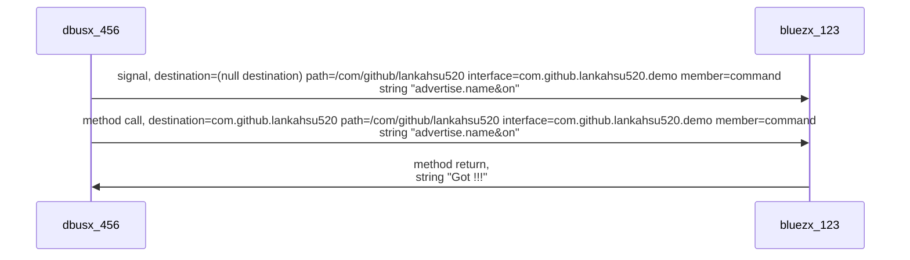

# D-Bus
[](https://github.com/lankahsu520/HelperX)
[![GitHub license][license-image]][license-url]
[![GitHub stars][stars-image]][stars-url]
[![GitHub forks][forks-image]][forks-url]
[![GitHub issues][issues-image]][issues-image]


[license-image]: https://img.shields.io/github/license/lankahsu520/HelperX.svg
[license-url]: https://github.com/lankahsu520/HelperX/blob/master/LICENSE
[stars-image]: https://img.shields.io/github/stars/lankahsu520/HelperX.svg
[stars-url]: https://github.com/lankahsu520/HelperX/stargazers
[forks-image]: https://img.shields.io/github/forks/lankahsu520/HelperX.svg
[forks-url]: https://github.com/lankahsu520/HelperX/network
[issues-image]: https://img.shields.io/github/issues/lankahsu520/HelperX.svg
[issues-url]: https://github.com/lankahsu520/HelperX/issues

# 1. Overview

> D-Bus is an [inter-process communication](https://en.wikipedia.org/wiki/Inter-process_communication) (IPC) mechanism.


# 2. Configuration

```bash
$ sudo systemctl status dbus.service

$ ll /etc/dbus-1/system.d/

```

#### A. dbus - [dbusX.conf](./DBus/dbusX.conf)

```bash
# to register com.github.lankahsu520, com.github

sudo cp dbusX.conf /etc/dbus-1/system.d

sudo reboot
```


# 3. System

## 3.1. org.freedesktop.DBus.Introspectable / Introspect

```bash
export BLUEZX_COMMAND=""
export BLUEZX_STRING="$BLUEZX_COMMAND"
export BLUEZX_ARRAY=""
export BLUEZX_DICT=""

export BLUEZX_OBJPATH=""

export DBUS_PATH_XXX="/org/freedesktop/DBus"
export DBUS_DEST_XXX="org.freedesktop.DBus"

export DBUS_S_IFAC_XXX=""
export DBUS_S_NAME_XXX=""

export DBUS_M_IFAC_XXX="org.freedesktop.DBus.Introspectable"
export DBUS_METHOD_XXX="Introspect"

```

```bash
$ ./dbusXmethod.sh
[dbus-send --system --print-reply --reply-timeout=5000 --type=method_call --dest=org.freedesktop.DBus /org/freedesktop/DBus org.freedesktop.DBus.Introspectable.Introspect    ]
method return time=1662124953.336935 sender=org.freedesktop.DBus -> destination=:1.108 serial=3 reply_serial=2
   string "<!DOCTYPE node PUBLIC "-//freedesktop//DTD D-BUS Object Introspection 1.0//EN"
"http://www.freedesktop.org/standards/dbus/1.0/introspect.dtd">
<node>
  <interface name="org.freedesktop.DBus">
    <method name="Hello">
      <arg direction="out" type="s"/>
    </method>
    <method name="RequestName">
      <arg direction="in" type="s"/>
      <arg direction="in" type="u"/>
      <arg direction="out" type="u"/>
    </method>
    <method name="ReleaseName">
      <arg direction="in" type="s"/>
      <arg direction="out" type="u"/>
    </method>
    <method name="StartServiceByName">
      <arg direction="in" type="s"/>
      <arg direction="in" type="u"/>
      <arg direction="out" type="u"/>
    </method>
    <method name="UpdateActivationEnvironment">
      <arg direction="in" type="a{ss}"/>
    </method>
    <method name="NameHasOwner">
      <arg direction="in" type="s"/>
      <arg direction="out" type="b"/>
    </method>
    <method name="ListNames">
      <arg direction="out" type="as"/>
    </method>
    <method name="ListActivatableNames">
      <arg direction="out" type="as"/>
    </method>
    <method name="AddMatch">
      <arg direction="in" type="s"/>
    </method>
    <method name="RemoveMatch">
      <arg direction="in" type="s"/>
    </method>
    <method name="GetNameOwner">
      <arg direction="in" type="s"/>
      <arg direction="out" type="s"/>
    </method>
    <method name="ListQueuedOwners">
      <arg direction="in" type="s"/>
      <arg direction="out" type="as"/>
    </method>
    <method name="GetConnectionUnixUser">
      <arg direction="in" type="s"/>
      <arg direction="out" type="u"/>
    </method>
    <method name="GetConnectionUnixProcessID">
      <arg direction="in" type="s"/>
      <arg direction="out" type="u"/>
    </method>
    <method name="GetAdtAuditSessionData">
      <arg direction="in" type="s"/>
      <arg direction="out" type="ay"/>
    </method>
    <method name="GetConnectionSELinuxSecurityContext">
      <arg direction="in" type="s"/>
      <arg direction="out" type="ay"/>
    </method>
    <method name="GetConnectionAppArmorSecurityContext">
      <arg direction="in" type="s"/>
      <arg direction="out" type="s"/>
    </method>
    <method name="ReloadConfig">
    </method>
    <method name="GetId">
      <arg direction="out" type="s"/>
    </method>
    <method name="GetConnectionCredentials">
      <arg direction="in" type="s"/>
      <arg direction="out" type="a{sv}"/>
    </method>
    <property name="Features" type="as" access="read">
      <annotation name="org.freedesktop.DBus.Property.EmitsChangedSignal" value="const"/>
    </property>
    <property name="Interfaces" type="as" access="read">
      <annotation name="org.freedesktop.DBus.Property.EmitsChangedSignal" value="const"/>
    </property>
    <signal name="NameOwnerChanged">
      <arg type="s"/>
      <arg type="s"/>
      <arg type="s"/>
    </signal>
    <signal name="NameLost">
      <arg type="s"/>
    </signal>
    <signal name="NameAcquired">
      <arg type="s"/>
    </signal>
  </interface>
  <interface name="org.freedesktop.DBus.Properties">
    <method name="Get">
      <arg direction="in" type="s"/>
      <arg direction="in" type="s"/>
      <arg direction="out" type="v"/>
    </method>
    <method name="GetAll">
      <arg direction="in" type="s"/>
      <arg direction="out" type="a{sv}"/>
    </method>
    <method name="Set">
      <arg direction="in" type="s"/>
      <arg direction="in" type="s"/>
      <arg direction="in" type="v"/>
    </method>
    <signal name="PropertiesChanged">
      <arg type="s" name="interface_name"/>
      <arg type="a{sv}" name="changed_properties"/>
      <arg type="as" name="invalidated_properties"/>
    </signal>
  </interface>
  <interface name="org.freedesktop.DBus.Introspectable">
    <method name="Introspect">
      <arg direction="out" type="s"/>
    </method>
  </interface>
  <interface name="org.freedesktop.DBus.Monitoring">
    <method name="BecomeMonitor">
      <arg direction="in" type="as"/>
      <arg direction="in" type="u"/>
    </method>
  </interface>
  <interface name="org.freedesktop.DBus.Debug.Stats">
    <method name="GetStats">
      <arg direction="out" type="a{sv}"/>
    </method>
    <method name="GetConnectionStats">
      <arg direction="in" type="s"/>
      <arg direction="out" type="a{sv}"/>
    </method>
    <method name="GetAllMatchRules">
      <arg direction="out" type="a{sas}"/>
    </method>
  </interface>
  <interface name="org.freedesktop.DBus.Peer">
    <method name="GetMachineId">
      <arg direction="out" type="s"/>
    </method>
    <method name="Ping">
    </method>
  </interface>
</node>
"

```

## 3.2. org.freedesktop.DBus / ListNames

```bash
export BLUEZX_COMMAND=""
export BLUEZX_STRING="$BLUEZX_COMMAND"
export BLUEZX_ARRAY=""
export BLUEZX_DICT=""

export BLUEZX_OBJPATH=""

export DBUS_PATH_XXX="/org/freedesktop/DBus"
export DBUS_DEST_XXX="org.freedesktop.DBus"

export DBUS_S_IFAC_XXX=""
export DBUS_S_NAME_XXX=""

export DBUS_M_IFAC_XXX="org.freedesktop.DBus"
export DBUS_METHOD_XXX="ListNames"

```

```bash
$ ./dbusXmethod.sh
[dbus-send --system --print-reply --reply-timeout=5000 --type=method_call --dest=org.freedesktop.DBus /org/freedesktop/DBus org.freedesktop.DBus.ListNames    ]
method return time=1662125304.548742 sender=org.freedesktop.DBus -> destination=:1.110 serial=3 reply_serial=2
   array [
      string "org.freedesktop.DBus"
      string ":1.7"
      string "org.freedesktop.timesync1"
      string ":1.8"
      string "org.freedesktop.systemd1"
      string "org.freedesktop.ModemManager1"
      string "org.freedesktop.NetworkManager"
      string "org.freedesktop.resolve1"
      string "org.freedesktop.RealtimeKit1"
      string "org.freedesktop.Accounts"
      string ":1.60"
      string ":1.61"
      string ":1.62"
      string ":1.40"
      string ":1.64"
      string ":1.42"
      string "org.freedesktop.PolicyKit1"
      string ":1.65"
      string ":1.43"
      string ":1.21"
      string ":1.66"
      string ":1.22"
      string ":1.89"
      string ":1.67"
      string ":1.23"
      string ":1.110"
      string ":1.68"
      string ":1.46"
      string "net.hadess.SwitcherooControl"
      string ":1.24"
      string ":1.25"
      string ":1.48"
      string ":1.49"
      string ":1.27"
      string ":1.28"
      string ":1.29"
      string "org.gnome.DisplayManager"
      string "org.freedesktop.Avahi"
      string "org.freedesktop.UDisks2"
      string ":1.90"
      string "fi.w1.wpa_supplicant1"
      string "org.freedesktop.login1"
      string "org.freedesktop.ColorManager"
      string ":1.50"
      string ":1.51"
      string ":1.96"
      string ":1.52"
      string ":1.30"
      string ":1.75"
      string ":1.31"
      string ":1.10"
      string ":1.77"
      string ":1.11"
      string ":1.33"
      string "org.freedesktop.UPower"
      string ":1.57"
      string ":1.0"
      string ":1.13"
      string ":1.35"
      string ":1.1"
      string ":1.14"
      string ":1.36"
      string ":1.37"
      string ":1.2"
      string ":1.3"
      string ":1.16"
      string ":1.4"
      string ":1.17"
      string ":1.18"
      string ":1.6"
   ]

```

## 3.3. org.freedesktop.DBus / ListActivatableNames

```bash
export BLUEZX_COMMAND=""
export BLUEZX_STRING="$BLUEZX_COMMAND"
export BLUEZX_ARRAY=""
export BLUEZX_DICT=""

export BLUEZX_OBJPATH=""

export DBUS_PATH_XXX="/org/freedesktop/DBus"
export DBUS_DEST_XXX="org.freedesktop.DBus"

export DBUS_S_IFAC_XXX=""
export DBUS_S_NAME_XXX=""

export DBUS_M_IFAC_XXX="org.freedesktop.DBus"
export DBUS_METHOD_XXX="ListActivatableNames"

```

```bash
$ ./dbusXmethod.sh
[dbus-send --system --print-reply --reply-timeout=5000 --type=method_call --dest=org.freedesktop.DBus /org/freedesktop/DBus org.freedesktop.DBus.ListActivatableNames    ]
method return time=1662125758.612058 sender=org.freedesktop.DBus -> destination=:1.112 serial=3 reply_serial=2
   array [
      string "org.freedesktop.DBus"
      string "org.freedesktop.fwupd"
      string "org.freedesktop.login1"
      string "org.freedesktop.GeoClue2"
      string "com.ubuntu.LanguageSelector"
      string "org.freedesktop.timesync1"
      string "com.ubuntu.USBCreator"
      string "org.freedesktop.ColorManager"
      string "com.hp.hplip"
      string "org.freedesktop.systemd1"
      string "com.ubuntu.SoftwareProperties"
      string "org.freedesktop.thermald"
      string "org.freedesktop.Avahi"
      string "org.freedesktop.PolicyKit1"
      string "org.freedesktop.hostname1"
      string "org.debian.apt"
      string "org.bluez"
      string "org.freedesktop.ModemManager1"
      string "io.netplan.Netplan"
      string "org.freedesktop.PackageKit"
      string "net.reactivated.Fprint"
      string "org.freedesktop.UPower"
      string "org.kde.ktexteditor.katetextbuffer"
      string "org.freedesktop.UDisks2"
      string "org.freedesktop.network1"
      string "org.gnome.GConf.Defaults"
      string "org.freedesktop.bolt"
      string "org.freedesktop.resolve1"
      string "org.freedesktop.Accounts"
      string "org.freedesktop.timedate1"
      string "com.ubuntu.WhoopsiePreferences"
      string "org.kde.k3b"
      string "org.freedesktop.RealtimeKit1"
      string "fi.w1.wpa_supplicant1"
      string "org.freedesktop.locale1"
      string "org.opensuse.CupsPkHelper.Mechanism"
      string "org.freedesktop.nm_dispatcher"
   ]

```

## 3.4. org.bluez

### 3.4.1. org.freedesktop.DBus.ObjectManager / GetManagedObjects

```bash
export BLUEZX_COMMAND=""
export BLUEZX_STRING="$BLUEZX_COMMAND"
export BLUEZX_ARRAY=""
export BLUEZX_DICT=""

export BLUEZX_OBJPATH=""

export DBUS_PATH_XXX="/"
export DBUS_DEST_XXX="org.bluez"

export DBUS_S_IFAC_XXX=""
export DBUS_S_NAME_XXX=""

export DBUS_M_IFAC_XXX="org.freedesktop.DBus.ObjectManager"
export DBUS_METHOD_XXX="GetManagedObjects"

```

```bash
$ ./dbusXmethod.sh
[dbus-send --system --print-reply --reply-timeout=5000 --type=method_call --dest=org.bluez / org.freedesktop.DBus.ObjectManager.GetManagedObjects   ]
method call time=1662016254.742262 sender=:1.268 -> destination=org.bluez serial=7 path=/; interface=org.freedesktop.DBus.ObjectManager; member=GetManagedObjects
method return time=1662016254.742651 sender=:1.135 -> destination=:1.268 serial=336 reply_serial=7
   array [
      dict entry(
         object path "/org/bluez"
         array [
            dict entry(
               string "org.freedesktop.DBus.Introspectable"
               array [
               ]
            )
            dict entry(
               string "org.bluez.AgentManager1"
               array [
               ]
            )
            dict entry(
               string "org.bluez.ProfileManager1"
               array [
               ]
            )
         ]
      )
      dict entry(
         object path "/org/bluez/hci0"
         array [
            dict entry(
               string "org.freedesktop.DBus.Introspectable"
               array [
               ]
            )
            dict entry(
               string "org.bluez.Adapter1"
               array [
                  dict entry(
                     string "Address"
                     variant                         string "00:15:83:E7:F1:21"
                  )
                  dict entry(
                     string "AddressType"
                     variant                         string "public"
                  )
                  dict entry(
                     string "Name"
                     variant                         string "msi-vbx"
                  )
                  dict entry(
                     string "Alias"
                     variant                         string "GATEUP-E7F121"
                  )
                  dict entry(
                     string "Class"
                     variant                         uint32 1835008
                  )
                  dict entry(
                     string "Powered"
                     variant                         boolean true
                  )
                  dict entry(
                     string "Discoverable"
                     variant                         boolean true
                  )
                  dict entry(
                     string "DiscoverableTimeout"
                     variant                         uint32 0
                  )
                  dict entry(
                     string "Pairable"
                     variant                         boolean false
                  )
                  dict entry(
                     string "PairableTimeout"
                     variant                         uint32 0
                  )
                  dict entry(
                     string "Discovering"
                     variant                         boolean false
                  )
                  dict entry(
                     string "UUIDs"
                     variant                         array [
                           string "00001133-0000-1000-8000-00805f9b34fb"
                           string "0000110e-0000-1000-8000-00805f9b34fb"
                           string "00001105-0000-1000-8000-00805f9b34fb"
                           string "00001132-0000-1000-8000-00805f9b34fb"
                           string "00001104-0000-1000-8000-00805f9b34fb"
                           string "00001200-0000-1000-8000-00805f9b34fb"
                           string "00005005-0000-1000-8000-0002ee000001"
                           string "00001112-0000-1000-8000-00805f9b34fb"
                           string "00001108-0000-1000-8000-00805f9b34fb"
                           string "0000110c-0000-1000-8000-00805f9b34fb"
                           string "00001801-0000-1000-8000-00805f9b34fb"
                           string "0000112f-0000-1000-8000-00805f9b34fb"
                           string "0000110b-0000-1000-8000-00805f9b34fb"
                           string "00001800-0000-1000-8000-00805f9b34fb"
                           string "0000110a-0000-1000-8000-00805f9b34fb"
                           string "00001106-0000-1000-8000-00805f9b34fb"
                        ]
                  )
                  dict entry(
                     string "Modalias"
                     variant                         string "usb:v1D6Bp0246d0535"
                  )
               ]
            )
            dict entry(
               string "org.freedesktop.DBus.Properties"
               array [
               ]
            )
            dict entry(
               string "org.bluez.GattManager1"
               array [
               ]
            )
            dict entry(
               string "org.bluez.LEAdvertisingManager1"
               array [
                  dict entry(
                     string "ActiveInstances"
                     variant                         byte 0
                  )
                  dict entry(
                     string "SupportedInstances"
                     variant                         byte 5
                  )
                  dict entry(
                     string "SupportedIncludes"
                     variant                         array [
                           string "tx-power"
                           string "appearance"
                           string "local-name"
                        ]
                  )
               ]
            )
            dict entry(
               string "org.bluez.Media1"
               array [
               ]
            )
            dict entry(
               string "org.bluez.NetworkServer1"
               array [
               ]
            )
         ]
      )
      dict entry(
         object path "/org/bluez/hci0/dev_E4_5F_01_91_E9_EB"
         array [
            dict entry(
               string "org.freedesktop.DBus.Introspectable"
               array [
               ]
            )
            dict entry(
               string "org.bluez.Device1"
               array [
                  dict entry(
                     string "Address"
                     variant                         string "E4:5F:01:91:E9:EB"
                  )
                  dict entry(
                     string "AddressType"
                     variant                         string "public"
                  )
                  dict entry(
                     string "Name"
                     variant                         string "umt-pi-4"
                  )
                  dict entry(
                     string "Alias"
                     variant                         string "umt-pi-4"
                  )
                  dict entry(
                     string "Class"
                     variant                         uint32 786432
                  )
                  dict entry(
                     string "Paired"
                     variant                         boolean false
                  )
                  dict entry(
                     string "Trusted"
                     variant                         boolean false
                  )
                  dict entry(
                     string "Blocked"
                     variant                         boolean false
                  )
                  dict entry(
                     string "LegacyPairing"
                     variant                         boolean false
                  )
                  dict entry(
                     string "Connected"
                     variant                         boolean false
                  )
                  dict entry(
                     string "UUIDs"
                     variant                         array [
                           string "00001800-0000-1000-8000-00805f9b34fb"
                           string "00001801-0000-1000-8000-00805f9b34fb"
                        ]
                  )
                  dict entry(
                     string "Modalias"
                     variant                         string "usb:v1D6Bp0246d0532"
                  )
                  dict entry(
                     string "Adapter"
                     variant                         object path "/org/bluez/hci0"
                  )
                  dict entry(
                     string "ServicesResolved"
                     variant                         boolean false
                  )
               ]
            )
            dict entry(
               string "org.freedesktop.DBus.Properties"
               array [
               ]
            )
         ]
      )
      dict entry(
         object path "/org/bluez/hci0/dev_90_E8_68_85_9A_08"
         array [
            dict entry(
               string "org.freedesktop.DBus.Introspectable"
               array [
               ]
            )
            dict entry(
               string "org.bluez.Device1"
               array [
                  dict entry(
                     string "Address"
                     variant                         string "90:E8:68:85:9A:08"
                  )
                  dict entry(
                     string "AddressType"
                     variant                         string "public"
                  )
                  dict entry(
                     string "Name"
                     variant                         string "BC6669"
                  )
                  dict entry(
                     string "Alias"
                     variant                         string "BC6669"
                  )
                  dict entry(
                     string "Class"
                     variant                         uint32 2097152
                  )
                  dict entry(
                     string "Paired"
                     variant                         boolean false
                  )
                  dict entry(
                     string "Trusted"
                     variant                         boolean false
                  )
                  dict entry(
                     string "Blocked"
                     variant                         boolean false
                  )
                  dict entry(
                     string "LegacyPairing"
                     variant                         boolean false
                  )
                  dict entry(
                     string "Connected"
                     variant                         boolean false
                  )
                  dict entry(
                     string "UUIDs"
                     variant                         array [
                           string "00001800-0000-1000-8000-00805f9b34fb"
                           string "00001801-0000-1000-8000-00805f9b34fb"
                           string "0000180a-0000-1000-8000-00805f9b34fb"
                           string "0000ffff-0000-1000-8000-00805f9b34fb"
                        ]
                  )
                  dict entry(
                     string "Modalias"
                     variant                         string "usb:v1D6Bp0246d0538"
                  )
                  dict entry(
                     string "Adapter"
                     variant                         object path "/org/bluez/hci0"
                  )
                  dict entry(
                     string "ServicesResolved"
                     variant                         boolean false
                  )
               ]
            )
            dict entry(
               string "org.freedesktop.DBus.Properties"
               array [
               ]
            )
         ]
      )
   ]
```

### 3.4.2. org.freedesktop.DBus.Introspectable / Introspect

```bash
export BLUEZX_COMMAND=""
export BLUEZX_STRING="$BLUEZX_COMMAND"
export BLUEZX_ARRAY=""
export BLUEZX_DICT=""

export BLUEZX_OBJPATH=""

export DBUS_PATH_XXX="/"
export DBUS_DEST_XXX="org.bluez"

export DBUS_S_IFAC_XXX=""
export DBUS_S_NAME_XXX=""

export DBUS_M_IFAC_XXX="org.freedesktop.DBus.Introspectable"
export DBUS_METHOD_XXX="Introspect"

```

```bash
$ ./dbusXmethod.sh
[dbus-send --system --print-reply --reply-timeout=5000 --type=method_call --dest=org.bluez / org.freedesktop.DBus.Introspectable.Introspect    ]


```


# 4. dbusx_456 <--> bluezx_123



#### A. signal

| Destination |                             |
| ----------- | --------------------------- |
| interface   | com.github.lankahsu520.demo |
| member      | command                     |

#### B. method
| Destination | com.github.lankahsu520  |
| ----------- | ----------------------- |
| interface   | /com/github/lankahsu520 |
| member      | command                 |

```bash
$ sudo dbus-monitor --system

signal time=1662013143.599087 sender=:1.234 -> destination=(null destination) serial=2 path=/com/github/lankahsu520; interface=com.github.lankahsu520.demo; member=command
   string "advertise.name&on"
method call time=1662013143.599119 sender=:1.234 -> destination=com.github.lankahsu520 serial=3 path=/com/github/lankahsu520; interface=com.github.lankahsu520.demo; member=command
   string "advertise.name&on"
method return time=1662013143.599359 sender=:1.229 -> destination=:1.234 serial=4 reply_serial=3
   string "Got !!!"

```
```bash
export BLUEZX_COMMAND="\"advertise.name&on\""
export BLUEZX_STRING="$BLUEZX_COMMAND"
export BLUEZX_ARRAY=""
export BLUEZX_DICT=""

export BLUEZX_OBJPATH=""

export DBUS_PATH_XXX="/com/github/lankahsu520"
export DBUS_DEST_XXX="com.github.lankahsu520"

export DBUS_S_IFAC_XXX="com.github.lankahsu520.demo"
export DBUS_S_NAME_XXX="command"

export DBUS_M_IFAC_XXX="com.github.lankahsu520.demo"
export DBUS_METHOD_XXX="command"

```

```bash
$ ./dbusXsignal.sh
$ ./dbusXmethod.sh
```

```bash
export BLUEZX_COMMAND="advertise.name&on"
./dbusx_456 -e "$BLUEZX_COMMAND"

```


# Appendix

# I. Study
#### A. [D-Bus](https://en.wikipedia.org/wiki/D-Bus)

# II. Debug

# III. Tools

#### A. gdbus Usage

```bash
$ gdbus --help
Usage:
  gdbus COMMAND

Commands:
  help         Shows this information
  introspect   Introspect a remote object
  monitor      Monitor a remote object
  call         Invoke a method on a remote object
  emit         Emit a signal
  wait         Wait for a bus name to appear

Use “gdbus COMMAND --help” to get help on each command.

```

#### B. dbus-send Usage

```bash
$ dbus-send --help
Usage: dbus-send [--help] [--system | --session | --bus=ADDRESS | --peer=ADDRESS] [--dest=NAME] [--type=TYPE] [--print-reply[=literal]] [--reply-timeout=MSEC] <destination object path> <message name> [contents ...]

```

##### B.1. [dbus-send — Send a message to a message bus](https://dbus.freedesktop.org/doc/dbus-send.1.html)

#### C. dbus-monitor Usage

```bash
$ dbus-monitor --help
Usage: dbus-monitor [--system | --session | --address ADDRESS] [--monitor | --profile | --pcap | --binary ] [watch expressions]

```

```bash
$ sudo dbus-monitor --system \
	--profile \
	"type='method_call',interface='org.bluez.Adapter1'"
```

#### D. dbus-daemon Usage

```bash
$ dbus-daemon --help
dbus-daemon [--version] [--session] [--system] [--config-file=FILE] [--print-address[=DESCRIPTOR]] [--print-pid[=DESCRIPTOR]] [--introspect] [--address=ADDRESS] [--nopidfile] [--nosyslog] [--syslog] [--syslog-only] [--nofork] [--fork] [--systemd-activation]

$ dbus-daemon --config-file=./system.conf

```

# Author

Created and designed by [Lanka Hsu](lankahsu@gmail.com).

# License

[HelperX](https://github.com/lankahsu520/HelperX) is available under the BSD-3-Clause license. See the LICENSE file for more info.

