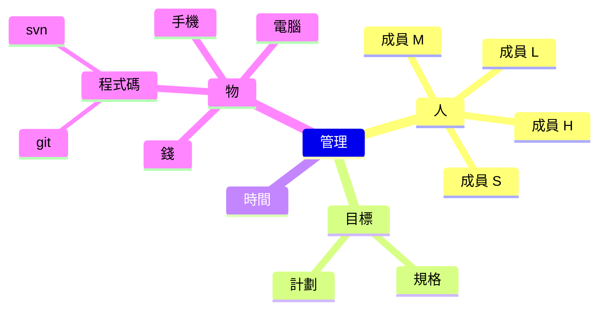
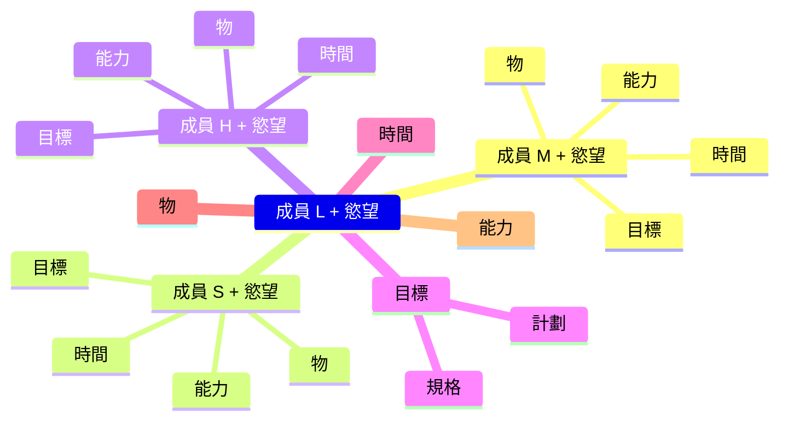
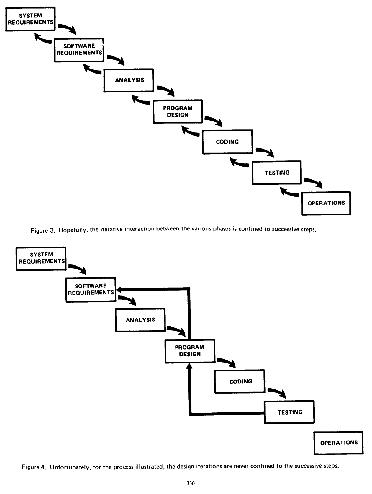
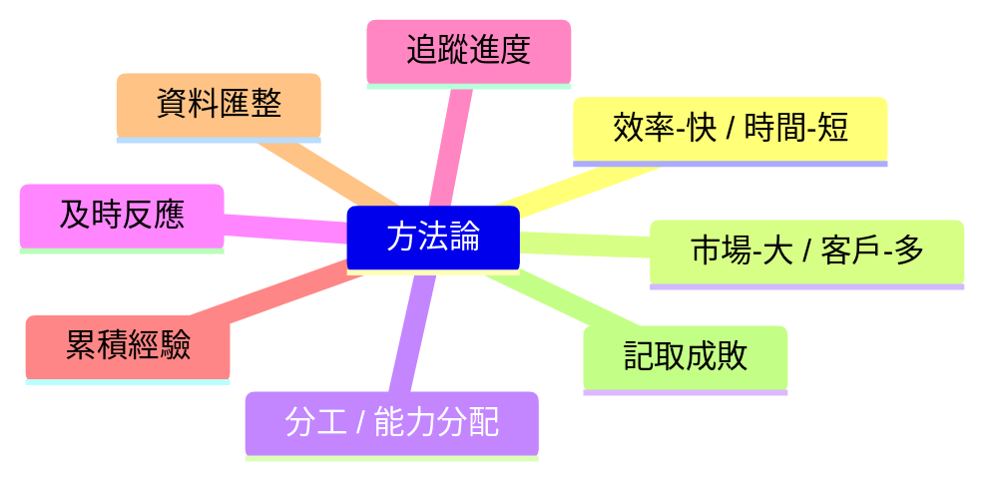

# 開發 (Development) and 管理  (Manage)
[](https://github.com/lankahsu520/HelperX)
[![GitHub license][license-image]][license-url]
[![GitHub stars][stars-image]][stars-url]
[![GitHub forks][forks-image]][forks-url]
[![GitHub issues][issues-image]][issues-image]
[![GitHub watchers][watchers-image]][watchers-image]

[license-image]: https://img.shields.io/github/license/lankahsu520/HelperX.svg
[license-url]: https://github.com/lankahsu520/HelperX/blob/master/LICENSE
[stars-image]: https://img.shields.io/github/stars/lankahsu520/HelperX.svg
[stars-url]: https://github.com/lankahsu520/HelperX/stargazers
[forks-image]: https://img.shields.io/github/forks/lankahsu520/HelperX.svg
[forks-url]: https://github.com/lankahsu520/HelperX/network
[issues-image]: https://img.shields.io/github/issues/lankahsu520/HelperX.svg
[issues-url]: https://github.com/lankahsu520/HelperX/issues
[watchers-image]: https://img.shields.io/github/watchers/lankahsu520/HelperX.svg
[watchers-url]: https://github.com/lankahsu520/HelperX/watchers

# 1. Overview

> 我沒有深究開發的文學大作，也沒有經過“名師”的指點，只是個大學文憑。
>
> 以下只是把這生所學、生活中的經歷，發想後記錄下來。

>寫出本篇的動機是因為同事突然被雷打到，學習了敏捷式 (Agile) 開發後，在辦公室吹捧它的好，然後打壓瀑布式 (Waterfall) 的壞。
>
>可是從他的每一句“大道理”中，怎麼都可以深深的體會到「我都已經這樣做了」。難道是天神在數萬年前就傳下“敏捷式  (Agile) 開發“的意念給我了。
>
>不管是敏捷式 (Agile) 開發、瀑布式 (Waterfall) 開發等，最主要是執行力，排除問題的能力！

# 2. 開發（Development）

## 2.1. 什麼是開發

>[ChatGPT]  什麼是開發
>
>開發（Development）指的是將概念或設計轉化為實際產品、系統或服務的過程。這個過程涉及多個步驟和活動，從最初的需求分析和規劃，到設計、實施、測試，再到最終的部署和維護。開發可以應用於多種領域，包括軟體開發、硬體開發、產品設計和工程項目。以下是關於開發的一些詳細說明：
>
>### 開發的主要階段
>
>1. **需求分析**：
>   - 確定產品或系統的需求，了解客戶和使用者的需求和期望，並將這些需求轉化為明確的功能和規格。
>2. **規劃**：
>   - 制定開發計劃，包括項目時間表、資源分配和風險管理計劃。這一階段還包括確定開發方法和技術選型。
>3. **設計**：
>   - 根據需求和規劃進行系統設計和架構設計，確定系統的結構和組件。這一階段通常包括高級設計（架構設計）和詳細設計（模塊設計）。
>4. **實施（編碼）**：
>   - 開發團隊開始編寫代碼，將設計轉化為實際的軟體或硬體。這是開發過程中最核心的部分，涉及編程、配置和集成。
>5. **測試**：
>   - 對開發出的產品進行測試，以確保其符合需求和規格。測試類型包括單元測試、集成測試、系統測試和驗收測試。
>6. **部署**：
>   - 將開發完成的產品部署到生產環境，並交付給最終使用者。這一階段可能涉及安裝、配置和用戶培訓。
>7. **維護**：
>   - 對產品進行持續的支持和改進，包括修復錯誤、優化性能和添加新功能。
>
>### 開發的類型
>
>1. **軟體開發**：
>   - 涉及開發應用程式、系統軟體和嵌入式軟體。常見的開發方法包括瀑布模型、敏捷開發和DevOps。
>2. **硬體開發**：
>   - 涉及設計和製造電子設備、計算機硬體和其他物理設備。這通常需要電路設計、PCB設計和原型製作。
>3. **產品設計**：
>   - 涉及創建物理產品的設計和開發，從概念到最終產品，包括工業設計和製造過程。
>4. **工程項目開發**：
>   - 涉及大型基礎設施和建設項目的規劃和實施，如建築、橋樑和道路。
>
>### 開發的角色
>
>1. **開發人員（Developer/Programmer）**：
>   - 負責編寫和測試代碼，實現設計的功能。
>2. **產品經理（Product Manager）**：
>   - 負責產品的需求分析和規劃，確保產品符合市場需求。
>3. **設計師（Designer）**：
>   - 負責產品的外觀和使用者體驗設計，包括UI/UX設計師。
>4. **測試工程師（Tester/QA Engineer）**：
>   - 負責產品的測試，確保其質量和性能。
>5. **項目經理（Project Manager）**：
>   - 負責項目的規劃和管理，確保按時交付並在預算內完成。
>
>### 開發的方法
>
>1. **瀑布模型（Waterfall Model）**：
>   - 一種線性順序的開發方法，每個階段必須完成後才能進入下一階段。
>2. **敏捷開發（Agile Development）**：
>   - 一種迭代和增量的開發方法，強調靈活性、協作和快速交付。
>3. **DevOps**：
>   - 將開發和運維結合，通過自動化和持續交付提高開發效率和產品質量。
>
>### 總結
>
>開發是一個複雜且多層次的過程，涉及多個階段和角色。無論是軟體還是硬體，成功的開發都依賴於良好的需求分析、設計、實施和測試，以及有效的協作和管理。通過適當的方法和工具，開發團隊可以創造出高質量的產品，滿足市場和使用者的需求。

## 2.2. 什麼是管理

> [ChatGPT] 什麼是管理
>
> 管理是指組織和協調資源（包括人力、財務、物質和信息等）以實現特定目標的過程。管理包含多種活動和功能，通常包括計劃、組織、領導和控制。以下是這些主要功能的詳細說明：
>
> 1. **計劃（Planning）**：
>    - 確定目標：確立組織或部門希望達到的目標。
>    - 制定策略：設計實現目標的總體策略。
>    - 擬定計劃：制定具體的步驟和時間表，以達成目標。
> 2. **組織（Organizing）**：
>    - 資源配置：確定和配置所需的資源（包括人員、資金和設備）。
>    - 結構設計：設計組織結構，包括職位設置、職責劃分和工作流程。
> 3. **領導（Leading）**：
>    - 動機激勵：激勵員工並鼓舞士氣，促使他們努力工作，實現組織目標。
>    - 溝通：確保信息在組織內部和外部的有效傳遞。
>    - 指導：提供方向和指導，幫助員工解決問題並提高工作效率。
> 4. **控制（Controlling）**：
>    - 監控績效：定期檢查和評估實際績效與預期目標之間的差距。
>    - 糾正偏差：採取必要的糾正措施，確保組織目標的實現。
>
> 管理的目標是提高組織的效率和效果，確保資源得到最佳利用，並適應不斷變化的環境和挑戰。管理者需要具備多方面的技能，包括技術技能（專業知識和技能）、人際技能（與人溝通和協作的能力）和概念技能（理解和處理複雜問題的能力）。
>
> 管理可以應用於各種組織，包括企業、政府機構、非營利組織和社會團體。不同的組織和環境可能需要不同的管理方法和風格，但其核心功能和目標基本相同。

## 2.3. 開發 vs. 管理

> 這邊我不會去深究不同之處，個人認為「開發和管理是相輔相成，著重的比重不同，但是目標是一致的。」

> [ChatGPT] 開發 vs. 管理 有什麼差異
>
> 開發和管理是兩個不同但互補的職能，這兩者在目標、技能需求、工作範疇和日常活動方面存在顯著差異。
>
> ### 開發（Development）
>
> **目標**：
>
> - 創造和改進產品或服務，滿足市場需求或解決特定問題。
>
> **技能需求**：
>
> - 專業技術技能：例如編程、工程設計、產品設計、數據分析等。
> - 創新和創意：提出新的想法和解決方案。
> - 問題解決能力：識別並解決技術或產品開發過程中的挑戰。
>
> **工作範疇**：
>
> - 設計、編程、測試和實施技術解決方案。
> - 協作和團隊工作：與其他開發者、設計師和測試人員緊密合作。
> - 持續改進：不斷改進產品或服務，進行版本更新和功能擴展。
>
> **日常活動**：
>
> - 編寫和測試代碼。
> - 參與技術討論和設計評審。
> - 解決技術問題和漏洞修復。
> - 研究和應用新技術。
>
> ### 管理（Management）
>
> **目標**：
>
> - 組織和協調資源，以實現特定的組織目標，如提高效率、增加利潤、提升員工滿意度等。
>
> **技能需求**：
>
> - 領導力：激勵和引導團隊成員，確保他們朝著共同目標努力。
> - 溝通能力：有效地傳遞信息，確保所有團隊成員了解目標和期望。
> - 決策能力：分析情況並做出合理的決策。
> - 計劃和組織能力：制定計劃，組織資源，監控進度。
>
> **工作範疇**：
>
> - 制定戰略和目標：設定短期和長期目標，制定實現這些目標的計劃。
> - 資源管理：確保人力、財務、物資等資源得到最佳利用。
> - 績效管理：評估和改進團隊或組織的績效。
>
> **日常活動**：
>
> - 參加和主持會議。
> - 制定和監控項目計劃。
> - 與團隊成員、一線員工及高層管理人員溝通。
> - 解決衝突和處理問題。
>
> ### 差異總結
>
> 1. **目標**：
>    - 開發重點在於技術創新和產品或服務的創建。
>    - 管理重點在於組織和資源的協調，以達成特定目標。
> 2. **技能需求**：
>    - 開發需要深厚的技術專業知識和創新能力。
>    - 管理需要領導力、溝通能力和決策能力。
> 3. **工作範疇**：
>    - 開發集中在技術解決方案的設計和實施。
>    - 管理集中在資源的有效分配和團隊的協調。
> 4. **日常活動**：
>    - 開發活動包括編寫代碼、測試和技術研究。
>    - 管理活動包括計劃、組織和監控進度，以及團隊協作和溝通。
>
> 開發和管理雖然各自專注於不同的領域，但在實現組織目標時需要密切合作。成功的組織通常會平衡好技術創新和管理效率，確保兩者互相支持和推動。

## 2.4. 以人為本

### 2.4.1. 管理什麼

> 以開發為中心的心智圖。




### 2.4.2. 人 + 慾望

> 只要把人移除，時間一樣的流逝，物成為無主之物，目標是虛無飄渺的存在。
>
> 所以一切皆是以人為本！然後再加上點慾望就成為管理的本質。
>


# 3. XXX 開發

## 3.1. 管理大型軟件系統的開發（沒有所謂的瀑布式開發）

> 這邊簡化稱為<font color="red">傳統式開發</font>。

> Winston W. Royce 在 1970 年發表的《管理大型軟件系統的開發》，當時的命名沒有提到「瀑布」二字。
>
> 原文 [Managing the Development of Large Software Systems](https://www.praxisframework.org/files/royce1970.pdf)。

> 因為本人英文程度不佳，借用 [浅谈对 Winston W. Royce的"瀑布"开发模型的误解](https://www.testerfans.com/archives/misunderstanding-of-waterfall-model). 。
>
> 請各位可以先看看此作者的分析。

>以下圖檔取至原文。從圖中就可以知道，它也是有回饋循環！



## 3.2. 敏捷式開發（Agile Development）

> [敏捷軟體開發宣言](https://agilemanifesto.org/)於 2001 年發佈。

>We are uncovering better ways of developing software by doing it and helping others do it.
>
>Through this work we have come to value:
>
>**Individuals and interactions** over processes and tools
>
>**Working software** over comprehensive documentation
>
>**Customer collaboration** over contract negotiation
>
>**Responding to change** over following a plan
>
>That is, while there is value in the items on
>
>the right, we value the items on the left more.

> 藉著親自並協助他人進行軟體開發，
> 我們正致力於發掘更優良的軟體開發方法。
> 透過這樣的努力，我們已建立以下價值觀:
>
> **個人與互動** 重於 流程與工具 
> **可用的軟體** 重於 詳盡的文件 
> **與客戶合作** 重於 合約協商  
> **回應變化** 重於 遵循計劃  
>
> 也就是說，雖然右側項目有其價值，
> 但我們更重視左側項目。

> 網路上有很多文章，請教 google 大神！

## 3.3. [系統分析設計](https://www.uoitc.edu.iq/images/documents/informatics-institute/Competitive_exam/Systemanalysisanddesign.pdf)

>如果要學理論，建議可參考教課書。
>
>敏捷式開發已過度的商業包裝，讓入門者不清楚什麼才是主要精神。

# 4. 謬誤

> 管理大型軟件系統的開發和敏捷式開發相差 30 年。慢了 30年的東西，不只沒有完全脫離其框架，反而一堆人用謬誤框架在~~“瀑布式開發“~~，然後說一些似是而非的話術。

#### A. <font color="red">傳統式開發</font>是一種直線性專案管理方法

> 3.1. 中，就得到回饋循環，打臉！

#### B. <font color="red">傳統式開發</font>要等到產品發佈才能驗證市場反應，沒辦法增量叠代

> 遇到這問題，不是砍掉開發方式，而是該砍掉那位不會訂定 milestone 的 PM。

#### C. 敏捷式開發有*Sprint* ，其它都沒有

> 當員工知道主管急著要某東西，卻是故意放著不做，跑去喝咖啡，這不是在找死嗎？（這種員工、小主管確實會存在）
>
> 選擇工作項目本來就有 priority，這有誰不懂。

#### D. 採用<font color="red">傳統式開發</font>，就需要預先準備大量文件

>沒有簽約（合約）、不清楚 MRS (Marketing Requirement Specification)，沒有收到第一筆錢，你會讓員工就進行開發嗎？

>UI 設計圖沒有規劃好，你是希望 RD 邊寫邊畫 UI 嗎？（這類情形常發生）
>
>你沒有拿到 SDK user guide，你會編譯程式碼嗎？

#### E. <font color="red">傳統式開發</font>就是不注重客戶意見

>這真的是欲加之罪，何患無辭，一樣是砍掉這位不會跟客戶溝通的 PM。

#### F. 敏捷式開發，就是敏捷

> 開發時間是長是短，都取決於人，是訂定出來的。
>
> 結果常在敏捷式開發的缺點看到“敏捷式開發複雜的專案可能很長”。這是什麼道理？

# 5. 精神與期許

> 這裏不會吹捧敏捷式 (Agile) 開發有多好，而瀑布式 (Waterfall) 開發有多差。管理或開發本來就不應該一成不變的，而是要隨著專案迅速反應和變化，我們要學習其精神，而不是華麗的辭藻！這些方法只是輔助工具。
>
> 前面有提及“以人為本”，皆是謀事在人，成事在天。



# 6. 現實與殘酷

> 以下一些常見的狀況

#### A. 能大賣，能賺大錢就是好方法 ?

> 能讓公司產品大賣，能讓公司賺大錢的管理者在公司說話就能大聲，至於他是怎麼管理已不在是重點。因為能達到此成就，也是要看人、事、時、地、物。

#### B. weekly report 太制式

>不管任何管理方式，一定要求員工寫下 weekly report 或是專案進度；從中我發現一個很大的問題，就是太制式、太嚴肅，常常會貼上做了什麼，解了什麼問題，最後變成代入常用語。
>
>其實多點口語化，有時帶點心情會更好。

#### C. weekly report 沒人看

>接上，或許有人會說，「weekly report 寫的太誠實會被記仇」「會被當證據」。解決此問題，當然是要做一些取捨，因為你也不知道你的同事或主管是不是小人。
>
>但就目前經驗，weekly report 幾乎很少人會“幫”你看，就連高一級的主管也是。不然主管怎麼常跑來問「你最近在幹什麼」

#### D. 欠缺信任和歸屬感

> 接上，PM/主管常犯的毛病，早上交待 RD/員工事情，而 RD 也將該工作排入 inprogress，下午還是跑來問 RD/員工<font color="red">在幹什麼</font>，甚至用最高指令指派別的項目。

> PM：「看你很閒哦！inprogress 裏的都處理完」
>
> 員工L：「我才剛放入 Done」

>PM：「你那 bug 不是上個月就解了，怎麼還在 inprogress」
>
>員工A：「又發生問題，難道不用解」

> 員工A：「Jira、confluence；我懂」
>
> 學霸：「怎麼沒看到你最近的工作項目」
>
> 員工A：「因為我不知道要寫在那裏」

>團隊間沒有歸屬感和信任，只依靠管理工具，看到的都只是冷冰冰的文字。

#### E. 同值不同酬

> 有人做的<font color="red">過</font>多，就一定有冗員。冗員也有可能是主管。
>
> 向上沒辦法管理！

>能者多勞，但真相是能者只會過勞。
>
>「好好幹，公司不會虧待你的」，「找不到人」、「你不做，難道我做」、「就是要你去做」等。

#### F. 一個人的武林

> 從工作到現在，每間公司都會遇到一位，而且都有共事過。
>
> 此種人基本上都是很難溝通，在公司說話很大聲；如果是持有真本事，對公司還算忠誠，對公司而言就比較沒有明顯的問題，但是對同事間就是一個大炸彈。
>
> 專案管理者去管此人？他的直屬長管去管？還是大老闆去管？
>
> 總之同事是管不動的，共事的項目只能求爺爺、告奶奶。

#### G. 嘴上無毛，辦事不牢

>這類人，有小聰明，沒實力只有兩粒（說笑話，那兩粒不多說）！
>
>相信大家應該都有遇到過，這些人也是不聽人說話。

>就我的例子，一位號稱是 embedded linux  開發者，在類樹莓派上一分鐘內安裝好 gstreamer1.0-tools。
>
>```bash
>$ sudo apt-get install gstreamer1.0-tools
>```
>
>就很天真的說，「只要編 gstreamer 就好了，有這麼難嗎」。好心教導說 apt install 時，也會有 Depends 的問題。然後很不屑的回我「我都沒遇到」

>聽完之後，心酸啊，有誰能知道。
>
>```bash
>$ apt-cache show gstreamer1.0-tools | grep ^Depends
>Depends: libc6 (>= 2.14), libglib2.0-0 (>= 2.40), libgstreamer1.0-0 (>= 1.16.1)
>Depends: libc6 (>= 2.14), libglib2.0-0 (>= 2.40), libgstreamer1.0-0 (>= 1.16.1)
>
>$ pkg-config --libs gstreamer-1.0
>-lgstreamer-1.0 -lgobject-2.0 -lglib-2.0
>
>$ pkg-config --list-all | grep gst
>...
>     gstreamer-base-1.0                  GStreamer base classes - Base classes for GStreamer elements
>     gstreamer-plugins-base-1.0          GStreamer Base Plugins Libraries - Streaming media framework, base plugins libraries
>     ...
>     
>     $ ldd /usr/bin/gst-launch-1.0
>             linux-vdso.so.1 (0x00007ffef7ff4000)
>             libgstreamer-1.0.so.0 => /lib/x86_64-linux-gnu/libgstreamer-1.0.so.0 (0x00007f9a58246000)
>             libgobject-2.0.so.0 => /lib/x86_64-linux-gnu/libgobject-2.0.so.0 (0x00007f9a581e6000)
>             libglib-2.0.so.0 => /lib/x86_64-linux-gnu/libglib-2.0.so.0 (0x00007f9a580bc000)
>             libpthread.so.0 => /lib/x86_64-linux-gnu/libpthread.so.0 (0x00007f9a58099000)
>             libc.so.6 => /lib/x86_64-linux-gnu/libc.so.6 (0x00007f9a57ea7000)
>             libgmodule-2.0.so.0 => /lib/x86_64-linux-gnu/libgmodule-2.0.so.0 (0x00007f9a57ea1000)
>             libm.so.6 => /lib/x86_64-linux-gnu/libm.so.6 (0x00007f9a57d50000)
>             libdl.so.2 => /lib/x86_64-linux-gnu/libdl.so.2 (0x00007f9a57d4a000)
>             libffi.so.7 => /lib/x86_64-linux-gnu/libffi.so.7 (0x00007f9a57d3e000)
>             libpcre.so.3 => /lib/x86_64-linux-gnu/libpcre.so.3 (0x00007f9a57ccb000)
>             /lib64/ld-linux-x86-64.so.2 (0x00007f9a583c2000)
>     
>     ```

#### H. 三個臭皮匠，勝不過一個諸葛亮

>別人的臭皮匠是各有本事，集思廣益，再加上同心協力。
>
>所以不知是明哲保身，還是無本事？

#### I. 停止學習

>有些人出社會後，就停止學習（這邊說的學習，不只是專業方面，也包括做人、做事的道理等，從談話中就可以知道有多空洞）。
>
>就專業來說，花了2年以上跟某些人解釋 HTTP 和 Socket 的關係，就是有些人至今還是不了解關聯性。
>
>但在身處網路、軟體開發的團隊裏，瀑布式開發沒救，敏捷式開發就有救嗎？
>
>就算知道這樣，你能做什麼？你不能做什麼！

#### Z. 其它

> 還有很多…現實和理論還是有段差距。

# Appendix

# I. Study

## ~~I.1. 瀑布式開發（Waterfall Development）~~

> 因為沒有瀑布式開發，以下言論就不成立！

> ~~[ChatGPT]  什麼是瀑布式開發~~
>
> ~~瀑布式開發（Waterfall Development）是一種傳統的軟體開發方法，其特點是按照瀑布流的方式進行階段性進展，每個階段都必須在上一階段完成後才能開始。以下是瀑布式開發的基本特徵和流程：~~
>
> 1. ~~**階段性進展**：瀑布式開發將軟體開發過程劃分為一系列固定的階段，如需求分析、設計、開發、測試、部署和維護等。~~
> 2. ~~**順序性**：每個階段都按照嚴格的順序進行，當前階段完成後才能進入下一階段，並且這些階段是連續不斷的，通常不允許跳過或重複。~~
> 3. ~~**前期計劃**：瀑布式開發在整個項目開始之前，會進行詳細的需求分析和規劃，確定每個階段的工作內容和交付物。~~
> 4. ~~**固定範圍**：在開發過程中，每個階段的範圍通常是固定的，任何變更需求的需求都需要經過嚴格的變更控制和審核。~~
> 5. ~~**缺乏靈活性**：瀑布式開發假設在開發開始之前就能充分了解所有需求和細節，因此缺乏應對變化的靈活性，若需求或設計有誤，可能會導致後續階段的困難或重大改動。~~
> 6. ~~**風險管理**：由於每個階段之間的嚴格依賴性，風險通常在後期才會被發現，這可能導致整個項目的延誤或預算超支。~~
>
> ~~總的來說，瀑布式開發適合於對需求相對穩定和確定性要求較高的項目，例如傳統的企業應用系統或某些安全性要求高的系統。然而，隨著軟體開發方法論的不斷發展，像敏捷開發這樣更加靈活和迭代的方法正在越來越受到歡迎，特別是在快速變化的市場和需求環境中。~~

## I.2. 敏捷式開發（Agile Development）

> [ChatGPT] 什麼是敏捷式開發
>
> 敏捷式開發（Agile Development）是一種軟體開發方法論，強調在面對快速變化和不確定性的環境中，通過靈活、迭代和協作的方式來快速交付價值。以下是敏捷式開發的主要特徵和原則：
>
> 1. **迭代開發**：將整個開發過程分解為多個短期的開發週期（通常是2到4週），稱為迭代或增量。每個迭代都包括需求分析、設計、開發、測試和審查等步驟，並且在每個迭代結束時交付可工作的產品部分。
> 2. **持續反饋和改進**：強調持續與利益相關者（如客戶、用戶和開發團隊）之間的交流和反饋。根據反饋，隨時調整和改進產品，以確保符合需求並達到高質量。
> 3. **靈活性和適應性**：在面對變化的需求、市場和技術環境時能夠靈活調整和適應。不要求在開始開發前就完全了解所有需求，而是鼓勵透過反饋和協作來理解和解決問題。
> 4. **協作和自組織團隊**：鼓勵團隊成員之間的密切合作和自組織，使得團隊能夠自主決策並在迭代中持續改進。
> 5. **實用性和價值導向**：重視能夠快速交付可用並且有價值的產品功能。優先處理和實現最具價值的需求，以最大化產品的市場競爭力和用戶滿意度。
> 6. **持續集成和測試**：採用持續集成（CI）和自動化測試，確保產品在每個迭代結束時都是可靠的和可部署的。
>
> 總結來說，敏捷式開發通過不斷迭代和持續改進的方式來滿足變化的需求，更加靈活和反應迅速，適合於需要快速產品上市和不斷優化的市場環境。

## I.3. [浅谈对 Winston W. Royce的"瀑布"开发模型的误解](https://www.testerfans.com/archives/misunderstanding-of-waterfall-model)

## I.4. [敏捷開發工具推薦｜一篇看懂敏捷式 & 瀑布式開發差異](https://aws.amazon.com/tw/events/taiwan/techblogs/agile-development/)

> 就連 aws 都存在這種謬誤，

## I.5. [什麼是敏捷產品開發?](https://www.ptc.com/tw/blogs/corporate/what-is-agile-product-development#principles)

# II. Debug

# III. Glossary

# IV. Tool Usage

# Author

> Created and designed by [Lanka Hsu](lankahsu@gmail.com).

# License

> [HelperX](https://github.com/lankahsu520/HelperX) is available under the BSD-3-Clause license. See the LICENSE file for more info.

