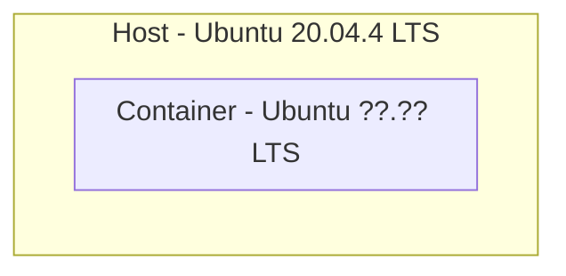
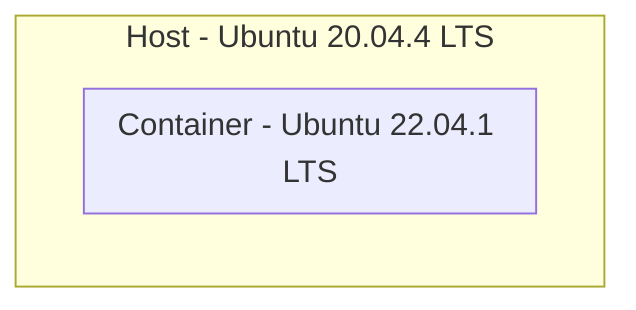
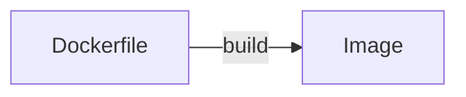
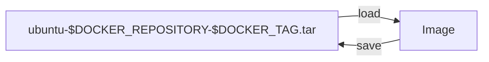
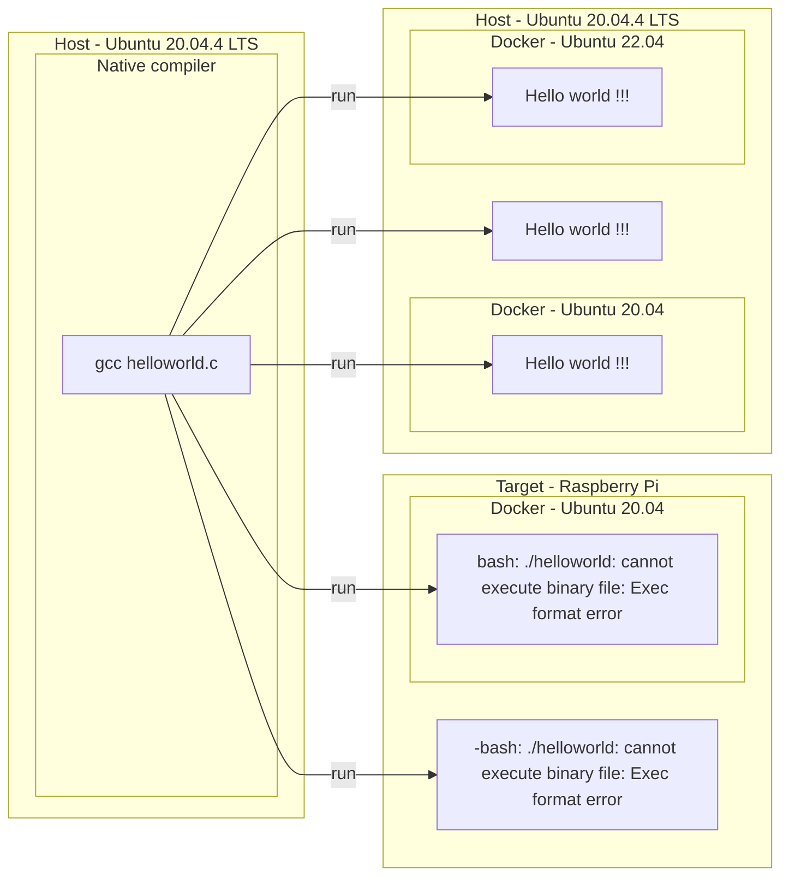

# Docker
[](https://github.com/lankahsu520/HelperX)
[![GitHub license][license-image]][license-url]
[![GitHub stars][stars-image]][stars-url]
[![GitHub forks][forks-image]][forks-url]
[![GitHub issues][issues-image]][issues-image]
[![GitHub watchers][watchers-image]][watchers-image]

[license-image]: https://img.shields.io/github/license/lankahsu520/HelperX.svg
[license-url]: https://github.com/lankahsu520/HelperX/blob/master/LICENSE
[stars-image]: https://img.shields.io/github/stars/lankahsu520/HelperX.svg
[stars-url]: https://github.com/lankahsu520/HelperX/stargazers
[forks-image]: https://img.shields.io/github/forks/lankahsu520/HelperX.svg
[forks-url]: https://github.com/lankahsu520/HelperX/network
[issues-image]: https://img.shields.io/github/issues/lankahsu520/HelperX.svg
[issues-url]: https://github.com/lankahsu520/HelperX/issues
[watchers-image]: https://img.shields.io/github/watchers/lankahsu520/HelperX.svg
[watchers-url]: https://github.com/lankahsu520/HelperX/watchers

# 1. Docker Engine

## 1.1. Install 

```bash
$ sudo apt-get install docker.io

$ service docker status

# add user
$ sudo usermod -aG docker `whoami`

# upgrade
curl -fsSL https://get.docker.com -o get-docker.sh
sudo sh get-docker.sh
```
## 1.2. Version

```bash
$ docker version

Client:
 Version:           20.10.12
 API version:       1.41
 Go version:        go1.16.2
 Git commit:        20.10.12-0ubuntu2~20.04.1
 Built:             Wed Apr  6 02:14:38 2022
 OS/Arch:           linux/amd64
 Context:           default
 Experimental:      true

Server:
 Engine:
  Version:          20.10.12
  API version:      1.41 (minimum version 1.12)
  Go version:       go1.16.2
  Git commit:       20.10.12-0ubuntu2~20.04.1
  Built:            Thu Feb 10 15:03:35 2022
  OS/Arch:          linux/amd64
  Experimental:     false
 containerd:
  Version:          1.5.9-0ubuntu1~20.04.4
  GitCommit:
 runc:
  Version:          1.1.0-0ubuntu1~20.04.1
  GitCommit:
 docker-init:
  Version:          0.19.0
  GitCommit:

```

# 2. Docker Containers/Images - [DOCKER OFFICIAL IMAGE](https://docs.docker.com/docker-hub/official_repos/)


## 2.1. Docker on Ubuntu 20.04.4 LTS


### 2.1.1. Ubuntu image

#### A. docker search

```bash
# Search the Docker Hub for images
$ docker search ubuntu

```

#### B. docker pull

```bash
# Pull an image or a repository from a registry
$ docker pull ubuntu:latest
$ docker pull ubuntu:22.04
$ docker pull ubuntu:20.04

```

#### C. docker images

```bash
# List images
$ docker images
REPOSITORY   TAG       IMAGE ID       CREATED      SIZE
ubuntu       22.04     df5de72bdb3b   6 days ago   77.8MB
ubuntu       latest    df5de72bdb3b   6 days ago   77.8MB

```

### 2.1.2. Raspberry Pi image

#### A. docker search

```bash
# Search the Docker Hub for images
$ docker search

```

#### B. docker pull

```bash
# Pull an image or a repository from a registry
# 目前沒有該image
```

#### C. docker images

```bash
# List images
$ docker images

```

## 2.2. Run (ubuntu:22.04)


#### A. docker run 

```bash
# Run a command in a new container
# -t, --tty=true|false
#    Allocate a pseudo-TTY. The default is false.
# -i, --interactive=true|false
#    Keep STDIN open even if not attached. The default is false.
$ docker run -t -i ubuntu:22.04 /bin/bash
$ docker run -t -i df5de72bdb3b /bin/bash
```

#### B. docker ps

```bash
# List all Docker containers regardless of status, -a or --all to show every container
$ docker ps -a
CONTAINER ID   IMAGE          COMMAND       CREATED       STATUS                      PORTS     NAMES
2d3acbdedf80   ubuntu:22.04   "/bin/bash"   2 hours ago   Exited (0) 13 minutes ago             distracted_shtern
ae96128535e6   df5de72bdb3b   "/bin/bash"   2 hours ago   Exited (127) 2 hours ago              keen_wright
661547b99e14   df5de72bdb3b   "/bin/bash"   2 hours ago   Exited (127) 2 hours ago              musing_antonelli
0e78d531b441   df5de72bdb3b   "/bin/bash"   2 hours ago   Exited (0) 2 hours ago                youthful_payne

```

# 3. Image Handler

## 3.1. Build an image from a container


#### A. apt-get install (ContainerA)

```bash
# Run a command in a new container and update

apt-get update
#apt-get upgrade
apt-get install -y lsb-release
apt-get clean all

lsb_release -a

cd /bin && rm sh; ln -s bash sh
```

#### B. docker  commit

```bash
# Create a new image from a container's changes
$ docker commit 2d3acbdedf80 ubuntu:22.04v2
$ docker images
REPOSITORY   TAG       IMAGE ID       CREATED          SIZE
ubuntu       22.04v2   3d3a3d4d3fe0   14 minutes ago   497MB
ubuntu       22.04     df5de72bdb3b   6 days ago       77.8MB

```

## 3.2. Build an image from a Dockerfile



#### A. docker build

```bash
# Build an image from a Dockerfile
$ export DOCKER_REPOSITORY="ubuntu"
$ export DOCKER_TAG="22.04v1"

$ docker build -t="$DOCKER_REPOSITORY:$DOCKER_TAG" .

# Put Dockerfile in the same folder
$ docker build -t="ubuntu:22.04v1" ./
$ docker build -t="ubuntu:20.04v1" ./

$ docker images
REPOSITORY   TAG       IMAGE ID       CREATED         SIZE
ubuntu       22.04v1   d41a1bf4ee25   5 seconds ago   3.57GB
ubuntu       22.04     df5de72bdb3b   6 days ago      77.8MB

$ docker run -ti $DOCKER_REPOSITORY:$DOCKER_TAG /bin/bash
$ docker run -ti ubuntu:22.04v1 /bin/bash
$ docker run -ti d41a1bf4ee25 /bin/bash

$ docker run -p 9982:9981 -ti d41a1bf4ee25
```

## 3.3. Save/Load Image



#### A. docker save

```bash
# Save one or more images to a tar archive (streamed to STDOUT by default)
$ docker save -o ubuntu-$DOCKER_REPOSITORY-$DOCKER_TAG.tar "$DOCKER_REPOSITORY:$DOCKER_TAG"

$ ll
-rw------- 1 lanka lanka 3611464704  八   8 14:52 ubuntu-ubuntu:22.04v1.tar
$ docker rmi d41a1bf4ee25
$ docker images
REPOSITORY   TAG       IMAGE ID       CREATED      SIZE
ubuntu       22.04     df5de72bdb3b   6 days ago   77.8MB

```

#### B. docker load

```bash
# Load an image from a tar archive or STDIN
$ docker load -i ubuntu-$DOCKER_REPOSITORY-$DOCKER_TAG.tar

$ docker images
REPOSITORY   TAG       IMAGE ID       CREATED          SIZE
ubuntu       22.04v1   d41a1bf4ee25   11 minutes ago   3.57GB
ubuntu       22.04     df5de72bdb3b   6 days ago       77.8MB

```

## 3.4. Remove Image

#### A. docker rmi

```bash
# Remove one or more images
$ docker rmi df5de72bdb3b

$ docker rmi $(docker images --filter "dangling=true" -q --no-trunc)
```

## 3.5. Others

#### A. Copy

```bash
$ docker image tag ubuntu:20.04 ubuntu-cpy:20.04
```

# 4. Container Handler

## 4.1. Remove Container

#### A. docker rm

```bash
# Remove one or more containers
$ docker rm ae96128535e6
$ docker rm 661547b99e14
$ docker rm 0e78d531b441

# Remove exited containers
$ docker rm $(docker ps --filter status=exited -q)
```

#### B. docker prune

```bash
$ docker container prune
WARNING! This will remove all stopped containers.
Are you sure you want to continue? [y/N] y

```

```bash
$ docker system prune
WARNING! This will remove:
  - all stopped containers
  - all networks not used by at least one container
  - all dangling images
  - all dangling build cache

Are you sure you want to continue? [y/N] y

```

## 4.2. Export/Import

#### A. docker export

```bash
# Export a container's filesystem as a tar archive
$ docker export ae96128535e6 > ubuntu.tar

```

#### B. docker import

```bash
# Import the contents from a tarball to create a filesystem image
$ docker import ubuntu.tar - ubuntu:22.04v1

```

## 4.3. Start/Stop

#### A. docker start

```bash
# Start one or more stopped containers
$ docker start ae96128535e6

```

#### B. docker stop

```bash
# Stop one or more running containers
$ docker stop ae96128535e6

```

## 4.4. Exec

#### A. docker exec

```bash
# Run a command in a running container
$ docker exec -ti 2ea0d23f30cf ls -al /

```

## 4.5. State

#### A. docker inspect

```bash
# Return low-level information on Docker objects
$ docker inspect 2ea0d23f30cf
```

## 4.6. Others

#### A. docker commit

```bash
# Create a new image from a container's changes
$ docker commit 2ea0d23f30cf ubuntu:22.04v2
```

# 5. Docker Container Files Handler

## 5.1. Copy files/folders

#### A. docker cp

```bash
$ docker cp -a README.md ac52ddefee1f:/work
$ docker cp -a helloworld ac52ddefee1f:/work

```

# 6. Test Case

## 6.1. Run Image -> Leave Container -> Return Container (attach)

```bash
$ docker-images
REPOSITORY   TAG       IMAGE ID       CREATED        SIZE
123          latest    0ae48a4b087c   3 months ago   8.03GB
ubuntu       22.04     df5de72bdb3b   3 months ago   77.8MB
ubuntu       20.04     3bc6e9f30f51   3 months ago   72.8MB

# Run Image:123, 0ae48a4b087c
$ docker run -ti 0ae48a4b087c

In Container: 15948ab15718
Ctrl+P, Ctrl+Q 

$ docker ps
CONTAINER ID   IMAGE          COMMAND   CREATED          STATUS          PORTS     NAMES
15948ab15718   0ae48a4b087c   "bash"    10 minutes ago   Up 10 minutes             heuristic_yalow

$ docker attach 15948ab15718

```

# 7. Virtual Machine vs. Container

## 7.1. Virtual Machine


> image from oer.gitlab.io

## 7.2. Container


> image from oer.gitlab.io

## 7.3. A binary in low-level language can run on ???
> 說真的，從上面的圖檔分析；Virtual Machine裏的 Host OS with Hypervisor ，只是把Host OS 和一個manager畫在一起，不就等同於 Host OS + Container manager。Guest OS1 = Env based on kernel of Host OS。
>
> Docker 在安裝 image 時，不是有個動作叫 pull；VM 部分也有很多預先安裝的〝系統〞放在網路請大家自己抓。所以兩邊都是要安裝的！安裝的！安裝的！
>
> 討論至此，那最主要的差別就是在 Hardware 的實作程度的範圍。那我可不可以說實作比較差的 VM 就是 Container。當然不能這麼一刀切，繼續看下去。
>
> 其實這兩張圖畫的太複雜了，沒辦法簡易的說明差別；這裏舉個很簡單的例子：
>
> $ docker pull node:10.15.3-alpine
>
> node 很累贅，但還稱不上是一個系統、一個OS，但它完全複製了可執行的環境, 並且在 HOST OS 上〝正確〞執行。
>
> 從這裏可以得到一個結論，Container 既可以是個 OS 模擬，也可以很簡單的模擬軟體層執行環境。
> 很重要!很重要!很重要! 看圖就知，像是比較低底層所構建之執行檔，並不能交亙執行！
> 也因為得知 docker image 是不同的！ (ubuntu run $ docker pull ubuntu ) !=  (Raspberry Pi run $ docker pull ubuntu )


```bash
$ file helloworld
helloworld: ELF 64-bit LSB shared object, x86-64, version 1 (SYSV), dynamically linked, interpreter /lib64/ld-linux-x86-64.so.2, BuildID[sha1]=18d2f341bfac8c548cedce30a01e9a865ba383f8, for GNU/Linux 3.2.0, not stripped

```
# Appendix

# I. Study

## I.1. [Docker CLI (docker)](https://docs.docker.com/reference/)

## I.2. [Docker 基礎教學與介紹 101](https://cwhu.medium.com/docker-tutorial-101-c3808b899ac6)

## I.3 [Ubuntu Linux 安裝 Docker 步驟與使用教學](https://ithelp.ithome.com.tw/articles/10219427)

## I.4. [Docker 筆記 Part 2 ｜指令操作](https://visonli.medium.com/docker-入門-筆記-part-2-91e4dfa2b365)

# II. Debug

# III. Glossary

# IV. Tool Usage

## IV.1. docker Usage

```bash
Usage:  docker [OPTIONS] COMMAND

A self-sufficient runtime for containers

Options:
      --config string      Location of client config files (default "/home/lanka/.docker")
  -c, --context string     Name of the context to use to connect to the daemon (overrides DOCKER_HOST env var and default
                           context set with "docker context use")
  -D, --debug              Enable debug mode
  -H, --host list          Daemon socket(s) to connect to
  -l, --log-level string   Set the logging level ("debug"|"info"|"warn"|"error"|"fatal") (default "info")
      --tls                Use TLS; implied by --tlsverify
      --tlscacert string   Trust certs signed only by this CA (default "/home/lanka/.docker/ca.pem")
      --tlscert string     Path to TLS certificate file (default "/home/lanka/.docker/cert.pem")
      --tlskey string      Path to TLS key file (default "/home/lanka/.docker/key.pem")
      --tlsverify          Use TLS and verify the remote
  -v, --version            Print version information and quit

Management Commands:
  builder     Manage builds
  config      Manage Docker configs
  container   Manage containers
  context     Manage contexts
  image       Manage images
  manifest    Manage Docker image manifests and manifest lists
  network     Manage networks
  node        Manage Swarm nodes
  plugin      Manage plugins
  secret      Manage Docker secrets
  service     Manage services
  stack       Manage Docker stacks
  swarm       Manage Swarm
  system      Manage Docker
  trust       Manage trust on Docker images
  volume      Manage volumes

Commands:
  attach      Attach local standard input, output, and error streams to a running container
  build       Build an image from a Dockerfile
  commit      Create a new image from a container's changes
  cp          Copy files/folders between a container and the local filesystem
  create      Create a new container
  diff        Inspect changes to files or directories on a container's filesystem
  events      Get real time events from the server
  exec        Run a command in a running container
  export      Export a container's filesystem as a tar archive
  history     Show the history of an image
  images      List images
  import      Import the contents from a tarball to create a filesystem image
  info        Display system-wide information
  inspect     Return low-level information on Docker objects
  kill        Kill one or more running containers
  load        Load an image from a tar archive or STDIN
  login       Log in to a Docker registry
  logout      Log out from a Docker registry
  logs        Fetch the logs of a container
  pause       Pause all processes within one or more containers
  port        List port mappings or a specific mapping for the container
  ps          List containers
  pull        Pull an image or a repository from a registry
  push        Push an image or a repository to a registry
  rename      Rename a container
  restart     Restart one or more containers
  rm          Remove one or more containers
  rmi         Remove one or more images
  run         Run a command in a new container
  save        Save one or more images to a tar archive (streamed to STDOUT by default)
  search      Search the Docker Hub for images
  start       Start one or more stopped containers
  stats       Display a live stream of container(s) resource usage statistics
  stop        Stop one or more running containers
  tag         Create a tag TARGET_IMAGE that refers to SOURCE_IMAGE
  top         Display the running processes of a container
  unpause     Unpause all processes within one or more containers
  update      Update configuration of one or more containers
  version     Show the Docker version information
  wait        Block until one or more containers stop, then print their exit codes

Run 'docker COMMAND --help' for more information on a command.

To get more help with docker, check out our guides at https://docs.docker.com/go/guides/

```

## IV.2. bash

#### A. ~/.bash_aliases

```bash
alias docker-images="docker images "
alias docker-run="docker run -ti "
alias docker-ps="docker ps -a "
alias docker-rmimage="docker rmi "
alias docker-rmcontainer="docker rm "
alias docker-attach="docker attach "

alias docker-prunesystem="docker system prune "
alias docker-prunecontainer="docker container prune "

function docker-rmexited()
{
	docker rm $(docker ps --filter status=exited -q)
}

function docker-run()
{
	IMAGE_ID="$1"
	SHELL_MODE="/bin/bash"

	docker run -t -i $IMAGE_ID $SHELL_MODE
}

```

# V. Dockerfile

#### A.  a simple
```dockerfile
# ubuntu 20.04
FROM ubuntu:20.04

RUN apt-get update
RUN apt-get install \
						lsb-release \
						-y

RUN apt-get clean
RUN apt-get autoclean
RUN apt-get autoremove --purge

```
#### B. detail

```dockerfile
# docker build -t="ubuntu:20.04v1" .
# ubuntu 20.04
FROM ubuntu:20.04

RUN apt-get update
RUN apt-get install \
						lsb-release \
						-y

# mkdir /work; cd /work
WORKDIR /work
# cp -avr * /work
ADD . /work

#CMD ls -al

# open port:9981
EXPOSE 9981

RUN apt-get clean
RUN apt-get autoclean
RUN apt-get autoremove --purge

```

# Author

Created and designed by [Lanka Hsu](lankahsu@gmail.com).

# License

[HelperX](https://github.com/lankahsu520/HelperX) is available under the BSD-3-Clause license. See the LICENSE file for more info.

