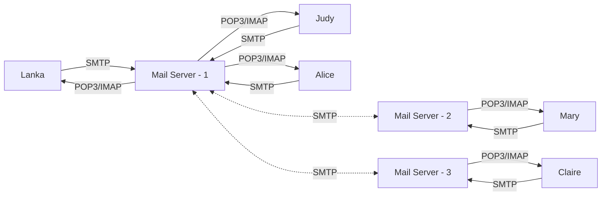

# Email

[![GitHub license][license-image]][license-url]
[![GitHub stars][stars-image]][stars-url]
[![GitHub forks][forks-image]][forks-url]
[![GitHub issues][issues-image]][issues-image]
[![GitHub watchers][watchers-image]][watchers-image]

[license-image]: https://img.shields.io/github/license/lankahsu520/HelperX.svg
[license-url]: https://github.com/lankahsu520/HelperX/blob/master/LICENSE
[stars-image]: https://img.shields.io/github/stars/lankahsu520/HelperX.svg
[stars-url]: https://github.com/lankahsu520/HelperX/stargazers
[forks-image]: https://img.shields.io/github/forks/lankahsu520/HelperX.svg
[forks-url]: https://github.com/lankahsu520/HelperX/network
[issues-image]: https://img.shields.io/github/issues/lankahsu520/HelperX.svg
[issues-url]: https://github.com/lankahsu520/HelperX/issues
[watchers-image]: https://img.shields.io/github/watchers/lankahsu520/HelperX.svg
[watchers-url]: https://github.com/lankahsu520/HelperX/watchers

# 1. Overview

> descript

# Appendix

# I. Study

## I.1. [SMTP、POP3、 IMAP 連線方式、原理](https://akikazeshao.gitbooks.io/note/content/smtppop3_imap_lian_xian_fang_shi_3001_yuan_li.html)

## I.2. [IMAP、POP3和SMTP是什麼?有什麼差異?](https://wanteasy.com.tw/doc/imap-pop3-smtp-difference.html)

# II. Debug

# III. Glossary

#### IMAP, Internet Message Access Protocol

#### POP3, Post Office Protocol 3

#### SMTP, Simple Mail Transfer Protocol

# IV. Tool Usage

# Author

Created and designed by [Lanka Hsu](lankahsu@gmail.com).

# License

[HelperX](https://github.com/lankahsu520/HelperX) is available under the BSD-3-Clause license. See the LICENSE file for more info.

