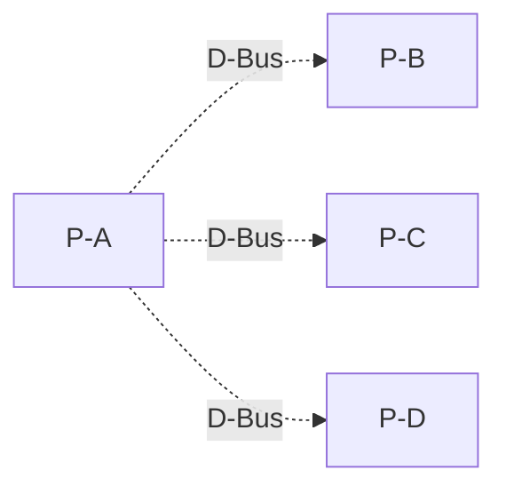
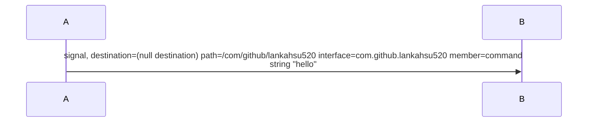
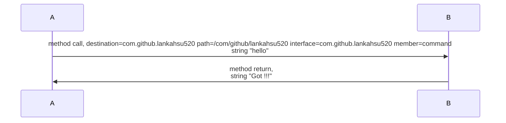

# [Amazon Chime](https://aws.amazon.com/tw/chime/)

[](https://github.com/lankahsu520/HelperX)
[![GitHub license][license-image]][license-url]
[![GitHub stars][stars-image]][stars-url]
[![GitHub forks][forks-image]][forks-url]
[![GitHub issues][issues-image]][issues-image]
[![GitHub watchers][watchers-image]][watchers-image]

[license-image]: https://img.shields.io/github/license/lankahsu520/HelperX.svg
[license-url]: https://github.com/lankahsu520/HelperX/blob/master/LICENSE
[stars-image]: https://img.shields.io/github/stars/lankahsu520/HelperX.svg
[stars-url]: https://github.com/lankahsu520/HelperX/stargazers
[forks-image]: https://img.shields.io/github/forks/lankahsu520/HelperX.svg
[forks-url]: https://github.com/lankahsu520/HelperX/network
[issues-image]: https://img.shields.io/github/issues/lankahsu520/HelperX.svg
[issues-url]: https://github.com/lankahsu520/HelperX/issues
[watchers-image]: https://img.shields.io/github/watchers/lankahsu520/HelperX.svg
[watchers-url]: https://github.com/lankahsu520/HelperX/watchers

# Be An Embedded Engineer

# 0. 序

## 0.1. 勤作筆記

### 0.1.1. 做到那，寫到那

### 0.1.2. 失敗、錯誤也得記錄下來

## 0.2. 善用版本控管工具

### 0.2.1. 所有記錄一定要納入版本控管

### 0.2.2. 懂得設定斷點，不用整個專案完成才上傳

## 0.3. 軟體工程師

```doc
從收到板子+SDK，

整理 codebase
進到版本控管
編譯流程
軟體開毃、測試
版本升級、發佈

```


# <span style="color:red">Week 1 - Monday </span>

> 先設置電腦開發環境

# 1. building machine 

## 1.1. Host Win10
### 1.1.1. [VirtualBox](https://www.virtualbox.org) (可選擇 VMware)

#### A.1. Disk

| TYPE            | SIZE  |
| --------------- | ----- |
| OS (/)          | 128GB |
| work (/dev/sdc) | 512GB |
| opt (/dev/sdb) | 128GB |


#### A.2. [VirtualBox 橋接網路介面](https://yuhao-kuo.github.io/blog/2017/12/26/virtualbox-bridge-network/)
#### A.3. [VPN not working on VirtualBox](https://windowsreport.com/vpn-not-working-on-virtualbox/)

### 1.1.2. 新增印表機

#### A. [網路印表機設定方式，win7/win10新增步驟手把手教學](https://www.aurora.com.tw/oa/oa-solutions/0j057402783054915831)

## 1.2. Client [ubuntu 20.04](https://www.ubuntu-tw.org/modules/tinyd0/) (建議選用 20.04)

### 1.2.1. bash，很重要，不然將來的*.sh會無法執行

```bash
/bin$ ll /bin/sh
lrwxrwxrwx 1 root root 4  九  10  2021 /bin/sh -> bash*

$ sudo chmod 777 /opt
```

### 1.2.2. SSH Server

### 1.2.3. svn & git client

```bash
$ sudo apt-get --yes install subversion-tools
$ sudo apt-get --yes install subversion
```

### 1.2.4. make , cmake, automake, autoconf, meson, ninja-build

### 1.2.5. gcc, g++ 

### 1.2.6. [Ubuntu 20.04.1安裝Samba伺服器及配置](https://www.gushiciku.cn/pl/ggev/zh-tw)

### 1.2.7. [Share files with NFS Ubuntu server and Windows 10 client](https://imperioweb.net/en/share-files-nfs-ubuntu-server-windows-10-client)

### 1.2.8. [GNU / Linux 各種壓縮與解壓縮指令](http://note.drx.tw/2008/04/command.html)

- tar.gz
- ~~zip (不要使用，因為在linux 下不符合權限管理)~~

### 1.2.9 檔案目錄

```bash
\ -> /
```

### 1.2.10. Linux 學習 1

```bash
alias
apt-get
cat
cd
chmod
chown
cp
cut
date
diff
echo
export
find
grep
ifconfig
kill
ls
man
mkdir
mount
mv
patch
ping
pwd
rm
rmdir
scp
sed
sudo
tail
tree
xargs
vi

```

- [【Linux】linux/ubuntu/mac 基礎終端機 (terminal) 指令 & 基礎知識總整理，初學者/新手 必須知道的基礎指令 & 基礎知識大全（持續更新）](https://www.wongwonggoods.com/linux/linux_basic/linux-ubuntu-terminal-basic/)
- [第十二章、學習 Shell Scripts](https://linux.vbird.org/linux_basic/centos7/0340bashshell-scripts.php)
- [Ubuntu 教學](https://www.arthurtoday.com/p/ubuntu-tutorial.html)

### 1.2.11. Linux 學習 2

```bash
avahi-browse
crontab
nslookup
service
systemctl
valgrind
```


# 2. [LambdaHello](https://github.com/lankahsu520/LambdaHello)

> 簡單的測試，看看會不會查尋檔案，找到對應的入口

## 2.1. Find Entry Function

> 找出程式進入點

```bash
??
```


# <span style="color:red">Week 2 - Monday ~ Week 4 - Friday </span>

> 這幾周最主要是建立 Cross Compile 的概念

# 3. Target

## 3.1. Raspberry Pi

> 安裝和啟動 PI

### 3.1.1. Raspberry Pi OS (ImageP)

- [Raspberry_Pi](https://jasonblog.github.io/note/raspberry_pi/index.html)


# 4. Building embedded Linux systems

## 4.1. Yocto (ImageY) 
### 4.1.1. Toolchains (ToolY)
### 4.1.2. 不要列入版本控管
```bash
builds
```

## 4.2. Buildroot (ImageB)
### 4.2.1. Toolchains  (ToolB)
### 4.2.2. 不要列入版本控管
```bash
output
```
## 4.3. OpenWRT (ImageO)

### 4.3.1. Toolchains  (ToolO)
- [Cross compiling](https://openwrt.org/docs/guide-developer/toolchain/crosscompile)
### 4.3.2. 不要列入版本控管
```bash
bin
build_dir
tmp
```


# <span style="color:red">Week 5 - Monday ~ Week 6 - Friday</span>

> 開始程式寫作，因為是 Embedded Engineer，所以用 C 為主。

# 5. HelloWorld with Toolchains (write in C)

## 5.1. 程式碼規則

```
縮排：tab (2 spaces)

不縮排：
#ifdef
#endi

{ 置前：
if 
{
}

if, while等，不使用單行表示，一定要用{}
```

## 5.2. 測試列表
|              | ubuntu | ImageP | ImageY | ImageB | ImageO |
| ------------ | ------ | ------ | ------ | ------ | ------ |
| GCC (ubuntu) | OK     | FAIL   | FAIL   | FAIL   | FAIL   |
| GCC (pi)     | FAIL   | OK     |        |        |        |
| ToolY        |        |        |        |        |        |
| ToolB        |        |        |        |        |        |
| ToolO        |        |        |        |        |        |


# 6. HelloWorld use a shared library

## 6.1. shared library - open/read/write a file


# 7. HelloWorld with Build system

## 7.1. make

## 7.2. cmake

## 7.3. meson

## 7.4. shellscript


#  8. Valgrind & HelloWorld (ubuntu only)

- [C語言的記憶體洩漏(Memory Leak)偵測 - Valgrind](http://blog.yslin.tw/2014/03/c-valgrind.html)

## 8.1. 正常操作模式

## 8.2. 修改程式，故意不free、存取未配置的記憶體空間等


# 9. HelloWorld with Exception handling (ubuntu only)

## 9.1. kill

```
SIGHUP 1 Hangup detected on controlling terminal or death of controlling process
SIGQUIT 3 Quit from keyboard
SIGKILL 9 Kill signal
SIGTERM 15 Termination signal
SIGUSR1
SIGUSR2
```

## 9.2. Catch Ctrl+C

## 9.3. exit function

#### A. [atexit](http://tw.gitbook.net/c_standard_library/c_function_atexit.html)

## 9.4. free function


# <span style="color:red">Week 7 - Monday ~ Week 7 - Friday</span>

> 加強一些網路的基本概念和應用。

# 10.  TCP client/server, thread (write in C)

## 10.1. Server*1 + Client *3

#### A. [libuv](https://github.com/libuv/libuv)


# 11. [Wireshark](https://www.wireshark.org)

## 11.1. Base 10. 監聽自己寫的Client/Server

## 11.2. A simple Web Server (any language, 自由選擇) + Browser

#### A. python

```bash
$ python -m SimpleHTTPServer

```

#### B. 其它語言

```bash

```

## 11.3. mDNS

```bash
$ avahi-browse -r -t _printer._tcp
$ avahi-browse -r -t _http._tcp
$ avahi-browse -r -t _ssh._tcp
```


# <span style="color:red">Week 8 - Monday ~ Week 8 - Friday</span>

> 針對常會使用的功能進行訓綀。
# 12. json 操作 - [jansson](https://github.com/akheron/jansson)

> 請使用此 [utilx9](https://github.com/lankahsu520/utilx9) 寫出程式碼
>
> git clone https://github.com/lankahsu520/utilx9.git

```json
{
	staff: [{
			"Last Name": "Hsu",
			"First Name": "Lanka"
		}, {
			"Last Name": "Hsu",
			"First Name": "Mary"
		}
	]
	office: {
		"GUI number": "08449449"
	}
}

請完成
add, delete, update
save to file, load from file
```

# 13. DBUS 操作 client/server (write in C)

> 請使用此 [utilx9](https://github.com/lankahsu520/utilx9) 寫出程式碼
>
> git clone https://github.com/lankahsu520/utilx9.git

```bash
# 監聽
$ sudo dbus-monitor --system
```

## 13.1. Signal





```c
if (payload)
{
	DBG_WN_LN("(payload: %s)", payload);
	dbusx_signal_str(dbusx_ctx_get(), DBUS_S_IFAC_YK_UP_FORMATTER_NOTIF, DBUS_S_NAME_ZIP, payload);
}
```

## 13.2. Method




	char *msg = NULL;
	SAFE_ASPRINTF(msg, QUERY_FILENAME_SERVER_XML "?" QUERY_KEY_SETFORSCAN);
	if (msg)
	{
		char *retStr = dbusx_method_str2str(dbusx_ctx_get(), DBUS_DEST_YK_P2P_DAEMON, DBUS_M_IFAC_YK_P2P_DAEMON_COMMAND, DBUS_METHOD_COMMAND, msg, TIMEOUT_OF_DBUS_P2P);
		DBG_IF_LN("(msg: %s, retStr: %s)", msg, retStr);
		SAFE_FREE(retStr);
	
		SAFE_FREE(msg);
	}


# 14. 報告

## 14.1. 以上的項目是如何起頭，查找的方式和key word。

## 14.2. 有遇到什麼困難，解決方式。

## 14.3. 搜集回來的資料，不管對與錯，之後的處置方式，留存和出處。

## 14.4. 程式和軟體的操作。

## 14.5. 文件的建立和導讀。


# Appendix

# I. [GitHub](https://github.com), [GitLab](https://about.gitlab.com)

>善用網路上的資源

```

```


# II. version control system

## II.1. [svn](https://github.com/lankahsu520/HelperX/blob/master/helper_SVNvsGit.md)

```bash

$ SVN_USER=mary
$ svn co --username $SVN_USER http://xxx/xxx/$SVN_USER

# commit and push
$ svn ci

# update, pull
$ svn up

# add file(s)
$ svn add
$ svn add --no-ignore

# changed files
$ svn st -q

# not under version control
$ svn status | grep -e ^?

```

## II.2. [git](https://github.com/lankahsu520/HelperX/blob/master/helper_SVNvsGit.md)

# III. Tools 

## III.1. 編輯器 c, c++, etc 

### III.1.1. [Notepad++](https://notepad-plus-plus.org/downloads/v8.3.3/)

- [Notepad++ Plugins JSON viewer for Javascript](https://pclevin.blogspot.com/2018/01/notepad-plugins-json-viewer-for.html)

### III.1.2. [Source Insight](https://www.sourceinsight.com)

## III.2. 比較軟體 merge
- [Code Compare](https://www.devart.com/codecompare/?utm_medium=application&utm_campaign=fromapp_CodeCompare&utm_source=AboutForm)

## III.3. SSH Client
- [MobaXterm](https://www.google.com/url?sa=t&rct=j&q=&esrc=s&source=web&cd=&ved=2ahUKEwjRqOOJpO_2AhWFyIsBHaptD80QFnoECBcQAQ&url=https%3A%2F%2Fmobaxterm.mobatek.net%2Fdownload.html&usg=AOvVaw1KdgWg-XLXLUD5WTdf0WWV)

## III.4. Markdown

- [Typora — a markdown editor, markdown reader.](https://typora.io/)
- [typora 画流程图、时序图(顺序图)、甘特图](https://www.runoob.com/note/47651)
- [About Mermaid](https://mermaid-js.github.io/mermaid/#/?id=about-mermaid)

## III.5. [DIVVY](https://mizage.com/windivvy/) - 分割視窗


# Author

Created and designed by [Lanka Hsu](lankahsu@gmail.com).

# License

[HelperX](https://github.com/lankahsu520/HelperX) is available under the BSD-3-Clause license. See the LICENSE file for more info.
