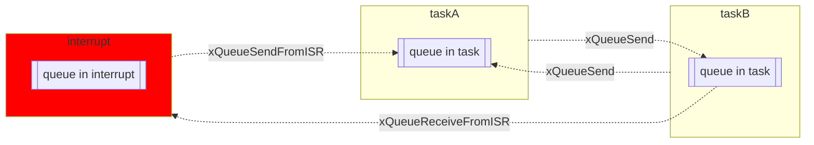

# [FreeRTOS](https://www.freertos.org/index.html)
[](https://github.com/lankahsu520/HelperX)
[![GitHub license][license-image]][license-url]
[![GitHub stars][stars-image]][stars-url]
[![GitHub forks][forks-image]][forks-url]
[![GitHub issues][issues-image]][issues-image]
[![GitHub watchers][watchers-image]][watchers-image]

[license-image]: https://img.shields.io/github/license/lankahsu520/HelperX.svg
[license-url]: https://github.com/lankahsu520/HelperX/blob/master/LICENSE
[stars-image]: https://img.shields.io/github/stars/lankahsu520/HelperX.svg
[stars-url]: https://github.com/lankahsu520/HelperX/stargazers
[forks-image]: https://img.shields.io/github/forks/lankahsu520/HelperX.svg
[forks-url]: https://github.com/lankahsu520/HelperX/network
[issues-image]: https://img.shields.io/github/issues/lankahsu520/HelperX.svg
[issues-url]: https://github.com/lankahsu520/HelperX/issues
[watchers-image]: https://img.shields.io/github/watchers/lankahsu520/HelperX.svg
[watchers-url]: https://github.com/lankahsu520/HelperX/watchers

# 1. Overview

> 提供一個較小的作業系統。一般用於MCU。RTOS 的開發要特別注意 ISR 運行中，不要再有 interrupt，且處理時間要短，把耗時的流程移至一般Task。
>
> 本篇是主要是用 Rafael RT58x (ARM Cortex-M3 CPU)。大家手邊的 SDK，會因為 MCU 或供應商不同而有所差異。

## 1.1. [FreeRTOS Real Time Kernel (RTOS)](https://sourceforge.net/projects/freertos/)

> FreeRTOS is a market-leading real-time operating system (RTOS) for microcontrollers and small microprocessors. Distributed freely under the MIT open source license, FreeRTOS includes a kernel and a growing set of libraries suitable for use across all industry sectors. Visit [https://www.freertos.org](https://www.freertos.org/) for more information and other download options.

#### A. Features

- Tiny (5-10kb ROM), power-saving kernel
- Support for 40+ architectures
- Truely free MIT license
- Optional commercial licensing and support available
- Variety of modular libraries included
- Secure and tested IoT reference integrations

## 1.2. [FreeRTOS support forum](https://forums.freertos.org)

# 2. Software and Hardware Layer

## 2.1. Task Priority (High to Low)

> HWI 和 SWI 的執行時間都有嚴格的限制。所以要善用 Queue 或是 Event 傳遞到一般的 Task。
>
> 另外特別注意 ISR  的 Task 要使用 xxxISR()。


## 2.2. Task States


# 3. [API Reference](https://www.freertos.org/a00106.html)

## 3.1. FreeRTOSConfig.h

> [FreeRTOS学习笔记(3)FreeRTOS的系统配置](https://neyzoter.cn/2018/04/01/FreeRTOS-Note3-Config/)

#### A. configUSE_TASK_NOTIFICATIONS

## 3.2. Task & ISR

> [FreeRTOS --（7）任务管理之入门篇](https://blog.csdn.net/zhoutaopower/article/details/107019521)

```C
xTaskCreateStatic
xTaskCreate
xTaskCreateRestricted
xTaskCreateRestrictedStatic
  
xPortIsInsideInterrupt

TaskHandle_t xHandle = xTaskGetCurrentTaskHandle();
vTaskDelete(xHandle);
```

```c
static void esp_mqtt_task(void *pv)
{
	...
    vTaskDelete(NULL); // kill self
}

esp_err_t esp_mqtt_client_start(esp_mqtt_client_handle_t client)
{
	...
    if (xTaskCreate(esp_mqtt_task, "mqtt_task", client->config->task_stack, client, client->config->task_prio, &client->task_handle) != pdTRUE) {
        ESP_LOGE(TAG, "Error create mqtt task");
        err = ESP_FAIL;
    }
	...
}
```

## 3.3. System Tools

#### log

```c
```


#### memory

```c
uint32_t sys_get_free_size(void)
{
	return (uint32_t)xPortGetFreeHeapSize();
}
```

#### now

```c
// get current system time
uint32_t sys_now(void)
{
  return xTaskGetTickCount() * portTICK_RATE_MS;
}

uint32_t sys_now_from_isr(void)
{
	return xTaskGetTickCountFromISR() * portTICK_RATE_MS;
}
```

#### random

```c
static uint32_t gu32_random_seed = random_seed;

void sys_set_random_seed(uint32_t random_seed)
{
	gu32_random_seed = random_seed;
}
uint32_t sys_random(void)
{
	return sys_now() + gu32_random_seed * 1103515245 + 12345678;
}
```

#### sleep

> 1 (hour) = 60 (min) = 3600 (sec)
>
> 1 (sec) = 1000ms (ms) = 1,000,000 (us) = 1,000,000,000 (ns) = 1,000,000,000 (ps)

```c
void vTaskDelay( const TickType_t xTicksToDelay )

// 必須將 ms 轉成 tick
uint32_t 2secs = 2000 / portTICK_PERIOD_MS // 2 seconds -> ticks
```

```c
void sys_msleep(uint32_t u32_ms)
{
	if (u32_ms >= 1)
	{
		vTaskDelay(u32_ms / portTICK_PERIOD_MS);
	}
}
```

## 3.4. Event

> [FreeRTOS --（17）任务通知浅析](https://stephenzhou.blog.csdn.net/article/details/107467305)
>
> In FreeRTOSConfig.h, set configUSE_TASK_NOTIFICATIONS  as 1

```c
xTaskNotify
xTaskNotifyAndQuery
xTaskNotifyAndQueryFromISR
  
xTaskNotifyGive
xTaskNotifyFromISR

ulTaskNotifyTake
xTaskNotifyWait
```


## 3.5. Mailbox & Queue

> [FreeRTOS --（14）队列管理之概述](https://blog.csdn.net/zhoutaopower/article/details/107221175)

>[ChatGPT] RTOS queue 的功用
>
>
>RTOS（Real-Time Operating System）中的隊列（Queue）是一種用於任務之間通信和數據傳輸的數據結構。隊列允許一個任務（或中斷服務例程）放置數據，而另一個任務從隊列中取出數據。這種通信方式是線程安全的，因此適用於多任務環境。
>
>隊列的主要功能包括：
>
>1. **數據傳輸**：允許一個任務將數據放置到隊列中，而另一個任務從隊列中取出數據，實現了數據在任務之間的傳遞。
>2. **同步**：隊列還可以用於同步任務的執行，例如一個任務等待隊列中有數據可用，另一個任務在隊列中放置數據，這樣就實現了任務之間的同步。
>3. **數據緩沖**：隊列可以用作數據緩沖區，允許任務在不同的速率下生產和消費數據。
>4. **事件通知**：任務可以等待某些特定的事件發生，當事件發生時，將數據放入隊列並通知等待的任務。
>
>總的來說，隊列在RTOS中起著重要的作用，使得任務之間的通信和同步更加簡單和可靠。

```c
xQueueCreate
xQueueCreateStatic
vQueueDelete
  
xQueueSend
xQueueSendFromISR
xQueueSendToBack
xQueueSendToBackFromISR
xQueueSendToFront
xQueueSendToFrontFromISR
xQueueCRSend
xQueueCRSendFromISR
xQueueOverwrite

xQueuePeek
xQueuePeekFromISR

xQueueReceive
xQueueReceiveFromISR
xQueueCRReceiveFromISR
xQueueCRReceive
```



## 3.6. Mutex & Semaphore

> [FreeRTOS --（15）信号量之概述](https://stephenzhou.blog.csdn.net/article/details/107359095)
> [FreeRTOS --（16）资源管理之临界区](https://stephenzhou.blog.csdn.net/article/details/107387427)

```c
xSemaphoreCreateBinary
xSemaphoreCreateBinaryStatic

xSemaphoreTake
xSemaphoreTakeRecursive

xSemaphoreGive
xSemaphoreGiveRecursive

xSemaphoreGiveFromISR
xSemaphoreTakeFromISR

xSemaphoreCreateMutex
xSemaphoreCreateMutexStatic
xSemaphoreCreateRecursiveMutex
xSemaphoreCreateRecursiveMutexStatic
xSemaphoreCreateCounting
xSemaphoreCreateCountingStatic

xSemaphoreGetMutexHolder
xSemaphoreGetMutexHolderFromISR
```

#### A. Mutex

> 常用於資源保護


##### A.1. Main

```c
int main(int argc, char* argv[])
{
  xMutex = xSemaphoreCreateMutex();
}
```

##### A.2. Task A

```C
void TaskA(void *arg)
{
	for( ;; )
	{
		xSemaphoreTake( xMutex, portMAX_DELAY );
		{
			printf("Task A\n");
		}
		xSemaphoreGive( xMutex );
		vTaskDelay( 1000/portTICK_RATE_MS );
	}
}
```

##### A.3. Task B

```C
void TaskB(void *arg)
{
	for( ;; )
	{
		xSemaphoreTake( xMutex, portMAX_DELAY );
		{
			printf("Task B\n");
		}
		xSemaphoreGive( xMutex );
		vTaskDelay( 1000/portTICK_RATE_MS );
	}
}
```

#### B. Semaphore

> 常用於同步


# Appendix

# I. Study

## I.1. [FreeRTOS](http://wiki.csie.ncku.edu.tw/embedded/freertos)

## I.2. [FreeRTOS學習筆記——互斥型信號量](https://www.twblogs.net/a/5b7e42d82b71776838563861)

## I.3. [FreeRTOS学习笔记——二值型信号量](https://blog.csdn.net/xukai871105/article/details/43153177)

## I.4. [FreeRTOS学习笔记——任务间使用队列同步数据](https://blog.csdn.net/xukai871105/article/details/17125627)

## I.5. [RTOS](https://blog.csdn.net/zhoutaopower/category_10073388.html)

# II. Debug

# III. Glossary

# IV. Tool Usage

# Author

> Created and designed by [Lanka Hsu](lankahsu@gmail.com).

# License

> [HelperX](https://github.com/lankahsu520/HelperX) is available under the BSD-3-Clause license. See the LICENSE file for more info.
