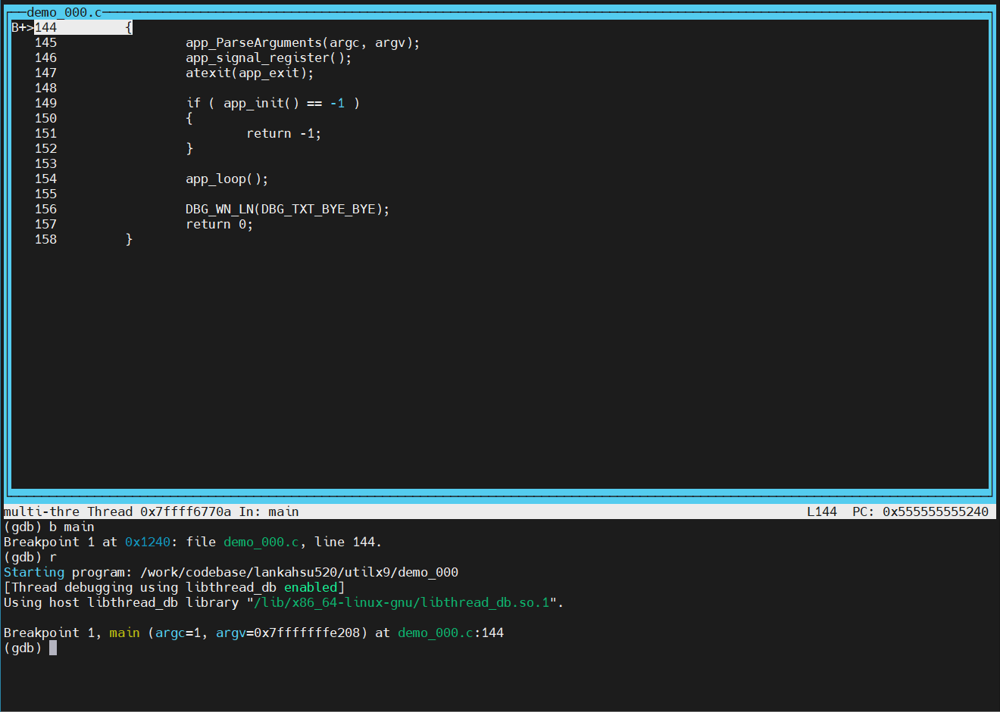

# GCC、Debug and gdb
[](https://github.com/lankahsu520/HelperX)
[![GitHub license][license-image]][license-url]
[![GitHub stars][stars-image]][stars-url]
[![GitHub forks][forks-image]][forks-url]
[![GitHub issues][issues-image]][issues-image]
[![GitHub watchers][watchers-image]][watchers-image]

[license-image]: https://img.shields.io/github/license/lankahsu520/HelperX.svg
[license-url]: https://github.com/lankahsu520/HelperX/blob/master/LICENSE
[stars-image]: https://img.shields.io/github/stars/lankahsu520/HelperX.svg
[stars-url]: https://github.com/lankahsu520/HelperX/stargazers
[forks-image]: https://img.shields.io/github/forks/lankahsu520/HelperX.svg
[forks-url]: https://github.com/lankahsu520/HelperX/network
[issues-image]: https://img.shields.io/github/issues/lankahsu520/HelperX.svg
[issues-url]: https://github.com/lankahsu520/HelperX/issues
[watchers-image]: https://img.shields.io/github/watchers/lankahsu520/HelperX.svg
[watchers-url]: https://github.com/lankahsu520/HelperX/watchers

# 1. Overview

> 以 C 語言為主，從編譯到執行時，可能會遇到的狀況。以及 一些處理手段和工具。
>
> 全篇並不是要申論某一主題，只是提及相關的經驗和解決之道。
>
> 畢竟個人的 文采不好，請見諒。

# 2.  Compile Errors and Warnings

> 有些相關訊息可透過 gcc 編譯時的參數 CFLAGS 調整就可以解決，而有些就要修改原始碼，

## 2.1. [Options to Request or Suppress Warnings](https://gcc.gnu.org/onlinedocs/gcc/Warning-Options.html)

#### A. [-Wall, -W](https://gcc.gnu.org/onlinedocs/gcc/Warning-Options.html#index-Wall)

> 顯示所有警告

> 強力建議使用

#### B. [-Wformat-truncation](https://gcc.gnu.org/onlinedocs/gcc/Warning-Options.html#index-Wformat-truncation)

> 警告有時無可避免，但建議使用 snprintf or asprintf

```bash
CFLAGS+=-Wformat-truncation=0
```

##### B.1. example

```bash
json_api.c:342:33: warning: ‘__builtin___snprintf_chk’ output may be truncated before the last format character [-Wformat-truncation=]
  342 |      SAFE_SPRINTF_EX(topic_new, "%s/%s", topic, key_found);
      |                                 ^~~~~~~
```

> topic_new: 1024
> topic: 1024
> key_found: pointer

> Level 1 of -Wformat-truncation enabled by -Wformat employs a conservative approach that warns only about calls to bounded functions whose return value is unused and that will most likely result in output truncation.

#### C. [-Wno-format](https://gcc.gnu.org/onlinedocs/gcc/Warning-Options.html#index-Wformat)

> 不建議使用，請針對程式碼進行修改

```bash
CFLAGS+=-Wno-format
```

##### C.1. example

```bash
helloworld_simple.c:26:28: warning: format ‘%d’ expects argument of type ‘int’, but argument 2 has type ‘size_t’ {aka ‘long unsigned int’} [-Wformat=]
   26 |  printf("Hello world !!! (%d)\n", strlen(buff));
      |                           ~^      ~~~~~~~~~~~~
      |                            |      |
      |                            int    size_t {aka long unsigned int}
      |                           %ld
```

```bash
// 修改成 %ld
printf("Hello world !!! (%ld)\n", strlen(buff));
```

#### D. [-Wno-implicit-function-declaration](https://gcc.gnu.org/onlinedocs/gcc/Warning-Options.html#index-Wimplicit-function-declaration)

> 不建議使用，<font color="red">請 include 相對應的 Header File</font>

```bash
CFLAGS+=-Wno-implicit-function-declaration
```

##### D.1. example - printf

```bash
helloworld_simple.c:24:2: warning: implicit declaration of function ‘printf’ [-Wimplicit-function-declaration]
   24 |  printf("Hello world !!! (%d)\n", strlen(buff));
      |  ^~~~~~
helloworld_simple.c:24:2: warning: incompatible implicit declaration of built-in function ‘printf’
helloworld_simple.c:1:1: note: include ‘<stdio.h>’ or provide a declaration of ‘printf’
  +++ |+#include <stdio.h>
```

```bash
#include <stdio.h> // printf
```

##### Ｄ.2. example - strlen

```bash
helloworld_simple.c:24:35: warning: implicit declaration of function ‘strlen’ [-Wimplicit-function-declaration]
   24 |  printf("Hello world !!! (%d)\n", strlen(buff));
      |                                   ^~~~~~
helloworld_simple.c:24:35: warning: incompatible implicit declaration of built-in function ‘strlen’
helloworld_simple.c:1:1: note: include ‘<string.h>’ or provide a declaration of ‘strlen’
  +++ |+#include <string.h>
```

```bash
#include <string.h> // strlen
```

#### E. [-Wno-int-conversion](https://gcc.gnu.org/onlinedocs/gcc/Warning-Options.html#index-Wno-int-conversion)

> <font color="red">禁止使用</font>

```bash
statex_api.c:215:23: warning: assignment to ‘QueueX_t *’ {aka ‘struct QueueX_Struct *’} from ‘int’ makes pointer from integer without a cast [-Wint-conversion]
  215 |  statex_req->statex_q = queuex_thread_init(name, MAX_OF_QSTATEX, sizeof(StateXPuck_t), statex_q_exec_cb, statex_q_free_cb);
```

```bash
CFLAGS+=-Wno-int-conversion
```

#### F. [-Wno-unused-result](https://gcc.gnu.org/onlinedocs/gcc/Warning-Options.html#index-Wunused-result)

> 不建議使用，<font color="red">直接移除該變數</font>

```bash
helloworld_simple.c:12:6: warning: unused variable ‘ret’ [-Wunused-variable]
   12 |  int ret = 0;
```

## 2.2. [Options for Debugging Your Program](https://gcc.gnu.org/onlinedocs/gcc/Debugging-Options.html)

#### A. [-g](https://gcc.gnu.org/onlinedocs/gcc/Debugging-Options.html#index-g)

> 建議使用，將來有利使用 gdb 進行 debug

```bash
$ gdb ./demo_123
GNU gdb (Ubuntu 9.2-0ubuntu1~20.04.1) 9.2
Copyright (C) 2020 Free Software Foundation, Inc.
License GPLv3+: GNU GPL version 3 or later <http://gnu.org/licenses/gpl.html>
This is free software: you are free to change and redistribute it.
There is NO WARRANTY, to the extent permitted by law.
Type "show copying" and "show warranty" for details.
This GDB was configured as "x86_64-linux-gnu".
Type "show configuration" for configuration details.
For bug reporting instructions, please see:
<http://www.gnu.org/software/gdb/bugs/>.
Find the GDB manual and other documentation resources online at:
    <http://www.gnu.org/software/gdb/documentation/>.

For help, type "help".
Type "apropos word" to search for commands related to "word"...
Reading symbols from ./demo_123...
(No debugging symbols found in ./demo_123)
(gdb)
```

```bash
CFLAGS+=-g
```

```bash
# file 查看有沒有 with debug_info
$ file helloworld
helloworld: ELF 64-bit LSB shared object, x86-64, version 1 (SYSV), dynamically linked, interpreter /lib64/ld-linux-x86-64.so.2, BuildID[sha1]=c6c8fadaa766e62cd9720a10a435c684456fe6eb, for GNU/Linux 3.2.0, with debug_info, not stripped
```

## 2.3. [Options That Control Optimization](https://gcc.gnu.org/onlinedocs/gcc/Optimize-Options.html)

#### A. [-O](https://gcc.gnu.org/onlinedocs/gcc/Optimize-Options.html#index-O)

> Optimize. Optimizing compilation takes somewhat more time, and a lot more memory for a large function.
>
> 進行編譯最佳化。雖然執行速度和效能<font color="red">可能</font>提高，不過副作用還是存在的，如非原程式碼的問題，而是最佳化後的 bug。
>
> 另外如果有要進行 gdb 進行 debug，有些功能會大大的縮減。

## 2.4. [Options for Code Generation Conventions](https://gcc.gnu.org/onlinedocs/gcc/Code-Gen-Options.html)

#### A. [-fPIC](https://gcc.gnu.org/onlinedocs/gcc/Code-Gen-Options.html#index-fPIC)

>編譯 shared library 時，請一定要加上

```bash
Building lib (shared): libutilx9.so
g++  -shared  -L/work/codebase/lankahsu520/utilx9/install/github_/lib -Wl,-rpath,/work/rootfs/lib -L./ -Wl,-soname,libutilx9.so.2 -o libutilx9.so.2.0.1 chainX_api.o clist_api.o led_api.o proc_table_api.o queuex_api.o multicast_api.o statex_api.o thread_api.o cronx_api.o utilx9.o crc16.o crc32alg.o internet-collect.o  usbX_api.o json_api.o mqtt_api.o lws_api.o curl_api.o rtp_api.o uv_api.o dbusx_api.o
/usr/bin/ld: lws_api.o: relocation R_X86_64_PC32 against symbol `dbg_more' can not be used when making a shared object; recompile with -fPIC
/usr/bin/ld: final link failed: bad value
collect2: error: ld returned 1 exit status

```

```bash
CFLAGS+=-fPIC
```

## 2.5. Others

#### A. error: ‘__NR_gettid’ undeclared (first use in this function)

> <font color="red">請 include 相對應的 Header File</font>

```bash
helloworld_dbg.h:42:31: error: ‘__NR_gettid’ undeclared (first use in this function)
   42 | #define gettidv1_ex() syscall(__NR_gettid)

```

```bash
#include <sys/syscall.h>
```

# <font color="red">3. Debug</font>

> 如果你還不知道什麼是 [Debug](https://zh.wikipedia.org/wiki/葛麗絲·霍普)，請先了解 Debug 這個字的由來。
>
> 為什麼會特別列出這主題，因為就算遇到本科系的學生，也常常發生雞同鴨講，更別說是文組的同學。
>
> <font color="red">不管各位是用什麼工具、用什麼方法找出問題，最終還是靠軟體工程師進行修改。</font>

> <font color="red">平常寫程式有良好的習慣，如注意 alloc、free，給初值，使用驗證過的函數等，加上幾行 Debug message(s) ，解決 Compile Errors and Warnings，就能處理至少 95%上的問題。</font>

>由此可知，軟體的好壞，大部分的因素還是在<font color="red">人 (軟體工程師)</font> 身上。除了軟體工程師的素質外，就是其身心是否健全。
>
>工作中就常遇到特定的軟體工程師會用 bug 養 bug(s)，在那邊裝忙。為什麼會這樣，也要怪主管只相信 commit(s)  or bug(s) 多少來決定考考績。真是苦了那些良心尚在的軟體工程師。

# 4.  Debug message、Log vs gdb

>這邊的 Log 是代表存入檔案，之後再進行解析。
>

## 4.1. xxx time


|              | Coding | Code Review | Compile Errors and Warnings | Debug message | Log  | gdb  |
| :----------: | ------ | ----------- | --------------------------- | ------------- | ---- | ---- |
| Design Time  | ✔      | ✔           |                             |               |      |      |
| Compile Time |        |             | ✔                           |               |      |      |
|   Runtime    |        |             |                             | ✔             | ✔    | ✔    |

## 4.2. Runtime Checking

|                        | Debug message | Log  | gdb  |
| :--------------------: | ------------- | ---- | ---- |
| Get immediate response | ✔             |      | ✔    |
|   breakpoint (stop)    |               |      | ✔    |
|      line-by-line      | ✔             | ✔    | ✔    |
|  function-by-function  | ✔             | ✔    | ✔    |

# 5. 使用 gdb、gdbserver 

>GDB, the GNU Project debugger, allows you to see what is going on `inside' another program while it executes -- or what another program was doing at the moment it crashed.
>
>GDB can do four main kinds of things (plus other things in support of these) to help you catch bugs in the act:
>
>- Start your program, specifying anything that might affect its behavior.
>- Make your program stop on specified conditions.
>- Examine what has happened, when your program has stopped.
>- Change things in your program, so you can experiment with correcting the effects of one bug and go on to learn about another.
>
>The program being debugged can be written in C, C++, Pascal, Objective-C (and many other languages). Those programs might be executing on the same machine as GDB (native) or on another machine (remote). GDB can run on most popular UNIX and Microsoft Windows variants.

## 5.1. gdb 的指令

>[ChatGPT]
>
>GDB（GNU Debugger）是一個功能豐富的調試工具，它提供了各種指令，用於幫助你調試程式、觀察變數值、設置斷點等。以下是一些常用的 GDB 指令：
>
>1. **run / r：** 開始執行程式，可以搭配參數。例如：`run my_program arg1 arg2`
>2. **break / b：** 設置斷點。你可以在特定的行數或函數上設置斷點。例如：`break main` 或 `b 15`
>3. **continue / c：** 繼續執行程式直到下一個斷點。
>4. **step / s：** 單步執行，逐行執行並進入函數內部。
>5. **next / n：** 單步執行，但不進入函數內部。
>6. **finish：** 執行程式，直到當前函數執行完畢。
>7. **print / p：** 顯示變數的值。例如：`print x`
>8. **info locals：** 顯示當前函數的局部變數。
>9. **info breakpoints：** 顯示已設置的斷點。
>10. **backtrace / bt：** 顯示當前的呼叫堆疊。
>11. **watch：** 監視變數的變化。
>12. **set variable：** 設置變數的值。
>13. **list / l：** 顯示程式碼，預設是當前行附近的代碼。
>14. **delete breakpoints：** 刪除斷點。
>15. **quit / q：** 退出 GDB。
>
>這只是 GDB 指令的一個簡單列表，GDB 還有更多的指令和選項可以使用。你可以通過在 GDB 命令行界面中輸入 `help` 來查看所有可用的指令，或者使用 `help 指令名稱` 來獲得特定指令的幫助信息。如果你需要更詳細的資訊，你也可以參考 GDB 的官方文檔。

## 5.2. 範例 ./demo_000

#### A. 進入 gdb

```bash
$ gdb ./demo_000
GNU gdb (Ubuntu 9.2-0ubuntu1~20.04.1) 9.2
Copyright (C) 2020 Free Software Foundation, Inc.
License GPLv3+: GNU GPL version 3 or later <http://gnu.org/licenses/gpl.html>
This is free software: you are free to change and redistribute it.
There is NO WARRANTY, to the extent permitted by law.
Type "show copying" and "show warranty" for details.
This GDB was configured as "x86_64-linux-gnu".
Type "show configuration" for configuration details.
For bug reporting instructions, please see:
<http://www.gnu.org/software/gdb/bugs/>.
Find the GDB manual and other documentation resources online at:
    <http://www.gnu.org/software/gdb/documentation/>.

For help, type "help".
Type "apropos word" to search for commands related to "word"...
Reading symbols from ./demo_000...
(gdb)
```

#### B. (gdb) b xxx；設置斷點，指定 function-main

```bash
(gdb) b main
Breakpoint 1 at 0x1240: file demo_000.c, line 144.
```

#### C. (gdb) run；開始運行

```bash
(gdb) r
Starting program: /work/codebase/lankahsu520/utilx9/demo_000
[Thread debugging using libthread_db enabled]
Using host libthread_db library "/lib/x86_64-linux-gnu/libthread_db.so.1".

Breakpoint 1, main (argc=1, argv=0x7fffffff9178) at demo_000.c:144
144     {
```

#### D. (gdb) list；顯示目前運行前、後的代碼

```bash
(gdb) list
139                     }
140             }
141     }
142
143     int main(int argc, char *argv[])
144     {
145             app_ParseArguments(argc, argv);
146             app_signal_register();
147             atexit(app_exit);
148
```

#### F.  (gdb) b xxx；設置斷點，指定行數

```bash
(gdb) b 145
Breakpoint 4 at 0x55555555526a: file demo_000.c, line 145.
(gdb) b 146
Breakpoint 3 at 0x5555555552af: file demo_000.c, line 146.
(gdb) b 147
Breakpoint 4 at 0x555555555313: file demo_000.c, line 147.
(gdb) b 149
Breakpoint 5 at 0x55555555531f: file demo_000.c, line 149.

```

#### G.  (gdb) info b；查看目前的斷點

```bash
(gdb) info b
Num     Type           Disp Enb Address            What
1       breakpoint     keep y   0x0000555555555240 in main at demo_000.c:144
        breakpoint already hit 1 time
2       breakpoint     keep y   0x000055555555526a in app_ParseArguments at demo_000.c:145
3       breakpoint     keep y   0x00005555555552af in app_signal_register at demo_000.c:146
4       breakpoint     keep y   0x0000555555555313 in main at demo_000.c:147
5       breakpoint     keep y   0x000055555555531f in app_loop at demo_000.c:149

```

#### H. (gdb) del xxx；移除特定的斷點

```bash
(gdb) del 4
```

#### I. (gdb) clear xxx；移除該行 or function 的斷點

```bash
(gdb) clear 146
```

#### J.  (gdb) continue；繼續執行，將執行至下一個斷點

```bash
(gdb) c
Continuing.

Breakpoint 2, app_ParseArguments (argv=0x7fffffff9178, argc=1) at demo_000.c:145
145             app_ParseArguments(argc, argv);
```

#### K. (gdb) step；繼續執行，跳轉至 function

```bash
(gdb) s
126             while((opt = getopt_long (argc, argv, short_options, long_options, &option_index)) != -1)
(gdb) list
121
122     static void app_ParseArguments(int argc, char argv)
123     {
124             int opt;
125
126             while((opt = getopt_long (argc, argv, short_options, long_options, &option_index)) != -1)
127             {
128                     switch (opt)
129                     {
130                             case 'd':

```

#### L. (gdb) next；繼續執行

```bash
(gdb) n
main (argc=1, argv=0x7fffffff9178) at demo_000.c:146
146             app_signal_register();
```

#### M. (gdb) p xxx；印出變數

```bash
(gdb) p argc
$1 = 1
(gdb) p dbg_more
$2 = 2
(gdb) p argv
$3 = (char ) 0x7fffffff9178
(gdb) p argv[0]
$4 = 0x7fffffffa12d "/work/codebase/lankahsu520/utilx9/demo_000"
```

#### N. (gdb) set xxx=???；修改變數的值

```bash
(gdb) set dbg_more=3
(gdb) p dbg_more
$5 = 3

```

#### O. (gdb) info locals；查看 local 變數

```bash
(gdb) info locals
__FUNCTION__ = "main"
```

#### P.  (gdb) continue；繼續執行，將執行至下一個斷點

```bash
(gdb) c
Continuing.

Breakpoint 5, app_loop () at demo_000.c:154
154             app_loop();
```

#### Q. (gdb) quit；離開 gdb

```bash
(gdb) q
A debugging session is active.

        Inferior 1 [process 57186] will be killed.

Quit anyway? (y or n) y
```

## 5.3. TUI (Text User Interface)

#### A. 進入 gdb

```bash
$ gdb ./demo_000
GNU gdb (Ubuntu 9.2-0ubuntu1~20.04.1) 9.2
Copyright (C) 2020 Free Software Foundation, Inc.
License GPLv3+: GNU GPL version 3 or later <http://gnu.org/licenses/gpl.html>
This is free software: you are free to change and redistribute it.
There is NO WARRANTY, to the extent permitted by law.
Type "show copying" and "show warranty" for details.
This GDB was configured as "x86_64-linux-gnu".
Type "show configuration" for configuration details.
For bug reporting instructions, please see:
<http://www.gnu.org/software/gdb/bugs/>.
Find the GDB manual and other documentation resources online at:
    <http://www.gnu.org/software/gdb/documentation/>.

For help, type "help".
Type "apropos word" to search for commands related to "word"...
Reading symbols from ./demo_000...
(gdb)

```

#### B. 按下 Ctrl+x+a



#### C. 按下 Ctrl+l，刷新螢幕

## 5.4. gdbserver


#### A. [Target]啟動 gdbserver

```bash
$ gdbserver :4567 ./demo_000
Process ./demo_000 created; pid = 13568
Listening on port 4567
```

#### B. 進入 gdb

```bash
$ gdb
GNU gdb (Ubuntu 9.2-0ubuntu1~20.04.1) 9.2
Copyright (C) 2020 Free Software Foundation, Inc.
License GPLv3+: GNU GPL version 3 or later <http://gnu.org/licenses/gpl.html>
This is free software: you are free to change and redistribute it.
There is NO WARRANTY, to the extent permitted by law.
Type "show copying" and "show warranty" for details.
This GDB was configured as "x86_64-linux-gnu".
Type "show configuration" for configuration details.
For bug reporting instructions, please see:
<http://www.gnu.org/software/gdb/bugs/>.
Find the GDB manual and other documentation resources online at:
    <http://www.gnu.org/software/gdb/documentation/>.

For help, type "help".
Type "apropos word" to search for commands related to "word".
(gdb)
```

#### C. [Host] (gdb) target remote 192.168.56.104:4567

```bash
(gdb) target remote 192.168.56.104:4567
Remote debugging using 192.168.56.104:4567
Reading /work/codebase/lankahsu520/utilx9/demo_000 from remote target...
warning: File transfers from remote targets can be slow. Use "set sysroot" to access files locally instead.
Reading /work/codebase/lankahsu520/utilx9/demo_000 from remote target...
Reading symbols from target:/work/codebase/lankahsu520/utilx9/demo_000...
Reading /lib64/ld-linux-x86-64.so.2 from remote target...
Reading /lib64/ld-linux-x86-64.so.2 from remote target...
Reading symbols from target:/lib64/ld-linux-x86-64.so.2...
Reading symbols from /usr/lib/debug/.build-id/45/87364908de169dec62ffa538170118c1c3a078.debug...
0x00007ffff7fd0100 in _start () from target:/lib64/ld-linux-x86-64.so.2


```

# Appendix

# I. Study

## I.1. [GCC Command Options](https://gcc.gnu.org/onlinedocs/gcc/Invoking-GCC.html)

## I.2. [GNU偵錯器](https://zh.wikipedia.org/zh-tw/GNU侦错器)

## I.3. [GDB: The GNU Project Debugger](http://gnu.ist.utl.pt/software/gdb/gdb.html)

# II. Debug

# III. Glossary

# IV. Tool Usage

## IV.1. [gcc](https://gcc.gnu.org) Usage

```bash
$ gcc --help
Usage: gcc [options] file...
Options:
  -pass-exit-codes         Exit with highest error code from a phase.
  --help                   Display this information.
  --target-help            Display target specific command line options.
  --help={common|optimizers|params|target|warnings|[^]{joined|separate|undocumented}}[,...].
                           Display specific types of command line options.
  (Use '-v --help' to display command line options of sub-processes).
  --version                Display compiler version information.
  -dumpspecs               Display all of the built in spec strings.
  -dumpversion             Display the version of the compiler.
  -dumpmachine             Display the compiler's target processor.
  -print-search-dirs       Display the directories in the compiler's search path.
  -print-libgcc-file-name  Display the name of the compiler's companion library.
  -print-file-name=<lib>   Display the full path to library <lib>.
  -print-prog-name=<prog>  Display the full path to compiler component <prog>.
  -print-multiarch         Display the target's normalized GNU triplet, used as
                           a component in the library path.
  -print-multi-directory   Display the root directory for versions of libgcc.
  -print-multi-lib         Display the mapping between command line options and
                           multiple library search directories.
  -print-multi-os-directory Display the relative path to OS libraries.
  -print-sysroot           Display the target libraries directory.
  -print-sysroot-headers-suffix Display the sysroot suffix used to find headers.
  -Wa,<options>            Pass comma-separated <options> on to the assembler.
  -Wp,<options>            Pass comma-separated <options> on to the preprocessor.
  -Wl,<options>            Pass comma-separated <options> on to the linker.
  -Xassembler <arg>        Pass <arg> on to the assembler.
  -Xpreprocessor <arg>     Pass <arg> on to the preprocessor.
  -Xlinker <arg>           Pass <arg> on to the linker.
  -save-temps              Do not delete intermediate files.
  -save-temps=<arg>        Do not delete intermediate files.
  -no-canonical-prefixes   Do not canonicalize paths when building relative
                           prefixes to other gcc components.
  -pipe                    Use pipes rather than intermediate files.
  -time                    Time the execution of each subprocess.
  -specs=<file>            Override built-in specs with the contents of <file>.
  -std=<standard>          Assume that the input sources are for <standard>.
  --sysroot=<directory>    Use <directory> as the root directory for headers
                           and libraries.
  -B <directory>           Add <directory> to the compiler's search paths.
  -v                       Display the programs invoked by the compiler.
  -###                     Like -v but options quoted and commands not executed.
  -E                       Preprocess only; do not compile, assemble or link.
  -S                       Compile only; do not assemble or link.
  -c                       Compile and assemble, but do not link.
  -o <file>                Place the output into <file>.
  -pie                     Create a dynamically linked position independent
                           executable.
  -shared                  Create a shared library.
  -x <language>            Specify the language of the following input files.
                           Permissible languages include: c c++ assembler none
                           'none' means revert to the default behavior of
                           guessing the language based on the file's extension.

Options starting with -g, -f, -m, -O, -W, or --param are automatically
 passed on to the various sub-processes invoked by gcc.  In order to pass
 other options on to these processes the -W<letter> options must be used.

For bug reporting instructions, please see:
<file:///usr/share/doc/gcc-9/README.Bugs>.

```

## IV.2. [gdb](https://www.sourceware.org/gdb/) Usage

```bash
$ gdb --help
This is the GNU debugger.  Usage:

    gdb [options] [executable-file [core-file or process-id]]
    gdb [options] --args executable-file [inferior-arguments ...]

Selection of debuggee and its files:

  --args             Arguments after executable-file are passed to inferior
  --core=COREFILE    Analyze the core dump COREFILE.
  --exec=EXECFILE    Use EXECFILE as the executable.
  --pid=PID          Attach to running process PID.
  --directory=DIR    Search for source files in DIR.
  --se=FILE          Use FILE as symbol file and executable file.
  --symbols=SYMFILE  Read symbols from SYMFILE.
  --readnow          Fully read symbol files on first access.
  --readnever        Do not read symbol files.
  --write            Set writing into executable and core files.

Initial commands and command files:

  --command=FILE, -x Execute GDB commands from FILE.
  --init-command=FILE, -ix
                     Like -x but execute commands before loading inferior.
  --eval-command=COMMAND, -ex
                     Execute a single GDB command.
                     May be used multiple times and in conjunction
                     with --command.
  --init-eval-command=COMMAND, -iex
                     Like -ex but before loading inferior.
  --nh               Do not read ~/.gdbinit.
  --nx               Do not read any .gdbinit files in any directory.

Output and user interface control:

  --fullname         Output information used by emacs-GDB interface.
  --interpreter=INTERP
                     Select a specific interpreter / user interface
  --tty=TTY          Use TTY for input/output by the program being debugged.
  -w                 Use the GUI interface.
  --nw               Do not use the GUI interface.
  --tui              Use a terminal user interface.
  --dbx              DBX compatibility mode.
  -q, --quiet, --silent
                     Do not print version number on startup.

Operating modes:

  --batch            Exit after processing options.
  --batch-silent     Like --batch, but suppress all gdb stdout output.
  --return-child-result
                     GDB exit code will be the child's exit code.
  --configuration    Print details about GDB configuration and then exit.
  --help             Print this message and then exit.
  --version          Print version information and then exit.

Remote debugging options:

  -b BAUDRATE        Set serial port baud rate used for remote debugging.
  -l TIMEOUT         Set timeout in seconds for remote debugging.

Other options:

  --cd=DIR           Change current directory to DIR.
  --data-directory=DIR, -D
                     Set GDB's data-directory to DIR.

At startup, GDB reads the following init files and executes their commands:
   * system-wide init files: /etc/gdb/gdbinit

For more information, type "help" from within GDB, or consult the
GDB manual (available as on-line info or a printed manual).
Report bugs to "<http://www.gnu.org/software/gdb/bugs/>".


```

## IV.3. [gdbserver](https://sourceware.org/gdb/onlinedocs/gdb/Server.html) Usage

```bash
$ gdbserver --help
Usage:  gdbserver [OPTIONS] COMM PROG [ARGS ...]
        gdbserver [OPTIONS] --attach COMM PID
        gdbserver [OPTIONS] --multi COMM

COMM may either be a tty device (for serial debugging),
HOST:PORT to listen for a TCP connection, or '-' or 'stdio' to use
stdin/stdout of gdbserver.
PROG is the executable program.  ARGS are arguments passed to inferior.
PID is the process ID to attach to, when --attach is specified.

Operating modes:

  --attach              Attach to running process PID.
  --multi               Start server without a specific program, and
                        only quit when explicitly commanded.
  --once                Exit after the first connection has closed.
  --help                Print this message and then exit.
  --version             Display version information and exit.

Other options:

  --wrapper WRAPPER --  Run WRAPPER to start new programs.
  --disable-randomization
                        Run PROG with address space randomization disabled.
  --no-disable-randomization
                        Don't disable address space randomization when
                        starting PROG.
  --startup-with-shell
                        Start PROG using a shell.  I.e., execs a shell that
                        then execs PROG.  (default)
  --no-startup-with-shell
                        Exec PROG directly instead of using a shell.
                        Disables argument globbing and variable substitution
                        on UNIX-like systems.

Debug options:

  --debug               Enable general debugging output.
  --debug-format=OPT1[,OPT2,...]
                        Specify extra content in debugging output.
                          Options:
                            all
                            none
                            timestamp
  --remote-debug        Enable remote protocol debugging output.
  --disable-packet=OPT1[,OPT2,...]
                        Disable support for RSP packets or features.
                          Options:
                            vCont, Tthread, qC, qfThreadInfo and
                            threads (disable all threading packets).

For more information, consult the GDB manual (available as on-line
info or a printed manual).
Report bugs to "<http://www.gnu.org/software/gdb/bugs/>".

```

# Author

Created and designed by [Lanka Hsu](lankahsu@gmail.com).

# License

[HelperX](https://github.com/lankahsu520/HelperX) is available under the BSD-3-Clause license. See the LICENSE file for more info.

