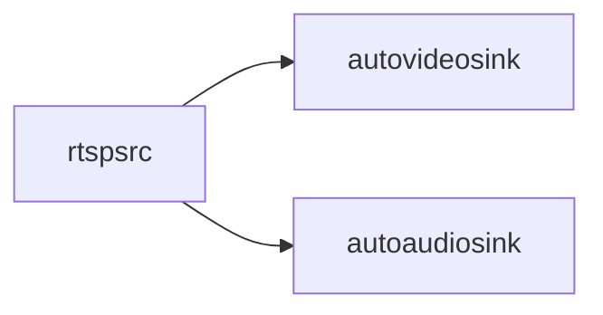

# GStreamer
[](https://github.com/lankahsu520/HelperX)
[![GitHub license][license-image]][license-url]
[![GitHub stars][stars-image]][stars-url]
[![GitHub forks][forks-image]][forks-url]
[![GitHub issues][issues-image]][issues-image]
[![GitHub watchers][watchers-image]][watchers-image]

[license-image]: https://img.shields.io/github/license/lankahsu520/HelperX.svg
[license-url]: https://github.com/lankahsu520/HelperX/blob/master/LICENSE
[stars-image]: https://img.shields.io/github/stars/lankahsu520/HelperX.svg
[stars-url]: https://github.com/lankahsu520/HelperX/stargazers
[forks-image]: https://img.shields.io/github/forks/lankahsu520/HelperX.svg
[forks-url]: https://github.com/lankahsu520/HelperX/network
[issues-image]: https://img.shields.io/github/issues/lankahsu520/HelperX.svg
[issues-url]: https://github.com/lankahsu520/HelperX/issues
[watchers-image]: https://img.shields.io/github/watchers/lankahsu520/HelperX.svg
[watchers-url]: https://github.com/lankahsu520/HelperX/watchers

# 1. rtspsrc 

## 1.1. rtspsrc -> autovideosink

#### A. Video only


```bash
gst-launch-1.0 rtspsrc \
	location=rtsp://192.168.50.21:554 user-id=admin user-pw=admin protocols=4 \
	! rtph264depay \
	! h264parse \
	! avdec_h264 ! autovideosink
```
```bash
gst-launch-1.0 rtspsrc \
	location=rtsp://192.168.50.21:554 user-id=admin user-pw=admin protocols=4 \
	! rtph264depay \
	! h264parse \
	! decodebin \
	! videoconvert ! autovideosink
```
```bash
gst-launch-1.0  rtspsrc \
	location=rtsp://192.168.50.21:554 user-id=admin user-pw=admin protocols=4 \
	! rtph264depay \
	! decodebin \
	! videoconvert ! autovideosink
```
#### B. Video and Audio

```bash
gst-launch-1.0 rtspsrc \
	location="rtsp://wowzaec2demo.streamlock.net/vod/mp4:BigBuckBunny_115k.mp4" protocols=tcp name=src \
	src. ! queue ! decodebin ! videoconvert ! autovideosink \
	src. ! queue ! decodebin ! audioconvert ! audioresample ! autoaudiosink
```
## 1.2. rtspsrc -> udpsink (Multicast) ⇢ udpsrc -> autovideosink

#### A. rtspsrc -> udpsink (Multicast) 
```bash
gst-launch-1.0 rtspsrc \
	location=rtsp://192.168.50.21:554 user-id=admin user-pw=admin protocols=4 \
	! udpsink host=224.0.0.1 port=50000 auto-multicast=true
```
#### B. udpsrc -> autovideosink
```bash
gst-launch-1.0 -v udpsrc \
	multicast-group=224.0.0.1 port=50000 auto-multicast=true \
	caps='application/x-rtp, media=(string)video, clock-rate=(int)90000, encoding-name=(string)H264, payload=(int)96' \
	! rtph264depay \
	! decodebin ! videoconvert ! autovideosink
```
## 1.3. rtspsrc -> udpsink  ⇢ udpsrc -> autovideosink

#### A. rtspsrc -> udpsink
```bash
gst-launch-1.0 rtspsrc \
	location=rtsp://192.168.50.21:554 user-id=admin user-pw=admin protocols=4 \
	! udpsink host=127.0.0.1 port=50000 sync=false -v
```
#### B. rtspsrc -> udpsink (x264enc/rtph264pay)

```bash
export VIDEO_PORT="50000"

gst-launch-1.0 -v rtspsrc \
	location=rtsp://192.168.50.21:554 user-id=admin user-pw=admin protocols=4 name=src \
	src. \
	! decodebin ! autovideoconvert ! x264enc tune=zerolatency ! rtph264pay \
	! udpsink host=127.0.0.1 port=$VIDEO_PORT
```

#### C. udpsrc -> autovideosink

```bash
export VIDEO_PORT="50000"

gst-launch-1.0 -v udpsrc \
	port=$VIDEO_PORT \
	caps='application/x-rtp, media=(string)video, clock-rate=(int)90000, encoding-name=(string)H264, payload=(int)96' \
	! rtph264depay \
	! decodebin \
	! videoconvert ! autovideosink
```

## 1.4. rtspsrc -> kvssink


```bash
gst-launch-1.0  rtspsrc location=rtsp://192.168.50.21:554 user-id=admin user-pw=admin protocols=4 \
	! rtph264depay \
	! h264parse \
	! kvssink stream-name="HelloLanka" storage-size=512 \
	access-key="AKI12345678901234567" \
	secret-key="1234567890123456789012345678901234567890" \
	aws-region="ap-northeast-1"

```

# 2. appsrc

## 2.1. appsrc (i420) -> udpsink (Multicast) ⇢ udpsrc -> autovideosink


#### A. appsrc (i420) -> udpsink (Multicast, x264enc/rtph264pay) 
```bash
appsrc name=source is-live=TRUE do-timestamp=TRUE block=TRUE max-bytes=-1 emit-signals=TRUE \
	! videoparse width=720 height=480 format=i420 framerate=20/1 \
	! x264enc byte-stream=TRUE rc-lookahead=0 tune=zerolatency speed-preset=ultrafast sync-lookahead=0 bitrate=500 \
	! rtph264pay \
	! udpsink host=224.0.0.1 port=50000 auto-multicast=true
```
#### B. udpsrc -> autovideosink
```bash
gst-launch-1.0 -v udpsrc \
	multicast-group=224.0.0.1 port=50000 auto-multicast=true \
	caps='application/x-rtp, media=(string)video, clock-rate=(int)90000, encoding-name=(string)H264, payload=(int)96' \
	! rtph264depay \
	! decodebin ! videoconvert ! autovideosink
```
```
v=0
m=video 50000 RTP/AVP 96
c=IN IP4 224.0.0.1
a=rtpmap:96 H264/90000
```

# 3. videotestsrc 

## 3.1. videotestsrc -> autovideosink/ximagesink


```bash
gst-launch-1.0 videotestsrc ! autovideosink
gst-launch-1.0 videotestsrc ! ximagesink
```

# 4. v4l2src

## 4.1. v4l2src -> autovideosink/ximagesink


#### A. v4l2src (not set)
```bash
gst-launch-1.0 v4l2src device=/dev/video0 \
	! videoconvert \
	! ximagesink

gst-launch-1.0 v4l2src device=/dev/video0 \
	! videoconvert \
	! autovideosink
```
#### B. v4l2src (video/x-raw, not set)
```bash
gst-launch-1.0 v4l2src device=/dev/video0 \
	! video/x-raw,width=640,height=480,framerate=30/1 \
	! videoconvert \
	! ximagesink

gst-launch-1.0 v4l2src device=/dev/video0 \
	! video/x-raw,width=640,height=480,framerate=30/1 \
	! videoconvert \
	! autovideosink 
```
#### C. v4l2src (video/x-raw, YUYV 4:2:2)
```bash
gst-launch-1.0 v4l2src device=/dev/video0 \
	! video/x-raw,width=640,height=480,framerate=30/1,format=YUY2 \
	! videoconvert \
	! autovideosink
```
#### D. v4l2src (image/jpeg, MJPG) 
```bash
gst-launch-1.0 -v v4l2src device=/dev/video0 \
	! image/jpeg, width=640, height=480, framerate=30/1, format=MJPG \
	! jpegdec \
	! videoconvert \
	! autovideosink
```

## 4.1. v4l2src -> udpsink


```bash
gst-launch-1.0 v4l2src device=/dev/video0 \
	! video/x-raw,width=640,height=480,framerate=30/1 \
	! videoconvert \
  ! x264enc \
  ! rtph264pay \
  ! udpsink host=127.0.0.1 port=5600
```

# 5. filesrc

## 5.1. filesrc (mp3) -> alsasink/pulsesink/autoaudiosink


```bash
gst-launch-1.0 filesrc \
	location="./0001.mp3" \
	! decodebin \
	! audioconvert \
	! alsasink

gst-launch-1.0 filesrc \
	location="./0001.mp3" \
	! decodebin \
	! audioconvert \
	! pulsesink

gst-launch-1.0 filesrc \
	location="./BeethovenFurElise.mp3" \
	! decodebin \
	! audioconvert \
	! alsasink
```
## 5.2. filesrc (mp3) -> udpsink  ⇢ udpsrc -> alsasink

- [rtpL16pay](https://gstreamer.freedesktop.org/documentation/rtp/rtpL16pay.html?gi-language=c)
#### A. filesrc (mp3, rtpL16pay) -> udpsink
```bash
export UDP_SINK="udpsink host=127.0.0.1 port=51000"
export UDP_SINK="udpsink host=192.168.56.1 port=51000"
export UDP_SINK="udpsink host=224.0.0.1 port=51000 auto-multicast=true"

gst-launch-1.0 filesrc \
	location=./0001.mp3 \
	! decodebin \
	! audioconvert \
	! rtpL16pay \
	! $UDP_SINK
```
#### B. udpsrc -> alsasink
```bash
export UDP_SRC="multicast-group=224.0.0.1 port=51000 auto-multicast=true"
export UDP_SRC="port=51000"

gst-launch-1.0 -v udpsrc \
	$UDP_SRC \
	caps='application/x-rtp, media=(string)audio, clock-rate=(int)44100, encoding-name=(string)L16, payload=(int)10' \
	! rtpL16depay  \
	! audioconvert \
	! pulsesink
```
```bash
gst-launch-1.0 -v udpsrc \
	$UDP_SRC \
	caps='application/x-rtp, media=(string)audio, clock-rate=(int)44100, encoding-name=(string)L16, payload=(int)10' \
	! rtpL16depay  \
	! audioconvert \
	! autoaudiosink
```
## 5.3. filesrc (wav) -> ???sink
### 5.3.1. filesrc (wav) -> autoaudiosink

```bash
gst-launch-1.0 filesrc \
	location=./0001.wav \
	! wavparse \
	! audioconvert \
	! alsasink

gst-launch-1.0 filesrc \
	location=./0001.wav \
	! wavparse \
	! audioconvert \
	! autoaudiosink

gst-launch-1.0 filesrc \
	location=./0001.wav \
	! wavparse \
	! audioconvert \
	! pulsesink
```
### 5.3.2. filesrc (wav) -> filesink

#### A. filesrc (wav) -> filesink (pcm, S16BE)
```bash
gst-launch-1.0 filesrc \
	location="./0001.wav" \
	! wavparse \
	! audioconvert \
	! audioresample \
	! audio/x-raw,format=S16BE,channels=2,rate=44100 \
	! filesink location="0001be.pcm"
```
#### B. filesrc (wav) -> filesink (pcm, S16LE)
```bash
gst-launch-1.0 filesrc \
	location="./0001.wav" \
	! wavparse \
	! audioconvert \
	! audioresample \
	! audio/x-raw,format=S16LE,channels=2,rate=44100 \
	! filesink location="0001le.pcm"
```
#### C. filesrc (mp3) -> filesink (pcm, S16LE)

```bash
gst-launch-1.0 filesrc \
	location="./BeethovenFurElise.mp3" \
	! decodebin \
	! audioconvert \
	! audioresample \
	! audio/x-raw,format=S16LE,channels=2,rate=44100 \
	! filesink location="BeethovenFurElise.pcm"

gst-launch-1.0 filesrc \
	location="./BeethovenFurElise.mp3" \
	! decodebin \
	! audioconvert \
	! autoaudiosink

gst-launch-1.0 filesrc \
	location="./BeethovenFurElise.pcm" \
	! rawaudioparse format=pcm pcm-format=s16le sample-rate=44100 num-channels=2 \
	! audioconvert \
	! autoaudiosink
```

#### D. filesrc (wav) -> filesink (ogg, opusenc)

```bash
gst-launch-1.0 filesrc \
	location="./0001.wav" \
	! wavparse \
	! audioconvert \
	! audioresample \
	! opusenc \
	! oggmux \
	! filesink location="0001opus.ogg"
```
#### E. filesrc (wav) -> filesink (ogg ,vorbisenc)
```bash
gst-launch-1.0 filesrc \
	location="./0001.wav" \
	! wavparse \
	! audioconvert \
	! audioresample \
	! vorbisenc \
	! oggmux \
	! filesink location="0001vorbis.ogg"
```
## 5.4. filesrc (pcm) -> ???sink
### 5.4.1. filesrc (pcm) -> autoaudiosink

```bash
gst-launch-1.0 filesrc \
	location=./0001be.pcm \
	! audio/x-raw,format=S16BE,channels=2,rate=44100,layout=interleaved \
	! audioconvert \
	! audioresample \
	! autoaudiosink

gst-launch-1.0 filesrc \
	location=./0001le.pcm \
	! audio/x-raw,format=S16LE,channels=2,rate=44100,layout=interleaved \
	! audioconvert \
	! audioresample \
	! autoaudiosink
```

### 5.4.2. filesrc (pcm) -> filesink

- [rawaudioparse](https://gstreamer.freedesktop.org/documentation/rawparse/rawaudioparse.html?gi-language=c)
#### A. filesrc (pcm, rawaudioparse) -> filesink (wav)
```bash
gst-launch-1.0 filesrc \
	location=./0001be.pcm \
	! rawaudioparse use-sink-caps=false format=pcm pcm-format=s16be sample-rate=44100 num-channels=2 \
	! audioconvert \
	! wavenc \
	! filesink location=0001be.wav

gst-launch-1.0 filesrc \
	location="./BeethovenFurElise.pcm" \
	! rawaudioparse use-sink-caps=false format=pcm pcm-format=s16le sample-rate=44100 num-channels=2 \
	! audioconvert \
	! wavenc \
	! filesink location=BeethovenFurElise.wav

```
#### B. filesrc (pcm, rawaudioparse) -> filesink (ogg, opusenc)
```bash
gst-launch-1.0 filesrc \
	location=./0001be.pcm \
	! rawaudioparse use-sink-caps=false format=pcm pcm-format=s16be sample-rate=44100 num-channels=2 \
	! audioconvert \
	! audioresample \
	! opusenc \
	! oggmux \
	! filesink location="0001be2opus.ogg"
```
#### C. filesrc (pcm, audio/x-raw) -> filesink (wav, wavenc)
```bash
gst-launch-1.0 filesrc \
	location=./0001le.pcm \
	! audio/x-raw,format=S16LE,channels=2,rate=44100,layout=interleaved \
	! audioconvert \
	! wavenc \
	! filesink location=0001le-fail.wav
```
# 6. udpsrc

## 6.1. filesrc (audio) -> udpsink  ⇢ udpsrc -> ???sink


- [rtpopuspay](https://gstreamer.freedesktop.org/documentation/rtp/rtpopuspay.html?gi-language=c)
### 6.1.1. filesrc (audio) -> udpsink
```
export UDP_SINK="udpsink host=127.0.0.1 port=51000"
export UDP_SINK="udpsink host=192.168.56.1 port=51000"
export UDP_SINK="udpsink host=192.168.50.9 port=52000"
export UDP_SINK="udpsink host=192.168.50.51 port=52000"
export UDP_SINK="udpsink host=224.0.0.1 port=51000 auto-multicast=true"
```
#### A. filesrc (wav) -> udpsink (opus)
```bash
gst-launch-1.0 filesrc \
	location=/work/wav/0001.wav \
	! wavparse \
	! audioconvert \
	! audioresample \
	! opusenc ! rtpopuspay \
	! $UDP_SINK
```
#### B. filesrc (pcm) -> udpsink (opus)
```bash
gst-launch-1.0 filesrc \
	location=./0001be.pcm \
	! rawaudioparse use-sink-caps=false format=pcm pcm-format=s16be sample-rate=44100 num-channels=2 \
	! audioconvert \
	! audioresample \
	! opusenc ! rtpopuspay \
	! $UDP_SINK
```
#### C. filesrc (mp3) -> udpsink (opus)

```/bash
gst-launch-1.0 filesrc \
	location="/work/BeethovenFurElise.mp3" \
	! decodebin \
	! audioconvert \
	! audioresample \
	! opusenc ! rtpopuspay \
	! $UDP_SINK
```

## 6.2. udpsrc (audio) -> ???sink

#### A. udpsrc (opus) -> autoaudiosink (pcm, S16LE)
```bash
export UDP_SRC="multicast-group=224.0.0.1 port=51000 auto-multicast=true"
export UDP_SRC="port=51000"

gst-launch-1.0 udpsrc \
	$UDP_SRC \
	! application/x-rtp,payload=96,encoding-name=OPUS \
	! rtpopusdepay  \
	! opusdec \
	! autoaudiosink

gst-launch-1.0 udpsrc \
	port=51000 \
	caps='application/x-rtp, media=(string)audio, payload=(int)0, clock-rate=(int)8000' \
	! rtppcmudepay \
	! autoaudiosink

gst-launch-1.0 udpsrc \
	$UDP_SRC \
	! application/x-rtp,payload=96,encoding-name=OPUS \
	! rtpopusdepay  \
	! opusdec \
	! queue \
	! audioconvert \
	! audioresample \
	! audio/x-raw,format=S16LE,channels=2,rate=44100 \
	! autoaudiosink
```
#### B. udpsrc (opus) -> filesink (pcm, S16LE)
```bash
gst-launch-1.0 udpsrc \
	$UDP_SRC \
	! application/x-rtp,payload=96,encoding-name=OPUS \
	! rtpopusdepay  \
	! opusdec \
	! audioconvert \
	! audioresample \
	! audio/x-raw,format=S16LE,channels=2,rate=44100 \
	! filesink location="0001le.pcm"
```
## 6.3. Video/Audio -> udpsink ⇢ udpsrc -> autoaudiosink

#### A. udpsrc -> autoaudiosink
```bash
gst-launch-1.0 -v udpsrc port=50000 \
	caps='application/x-rtp, media=(string)video, clock-rate=(int)90000, encoding-name=(string)H264, payload=(int)96' \
	! rtph264depay \
	! decodebin ! videoconvert ! autovideosink \
	udpsrc port=51000 \
	! application/x-rtp,payload=96,encoding-name=OPUS \
	! rtpopusdepay  \
	! opusdec \
	! autoaudiosink
```
# 7. playbin

#### A. http
```bash
gst-launch-1.0 -v playbin \
	uri=http://relay.slayradio.org:8000/
```
#### B. file
```bash
gst-launch-1.0 -v playbin \
	uri=file:///work/wav/0001.wav
```

# 8. rtmpsrc with youtube-dl

#### A. youtube-dl

```bash
#https://github.com/ytdl-org/youtube-dl
$ sudo curl -L https://yt-dl.org/downloads/latest/youtube-dl -o /usr/local/bin/youtube-dl
$ sudo chmod a+rx /usr/local/bin/youtube-dl

$ youtube-dl --list-formats https://www.youtube.com/watch?v=rSgzrSyQZc0
$ youtube-dl --format "best[ext=mp4][protocol=https]" --get-url https://www.youtube.com/watch?v=rSgzrSyQZc0
```

#### B. souphttpsrc -> autovideosink

```bash
gst-launch-1.0 souphttpsrc is-live=true \
	location="$(youtube-dl --format 134 --get-url https://www.youtube.com/watch?v=rSgzrSyQZc0)" \
	! decodebin ! videoconvert ! autovideosink
```

# 9. alsasrc
## 9.1. alsasrc -> filesink

```bash
gst-launch-1.0 alsasrc \
	! queue \
	! audioconvert \
	! vorbisenc \
	! oggmux \
	! filesink location="0001vorbis.ogg"
```
# 10. rtspsink

> [gst-rtsp-server](https://github.com/GStreamer/gst-rtsp-server)
>
> RTSP server based on GStreamer. This module has been merged into the main GStreamer repo for further development.

```bash
$ git clone https://github.com/GStreamer/gst-rtsp-server.git
$ mkdir build_xxx
$ meson setup build_xxx
$ cd build_xxx
$ ninja
```

## 10.1. videotestsrc -> rtspsink


```bash
$ cd examples
$ ./test-launch "( videotestsrc ! x264enc ! rtph264pay name=pay0 pt=96 )"
```

```bash
$ gst-launch-1.0 rtspsrc \
	location=rtsp://192.168.50.28:8554/test \
	! decodebin \
	! videoconvert ! autovideosink
```

## 10.2. v4l2src -> rtspsink

```mermaid
flowchart LR
	v4l2src[v4l2src]
	rtspsink[rtspsink]

	v4l2src --> rtspsink
```

```bash
$ cd examples
$ ./test-launch "( v4l2src device=/dev/video0 ! video/x-raw,width=640,height=480,framerate=30/1 ! videoconvert ! x264enc ! rtph264pay name=pay0 pt=96 )"
```

# Appendix

# I. Study

# II. Debug

# III. Glossary

# IV. Tool Usage

## IV.1. gst-launch-1.0

```bash
$ gst-launch-1.0 --help
Usage:
  gst-launch-1.0 [OPTION…] PIPELINE-DESCRIPTION

Help Options:
  -h, --help                        Show help options
  --help-all                        Show all help options
  --help-gst                        Show GStreamer Options

Application Options:
  -t, --tags                        Output tags (also known as metadata)
  -c, --toc                         Output TOC (chapters and editions)
  -v, --verbose                     Output status information and property notifications
  -q, --quiet                       Do not print any progress information
  -m, --messages                    Output messages
  -X, --exclude=PROPERTY-NAME       Do not output status information for the specified property if verbose output is enabled (can be used multiple times)
  -f, --no-fault                    Do not install a fault handler
  -e, --eos-on-shutdown             Force EOS on sources before shutting the pipeline down
  --version                         Print version information and exit
```

# V. gstreamer1.0

## V.1. apt-get install

```bash
sudo apt-get --yes install gstreamer1.0
sudo apt-get --yes install gstreamer1.0-plugins-base
sudo apt-get --yes install gstreamer1.0-plugins-good
sudo apt-get --yes install gstreamer1.0-plugins-base-apps
sudo apt-get --yes install gstreamer1.0-plugins-bad 
sudo apt-get --yes install gstreamer1.0-plugins-ugly

sudo apt-get --yes install libgstreamer1.0-dev
sudo apt-get --yes install libgstreamer-plugins-base1.0-dev
sudo apt-get --yes install libgstreamer-plugins-good1.0-dev
sudo apt-get --yes install libgstreamer-plugins-bad1.0-dev
```
## V.2. Environment

```bash
export GST_PLUGIN_PATH=`pwd`
export LD_LIBRARY_PATH=`pwd`
```
- [Amazon Kinesis Video Streams CPP Producer, GStreamer Plugin and JNI](https://github.com/awslabs/amazon-kinesis-video-streams-producer-sdk-cpp)
- [GstApp.AppSrc](https://lazka.github.io/pgi-docs/GstApp-1.0/classes/AppSrc.html)
- [IPv4 Multicast Address Space Registry](https://www.iana.org/assignments/multicast-addresses/multicast-addresses.xhtml)

# VI. Audio Input

## VI.1. sound-recorder

```
sudo apt install gnome-sound-recorder
```

# Author

> Created and designed by [Lanka Hsu](lankahsu@gmail.com).

# License

> [HelperX](https://github.com/lankahsu520/HelperX) is available under the BSD-3-Clause license. See the LICENSE file for more info.

