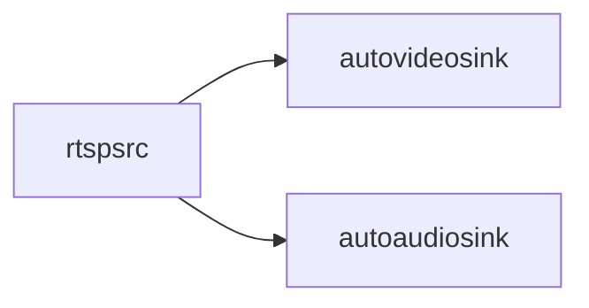

# GStreamer
[](https://github.com/lankahsu520/HelperX)
[![GitHub license][license-image]][license-url]
[![GitHub stars][stars-image]][stars-url]
[![GitHub forks][forks-image]][forks-url]
[![GitHub issues][issues-image]][issues-image]
[![GitHub watchers][watchers-image]][watchers-image]

[license-image]: https://img.shields.io/github/license/lankahsu520/HelperX.svg
[license-url]: https://github.com/lankahsu520/HelperX/blob/master/LICENSE
[stars-image]: https://img.shields.io/github/stars/lankahsu520/HelperX.svg
[stars-url]: https://github.com/lankahsu520/HelperX/stargazers
[forks-image]: https://img.shields.io/github/forks/lankahsu520/HelperX.svg
[forks-url]: https://github.com/lankahsu520/HelperX/network
[issues-image]: https://img.shields.io/github/issues/lankahsu520/HelperX.svg
[issues-url]: https://github.com/lankahsu520/HelperX/issues
[watchers-image]: https://img.shields.io/github/watchers/lankahsu520/HelperX.svg
[watchers-url]: https://github.com/lankahsu520/HelperX/watchers

# 1. rtspsrc 

## 1.1. rtspsrc -> autovideosink


```bash
gst-launch-1.0 rtspsrc \
	location=rtsp://192.168.50.21:554 user-id=admin user-pw=admin protocols=4 \
	! rtph264depay \
	! h264parse \
	! avdec_h264 ! autovideosink
```
```bash
gst-launch-1.0 rtspsrc \
	location=rtsp://192.168.50.21:554 user-id=admin user-pw=admin protocols=4 \
	! rtph264depay \
	! h264parse \
	! decodebin \
	! videoconvert ! autovideosink
```
```bash
gst-launch-1.0  rtspsrc \
	location=rtsp://192.168.50.21:554 user-id=admin user-pw=admin protocols=4 \
	! rtph264depay \
	! decodebin \
	! videoconvert ! autovideosink
```
## 1.2. rtspsrc -> autovideosink and autoaudiosink


```bash
gst-launch-1.0 rtspsrc \
	location="rtsp://wowzaec2demo.streamlock.net/vod/mp4:BigBuckBunny_115k.mp4" protocols=tcp name=src \
	src. ! queue ! decodebin ! videoconvert ! autovideosink \
	src. ! queue ! decodebin ! audioconvert ! audioresample ! autoaudiosink
```
## 1.3. rtspsrc -> udpsink (Multicast) ⇢ udpsrc -> autovideosink

#### A. rtspsrc -> udpsink (Multicast) 
```bash
gst-launch-1.0 rtspsrc \
	location=rtsp://192.168.50.21:554 user-id=admin user-pw=admin protocols=4 \
	! udpsink host=224.0.0.1 port=50000 auto-multicast=true
```
#### B. udpsrc -> autovideosink
```bash
gst-launch-1.0 -v udpsrc \
	multicast-group=224.0.0.1 port=50000 auto-multicast=true \
	caps='application/x-rtp, media=(string)video, clock-rate=(int)90000, encoding-name=(string)H264, payload=(int)96' \
	! rtph264depay \
	! decodebin ! videoconvert ! autovideosink
```
## 1.4. rtspsrc -> udpsink  ⇢ udpsrc -> autovideosink

#### A. rtspsrc -> udpsink
```bash
gst-launch-1.0 rtspsrc \
	location=rtsp://192.168.50.21:554 user-id=admin user-pw=admin protocols=4 \
	! udpsink host=127.0.0.1 port=50000 sync=false -v
```
#### B. rtspsrc -> udpsink (x264enc/rtph264pay)

```bash
export VIDEO_PORT="50000"

gst-launch-1.0 -v rtspsrc \
	location=rtsp://192.168.50.21:554 user-id=admin user-pw=admin protocols=4 name=src \
	src. \
	! decodebin ! autovideoconvert ! x264enc tune=zerolatency ! rtph264pay \
	! udpsink host=127.0.0.1 port=$VIDEO_PORT
```

#### C. udpsrc -> autovideosink

```bash
export VIDEO_PORT="50000"

gst-launch-1.0 -v udpsrc \
	port=$VIDEO_PORT \
	caps='application/x-rtp, media=(string)video, clock-rate=(int)90000, encoding-name=(string)H264, payload=(int)96' \
	! rtph264depay \
	! decodebin \
	! videoconvert ! autovideosink
```

## 1.5. rtspsrc -> kvssink


```bash
gst-launch-1.0  rtspsrc location=rtsp://192.168.50.21:554 user-id=admin user-pw=admin protocols=4 \
	! rtph264depay \
	! h264parse \
	! kvssink stream-name="HelloLanka" storage-size=512 \
	access-key="AKI12345678901234567" \
	secret-key="1234567890123456789012345678901234567890" \
	aws-region="ap-northeast-1"

```

# 2. appsrc

## 2.1. appsrc (i420) -> udpsink (Multicast) ⇢ udpsrc -> autovideosink


#### A. appsrc (i420) -> udpsink (Multicast, x264enc/rtph264pay) 
```bash
appsrc name=source is-live=TRUE do-timestamp=TRUE block=TRUE max-bytes=-1 emit-signals=TRUE \
	! videoparse width=720 height=480 format=i420 framerate=20/1 \
	! x264enc byte-stream=TRUE rc-lookahead=0 tune=zerolatency speed-preset=ultrafast sync-lookahead=0 bitrate=500 \
	! rtph264pay \
	! udpsink host=224.0.0.1 port=50000 auto-multicast=true
```
#### B. udpsrc -> autovideosink
```bash
gst-launch-1.0 -v udpsrc \
	multicast-group=224.0.0.1 port=50000 auto-multicast=true \
	caps='application/x-rtp, media=(string)video, clock-rate=(int)90000, encoding-name=(string)H264, payload=(int)96' \
	! rtph264depay \
	! decodebin \
	! videoconvert \
	! autovideosink
```
```
v=0
m=video 50000 RTP/AVP 96
c=IN IP4 224.0.0.1
a=rtpmap:96 H264/90000
```

# 3. videotestsrc 

## 3.1. videotestsrc -> autovideosink/ximagesink


```bash
gst-launch-1.0 videotestsrc ! autovideosink
gst-launch-1.0 videotestsrc ! ximagesink
```

# 4. v4l2src

## 4.1. v4l2src -> autovideosink/ximagesink


#### A. v4l2src (not set)
```bash
gst-launch-1.0 v4l2src device=/dev/video0 \
	! videoconvert \
	! ximagesink

gst-launch-1.0 v4l2src device=/dev/video0 \
	! videoconvert \
	! clockoverlay time-format="%D %H:%M:%S" \
	! autovideosink
```
#### B. v4l2src (video/x-raw, not set)
```bash
gst-launch-1.0 v4l2src device=/dev/video0 \
	! videoconvert \
	! video/x-raw,width=640,height=480,framerate=30/1 \
	! ximagesink

gst-launch-1.0 v4l2src device=/dev/video0 \
	! videoconvert \
	! video/x-raw,width=640,height=480,framerate=30/1 \
	! autovideosink 
```
#### C. v4l2src (video/x-raw, YUYV 4:2:2)
```bash
gst-launch-1.0 v4l2src device=/dev/video0 \
	! videoconvert \
	! video/x-raw,width=640,height=480,framerate=30/1,format=YUY2 \
	! autovideosink
```
#### D. v4l2src (image/jpeg, MJPG) 
```bash
gst-launch-1.0 -v v4l2src device=/dev/video0 \
	! image/jpeg, width=640, height=480, framerate=30/1, format=MJPG \
	! jpegdec \
	! videoconvert \
	! autovideosink
```

## 4.1. v4l2src -> udpsink


```bash
gst-launch-1.0 v4l2src device=/dev/video0 \
	! videoconvert \
	! video/x-raw,width=640,height=480,framerate=30/1 \
	! clockoverlay time-format="%D %H:%M:%S" \
  ! x264enc \
  ! rtph264pay \
  ! udpsink host=127.0.0.1 port=50000
```

# 5. filesrc

## 5.1. filesrc -> alsasink/pulsesink/autoaudiosink


```bash
export MUSIC_FILE="/work/BeethovenFurElise.mp3"
export MUSIC_FILE="/work/BeethovenFurElise.wav"

gst-launch-1.0 filesrc \
	location=$MUSIC_FILE \
	! decodebin \
	! audioconvert \
	! alsasink

gst-launch-1.0 filesrc \
	location=$MUSIC_FILE \
	! decodebin \
	! audioconvert \
	! pulsesink

gst-launch-1.0 filesrc \
	location=$MUSIC_FILE \
	! decodebin \
	! audioconvert \
	! autoaudiosink
```
## 5.2. filesrc -> udpsink  ⇢ |rtpL16pay|udpsrc -> alsasink

> [rtpL16pay](https://gstreamer.freedesktop.org/documentation/rtp/rtpL16pay.html?gi-language=c)

#### A. filesrc (rtpL16pay) -> udpsink
```bash
export UDP_SINK="udpsink host=127.0.0.1 port=51000"
export UDP_SINK="udpsink host=192.168.56.1 port=51000"
export UDP_SINK="udpsink host=224.0.0.1 port=51000 auto-multicast=true"

gst-launch-1.0 filesrc \
	location=$MUSIC_FILE \
	! decodebin \
	! audioconvert \
	! rtpL16pay \
	! $UDP_SINK
```
#### B. udpsrc -> |rtpL16depay| alsasink
```bash
export UDP_SRC="multicast-group=224.0.0.1 port=51000 auto-multicast=true"
export UDP_SRC="port=51000"

gst-launch-1.0 -v udpsrc \
	$UDP_SRC \
	caps='application/x-rtp, media=(string)audio, clock-rate=(int)44100, encoding-name=(string)L16, payload=(int)10' \
	! rtpL16depay  \
	! audioconvert \
	! pulsesink
```
```bash
gst-launch-1.0 -v udpsrc \
	$UDP_SRC \
	caps='application/x-rtp, media=(string)audio, clock-rate=(int)44100, encoding-name=(string)L16, payload=(int)10' \
	! rtpL16depay  \
	! audioconvert \
	! autoaudiosink
```
## 5.3. filesrc -> filesink
> -e, put EOS


#### A. filesrc (wav) -> filesink (pcm, S16BE)
```bash
gst-launch-1.0 -e filesrc \
	location=$MUSIC_FILE \
	! wavparse \
	! audioconvert \
	! audioresample \
	! audio/x-raw,format=S16BE,channels=2,rate=44100 \
	! filesink location="/work/BeethovenFurElise-S16BE.pcm"
```
#### B. filesrc (wav) -> filesink (pcm, S16LE)
```bash
gst-launch-1.0 -e filesrc \
	location=$MUSIC_FILE \
	! wavparse \
	! audioconvert \
	! audioresample \
	! audio/x-raw,format=S16LE,channels=2,rate=44100 \
	! filesink location="/work/BeethovenFurElise-S16LE.pcm"
```
#### C. filesrc (mp3) -> filesink (pcm, S16LE)

```bash
gst-launch-1.0 -e filesrc \
	location=$MUSIC_FILE \
	! decodebin \
	! audioconvert \
	! audioresample \
	! audio/x-raw,format=S16LE,channels=2,rate=44100 \
	! filesink location="/work/BeethovenFurElise-S16LE.pcm"
```

#### D. filesrc (wav) -> filesink (ogg, opusenc)

```bash
gst-launch-1.0 -e filesrc \
	location=$MUSIC_FILE \
	! wavparse \
	! audioconvert \
	! audioresample \
	! opusenc \
	! oggmux \
	! filesink location="/work/BeethovenFurElise-opus.ogg"
```
#### E. filesrc (wav) -> filesink (ogg ,vorbisenc)
```bash
gst-launch-1.0 -e filesrc \
	location=$MUSIC_FILE \
	! wavparse \
	! audioconvert \
	! audioresample \
	! vorbisenc \
	! oggmux \
	! filesink location="/work/BeethovenFurElise-vorbis.ogg"
```
## 5.4. filesrc (pcm) -> ???sink
### 5.4.1. filesrc (pcm) -> autoaudiosink

```bash
gst-launch-1.0 filesrc \
	location="/work/BeethovenFurElise-S16BE.pcm" \
	! audio/x-raw,format=S16BE,channels=2,rate=44100,layout=interleaved \
	! audioconvert \
	! audioresample \
	! autoaudiosink

gst-launch-1.0 filesrc \
	location="/work/BeethovenFurElise-S16LE.pcm" \
	! audio/x-raw,format=S16LE,channels=2,rate=44100,layout=interleaved \
	! audioconvert \
	! audioresample \
	! autoaudiosink

gst-launch-1.0 filesrc \
	location="/work/BeethovenFurElise-S16LE.pcm" \
	! rawaudioparse format=pcm pcm-format=s16le sample-rate=44100 num-channels=2 \
	! audioconvert \
	! autoaudiosink
```

### 5.4.2. filesrc (pcm) -> filesink

> [rawaudioparse](https://gstreamer.freedesktop.org/documentation/rawparse/rawaudioparse.html?gi-language=c)

#### A. filesrc (pcm, rawaudioparse) -> filesink (wav)
```bash
gst-launch-1.0 -e filesrc \
	location="/work/BeethovenFurElise-S16BE.pcm" \
	! rawaudioparse use-sink-caps=false format=pcm pcm-format=s16be sample-rate=44100 num-channels=2 \
	! audioconvert \
	! wavenc \
	! filesink location="/work/BeethovenFurElise.wav"

gst-launch-1.0 -e filesrc \
	location="/work/BeethovenFurElise-S16LE.pcm" \
	! rawaudioparse use-sink-caps=false format=pcm pcm-format=s16le sample-rate=44100 num-channels=2 \
	! audioconvert \
	! wavenc \
	! filesink location="/work/BeethovenFurElise.wav"

```
#### B. filesrc (pcm, rawaudioparse) -> filesink (ogg, opusenc)
```bash
gst-launch-1.0 -e filesrc \
	location="/work/BeethovenFurElise-S16BE.pcm" \
	! rawaudioparse use-sink-caps=false format=pcm pcm-format=s16be sample-rate=44100 num-channels=2 \
	! audioconvert \
	! audioresample \
	! opusenc \
	! oggmux \
	! filesink location="/work/BeethovenFurElise-opus.ogg"
```
#### C. filesrc (pcm, audio/x-raw) -> filesink (wav, wavenc)
```bash
gst-launch-1.0 -e filesrc \
	location="/work/BeethovenFurElise-S16LE.pcm" \
	! audio/x-raw,format=S16LE,channels=2,rate=44100,layout=interleaved \
	! audioconvert \
	! wavenc \
	! filesink location="/work/BeethovenFurElise.wav"
```
# 6. multifilesrc

## 6.1. multifilesrc (mp3) -> alsasink/pulsesink/autoaudiosink


```bash
gst-launch-1.0 multifilesrc \
	location="/work/%04d.mp3" \
	! decodebin \
	! audioconvert \
	! alsasink

# loop
gst-launch-1.0 multifilesrc \
	location="/work/BeethovenFurElise.mp3" loop=true \
	! decodebin \
	! audioconvert \
	! alsasink

gst-launch-1.0 multifilesrc \
	location="/work/BeethovenFurElise.mp3" \
	! decodebin \
	! audioconvert \
	! opusenc \
	! alsasink
```

# 7. udpsrc

## 7.1. filesrc (audio) -> udpsink  ⇢ udpsrc -> ???sink


- [rtpopuspay](https://gstreamer.freedesktop.org/documentation/rtp/rtpopuspay.html?gi-language=c)
### 7.1.1. filesrc (audio) -> udpsink
```
export UDP_SINK="udpsink host=127.0.0.1 port=51000"
export UDP_SINK="udpsink host=192.168.56.1 port=51000"
export UDP_SINK="udpsink host=192.168.50.9 port=52000"
export UDP_SINK="udpsink host=192.168.50.51 port=52000"
export UDP_SINK="udpsink host=224.0.0.1 port=51000 auto-multicast=true"
```
#### A. filesrc (wav) -> udpsink (opus)
```bash
gst-launch-1.0 filesrc \
	location=/work/wav/0001.wav \
	! wavparse \
	! audioconvert \
	! audioresample \
	! opusenc ! rtpopuspay \
	! $UDP_SINK
```
#### B. filesrc (pcm) -> udpsink (opus)
```bash
gst-launch-1.0 filesrc \
	location=./0001be.pcm \
	! rawaudioparse use-sink-caps=false format=pcm pcm-format=s16be sample-rate=44100 num-channels=2 \
	! audioconvert \
	! audioresample \
	! opusenc ! rtpopuspay \
	! $UDP_SINK
```
#### C. filesrc (mp3) -> udpsink (opus)

```/bash
gst-launch-1.0 filesrc \
	location="/work/BeethovenFurElise.mp3" \
	! decodebin \
	! audioconvert \
	! audioresample \
	! opusenc ! rtpopuspay \
	! $UDP_SINK
```

## 7.2. udpsrc (audio) -> ???sink

#### A. udpsrc (opus) -> autoaudiosink (pcm, S16LE)
```bash
export UDP_SRC="multicast-group=224.0.0.1 port=51000 auto-multicast=true"
export UDP_SRC="port=51000"

gst-launch-1.0 udpsrc \
	$UDP_SRC \
	! application/x-rtp,payload=96,encoding-name=OPUS \
	! rtpopusdepay  \
	! opusdec \
	! autoaudiosink

gst-launch-1.0 udpsrc \
	port=51000 \
	caps='application/x-rtp, media=(string)audio, payload=(int)0, clock-rate=(int)8000' \
	! rtppcmudepay \
	! autoaudiosink

gst-launch-1.0 udpsrc \
	$UDP_SRC \
	! application/x-rtp,payload=96,encoding-name=OPUS \
	! rtpopusdepay  \
	! opusdec \
	! queue \
	! audioconvert \
	! audioresample \
	! audio/x-raw,format=S16LE,channels=2,rate=44100 \
	! autoaudiosink
```
#### B. udpsrc (opus) -> filesink (pcm, S16LE)
```bash
gst-launch-1.0 -e udpsrc \
	$UDP_SRC \
	! application/x-rtp,payload=96,encoding-name=OPUS \
	! rtpopusdepay  \
	! opusdec \
	! audioconvert \
	! audioresample \
	! audio/x-raw,format=S16LE,channels=2,rate=44100 \
	! filesink location="0001le.pcm"
```
## 7.3. Video/Audio -> udpsink ⇢ udpsrc -> autoaudiosink

#### A. udpsrc -> autoaudiosink
```bash
gst-launch-1.0 -v udpsrc port=50000 \
	caps='application/x-rtp, media=(string)video, clock-rate=(int)90000, encoding-name=(string)H264, payload=(int)96' \
	! rtph264depay \
	! decodebin ! videoconvert ! autovideosink \
	udpsrc port=51000 \
	! application/x-rtp,payload=96,encoding-name=OPUS \
	! rtpopusdepay  \
	! opusdec \
	! autoaudiosink
```
# 8. playbin

#### A. http
```bash
gst-launch-1.0 -v playbin \
	uri=http://relay.slayradio.org:8000/
```
#### B. file
```bash
gst-launch-1.0 -v playbin \
	uri=file:///work/wav/0001.wav
```

# 9. rtmpsrc with youtube-dl

#### A. youtube-dl

```bash
#https://github.com/ytdl-org/youtube-dl
$ sudo curl -L https://yt-dl.org/downloads/latest/youtube-dl -o /usr/local/bin/youtube-dl
$ sudo chmod a+rx /usr/local/bin/youtube-dl

$ youtube-dl --list-formats https://www.youtube.com/watch?v=rSgzrSyQZc0
$ youtube-dl --format "best[ext=mp4][protocol=https]" --get-url https://www.youtube.com/watch?v=rSgzrSyQZc0
```

#### B. souphttpsrc -> autovideosink

```bash
gst-launch-1.0 souphttpsrc is-live=true \
	location="$(youtube-dl --format 134 --get-url https://www.youtube.com/watch?v=rSgzrSyQZc0)" \
	! decodebin ! videoconvert ! autovideosink
```

# 10. audiotestsrc

## 10.1. audiotestsrc -> autoaudiosink


```bash
$ gst-launch-1.0 audiotestsrc \
	! audioconvert \
	! autoaudiosink
```

# 11. alsasrc

## 11.1. alsasrc -> |vorbisenc,oggmux| filesink

```bash
gst-launch-1.0 -e alsasrc \
	! queue \
	! audioconvert \
	! vorbisenc \
	! oggmux \
	! filesink location="record-vorbis.ogg"
```
## 11.2. alsasrc -> autoaudiosink
```mermaid
flowchart LR
	alsasrc[alsasrc]
	autoaudiosink[autoaudiosink]

	alsasrc --> autoaudiosink
```
```bash
gst-launch-1.0 alsasrc \
	! queue \
	! audioconvert \
	! audioresample \
	! autoaudiosink
```

# 12. autoaudiosrc

## 12.1. autoaudiosrc -> autoaudiosink

```mermaid
flowchart LR
	autoaudiosrc[autoaudiosrc]
	autoaudiosink[autoaudiosink]

	autoaudiosrc --> autoaudiosink
```

```bash
$ gst-launch-1.0 autoaudiosrc \
	! audioconvert \
	! audioresample \
	! autoaudiosink
```

# 13. [libcamerasrc](https://libcamera.org/index.html)

> https://git.libcamera.org/libcamera/libcamera.git

```bash
$ git clone https://git.libcamera.org/libcamera/libcamera.git
$ cd libcamera
$ mkdir build_xxx
$ meson setup build_xxx
$ ninja -C build_xxx
$ ninja -C build_xxx install
```

## 13.1. libcamerasrc -> |x264enc,???| filesink

> 使用 x264 庫進行 H.264 軟件編碼。x264 是一種流行的開源 H.264 編碼器，提供了豐富的編碼參數和質量控制選項。

#### A. libcamerasrc -> |x264enc,h264| filesink

```mermaid
flowchart LR
	libcamerasrc[libcamerasrc]
	filesink[filesink]

	libcamerasrc --> |x264enc,h264| filesink
```

```bash
# libcamerasrc -> |x264enc,h264| filesink
# -e, put EOS 
$ gst-launch-1.0 -e libcamerasrc \
	! videoconvert \
	! video/x-raw,width=640,height=480,framerate=30/1 \
	! clockoverlay time-format=\"%D %H:%M:%S\" \
	! x264enc \
	! queue \
	! filesink location=libcamerasrc-x264.h264

# filesrc -> autovideosink
$ gst-launch-1.0 -v filesrc \
	location="./libcamerasrc-x264.h264" \
  ! decodebin \
  ! videoconvert \
  ! autovideosink
```

#### B. libcamerasrc -> |x264enc,mp4| filesink
```mermaid
flowchart LR
	libcamerasrc[libcamerasrc]
	filesink[filesink]

	libcamerasrc --> |x264enc,mp4| filesink
```


```bash
# libcamerasrc -> |x264enc,mp4| filesink
$ gst-launch-1.0 -e libcamerasrc \
	! videoconvert \
	! video/x-raw,width=640,height=480,framerate=30/1 \
	! x264enc \
	! mp4mux \
	! queue \
	! filesink location=libcamerasrc-x264.mp4

$ gst-launch-1.0 -v filesrc \
	location="./libcamerasrc-x264.mp4" \
  ! decodebin \
  ! videoconvert \
  ! autovideosink
```

## 13.2. libcamerasrc -> |v4l2h264enc,???| filesink

> 使用 V4L2 接口提供的硬件編碼器進行 H.264 編碼。這意味著它通常會直接利用設備上的硬件編碼器，比如一些支持 H.264 編碼的硬件視頻編碼器。

#### A. libcamerasrc -> |v4l2h264enc,h264| filesink

```mermaid
flowchart LR
	libcamerasrc[libcamerasrc]
	filesink[filesink]

	libcamerasrc --> |v4l2h264enc,h264| filesink
```

```bash
# libcamerasrc -> |v4l2h264enc,h264| filesink
$ gst-launch-1.0 -e libcamerasrc \
	! videoconvert \
	! video/x-raw,width=640,height=480,framerate=30/1 \
	! clockoverlay time-format=\"%D %H:%M:%S\" \
	! v4l2h264enc \
	! 'video/x-h264,level=(string)4' \
	! filesink location=libcamerasrc-v4l2.h264

$ gst-launch-1.0 -e libcamerasrc \
	! videoconvert \
	! video/x-raw,width=640,height=480,framerate=30/1,format=I420 \
	! clockoverlay time-format=\"%D %H:%M:%S\" \
	! v4l2h264enc \
	! 'video/x-h264,level=(string)4' \
	! filesink location=libcamerasrc-v4l2.h264

# filesrc -> autovideosink
$ gst-launch-1.0 -v filesrc \
	location="libcamerasrc-v4l2.h264" \
  ! decodebin \
  ! videoconvert \
  ! autovideosink
```

#### B. libcamerasrc -> |v4l2h264enc,mp4| filesink
```mermaid
flowchart LR
	libcamerasrc[libcamerasrc]
	filesink[filesink]

	libcamerasrc --> |v4l2h264enc,h264| filesink
```
```bash
# libcamerasrc -> |v4l2h264enc,mp4| filesink
$ gst-launch-1.0 -e libcamerasrc \
	! videoconvert \
	! video/x-raw,width=640,height=480,framerate=30/1,format=I420 \
	! clockoverlay time-format=\"%D %H:%M:%S\" \
	! v4l2h264enc \
	! 'video/x-h264,profile=high,level=(string)4' \
	! h264parse \
	! mp4mux \
	! queue \
	! filesink location=libcamerasrc-v4l2.mp4

# filesrc -> autovideosink
$ gst-launch-1.0 -v filesrc \
	location="libcamerasrc-v4l2.mp4" \
	! decodebin \
	! videoconvert \
	! autovideosink
```

# 14. To rtspsink

> [gst-rtsp-server](https://github.com/GStreamer/gst-rtsp-server)
>
> RTSP server based on GStreamer. This module has been merged into the main GStreamer repo for further development.

```bash
$ git clone https://github.com/GStreamer/gst-rtsp-server.git
$ cd gst-rtsp-server
$ mkdir build_xxx
$ meson setup build_xxx
$ ninja -C build_xxx
$ ninja -C build_xxx install
```

## 14.1. audiotestsrc and videotestsrc -> rtspsink
```mermaid
flowchart LR
	audiotestsrc[audiotestsrc]
	videotestsrc[videotestsrc]
	rtspsink[rtspsink]

	videotestsrc --> rtspsink
	audiotestsrc -->rtspsink
```

```bash
$ cd build_xxx/examples
$ ./test-video
stream ready at rtsp://127.0.0.1:8554/test
```

```bash
gst-launch-1.0 rtspsrc \
	location="rtsp://127.0.0.1:8554/test" name=src \
	src. ! queue ! decodebin ! videoconvert ! autovideosink \
	src. ! queue ! decodebin ! audioconvert ! audioresample ! autoaudiosink
```

## 14.2. videotestsrc -> rtspsink

> use test-launch

```mermaid
flowchart LR
	videotestsrc[videotestsrc]
	rtspsink[rtspsink]

	videotestsrc --> rtspsink
```

```bash
$ cd build_xxx/examples
$ ./test-launch "( \
	videotestsrc \
	! x264enc \
	! rtph264pay name=pay0 pt=96 \
	)"
```

```bash
$ gst-launch-1.0 rtspsrc \
	location=rtsp://192.168.50.28:8554/test \
	! decodebin \
	! videoconvert ! autovideosink
```

## 14.3. v4l2src/libcamerasrc -> |???| rtspsink

#### A. v4l2src/libcamerasrc -> |x264enc| rtspsink

```mermaid
flowchart LR
	v4l2src[v4l2src]
	rtspsink[rtspsink]

	v4l2src --> |x264enc|rtspsink
```

```bash
$ export CAMERA_DEVICE=/dev/video1
$ cd build_xxx/examples
$ ./test-launch --gst-debug=1 "( \
	v4l2src device=$CAMERA_DEVICE \
	! videoconvert \
	! video/x-raw,width=640,height=480,framerate=30/1,format=I420 \
	! clockoverlay time-format=\"%D %H:%M:%S\" \
	! x264enc \
	! rtph264pay name=pay0 pt=96 \
	)"

$ ./test-launch --gst-debug=1 "( \
	libcamerasrc \
	! videoconvert \
	! video/x-raw,width=640,height=480,framerate=30/1,format=I420 \
	! clockoverlay time-format=\"%D %H:%M:%S\" \
	! x264enc \
	! video/x-h264,stream-format=byte-stream,level=(string)4,profile=baseline \
	! queue \
	! rtph264pay name=pay0 pt=96 \
	)"
```

#### ~~B. v4l2src/libcamerasrc -> |v4l2h264enc| rtspsink~~

```bash
$ v4l2-ctl -L -d /dev/video11
```

```bash
$ gst-launch-1.0 -v udpsrc \
	port=50000 \
	caps='application/x-rtp, media=(string)video, clock-rate=(int)90000, encoding-name=(string)H264, payload=(int)96' \
	! rtph264depay \
	! decodebin \
	! videoconvert \
	! autovideosink

# 如果沒有 repeat_sequence_header=1。你就必須先啟動上面的接收指令 
$ gst-launch-1.0 -e libcamerasrc \
	! videoconvert \
	! video/x-raw,width=640,height=480,framerate=30/1,format=I420 \
	! clockoverlay time-format=\"%D %H:%M:%S\" \
	! v4l2h264enc extra-controls="controls,repeat_sequence_header=1" \
	! 'video/x-h264,stream-format=byte-stream,level=(string)4,profile=baseline' \
	! queue \
	! rtph264pay \
 	! udpsink host=127.0.0.1 port=50000
```

> always hang at 1st frame

```bash
$ ./test-launch --gst-debug=3 "( \
	libcamerasrc \
	! videoconvert \
	! video/x-raw,width=640,height=480,framerate=30/1,format=I420 \
	! clockoverlay time-format=\"%D %H:%M:%S\" \
	! v4l2h264enc extra-controls=\"controls,repeat_sequence_header=1\" \
	! video/x-h264,stream-format=byte-stream,level=(string)4,profile=baseline \
	! queue \
	! rtph264pay \ name=pay0 pt=96 \
	)"

$ ./test-launch --gst-debug=2 "( \
	libcamerasrc \
	! videoconvert \
	! video/x-raw,width=640,height=480,framerate=30/1,format=I420 \
	! clockoverlay time-format=\"%D %H:%M:%S\" \
	! v4l2h264enc output-io-mode=2 extra-controls=\"controls,force_key_frame=1,video_b_frames=1,h264_i_frame_period=1,repeat_sequence_header=1\" \
	! video/x-h264,stream-format=byte-stream,level=(string)4,profile=baseline \
  ! queue \
	! rtph264pay name=pay0 pt=96 \
	)"
```

## 14.4. alsasrc/autoaudiosrc and v4l2src -> rtspsink

```mermaid
flowchart LR
	alsasrc[alsasrc/autoaudiosrc]
	v4l2src[v4l2src]
	rtspsink[rtspsink]

	alsasrc --> rtspsink
	v4l2src --> rtspsink
```

```bash
$ export CAMERA_DEVICE=/dev/video1
$ cd build_xxx/examples
$ ./test-launch --gst-debug=1 "( \
	alsasrc \
	! queue \
	! audioconvert \
	! audioresample \
	! opusenc \
	! rtpopuspay name=pay1 pt=97 \
	v4l2src device=$CAMERA_DEVICE \
	! video/x-raw,width=640,height=480,framerate=30/1 \
	! queue \
	! videoconvert \
	! clockoverlay time-format=\"%D %H:%M:%S\" \
	! x264enc \
	! rtph264pay name=pay0 pt=96 \
	)"

$ ./test-launch --gst-debug=1 "( \
	autoaudiosrc \
	! queue \
	! audioconvert \
	! audioresample \
	! opusenc \
	! rtpopuspay name=pay1 pt=97 \
	v4l2src device=$CAMERA_DEVICE \
	! video/x-raw,width=640,height=480,framerate=30/1 \
	! queue \
	! videoconvert \
	! clockoverlay time-format=\"%D %H:%M:%S\" \
	! x264enc \
	! rtph264pay name=pay0 pt=96 \
	)"
```

## 14.4  filesrc/multifilesrc and v4l2src -> rtspsink
```mermaid
flowchart LR
	filesrc[filesrc/multifilesrc]
	v4l2src[v4l2src]
	rtspsink[rtspsink]

	filesrc --> rtspsink
	v4l2src --> rtspsink
	
```


```bash
$ export CAMERA_DEVICE=/dev/video1
$ cd build_xxx/examples
$ ./test-launch --gst-debug=1 "( \
	filesrc location="/work/BeethovenFurElise.mp3" \
	! queue \
	! decodebin \
	! audioconvert \
	! audioresample \
	! opusenc \
	! rtpopuspay name=pay1 pt=97 \
	v4l2src device=$CAMERA_DEVICE \
	! video/x-raw,width=640,height=480,framerate=30/1 \
	! queue \
	! videoconvert \
	! x264enc \
	! rtph264pay name=pay0 pt=96 \
	)"

$ ./test-launch --gst-debug=1 "( \
	multifilesrc location="/work/BeethovenFurElise.mp3" loop=true \
	! queue \
	! decodebin \
	! audioconvert \
	! audioresample \
	! opusenc \
	! rtpopuspay name=pay1 pt=97 \
	v4l2src device=$CAMERA_DEVICE \
	! video/x-raw,width=640,height=480,framerate=30/1 \
	! queue \
	! videoconvert \
	! x264enc \
	! rtph264pay name=pay0 pt=96 \
	)"
```

# Appendix

# I. Study

# II. Debug

# III. Glossary

# IV. Tool Usage

## IV.1. gst-launch-1.0 Usage

```bash
$ gst-launch-1.0 --help
Usage:
  gst-launch-1.0 [OPTION…] PIPELINE-DESCRIPTION

Help Options:
  -h, --help                        Show help options
  --help-all                        Show all help options
  --help-gst                        Show GStreamer Options

Application Options:
  -t, --tags                        Output tags (also known as metadata)
  -c, --toc                         Output TOC (chapters and editions)
  -v, --verbose                     Output status information and property notifications
  -q, --quiet                       Do not print any progress information
  -m, --messages                    Output messages
  -X, --exclude=PROPERTY-NAME       Do not output status information for the specified property if verbose output is enabled (can be used multiple times)
  -f, --no-fault                    Do not install a fault handler
  -e, --eos-on-shutdown             Force EOS on sources before shutting the pipeline down
  --version                         Print version information and exit
```

## IV.2. gst-inspect-1.0 Usage

```bash
$ gst-inspect-1.0 --help
Usage:
  gst-inspect-1.0 [OPTION…] [ELEMENT-NAME | PLUGIN-NAME]

Help Options:
  -h, --help                           Show help options
  --help-all                           Show all help options
  --help-gst                           Show GStreamer Options

Application Options:
  -a, --print-all                      Print all elements
  -b, --print-blacklist                Print list of blacklisted files
  --print-plugin-auto-install-info     Print a machine-parsable list of features the specified plugin or all plugins provide.
                                       Useful in connection with external automatic plugin installation mechanisms
  --plugin                             List the plugin contents
  -t, --types                          A slashes ('/') separated list of types of elements (also known as klass) to list. (unordered)
  --exists                             Check if the specified element or plugin exists
  --atleast-version                    When checking if an element or plugin exists, also check that its version is at least the version specified
  -u, --uri-handlers                   Print supported URI schemes, with the elements that implement them
  --no-colors                          Disable colors in output. You can also achieve the same by setting'GST_INSPECT_NO_COLORS' environment variable to any value.
  --version                            Print version information and exit
```

# V. gstreamer1.0

## V.1. apt-get install

```bash
sudo apt-get --yes install gstreamer1.0
sudo apt-get --yes install gstreamer1.0-plugins-base
sudo apt-get --yes install gstreamer1.0-plugins-good
sudo apt-get --yes install gstreamer1.0-plugins-base-apps
sudo apt-get --yes install gstreamer1.0-plugins-bad 
sudo apt-get --yes install gstreamer1.0-plugins-ugly

sudo apt-get --yes install libgstreamer1.0-dev
sudo apt-get --yes install libgstreamer-plugins-base1.0-dev
sudo apt-get --yes install libgstreamer-plugins-good1.0-dev
sudo apt-get --yes install libgstreamer-plugins-bad1.0-dev
```
## V.2. Environment

```bash
export GST_PLUGIN_PATH=`pwd`
export LD_LIBRARY_PATH=`pwd`
```
- [Amazon Kinesis Video Streams CPP Producer, GStreamer Plugin and JNI](https://github.com/awslabs/amazon-kinesis-video-streams-producer-sdk-cpp)
- [GstApp.AppSrc](https://lazka.github.io/pgi-docs/GstApp-1.0/classes/AppSrc.html)
- [IPv4 Multicast Address Space Registry](https://www.iana.org/assignments/multicast-addresses/multicast-addresses.xhtml)

# VI. Audio Input

## VI.1. sound-recorder

```
sudo apt install gnome-sound-recorder
```

# Author

> Created and designed by [Lanka Hsu](lankahsu@gmail.com).

# License

> [HelperX](https://github.com/lankahsu520/HelperX) is available under the BSD-3-Clause license. See the LICENSE file for more info.

