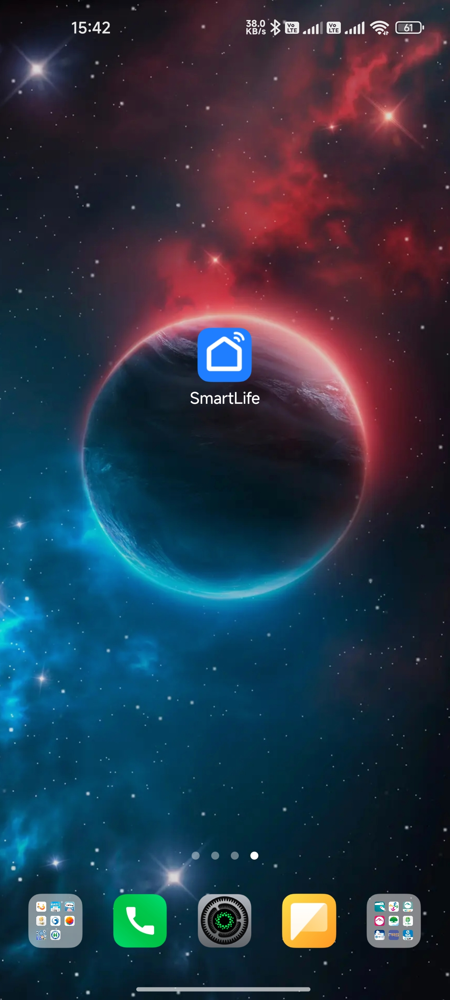
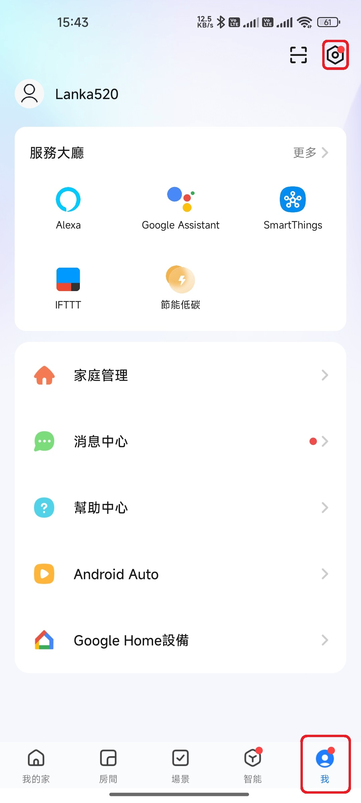
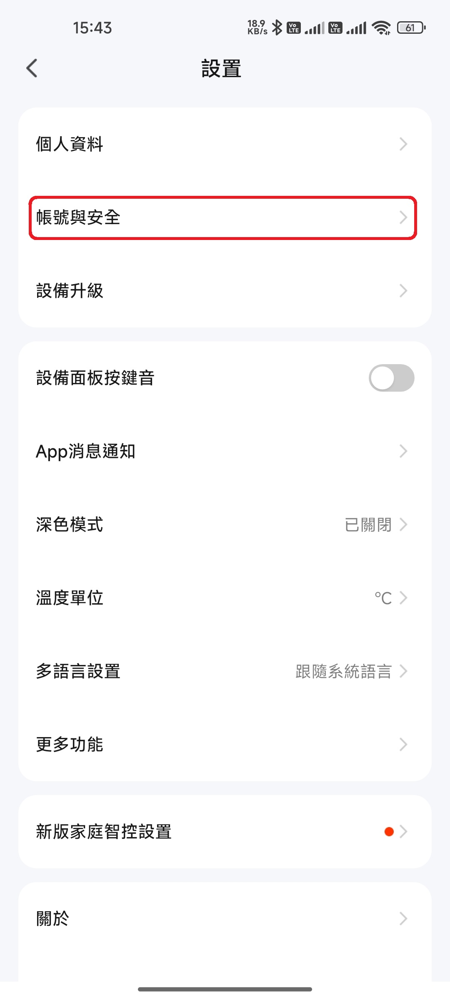
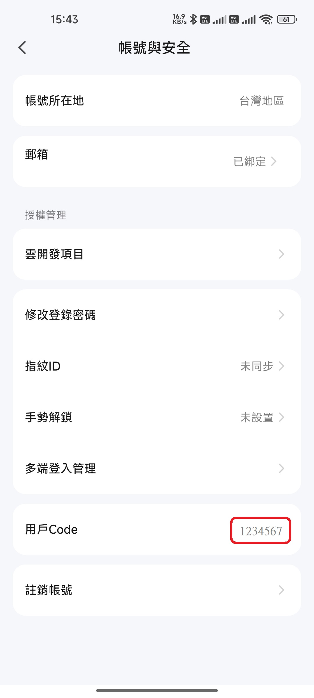
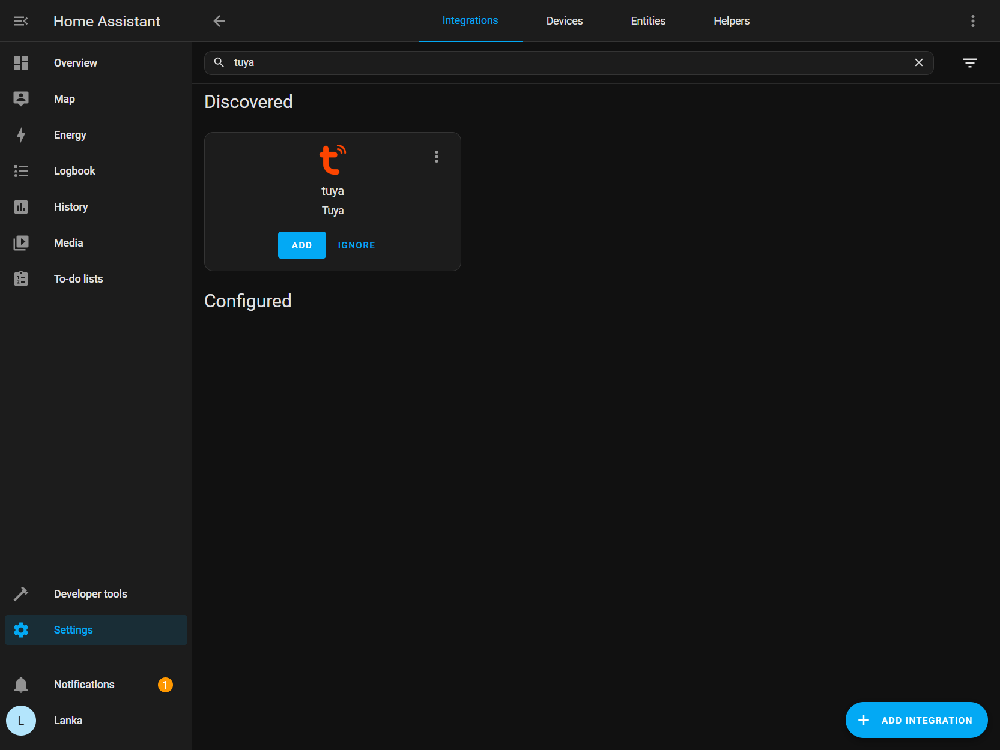
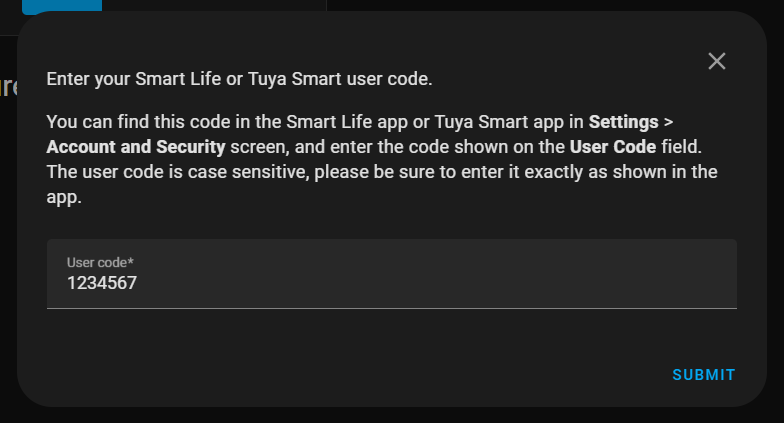
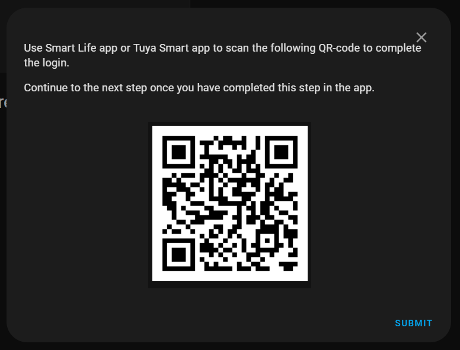
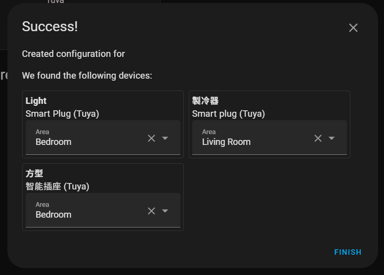
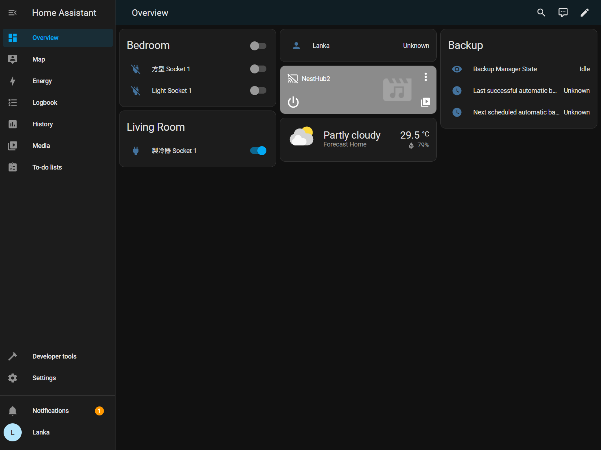

# IoT [Home Assistant](https://www.home-assistant.io)

[![GitHub license][license-image]][license-url]
[![GitHub stars][stars-image]][stars-url]
[![GitHub forks][forks-image]][forks-url]
[![GitHub issues][issues-image]][issues-image]
[![GitHub watchers][watchers-image]][watchers-image]

[license-image]: https://img.shields.io/github/license/lankahsu520/HelperX.svg
[license-url]: https://github.com/lankahsu520/HelperX/blob/master/LICENSE
[stars-image]: https://img.shields.io/github/stars/lankahsu520/HelperX.svg
[stars-url]: https://github.com/lankahsu520/HelperX/stargazers
[forks-image]: https://img.shields.io/github/forks/lankahsu520/HelperX.svg
[forks-url]: https://github.com/lankahsu520/HelperX/network
[issues-image]: https://img.shields.io/github/issues/lankahsu520/HelperX.svg
[issues-url]: https://github.com/lankahsu520/HelperX/issues
[watchers-image]: https://img.shields.io/github/watchers/lankahsu520/HelperX.svg
[watchers-url]: https://github.com/lankahsu520/HelperX/watchers

# 1. Overview

> Home Assistant 是一款開源的家庭自動化平台，強調本地控制與隱私保護。由全球熱衷創客與 DIY 愛好者所推動與維護，非常適合在 Raspberry Pi 或本地伺服器上執行。
>
> 它是一個輔助工具，是讓現有的環境下，整合成一個方便的 UI 環境，讓您能夠輕鬆地管理和控制各種智慧設備，讓它們可以協同作業。

> 這邊有個小故事
>
> 同事研究 Home Assistant 後，跑來說「Home Assistant 一定要裝在`伺服器`上」，而他對`伺服器`的想法還停留在〝效能要很好，很貴的機器。〞，而我反問「你不是裝在Raspberry Pi 」，他當場啞口無言。

> 一些網路的介紹，可以直接查看以下連結。

## 1.1. [Home Assistant](https://www.home-assistant.io)

> 官方網站

## 1.2. [維基百科] [Home Assistant](https://en.wikipedia.org/wiki/Home_Assistant)

> **Home Assistant** is [free and open-source software](https://en.wikipedia.org/wiki/Free_and_open-source_software) used for [home automation](https://en.wikipedia.org/wiki/Home_automation). It serves both as a [smart home hub](https://en.wikipedia.org/wiki/Smart_home_hub) and an [integration platform](https://en.wikipedia.org/wiki/Integration_platform), allowing users to control or automate [smart home](https://en.wikipedia.org/wiki/Smart_home) devices.

## 1.3. [XiaoMi](https://github.com/XiaoMi)/[ha_xiaomi_home](https://github.com/XiaoMi/ha_xiaomi_home)

> Xiaomi Home Integration is an integrated component of Home Assistant supported by Xiaomi official. It allows you to use Xiaomi IoT smart devices in Home Assistant.

# 2. Start up

## 2.1. Install
>  [Installation](https://www.home-assistant.io/installation)
>
>  這是官網提供的教學，說它是 install 教學，應該不算。
>
>  該內容是要求使用者下載 image 裝在虛擬機上。雖說是給 DIY 愛好者，但是…
>
>  - 有人不知什麼是虛擬機。
>  - 只想在現有系統上執行，少一層虛擬機的耗能。
>  - 如使用 Raspberry Pi，不想再另外準備一張SDCARD（已經打照好遊戲機，就不能在上面附加嗎？）。

###  2.1.1. [Raspberry Pi](https://www.home-assistant.io/installation/raspberrypi)

## 2.2. Run

> http://192.168.31.62:8123

### 2.2.1. Main

### 2.2.2. CREATE MY SMART HOME

#### A. Create user

#### B. Home location

#### C. Help us help you

#### D. We found compatible devices!

### 2.2.2. My Home

# 3. Integrations

> 這邊就是大家期待的，綁定手邊的設備，不限定廠商，只要與 Home Assistant 有合作的。

> Settings -> Devices & services

## 3.1. [Sensibo](https://sensibo.com)

> [Sensibo](https://www.home-assistant.io/integrations/sensibo)
>
> The **Sensibo** integration integrates [Sensibo](https://sensibo.com/) devices into Home Assistant.

### 3.1.1. Install

#### A. Discovered

> click `Sensibo`

#### B. API key*

> enter API key*:

> 如果不知 API key，請至以下官網申請；這邊不示範相關步驟。
>
> Request a API Key from [Sensibo API Portal](https://home.sensibo.com/login?next=/me/api)

#### C. Found device

### 3.1.2. Overview

## 3.2. [ONVIF](https://www.onvif.org)

> [ONVIF](https://www.home-assistant.io/integrations/onvif)
>
> The ONVIF camera integration allows you to use an [ONVIF](https://www.onvif.org/) Profile S conformant device in Home Assistant. This requires the [`ffmpeg` integration](https://www.home-assistant.io/integrations/ffmpeg/) to be already configured.

### 3.2.1. Install

#### A. Search Integrations

> key in : ONVIF

#### B. Search automatically

#### C. Configure ONVIF device

### 3.1.2. Overview

> 其它相關功能，請自行研究

## 3.3. Tuya

> [Tuya](https://www.home-assistant.io/integrations/tuya)
>
> The Tuya integration integrates all Powered by Tuya devices you have added to the Tuya Smart and Tuya Smart Life apps.
>
> All Home Assistant platforms are supported by the Tuya integration, except the lock and remote platform.

> [How to Install Smart Life Integration (Beta)](https://developer.tuya.com/en/docs/iot/Smart_Life_Integration?id=Kd0gk9baikbb7)
>
> This topic describes how to install and use the Smart Life integration for Home Assistant.

### 3.3.1. Get User Code

#### A. SmartLife APP

#### B. Setting

#### C. Account and Security

#### D. User Code

### 3.2.2. Install

#### A. Search Integrations

> key in : tuya

#### B. Enter your Smart Life or Tuya Smart user code

#### C. Scan QR-code

> Please use `SmartLife APP` scan the QR-code

#### D. Configure Tuya devices

### 3.3.3. Overview

# Appendix

# I. Study

## I.1. [Home Assistant 智能家居](https://www.youtube.com/playlist?list=PLhIaxXZ92HbBYk5lXMgL9LEb8PrOqpXml)

# II. Debug

# III. Glossary

# IV. Tool Usage

# Author

> Created and designed by [Lanka Hsu](lankahsu@gmail.com).

# License

> [HelperX](https://github.com/lankahsu520/HelperX) is available under the BSD-3-Clause license. See the LICENSE file for more info.

