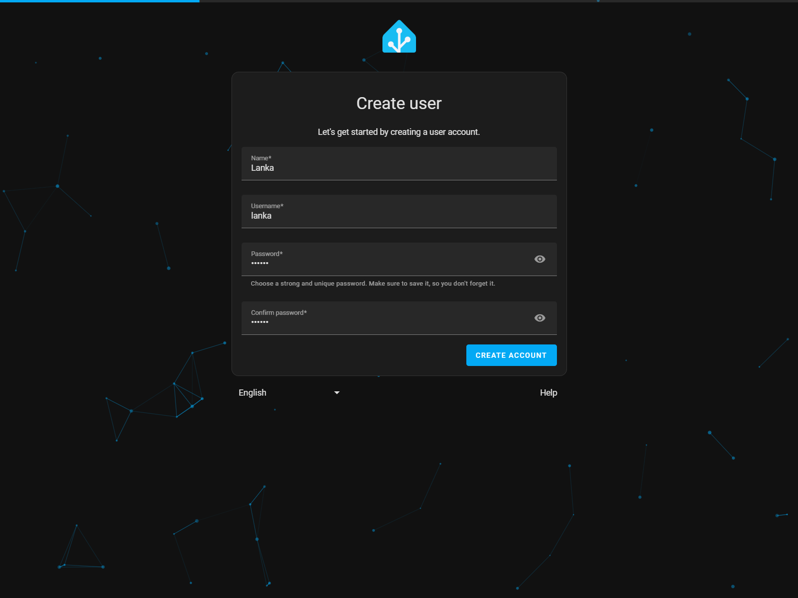
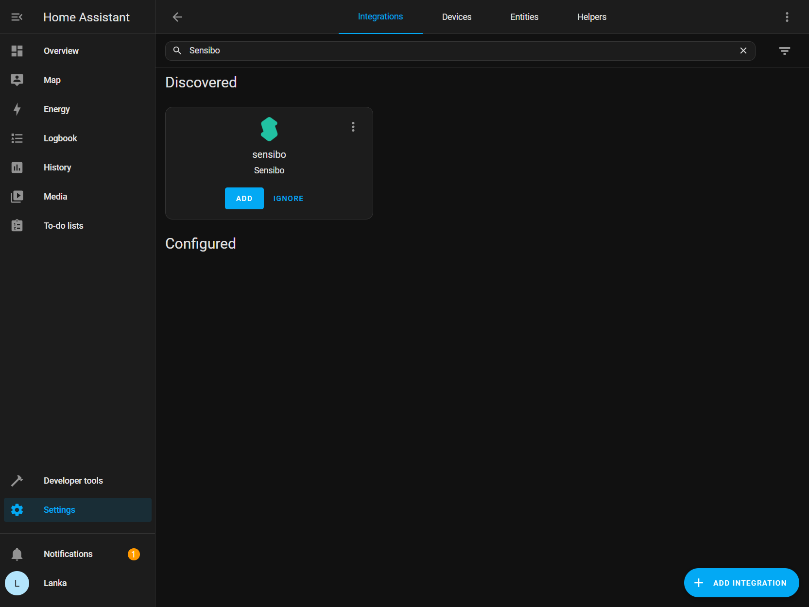
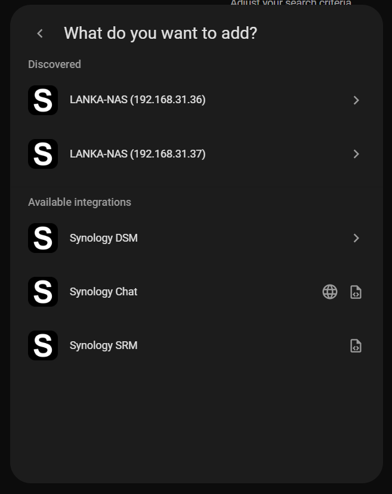
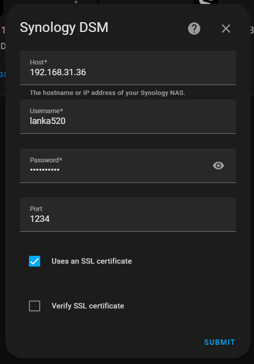
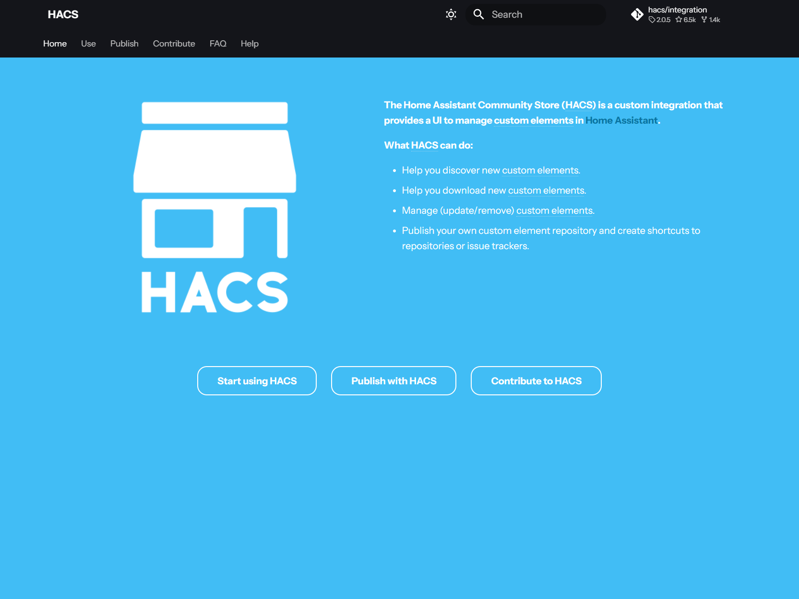
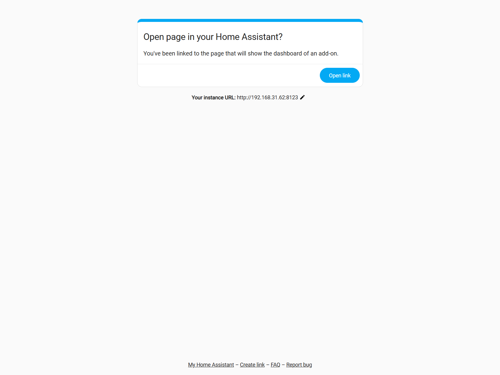
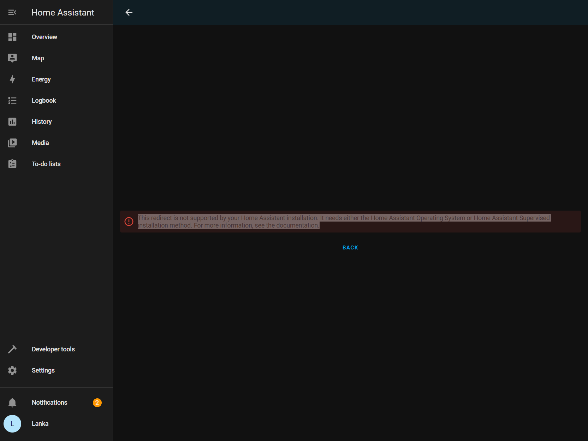

# IoT [Home Assistant](https://www.home-assistant.io)

[](https://github.com/lankahsu520/HelperX)
[![GitHub license][license-image]][license-url]
[![GitHub stars][stars-image]][stars-url]
[![GitHub forks][forks-image]][forks-url]
[![GitHub issues][issues-image]][issues-image]
[![GitHub watchers][watchers-image]][watchers-image]

[license-image]: https://img.shields.io/github/license/lankahsu520/HelperX.svg
[license-url]: https://github.com/lankahsu520/HelperX/blob/master/LICENSE
[stars-image]: https://img.shields.io/github/stars/lankahsu520/HelperX.svg
[stars-url]: https://github.com/lankahsu520/HelperX/stargazers
[forks-image]: https://img.shields.io/github/forks/lankahsu520/HelperX.svg
[forks-url]: https://github.com/lankahsu520/HelperX/network
[issues-image]: https://img.shields.io/github/issues/lankahsu520/HelperX.svg
[issues-url]: https://github.com/lankahsu520/HelperX/issues
[watchers-image]: https://img.shields.io/github/watchers/lankahsu520/HelperX.svg
[watchers-url]: https://github.com/lankahsu520/HelperX/watchers

# 1. Overview

> Home Assistant 是一款開源的家庭自動化平台，強調本地控制與隱私保護。由全球熱衷創客與 DIY 愛好者所推動與維護，非常適合在 Raspberry Pi 或本地伺服器上執行。
>
> 它是一個輔助工具，是讓現有的環境下，整合成一個方便的 UI 環境，讓您能夠輕鬆地管理和控制各種智慧設備，讓它們可以協同作業。

> 這邊有個小故事
>
> 同事研究 Home Assistant 後，跑來說「Home Assistant 一定要裝在`伺服器`上」，而他對`伺服器`的想法還停留在〝效能要很好，很貴的機器。〞，而我反問「你不是裝在Raspberry Pi 」，他當場啞口無言。

> 一些網路的介紹，可以直接查看以下連結。

## 1.1. [Home Assistant](https://www.home-assistant.io)

> 官方網站

## 1.2. [維基百科] [Home Assistant](https://en.wikipedia.org/wiki/Home_Assistant)

> **Home Assistant** is [free and open-source software](https://en.wikipedia.org/wiki/Free_and_open-source_software) used for [home automation](https://en.wikipedia.org/wiki/Home_automation). It serves both as a [smart home hub](https://en.wikipedia.org/wiki/Smart_home_hub) and an [integration platform](https://en.wikipedia.org/wiki/Integration_platform), allowing users to control or automate [smart home](https://en.wikipedia.org/wiki/Smart_home) devices.

## 1.3. [XiaoMi](https://github.com/XiaoMi)/[ha_xiaomi_home](https://github.com/XiaoMi/ha_xiaomi_home)

> Xiaomi Home Integration is an integrated component of Home Assistant supported by Xiaomi official. It allows you to use Xiaomi IoT smart devices in Home Assistant.

# 2. [Install](https://www.home-assistant.io/installation)

> 裏面的教學跳來跳去，感覺是要讓人迷惑其中，最後搞清楚文章是重複再重複，探討的就2~3個版本。
>
> 最近幾年（今年為 2025）的變動很大，建議直接用最新版不要管舊版本，遇到不能用的 compoments 就是 compoments 本身的問題，大多是 compoments 沒有跟著升級，不然就是 compoments 用了一些特殊套件造成的。

> 官網提供的教學，說它是 install 教學，應該不算。所有內容導向是要求使用者下載 image 裝在虛擬機或主機上。雖說是給 DIY 愛好者的發展環境，但是…
>
> - 有人不知什麼是虛擬機。
> - 只想在現有系統上執行，少一層虛擬機的耗能。
> - 原使用 Raspberry Pi，不想再另外準備一張SDCARD（已經打照好遊戲機，就不能在上面附加嗎？）。

> - [Home Assistant Green ](https://support.nabucasa.com/hc/en-us/categories/24638797677853-Home-Assistant-Green)
> - [Home Assistant Yellow ](https://support.nabucasa.com/hc/en-us/categories/24734575925149-Home-Assistant-Yellow)
> - [Raspberry Pi](https://www.home-assistant.io/installation/raspberrypi)
> - [ODROID](https://www.home-assistant.io/installation/odroid)
> - [Generic x86-64](https://www.home-assistant.io/installation/generic-x86-64)
> - [Linux](https://www.home-assistant.io/installation/linux)
> - [macOS](https://www.home-assistant.io/installation/macos)
> - [Windows](https://www.home-assistant.io/installation/windows)
> - [Other systems](https://www.home-assistant.io/installation/alternative)

## 2.1. [About installation types](https://www.home-assistant.io/installation/#about-installation-types)

> - **Home Assistant Operating System**: An embedded, minimalistic operating system designed to run the Home Assistant ecosystem on single board computers (like the Home Assistant Green or a Raspberry Pi) or Virtual Machines. It is the most convenient option in terms of installation and maintenance and it supports add-ons. Home Assistant Operating System is the recommended installation type for most users.
> - **Home Assistant Container:** Container-based installation of Home Assistant. You need to bring your own system (such as Linux) with container orchestration (like Docker), and manually handle updates. Home Assistant Container installations don’t have access to add-ons.

|                                                              | HA OS | Container |
| :----------------------------------------------------------: | :---: | --------- |
| [Automations](https://www.home-assistant.io/docs/automation) |   ✔   | ✔         |
|    [Dashboards](https://www.home-assistant.io/dashboards)    |   ✔   | ✔         |
|  [Integrations](https://www.home-assistant.io/integrations)  |   ✔   | ✔         |
|       [Add-ons](https://www.home-assistant.io/addons)        |   ✔   | ✖         |
|  [Blueprints](https://www.home-assistant.io/docs/blueprint)  |   ✔   | ✔         |
|                      One-click updates                       |   ✔   | ✖         |
| [Backups](https://www.home-assistant.io/common-tasks/general/#backups) |   ✔   | ✔         |

## 2.2. Deprecated installation types

> Home Assistant used to offer two additional installation types for advanced users: **Home Assistant Core** and **Home Assistant Supervised**. These two methods are now [deprecated and no longer recommended for new users](https://www.home-assistant.io/blog/2025/05/22/deprecating-core-and-supervised-installation-methods-and-32-bit-systems/).
>
> - **Home Assistant Supervised:** Manual installation of the Supervisor.
> - **Home Assistant Core:** Manual installation using Python virtual environment.

## 2.3. Others

> 因為本人開始的學習方向是讓 NXP i.MX 8M Mini 上跑 Home Assistant（請見 [helper_Yocto-HomeAssistant.md](https://github.com/lankahsu520/CrossCompilationX/blob/master/helper_Yocto-HomeAssistant.md)），而不是去玩 Home Assistant，查詢官方文件對於這方面的著墨少之又少，最後都是詢問ChatGPT。

# 3. Showtime

> 預設連結網址
>
> http://homeassistant.local:8123

## 3.1. Main


## 3.2. CREATE MY SMART HOME

#### A. Create user


#### B. Home location


#### C. Help us help you


#### D. We found compatible devices!


## 3.3. My Home


## 3.4. Hostname

> Settings -> System -> Network


> key in : `lanka520-home`, then click `Save`
>
> 重新開機就可以用
>
> http://lanka520-home.local:8123


# 4. [Add-ons](https://www.home-assistant.io/addons)

> 不見得每個版本都有此項目，相關差異請見
>
> 2.1. [About installation types](https://www.home-assistant.io/installation/#about-installation-types)


## 4.1. Open SSH

#### A. Advanced mode - On

> 點選左下角的個人帳號 -> General -> User settings

> 開啟 Advanced mode


#### B. Add-on store

> Settings -> Add-ons -> Add-on store


> key in : `ssh`


#### C. Install Terminal & SSH


> - [x] Autoupdate
>
> - [x] Show in sidebar
>
> click `Start`


#### D. Configuration

##### D.1. Options

```yaml
authorized_keys: []
password: "123456"
apks: []
server:
  tcp_forwarding: false
```

##### D.2. Network

> Change the ports on your host that are exposed by the add-on
>
> SSH Port: 22


# 5. Integrations

> 這邊就是大家期待的，綁定手邊的設備，不限定廠商，只要與 Home Assistant 有合作的。
>
> 如果在裏面能找到的，就代表官網已經內建，基本上就可以使用！如果有發生錯誤時，請記得去查看 Log。

> Settings -> Devices & services


## 5.1. [Sensibo](https://sensibo.com)

> [Sensibo](https://www.home-assistant.io/integrations/sensibo)
>
> The **Sensibo** integration integrates [Sensibo](https://sensibo.com/) devices into Home Assistant.

### 5.1.1. Setup

#### A.  Search Integrations

> key in : Sensibo



#### B. API key*

> enter API key*:

> 如果不知 API key，請至以下官網申請；這邊不示範相關步驟。
>
> Request a API Key from [Sensibo API Portal](https://home.sensibo.com/login?next=/me/api)


#### C. Found device


### 5.1.2. Overview


## 5.2. [ONVIF](https://www.onvif.org)

> [ONVIF](https://www.home-assistant.io/integrations/onvif)
>
> The ONVIF camera integration allows you to use an [ONVIF](https://www.onvif.org/) Profile S conformant device in Home Assistant. This requires the [`ffmpeg` integration](https://www.home-assistant.io/integrations/ffmpeg/) to be already configured.

### 5.2.1. Setup

#### A. Search Integrations

> key in : ONVIF


#### B. Search automatically


#### C. Configure ONVIF device


### 5.2.2. Overview

> 其它相關功能，請自行研究


## 5.3. [Tuya](https://www.tuya.com)

> [Tuya](https://www.home-assistant.io/integrations/tuya)
>
> The Tuya integration integrates all Powered by Tuya devices you have added to the Tuya Smart and Tuya Smart Life apps.
>
> All Home Assistant platforms are supported by the Tuya integration, except the lock and remote platform.

> [How to Install Smart Life Integration (Beta)](https://developer.tuya.com/en/docs/iot/Smart_Life_Integration?id=Kd0gk9baikbb7)
>
> This topic describes how to install and use the Smart Life integration for Home Assistant.

### 5.3.1. Get User Code

#### A. SmartLife APP


#### B. Setting


#### C. Account and Security


#### D. User Code


### 5.3.2. Setup

#### A. Search Integrations

> key in : tuya


#### B. Enter your Smart Life or Tuya Smart user code


#### C. Scan QR-code

> Please use `SmartLife APP` scan the QR-code


#### D. Configure Tuya devices


### 5.3.3. Overview


## 5.4. [Synology NAS](https://www.synology.com)

> [Synology DSM](https://www.home-assistant.io/integrations/synology_dsm)
>
> The Synology DSM integration provides access to various statistics from your [Synology NAS](https://www.synology.com/) (*DSM 5.x and higher*), as well as cameras from the [Surveillance Station](https://www.synology.com/surveillance) and will allow to use the [File Station](https://www.synology.com/en-us/dsm/feature/file_sharing) as a backup location.

### 5.4.1. Setup

#### A. Search Integrations

> key in : synology


> 從網路上搜尋到



#### B. Login Synology DSM



#### C. Backup location

> 這邊的功用還無從得知，請各位自行理解
>
> Shared folder: home
>
> Path: ha_backup_home


#### D. Created configuration for xxx


### 5.4.2. Overview


# 6. Home Assistant Community Store (HACS)

> 就是軟體商店。非內建，而且需要與個人的 [GitHub](https://github.com) 帳號綁定（GitHub 不是 open 嗎？）。
>
> 如果知道 Home Assistant 的運作方式，其實就可以跳過帳號綁定這步驟。

> [HACS](https://www.hacs.xyz)
>
> The Home Assistant Community Store (HACS) is a custom integration that provides a UI to manage custom elements in [Home Assistant](https://www.home-assistant.io/).
>
> What HACS can do:
>
> - Help you discover new custom elements.
> - Help you download new custom elements.
> - Manage (update/remove) custom elements.
> - Publish your own custom element repository and create shortcuts to repositories or issue trackers.

## 6.1. Install HACS

### 6.1.1. Start using HACS

> https://www.hacs.xyz
>
> 點選 `Start using HACS`



### 6.1.2. [Download HACS](https://www.hacs.xyz/docs/use/download/download/)

> 點選 `Download HACS`


> 點選後就會有二種方式進行安裝，如果該主機能使用 SSH 或是 TREMINAL，建議使用 `Run the HACS download script`

#### A. [OS/Supervised](https://www.hacs.xyz/docs/use/download/download/#to-download-hacs-ossupervised)

> 點選 `my link.`


> 更新自己主機的 IP:PORT



> 之後會跳轉到登入畫面。

>  如果發生以下狀況，就是無法使用此方式，請至下章節繼續。
>
>  ```log
>  This redirect is not supported by your Home Assistant installation. It needs either the Home Assistant Operating System or Home Assistant Supervised installation method. For more information, see the documentation.
>  ```



#### B. Run the HACS download script


> 這個要進到作業系統進行操作

```bash
$ wget -O - https://get.hacs.xyz | bash -
```

> 它的工作大概如下

```bash
# 設定檔案存於 /root/.homeassistant
$ mkdir -p /root/.homeassistant/custom_components
$ cd /root/.homeassistant/custom_components
$ wget https://github.com/hacs/integration/releases/latest/download/hacs.zip
$ unzip hacs.zip -d hacs
$ rm hacs.zip

$ systemctl restart homeassistant.service
```

### 6.1.3. Setup

#### A. Search Integrations

> key in : hacs


#### B. Acknowledge the questions


#### C. Get the Key

> 得到 key 之後，點選 https://github.com/login/device


#### D. Binding with GitHub

> 登入後，就會進行綁定


> 輸入之前得到的 Key


#### D. Configure HACS


### 6.1.4. Overview

> 點選 `HACS`


## 6.2. custom_components

> 因為這邊的設定目錄是指向 /root/.homeassistant

```bash
$ tree -L 1 /root/.homeassistant/custom_components
/root/.homeassistant/custom_components
`-- hacs

2 directories, 0 files
```

# 7. Special commands

## 7.1. NXP i.MX 8M Mini

> 因為一開始的安裝是在 NXP i.MX 8M Mini 上

```bash
$ cat /etc/os-release
ID=fsl-imx-wayland
NAME="NXP i.MX Release Distro"
VERSION="6.12-walnascar (walnascar)"
VERSION_ID=6.12-walnascar
VERSION_CODENAME="walnascar"
PRETTY_NAME="NXP i.MX Release Distro 6.12-walnascar (walnascar)"
CPE_NAME="cpe:/o:openembedded:fsl-imx-wayland:6.12-walnascar"
```

### 7.1.1. homeassistant.service

#### A. Start and Stop

```bash
systemctl start homeassistant.service
systemctl stop homeassistant.service
```

#### B. Status

```bash
systemctl start homeassistant.service
```

```bash
$  cat /usr/lib/systemd/system/homeassistant.service
[Unit]
Description=Home Assistant
After=network.target

Requires=root.mount
After=root.mount

[Service]
Type=simple
User=homeassistant

PermissionsStartOnly=true
ExecStartPre=/bin/mkdir -p /root/.homeassistant
ExecStartPre=/bin/chown homeassistant:homeassistant /root/.homeassistant

ExecStart=/usr/bin/hass --skip-pip -c "/root/.homeassistant"
Restart=on-failure

[Install]
WantedBy=multi-user.target
```

#### C. Log

> 因為這邊的設定目錄是指向 /root/.homeassistant

```bash
$ cat /root/.homeassistant/home-assistant.log
```

## 7.2. haos_ova-16.2.vdi

```bash
$ cat /etc/os-release
NAME="Alpine Linux"
ID=alpine
VERSION_ID=3.22.1
PRETTY_NAME="Alpine Linux v3.22"
HOME_URL="https://alpinelinux.org/"
BUG_REPORT_URL="https://gitlab.alpinelinux.org/alpine/aports/-/issues"
```

# Appendix

# I. Study

## I.1. [Home Assistant 智能家居](https://www.youtube.com/playlist?list=PLhIaxXZ92HbBYk5lXMgL9LEb8PrOqpXml)

## I.2. [2025 Home Assistant 入坑完全指南 – SMART HOME 智慧家庭 EP 7](https://neiltw.com/ultimate-home-assistant-beginners-guide)

## I.3. [Home Assistant 必裝外掛 HACS 安裝步驟詳解 – Home Assistant 手把手教學 EP 17](https://neiltw.com/hacs-install-guide)

# II. Debug

## II.1. No module named `xxxx`

```log
2025-08-13 00:54:18.784 WARNING (MainThread) [homeassistant.bootstrap] Skipping pip installation of required modules. This may cause issues
2025-08-13 00:54:50.902 ERROR (MainThread) [homeassistant.config_entries] Error occurred loading flow for integration xiaomi_miio: No module named 'miio'
```

```bash
# 使用 pip 安裝
$ pip install python-miio
# 使用 pip 安裝特定版本
$ pip install python-miio==0.5.12
```

# III. Glossary

# IV. Tool Usage

## IV.1. [hass](https://www.home-assistant.io/docs/tools/hass) Usage

```bash
$ hass -h
usage: hass [-h] [--version] [-c path_to_config_dir] [--recovery-mode] [--debug] [--open-ui] [--skip-pip |
            --skip-pip-packages package_names] [-v] [--log-rotate-days LOG_ROTATE_DAYS] [--log-file LOG_FILE] [--log-no-color]
            [--script ...] [--ignore-os-check]

Home Assistant: Observe, Control, Automate.

options:
  -h, --help            show this help message and exit
  --version             show program's version number and exit
  -c, --config path_to_config_dir
                        Directory that contains the Home Assistant configuration
  --recovery-mode       Start Home Assistant in recovery mode
  --debug               Start Home Assistant in debug mode
  --open-ui             Open the webinterface in a browser
  --skip-pip            Skips pip install of required packages on startup
  --skip-pip-packages package_names
                        Skip pip install of specific packages on startup
  -v, --verbose         Enable verbose logging to file.
  --log-rotate-days LOG_ROTATE_DAYS
                        Enables daily log rotation and keeps up to the specified days
  --log-file LOG_FILE   Log file to write to. If not set, CONFIG/home-assistant.log is used
  --log-no-color        Disable color logs
  --script ...          Run one of the embedded scripts
  --ignore-os-check     Skips validation of operating system

If restart is requested, exits with code 100
```

# Author

> Created and designed by [Lanka Hsu](lankahsu@gmail.com).

# License

> [HelperX](https://github.com/lankahsu520/HelperX) is available under the BSD-3-Clause license. See the LICENSE file for more info.

