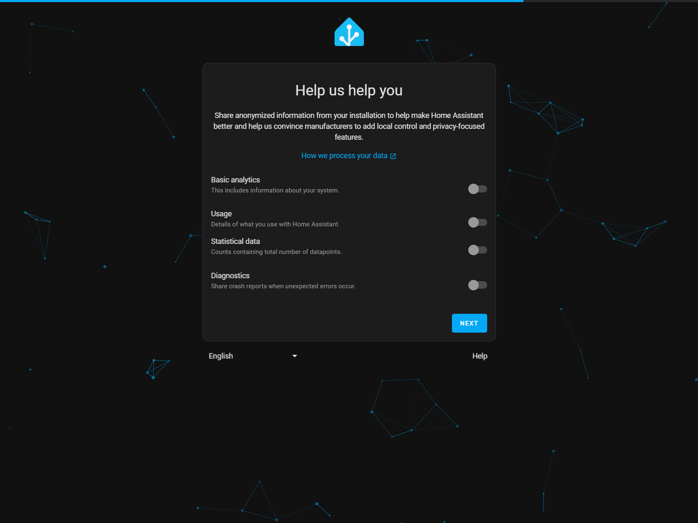
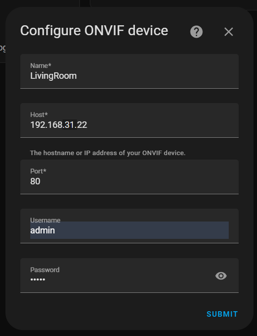

# IoT [Home Assistant](https://www.home-assistant.io)

[](https://github.com/lankahsu520/HelperX)
[![GitHub license][license-image]][license-url]
[![GitHub stars][stars-image]][stars-url]
[![GitHub forks][forks-image]][forks-url]
[![GitHub issues][issues-image]][issues-image]
[![GitHub watchers][watchers-image]][watchers-image]

[license-image]: https://img.shields.io/github/license/lankahsu520/HelperX.svg
[license-url]: https://github.com/lankahsu520/HelperX/blob/master/LICENSE
[stars-image]: https://img.shields.io/github/stars/lankahsu520/HelperX.svg
[stars-url]: https://github.com/lankahsu520/HelperX/stargazers
[forks-image]: https://img.shields.io/github/forks/lankahsu520/HelperX.svg
[forks-url]: https://github.com/lankahsu520/HelperX/network
[issues-image]: https://img.shields.io/github/issues/lankahsu520/HelperX.svg
[issues-url]: https://github.com/lankahsu520/HelperX/issues
[watchers-image]: https://img.shields.io/github/watchers/lankahsu520/HelperX.svg
[watchers-url]: https://github.com/lankahsu520/HelperX/watchers

# 1. Overview

> Home Assistant 是一款開源的家庭自動化平台，強調本地控制與隱私保護。由全球熱衷創客與 DIY 愛好者所推動與維護，非常適合在 Raspberry Pi 或本地伺服器上執行。
>
> 它是一個輔助工具，是讓現有的環境下，整合成一個方便的 UI 環境，讓您能夠輕鬆地管理和控制各種智慧設備，讓它們可以協同作業。

> 這邊有個小故事
>
> 同事研究 Home Assistant 後，跑來說「Home Assistant 一定要裝在`伺服器`上」，而他對`伺服器`的想法還停留在〝效能要很好，很貴的機器。〞，而我反問「你不是裝在Raspberry Pi 」，他當場啞口無言。

> 一些網路的介紹，可以直接查看以下連結。

## 1.1. [Home Assistant](https://www.home-assistant.io)

> 官方網站

## 1.2. [維基百科] [Home Assistant](https://en.wikipedia.org/wiki/Home_Assistant)

> **Home Assistant** is [free and open-source software](https://en.wikipedia.org/wiki/Free_and_open-source_software) used for [home automation](https://en.wikipedia.org/wiki/Home_automation). It serves both as a [smart home hub](https://en.wikipedia.org/wiki/Smart_home_hub) and an [integration platform](https://en.wikipedia.org/wiki/Integration_platform), allowing users to control or automate [smart home](https://en.wikipedia.org/wiki/Smart_home) devices.

## 1.3. [XiaoMi](https://github.com/XiaoMi)/[ha_xiaomi_home](https://github.com/XiaoMi/ha_xiaomi_home)

> Xiaomi Home Integration is an integrated component of Home Assistant supported by Xiaomi official. It allows you to use Xiaomi IoT smart devices in Home Assistant.

# 2. Start up

## 2.1. Install
>  [Installation](https://www.home-assistant.io/installation)
>
>  這是官網提供的教學，說它是 install 教學，應該不算。
>
>  該內容是要求使用者下載 image 裝在虛擬機上。雖說是給 DIY 愛好者，但是…
>
>  - 有人不知什麼是虛擬機。
>  - 只想在現有系統上執行，少一層虛擬機的耗能。
>  - 如使用 Raspberry Pi，不想再另外準備一張SDCARD（已經打照好遊戲機，就不能在上面附加嗎？）。

###  2.1.1. [Raspberry Pi](https://www.home-assistant.io/installation/raspberrypi)

## 2.2. Run

> http://192.168.31.62:8123

### 2.2.1. Main


### 2.2.2. CREATE MY SMART HOME

#### A. Create user


#### B. Home location


#### C. Help us help you



#### D. We found compatible devices!


### 2.2.2. My Home


# 3. Integrations

> 這邊就是大家期待的，綁定手邊的設備，不限定廠商，只要與 Home Assistant 有合作的。

> Settings -> Devices & services


## 3.1. [Sensibo](https://sensibo.com)

> [Sensibo](https://www.home-assistant.io/integrations/sensibo)
>
> The **Sensibo** integration integrates [Sensibo](https://sensibo.com/) devices into Home Assistant.

### 3.1.1. Setup

#### A.  Search Integrations

> key in : Sensibo


#### B. API key*

> enter API key*:

> 如果不知 API key，請至以下官網申請；這邊不示範相關步驟。
>
> Request a API Key from [Sensibo API Portal](https://home.sensibo.com/login?next=/me/api)


#### C. Found device


### 3.1.2. Overview


## 3.2. [ONVIF](https://www.onvif.org)

> [ONVIF](https://www.home-assistant.io/integrations/onvif)
>
> The ONVIF camera integration allows you to use an [ONVIF](https://www.onvif.org/) Profile S conformant device in Home Assistant. This requires the [`ffmpeg` integration](https://www.home-assistant.io/integrations/ffmpeg/) to be already configured.

### 3.2.1. Setup

#### A. Search Integrations

> key in : ONVIF


#### B. Search automatically


#### C. Configure ONVIF device




### 3.1.2. Overview

> 其它相關功能，請自行研究


## 3.3. Home Assistant Community Store (HACS)

> 就是軟體商店。非內建，而且需要與個人的 [GitHub](https://github.com) 帳號綁定（GitHub 不是 open 嗎？）。

> [HACS](https://www.hacs.xyz)
>
> The Home Assistant Community Store (HACS) is a custom integration that provides a UI to manage custom elements in [Home Assistant](https://www.home-assistant.io/).
>
> What HACS can do:
>
> - Help you discover new custom elements.
> - Help you download new custom elements.
> - Manage (update/remove) custom elements.
> - Publish your own custom element repository and create shortcuts to repositories or issue trackers.

### 3.3.1. Install

#### A. Start using HACS

> https://www.hacs.xyz


#### B. [Download HACS](https://www.hacs.xyz/docs/use/download/download/)


> 點選後就會有二種方式進行安裝，如果該主機能使用 SSH 或是 TREMINAL，建議使用 `Run the HACS download script`

##### B.1. [OS/Supervised](https://www.hacs.xyz/docs/use/download/download/#to-download-hacs-ossupervised)

> 點選 [my link](https://my.home-assistant.io/redirect/supervisor_addon/?addon=cb646a50_get&repository_url=https%3A%2F%2Fgithub.com%2Fhacs%2Faddons).


> 更新主機的 IP:PORT


> 之後會跳轉到登入畫面，進行登入後發生

```log
This redirect is not supported by your Home Assistant installation. It needs either the Home Assistant Operating System or Home Assistant Supervised installation method. For more information, see the documentation.
```


##### B.2. Run the HACS download script


> 這個要進到作業系統進行操作

```bash
$ wget -O - https://get.hacs.xyz | bash -
```

> 它的工作大概如下

```bash
# 設定檔案存於 /root/.homeassistant
$ mkdir -p /root/.homeassistant/custom_components
$ cd /root/.homeassistant/custom_components
$ wget https://github.com/hacs/integration/releases/latest/download/hacs.zip
$ unzip hacs.zip -d hacs
$ rm hacs.zip

$ systemctl restart homeassistant.service
```

### 3.2.2. Setup

#### A. Search Integrations

> key in : hacs


#### B. Acknowledge the questions


#### C. Get the Key

> 得到 key 之後，點選 https://github.com/login/device


#### D. Binding with GitHub

> 登入後，就會進行綁定


> 輸入之前得到的 Key


#### D. Configure HACS


### 3.3.3. Overview

> 點選 `HACS`


# Appendix

# I. Study

## I.1. [Home Assistant 智能家居](https://www.youtube.com/playlist?list=PLhIaxXZ92HbBYk5lXMgL9LEb8PrOqpXml)

## I.2. [2025 Home Assistant 入坑完全指南 – SMART HOME 智慧家庭 EP 7](https://neiltw.com/ultimate-home-assistant-beginners-guide)

## I.3. [Home Assistant 必裝外掛 HACS 安裝步驟詳解 – Home Assistant 手把手教學 EP 17](https://neiltw.com/hacs-install-guide)

# II. Debug

# III. Glossary

# IV. Tool Usage

# Author

> Created and designed by [Lanka Hsu](lankahsu@gmail.com).

# License

> [HelperX](https://github.com/lankahsu520/HelperX) is available under the BSD-3-Clause license. See the LICENSE file for more info.

