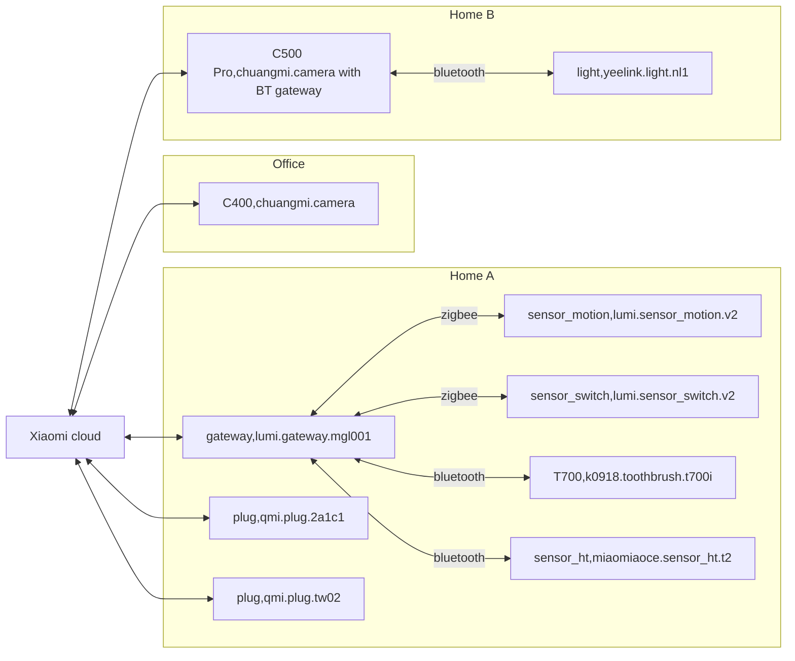

# IoT Xiaomi

[](https://github.com/lankahsu520/HelperX)
[![GitHub license][license-image]][license-url]
[![GitHub stars][stars-image]][stars-url]
[![GitHub forks][forks-image]][forks-url]
[![GitHub issues][issues-image]][issues-image]
[![GitHub watchers][watchers-image]][watchers-image]

[license-image]: https://img.shields.io/github/license/lankahsu520/HelperX.svg
[license-url]: https://github.com/lankahsu520/HelperX/blob/master/LICENSE
[stars-image]: https://img.shields.io/github/stars/lankahsu520/HelperX.svg
[stars-url]: https://github.com/lankahsu520/HelperX/stargazers
[forks-image]: https://img.shields.io/github/forks/lankahsu520/HelperX.svg
[forks-url]: https://github.com/lankahsu520/HelperX/network
[issues-image]: https://img.shields.io/github/issues/lankahsu520/HelperX.svg
[issues-url]: https://github.com/lankahsu520/HelperX/issues
[watchers-image]: https://img.shields.io/github/watchers/lankahsu520/HelperX.svg
[watchers-url]: https://github.com/lankahsu520/HelperX/watchers

# 1. Overview

> 為什麼會選擇 Xiaomi 建構[智慧居家](https://www.mi.com/tw/product-list/smart-device/?cat_id=2546)，因為價格親民、取得容易、安裝方便（不需電工的知識），另外還有現成的 API 可使用。
>
> 如果個人有使用大陸產品的疑慮，建議可以省略此篇文章。

# 2. Topology




# 3. miiocli

> This library (and its accompanying cli tool, `miiocli`) can be used to control devices using Xiaomi's [miIO](https://github.com/OpenMiHome/mihome-binary-protocol/blob/master/doc/PROTOCOL.md) and MIoT protocols.

> GitHub - [python-miio](https://github.com/rytilahti/python-miio)
>
> PyPI - [python-miio](https://pypi.org/project/python-miio/)

```bash
$ pip install --upgrade python-miio
```

## 3.0. cloud

>因為之後的操作都與 device ID and TOKEN 有關，所以需要先連上 Xiaomi cloud 後鍵入使用者帳號和密碼，查詢相關 devices 訊息。
>
>另外這些資料比較私密，請一定要好好保管。

### 3.0.1. Token

#### A. miiocli cloud

```bash
function xiaomi-cloud()
{
	ARGS="$*"

	DO_COMMAND="(miiocli cloud ${ARGS})"
	eval-it "$DO_COMMAND"
}
```

```bash
$ xiaomi-cloud
[(miiocli cloud )]
Username: 
Password: 
...
```

#### B. Xiaomi-cloud-tokens-extractor

> 這邊另外提供一個方式去抓取 token。

> This tool/script retrieves tokens for all devices connected to Xiaomi cloud and encryption keys for BLE devices.

```bash
$ git clone https://github.com/PiotrMachowski/Xiaomi-cloud-tokens-extractor

$ cd Xiaomi-cloud-tokens-extractor
$ python3 token_extractor.py
Username (email or user ID):
Password:

Server (one of: cn, de, us, ru, tw, sg, in, i2) Leave empty to check all available:
tw

Logging in...
Logged in.

Devices found for server "tw" @ home "12345678901":
...
```

### 3.0.1. IP and Token

```bash
function xiaomi-device-ip()
{
	IP1="$1"
	TOKEN2="$2"
	IECHO="$3"
	[ "$IP1" != "" ] && XIAOMI_IP=$IP1
	[ "$TOKEN2" != "" ] && XIAOMI_TOKEN=$TOKEN2

	if [ -z "${IECHO}" ]; then
		echo "XIAOMI_IP=${XIAOMI_IP}"
		echo "XIAOMI_TOKEN=${XIAOMI_TOKEN}"
	elif [ "${IECHO}" == "reset" ]; then
		unset XIAOMI_IP
		unset XIAOMI_TOKEN
	fi
}
```

```bash
$ xiaomi-device-ip 192.168.0.28 12345678901234567890123456789012
XIAOMI_IP=192.168.0.28
XIAOMI_TOKEN=12345678901234567890123456789012
```

## 3.1. discover

> Discover devices using both handshake and mdns methods.

```bash
$ miiocli discover --help
Usage: miiocli discover [OPTIONS]

  Discover devices using both handshake and mdns methods.

Options:
  --mdns / --no-mdns
  --handshake / --no-handshake
  --network TEXT
  --timeout INTEGER
  --help                        Show this message and exit.
```

```bash
function xiaomi-discover()
{
	ARGS="$*"

	DO_COMMAND="(miiocli discover ${ARGS})"
	eval-it "$DO_COMMAND"
}
```

```bash
$ xiaomi-discover
[(miiocli discover )]
INFO:miio.miioprotocol:Sending discovery to <broadcast> with timeout of 5s..
INFO:miio.miioprotocol:  IP 192.168.0.30 (ID: 52099230) - token: b'ffffffffffffffffffffffffffffffff'
INFO:miio.miioprotocol:  IP 192.168.0.33 (ID: 52099633) - token: b'ffffffffffffffffffffffffffffffff'
INFO:miio.miioprotocol:  IP 192.168.0.32 (ID: 52099832) - token: b'ffffffffffffffffffffffffffffffff'
INFO:miio.miioprotocol:  IP 192.168.0.23 (ID: 52099523) - token: b'ffffffffffffffffffffffffffffffff'
INFO:miio.miioprotocol:  IP 192.168.0.26 (ID: 52099626) - token: b'ffffffffffffffffffffffffffffffff'
INFO:miio.miioprotocol:  IP 192.168.0.29 (ID: 52099c29) - token: b'ffffffffffffffffffffffffffffffff'
INFO:miio.miioprotocol:  IP 192.168.0.28 (ID: 52099b28) - token: b'ffffffffffffffffffffffffffffffff'
INFO:miio.miioprotocol:  IP 192.168.0.31 (ID: 52099231) - token: b'ffffffffffffffffffffffffffffffff'
INFO:miio.miioprotocol:Discovery done
INFO:miio.discovery:Discovering devices with mDNS for 5 seconds..
```

## 3.2. device

```bash
$ miiocli device --help
Usage: miiocli device [OPTIONS] COMMAND [ARGS]...

Options:
  --ip TEXT     [required]
  --token TEXT  [required]
  --model TEXT
  --help        Show this message and exit.

Commands:
  info             Get (and cache) miIO protocol information from the...
  raw_command      Send a raw command to the device.
  test_properties  Helper to test device properties.
```

```bash
function xiaomi-device()
{
	ARGS="$*"

	DO_COMMAND="(miiocli device ${ARGS})"
	eval-it "$DO_COMMAND"
}
```

### 3.2.1. device info

```bash
function xiaomi-device-info()
{
	HINT="Usage: ${FUNCNAME[0]} [ip] [token]"

	xiaomi-device-ip "$1" "$2" "no"

	if [ ! -z "${XIAOMI_IP}" ] && [ ! -z "${XIAOMI_TOKEN}" ]; then
		[ "$XIAOMI_IP" != "" ] && XIAOMI_IP_ARG="--ip $XIAOMI_IP"
		[ "$XIAOMI_TOKEN" != "" ] && XIAOMI_TOKEN_ARG="--token $XIAOMI_TOKEN"

		xiaomi-device ${XIAOMI_IP_ARG} ${XIAOMI_TOKEN_ARG} info
	else
		echo $HINT
	fi
}
```

```bash
$ xiaomi-device-info
[(miiocli device --ip 192.168.0.28 --token 12345678901234567890123456789012 info)]
Model: qmi.plug.tw02
Hardware version: ESP32C3
Firmware version: 1.0.6
```

### 3.2.2. device raw_command

#### A. get_properties

```bash
# get the status of the device
miiocli \
	device \
	${XIAOMI_IP_ARG} ${XIAOMI_TOKEN_ARG} \
	raw_command get_properties \
	"[{'did': '${XIAOMI_ID}', 'siid': 2, 'piid': 1 }]"
```

#### B. set_properties

##### B.1. turn on the device

```bash
# turn on the device
miiocli \
	device \
	${XIAOMI_IP_ARG} ${XIAOMI_TOKEN_ARG} \
	raw_command set_properties \
	"[{'did': '${XIAOMI_ID}', 'siid': 2, 'piid': 1, 'value':True}]"
```

##### B.2. turn off the device

```bash
# turn off the device
miiocli \
	device \
	${XIAOMI_IP_ARG} ${XIAOMI_TOKEN_ARG} \
	raw_command set_properties \
	"[{'did': '${XIAOMI_ID}', 'siid': 2, 'piid': 1, 'value':False}]"
```

# Appendix

# I. Study

## I.1. [Linux命令行控制小米电源开关](https://blog.csdn.net/yanceylu/article/details/135067812)

## I.2. [[米家]解除台版小米多功能網關遠端控制(TELNET)密碼](https://esisterebbb.blogspot.com/2021/01/telnet.html)

## I.3. [使用 Python 控制米家设备](https://moenew.us/python-miio-use.html)

# II. Debug

# III. Glossary

# IV. Tool Usage

## IV.1. miiocli Usage

```bash
$ miiocli --help
Usage: miiocli [OPTIONS] COMMAND [ARGS]...

Options:
  -d, --debug
  -o, --output [default|json|json_pretty]
  --version                       Show the version and exit.
  --help                          Show this message and exit.

Commands:
  airconditionermiot
  airconditioningcompanion
  airconditioningcompanionmcn02
  airconditioningcompanionv3
  airdehumidifier
  airdogx3
  airfresh
  airfresha1
  airfresht2017
  airhumidifier
  airhumidifierjsq
  airhumidifierjsqs
  airhumidifiermiot
  airhumidifiermjjsq
  airpurifier
  airpurifiermiot
  airqualitymonitor
  airqualitymonitorcgdn1
  alarmclock
  aqaracamera
  ceil
  chuangmicamera
  chuangmiir
  chuangmiplug
  cloud                          Cloud commands.
  cooker
  curtainmiot
  device
  discover                       Discover devices using both handshake...
  dreamevacuum
  fan
  fan1c
  fanleshow
  fanmiot
  fanp5
  fanza5
  g1vacuum
  gateway
  heater
  heatermiot
  huizuo
  huizuolampfan
  huizuolampheater
  huizuolampscene
  miotdevice
  petwaterdispenser
  philipsbulb
  philipseyecare
  philipsmoonlight
  philipsrwread
  philipswhitebulb
  powerstrip
  pwznrelay
  roborockvacuum
  roidmivacuummiot
  scisharecoffee
  toiletlid
  viomivacuum
  walkingpad
  waterpurifier
  waterpurifieryunmi
  wifirepeater
  wifispeaker
  yeelight
  yeelightdualcontrolmodule

```

# Author

> Created and designed by [Lanka Hsu](lankahsu@gmail.com).

# License

> [HelperX](https://github.com/lankahsu520/HelperX) is available under the BSD-3-Clause license. See the LICENSE file for more info.

