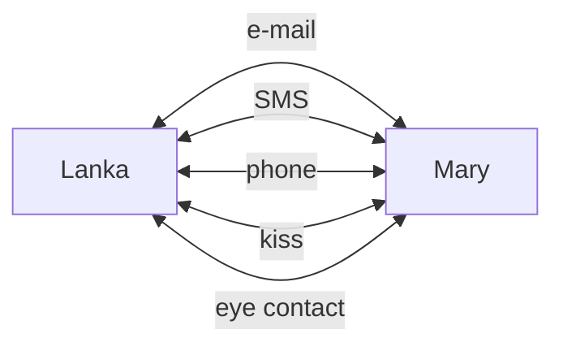
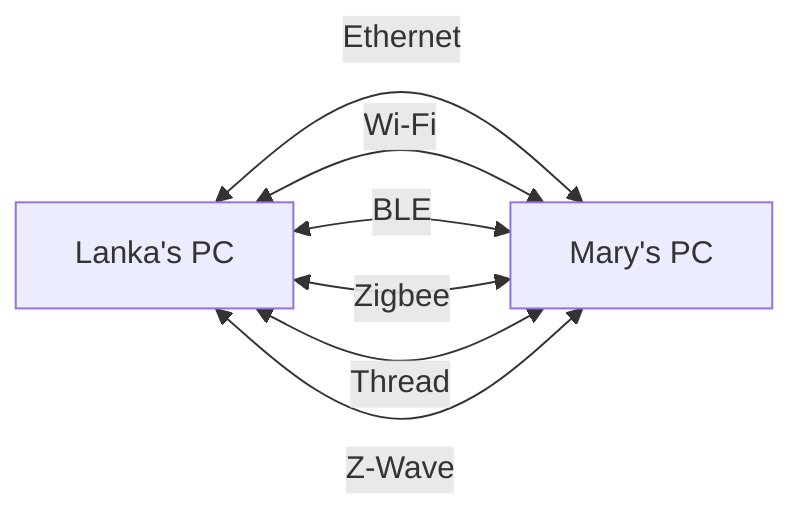
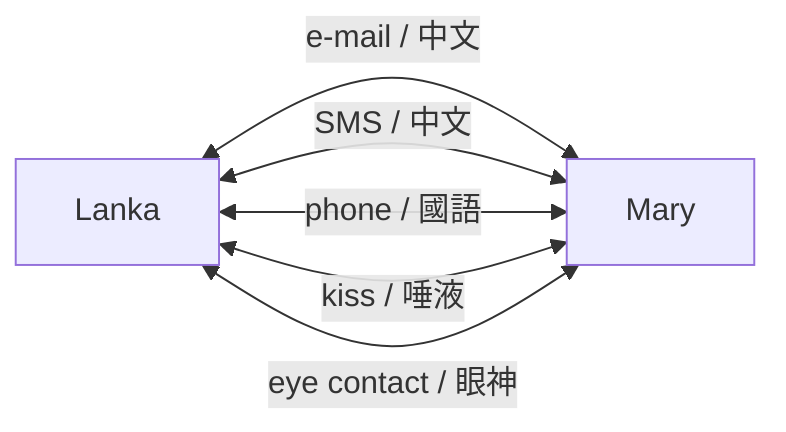
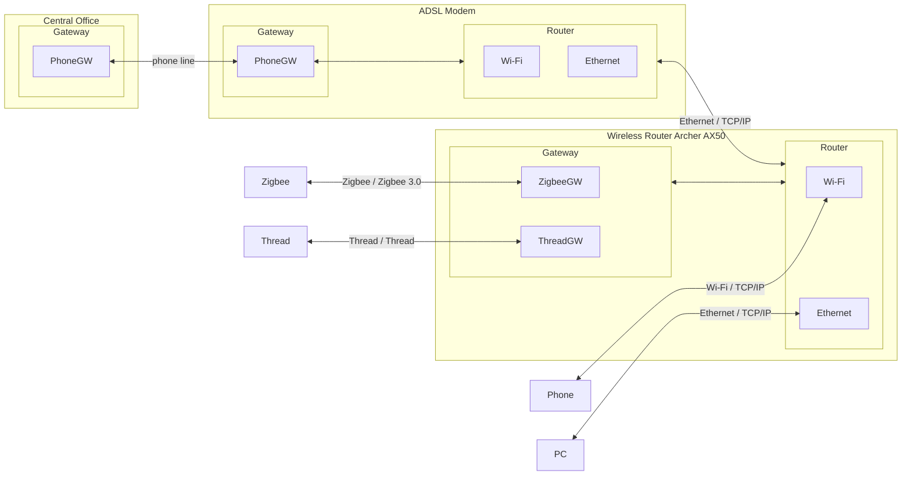

# IoT 物聯網

# 1. Overview - [維基百科](https://zh.wikipedia.org/zh-tw/物联网)
> **物聯網**（英語：Internet of Things，簡稱**IoT**）是一種計算裝置、機械、數位機器相互關聯的系統，具備[通用唯一辨識碼](https://zh.wikipedia.org/wiki/通用唯一辨識碼)（UID），並具有通過網路傳輸數據的能力，無需人與人、或是人與裝置的互動

## 1.1. Path (通路) vs Protocol (通訊協定)

> 這個主題很重要！一堆人搞不清什麼是通路、什麼是通訊協定等。
>
> 本章節將會用生活化的方式介紹

### 1.1.1. Path (通路)

#### A. 人與人

>人與人的接觸有 e-mail、SMS、phone、kiss、eye contact 等等

#### B. MtoM (Machine to Machine)

>從圖中，目前市面上常看到的連結方式有 Ethernet、Wi-Fi、BLE等

### 1.1.2. Protocol (通訊協定)

#### A. 人與人

#### B. MtoM

>這個圖相當的重要。Ethernet 和 Wi-Fi  是我們平常所說的網路系統，在此系統中都是base on TCP/IP  “架構” 下亙聯亙通。而這邊你只要把它視為某種 “語言” (通訊協定) 即可。
>
>Zigbee 是一個很好的例子，在 Zigbee 3.0 發佈前存在著 Zigbee 1.2 or 更舊的版本，當兩方雖然都是說著  Zigbee 1.2  “語言” 時，就好像一位說 “英文”，而一位說 “中文”，是沒有辦法溝通的；等到 Zigbee 3.0 以 “英文“ 為共通話言，才能達到所謂的亙聯亙通。（雖然 Zigbee 3.0 號稱已經統一了，實際情形還有待大家去發現）

## 1.2. Gateway vs. Router

#### A. Gateway

> 於不同協定間交換資料，如 Zigbee 3.0 轉至  TCP/IP。

#### B. Router

>於不用通路間，使用相同的協定間交換資料，如 Ethernet（實體線路連接） 和 Wi-Fi（wireless  連接） 雖然連接方式不是，但是裏面的內涵都是 TCP/IP。

# Appendix

# I. Study

# II. Debug

# III. Glossary

# IV. Tool Usage

# Author

Created and designed by [Lanka Hsu](lankahsu@gmail.com).

# License

[HelperX](https://github.com/lankahsu520/HelperX) is available under the BSD-3-Clause license. See the LICENSE file for more info.

