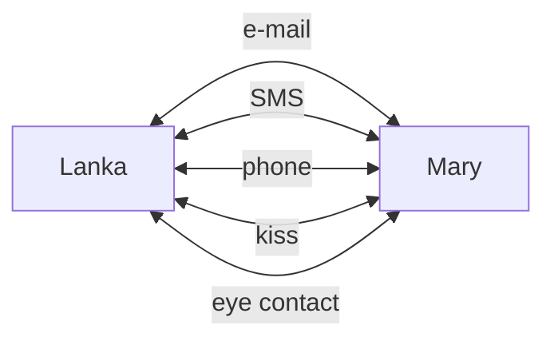
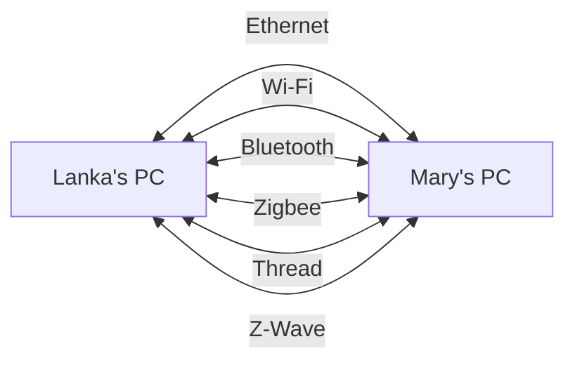
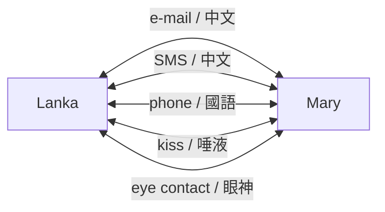
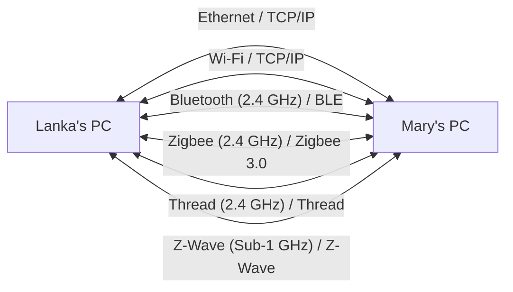
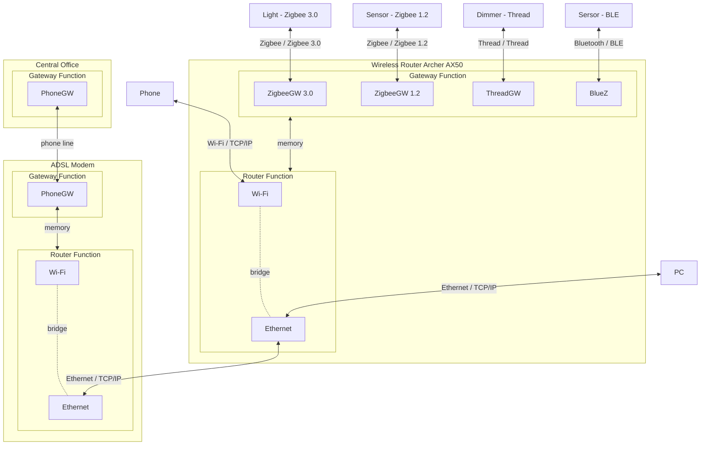

# IoT 物聯網
[](https://github.com/lankahsu520/HelperX)
[![GitHub license][license-image]][license-url]
[![GitHub stars][stars-image]][stars-url]
[![GitHub forks][forks-image]][forks-url]
[![GitHub issues][issues-image]][issues-image]
[![GitHub watchers][watchers-image]][watchers-image]

[license-image]: https://img.shields.io/github/license/lankahsu520/HelperX.svg
[license-url]: https://github.com/lankahsu520/HelperX/blob/master/LICENSE
[stars-image]: https://img.shields.io/github/stars/lankahsu520/HelperX.svg
[stars-url]: https://github.com/lankahsu520/HelperX/stargazers
[forks-image]: https://img.shields.io/github/forks/lankahsu520/HelperX.svg
[forks-url]: https://github.com/lankahsu520/HelperX/network
[issues-image]: https://img.shields.io/github/issues/lankahsu520/HelperX.svg
[issues-url]: https://github.com/lankahsu520/HelperX/issues
[watchers-image]: https://img.shields.io/github/watchers/lankahsu520/HelperX.svg
[watchers-url]: https://github.com/lankahsu520/HelperX/watchers

# 1. Overview
> [維基百科](https://zh.wikipedia.org/zh-tw/物联网) **物聯網**（英語：Internet of Things，簡稱**IoT**）是一種計算裝置、機械、數位機器相互關聯的系統，具備[通用唯一辨識碼](https://zh.wikipedia.org/wiki/通用唯一辨識碼)（UID），並具有通過網路傳輸數據的能力，無需人與人、或是人與裝置的互動

# 2. Path (通路) vs Protocol (通訊協定)

> 這個章節很重要！
>
> 一堆人搞不清什麼是通路、什麼是通訊協定等。將會用生活化的方式介紹

## 2.1. Path (通路)

#### A. 人與人

>人與人的接觸有 e-mail、SMS、phone、kiss、eye contact 等等



#### B. MtoM (Machine to Machine)

>從圖中，目前市面上常看到的連結方式有 Ethernet、Wi-Fi、BLE等



## 2.2. Protocol (通訊協定)

#### A. 人與人



#### B. MtoM

>這張圖相當的重要。Ethernet 和 Wi-Fi  是我們平常所說的網路系統，在此系統中都是base on TCP/IP  “架構” 下亙聯亙通。而這邊你只要把它視為某種 “語言” (通訊協定) 即可。
>
>Zigbee 是一個很好的例子，在 Zigbee 3.0 發佈前存在著 Zigbee 1.2 or 更舊的版本，當兩方雖然都是說著  Zigbee 1.2  “語言” 時，就好像一位說 “英文”，而一位說 “中文”，是沒有辦法溝通的；等到 Zigbee 3.0 以 “英文“ 為共通話言，才能達到所謂的亙聯亙通。（雖然 Zigbee 3.0 號稱已經統一了，實際情形還有待大家去發現）



## 2.3. Gateway vs. Router

> 這裏繼續釐清 Path 和 Protocol。清楚其差別，將來在軟體開發時有助於工作分配，也能釐清責任歸屬。


#### A. Gateway

> 於不同協定間交換資料，如 Zigbee 3.0 轉至  TCP/IP。

#### B. Router

>於不用通路間，使用相同的協定間交換資料，如 Ethernet（實體線路連接） 和 Wi-Fi（wireless  連接） 雖然連接方式不是，但是裏面的內涵都是 TCP/IP。

# 3. Protocol

> 這邊匯整出常見的協定，方便大家認識。

## 3.1. Bluetooth Low Energy

> [維基百科](https://zh.wikipedia.org/zh-tw/蓝牙低功耗) **藍牙低功耗**（**Bluetooth Low Energy**，或稱**Bluetooth LE**、**BLE**，舊商標**Bluetooth Smart**[[1\]](https://zh.wikipedia.org/zh-tw/蓝牙低功耗#cite_note-1)）也稱**藍牙低能耗**、**低功耗藍牙**，是[藍牙技術聯盟](https://zh.wikipedia.org/wiki/藍牙技術聯盟)設計和銷售的一種[個人區域網路](https://zh.wikipedia.org/wiki/個人區域網絡)技術，旨在用於醫療保健、[運動健身](https://zh.wikipedia.org/wiki/體適能)、信標[[2\]](https://zh.wikipedia.org/zh-tw/蓝牙低功耗#cite_note-2)、安防、家庭娛樂等領域的新興應用。[[3\]](https://zh.wikipedia.org/zh-tw/蓝牙低功耗#cite_note-3)相較[經典藍牙](https://zh.wikipedia.org/wiki/藍牙)，低功耗藍牙旨在保持同等通訊範圍的同時顯著降低功耗和成本。

## 3.2. Infrared

>[維基百科](https://zh.wikipedia.org/zh-tw/红外线) **紅外線**（英語：Infrared，簡稱IR）是[波長](https://zh.wikipedia.org/wiki/波长)介乎[微波](https://zh.wikipedia.org/wiki/微波)與[可見光](https://zh.wikipedia.org/wiki/可见光)之間的[電磁波](https://zh.wikipedia.org/wiki/电磁波)，其波長在760[奈米](https://zh.wikipedia.org/wiki/奈米)（nm）至1[毫米](https://zh.wikipedia.org/wiki/毫米)（mm）之間，[[1\]](https://zh.wikipedia.org/zh-tw/红外线#cite_note-1)是波長比紅光長的非可見光，對應頻率約是在430 [THz](https://zh.wikipedia.org/wiki/THz)到300 [GHz](https://zh.wikipedia.org/wiki/GHz)的範圍內[[2\]](https://zh.wikipedia.org/zh-tw/红外线#cite_note-2)。室溫下物體所發出的[熱輻射](https://zh.wikipedia.org/wiki/熱輻射)多都在此波段。紅外線於1800年由[威廉·赫歇爾](https://zh.wikipedia.org/wiki/威廉·赫歇爾)首次提出。[地球](https://zh.wikipedia.org/wiki/地球)吸收及發射紅外線[輻射](https://zh.wikipedia.org/wiki/輻射)對[氣候](https://zh.wikipedia.org/wiki/氣候)具影響，現今紅外線亦應用於不同科技領域。

>上面文謅謅的，簡單的就是，我們每天看的電視（接收器）和手中的遙控器（發射器）中間的連接方式。

## 3.3. HomeKit

> [維基百科](https://zh.wikipedia.org/zh-tw/HomeKit) **HomeKit** 是[蘋果公司](https://zh.wikipedia.org/wiki/苹果公司)推出的一個[軟體框架](https://zh.wikipedia.org/wiki/软件框架)，它可以讓使用者使用蘋果裝置對智慧型家居電器進行組態、溝通和控制。透過在HomeKit服務中設計房間、物品和動作，使用者可以透過對[Siri](https://zh.wikipedia.org/wiki/Siri)的簡單語音命令或透過家庭（Home）應用來實現家中的自動動作。[[1\]](https://zh.wikipedia.org/zh-tw/HomeKit#cite_note-1)

>嚴格來說 HomeKit 不是通訊協定，它只是一個 Apple 自定義的資料交換格式。只是base on TCP/IP、HTTPS。
>
>也就是說，一個簡單的軟體可以是 HomeKit 裏中的一個 device，單功能的 Zigbee sersor 也可以加入其中， Z-Wave switch 也可以當成一份子。

## 3.4. Thread

> [維基百科](https://en.wikipedia.org/wiki/Thread_(network_protocol))  **Thread** 是一種基於 [IPv6](https://en.wikipedia.org/wiki/IPv6) 的低功耗[網狀網路](https://en.wikipedia.org/wiki/Mesh_networking)技術，適用於[物聯網](https://en.wikipedia.org/wiki/Internet_of_things) （IoT） 產品。

#### A.  [OpenThread Border Router (OTBR)](https://openthread.io/guides/border-router)

```bash
git clone https://github.com/openthread/ot-br-posix.git
```

## 3.5. ZigBee

>[維基百科](https://zh.wikipedia.org/zh-tw/ZigBee) **ZigBee**，也稱**紫蜂**[[1\]](https://zh.wikipedia.org/zh-tw/ZigBee#cite_note-1)，是一種低速短距離傳輸的[無線網路](https://zh.wikipedia.org/wiki/無線網路)協定，底層是採用[IEEE 802.15.4](https://zh.wikipedia.org/wiki/IEEE_802)標準規範的[媒體存取層](https://zh.wikipedia.org/wiki/媒體存取控制)與[實體層](https://zh.wikipedia.org/wiki/實體層)。主要特色有低速、低耗電、低成本、支援大量網路節點、支援多種[網路拓撲](https://zh.wikipedia.org/wiki/網絡拓撲)、低複雜度、可靠、安全。

## 3.6. Z-Wave

>[維基百科](https://zh.wikipedia.org/zh-tw/Z-Wave) **Z-Wave**，是一種主要用於[家庭自動化](https://zh.wikipedia.org/wiki/家庭自動化)的[無線](https://zh.wikipedia.org/wiki/无线)通信協議。它是一種網狀網絡，使用低耗能無線電波在設備與設備間進行通信，[[1\]](https://zh.wikipedia.org/zh-tw/Z-Wave#cite_note-1)從而無線控制家中電器和其他設備，例如控制照明、安全系統、恆溫器、窗戶、鎖、游泳池和車庫門開啟器。

# Appendix

# I. Study

# II. Debug

# III. Glossary

# IV. Tool Usage

# Author

Created and designed by [Lanka Hsu](lankahsu@gmail.com).

# License

[HelperX](https://github.com/lankahsu520/HelperX) is available under the BSD-3-Clause license. See the LICENSE file for more info.

