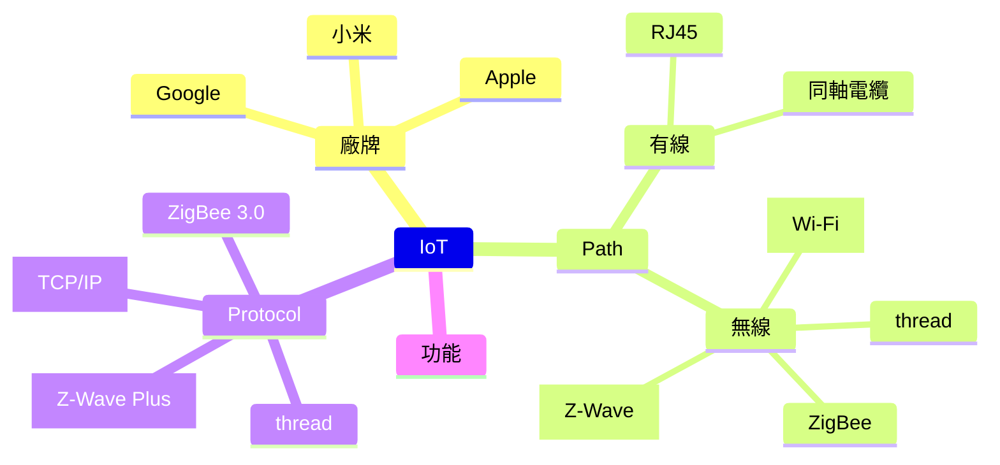
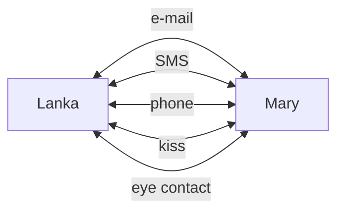
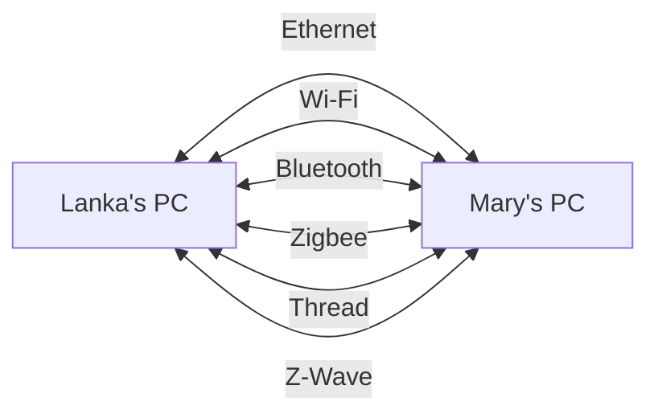
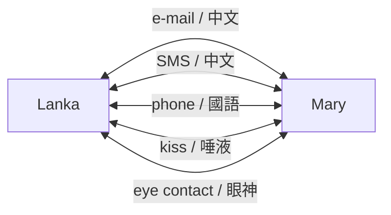
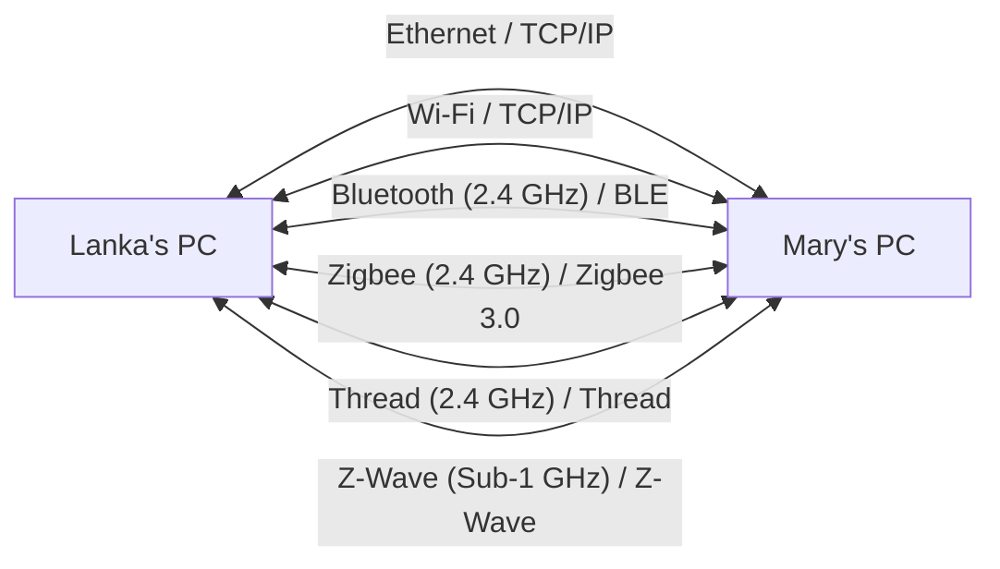
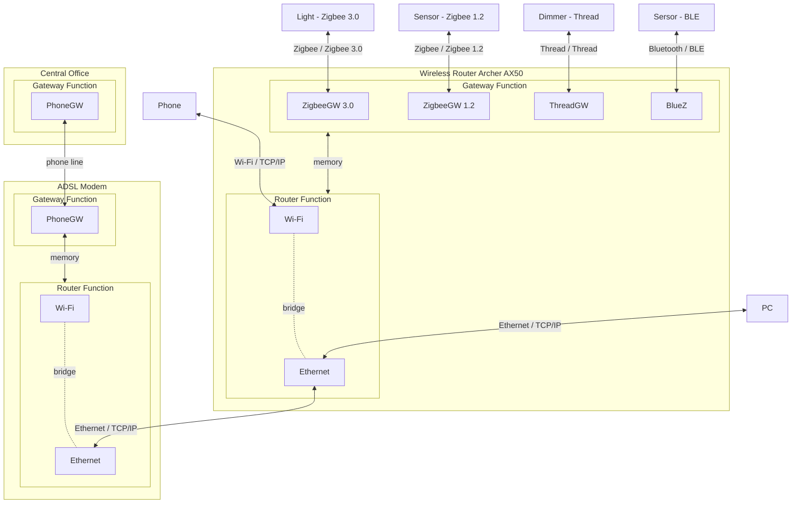

# IoT 物聯網
[](https://github.com/lankahsu520/HelperX)
[![GitHub license][license-image]][license-url]
[![GitHub stars][stars-image]][stars-url]
[![GitHub forks][forks-image]][forks-url]
[![GitHub issues][issues-image]][issues-image]
[![GitHub watchers][watchers-image]][watchers-image]

[license-image]: https://img.shields.io/github/license/lankahsu520/HelperX.svg
[license-url]: https://github.com/lankahsu520/HelperX/blob/master/LICENSE
[stars-image]: https://img.shields.io/github/stars/lankahsu520/HelperX.svg
[stars-url]: https://github.com/lankahsu520/HelperX/stargazers
[forks-image]: https://img.shields.io/github/forks/lankahsu520/HelperX.svg
[forks-url]: https://github.com/lankahsu520/HelperX/network
[issues-image]: https://img.shields.io/github/issues/lankahsu520/HelperX.svg
[issues-url]: https://github.com/lankahsu520/HelperX/issues
[watchers-image]: https://img.shields.io/github/watchers/lankahsu520/HelperX.svg
[watchers-url]: https://github.com/lankahsu520/HelperX/watchers

# 1. Overview
> [維基百科](https://zh.wikipedia.org/zh-tw/物联网) **物聯網**（英語：Internet of Things，簡稱**IoT**）是一種計算裝置、機械、數位機器相互關聯的系統，具備[通用唯一辨識碼](https://zh.wikipedia.org/wiki/通用唯一辨識碼)（UID），並具有通過網路傳輸數據的能力，無需人與人、或是人與裝置的互動

# 2. Mind

> 以下列出基本元素




# 3. Path (通路) vs Protocol (通訊協定)

> 這個章節很重要！
>
> 一堆人搞不清什麼是通路、什麼是通訊協定等。將會用生活化的方式介紹

## 3.1. Path (通路)

#### A. 人與人

>人與人的接觸有 e-mail、SMS、phone、kiss、eye contact 等等



#### B. MtoM (Machine to Machine)

>從圖中，目前市面上常看到的連結方式有 Ethernet、Wi-Fi、BLE等



## 3.2. Protocol (通訊協定)

#### A. 人與人



#### B. MtoM

>這張圖相當的重要。Ethernet 和 Wi-Fi  是我們平常所說的網路系統，在此系統中都是base on TCP/IP  “架構” 下亙聯亙通。而這邊你只要把它視為某種 “語言” (通訊協定) 即可。
>
>Zigbee 是一個很好的例子，在 Zigbee 3.0 發佈前存在著 Zigbee 1.2 or 更舊的版本，當兩方雖然都是說著  Zigbee 1.2  “語言” 時，就好像一位說 “英文”，而一位說 “中文”，是沒有辦法溝通的；等到 Zigbee 3.0 以 “英文“ 為共通話言，才能達到所謂的亙聯亙通。（雖然 Zigbee 3.0 號稱已經統一了，實際情形還有待大家去發現）



## 3.3. Gateway vs. Router

> 這裏繼續釐清 Path 和 Protocol。清楚其差別，將來在軟體開發時有助於工作分配，也能釐清責任歸屬。


#### A. Gateway

> 於不同協定間交換資料，如 Zigbee 3.0 轉至  TCP/IP。

#### B. Router

>於不用通路間，使用相同的協定間交換資料，如 Ethernet（實體線路連接） 和 Wi-Fi（wireless  連接） 雖然連接方式不是，但是裏面的內涵都是 TCP/IP。

# 4. Protocol

> 這邊匯整出常見的協定，方便大家認識。

## 4.1. Bluetooth Low Energy

> [維基百科](https://zh.wikipedia.org/zh-tw/蓝牙低功耗) **藍牙低功耗**（**Bluetooth Low Energy**，或稱**Bluetooth LE**、**BLE**，舊商標**Bluetooth Smart**[[1\]](https://zh.wikipedia.org/zh-tw/蓝牙低功耗#cite_note-1)）也稱**藍牙低能耗**、**低功耗藍牙**，是[藍牙技術聯盟](https://zh.wikipedia.org/wiki/藍牙技術聯盟)設計和銷售的一種[個人區域網路](https://zh.wikipedia.org/wiki/個人區域網絡)技術，旨在用於醫療保健、[運動健身](https://zh.wikipedia.org/wiki/體適能)、信標[[2\]](https://zh.wikipedia.org/zh-tw/蓝牙低功耗#cite_note-2)、安防、家庭娛樂等領域的新興應用。[[3\]](https://zh.wikipedia.org/zh-tw/蓝牙低功耗#cite_note-3)相較[經典藍牙](https://zh.wikipedia.org/wiki/藍牙)，低功耗藍牙旨在保持同等通訊範圍的同時顯著降低功耗和成本。

## 4.2. Infrared

>[維基百科](https://zh.wikipedia.org/zh-tw/红外线) **紅外線**（英語：Infrared，簡稱IR）是[波長](https://zh.wikipedia.org/wiki/波长)介乎[微波](https://zh.wikipedia.org/wiki/微波)與[可見光](https://zh.wikipedia.org/wiki/可见光)之間的[電磁波](https://zh.wikipedia.org/wiki/电磁波)，其波長在760[奈米](https://zh.wikipedia.org/wiki/奈米)（nm）至1[毫米](https://zh.wikipedia.org/wiki/毫米)（mm）之間，[[1\]](https://zh.wikipedia.org/zh-tw/红外线#cite_note-1)是波長比紅光長的非可見光，對應頻率約是在430 [THz](https://zh.wikipedia.org/wiki/THz)到300 [GHz](https://zh.wikipedia.org/wiki/GHz)的範圍內[[2\]](https://zh.wikipedia.org/zh-tw/红外线#cite_note-2)。室溫下物體所發出的[熱輻射](https://zh.wikipedia.org/wiki/熱輻射)多都在此波段。紅外線於1800年由[威廉·赫歇爾](https://zh.wikipedia.org/wiki/威廉·赫歇爾)首次提出。[地球](https://zh.wikipedia.org/wiki/地球)吸收及發射紅外線[輻射](https://zh.wikipedia.org/wiki/輻射)對[氣候](https://zh.wikipedia.org/wiki/氣候)具影響，現今紅外線亦應用於不同科技領域。

>上面文謅謅的，簡單的就是，我們每天看的電視（接收器）和手中的遙控器（發射器）中間的連接方式。

## 4.3. HomeKit

> [維基百科](https://zh.wikipedia.org/zh-tw/HomeKit) **HomeKit** 是[蘋果公司](https://zh.wikipedia.org/wiki/苹果公司)推出的一個[軟體框架](https://zh.wikipedia.org/wiki/软件框架)，它可以讓使用者使用蘋果裝置對智慧型家居電器進行組態、溝通和控制。透過在HomeKit服務中設計房間、物品和動作，使用者可以透過對[Siri](https://zh.wikipedia.org/wiki/Siri)的簡單語音命令或透過家庭（Home）應用來實現家中的自動動作。[[1\]](https://zh.wikipedia.org/zh-tw/HomeKit#cite_note-1)

>嚴格來說 HomeKit 不是通訊協定，它只是一個 Apple 自定義的資料交換格式。只是base on TCP/IP、HTTPS。
>
>也就是說，一個簡單的軟體可以是 HomeKit 裏中的一個 device，單功能的 Zigbee sersor 也可以加入其中， Z-Wave switch 也可以當成一份子。

## 4.4. Thread

> [維基百科](https://en.wikipedia.org/wiki/Thread_(network_protocol))  **Thread** 是一種基於 [IPv6](https://en.wikipedia.org/wiki/IPv6) 的低功耗[網狀網路](https://en.wikipedia.org/wiki/Mesh_networking)技術，適用於[物聯網](https://en.wikipedia.org/wiki/Internet_of_things) （IoT） 產品。

#### A.  [OpenThread Border Router (OTBR)](https://openthread.io/guides/border-router)

```bash
$ git clone https://github.com/openthread/ot-br-posix.git
```

## 4.5. ZigBee

>[維基百科](https://zh.wikipedia.org/zh-tw/ZigBee) **ZigBee**，也稱**紫蜂**[[1\]](https://zh.wikipedia.org/zh-tw/ZigBee#cite_note-1)，是一種低速短距離傳輸的[無線網路](https://zh.wikipedia.org/wiki/無線網路)協定，底層是採用[IEEE 802.15.4](https://zh.wikipedia.org/wiki/IEEE_802)標準規範的[媒體存取層](https://zh.wikipedia.org/wiki/媒體存取控制)與[實體層](https://zh.wikipedia.org/wiki/實體層)。主要特色有低速、低耗電、低成本、支援大量網路節點、支援多種[網路拓撲](https://zh.wikipedia.org/wiki/網絡拓撲)、低複雜度、可靠、安全。

## 4.6. Z-Wave

>[維基百科](https://zh.wikipedia.org/zh-tw/Z-Wave) **Z-Wave**，是一種主要用於[家庭自動化](https://zh.wikipedia.org/wiki/家庭自動化)的[無線](https://zh.wikipedia.org/wiki/无线)通信協議。它是一種網狀網絡，使用低耗能無線電波在設備與設備間進行通信，[[1\]](https://zh.wikipedia.org/zh-tw/Z-Wave#cite_note-1)從而無線控制家中電器和其他設備，例如控制照明、安全系統、恆溫器、窗戶、鎖、游泳池和車庫門開啟器。

## 4.7. Matter

>[維基百科](https://zh.wikipedia.org/wiki/Matter) **Matter**是一項[智慧型家居](https://zh.wikipedia.org/wiki/智能家居)的[開源標準](https://zh.wikipedia.org/wiki/开源标准)，由[連接標準聯盟](https://zh.wikipedia.org/wiki/连接标准联盟)制定、認證、推廣，該標準基於網際網路協定（IP），遵循該標準的智慧型家居裝置、行動應用程式和雲服務能夠進行互聯和通信。
>
>2021年5月11日，CHIP專案協定正式命名為「Matter」，ZigBee聯盟也更名為[連接標準聯盟](https://zh.wikipedia.org/wiki/连接标准联盟)（Connectivity Standards Alliance）

A. [Matter](https://github.com/project-chip/connectedhomeip#matter)

> Matter (formerly Project CHIP) creates more connections between more objects, simplifying development for manufacturers and increasing compatibility for consumers, guided by the Connectivity Standards Alliance.

```bash
$ git clone https://github.com/project-chip/connectedhomeip.git
```

# 5. Cloud Service

## 5.1. Amazon Alexa

## 5.2. Apple Siri

## 5.3. Google Assistant

# Appendix

# I. Study

## I.1. [ISP (影像處理) 簡述及調適應用](https://www.synnex.com.cn/component/tech_paper_12.html)

## I.2. [开始使用基于 IP 的智能互联家居 (CHIP)](https://codelabs.developers.google.com/codelabs/chip-get-started?hl=zh-cn#0)

## I.3. [Google公布Project Connected Home over IP計劃，推動智慧家庭技術標準](https://iknow.stpi.narl.org.tw/Post/Read.aspx?PostID=16298)

> 文章發表發表於 2020年1月8日
>
> 可以知道時代的眼淚，當初有Weave和Thread這兩套標準。
>
> <font color="red">注意：不符合IP通訊協定的傳輸技術如傳統的Zigbee即需要多一個閘道將訊號轉換成IP封包才能傳輸到網際網路</font>

## I.4. [Project Connected Home over IP](https://developers.googleblog.com/2019/12/project-connected-home-over-ip.html)

> December 18, 2019


# II. Debug

# III. Glossary

#### Ethernet (802.3)

#### HAN, Home-Area Network

>[ChatGPT]
>
>Home-Area Network（簡稱HAN）是指在家庭或住宅環境中建立的區域網路。這種網路通常用於連接和管理家庭內的各種智能設備和家庭自動化系統，例如智能燈具、恆溫控制器、家庭安全系統、音響設備、電視、家庭電腦等。HAN通常用於實現家庭自動化、監控、娛樂和通信等應用，以提供更好的生活品質和便利性。
>
>HAN通常使用各種通信技術，包括無線通信（如Wi-Fi、藍牙、Zigbee等）和有線通信（如乙太網路、電力線通信等），以實現家庭設備之間的連接。這些網絡通常由家庭內的路由器或網絡閘道器管理，並與外部網際網路相連，以實現互聯網訪問。
>
>總之，Home-Area Network是在家庭環境中用於連接和管理各種智能設備的局部網路，以實現家庭自動化、娛樂和通信等功能。

#### ISP, Image Signal Processor

>一句話，擷取穩定和清晰的圖像或影像。
>
>[ChatGPT]
>
>Image Signal Processor（圖像信號處理器，縮寫為ISP）是一種專門設計用於處理數字圖像和視頻信號的專用硬體或軟體處理器。ISP 通常嵌入在數位相機、智能手機、平板電腦、數位攝像機、汽車攝像頭等設備中，用於處理和優化從圖像感測器（如相機感測器或視頻感測器）捕獲的圖像和視頻數據。
>
>ISP 的主要功能包括：
>
>1. **降噪：** ISP 可以減少圖像和視頻中的噪聲，提高圖像品質，特別是在低光環境下。
>2. **對比度和銳度調整：** ISP 可以調整圖像的對比度和銳度，使圖像更清晰和更具視覺吸引力。
>3. **白平衡調整：** ISP 可以自動調整圖像的色溫，以確保圖像在不同照明條件下具有正確的色彩。
>4. **顏色校正：** ISP 可以校正圖像中的顏色偏差，確保色彩準確性。
>5. **曝光控制：** ISP 可以調整圖像的曝光，以避免過曝或曝光不足。
>6. **自動對焦：** 一些 ISP 具有自動對焦功能，可以實現快速且精確的對焦，特別是在移動拍攝中。
>7. **高動態範圍（HDR）處理：** ISP 可以處理 HDR 圖像，將不同曝光的圖像合併成一個具有更寬動態範圍的圖像。
>8. **影像穩定化：** 一些 ISP 具有影像穩定化功能，可以減少手持拍攝時的晃動。
>
>ISP 在許多現代消費電子設備中都起著關鍵作用，它們通常與相機模塊結合使用，以提供高質量的圖像和視頻捕獲功能。由於對圖像品質和視頻效能的要求不斷增加，ISP 技術也在不斷進化和改進。

#### Project CHIP, Project Connected Home over IP

>是一個組織！是一個組織！是一個組織！
>
>[aws] [Project Connected Home over IP](https://developer.amazon.com/en-US/alexa/devices/project-chip)
>
>Project Connected Home over IP is a new working group, announced in December, 2019, that plans to develop a new connectivity standard to increase compatibility among smart home products. Amazon is participating in the working group with Apple, Google, and other Zigbee Alliance members. The working group invites everyone in the industry to bring their existing and new ideas to this nascent effort. 
>
>[ChatGPT]
>
>Project CHIP，全名為「連接家庭超互聯網協議」，是一個開源項目，旨在開發一個統一、可靠和安全的標準，用於智能家居設備和應用。它得到了主要科技公司的支持，旨在為各種物聯網（物聯網）設備，包括智能燈具、恆溫器、鎖等，提供互通性和安全性的共同框架。該項目是連接標準聯盟（Connectivity Standards Alliance，之前稱為Zigbee聯盟）的一部分，並利用Internet Protocol（IP）等技術，以改進設備通信和兼容性。

#### Thread (802.15.4)

#### Wi-Fi (802.11)

# IV. Tool Usage

# Author

Created and designed by [Lanka Hsu](lankahsu@gmail.com).

# License

[HelperX](https://github.com/lankahsu520/HelperX) is available under the BSD-3-Clause license. See the LICENSE file for more info.

