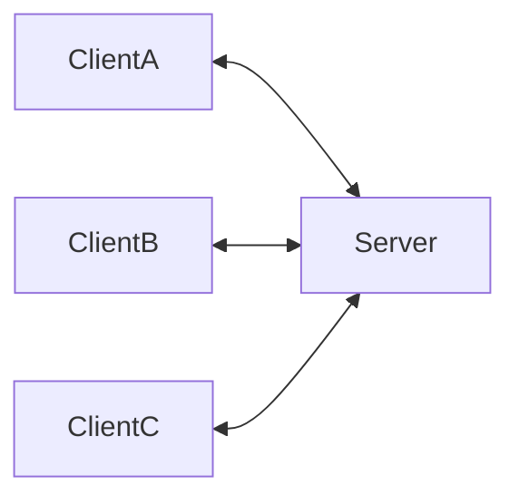
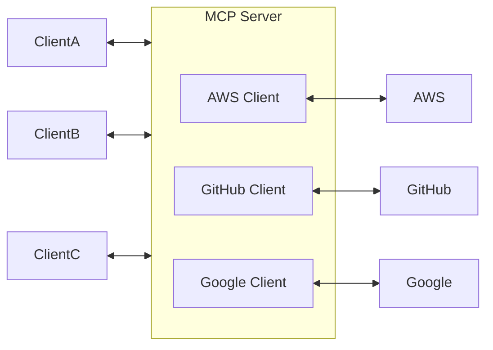
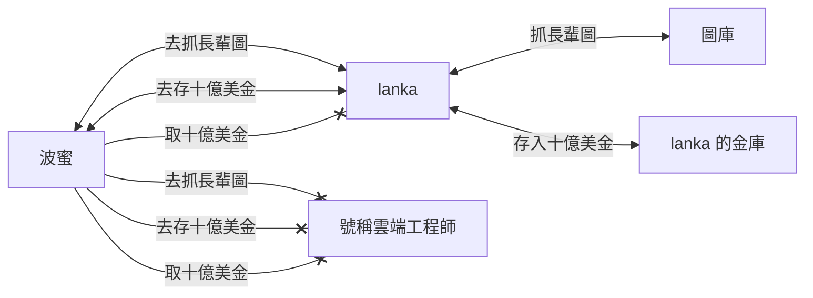

# 模型上下文協定 (MCP, Model Context Protocol)

[![GitHub license][license-image]][license-url]
[![GitHub stars][stars-image]][stars-url]
[![GitHub forks][forks-image]][forks-url]
[![GitHub issues][issues-image]][issues-image]
[![GitHub watchers][watchers-image]][watchers-image]

[license-image]: https://img.shields.io/github/license/lankahsu520/HelperX.svg
[license-url]: https://github.com/lankahsu520/HelperX/blob/master/LICENSE
[stars-image]: https://img.shields.io/github/stars/lankahsu520/HelperX.svg
[stars-url]: https://github.com/lankahsu520/HelperX/stargazers
[forks-image]: https://img.shields.io/github/forks/lankahsu520/HelperX.svg
[forks-url]: https://github.com/lankahsu520/HelperX/network
[issues-image]: https://img.shields.io/github/issues/lankahsu520/HelperX.svg
[issues-url]: https://github.com/lankahsu520/HelperX/issues
[watchers-image]: https://img.shields.io/github/watchers/lankahsu520/HelperX.svg
[watchers-url]: https://github.com/lankahsu520/HelperX/watchers

# 1. Overview

> 簡單的一句話，「只是方便 AI 嫁接 MCP Server 去“取用”資料」。
>
> 說實話，看了一說明，它們都是用一些“不利理解”的名詞去解譯名詞。建議直接去操作 MCP Server 後，反推回來是怎麼回事。

> [維基百科] [模型上下文協定](https://zh.wikipedia.org/zh-tw/模型上下文协议)
>
> **模型上下文協定**（英語：Model Context Protocol，縮寫：MCP）是 [Anthropic](https://zh.wikipedia.org/wiki/Anthropic) 所推動的一項[開放標準](https://zh.wikipedia.org/wiki/开放标准)[[1\]](https://zh.wikipedia.org/zh-tw/模型上下文协议#cite_note-1)，旨在為[大型語言模型](https://zh.wikipedia.org/wiki/大型语言模型)（LLMs）應用提供一個標準化的介面，使其能夠連接和互動外部資料來源和工具[[2\]](https://zh.wikipedia.org/zh-tw/模型上下文协议#cite_note-auto-2)。

> [ChatGPT] 什麼是 Model Context Protocol
>
> ###  1. **機器學習 / AI 系統**
>
> 在 AI 領域，"Model Context Protocol" 可能指的是：
>
> - 一種協定，用來描述或傳送**機器學習模型的上下文資訊**。
> - 例如：模型的輸入格式、版本、推論環境、token 範圍、prompt 設定等。
>
> 👀 可能用途：
>
> - 在一個系統中部署多個模型，需要靠 MCP 來協調不同模型的上下文環境。
> - 與 API、代理、Agent 協同工作的場景（如 AutoGPT、LangChain）。
>
> ###  2. **LLM（大型語言模型）框架內部機制**
>
> 例如：
>
> - OpenAI、Anthropic 或其他大型模型平台可能會用到「Model Context Protocol」來：
>   - 定義「上下文管理」的資料交換格式。
>   - 支援 prompt、記憶體、系統提示等訊息的傳遞協定。
>
> 在某些 LLM 代理架構（像 LangGraph、LangChain、AutoGen）中，你可能會看到類似 "Context Protocol" 的抽象定義（Protocol/Interface），讓模型可以保持上下文一致性。

# 2. Brainstorming

## 2.1. Client & Server

>清楚什麼是 Client，什麼是 Server。
>

## 2.2. API (Application Programming Interface)

>搞清楚 API 的功用
>
>[API (Application Programming Interface) vs. AI](https://github.com/lankahsu520/HelperX/blob/master/helper_ArtificialIntelligence.md#41-api-application-programming-interface-vs-ai)

> 如下圖 *lanka* 提供了較多服務，而 *號稱雲端工程師* 完全不符合客戶-波蜜的需求。

> 假設命令如，{"cmd":"去抓長輩圖"}、{"cmd":"去存十億美金"}、{"cmd":"取十億美金"}
>
> 當命令送達 *lanka* 或 *號稱雲端工程師* 時，在命令語法檢查是正確的，只是 *號稱雲端工程師* 一點都沒有相對應的功能。

## 2.3. Login Credentials

> 越多的需求，相應連接的 Server 也越多，當存取 Server 時，就會登入憑證的問題。 

## 2.4. Public or private data

> 接上，就算有存取權，該資料內容也要進行過濾。

## 25. The MCP Server maintenance

> 一個是執行 MCP Server 的負擔，另外還有要學習操作 MCP 等。

# 3. MCP Server

## 3.1. [Model Context Protocol servers](https://github.com/modelcontextprotocol/servers)

> # Model Context Protocol servers
>
> This repository is a collection of *reference implementations* for the [Model Context Protocol](https://modelcontextprotocol.io/) (MCP), as well as references to community built servers and additional resources.
>
> The servers in this repository showcase the versatility and extensibility of MCP, demonstrating how it can be used to give Large Language Models (LLMs) secure, controlled access to tools and data sources. Each MCP server is implemented with either the [Typescript MCP SDK](https://github.com/modelcontextprotocol/typescript-sdk) or [Python MCP SDK](https://github.com/modelcontextprotocol/python-sdk).
>
> > Note: Lists in this README are maintained in alphabetical order to minimize merge conflicts when adding new items.

## 3.2. [Use MCP servers in VS Code (Preview)](https://code.visualstudio.com/docs/copilot/chat/mcp-servers)

## 3.3. [Claude](claude.ai)

# Appendix

# I. Study

## I.1. [白話科技｜Google推A2A，大戰MCP！MCP是什麼？定義、實例一次看懂](https://www.bnext.com.tw/article/82706/what-is-mcp)

## I.2. [什麼是 MCP (Model Context Protocol) 及其工作原理](https://blog.logto.io/zh-TW/what-is-mcp)

## I.3. [從零搞懂MCP！AI超夯新詞解析與實戰案例](https://vocus.cc/article/67eac9cefd89780001bacf83)

# II. Debug

# III. Glossary

# IV. Tool Usage

# Author

> Created and designed by [Lanka Hsu](lankahsu@gmail.com).

# License

> [HelperX](https://github.com/lankahsu520/HelperX) is available under the BSD-3-Clause license. See the LICENSE file for more info.

