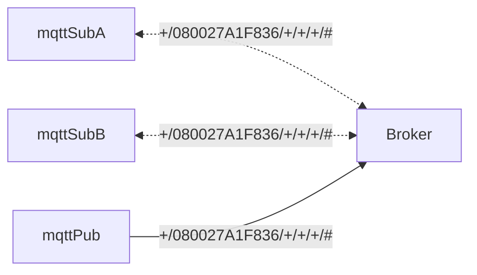

# MQTT
[](https://github.com/lankahsu520/HelperX)
[![GitHub license][license-image]][license-url]
[![GitHub stars][stars-image]][stars-url]
[![GitHub forks][forks-image]][forks-url]
[![GitHub issues][issues-image]][issues-image]
[![GitHub watchers][watchers-image]][watchers-image]

[license-image]: https://img.shields.io/github/license/lankahsu520/HelperX.svg
[license-url]: https://github.com/lankahsu520/HelperX/blob/master/LICENSE
[stars-image]: https://img.shields.io/github/stars/lankahsu520/HelperX.svg
[stars-url]: https://github.com/lankahsu520/HelperX/stargazers
[forks-image]: https://img.shields.io/github/forks/lankahsu520/HelperX.svg
[forks-url]: https://github.com/lankahsu520/HelperX/network
[issues-image]: https://img.shields.io/github/issues/lankahsu520/HelperX.svg
[issues-url]: https://github.com/lankahsu520/HelperX/issues
[watchers-image]: https://img.shields.io/github/watchers/lankahsu520/HelperX.svg
[watchers-url]: https://github.com/lankahsu520/HelperX/watchers

# 1. mosquitto

## 1.1. Install
```bash
sudo add-apt-repository ppa:mosquitto-dev/mosquitto-ppa

sudo apt-get update

sudo apt-get install mosquitto
sudo apt-get install mosquitto-clients

mosquitto -v

```

## 1.2. Run

### 1.2.1. Service

```bash
sudo systemctl status mosquitto.service

sudo systemctl stop mosquitto.service
sudo systemctl start mosquitto.service

sudo systemctl restart mosquitto.service

journalctl -xe
```

### 1.2.2. Daemon

```bash
/usr/sbin/mosquitto -c /etc/mosquitto/mosquitto.conf

sudo cat /var/log/mosquitto/mosquitto.log
```

## 1.3. Configuration

### 1.3.1. /etc/mosquitto/mosquitto.conf
```bash
$ ps -aux | grep mosquitto
mosquit+    1077  0.0  0.0  28108  5644 ?        Ssl  14:06   0:04 /usr/sbin/mosquitto -c /etc/mosquitto/mosquitto.conf

```

```bash
$ cat /etc/mosquitto/mosquitto.conf
# Place your local configuration in /etc/mosquitto/conf.d/
#
# A full description of the configuration file is at
# /usr/share/doc/mosquitto/examples/mosquitto.conf.example

pid_file /var/run/mosquitto.pid

persistence true
persistence_location /var/lib/mosquitto/

log_dest file /var/log/mosquitto/mosquitto.log

include_dir /etc/mosquitto/conf.d

```

```bash
$ ll /etc/mosquitto/conf.d
total 12
drwxr-xr-x 2 root root 4096  七  14 22:46 ./
drwxr-xr-x 5 root root 4096  七  14 22:46 ../
-rw-r--r-- 1 root root  142  三   3  2020 README

```

### 1.3.2. /etc/mosquitto/passwd

```bash
$ sudo mosquitto_passwd -c /etc/mosquitto/passwd lanka 

$ sudo mosquitto_passwd -b /etc/mosquitto/passwd apple apple520

$ cat /etc/mosquitto/passwd

```

### 1.3.3. /etc/mosquitto/acl

```bash
$ sudo vi /etc/mosquitto/acl

```

```bash
user lanka
topic #
topic $SYS/#

user apple
topic apple/#

```

### 1.3.4. /etc/mosquitto/conf.d/default.conf

```bash
$ sudo vi /etc/mosquitto/conf.d/default.conf

```
```
# 設定帳號密碼檔案
password_file /etc/mosquitto/passwd
acl_file /etc/mosquitto/acl

# 禁止匿名登入
#allow_anonymous false
allow_anonymous false

#listener 3881
listener 1883
protocol mqtt
#cafile /etc/mosquitto/certs/mqtt.ca
#keyfile /etc/mosquitto/certs/mqtt_srv.key
#certfile /etc/mosquitto/certs/mqtt_srv.crt

require_certificate false

# WS
listener 8083
protocol websockets
#cafile /etc/mosquitto/certs/mqtt.ca
#keyfile /etc/mosquitto/certs/mqtt_srv.key
#certfile /etc/mosquitto/certs/mqtt_srv.crt

#require_certificate true

```

# 2. Test


## 2.1. Topic

```
a/b/c/d
+/b/c/d
a/+/c/d
a/+/+/d
+/+/+/+

#
a/#
a/b/#
a/b/c/#
+/b/c/#
```

#### methodid/macid/uuid/nodeid/epid/issueid

```bash
methodid - 1:event, 2:get, 3: response
macid - mac address
uuid - maybe a usb uuid, a group uuid or special function uuid 
```


## 2.2. Subscriber

#### mqttSub.sh

```bash
./mqttSub.sh '+/080027A1F836/+/+/+/#'

```
## 2.3. Publisher

#### mqttPub.sh

```bash
./mqttPub.sh "1/080027A1F836/CCC3F3BB/2/0/0001000C" '{"name":"Motion Sensor","val":"idle"}'
./mqttPub.sh "1/080027A1F836/CCC3F3BB/2/0/0001000C" ''{"name":"Motion Sensor","val":"idle"}'

#** adding ** 
./mqttPub.sh "1/080027A1F836/FDFD818A/1/0/00000002" '{}'
#** removing ** 
./mqttPub.sh "1/080027A1F836/FDFD818A/1/0/00000003" '{}'
#** aborting ** 
./mqttPub.sh "1/080027A1F836/FDFD818A/1/0/00000004" '{}'
#** reseting ** 
./mqttPub.sh "1/080027A1F836/FDFD818A/1/0/00000008" '{}'
#** switch ** 
./mqttPub.sh "1/080027A1F836/FDFD818A/2/0/00092501" '{"tgt_val":255}'
./mqttPub.sh "1/080027A1F836/FDFD818A/2/0/00092501" '{"toggle":1}'

#** dimmer ** 
./mqttPub.sh "1/080027A1F836/FDFD818A/3/0/00092601" '{"dur":5,"tgt_val":0}'
./mqttPub.sh "1/080027A1F836/FDFD818A/3/0/00092601" '{"toggle":1}'

./mqttPub.sh "2/080027A1F836/FDFD818A" '{}'

```
# 3. Cert

```bash
openssl x509 -noout -modulus -in mqtt_beex.crt | openssl md5
openssl rsa  -noout -modulus -in mqtt_beex.key | openssl md5
openssl x509 -noout -modulus -in mqtt.ca | openssl md5

```

# Appendix

# I. Study

#### A. [樹莓派安裝 Mosquitto 輕量級 MQTT Broker 教學，連接各種物聯網設備](https://blog.gtwang.org/iot/raspberry-pi/raspberry-pi-mosquitto-mqtt-broker-iot-integration/)

#### B. [MQTT教學（一）：認識MQTT](https://swf.com.tw/?p=1002)

#### C. [MQTT(三)CONNECT Message](http://blog.maxkit.com.tw/2014/02/mqttconnect-message.html)

#### D. [MQTT(四)PUBLISH Message](http://blog.maxkit.com.tw/2014/02/mqttpublish-message.html)

#### E. [如何在Ubuntu 16.04上安装和保护Mosquitto MQTT消息传递代理](https://www.howtoing.com/how-to-install-and-secure-the-mosquitto-mqtt-messaging-broker-on-ubuntu-16-04/)

#### F. [Mosquitto ACL -Configuring and Testing MQTT Topic Restrictions](http://www.steves-internet-guide.com/topic-restriction-mosquitto-configuration/)

# II. Debug

# III. Tool Usage

# Author

Created and designed by [Lanka Hsu](lankahsu@gmail.com).

# License

[HelperX](https://github.com/lankahsu520/HelperX) is available under the BSD-3-Clause license. See the LICENSE file for more info.

