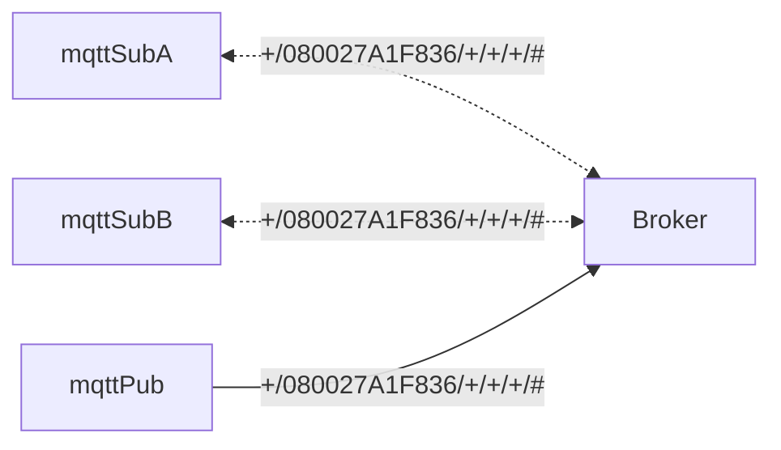

# MQTT
[](https://github.com/lankahsu520/HelperX)
[![GitHub license][license-image]][license-url]
[![GitHub stars][stars-image]][stars-url]
[![GitHub forks][forks-image]][forks-url]
[![GitHub issues][issues-image]][issues-image]
[![GitHub watchers][watchers-image]][watchers-image]

[license-image]: https://img.shields.io/github/license/lankahsu520/HelperX.svg
[license-url]: https://github.com/lankahsu520/HelperX/blob/master/LICENSE
[stars-image]: https://img.shields.io/github/stars/lankahsu520/HelperX.svg
[stars-url]: https://github.com/lankahsu520/HelperX/stargazers
[forks-image]: https://img.shields.io/github/forks/lankahsu520/HelperX.svg
[forks-url]: https://github.com/lankahsu520/HelperX/network
[issues-image]: https://img.shields.io/github/issues/lankahsu520/HelperX.svg
[issues-url]: https://github.com/lankahsu520/HelperX/issues
[watchers-image]: https://img.shields.io/github/watchers/lankahsu520/HelperX.svg
[watchers-url]: https://github.com/lankahsu520/HelperX/watchers

# 1. mosquitto

## 1.1. Install
```bash
sudo add-apt-repository ppa:mosquitto-dev/mosquitto-ppa

sudo apt-get update

sudo apt-get install mosquitto
sudo apt-get install mosquitto-clients

mosquitto -v
```

## 1.2. Run

### 1.2.1. Service

```bash
sudo systemctl status mosquitto.service

sudo systemctl stop mosquitto.service
sudo systemctl start mosquitto.service

sudo systemctl restart mosquitto.service

journalctl -xe
```

### 1.2.2. Daemon

```bash
/usr/sbin/mosquitto -c /etc/mosquitto/mosquitto.conf

sudo cat /var/log/mosquitto/mosquitto.log
```

## 1.3. Configuration

### 1.3.1. /etc/mosquitto/mosquitto.conf
```bash
$ ps -aux | grep mosquitto
mosquit+    1077  0.0  0.0  28108  5644 ?        Ssl  14:06   0:04 /usr/sbin/mosquitto -c /etc/mosquitto/mosquitto.conf

```

```bash
$ cat /etc/mosquitto/mosquitto.conf
# Place your local configuration in /etc/mosquitto/conf.d/
#
# A full description of the configuration file is at
# /usr/share/doc/mosquitto/examples/mosquitto.conf.example

pid_file /var/run/mosquitto.pid

persistence true
persistence_location /var/lib/mosquitto/

log_dest file /var/log/mosquitto/mosquitto.log

include_dir /etc/mosquitto/conf.d

```

```bash
$ ll /etc/mosquitto/conf.d
total 12
drwxr-xr-x 2 root root 4096  七  14 22:46 ./
drwxr-xr-x 5 root root 4096  七  14 22:46 ../
-rw-r--r-- 1 root root  142  三   3  2020 README

```

### 1.3.2. /etc/mosquitto/passwd

```bash
$ sudo mosquitto_passwd -c /etc/mosquitto/passwd lanka 

$ sudo mosquitto_passwd -b /etc/mosquitto/passwd apple apple520

$ cat /etc/mosquitto/passwd

```

### 1.3.3. /etc/mosquitto/acl

```bash
$ sudo vi /etc/mosquitto/acl

```

```bash
user lanka
topic #
topic $SYS/#

user apple
topic apple/#

```

### 1.3.4. /etc/mosquitto/conf.d/default.conf

```bash
$ sudo vi /etc/mosquitto/conf.d/default.conf

```
```
# 設定帳號密碼檔案
password_file /etc/mosquitto/passwd
acl_file /etc/mosquitto/acl

# 禁止匿名登入
#allow_anonymous false
allow_anonymous false

#listener 3881
listener 1883
protocol mqtt
#cafile /etc/mosquitto/certs/mqtt.ca
#keyfile /etc/mosquitto/certs/mqtt_srv.key
#certfile /etc/mosquitto/certs/mqtt_srv.crt

require_certificate false

# WS
listener 8083
protocol websockets
#cafile /etc/mosquitto/certs/mqtt.ca
#keyfile /etc/mosquitto/certs/mqtt_srv.key
#certfile /etc/mosquitto/certs/mqtt_srv.crt

#require_certificate true

```

# 2. Test


## 2.1. Topic

```
a/b/c/d
+/b/c/d
a/+/c/d
a/+/+/d
+/+/+/+

#
a/#
a/b/#
a/b/c/#
+/b/c/#
```

> methodid/macid/uuid/nodeid/epid/issueid
>
> methodid - 1:event, 2:get, 3: response
> macid - mac address
> uuid - maybe a usb uuid, a group uuid or special function uuid


## 2.2. Subscriber

#### A. mqttSub.sh

```bash
$ ./mqttSub.sh '+/080027A1F836/+/+/+/#'
20240311160029 mqttSub.sh|start_fn:97- [mosquitto_sub -h 127.0.0.1 -p 1883 -u apple -P apple520     -t 'apple/+/080027A1F836/+/+/+/#' ]

```
## 2.3. Publisher

#### A. mqttPub.sh

##### A.1. event

```bash
$ ./mqttPub.sh "1/080027A1F836/CCC3F3BB/2/0/0001000C" '{"name":"Motion Sensor","val":"idle"}'
20240311160125 mqttPub.sh|start_fn:98- [mosquitto_pub -h 127.0.0.1 -p 1883 -u apple -P apple520     -t 'apple/1/080027A1F836/CCC3F3BB/2/0/0001000C' -m '{name:Motion Sensor,val:idle}']

$ ./mqttPub.sh "1/080027A1F836/CCC3F3BB/2/0/0001000C" '{"name":"Motion Sensor","val":"idle"}'
20240311160146 mqttPub.sh|start_fn:98- [mosquitto_pub -h 127.0.0.1 -p 1883 -u apple -P apple520     -t 'apple/1/080027A1F836/CCC3F3BB/2/0/0001000C' -m '{name:Motion Sensor,val:idle}']
```

```bash
#** adding ** 
./mqttPub.sh "1/080027A1F836/FDFD818A/1/0/00000002" '{}'
#** removing ** 
./mqttPub.sh "1/080027A1F836/FDFD818A/1/0/00000003" '{}'
#** aborting ** 
./mqttPub.sh "1/080027A1F836/FDFD818A/1/0/00000004" '{}'
#** reseting ** 
./mqttPub.sh "1/080027A1F836/FDFD818A/1/0/00000008" '{}'
#** switch ** 
./mqttPub.sh "1/080027A1F836/FDFD818A/2/0/00092501" '{"tgt_val":255}'
./mqttPub.sh "1/080027A1F836/FDFD818A/2/0/00092501" '{"toggle":1}'
#** dimmer ** 
./mqttPub.sh "1/080027A1F836/FDFD818A/3/0/00092601" '{"dur":5,"tgt_val":0}'
./mqttPub.sh "1/080027A1F836/FDFD818A/3/0/00092601" '{"toggle":1}'

```
##### A.2. get

```bash
#** get ** 
./mqttPub.sh "2/080027A1F836/FDFD818A" '{}'
```

##### A.3. response

```bash

```

# 3. Cert

```bash
openssl x509 -noout -modulus -in mqtt_beex.crt | openssl md5
openssl rsa  -noout -modulus -in mqtt_beex.key | openssl md5
openssl x509 -noout -modulus -in mqtt.ca | openssl md5

```

# Appendix

# I. Study

## I.1. [樹莓派安裝 Mosquitto 輕量級 MQTT Broker 教學，連接各種物聯網設備](https://blog.gtwang.org/iot/raspberry-pi/raspberry-pi-mosquitto-mqtt-broker-iot-integration/)

## I.2. [MQTT教學（一）：認識MQTT](https://swf.com.tw/?p=1002)

## I.3. [MQTT(三)CONNECT Message](http://blog.maxkit.com.tw/2014/02/mqttconnect-message.html)

## I.4. [MQTT(四)PUBLISH Message](http://blog.maxkit.com.tw/2014/02/mqttpublish-message.html)

## I.5. [如何在Ubuntu 16.04上安装和保护Mosquitto MQTT消息传递代理](https://www.howtoing.com/how-to-install-and-secure-the-mosquitto-mqtt-messaging-broker-on-ubuntu-16-04/)

## I.6. [Mosquitto ACL -Configuring and Testing MQTT Topic Restrictions](http://www.steves-internet-guide.com/topic-restriction-mosquitto-configuration/)

## I.7. [MQTT Server Support](https://github.com/mqtt/mqtt.org/wiki/server-support)

# II. Debug

# III. Glossary

#### MQTT access-control

>[ChatGPT]
>
>以下是MQTT access-control的一些功能和作用：
>
>1. 身份驗證（Authentication）：Access-control可用於驗證連接到MQTT broker的客戶端的身份。這可以通過使用用戶名和密碼、憑證或其他驗證機制來實現。身份驗證確保只有經過授權的用戶可以建立連接，從而防止未經授權的訪問。
>2. 授權（Authorization）：一旦客戶端通過身份驗證，access-control可用於授予或拒絕客戶端對MQTT broker的訪問權限。這可以通過設定特定主題（Topic）的讀取（Subscribe）和發布（Publish）權限來實現。授權確保只有具有權限的客戶端可以訪問特定主題或執行特定操作。
>3. 安全性（Security）：MQTT access-control有助於確保通信的安全性。通過限制訪問和操作權限，它可以防止未經授權的訪問和潛在的安全風險。這對於保護敏感數據、防止未經授權的控制和確保合法訪問非常重要。
>4. 監控和日誌（Monitoring and Logging）：access-control機制可以提供監控和日誌記錄的功能。它可以記錄用戶的操作和訪問行為，以便後續審計和故障排除。這有助於追踪和分析MQTT通信，確保合規性和安全性。
>
>總而言之，MQTT access-control功能的主要目的是確保只有經過授權的實體可以訪問MQTT broker，並限制他們對主題的訪問和操作。這有助於確保安全性、保護數據和設備，並提供監控和日誌記錄功能。

#### MQTT clustering

>[ChatGPT]
>
>1. 高可用性：通過將多個 Mosquitto 代理器連接在一起形成叢集，即使其中一個代理器發生故障，仍然可以保持 MQTT 消息服務的可用性。當一個代理器失效時，其他代理器可以接管處理消息流量，確保消息的連續傳遞和處理。
>2. 負載均衡：Mosquitto 叢集可以通過將客戶端的連接分配到不同的代理器上，實現負載均衡。這可以幫助平衡代理器之間的工作負載，提高整體性能和效率。
>3. 可擴展性：透過添加更多的 Mosquitto 代理器到叢集中，可以實現系統的水平擴展。這使得系統能夠處理更大量的消息和更多的客戶端連接，以應對不斷增長的需求。
>4. 數據冗餘和持久性：Mosquitto 叢集可以配置為在多個代理器之間複製和同步消息數據，從而提供數據冗餘和持久性。即使其中一個代理器發生故障，消息數據仍然可以從其他代理器獲取，確保不會丟失重要的消息。
>
>總之，Mosquitto 叢集可以提供高可用性、負載均衡、可擴展性和數據冗餘等功能，從而增強 MQTT 消息傳輸系統的穩定性和可靠性。

#### MQTT message-retention

>[ChatGPT]
>
>MQTT message retention（MQTT訊息保留）是MQTT協議中的一個特性，它允許訂閱者在訂閱主題時接收最後一個已保留的訊息。
>
>當一個發佈者（Publisher）通過MQTT協議發布一個訊息到特定主題（Topic）時，訊息可以被保留在MQTT broker上。這意味著即使當沒有訂閱者處於活躍狀態，新的訂閱者在訂閱相同的主題時仍然能夠接收到最後一次已保留的訊息。這個保留的訊息被稱為保留訊息（Retained message）。
>
>保留訊息在MQTT協議中具有以下特點：
>
>1. 最新的訊息：保留訊息總是保持最新的狀態。當一個新的保留訊息被發布到特定主題時，它將替換之前的保留訊息，以便新的訂閱者能夠接收到最新的訊息。
>2. 特定主題：保留訊息是與特定主題相關聯的。訂閱者只能接收到與他們訂閱的主題相關的保留訊息。
>3. 非強制性：發布者可以選擇是否要將訊息保留為保留訊息。如果發布者未指定保留標誌，則該訊息不會被保留，新的訂閱者將無法接收到之前的訊息。
>
>MQTT的訊息保留功能提供了靈活且便捷的方式，讓新的訂閱者能夠獲取到重要的訊息，即使在它們訂閱之前該訊息已經被發布。這在某些應用中特別有用，例如裝置狀態更新、事件通知等。

# IV. Tool Usage

# Author

> Created and designed by [Lanka Hsu](lankahsu@gmail.com).

# License

> [HelperX](https://github.com/lankahsu520/HelperX) is available under the BSD-3-Clause license. See the LICENSE file for more info.

