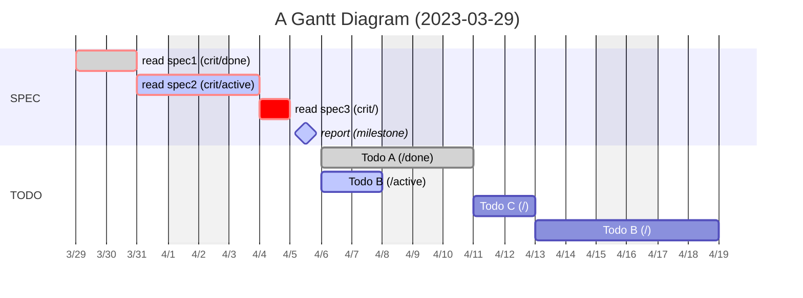

# MarkDown

[](https://github.com/lankahsu520/HelperX)
[![GitHub license][license-image]][license-url]
[![GitHub stars][stars-image]][stars-url]
[![GitHub forks][forks-image]][forks-url]
[![GitHub issues][issues-image]][issues-image]
[![GitHub watchers][watchers-image]][watchers-image]

[license-image]: https://img.shields.io/github/license/lankahsu520/HelperX.svg
[license-url]: https://github.com/lankahsu520/HelperX/blob/master/LICENSE
[stars-image]: https://img.shields.io/github/stars/lankahsu520/HelperX.svg
[stars-url]: https://github.com/lankahsu520/HelperX/stargazers
[forks-image]: https://img.shields.io/github/forks/lankahsu520/HelperX.svg
[forks-url]: https://github.com/lankahsu520/HelperX/network
[issues-image]: https://img.shields.io/github/issues/lankahsu520/HelperX.svg
[issues-url]: https://github.com/lankahsu520/HelperX/issues
[watchers-image]: https://img.shields.io/github/watchers/lankahsu520/HelperX.svg
[watchers-url]: https://github.com/lankahsu520/HelperX/watchers

# 1. 段落

## 1.1. 標題

# Header 1

## Header 2

### Header 3

#### Header 4

##### Header 5

## 1.2. 清單

### 1.2.1. 無序清單

-   Red
-   Green
-   Blue

```
-   Red
-   Green
-   Blue
```

### 1.2.2. 有序清單

1. Red
2. Green
3. Blue

```
1. Red
2. Green
3. Blue
```
### 1.2.3. 工作清單
- [x] Task A
- [ ] Task B
- [ ] Task C
```
- [x] Task A
- [ ] Task B
- [ ] Task C
```

## 1.3. 引言

> 這是引言

```
> 這是引言

```

## 1.4. 程式碼區塊

```
程式碼區塊
```

````
```
程式碼區塊
```
````

## 1.5. 分格線
***
---

```
***
---
```

## 1.6. 註腳

> 這邊示範註腳[^註腳1]

[^註腳1]:請寫下註腳的描述
```
[^註腳1]

[^註腳1]:請寫下註腳的描述
```

## 1.7. 參考連結

> 參考連結 [google][1]

[1]: http://www.google.com	"Google"

```
[google][1]

[1]: http://www.google.com	"Google"

```
# 2. 表格

| ID         | NAME      | Desc |
| ---------- | --------- | ---- |
| A123456789 | Lanka Hsu | Boss |
| A888888888 | Mary      | Wife |
|            |           |      |

# 3. 格式

> **粗體**
```
**粗體**
```

> *斜體*
```
*斜體*
```

> <u>底線</u>

```
<u>底線</u>
```

> `程式碼`

```
`程式碼`
```

> ~~刪除線~~

```
~~刪除線~~
```

> <!--註解-->

```
<!--註解-->
```

> 超連結
>
> [HelperX](https://github.com/lankahsu520/HelperX)

```
[HelperX](https://github.com/lankahsu520/HelperX)
```
> 圖片
> 
```

```

# 4. [特殊特元](https://chukaml.tripod.com/linguistics/charCode/)

> AT&amp;T
>

```
AT&amp;T
```

> 4 &lt; 5

```
4 &lt; 5
```

>&copy;
```
&copy;
```

# 5. [Mermaid](https://mermaid.js.org/)

## 5.1. [Gantt diagrams](https://mermaid.js.org/syntax/gantt.html)

> 以下內容取自於 https://mermaid.js.org/syntax/gantt.html

#### A. A Gantt Diagram



#### B. Input date format[#](https://mermaid.js.org/syntax/gantt.html#input-date-format)

The default input date format is `YYYY-MM-DD`. You can define your custom `dateFormat`.

```
dateFormat YYYY-MM-DD
```

The following formatting options are supported:

```
Input       Example             Description:
YYYY        2014                4 digit year
YY          14                  2 digit year
Q           1..4                Quarter of year. Sets month to first month in quarter.
M MM        1..12               Month number
MMM MMMM    January..Dec        Month name in locale set by moment.locale()
D DD        1..31               Day of month
Do          1st..31st           Day of month with ordinal
DDD DDDD    1..365              Day of year
X           1410715640.579      Unix timestamp
x           1410715640579       Unix ms timestamp
H HH        0..23               24 hour time
h hh        1..12               12 hour time used with a A.
a A         am pm               Post or ante meridiem
m mm        0..59               Minutes
s ss        0..59               Seconds
S           0..9                Tenths of a second
SS          0..99               Hundreds of a second
SSS         0..999              Thousandths of a second
Z ZZ        +12:00              Offset from UTC as +-HH:mm, +-HHmm, or Z
```

More info in: https://momentjs.com/docs/#/parsing/string-format/

#### C. Output date format on the axis[#](https://mermaid.js.org/syntax/gantt.html#output-date-format-on-the-axis)

The default output date format is `YYYY-MM-DD`. You can define your custom `axisFormat`, like `2020-Q1` for the first quarter of the year 2020.

```
axisFormat  %Y-%m-%d
```

The following formatting strings are supported:

```
%a - abbreviated weekday name.
%A - full weekday name.
%b - abbreviated month name.
%B - full month name.
%c - date and time, as "%a %b %e %H:%M:%S %Y".
%d - zero-padded day of the month as a decimal number [01,31].
%e - space-padded day of the month as a decimal number [ 1,31]; equivalent to %_d.
%H - hour (24-hour clock) as a decimal number [00,23].
%I - hour (12-hour clock) as a decimal number [01,12].
%j - day of the year as a decimal number [001,366].
%m - month as a decimal number [01,12].
%M - minute as a decimal number [00,59].
%L - milliseconds as a decimal number [000, 999].
%p - either AM or PM.
%S - second as a decimal number [00,61].
%U - week number of the year (Sunday as the first day of the week) as a decimal number [00,53].
%w - weekday as a decimal number [0(Sunday),6].
%W - week number of the year (Monday as the first day of the week) as a decimal number [00,53].
%x - date, as "%m/%d/%Y".
%X - time, as "%H:%M:%S".
%y - year without century as a decimal number [00,99].
%Y - year with century as a decimal number.
%Z - time zone offset, such as "-0700".
%% - a literal "%" character.
```

More info in: https://github.com/d3/d3-time-format/tree/v4.0.0#locale_format

#### D. Axis ticks[#](https://mermaid.js.org/syntax/gantt.html#axis-ticks)

The default output ticks are auto. You can custom your `tickInterval`, like `1day` or `1week`.

```
tickInterval 1day
```

The pattern is:

```
/^([1-9][0-9]*)(minute|hour|day|week|month)$/
```

More info in: https://github.com/d3/d3-time#interval_every

# Appendix

# I. Study

#### A. [Mermaid](https://mermaid.js.org/)

#### B. [mermaid-js](https://github.com/mermaid-js)/[mermaid](https://github.com/mermaid-js/mermaid)

#### C. [Markdown 语法・简明版](https://keatonlao.gitee.io/a-study-note-for-markdown/syntax/)
#### D. [Markdown文件](https://markdown.tw)

#### E. [adrai](https://github.com/adrai)/[flowchart.js](https://github.com/adrai/flowchart.js)

#### F. [MarkDown flow流程图示例](https://www.jianshu.com/p/f28c94cf1204)

#### G [typora 画流程图、时序图(顺序图)、甘特图](https://www.runoob.com/note/47651)

#### H. [超文本標示語言的字元代碼（Character Codes in HTML）](https://chukaml.tripod.com/linguistics/charCode/)

#### I. [HTML特殊字符編碼](https://www.ifreesite.com/html-entities.htm)

# II. Debug

# III. Glossary

# IV. Tool Usage

# V. Tools

## V.1. [typora](https://typora.io)

# Author

Created and designed by [Lanka Hsu](lankahsu@gmail.com).

# License

[HelperX](https://github.com/lankahsu520/HelperX) is available under the BSD-3-Clause license. See the LICENSE file for more info.

