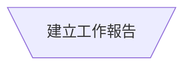
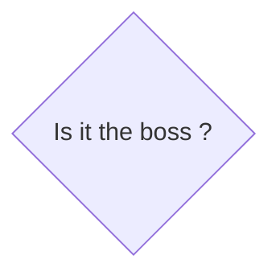
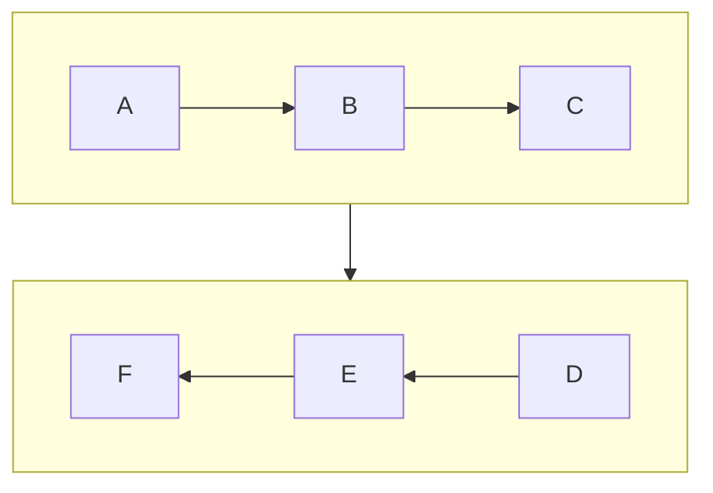

# MarkDown
[](https://github.com/lankahsu520/HelperX)
[![GitHub license][license-image]][license-url]
[![GitHub stars][stars-image]][stars-url]
[![GitHub forks][forks-image]][forks-url]
[![GitHub issues][issues-image]][issues-image]
[![GitHub watchers][watchers-image]][watchers-image]

[license-image]: https://img.shields.io/github/license/lankahsu520/HelperX.svg
[license-url]: https://github.com/lankahsu520/HelperX/blob/master/LICENSE
[stars-image]: https://img.shields.io/github/stars/lankahsu520/HelperX.svg
[stars-url]: https://github.com/lankahsu520/HelperX/stargazers
[forks-image]: https://img.shields.io/github/forks/lankahsu520/HelperX.svg
[forks-url]: https://github.com/lankahsu520/HelperX/network
[issues-image]: https://img.shields.io/github/issues/lankahsu520/HelperX.svg
[issues-url]: https://github.com/lankahsu520/HelperX/issues
[watchers-image]: https://img.shields.io/github/watchers/lankahsu520/HelperX.svg
[watchers-url]: https://github.com/lankahsu520/HelperX/watchers

# 1. 段落

## 1.1. 標題

# Header 1

## Header 2

### Header 3

#### Header 4

##### Header 5

## 1.2. 清單

### 1.2.1. 無序清單

-   Red
-   Green
-   Blue

```
-   Red
-   Green
-   Blue
```

### 1.2.2. 有序清單

1. Red
2. Green
3. Blue

```
1. Red
2. Green
3. Blue
```
### 1.2.3. 工作清單
- [x] Task A
- [ ] Task B
- [ ] Task C
```
- [x] Task A
- [ ] Task B
- [ ] Task C
```

## 1.3. 引言

> 這是引言

```
> 這是引言

```

## 1.4. 程式碼區塊

```
程式碼區塊
```

````
```
程式碼區塊
```
````

## 1.5. 分格線
***
---

```
***
---
```

## 1.6. 註腳

> 這邊示範註腳[^註腳1]

[^註腳1]:請寫下註腳的描述
```
[^註腳1]

[^註腳1]:請寫下註腳的描述
```

## 1.7. 參考連結

> 參考連結 [google][1]

[1]: http://www.google.com	"Google"

```
[google][1]

[1]: http://www.google.com	"Google"

```
# 2. 表格

| ID         | NAME      | Desc |
| ---------- | --------- | ---- |
| A123456789 | Lanka Hsu | Boss |
| A888888888 | Mary      | Wife |
|            |           |      |

# 3. 格式

> **粗體**
```
**粗體**
```

> *斜體*
```
*斜體*
```

> <u>底線</u>

```
<u>底線</u>
```

> `程式碼`

```
`程式碼`
```

> ~~刪除線~~

```
~~刪除線~~
```

> <!--註解-->

```
<!--註解-->
```

> 超連結
>
> [HelperX](https://github.com/lankahsu520/HelperX)

```
[HelperX](https://github.com/lankahsu520/HelperX)
```
> 圖片
> 
```

```

# 4. [特殊特元](https://chukaml.tripod.com/linguistics/charCode/)

> AT&amp;&#40;T&#41;

```
AT&amp;&#40;T&#41;
```

> 4 &lt; 5

```
4 &lt; 5
```

>&copy;
```
&copy;
```

# 5. [Mermaid](https://mermaid.js.org/)

## 5.1. [Gantt diagrams](https://mermaid.js.org/syntax/gantt.html)

> 以下內容取自於 https://mermaid.js.org/syntax/gantt.html

#### A. A Gantt Diagram


#### B. Input date format[#](https://mermaid.js.org/syntax/gantt.html#input-date-format)

The default input date format is `YYYY-MM-DD`. You can define your custom `dateFormat`.

```
dateFormat YYYY-MM-DD
```

The following formatting options are supported:

```
Input       Example             Description:
YYYY        2014                4 digit year
YY          14                  2 digit year
Q           1..4                Quarter of year. Sets month to first month in quarter.
M MM        1..12               Month number
MMM MMMM    January..Dec        Month name in locale set by moment.locale()
D DD        1..31               Day of month
Do          1st..31st           Day of month with ordinal
DDD DDDD    1..365              Day of year
X           1410715640.579      Unix timestamp
x           1410715640579       Unix ms timestamp
H HH        0..23               24 hour time
h hh        1..12               12 hour time used with a A.
a A         am pm               Post or ante meridiem
m mm        0..59               Minutes
s ss        0..59               Seconds
S           0..9                Tenths of a second
SS          0..99               Hundreds of a second
SSS         0..999              Thousandths of a second
Z ZZ        +12:00              Offset from UTC as +-HH:mm, +-HHmm, or Z
```

More info in: https://momentjs.com/docs/#/parsing/string-format/

#### C. Output date format on the axis[#](https://mermaid.js.org/syntax/gantt.html#output-date-format-on-the-axis)

The default output date format is `YYYY-MM-DD`. You can define your custom `axisFormat`, like `2020-Q1` for the first quarter of the year 2020.

```
axisFormat  %Y-%m-%d
```

The following formatting strings are supported:

```
%a - abbreviated weekday name.
%A - full weekday name.
%b - abbreviated month name.
%B - full month name.
%c - date and time, as "%a %b %e %H:%M:%S %Y".
%d - zero-padded day of the month as a decimal number [01,31].
%e - space-padded day of the month as a decimal number [ 1,31]; equivalent to %_d.
%H - hour (24-hour clock) as a decimal number [00,23].
%I - hour (12-hour clock) as a decimal number [01,12].
%j - day of the year as a decimal number [001,366].
%m - month as a decimal number [01,12].
%M - minute as a decimal number [00,59].
%L - milliseconds as a decimal number [000, 999].
%p - either AM or PM.
%S - second as a decimal number [00,61].
%U - week number of the year (Sunday as the first day of the week) as a decimal number [00,53].
%w - weekday as a decimal number [0(Sunday),6].
%W - week number of the year (Monday as the first day of the week) as a decimal number [00,53].
%x - date, as "%m/%d/%Y".
%X - time, as "%H:%M:%S".
%y - year without century as a decimal number [00,99].
%Y - year with century as a decimal number.
%Z - time zone offset, such as "-0700".
%% - a literal "%" character.
```

More info in: https://github.com/d3/d3-time-format/tree/v4.0.0#locale_format

#### D. Axis ticks[#](https://mermaid.js.org/syntax/gantt.html#axis-ticks)

The default output ticks are auto. You can custom your `tickInterval`, like `1day` or `1week`.

```
tickInterval 1day
```

The pattern is:

```
/^([1-9][0-9]*)(minute|hour|day|week|month)$/
```

More info in: https://github.com/d3/d3-time#interval_every

## 5.2. Flowchart

### 5.2.1. Sample

```mermaid
flowchart TD

%% TB - top to bottom
%% this is a comment; Start --> Process --> End
	Start([起始點])
	register{{註冊 signal}}
	input[/輸入名稱/]
	isboss{Is it the boss ?}
	Process[程序]
	Manual[\建立工作報告/]
	Subroutine[[子程序]]
	Database[(SQL)]
	print[/print Hello Boss !!/]

	AlternateProcess(替代流程 Plan B)
	End([結束點]) 

	Start-->|流程線|register-->input-->isboss-->|yes|print--> End
	
	isboss-->|no|Process-->Subroutine-->Manual--> End
	Subroutine-->Database
	input..-> AlternateProcess --> End

```

### 5.2.2. [Flowchart Symbols Defined](https://www.breezetree.com/articles/excel-flowchart-shapes/)

> 以下引言取自於 https://www.breezetree.com/articles/excel-flowchart-shapes/

#### A. Process / Operation Symbols

##### A.1. Process

> Show a Process or action step. This is the most common symbol in both process flowcharts and process maps.


```
Process[程序]
```

##### A.2. Subroutine

> A Predefined Process symbol is a marker for another process step or series of process flow steps that are formally defined elsewhere. This shape commonly depicts sub-processes (or subroutines in programming flowcharts). If the sub-process is considered "known" but not actually defined in a process procedure, work instruction, or some other process flowchart or documentation, then it is best not to use this symbol since it implies a formally defined process.


```
Subroutine[[子程序]]
```
##### A.3. Alternate Process

> As the shape name suggests, this flowchart symbol is used when the process flow step is an alternate to the normal process step. Flow lines into an alternate process flow step are typically dashed.


```
AlternateProcess(替代流程 Plan B)
```

##### A.4. Delay

> The Delay flowchart symbol depicts any waiting period that is part of a process. Delay shapes are common in process mapping.

##### A.5. Preparation

> As the names states, any process step that is a Preparation process flow step, such as a set-up operation.
>
> 前置作業，一般多為安裝、設定


```
register{{註冊 signal}}
```

##### A.6. Manual Operation

> Manual Operations flowchart shapes show which process steps are not automated. In data processing flowcharts, this data flow shape indicates a looping operation along with a loop limit symbol (which is not supported by Microsoft Office, but a Manual Operation symbol rotated 180° will do the trick.)
>
> 非自動化，需人工參與



```
Manual[\建立工作報告/]
```

#### B. Branching and Control of Flow Symbols

##### B.1. Flow Line (Arrow, Connector)

> Flow line connectors show the direction that the process flows.


```
A-->B
```

##### B.2. Terminator (Terminal Point, Oval)

> Terminators show the start and stop points in a process. When used as a Start symbol, terminators depict a *trigger action* that sets the process flow into motion.


```
Start([起始點])
End([結束點]) 

```

##### B.3. Decision

>Indicates a question or branch in the process flow. Typically, a Decision flowchart shape is used when there are 2 options (Yes/No, No/No-Go, etc.)



```
isboss{Is it the boss ?} 
```

##### B.4. Connector (Inspection)

>**Flowchart**: In flowcharts, this symbol is typically small and is used as a Connector to show a jump from one point in the process flow to another. Connectors are usually labeled with capital letters (A, B, AA) to show matching jump points. They are handy for avoiding flow lines that cross other shapes and flow lines. They are also handy for jumping to and from a sub-processes defined in a separate area than the main flowchart.
>**Process Mapping**: In process maps, this symbol is full sized and shows an Inspection point in the process flow.
>
>*[Just to confuse things further, some people will use a circle to indicate an operation and a square to indicate an inspection. That's why it's important to include a symbol key in the flowchart.]*


```
# 這個跟預期的完全不同，暫不要使用
Connector((Connector))

```

#### C. Flow Line (Arrow, Connector)

> Flow line connectors show the direction that the process flows.

##### C.1. Simple


```
A-->|arrow head|B
C---|open link|D
E-.->|Dotted link|F
G==>|Thick link|H
I~~~J
I --o J
K --x L
```

##### C.2. Multi directional arrows


```
A o--o B
B <--> C
C x--x D
```

##### C.3. Chaining of links


```
A -- text --> B -- text2 --> C

a --> b & c--> d

```


```
X & Y--> Z & W

A --> C
A --> D
B --> C
B --> D
```

#### D. Subgraphs


```
flowchart LR
	subgraph aws
		ec2
		DynamoDB
	end

	subgraph pc
		ssh
	end
	
	pc ---> |network|aws
	ssh --> ec2 --> |aws cli|DynamoDB
```

##### D.1. Direction

> 這功能還不是很完備，如果變成 C-->D就會失效。



```
flowchart TD

subgraph Z[" "]
direction LR
  A --> B
  B --> C
end

subgraph ZA[" "]
direction RL
    D-->E
    E-->F
end

Z --> ZA
```

#### E. Others


```
asymmetric>an asymmetric shape]

ParallelogramAlt[\Parallelogram alt\]

Trapezoid[/Trapezoid\]

Dcircle(((Double circle)))
```

#### X. [Interaction](https://mermaid.js.org/syntax/flowchart.html#interaction)

> 這一部分，基本上不常用，也不應該用！
>
> Flowchart 原本就是要表達某些順序、意圖等，不是要給大家來亙動的。


```
flowchart LR
    A-->B
    B-->C
    C-->D
    click A callback "Tooltip for a callback"
    click B "https://www.github.com" "This is a tooltip for a link"
    click C call callback() "Tooltip for a callback"
    click D href "https://www.github.com" "This is a tooltip for a link"
```


```
flowchart LR
	A-->B
	B-->C
	C-->D
	D-->E
	click A "https://www.github.com" _blank
	click B "https://www.github.com" "Open this in a new tab" _blank
	click C href "https://www.github.com" _blank
	click D href "https://www.github.com" "Open this in a new tab" _blank
```

#### Y. [Styling a node](https://mermaid.js.org/syntax/flowchart.html#styling-a-node)

> 讓圖示的樣式有所改變

##### Y.1. Style

```mermaid
flowchart LR
    id1(Start)-->id2(Stop)
    style id1 fill:#f9f,stroke:#333,stroke-width:4px
    style id2 fill:#bbf,stroke:#f66,stroke-width:2px,color:#fff,stroke-dasharray: 5 5
```

```
flowchart LR
    id1(Start)-->id2(Stop)
    style id1 fill:#f9f,stroke:#333,stroke-width:4px
    style id2 fill:#bbf,stroke:#f66,stroke-width:2px,color:#fff,stroke-dasharray: 5 5
```

##### Y.2. Class

```mermaid
flowchart LR
    A:::someclass --> B --> C

		classDef default fill:#f3f,stroke:#333,stroke-width:4px;
    classDef someclass fill:#f96
```

```
flowchart LR
    A:::someclass --> B --> C

		classDef default fill:#f3f,stroke:#333,stroke-width:4px;
    classDef someclass fill:#f96
```

##### Y.3. [Css classes](https://mermaid.js.org/syntax/flowchart.html#css-classes)

> 這部分，試不出有什麼效果

```mermaid
flowchart LR
    A-->B[AAA<span>BBB</span>]
    B-->D
    class A cssClass
```

```
flowchart LR
    A-->B[AAA<span>BBB</span>]
    B-->D
    class A cssClass
```

##### Y.4. [Basic support for fontawesome](https://mermaid.js.org/syntax/flowchart.html#basic-support-for-fontawesome)

```mermaid
flowchart TD
    B["fab:fa-twitter for peace"]
    B-->C[fa:fa-ban forbidden]
    B-->D(fa:fa-spinner)
    B-->E(A fa:fa-camera-retro perhaps?)
```

```
flowchart TD
    B["fab:fa-twitter for peace"]
    B-->C[fa:fa-ban forbidden]
    B-->D(fa:fa-spinner)
    B-->E(A fa:fa-camera-retro perhaps?)
```

##### Y.5. Color
```mermaid
flowchart LR
	White --> Silver --> Gray -->	Black
  Red -->	Maroon --> Yellow --> Olive
  Lime --> Green --> Aqua --> Teal
  Blue --> Navy --> Fuchsia --> Purple
	lightblue --> Orange --> Tomato --> SkyBlue

	classDef default stroke:#333,stroke-width:4px
	classDef White   fill:#FFFFFF
	classDef Silver  fill:#C0C0C0
	classDef Gray    fill:#808080
	classDef Black   fill:#000000

	classDef Red     fill:#FF0000
	classDef Maroon  fill:#800000
	classDef Yellow  fill:#FFFF00
	classDef Olive   fill:#808000

	classDef Lime    fill:#00FF00
	classDef Green   fill:#008000
	classDef Aqua    fill:#00FFFF
	classDef Teal    fill:#008080

	classDef Blue    fill:#0000FF
	classDef Navy    fill:#000080
	classDef Fuchsia fill:#FF00FF
	classDef Purple  fill:#800080

	classDef lightblue fill:#ADD8E6
	classDef Orange  fill:#FFA500
	classDef Tomato  fill:#FF6347
	classDef SkyBlue fill:#87CEEB

	class White White
	class Silver Silver
	class Gray Gray
	class Black Black

	class Red Red
	class Maroon Maroon
	class Yellow Yellow
	class Olive Olive

	class Lime Lime
	class Green Green
	class Aqua Aqua
	class Teal Teal

	class Blue Blue
	class Navy Navy
	class Fuchsia Fuchsia
	class Purple Purple

	class lightblue lightblue
	class Orange Orange
	class Tomato Tomato
	class SkyBlue SkyBlue
```


#### Z. [Configuration](https://mermaid.js.org/syntax/flowchart.html#configuration)

> 只是寫個文件，沒有必要去設定。

### 5.2.3. Flowchart Orientation

> Possible FlowChart orientations are:
>
> - TB - top to bottom
> - TD - top-down/ same as top to bottom
> - BT - bottom to top
> - RL - right to left
> - LR - left to right

## 5.3. Sequence

### 5.3.1. Sample

#### A. Sample 1

```mermaid
sequenceDiagram
	participant UAC as User Agent Client
	participant RServer as Register/Redirect/Proxy Server
	participant USER as User Database

	UAC->>RServer: Register
	RServer->>USER: Check
	USER->>RServer: Ok
	RServer->>UAC: SIP/2.0 200 OK
```
#### A. Sample 2

```mermaid
sequenceDiagram
	participant Phone
		link Phone: github @ https://github.com/lankahsu520/HelperX
	participant Light
		link Light: {"github":"https://github.com/lankahsu520/HelperX"}
	Phone->>Light: toggle
	Light-)Phone: ack
```
```
sequenceDiagram
	participant Phone
		link Phone: github @ https://github.com/lankahsu520/HelperX
	participant Light
		link Light: {"github":"https://github.com/lankahsu520/HelperX"}
	Phone->>Light: toggle
	Light-)Phone: ack
```

### 5.3.2. Messages and Actor Menus

> Messages
> ```
> [Actor][Arrow][Actor]:Message text
> ```
> Actor Menus
> ```
> link <actor>: <link-label> @ <link-url>
> links <actor>: <json-formatted link-name link-url pairs>
> ```

### 5.3.3. Arrows
```mermaid
sequenceDiagram
	participant A
	participant B
  
	A -> B: Solid line without arrow
	A --> B: Dotted line without arrow
	A ->> B: Solid line with arrowhead
	A-->> B: Dotted line with arrowhead
	A -x B: Solid line with a cross at the end
	A --x B: Dotted line with a cross at the end
	A -) B: Solid line with an open arrow at the end (async)
	A --) B: Dotted line with a open arrow at the end (async)
	
```
### 5.3.4. Activations

#### A. activate and deactivate, + and -
```mermaid
sequenceDiagram
	participant Phone
	participant Light

	Phone->>Light: toggle
	activate Light
	Light-)Phone: ack
	deactivate Light

	Phone->>+Light: toggle
	Light-)-Phone: ack
```
```
sequenceDiagram
	participant Phone
	participant Light

	Phone->>Light: toggle
	activate Light
	Light-)Phone: ack
	deactivate Light

	Phone->>+Light: toggle
	Light-)-Phone: ack
```
#### B. request and response *2
```mermaid
sequenceDiagram
	participant Phone
	participant Light

	Phone->>+Light: setting
	Phone->>+Light: toggle
	Light-)-Phone: ack
	Light-)-Phone: ack
```
```
sequenceDiagram
	participant Phone
	participant Light

	Phone->>+Light: setting
	Phone->>+Light: toggle
	Light-)-Phone: ack
	Light-)-Phone: ack
```
### 5.3.5. Notes, Comments and Rect
```mermaid
sequenceDiagram
	Note over Phone, Light: ZigBee control
	participant Phone
		Note Left of Phone: Lanka's Phone
	participant Light
		Note Right of Light: Office Light

	%% to toggle Light
	rect rgb(255, 223, 255)
		Phone->>+Light: toggle
		Light-)-Phone: ack
	end
```
```
sequenceDiagram
	Note over Phone, Light: ZigBee control
	participant Phone
		Note Left of Phone: Lanka's Phone
	participant Light
		Note Right of Light: Office Light

	%% to toggle Light
	rect rgb(255, 223, 255)
		Phone->>+Light: toggle
		Light-)-Phone: ack
	end
```
### 5.3.6. Loops
```mermaid
sequenceDiagram
	participant Phone
	participant Light

	loop 3 times
		Phone->>Light: toggle
		Light-)Phone: ack
	end
```
```
sequenceDiagram
	participant Phone
	participant Light

	loop 3 times
		Phone->>Light: toggle
		Light-)Phone: ack
	end
```
### 5.3.7. Alt
```mermaid
sequenceDiagram
	participant Phone
	participant Light

	Phone->>Light: toggle
	alt is alive
		Light-)Phone: ack
	else not alive
		Phone->>Phone: timeout, Light is off
	end

	rect rgb(255, 223, 255)
	opt others
		Phone->>Phone: update status of Light
	end
	end
```
```
sequenceDiagram
	participant Phone
	participant Light

	Phone->>Light: toggle
	alt is alive
		Light-)Phone: ack
	else not alive
		Phone->>Phone: timeout, Light is off
	end

	rect rgb(255, 223, 255)
	opt others
		Phone->>Phone: update status of Light
	end
	end
```
### 5.3.8. Parallel
```mermaid
sequenceDiagram
	participant Phone
	participant Light1
	participant Light2

	par broadcast (Light1)
		Phone->>Light1: toggle
	and broadcast (Light2)
		Phone->>Light2: toggle
	end
	Light2-)Phone: ack
	Light1-)Phone: ack
```
```
sequenceDiagram
	participant Phone
	participant Light1
	participant Light2

	par broadcast (Light1)
		Phone->>Light1: toggle
	and broadcast (Light2)
		Phone->>Light2: toggle
	end
	Light2-)Phone: ack
	Light1-)Phone: ack
```
### 5.3.9. Critical Region and Break
```mermaid
sequenceDiagram
	participant Phone
	participant Light

	critical handshake
		Phone->>Light: try to connect, new tokenA
		Light->>Phone: ack
		break wait for response ...
			Phone->>Light: try to connect, new tokenA1
		end
		Light->>Phone: tokenB1
		Phone->>Light: ack
	option timeout
		Phone->>Phone: timeout error
	option rejected
		Phone->>Phone: rejected
	end
```
```
sequenceDiagram
	participant Phone
	participant Light

	critical handshake
		Phone->>Light: try to connect, new tokenA
		Light->>Phone: ack
		break wait for response ...
			Phone->>Light: try to connect, new tokenA1
		end
		Light->>Phone: tokenB1
		Phone->>Light: ack
	option timeout
		Phone->>Phone: timeout error
	option rejected
		Phone->>Phone: rejected
	end
```

```mermaid
sequenceDiagram
	participant Phone
	participant Light

	critical handshake
		Phone->>Light: try to connect, new tokenA
		Light->>Phone: ack
		Light->>Phone: tokenB
		Phone->>Light: ack
	option timeout
		Phone->>Phone: timeout error
	option rejected
		Phone->>Phone: rejected
	end
```

# Appendix

# I. Study

## I.1. [Mermaid](https://mermaid.js.org/intro/)

## I.2. [mermaid-js](https://github.com/mermaid-js)/[mermaid](https://github.com/mermaid-js/mermaid)

## I.3. [Markdown 语法・简明版](https://keatonlao.gitee.io/a-study-note-for-markdown/syntax/)
## I.4. [Markdown文件](https://markdown.tw)

## I.5. [adrai](https://github.com/adrai)/[flowchart.js](https://github.com/adrai/flowchart.js)

## I.6. [MarkDown flow流程图示例](https://www.jianshu.com/p/f28c94cf1204)

## I.7. [typora 画流程图、时序图(顺序图)、甘特图](https://www.runoob.com/note/47651)

## I.8. [超文本標示語言的字元代碼（Character Codes in HTML）](https://chukaml.tripod.com/linguistics/charCode/)

## I.9. [HTML特殊字符編碼](https://www.ifreesite.com/html-entities.htm)

## I.10. [Get HTML color codes, Hex color codes, RGB and HSL values with our color picker, color chart and HTML color names. Let's go!](https://htmlcolorcodes.com)

# II. Debug

# III. Glossary

# IV. Tool Usage

# V. Tools

## V.1. [typora](https://typora.io)

# Author

Created and designed by [Lanka Hsu](lankahsu@gmail.com).

# License

[HelperX](https://github.com/lankahsu520/HelperX) is available under the BSD-3-Clause license. See the LICENSE file for more info.

