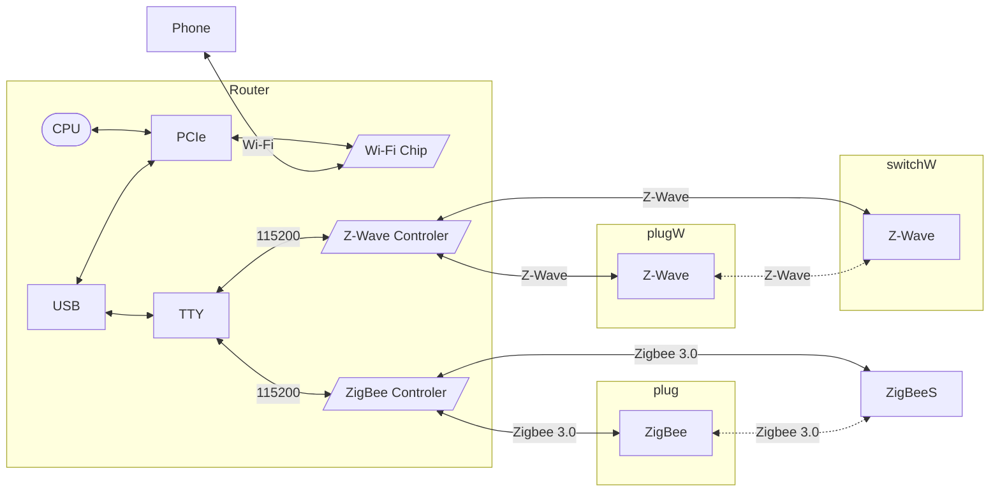
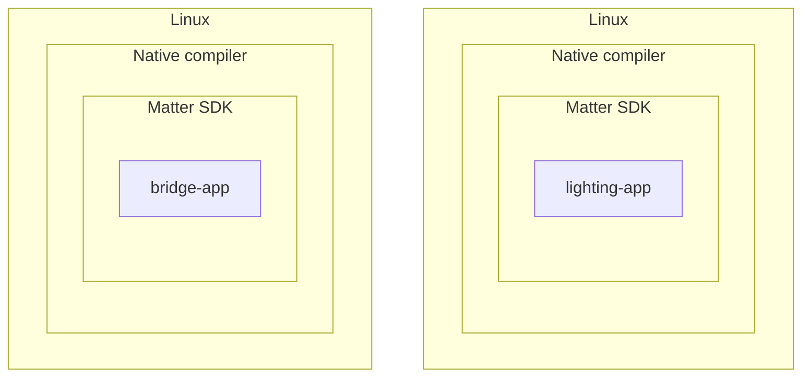
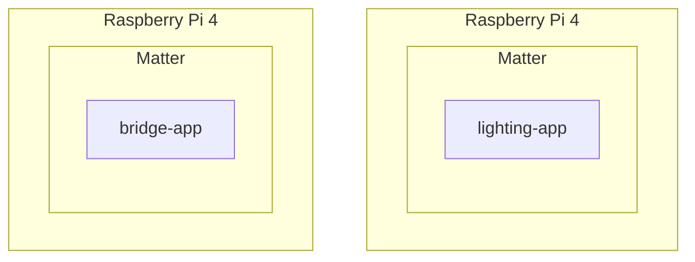
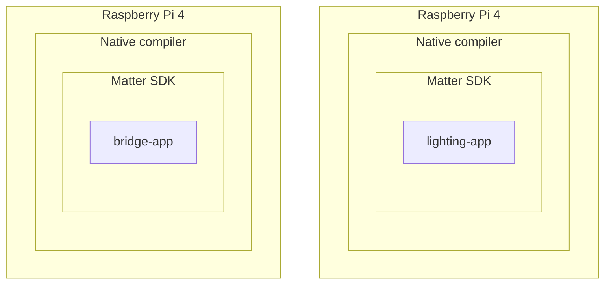

# Matter
[](https://github.com/lankahsu520/HelperX)
[![GitHub license][license-image]][license-url]
[![GitHub stars][stars-image]][stars-url]
[![GitHub forks][forks-image]][forks-url]
[![GitHub issues][issues-image]][issues-image]
[![GitHub watchers][watchers-image]][watchers-image]

[license-image]: https://img.shields.io/github/license/lankahsu520/HelperX.svg
[license-url]: https://github.com/lankahsu520/HelperX/blob/master/LICENSE
[stars-image]: https://img.shields.io/github/stars/lankahsu520/HelperX.svg
[stars-url]: https://github.com/lankahsu520/HelperX/stargazers
[forks-image]: https://img.shields.io/github/forks/lankahsu520/HelperX.svg
[forks-url]: https://github.com/lankahsu520/HelperX/network
[issues-image]: https://img.shields.io/github/issues/lankahsu520/HelperX.svg
[issues-url]: https://github.com/lankahsu520/HelperX/issues
[watchers-image]: https://img.shields.io/github/watchers/lankahsu520/HelperX.svg
[watchers-url]: https://github.com/lankahsu520/HelperX/watchers

# 1. Overview


> [[維基百科] Matter](https://zh.wikipedia.org/zh-tw/Matter)
>
> **Matter**是一項[智慧型家居](https://zh.wikipedia.org/wiki/智能家居)的[開源標準](https://zh.wikipedia.org/wiki/开源标准)，由[連接標準聯盟](https://zh.wikipedia.org/wiki/连接标准联盟)制定、認證、推廣，該標準基於網際網路協定（IP），遵循該標準的智慧型家居裝置、行動應用程式和雲服務能夠進行互聯和通信。

>[ChatGPT] 什麼是 Matter
>
>Matter（以前稱為 Project CHIP，Connected Home over IP）是一種物聯網（IoT）通信協議和平台，致力於促進智能家居設備之間的互操作性和互聯性。Matter 由 Connectivity Standards Alliance（以前稱為 Zigbee Alliance）領導，這是一個由各種技術公司支持的聯盟。
>
>Matter 的主要目標包括：
>
>1. **互操作性：** Matter 旨在確保不同制造商的智能家居設備能夠在同一網絡上互相通信和互操作，從而提高用戶的體驗和降低設備之間的不兼容性問題。
>2. **安全性：** Matter 強調設備之間的安全通信和數據保護。它采用了強大的加密和認證機制來確保設備和用戶的隱私和安全。
>3. **低功耗：** Matter 支持低功耗通信，這對於電池供電的設備非常重要，如智能傳感器。
>4. **開源：** Matter 采用了開源的開發模型，以鼓勵開發者和制造商參與和貢獻。這有助於加速標準的發展和推廣。
>5. **跨平台：** Matter 不僅支持多種網絡技術，如Wi-Fi、Ethernet和Thread，還具有跨平台能力，可以在不同操作系統和設備上運行。
>
>總之，Matter 是一個旨在解決智能家居設備之間互操作性和連接問題的開放標準和協議。它有望改善智能家居設備的互聯性，為用戶提供更好的體驗。這個標準正在逐漸得到廣泛的支持，許多大型技術公司和制造商已經加入並采用了 Matter。

> 小結：就是打造<font color="red">互聯互通</font>的環境（只要選擇符合 Matter 認證的產品，就能直接與家裡現有的智能家居系統相容）。白話就是可購買不同品牌來進行建置。
>
> 至於能達到什麼狀況，那就讓我們繼續看下去！

## 1.1. Architecture Overview

> Matter aims to build a universal IPv6-based communication protocol for smart home devices. The protocol defines the application layer that will be deployed on devices and the different link layers to help maintain interoperability.


](https://project-chip.github.io/connectedhomeip-doc/_images/Matter_Arch_Overview.png)

## 1.2.  Support List

#### A. Android Phone

- [x] [在 Google Home 應用程式中管理支援 Matter 的裝置](https://support.google.com/googlenest/answer/13127223?hl=zh-HK)

> ### 軟硬體需求
>
> - Google 帳戶
> - 家用 Wi-Fi 網路
> - 如果是使用 [Thread](https://support.google.com/googlenest/answer/9249088) 的裝置，需要搭配 [Thread 邊界路由器](https://support.google.com/googlenest/answer/9249088#google-TBR-list)才能完成設定
> - 搭載以下版本的手機或平板電腦：
>   - Android 8.1 以上版本
>   - Google Play 服務 22.48.14 以上版本
>   - 藍牙低功耗 (BLE) 4.2 以上版本
> - 最新版本的 [Google Home 應用程式](https://play.google.com/store/apps/details?id=com.google.android.apps.chromecast.app&hl=zh_tw) 
> - 支援 Matter 的智慧住宅裝置。如果包裝上有  標誌，就表示裝置支援 Matter
> - [支援 Matter 的 Google 中樞裝置](https://support.google.com/googlenest/answer/12391458#matter-app)

#### B. iPhone

- [x] [Matter support in iOS 16](https://developer.apple.com/apple-home/matter/)

- [x] [配對和管理 Matter 配件](https://support.apple.com/zh-tw/102135)

# 2. IoT (Internet of Things)

> 什麼是IoT，請參考 [helper_IoT.md](https://github.com/lankahsu520/HelperX/blob/master/helper_IoT.md) 先建立基本概念。

# 3. Matter Fabric (Matter Network)

> <font color="red">非IP型之協定，一定要橋接！</font>

> [What is a Matter Bridge?](https://matter-smarthome.de/en/know-how/what-is-a-matter-bridge/)

## 3.1. Non-Matter Network

> 這邊假設 Router 集合所有功能，不用另外再加裝 Gateway

#### A. ZigBee & Z-Wave



#### B. Wi-Fi

>[ChatGPT]
>
>一般電腦中的 Wi-Fi 芯片通常不是通過 tty（終端設備）或 I2C（Inter-Integrated Circuit）總線與操作系統連接的，而是通過 PCIe（Peripheral Component Interconnect Express）總線或 USB（Universal Serial Bus）接口進行連接和通信。
>
>1. **PCIe 接口：** 許多內置 Wi-Fi 芯片和擴展 Wi-Fi 適配器使用 PCIe 接口連接到計算機的主板上。這種連接方式通常提供更高的帶寬和性能，因此適用於高速數據傳輸的 Wi-Fi 設備。
>2. **USB 接口：** 一些 USB Wi-Fi 適配器是以 USB 設備的形式連接到計算機，通常通過 USB 接口。這種方式非常普遍，因為它可以讓用戶輕松地添加或升級 Wi-Fi 功能，而無需更改計算機的主板。
>
>這些 Wi-Fi 芯片和適配器通常使用相應的驅動程序來與操作系統進行通信。這些驅動程序通過操作系統的網絡堆棧（如Linux的網絡堆棧）來管理 Wi-Fi 連接。操作系統會為這些設備分配一個網絡接口，例如 wlan0，以便應用程序和用戶可以使用這些接口與 Wi-Fi 設備進行通信。
>
>總之，一般情況下，Wi-Fi 芯片和適配器通過 PCIe 或 USB 接口連接到計算機，並使用相應的驅動程序與操作系統通信，而不是通過 tty 或 I2C 連接。這種方式更適合高速數據傳輸和網絡通信。


#### C. thread

> 因為目前市售 thread 設備不多，不確定是不是所有的 thread Controler 都是用 TTY。可能狀況如下：
>
> a 和 b: 如果 thread 跟 Wi-Fi 整進 driver 時，就等同於是在系統層。只要會在應用層寫 socket 就好。
>
> c: 如果 thread 是用透過 TTY 溝通方式，就等同於是應用層，不只要有 serial 的溝通軟體 ，還要用軟體模擬成 IP，工作要用 queue 保留 ，這個效能很差，單工！


## 3.2. Matter

>
>
>

# 4. Matter SDK

>Matter (formerly Project CHIP) creates more connections between more objects, simplifying development for manufacturers and increasing compatibility for consumers, guided by the Connectivity Standards Alliance.

## 4.1. Repository

### 4.1.1.  Offical - [connectedhomeip](https://github.com/project-chip/connectedhomeip)

```bash
$ git clone --recurse-submodules https://github.com/project-chip/connectedhomeip.git

#  you already have the Matter code checked out, run the following commands to update the repository and synchronize submodules
$ git pull
$ git submodule update --init
```

> <font color="red">這邊選擇先下載 submodules (--recurse-submodules) ，所以空間佔用的比較大</font>

| SHA1 ID: 3aac08f941084f02f54de840ce8631f636724ec3<br>2023-10-25 06:30:16 | connectedhomeip |
| ------------------------------------------------------------ | --------------- |
| without recurse-submodules                                   | 719M            |
| recurse-submodules                                           | 12G             |
| build linux-x64-tests                                        | 25G             |

#### A. without recurse-submodules

```bash
1.0M    ./data_model
22M     ./zzz_generated
76K     ./.vscode
80M     ./src
3.9M    ./docs
5.6M    ./scripts
41M     ./third_party
490M    ./.git
608K    ./.github
2.2M    ./config
540K    ./build
63M     ./examples
16K     ./.devcontainer
8.0K    ./.githooks
124K    ./build_overrides
12M     ./credentials
492K    ./integrations
719M    ./
```

#### B. recurse-submodules

```bash
1.0M    ./data_model
22M     ./zzz_generated
76K     ./.vscode
80M     ./src
3.9M    ./docs
5.6M    ./scripts
6.6G    ./third_party
5.3G    ./.git
608K    ./.github
2.1M    ./config
540K    ./build
95M     ./examples
16K     ./.devcontainer
8.0K    ./.githooks
124K    ./build_overrides
12M     ./credentials
492K    ./integrations
12G     ./
```

#### C. build linux-x64-tests

```bash
1.0M    ./data_model
22M     ./zzz_generated
76K     ./.vscode
80M     ./src
3.9M    ./docs
5.7M    ./scripts
6.6G    ./third_party
5.3G    ./.git
608K    ./.github
2.1M    ./config
540K    ./build
95M     ./examples
16K     ./.devcontainer
7.5G    ./build_xxx
8.0K    ./.githooks
128K    ./build_overrides
12M     ./credentials
492K    ./integrations
4.9G    ./.environment
25G     ./
```

### 4.1.2. [SiliconLabs](https://github.com/SiliconLabs)/**[matter](https://github.com/SiliconLabs/matter)**

```bash
$ git clone https://github.com/SiliconLabs/matter.git
```

## 4.2. [Building Matter](https://github.com/project-chip/connectedhomeip/blob/master/docs/guides/BUILDING.md#building-matter)

> [connectedhomeip](https://github.com/project-chip/connectedhomeip/tree/master)/[docs](https://github.com/project-chip/connectedhomeip/tree/master/docs)/[guides](https://github.com/project-chip/connectedhomeip/tree/master/docs/guides)/[BUILDING.md](https://github.com/project-chip/connectedhomeip/blob/master/docs/guides/BUILDING.md)



### 4.2.1. Installing prerequisites on Linux

```bash
$ sudo apt install -y git gcc g++ pkg-config libssl-dev libdbus-1-dev \
     libglib2.0-dev libavahi-client-dev ninja-build python3-venv python3-dev \
     python3-pip unzip libgirepository1.0-dev libcairo2-dev libreadline-dev
```

```bash
$ sudo apt install -y python3.8-venv
$ pip install --upgrade pip
```

#### A. for TI (Texas Instruments)

```bash
$ wget https://dr-download.ti.com/software-development/ide-configuration-compiler-or-debugger/MD-nsUM6f7Vvb/1.15.0.2826/sysconfig-1.15.0_2826-setup.run
$ chmod +x sysconfig-1.15.0_2826-setup.run
$ ./sysconfig-1.15.0_2826-setup.run
# install to /opt/ti/sysconfig_1.15.0

$ export TI_SYSCONFIG_ROOT=/opt/ti/sysconfig_1.15.0
```

#### B. gn

```bash
$ sudo apt install -y clang
$ clang --version
clang version 10.0.0-4ubuntu1
Target: x86_64-pc-linux-gnu
Thread model: posix
InstalledDir: /usr/bin
$ git clone https://gn.googlesource.com/gn
$ cd gn
$ python build/gen.py
$ ninja -C out
$ sudo cp out/gn /usr/bin
$ sudo cp out/gn_unittests /usr/bin
$ gn --version
2124 (e4702d740906)
```


### 4.2.2. Prepare for building

>因為一開始使用 --recurse-submodules，這邊就只要執行 activate.sh

> Before running any other build command, the `scripts/activate.sh` environment setup script should be sourced at the top level. This script takes care of downloading GN, ninja, and setting up a Python environment with libraries used to build and test.

```bash
$ source scripts/activate.sh
```

> If the script says the environment is out of date, you can update it by running the following command

```bash
$ source scripts/bootstrap.sh
```

### 4.2.3. Building

> 先確定環境是否設定完成，執行 gn

```bash
# to check gn
$ gn --version
2121 (991530ce394e)
```

```bash
export PWD=`pwd`
export PJ_NAME=linux
export PJ_GN_DRY_RUN=--dry-run
export PJ_GN_TARGET=linux-x64-tests
export PJ_GN_BUILD_DIR=build_xxx

#export PJ_GN_ARGS="--args='is_debug=false'"
#export PJ_GN_ARGS="--args='is_debug=false chip_build_tests=true'"
#export PJ_GN_ARGS="--args='chip_build_tests=true '"
```

#### A. General - gn

```bash
# generate and run ninja/make as needed to compile
$ gn gen \
	--check \
	--fail-on-unused-args \
	--export-compile-commands \
	--args='chip_build_tests=true ' \
	--root=./ \
  build_xxx/linux-x64-tests

$ tree -L 1 build_xxx/linux-x64-tests
$ ninja -C build_xxx/linux-x64-tests \
	check
```

> 使用參數如下

```bash
# generate and run ninja/make as needed to compile
$ gn gen \
	--check \
	--fail-on-unused-args \
	--export-compile-commands \
	--args='chip_build_tests=true ' \
	--root=${PWD} \
	${PJ_GN_BUILD_DIR}/${PJ_GN_TARGET}

$ tree -L 1 ${PJ_GN_BUILD_DIR}/${PJ_GN_TARGET}
$ ninja -C ${PJ_GN_BUILD_DIR}/${PJ_GN_TARGET} \
	check
```

#### B. [`build_examples.py`](https://github.com/project-chip/connectedhomeip/blob/master/docs/guides/BUILDING.md#using-build_examplespy)

>The script `./scripts/build/build_examples.py` provides a uniform build interface into using `gn`, `cmake`, `ninja` and other tools as needed to compile various platforms.

##### B.1. target vs function

| target                                 | Build???Target                                 |
| -------------------------------------- | ---------------------------------------------- |
| ameba                                  | BuildAmebaTarget                               |
| asr                                    | BuildASRTarget                                 |
| android                                | BuildAndroidTarget                             |
| bouffalolab                            | BuildBouffalolabTarget                         |
| cc32xx                                 | Buildcc32xxTarget                              |
| ti                                     | BuildCC13x2x7Target, BuildCC13x4Target         |
| cyw30739                               | BuildCyw30739Target                            |
| efr32                                  | BuildEfr32Target                               |
| esp32                                  | BuildEsp32Target                               |
| genio                                  | BuildGenioTarget                               |
| HostBoard.NATIVE.PlatformName()        | BuildHostFakeTarget, BuildHostTestRunnerTarget |
| HostBoard.NATIVE.PlatformName(), arm64 | BuildHostTarget                                |
| imx                                    | BuildIMXTarget                                 |
| infineon                               | BuildInfineonTarget                            |
| k32w                                   | BuildK32WTarget                                |
| mbed                                   | BuildMbedTarget                                |
| mw320                                  | BuildMW320Target                               |
| nrf                                    | BuildNrfTarget, BuildNrfNativeTarget           |
| qpg                                    | BuildQorvoTarget                               |
| stm32                                  | BuildStm32Target                               |
| tizen                                  | BuildTizenTarget                               |
| telink                                 | BuildTelinkTarget                              |

##### B.2. Host Flow


```bash
# generate and run ninja/make as needed to compile
$ ./scripts/build/build_examples.py \
	--target linux-x64-tests --out-prefix build_xxx \
	build
```

> 使用參數如下

```bash
# generate and run ninja/make as needed to compile
$ ./scripts/build/build_examples.py \
	--target ${PJ_GN_TARGET} --out-prefix ${PJ_GN_BUILD_DIR} ${PJ_GN_DRY_RUN} \
	build

# Generate ninja/makefiles (but does not run the compilation)
$ ./scripts/build/build_examples.py \
	--target ${PJ_GN_TARGET} --out-prefix ${PJ_GN_BUILD_DIR} ${PJ_GN_DRY_RUN} \
	gen
```

### 4.2.4. [examples](https://github.com/project-chip/connectedhomeip/tree/master/examples)

```bash
$ export PJ_GN_TARGET=linux-x64-tests

$ gn gen --check --fail-on-unused-args --export-compile-commands \
	--root=./ \
	--args=chip_build_tests=true \
	./build_xxx/linux-x64-tests

$ gn ls \  --root=./ \  ./build_xxx/linux-x64-light
```

#### A. [bridge-app](https://github.com/project-chip/connectedhomeip/tree/master/examples/bridge-app)

- linux

```bash
$ export PJ_GN_TARGET=linux-x64-bridge

$ ./scripts/build/build_examples.py \
	--target linux-x64-bridge \
	--out-prefix ./build_xxx \
  gen
# or
$ gn gen --check --fail-on-unused-args --export-compile-commands \
	--root=./examples/bridge-app/linux \
	./build_xxx/linux-x64-bridge

$ ninja -C ./build_xxx/linux-x64-bridge

$ gn ls \
	--root=./examples/bridge-app/linux \
	./build_xxx/linux-x64-bridge
```

#### B. [lighting-app](https://github.com/project-chip/connectedhomeip/tree/master/examples/lighting-app)

- linux

```bash
$ export PJ_GN_TARGET=linux-x64-light

$ ./scripts/build/build_examples.py \
	--target linux-x64-light \
	--out-prefix ./build_xxxx \
	gen
# or
$ gn gen --check --fail-on-unused-args --export-compile-commands \
	--root=./examples/lighting-app/linux \
	./build_xxx/linux-x64-light

$ ninja -C ./build_xxx/linux-x64-light

$ gn ls \
	--root=./examples/bridge-app/linux \
	./build_xxx/linux-x64-light
```

- Silicon Labs

```bash
$ export PJ_GN_TARGET=efr32-brd4187c-light

$ gn gen --check --fail-on-unused-args --export-compile-commands \
	--root=./examples/lighting-app/silabs \
	'--args=silabs_board="BRD4187C" sl_matter_version_str="v1.1-master-d870e8c5e2-dirty"' \
	./build_xxx/efr32-brd4187c-light

$ ninja -C ./build_xxx/efr32-brd4187c-light

$ gn ls \
	--root=./examples/lighting-app/silabs \
	./build_xxx/efr32-brd4187c-light
```

```bash
$ export PJ_GN_TARGET=efr32-brd4186c-light

$ gn gen --check --fail-on-unused-args --export-compile-commands \
	--root=./examples/lighting-app/silabs \
	'--args=silabs_board="BRD4186C" sl_matter_version_str="v1.1-master-d870e8c5e2-dirty"' \
	./build_xxx/efr32-brd4186c-light

$ ninja -C ./build_xxx/efr32-brd4186c-light

$ gn ls \
	--root=./examples/lighting-app/silabs \
	./build_xxx/efr32-brd4186c-light
```

* Texas Instruments

```bash
$ export PJ_GN_TARGET=ti-cc13x2x7_26x2x7-lighting

$ gn gen --check --fail-on-unused-args --export-compile-commands \
	--root=./examples/lighting-app/cc13x2x7_26x2x7 \
	'--args=ti_sysconfig_root="/opt/TI/sysconfig_1.15.0" ti_simplelink_board="LP_CC2652R7"' \
	./build_xxx/ti-cc13x2x7_26x2x7-lighting

$ ninja -C ./build_xxx/ti-cc13x2x7_26x2x7-lighting

$ gn ls \
	--root=./examples/lighting-app/cc13x2x7_26x2x7 \
	./build_xxx/ti-cc13x2x7_26x2x7-lighting
```

```bash
$ export PJ_GN_TARGET=ti-cc13x4_26x4-lighting

$ gn gen --check --fail-on-unused-args --export-compile-commands \
	--root=./examples/lighting-app/cc13x4_26x4 \
	'--args=ti_sysconfig_root="/opt/TI/sysconfig_1.15.0" ti_simplelink_board="LP_EM_CC1354P10_6"' \
	./build_xxx/ti-cc13x4_26x4-lighting

$ ninja -C ./build_xxx/ti-cc13x4_26x4-lighting

$ gn ls \
	--root=./examples/lighting-app/cc13x4_26x4 \
	./build_xxx/ti-cc13x4_26x4-lighting
```

# 5. Target Platform

> 前章節主要是介紹如何編譯，而官網的測試平台為 Raspberry Pi 4；如果考量在 PI4 進行 Native-Compilation 速度過慢等問題，就得在 PC (ubuntu) 上進行 Cross-Compilation，這部分先不討論！



## 5.1. Setup PI4 - [Installing prerequisites on Raspberry Pi 4](https://github.com/project-chip/connectedhomeip/blob/master/docs/guides/BUILDING.md#installing-prerequisites-on-raspberry-pi-4)

### 5.1.1. Install Ubuntu *22.04.xx* 64-bit *server* OS  on a micro SD card


### 5.1.2. Installing prerequisites on PI4

> login: ubuntu/ubuntuu

#### A. Install net-tools and ssh server

```bash
# 第一次開機，
# 一定要 update 和 upgrade
# 一定要上網；不熟設定 Wi-Fi，就不要鐵齒，請把 RJ45 連上。
$ sudo apt update
$ sudo apt --yes upgrade

$ sudo apt --yes install net-tools openssh-server
# to change the hostname
$ hostname lanka-pi4-8g
$ sudo reboot
```

```bash
# then you can ssh to connect this PI4
$ sudo apt --yes install git gcc g++ pkg-config libssl-dev libdbus-1-dev \
	libglib2.0-dev libavahi-client-dev ninja-build python3-venv python3-dev \
	python3-pip unzip libgirepository1.0-dev libcairo2-dev libreadline-dev

$ sudo apt --yes install avahi-utils
```

```bash
$ sudo apt --yes install pi-bluetooth
$ sudo reboot
```

#### B. Others

```bash
# UI builds
# If building via build_examples.py and -with-ui variant, also install SDL2
$ sudo apt --yes install libsdl2-dev

```

#### C. Setup Wi-Fi

```bash
$ sudo vi /etc/systemd/system/dbus-fi.w1.wpa_supplicant1.service
ExecStart=/sbin/wpa_supplicant -u -s -i wlan0 -c /etc/wpa_supplicant/wpa_supplicant.conf

$ sudo vi /etc/wpa_supplicant/wpa_supplicant.conf
ctrl_interface=DIR=/run/wpa_supplicant
update_config=1

$ sudo reboot
```

## 5.2. Build on PI4

> use Native compiler on PI4

> Please check the previous chapter !



# ??? Virtual Device

```bash
$ git clone --recurse-submodules https://github.com/project-chip/connectedhomeip.git
$ cd connectedhomeip
$ git checkout 1de2b73bb4123af5f184eac54d1b1d76985b4f62
$ git submodule update --init
```

```bash
$ docker pull us-docker.pkg.dev/nest-matter/docker-repo/virtual-device-image:latest
$ docker run -it --ipc=host --net=host -e DISPLAY --name matter-container us-docker.pkg.dev/nest-matter/docker-repo/virtual-device-image:latest

$ cd ~/connectedhomeip/examples/chef/
$ ./chef.py -zbr -v0xfff1 -p 0x8000 -d rootnode_onofflight_bbs1b7IaOV -t linux
$ ./linux/out/rootnode_onofflight_bbs1b7IaOV
```

# ??? [ZAP](https://github.com/project-chip/zap)

> ZAP is Zigbee Cluster Library configuration tool and generator. It allows users to configure their ZCL application using web-like interface and then generate the required artifacts for this application, based upon the templates inside a given ZCL SDK.

# ??? [`libfuzzer` unit tests](https://github.com/project-chip/connectedhomeip/blob/master/docs/guides/BUILDING.md#libfuzzer-unit-tests)

# Footnote

[^1]:
[^2]:

# Appendix

# I. Study

## I.0. [Matter Specifications](https://csa-iot.org/developer-resource/specifications-download-request/)

## I.1. [Matter - The Foundation for Connected Things](https://csa-iot.org/all-solutions/matter/)

> csa 組織

## I.2. 一些介紹

#### A. [什麼是 Matter? Matter 對智慧家庭用戶的影響](https://www.flh.com.tw/2021-07-27-matter/?gad_source=1&gclid=Cj0KCQjwm66pBhDQARIsALIR2zBQddaHaUJWG3hye803HiZDDbEHGfmGNZc9ftIZa7tuk6cmt_RJDvwaAlvtEALw_wcB)

>簡單的介紹智慧家電的歷史。

#### B. [Google公布Project Connected Home over IP計劃，推動智慧家庭技術標準](https://iknow.stpi.narl.org.tw/Post/Read.aspx?PostID=16298)

> 文章發表發表於 2020年1月8日
>
> 可以知道時代的眼淚，當初有Weave和Thread這兩套標準。
>
> <font color="red">注意：不符合IP通訊協定的傳輸技術如傳統的Zigbee即需要多一個閘道將訊號轉換成IP封包才能傳輸到網際網路</font>

#### C. [Project Connected Home over IP](https://developers.googleblog.com/2019/12/project-connected-home-over-ip.html)

> December 18, 2019

#### D. [將非Matter裝置橋接到Matter網路](https://www.eettaiwan.com/20221019ta71-bridging-non-matter-devices-to-a-matter-network/)

> 2022-10-19
>
> Silicon Labs 的業配文，介紹基本概念。


## I.3. 範例

#### A. [开始使用基于 IP 的智能互联家居 (CHIP)](https://codelabs.developers.google.com/codelabs/chip-get-started?hl=zh-cn#0)

>上次更新时间：5月 14, 2021

#### B. [Build a Matter virtual device](https://developers.home.google.com/codelabs/matter-device-virtual#0)

#### C. [Matter Virtual Device Development Environment](https://developers.home.google.com/matter/tools/matter-virtual-device-development-environment)

# II. Debug

# III. Glossary

#### NOC, Node Operational Certificate

> 節點操作證書

#### [ZAP](https://github.com/project-chip/zap), [ZCL Advanced Platform](https://github.com/project-chip/zap#zcl-advanced-platform)

> AP is Zigbee Cluster Library configuration tool and generator. It allows users to configure their ZCL application using web-like interface and then generate the required artifacts for this application, based upon the templates inside a given ZCL SDK.

# IV. Tool Usage

## IV.1. gn Usage

> GN is a meta-build system that generates build files for [Ninja](https://ninja-build.org/).

```bash
$ gn --help

Commands (type "gn help <command>" for more help):
  analyze: Analyze which targets are affected by a list of files.
  args: Display or configure arguments declared by the build.
  check: Check header dependencies.
  clean: Cleans the output directory.
  clean_stale: Cleans the stale output files from the output directory.
  desc: Show lots of insightful information about a target or config.
  format: Format .gn files.
  gen: Generate ninja files.
  help: Does what you think.
  ls: List matching targets.
  meta: List target metadata collection results.
  outputs: Which files a source/target make.
  path: Find paths between two targets.
  refs: Find stuff referencing a target or file.

Target declarations (type "gn help <function>" for more help):
  action: Declare a target that runs a script a single time.
  action_foreach: Declare a target that runs a script over a set of files.
  bundle_data: [iOS/llrget that copies files.
  create_bundle: [iOS/macOS] Build an iOS or macOS bundle.
  executable: Declare an executable target.
  generated_file: Declare a generated_file target.
  group: Declare a named group of targets.
  loadable_module: Declare a loadable module target.
  rust_library: Declare a Rust library target.
  rust_proc_macro: Declare a Rust procedural macro target.
  shared_library: Declare a shared library target.
  source_set: Declare a source set target.
  static_library: Declare a static library target.
  target: Declare a target with the given programmatic type.

Buildfile functions (type "gn help <function>" for more help):
  assert: Assert an expression is true at generation time.
  config: Defines a configuration object.
  declare_args: Declare build arguments.
  defined: Returns whether an identifier is defined.
  exec_script: Synchronously run a script and return the output.
  filter_exclude: Remove values that match a set of patterns.
  filter_include: Remove values that do not match a set of patterns.
  foreach: Iterate over a list.
  forward_variables_from: Copies variables from a different scope.
  get_label_info: Get an attribute from a target's label.
  get_path_info: Extract parts of a file or directory name.
  get_target_outputs: [file list] Get the list of outputs from a target.
  getenv: Get an environment variable.
  import: Import a file into the current scope.
  not_needed: Mark variables from scope as not needed.
  pool: Defines a pool object.
  print: Prints to the console.
  print_stack_trace: Prints a stack trace.
  process_file_template: Do template expansion over a list of files.
  read_file: Read a file into a variable.
  rebase_path: Rebase a file or directory to another location.
  set_default_toolchain: Sets the default toolchain name.
  set_defaults: Set default values for a target type.
  split_list: Splits a list into N different sub-lists.
  string_join: Concatenates a list of strings with a separator.
  string_replace: Replaces substring in the given string.
  string_split: Split string into a list of strings.
  template: Define a template rule.
  tool: Specify arguments to a toolchain tool.
  toolchain: Defines a toolchain.
  write_file: Write a file to disk.

Built-in predefined variables (type "gn help <variable>" for more help):
  current_cpu: [string] The processor architecture of the current toolchain.
  current_os: [string] The operating system of the current toolchain.
  current_toolchain: [string] Label of the current toolchain.
  default_toolchain: [string] Label of the default toolchain.
  gn_version: [number] The version of gn.
  host_cpu: [string] The processor architecture that GN is running on.
  host_os: [string] The operating system that GN is running on.
  invoker: [string] The invoking scope inside a template.
  python_path: [string] Absolute path of Python.
  root_build_dir: [string] Directory where build commands are run.
  root_gen_dir: [string] Directory for the toolchain's generated files.
  root_out_dir: [string] Root directory for toolchain output files.
  target_cpu: [string] The desired cpu architecture for the build.
  target_gen_dir: [string] Directory for a target's generated files.
  target_name: [string] The name of the current target.
  target_os: [string] The desired operating system for the build.
  target_out_dir: [string] Directory for target output files.

Variables you set in targets (type "gn help <variable>" for more help):
  aliased_deps: [scope] Set of crate-dependency pairs.
  all_dependent_configs: [label list] Configs to be forced on dependents.
  allow_circular_includes_from: [label list] Permit includes from deps.
  arflags: [string list] Arguments passed to static_library archiver.
  args: [string list] Arguments passed to an action.
  asmflags: [string list] Flags passed to the assembler.
  assert_no_deps: [label pattern list] Ensure no deps on these targets.
  bridge_header: [string] Path to C/Objective-C compatibility header.
  bundle_contents_dir: Expansion of {{bundle_contents_dir}} in create_bundle.
  bundle_deps_filter: [label list] A list of labels that are filtered out.
  bundle_executable_dir: Expansion of {{bundle_executable_dir}} in create_bundle
  bundle_resources_dir: Expansion of {{bundle_resources_dir}} in create_bundle.
  bundle_root_dir: Expansion of {{bundle_root_dir}} in create_bundle.
  cflags: [string list] Flags passed to all C compiler variants.
  cflags_c: [string list] Flags passed to the C compiler.
  cflags_cc: [string list] Flags passed to the C++ compiler.
  cflags_objc: [string list] Flags passed to the Objective C compiler.
  cflags_objcc: [string list] Flags passed to the Objective C++ compiler.
  check_includes: [boolean] Controls whether a target's files are checked.
  code_signing_args: [string list] Arguments passed to code signing script.
  code_signing_outputs: [file list] Output files for code signing step.
  code_signing_script: [file name] Script for code signing.
  code_signing_sources: [file list] Sources for code signing step.
  complete_static_lib: [boolean] Links all deps into a static library.
  configs: [label list] Configs applying to this target or config.
  contents: Contents to write to file.
  crate_name: [string] The name for the compiled crate.
  crate_root: [string] The root source file for a binary or library.
  crate_type: [string] The type of linkage to use on a shared_library.
  data: [file list] Runtime data file dependencies.
  data_deps: [label list] Non-linked dependencies.
  data_keys: [string list] Keys from which to collect metadata.
  defines: [string list] C preprocessor defines.
  depfile: [string] File name for input dependencies for actions.
  deps: [label list] Private linked dependencies.
  externs: [scope] Set of Rust crate-dependency pairs.
  framework_dirs: [directory list] Additional framework search directories.
  frameworks: [name list] Name of frameworks that must be linked.
  friend: [label pattern list] Allow targets to include private headers.
  gen_deps: [label list] Declares targets that should generate when this one does.
  include_dirs: [directory list] Additional include directories.
  inputs: [file list] Additional compile-time dependencies.
  ldflags: [string list] Flags passed to the linker.
  lib_dirs: [directory list] Additional library directories.
  libs: [string list] Additional libraries to link.
  metadata: [scope] Metadata of this target.
  mnemonic: [string] Prefix displayed when ninja runs this action.
  module_name: [string] The name for the compiled module.
  output_conversion: Data format for generated_file targets.
  output_dir: [directory] Directory to put output file in.
  output_extension: [string] Value to use for the output's file extension.
  output_name: [string] Name for the output file other than the default.
  output_prefix_override: [boolean] Don't use prefix for output name.
  outputs: [file list] Output files for actions and copy targets.
  partial_info_plist: [filename] Path plist from asset catalog compiler.
  pool: [string] Label of the pool used by binary targets and actions.
  precompiled_header: [string] Header file to precompile.
  precompiled_header_type: [string] "gcc" or "msvc".
  precompiled_source: [file name] Source file to precompile.
  product_type: [string] Product type for the bundle.
  public: [file list] Declare public header files for a target.
  public_configs: [label list] Configs applied to dependents.
  public_deps: [label list] Declare public dependencies.
  rebase: [boolean] Rebase collected metadata as files.
  response_file_contents: [string list] Contents of .rsp file for actions.
  script: [file name] Script file for actions.
  sources: [file list] Source files for a target.
  swiftflags: [string list] Flags passed to the swift compiler.
  testonly: [boolean] Declares a target must only be used for testing.
  transparent: [bool] True if the bundle is transparent.
  visibility: [label list] A list of labels that can depend on a target.
  walk_keys: [string list] Key(s) for managing the metadata collection walk.
  weak_frameworks: [name list] Name of frameworks that must be weak linked.
  write_runtime_deps: Writes the target's runtime_deps to the given path.
  xcasset_compiler_flags: [string list] Flags passed to xcassets compiler
  xcode_extra_attributes: [scope] Extra attributes for Xcode projects.
  xcode_test_application_name: [string] Name for Xcode test target.

Other help topics:
  all: Print all the help at once
  buildargs: How build arguments work.
  dotfile: Info about the toplevel .gn file.
  execution: Build graph and execution overview.
  grammar: Language and grammar for GN build files.
  input_conversion: Processing input from exec_script and read_file.
  file_pattern: Matching more than one file.
  label_pattern: Matching more than one label.
  labels: About labels.
  metadata_collection: About metadata and its collection.
  ninja_rules: How Ninja build rules are named.
  nogncheck: Annotating includes for checking.
  output_conversion: Specifies how to transform a value to output.
  runtime_deps: How runtime dependency computation works.
  source_expansion: Map sources to outputs for scripts.
  switches: Show available command-line switches.
```

## IV.2. [`build_examples.py`](https://github.com/project-chip/connectedhomeip/blob/master/docs/guides/BUILDING.md#using-build_examplespy)

```bash
$ ./scripts/build/build_examples.py
Usage: build_examples.py [OPTIONS] COMMAND1 [ARGS]... [COMMAND2 [ARGS]...]...

Options:
  --log-level [debug|info|warn|fatal]
                                  Determines the verbosity of script output.
  --target TEXT                   Build target(s)
  --enable-flashbundle            Also generate the flashbundles for the app.
  --repo TEXT                     Path to the root of the CHIP SDK repository
                                  checkout.
  --out-prefix DIRECTORY          Prefix for the generated file output.
  --pregen-dir DIRECTORY          Directory where generated files have been
                                  pre-generated.
  --clean                         Clean output directory before running the
                                  command
  --dry-run                       Only print out shell commands that would be
                                  executed
  --dry-run-output FILENAME       Where to write the dry run output
  --no-log-timestamps             Skip timestaps in log output
  --pw-command-launcher TEXT      Set pigweed command launcher. E.g.: "--pw-
                                  command-launcher=ccache" for using ccache
                                  when building examples.
  --help                          Show this message and exit.

Commands:
  build    generate and run ninja/make as needed to compile
  gen      Generate ninja/makefiles (but does not run the compilation)
  targets  Lists the targets that can be used with the build and gen...

```

#### A. build_examples.py targets

```bash'
$ ./scripts/build/build_examples.py targets
2023-10-25 15:14:52 INFO    Building targets:
ameba-amebad-{all-clusters,all-clusters-minimal,light,light-switch,pigweed}
asr-{asr582x,asr595x,asr550x}-{all-clusters,all-clusters-minimal,lighting,light-switch,lock,bridge,temperature-measurement,thermostat,ota-requestor,dishwasher,refrigerator}[-ota][-shell][-no_logging][-factory][-rotating_id][-rio]
android-{arm,arm64,x86,x64,androidstudio-arm,androidstudio-arm64,androidstudio-x86,androidstudio-x64}-{chip-tool,chip-test,tv-server,tv-casting-app,java-matter-controller,kotlin-matter-controller,virtual-device-app}[-no-debug]
bouffalolab-{bl602-iot-matter-v1,bl602-night-light,xt-zb6-devkit,bl706-night-light,bl706dk,bl704ldk}-light[-shell][-115200][-rpc][-cdc][-resetcnt][-rotating_device_id][-mfd][-mfdtest][-ethernet][-wifi][-thread][-fp][-memmonitor][-mot]
cc32xx-lock
ti-cc13x2x7_26x2x7-{lighting,lock,pump,pump-controller}[-mtd]
ti-cc13x4_26x4-{all-clusters,lighting,lock,pump,pump-controller}[-mtd][-ftd]
cyw30739-cyw930739m2evb_01-{light,lock,ota-requestor,switch}
efr32-{brd4161a,brd4187c,brd4186c,brd4163a,brd4164a,brd4166a,brd4170a,brd4186a,brd4187a,brd4304a}-{window-covering,switch,unit-test,light,lock,thermostat,pump}[-rpc][-with-ota-requestor][-icd][-low-power][-shell][-no_logging][-openthread_mtd][-enable_heap_monitoring][-no_openthread_cli][-show_qr_code][-wifi][-rs911x][-wf200][-wifi_ipv4][-additional_data_advertising][-use_ot_lib][-use_ot_coap_lib][-no-version]
esp32-{m5stack,c3devkit,devkitc,qemu}-{all-clusters,all-clusters-minimal,ota-provider,ota-requestor,shell,light,lock,bridge,temperature-measurement,ota-requestor,tests}[-rpc][-ipv6only][-tracing]
genio-lighting-app
linux-fake-tests[-mbedtls][-boringssl][-asan][-tsan][-ubsan][-libfuzzer][-ossfuzz][-coverage][-dmalloc][-clang]
linux-{x64,arm64}-{rpc-console,all-clusters,all-clusters-minimal,chip-tool,thermostat,java-matter-controller,kotlin-matter-controller,minmdns,light,lock,shell,ota-provider,ota-requestor,simulated-app1,simulated-app2,python-bindings,tv-app,tv-casting-app,bridge,tests,chip-cert,address-resolve-tool,contact-sensor,dishwasher,refrigerator,rvc}[-nodeps][-platform-mdns][-minmdns-verbose][-libnl][-same-event-loop][-no-interactive][-ipv6only][-no-ble][-no-wifi][-no-thread][-mbedtls][-boringssl][-asan][-tsan][-ubsan][-libfuzzer][-ossfuzz][-coverage][-dmalloc][-clang][-test][-rpc][-with-ui]
linux-x64-efr32-test-runner[-clang]
imx-{chip-tool,lighting-app,thermostat,all-clusters-app,all-clusters-minimal-app,ota-provider-app}[-release]
infineon-psoc6-{lock,light,all-clusters,all-clusters-minimal}[-ota][-updateimage]
k32w-{k32w0,k32w1}-{light,shell,lock,contact}[-se05x][-no-ble][-no-ota][-low-power][-nologs][-crypto-platform][-tokenizer][-openthread-ftd]
mbed-cy8cproto_062_4343w-{lock,light,all-clusters,all-clusters-minimal,pigweed,ota-requestor,shell}[-release][-develop][-debug]
mw320-all-clusters-app
nrf-{nrf5340dk,nrf52840dk,nrf52840dongle}-{all-clusters,all-clusters-minimal,lock,light,light-switch,shell,pump,pump-controller,window-covering}[-rpc]
nrf-native-posix-64-tests
qpg-qpg6105-{lock,light,shell,persistent-storage}
stm32-stm32wb5mm-dk-light
tizen-arm-{all-clusters,all-clusters-minimal,chip-tool,light,tests}[-no-ble][-no-thread][-no-wifi][-asan][-ubsan]
telink-{tlsr9518adk80d,tlsr9528a}-{air-quality-sensor,all-clusters,all-clusters-minimal,bridge,contact-sensor,light,light-switch,lock,ota-requestor,pump,pump-controller,resource-monitoring,shell,smoke-co-alarm,temperature-measurement,thermostat,window-covering}[-ota][-dfu][-shell][-rpc][-factory-data][-4mb]
openiotsdk-{shell,lock}[-mbedtls][-psa]

```

# Author

Created and designed by [Lanka Hsu](lankahsu@gmail.com).

# License

[HelperX](https://github.com/lankahsu520/HelperX) is available under the BSD-3-Clause license. See the LICENSE file for more info.

