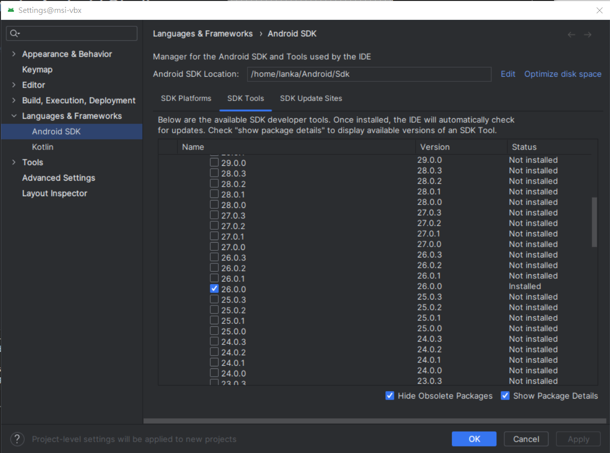

# Matter
[](https://github.com/lankahsu520/HelperX)
[![GitHub license][license-image]][license-url]
[![GitHub stars][stars-image]][stars-url]
[![GitHub forks][forks-image]][forks-url]
[![GitHub issues][issues-image]][issues-image]
[![GitHub watchers][watchers-image]][watchers-image]

[license-image]: https://img.shields.io/github/license/lankahsu520/HelperX.svg
[license-url]: https://github.com/lankahsu520/HelperX/blob/master/LICENSE
[stars-image]: https://img.shields.io/github/stars/lankahsu520/HelperX.svg
[stars-url]: https://github.com/lankahsu520/HelperX/stargazers
[forks-image]: https://img.shields.io/github/forks/lankahsu520/HelperX.svg
[forks-url]: https://github.com/lankahsu520/HelperX/network
[issues-image]: https://img.shields.io/github/issues/lankahsu520/HelperX.svg
[issues-url]: https://github.com/lankahsu520/HelperX/issues
[watchers-image]: https://img.shields.io/github/watchers/lankahsu520/HelperX.svg
[watchers-url]: https://github.com/lankahsu520/HelperX/watchers

# 1. Overview


> [[維基百科] Matter](https://zh.wikipedia.org/zh-tw/Matter)
>
> **Matter**是一項[智慧型家居](https://zh.wikipedia.org/wiki/智能家居)的[開源標準](https://zh.wikipedia.org/wiki/开源标准)，由[連接標準聯盟](https://zh.wikipedia.org/wiki/连接标准联盟)制定、認證、推廣，該標準基於網際網路協定（IP），遵循該標準的智慧型家居裝置、行動應用程式和雲服務能夠進行互聯和通信。

>[ChatGPT] 什麼是 Matter
>
>Matter（以前稱為 Project CHIP，Connected Home over IP）是一種物聯網（IoT）通信協議和平台，致力於促進智能家居設備之間的互操作性和互聯性。Matter 由 Connectivity Standards Alliance（以前稱為 Zigbee Alliance）領導，這是一個由各種技術公司支持的聯盟。
>
>Matter 的主要目標包括：
>
>1. **互操作性：** Matter 旨在確保不同制造商的智能家居設備能夠在同一網絡上互相通信和互操作，從而提高用戶的體驗和降低設備之間的不兼容性問題。
>2. **安全性：** Matter 強調設備之間的安全通信和數據保護。它采用了強大的加密和認證機制來確保設備和用戶的隱私和安全。
>3. **低功耗：** Matter 支持低功耗通信，這對於電池供電的設備非常重要，如智能傳感器。
>4. **開源：** Matter 采用了開源的開發模型，以鼓勵開發者和制造商參與和貢獻。這有助於加速標準的發展和推廣。
>5. **跨平台：** Matter 不僅支持多種網絡技術，如Wi-Fi、Ethernet和Thread，還具有跨平台能力，可以在不同操作系統和設備上運行。
>
>總之，Matter 是一個旨在解決智能家居設備之間互操作性和連接問題的開放標準和協議。它有望改善智能家居設備的互聯性，為用戶提供更好的體驗。這個標準正在逐漸得到廣泛的支持，許多大型技術公司和制造商已經加入並采用了 Matter。

> 小結：就是打造<font color="red">互聯互通</font>的環境（只要選擇符合 Matter 認證的產品，就能直接與家裡現有的智能家居系統相容）。白話就是可購買不同品牌來進行建置。
>
> 至於能達到什麼狀況，那就讓我們繼續看下去！

## 1.1. Architecture Overview

> Matter aims to build a universal IPv6-based communication protocol for smart home devices. The protocol defines the application layer that will be deployed on devices and the different link layers to help maintain interoperability.


](https://project-chip.github.io/connectedhomeip-doc/_images/Matter_Arch_Overview.png)

## 1.2. Solve what

#### A. 解決<font color="red">互聯互通</font>，不同廠家出產的產品都能亙通。

>原本：小米網關 + 小米設備 + 米家App 來建立<font color="red">"小米"</font>的智慧家庭。
>
>目標：Nest Hub + 小米設備 + 三星設備 + tp-link 設備 + Philips 設備 + Google Home 來建立<font color="red">"Lanka"</font>的智慧家庭。

#### B. 設備皆可加入 Google Home 或 Apple Home。

#### C. 廠商不需另外開發手機 application。

#### D. Matter Security

>一般會相信 Google 生態圈 or Apple 生態圈安全，還是 Lanka  生態圈安全？
>
>有 CSA 後面掛保證，就可以省掉這些疑問。

>此安全並不保證於 Local 端的安全；如Matter Hub 或 Matter Bridge 下的設備，並不是都是使用 Matter 溝通，有可能是 Wi-Fi、 Zigbee or Z-Wave 等。
>
>另外無線設備有個很致命的問題，如有外力強佔某個無線波段，各位想想會怎麼樣？

## 1.3.  But …

#### A. 都要上雲 ？還是上不了雲？

#### B. 沒有 Matter hubs 怎麼辦？

## 1.4. 心得 DoReMi

> 撰寫本篇文章的用意是要進行 Matter 的開發。既然 CHIP 已經提供相關解決方案，用就對了！
>
> 至於艱深的文件， 只會省略過去。就好像你要使用 OpenSSL 進行加密，知道編譯時怎麼連結，知道如何使用就好，有必要去細究裏面是如何加密嗎。

#### 20240107

> 再次進入 matter  世界，持續三星期的努力，也只能更進完善編譯的 codebase 環境。奉勸要如入的團隊或個人，要多評估自身能力和時間。
>
> a. 使用 gn 進行編譯就是一個敗筆，我不相信一位不會寫 Makefile 的軟體工程師，會能解決 gn 裏的問題 （因為你還要解決 python 版本不相容和其它衍生的問題）。build_overrides 和 third_party 這兩個 soft link，是不會在督譯時指定相對路徑，這是要搞死軟體工程師嗎？
>
> b. 或許因為我不是裏面的成員，也或許我看不懂英文，也沒有過多的時間和人力，也或許不如那些三百萬的打工仔，無法獲得完整的資料格式，至今查詢不到任何蛛絲馬跡。
>
> c. 同上，沒有一份完整的 API 文件。再來就是軟體設計雖有階層性，但是整份的 CHIP 複雜度，有編譯過的就知道。
>
> d. matter 主要交換資料於 network (ip mode) ，但是很少文件說明 Wi-Fi、Thread、BLE 之間的關係。
>
> e. 對測的工具或是使用環境很差，目前堪用的也只是 <font color="red">iOS</font>。

#### 20231223

> 當初只是為了滿足能透過 matter 的方式進行操作設備，不加思索的建立一份“可以”編譯的 codebase，完全不涉入其内涵。當然也很順利的完成簡易的範本。

# 2. IoT (Internet of Things)

> 什麼是IoT，請參考 [helper_IoT.md](https://github.com/lankahsu520/HelperX/blob/master/helper_IoT.md) 先建立基本概念。

# 3. Matter Fabric (Matter Network)

> <font color="red">非IP型之協定，一定要橋接！</font>

> [What is a Matter Bridge?](https://matter-smarthome.de/en/know-how/what-is-a-matter-bridge/)

## 3.1. Non-Matter Network

> 這邊假設 Router 集合所有功能，不用另外再加裝 Gateway

#### A. ZigBee & Z-Wave


#### B. Wi-Fi

>[ChatGPT]
>
>一般電腦中的 Wi-Fi 芯片通常不是通過 tty（終端設備）或 I2C（Inter-Integrated Circuit）總線與操作系統連接的，而是通過 PCIe（Peripheral Component Interconnect Express）總線或 USB（Universal Serial Bus）接口進行連接和通信。
>
>1. **PCIe 接口：** 許多內置 Wi-Fi 芯片和擴展 Wi-Fi 適配器使用 PCIe 接口連接到計算機的主板上。這種連接方式通常提供更高的帶寬和性能，因此適用於高速數據傳輸的 Wi-Fi 設備。
>2. **USB 接口：** 一些 USB Wi-Fi 適配器是以 USB 設備的形式連接到計算機，通常通過 USB 接口。這種方式非常普遍，因為它可以讓用戶輕松地添加或升級 Wi-Fi 功能，而無需更改計算機的主板。
>
>這些 Wi-Fi 芯片和適配器通常使用相應的驅動程序來與操作系統進行通信。這些驅動程序通過操作系統的網絡堆棧（如Linux的網絡堆棧）來管理 Wi-Fi 連接。操作系統會為這些設備分配一個網絡接口，例如 wlan0，以便應用程序和用戶可以使用這些接口與 Wi-Fi 設備進行通信。
>
>總之，一般情況下，Wi-Fi 芯片和適配器通過 PCIe 或 USB 接口連接到計算機，並使用相應的驅動程序與操作系統通信，而不是通過 tty 或 I2C 連接。這種方式更適合高速數據傳輸和網絡通信。


#### C. thread

> 因為目前市售 thread 設備不多，不確定是不是所有的 thread Controler 都是用 TTY。可能狀況如下：
>
> a 和 b: 如果 thread 跟 Wi-Fi 整進 driver 時，就等同於是在系統層。只要會在應用層寫 socket 就好。
>
> c: 如果 thread 是用透過 TTY 溝通方式，就等同於是應用層，不只要有 serial 的溝通軟體 ，還要用軟體模擬成 IP，工作要用 queue 保留 ，這個效能很差，單工！


## 3.2. Matter

### 3.2.1. Matter over Network (TCP、UDP/IP)

### 3.2.2. Matter over thread

# 4. Target Platform Pi4

> 官網使用的測試平台為 Raspberry Pi 4，如果考量在 Pi4 進行 Native-Compilation 速度過慢等問題，就得在 PC (ubuntu) 上進行 Cross-Compilation。至於要如何編譯就讓我們繼續看下去。


## 4.1. Install

> [Installing prerequisites on Raspberry Pi 4](https://github.com/project-chip/connectedhomeip/blob/master/docs/guides/BUILDING.md#installing-prerequisites-on-raspberry-pi-4)

### 4.1.1. Burn Ubuntu *22.04.xx* 64-bit *server* OS  on a micro SD card


### 4.1.2. Installing prerequisites on Pi4

> Default login: ubuntu/ubuntu

#### A. Install net-tools and ssh server

```bash
# 第一次開機，
# 一定要 update 和 upgrade
# 一定要上網；不熟設定 Wi-Fi，就不要鐵齒，請把 RJ45 連上。
$ sudo apt update
$ sudo apt -y upgrade

$ sudo apt -y install net-tools openssh-server
# to change the hostname
$ hostname lanka-pi4-8g

# set bash as sh
$ cd /bin; sudo rm sh; sudo ln -s bash sh; ll sh
lrwxrwxrwx 1 root root 4 Nov 21 09:40 sh -> bash*

$ sudo reboot
```

```bash
# then you can ssh to connect this Pi4
$ sudo apt -y install git gcc g++ pkg-config libssl-dev libdbus-1-dev \
 libglib2.0-dev libavahi-client-dev ninja-build python3-venv python3-dev \
 python3-pip unzip libgirepository1.0-dev libcairo2-dev libreadline-dev

$ sudo apt -y install wireless-tools

$ sudo apt -y install avahi-utils
```

```bash
$ sudo apt -y install pi-bluetooth
$ sudo reboot
```

#### B. Others

```bash
# UI builds
# If building via build_examples.py and -with-ui variant, also install SDL2
$ sudo apt -y install libsdl2-dev

```

#### C. Setup Lan

```bash
 $ sudo vi /etc/netplan/01-netcfg.yaml
 network:
  version: 2
  ethernets:
    eth0:
      dhcp4: true

```

#### D. Setup Wi-Fi

```bash
$ sudo vi /etc/netplan/50-cloud-init.yaml
network:
    version: 2
    wifis:
        renderer: networkd
        wlan0:
            access-points:
                Lanka520_2G:
                    password: 1234567890
            dhcp4: true
            optional: true

$ sudo netplan apply
```

#### ~~D. Setup Wi-Fi~~

```bash
$ sudo vi /etc/systemd/system/dbus-fi.w1.wpa_supplicant1.service
ExecStart=/sbin/wpa_supplicant -u -s -i wlan0 -c /etc/wpa_supplicant/wpa_supplicant.conf

$ sudo vi /etc/wpa_supplicant/wpa_supplicant.conf
ctrl_interface=DIR=/run/wpa_supplicant
update_config=1

$ sudo reboot
```

## 4.2. Check Kernel Version

```bash
$ lsb_release -a
No LSB modules are available.
Distributor ID: Ubuntu
Description:    Ubuntu 22.04.3 LTS
Release:        22.04
Codename:       jammy

$ uname -a
Linux lanka-pi4-8g 5.15.0-1034-raspi #37-Ubuntu SMP PREEMPT Mon Jul 17 10:02:14 UTC 2023 aarch64 aarch64 aarch64 GNU/Linux

$ file /bin/bash
/bin/bash: ELF 64-bit LSB pie executable, ARM aarch64, version 1 (SYSV), dynamically linked, interpreter /lib/ld-linux-aarch64.so.1, BuildID[sha1]=4dadac332a3aaef2b0eca910734ed6f8834d0b9b, for GNU/Linux 3.7.0, stripped

```

# 5. Matter SDK

>Matter (formerly Project CHIP) creates more connections between more objects, simplifying development for manufacturers and increasing compatibility for consumers, guided by the Connectivity Standards Alliance.

## 5.0. Building Platform

#### A. PC ubuntu 20.04 x86_64

> 取得容易，設備等級高、容量大，編譯速度快。

#### B. Pi4

>時間很多的軟體工程師可以選擇此方式。

## 5.1. Repository

### 5.1.1.  Offical - [connectedhomeip](https://github.com/project-chip/connectedhomeip)

> Building Host: ubuntu 20.04 x86_64

> 以下可以選定要使用的 Repository，畢竟全部就要24G，對一些抱持 **keep the cost down** 的上司，員工真的很難為。

| Repository            | Platforms | Size |
| --------------------- | --------- | ---- |
| connectedhomeip-123   | All       | 24G  |
| connectedhomeip-linux | linux     | 999M |

#### A. Checking out All Platforms

```bash
$ git clone --recurse-submodules https://github.com/project-chip/connectedhomeip.git connectedhomeip-123

$ ls connectedhomeip-123

#  you already have the Matter code checked out, run the following commands to update the repository and synchronize submodules
$ git pull
$ git submodule update --init
```

#### B. Specific platforms Checking out

```bash
$ git clone --depth=1 https://github.com/project-chip/connectedhomeip.git connectedhomeip-linux

$ cd connectedhomeip-linux

# For Linux host example:
$ ./scripts/checkout_submodules.py --shallow --platform linux
Checking out: nlassert, nlio, mbedtls, qrcode, pigweed, openthread, ot-br-posix, cirque, nanopb, third_party/jsoncpp/repo, editline, third_party/boringssl/repo/src, third_party/libwebsockets/repo, third_party/imgui/repo, perfetto, third_party/lwip/repo, third_party/abseil-cpp/src, third_party/fuzztest, third_party/googletest, third_party/re2/src

# For Darwin host example:
$ ./scripts/checkout_submodules.py --shallow --platform darwin
```

### 5.1.2. [SiliconLabs](https://github.com/SiliconLabs)/**[matter](https://github.com/SiliconLabs/matter)**

> 其實各家晶片廠有 Fork 出相關的 repository，還請各位自行尋找。

```bash
$ git clone https://github.com/SiliconLabs/matter.git
```

## 5.2. Setup environment

```bash
$ sudo apt install -y git gcc g++ pkg-config libssl-dev libdbus-1-dev \
     libglib2.0-dev libavahi-client-dev ninja-build python3-venv python3-dev \
     python3-pip unzip libgirepository1.0-dev libcairo2-dev libreadline-dev
```

```bash
$ sudo apt install -y python3.8-venv
$ pip install --upgrade pip
```

#### A. for TI (Texas Instruments)

```bash
$ wget https://dr-download.ti.com/software-development/ide-configuration-compiler-or-debugger/MD-nsUM6f7Vvb/1.15.0.2826/sysconfig-1.15.0_2826-setup.run
$ chmod +x sysconfig-1.15.0_2826-setup.run
$ ./sysconfig-1.15.0_2826-setup.run
# install to /opt/ti/sysconfig_1.15.0

$ export TI_SYSCONFIG_ROOT=/opt/ti/sysconfig_1.15.0
```

#### B. gn

```bash
$ sudo apt install -y clang
$ clang --version
clang version 10.0.0-4ubuntu1
Target: x86_64-pc-linux-gnu
Thread model: posix
InstalledDir: /usr/bin
$ git clone https://gn.googlesource.com/gn
$ cd gn
$ python build/gen.py
$ ninja -C out
$ sudo cp out/gn /usr/bin
$ sudo cp out/gn_unittests /usr/bin
$ gn --version
2124 (e4702d740906)
```

## 5.3. [Building Matter](https://github.com/project-chip/connectedhomeip/blob/master/docs/guides/BUILDING.md#building-matter)

> [connectedhomeip](https://github.com/project-chip/connectedhomeip/tree/master)/[docs](https://github.com/project-chip/connectedhomeip/tree/master/docs)/[guides](https://github.com/project-chip/connectedhomeip/tree/master/docs/guides)/[BUILDING.md](https://github.com/project-chip/connectedhomeip/blob/master/docs/guides/BUILDING.md)


### 5.3.1. activate

> Before running any other build command, the `scripts/activate.sh` environment setup script should be sourced at the top level. This script takes care of downloading GN, ninja, and setting up a Python environment with libraries used to build and test.

```bash
$ cd connectedhomeip-123

$ . scripts/activate.sh
# If the script says the environment is out of date, you can update it by running the following command
$ . scripts/bootstrap.sh
```

### 5.3.2. Building Method

> 先確定環境是否設定完成，執行 gn

```bash
# to check gn
$ gn --version
2121 (991530ce394e)
```

```bash
export PWD=`pwd`
export PJ_NAME=linux
export PJ_GN_DRY_RUN=--dry-run
export PJ_GN_TARGET=linux-x64-tests
export PJ_GN_BUILD_DIR=build_xxx

#export PJ_GN_ARGS="--args='is_debug=false'"
#export PJ_GN_ARGS="--args='is_debug=false chip_build_tests=true'"
#export PJ_GN_ARGS="--args='chip_build_tests=true '"
```

#### A. General - gn

> 此方法不易理解

```bash
# generate and run ninja/make as needed to compile
$ gn gen \
 --check \
 --fail-on-unused-args \
 --export-compile-commands \
 --args='chip_build_tests=true ' \
 --root=./ \
 build_xxx/linux-x64-tests

$ tree -L 1 build_xxx/linux-x64-tests
$ ninja -C build_xxx/linux-x64-tests \
	check
```

> 使用參數如下

```bash
# generate and run ninja/make as needed to compile
$ gn gen \
 --check \
 --fail-on-unused-args \
 --export-compile-commands \
 --args='chip_build_tests=true ' \
 --root=${PWD} \
 ${PJ_GN_BUILD_DIR}/${PJ_GN_TARGET}

$ tree -L 1 ${PJ_GN_BUILD_DIR}/${PJ_GN_TARGET}
$ ninja -C ${PJ_GN_BUILD_DIR}/${PJ_GN_TARGET} \
 check
```

#### B. [`build_examples.py`](https://github.com/project-chip/connectedhomeip/blob/master/docs/guides/BUILDING.md#using-build_examplespy)

>The script `./scripts/build/build_examples.py` provides a uniform build interface into using `gn`, `cmake`, `ninja` and other tools as needed to compile various platforms.

> 建議使用此方法

##### B.1. target vs function

| target                                 | Build???Target                                 |
| -------------------------------------- | ---------------------------------------------- |
| ameba                                  | BuildAmebaTarget                               |
| asr                                    | BuildASRTarget                                 |
| android                                | BuildAndroidTarget                             |
| bouffalolab                            | BuildBouffalolabTarget                         |
| cc32xx                                 | Buildcc32xxTarget                              |
| ti                                     | BuildCC13x2x7Target, BuildCC13x4Target         |
| cyw30739                               | BuildCyw30739Target                            |
| efr32                                  | BuildEfr32Target                               |
| esp32                                  | BuildEsp32Target                               |
| genio                                  | BuildGenioTarget                               |
| HostBoard.NATIVE.PlatformName()        | BuildHostFakeTarget, BuildHostTestRunnerTarget |
| HostBoard.NATIVE.PlatformName(), arm64 | BuildHostTarget                                |
| imx                                    | BuildIMXTarget                                 |
| infineon                               | BuildInfineonTarget                            |
| k32w                                   | BuildK32WTarget                                |
| mbed                                   | BuildMbedTarget                                |
| mw320                                  | BuildMW320Target                               |
| nrf                                    | BuildNrfTarget, BuildNrfNativeTarget           |
| qpg                                    | BuildQorvoTarget                               |
| stm32                                  | BuildStm32Target                               |
| tizen                                  | BuildTizenTarget                               |
| telink                                 | BuildTelinkTarget                              |

##### B.2. Host Flow


#### C. Setup [Building Android](https://github.com/project-chip/connectedhomeip/blob/master/docs/guides/android_building.md#building-android)

> You need Android SDK 26 & NDK 23.2.8568313 downloaded to your machine. Set the `$ANDROID_HOME` environment variable to where the SDK is downloaded and the `$ANDROID_NDK_HOME` environment variable to point to where the NDK package is downloaded. The build also requires `kotlinc` to be in your `$PATH`.

> ### Gradle & JDK Version
>
> We are using Gradle 7.1.1 for all android project which does not support Java 17 (https://docs.gradle.org/current/userguide/compatibility.html) while the default JDK version on MacOS for Apple Silicon is 'openjdk 17.0.1' or above.

##### C.1. java

```bash
$ java -version

Command 'java' not found, but can be installed with:

sudo apt install openjdk-11-jre-headless  # version 11.0.20.1+1-0ubuntu1~20.04, or
sudo apt install default-jre              # version 2:1.11-72
sudo apt install openjdk-13-jre-headless  # version 13.0.7+5-0ubuntu1~20.04
sudo apt install openjdk-16-jre-headless  # version 16.0.1+9-1~20.04
sudo apt install openjdk-17-jre-headless  # version 17.0.8.1+1~us1-0ubuntu1~20.04
sudo apt install openjdk-8-jre-headless   # version 8u382-ga-1~20.04.1

$ sudo apt install -y default-jre
$ java --version
openjdk 11.0.21 2023-10-17
OpenJDK Runtime Environment (build 11.0.21+9-post-Ubuntu-0ubuntu120.04)
OpenJDK 64-Bit Server VM (build 11.0.21+9-post-Ubuntu-0ubuntu120.04, mixed mode, sharing)

```

##### C.2. Android Studio

> [commandlinetools-linux-10406996_latest.zip](https://developer.android.com/studio)

```bash
$ mkdir -p /work/bin/android
$ cd /work/bin/android
# cp android-studio-2023.1.1.26-linux.tar.gz /work/bin/android
$ tar -zxvf android-studio-2023.1.1.26-linux.tar.gz
$ cd /work/bin/android/android-studio/bin

# run android studio
$ ./studio.sh
$ tree -L 1 ~/.config/Google/AndroidStudio2023.1/
/home/lanka/.config/Google/AndroidStudio2023.1/
├── bundled_plugins.txt
├── options
├── ssl
└── updatedBrokenPlugins.db

2 directories, 2 files

$ cd ~/.config/Google/AndroidStudio2023.1/
$ vi idea.properties
idea.system.path=/work/bin/android/system
idea.config.path=/work/bin/android/config

$ ls ~/Android/Sdk/platforms
android-26  android-34

# please install cmdline-tools 10.0
$ ls ~/Android/Sdk/cmdline-tools/
10.0

# vi connectedhomeip/scripts/build/builders/android.py
# replace "latest" -> "10.0"

$ ls ~/Android/Sdk/ndk
23.2.8568313  26.1.10909125

$ sudo snap install --classic kotlin
$ kotlin -version
Kotlin version 1.7.21-release-272 (JRE 17.0.9+9-Ubuntu-120.04)

```
- ~/.profile
```bash
$ vi ~/.profile

# add
if [ -d "/work/bin/android/android-studio/bin" ] ; then
    PATH="/work/bin/android/android-studio/bin:$PATH"
fi

# add
if [ -d "$HOME/Android/Sdk" ] ; then
export ANDROID_HOME=$HOME/Android/Sdk
export ANDROID_NDK_HOME=$HOME/Android/Sdk/ndk/23.2.8568313
PATH="$HOME/Android/Sdk/cmdline-tools/10.0/bin:$PATH"
fi

```
- SDK Manager

- Android 8.0

- Android SDK Command-line Tools

- NDK 23.2.8568313

- Android SDK 26.0.0


- ~~[android-ndk-r26b-linux.zip](https://developer.android.com/ndk/downloads)~~

```bash
$ mkdir -p /work/bin/android
$ cd /work/bin/android
# cp android-ndk-r26b-linux.zip /work/bin/android
$ unzip android-ndk-r26b-linux.zip
```

### 5.3.3. ubuntu x86_64 (Native-Compilation)

> CHIP [examples](https://github.com/project-chip/connectedhomeip/tree/master/examples)
>
> - [Running your first example](https://github.com/project-chip/connectedhomeip/blob/master/docs/getting_started/first_example.md)
>
>   很簡單的文件，看我寫的這篇文章就不用浪費時間去看。
>
> - [Changing examples](https://github.com/project-chip/connectedhomeip/blob/master/docs/getting_started/changing_examples.md)
>
>   主要是介紹 ZAP。
>
> - [SDK Architecture Overview](https://github.com/project-chip/connectedhomeip/blob/master/docs/getting_started/SDKBasics.md)

> Host: ubuntu x86_64

```bash
$ export PJ_GN_TARGET=linux-x64-bridge
$ export PJ_GN_EXAMPLE=bridge-app
$ export PJ_GN_ROOT=`pwd`/examples/${PJ_GN_EXAMPLE}/linux

$ export PJ_GN_TARGET=linux-x64-light
#$ export PJ_GN_TARGET=llinux-x64-light-rpc-no-ble-no-wifi-no-thread
$ export PJ_GN_EXAMPLE=lighting-app
$ export PJ_GN_ROOT=`pwd`/examples/${PJ_GN_EXAMPLE}/linux

$ export PJ_GN_TARGET=linux-x64-lock
$ export PJ_GN_EXAMPLE=lock-app
$ export PJ_GN_ROOT=`pwd`/examples/${PJ_GN_EXAMPLE}/linux

$ export PJ_GN_TARGET=linux-x64-tests
$ export PJ_GN_EXAMPLE=chip-tool
$ export PJ_GN_ROOT=`pwd`

# setup
$ ./scripts/build/build_examples.py \
 --target ${PJ_GN_TARGET} \
 --out-prefix ./build_xxx \
 gen
# or
$ gn gen --check --fail-on-unused-args --export-compile-commands \
 --root=${PJ_GN_ROOT} \
 ./build_xxx/${PJ_GN_TARGET}

# build
$ ninja -C ./build_xxx/${PJ_GN_TARGET}

$ gn ls \
 --root=${PJ_GN_ROOT} \
 ./build_xxx/${PJ_GN_TARGET}
```

#### linux-x64-air-quality-sensor ([air-quality-sensor-app](https://github.com/project-chip/connectedhomeip/tree/master/examples/air-quality-sensor-app))

> [Matter Linux Air Quality Example](https://github.com/project-chip/connectedhomeip/tree/master/examples/air-quality-sensor-app/linux) - An example showing the use of Matter on the Linux. The document will describe how to build and run Matter Linux Air Quality Example on Raspberry Pi. This doc is tested on **Ubuntu for Raspberry Pi Server 20.04 LTS (aarch64)** and **Ubuntu for Raspberry Pi Desktop 20.10 (aarch64)**

> linux-x64-air-quality-sensor-with-ui, 增加 -with-ui

#### linux-x64-bridge ([bridge-app](https://github.com/project-chip/connectedhomeip/tree/master/examples/bridge-app))

> [Matter Linux Bridge Example](https://github.com/project-chip/connectedhomeip/tree/master/examples/bridge-app/linux) - An example demonstrating a simple lighting bridge and the use of dynamic endpoints. The document will describe the theory of operation and how to build and run Matter Linux Bridge Example on Raspberry Pi. This doc is tested on **Ubuntu for Raspberry Pi Server 20.04 LTS (aarch64)** and **Ubuntu for Raspberry Pi Desktop 20.10 (aarch64)**

#### linux-x64-chip-tool ([chip-tool](https://github.com/project-chip/connectedhomeip/tree/master/examples/chip-tool))

> [Matter Client Example](https://github.com/project-chip/connectedhomeip/tree/master/examples/chip-tool) - An example application that uses Matter to send messages to a Matter server.

#### linux-x64-contact-sensor ([contact-sensor-app](https://github.com/project-chip/connectedhomeip/tree/master/examples/contact-sensor-app))

> [Matter Linux Contact Sensor Example](https://github.com/project-chip/connectedhomeip/tree/master/examples/contact-sensor-app/linux) - An example showing the use of CHIP on the Linux. This document will describe how to build and run Matter Linux Contact Sensor Example on Raspberry Pi. This document is tested on **Ubuntu for Raspberry Pi Server 20.04 LTS (aarch64)** and **Ubuntu for Raspberry 

#### linux-x64-light ([lighting-app](https://github.com/project-chip/connectedhomeip/tree/master/examples/lighting-app))

> [CHIP Linux Lighting Example](https://github.com/project-chip/connectedhomeip/tree/master/examples/lighting-app/linux) - An example showing the use of CHIP on the Linux. The document will describe how to build and run CHIP Linux Lighting Example on Raspberry Pi. This doc is tested on **Ubuntu for Raspberry Pi Server 20.04 LTS (aarch64)** and **Ubuntu for Raspberry Pi Desktop 20.10 (aarch64)**

> linux-x64-light-with-ui, 增加 -with-ui

#### linux-x64-lock ([lock-app](https://github.com/project-chip/connectedhomeip/tree/master/examples/lock-app))

> [Lock Application for Linux](https://github.com/project-chip/connectedhomeip/tree/master/examples/lock-app/linux) - Application that showcases abilities of the Door Lock Cluster.

#### linux-x64-tests (tests)

> 會得到一些工具，如果沒有說明文件，就算有了這些也是沒用的。<font color="red"> chip-tool 也可以在這邊獲得</font>。
>
> address-resolve-tool
> chip-cert
> chip-echo-requester
> chip-echo-responder
> chip-im-initiator
> chip-im-responder
> chip-shell
> chip-tool
> inet-layer-test-tool
> spake2p

#### linux-x64-tv-app ([tv-app](https://github.com/project-chip/connectedhomeip/tree/master/examples/tv-app))

> [Matter TV Example](https://github.com/project-chip/connectedhomeip/tree/master/examples/tv-app/linux) - An example showing the use of CHIP on the Linux. The document will describe how to build and run Matter TV Example on Raspberry Pi. This doc is tested on **Ubuntu for Raspberry Pi Server 20.04 LTS (aarch64)** and **Ubuntu for Raspberry Pi Desktop 20.10 (aarch64)**

>這邊建議使用不同的 listen port: 5640 和 5552（預設是 5540 和 5552）。

```bash
$ ./chip-tv-app --secured-device-port 5640 --secured-commissioner-port 5552
```

#### linux-x64-water-leak-detector ([water-leak-detector-app](https://github.com/project-chip/connectedhomeip/tree/master/examples/water-leak-detector-app))

> 

### 5.3.4. Pi4 (Cross-Compilation)

> Host: ubuntu x86_64
>
> Target: Pi4 arm64
>
> 請先準備好你的 Toolchain，尤其是裏面的 sysroot，請設定環境變數
>
> export SYSROOT_AARCH64=/work/aarch64-linux-gnu

> sysroot 最簡單的製作方式，就是找一台 Pi4 ，開機後進入系統，把 /lib、 /usr/include 和 /usr/lib 把包即可

#### linux-arm64-light-clang ([lighting-app](https://github.com/project-chip/connectedhomeip/tree/master/examples/lighting-app))

> 記得編譯完成是要放在 Pi4 上執行

```bash
# 設邊選擇 Pi4 (arm64/aarch64);另外使用 clang進行編譯
#$ export PJ_GN_TARGET=linux-arm64-light-clang
# 這邊加入 -with-ui，方便顯示變化
$ export PJ_GN_TARGET=linux-arm64-light-with-ui-clang
$ export PJ_GN_EXAMPLE=lighting-app
$ export PJ_GN_ROOT=`pwd`/examples/${PJ_GN_EXAMPLE}/linux

# 設定 SYSROOT_AARCH64
$ export SYSROOT_AARCH64=/work/aarch64-linux-gnu
$ echo $SYSROOT_AARCH64
/work/aarch64-linux-gnu

# setup
$ ./scripts/build/build_examples.py \
 --target ${PJ_GN_TARGET} \
 --out-prefix ./build_xxx \
 gen
# or
$ PKG_CONFIG_PATH="${SYSROOT_AARCH64}/lib/aarch64-linux-gnu/pkgconfig" \
 gn gen --check --fail-on-unused-args --export-compile-commands \
 --root=${PJ_GN_ROOT} \
 '--args=is_clang=true target_cpu="arm64" sysroot="/work/aarch64-linux-gnu"' \
 ./build_xxx/${PJ_GN_TARGET}

# build
$ ninja -C ./build_xxx/${PJ_GN_TARGET}

$ gn ls \
 --root=${PJ_GN_ROOT} \
 ./build_xxx/${PJ_GN_TARGET}
```

```bash
$ ll build_xxx/linux-arm64-light-clang/chip-lighting-app
-rwxrwxr-x 1 lanka lanka 54785464 十一 23 13:39 build_xxx/linux-arm64-light-clang/chip-lighting-app*

$ file build_xxx/linux-arm64-light-clang/chip-lighting-app
build_xxx/linux-arm64-light-clang/chip-lighting-app: ELF 64-bit LSB shared object, ARM aarch64, version 1 (SYSV), dynamically linked, interpreter /lib/ld-linux-aarch64.so.1, for GNU/Linux 3.7.0, BuildID[xxHash]=7587b1aefa363654, with debug_info, not stripped
```

### 5.3.4. Silicon Labs (Cross-Compilation)

#### efr32-brd4187c-light

```bash
$ export PJ_GN_TARGET=efr32-brd4187c-light

$ gn gen --check --fail-on-unused-args --export-compile-commands \
	--root=./examples/lighting-app/silabs \
	'--args=silabs_board="BRD4187C" sl_matter_version_str="v1.1-master-d870e8c5e2-dirty"' \
	./build_xxx/${PJ_GN_TARGET}

$ ninja -C ./build_xxx/${PJ_GN_TARGET}

$ gn ls \
	--root=./examples/lighting-app/silabs \
	./build_xxx/${PJ_GN_TARGET}
```

#### efr32-brd4186c-light

```bash
$ export PJ_GN_TARGET=efr32-brd4186c-light

$ gn gen --check --fail-on-unused-args --export-compile-commands \
	--root=./examples/lighting-app/silabs \
	'--args=silabs_board="BRD4186C" sl_matter_version_str="v1.1-master-d870e8c5e2-dirty"' \
	./build_xxx/${PJ_GN_TARGET}

$ ninja -C ./build_xxx/${PJ_GN_TARGET}

$ gn ls \
	--root=./examples/lighting-app/silabs \
	./build_xxx/${PJ_GN_TARGET}
```

### 5.3.6. Texas Instruments (Cross-Compilation)

#### ti-cc13x2x7_26x2x7-lighting

```bash
$ export PJ_GN_TARGET=ti-cc13x2x7_26x2x7-lighting

$ gn gen --check --fail-on-unused-args --export-compile-commands \
	--root=./examples/lighting-app/cc13x2x7_26x2x7 \
	'--args=ti_sysconfig_root="/opt/TI/sysconfig_1.15.0" ti_simplelink_board="LP_CC2652R7"' \
	./build_xxx/${PJ_GN_TARGET}

$ ninja -C ./build_xxx/${PJ_GN_TARGET}

$ gn ls \
	--root=./examples/lighting-app/cc13x2x7_26x2x7 \
	./build_xxx/${PJ_GN_TARGET}
```

#### ti-cc13x4_26x4-lighting

```bash
$ export PJ_GN_TARGET=ti-cc13x4_26x4-lighting

$ gn gen --check --fail-on-unused-args --export-compile-commands \
	--root=./examples/lighting-app/cc13x4_26x4 \
	'--args=ti_sysconfig_root="/opt/TI/sysconfig_1.15.0" ti_simplelink_board="LP_EM_CC1354P10_6"' \
	./build_xxx/${PJ_GN_TARGET}

$ ninja -C ./build_xxx/${PJ_GN_TARGET}

$ gn ls \
	--root=./examples/lighting-app/cc13x4_26x4 \
	./build_xxx/${PJ_GN_TARGET}
```

### 5.3.7. android (Cross-Compilation)

#### [CHIPTool](https://github.com/project-chip/connectedhomeip/tree/master/examples/android/CHIPTool)

> 20231206 app-debug.apk 使用測試完很失望。
>
> 如果只是要測試還是用命令的 chip-tool。

```bash
$ export PJ_GN_TARGET=android-arm64-chip-tool
$ export PJ_GN_BUILD_DIR=./build_xxx/${PJ_GN_TARGET}

$ ./scripts/build/build_examples.py \
	--target ${PJ_GN_TARGET} \
	--out-prefix ./build_xxx \
  gen
# or
$ gn gen --check --fail-on-unused-args --export-compile-commands \
	--root=./ \
	./build_xxx/${PJ_GN_TARGET}

$ ninja -C ./build_xxx/${PJ_GN_TARGET}

$ gn ls \
	--root=./ \
	./build_xxx/${PJ_GN_TARGET}
```

- to generate apk

```bash
# connectedhomeip/scripts/build/testdata/dry_run_android-arm64-chip-tool.txt
# Prepare Native libs android-arm64-chip-tool
# export PW_PROJECT_ROOT=connectedhomeip
# export PJ_GN_BUILD_DIR=./build_xxx/${PJ_GN_TARGET}
mkdir -p ${PW_PROJECT_ROOT}/examples/android/CHIPTool/app/libs/jniLibs/arm64-v8a

cp ${PJ_GN_BUILD_DIR}/lib/jni/arm64-v8a/libCHIPController.so ${PW_PROJECT_ROOT}/examples/android/CHIPTool/app/libs/jniLibs/arm64-v8a/libCHIPController.so

cp ${PJ_GN_BUILD_DIR}/lib/jni/arm64-v8a/libc++_shared.so ${PW_PROJECT_ROOT}/examples/android/CHIPTool/app/libs/jniLibs/arm64-v8a/libc++_shared.so

cp ${PJ_GN_BUILD_DIR}/lib/src/controller/java/CHIPController.jar ${PW_PROJECT_ROOT}/examples/android/CHIPTool/app/libs/CHIPController.jar

cp ${PJ_GN_BUILD_DIR}/lib/src/controller/java/OnboardingPayload.jar ${PW_PROJECT_ROOT}/examples/android/CHIPTool/app/libs/OnboardingPayload.jar

cp ${PJ_GN_BUILD_DIR}/lib/src/platform/android/AndroidPlatform.jar ${PW_PROJECT_ROOT}/examples/android/CHIPTool/app/libs/AndroidPlatform.jar

cp ${PJ_GN_BUILD_DIR}/lib/src/controller/java/libCHIPJson.jar ${PW_PROJECT_ROOT}/examples/android/CHIPTool/app/libs/libCHIPJson.jar

cp ${PJ_GN_BUILD_DIR}/lib/src/controller/java/libCHIPTlv.jar ${PW_PROJECT_ROOT}/examples/android/CHIPTool/app/libs/libCHIPTlv.jar

cp ${PJ_GN_BUILD_DIR}/lib/src/controller/java/CHIPClusters.jar ${PW_PROJECT_ROOT}/examples/android/CHIPTool/app/libs/CHIPClusters.jar

cp ${PJ_GN_BUILD_DIR}/lib/src/controller/java/CHIPClusterID.jar ${PW_PROJECT_ROOT}/examples/android/CHIPTool/app/libs/CHIPClusterID.jar

# Building APP android-arm64-chip-tool
${PW_PROJECT_ROOT}/examples/android/CHIPTool/gradlew -p ${PW_PROJECT_ROOT}/examples/android/CHIPTool -PmatterBuildSrcDir=${PJ_GN_BUILD_DIR} -PmatterSdkSourceBuild=false -PbuildDir=${PJ_GN_BUILD_DIR} assembleDebug

```

- build_xxx/android-arm64-chip-tool

```bash
$ ll build_xxx/android-arm64-chip-tool/outputs/apk/debug/app-debug.apk
-rw-rw-r-- 1 lanka lanka 66852021 十二  5 22:23 build_xxx/android-arm64-chip-tool/outputs/apk/debug/app-debug.apk

```

# 6. Run ! Run ! Run !

## 6.1. chip-XXX-app

> run on Pi4 - Ubuntu arm64 22.04.xx 64-bit server

> --ble-device <number>
>  The device number for CHIPoBLE, without 'hci' prefix, can be found by hciconfig.
>
> --passcode <passcode>
>  A 27-bit unsigned integer, which serves as proof of possession during commissioning.
>  If not provided to compute a verifier, the --spake2p-verifier-base64 must be provided.
>
> ​    [1..99999998]
>
> --interface-id <interface>
>  A interface id to advertise on.
>
> --discriminator <discriminator>
>    A 12-bit unsigned integer match the value which a device advertises during commissioning.

```bash
$ export MATTER_PINCODE=20231206
$ export MATTER_DISCRIMINATOR=3849

# <None = 0, SoftAP = 1 << 0, BLE = 1 << 1, OnNetwork = 1 << 2>
# BLE+OnNetwork
$ export MATTER_DISCOVER=6
# OnNetwork
$ export MATTER_DISCOVER=4

$ export MATTER_BLE_HCI=`hciconfig | grep hci0 | cut -d":" -f1 | cut -d"i" -f 2`
$ hciconfig
hci0:   Type: Primary  Bus: UART
        BD Address: D8:3A:DD:0F:4C:8C  ACL MTU: 1021:8  SCO MTU: 64:1
        UP RUNNING
        RX bytes:2634 acl:0 sco:0 events:250 errors:0
        TX bytes:17998 acl:0 sco:0 commands:250 errors:0

$ export MATTER_IFACE=eth0
$ export MATTER_IFACE_ID=`ip link show dev $MATTER_IFACE | grep $MATTER_IFACE | cut -d":" -f1`

$ export MATTER_IFACE=enp0s3
$ export MATTER_IFACE_ID=`ip link show dev $MATTER_IFACE | grep $MATTER_IFACE | cut -d":" -f1`

$ export MATTER_IFACE=enp0s8
$ export MATTER_IFACE_ID=`ip link show dev $MATTER_IFACE | grep $MATTER_IFACE | cut -d":" -f1`

# 暫時不要設定這個
#$ export MATTER_KVS_PROVIDER/work/chip_kvs_provider
```

#### air-quality-sensor-app

> linux-x64-air-quality-sensor-with-ui
>
> 沒有什麼可利用的訊息


```bash
$ ./air-quality-sensor-app \
 --interface-id $MATTER_IFACE_ID --capabilities 4 \
 --passcode 20241231 --discriminator 3888 \
 $MATTER_KVS_PROVIDER_ARG
```

##### [Trigger event using air-quality-sensor-app event named pipe](https://github.com/project-chip/connectedhomeip/tree/master/examples/air-quality-sensor-app/linux#trigger-event-using-air-quality-sensor-app-event-named-pipe)

> [air-quality-sensor-app.matter](https://github.com/project-chip/connectedhomeip/blob/master/examples/air-quality-sensor-app/air-quality-sensor-common/air-quality-sensor-app.matter)

```matter
  enum AirQualityEnum : enum8 {
    kUnknown = 0;
    kGood = 1;
    kFair = 2;
    kModerate = 3;
    kPoor = 4;
    kVeryPoor = 5;
    kExtremelyPoor = 6;
  }
```

```bash
$ export MATTER_PID=`pidof air-quality-sensor-app`

# Trigger air quality change event
# Generate event `AirQuality`, to change the air quality value.
$ echo '{"Name":"AirQuality","NewValue":3}' > /tmp/chip_air_quality_fifo_${MATTER_PID}

# Trigger Humidity change event
# Generate event `RelativeHumidityMeasurement`, to change the relative humidity
# value (6000 for 60,0 %).
$ echo '{"Name":"RelativeHumidityMeasurement","NewValue":6000}' > /tmp/chip_air_quality_fifo_${MATTER_PID}

# Trigger concentration change event
# Concentration change events can be trigger on the concentration measurement clusters.

# Generate event `CarbonDioxideConcentrationMeasurement`, to change the CO2 value.
$ echo '{"Name":"CarbonDioxideConcentrationMeasurement","NewValue":400}' > /tmp/chip_air_quality_fifo_${MATTER_PID}

# Generate event `CarbonMonoxideConcentrationMeasurement`, to change the CO value.
$ echo '{"Name":"CarbonMonoxideConcentrationMeasurement","NewValue":1}' > /tmp/chip_air_quality_fifo_${MATTER_PID}

# Generate event `NitrogenDioxideConcentrationMeasurement`, to change the NO₂ value.
$ echo '{"Name":"NitrogenDioxideConcentrationMeasurement","NewValue":1}' > /tmp/chip_air_quality_fifo_${MATTER_PID}

# Generate event `Pm1ConcentrationMeasurement`, to change the PM1 value.
$ echo '{"Name":"Pm1ConcentrationMeasurement","NewValue":1}' > /tmp/chip_air_quality_fifo_${MATTER_PID}

# Generate event `Pm25ConcentrationMeasurement`, to change the PM2.5 value.
$ echo '{"Name":"Pm25ConcentrationMeasurement","NewValue":2.5}' > /tmp/chip_air_quality_fifo_${MATTER_PID}

# Generate event `Pm10ConcentrationMeasurement`, to change the PM10 value.
$ echo '{"Name":"Pm10ConcentrationMeasurement","NewValue":10}' > /tmp/chip_air_quality_fifo_${MATTER_PID}

# Generate event `TotalVolatileOrganicCompoundsConcentrationMeasurement`, to change the TVOC value.
$ echo '{"Name":"TotalVolatileOrganicCompoundsConcentrationMeasurement","NewValue":100}' > /tmp/chip_air_quality_fifo_${MATTER_PID}

```

#### bridge-app

> 提供亙動操作，動態新增和刪減，相關的程式碼請見
>
> main.cpp / void * bridge_polling_thread(void * context)

| Device              | ch   | Functions              |
| ------------------- | ---- | ---------------------- |
| ComposedTempSensor1 |      |                        |
|                     | t    | SetMeasuredValue …     |
| ComposedTempSensor2 |      |                        |
|                     | t    | SetMeasuredValue …     |
| TempSensor1         |      |                        |
|                     | t    | SetMeasuredValue       |
|                     | u    | SetReachable(false)    |
|                     | v    | SetReachable(true)     |
| TempSensor2         |      |                        |
|                     | t    | SetMeasuredValue …     |
| ActionLight1        |      |                        |
|                     | r    | SetLocation …          |
| ActionLight2        |      |                        |
|                     | r    | SetLocation …          |
| ActionLight3        |      |                        |
|                     | f    | SetLocation …          |
| ActionLight3        |      |                        |
| Light1              |      |                        |
|                     | 5    | AddDeviceEndpoint …    |
|                     | 4    | RemoveDeviceEndpoint … |
|                     | b    | SetName("Light 1b")    |
|                     | c    | Toggle()               |
| Light2              |      |                        |
|                     | 2    | AddDeviceEndpoint …    |
|                     | b    | SetName("Light 2b")    |
|                     | c    | Toggle()               |

```bash
$ rm /tmp/chip_kvs

$ ./chip-bridge-app \
 --interface-id 2 --capabilities 4 \
 --passcode 20241230 --discriminator 3999
```

#### contact-sensor-app

> linux-x64-contact-sensor-with-ui


```bash
$ ./contact-sensor-app \
 --interface-id $MATTER_IFACE_ID --capabilities 4 \
 --passcode 20250103 --discriminator 3886 \
 $MATTER_KVS_PROVIDER_ARG
```

```rpc
# rpc
rpcs.chip.rpc.BooleanState.Get()
```

#### fabric-sync

```bash
$ rm /tmp/chip_kvs

$ ./fabric-bridge-app \
 --interface-id $MATTER_IFACE_ID --capabilities 4 \
 --passcode 20240101 --discriminator 3777 \
 $MATTER_KVS_PROVIDER_ARG

$ ./fabric-sync \
 --interface-id $MATTER_IFACE_ID --capabilities 4 \
 --passcode 20231206 --discriminator 3849 \
 $MATTER_KVS_PROVIDER_ARG

>>>
pairing onnetwork 1 20231206
pairing onnetwork 2 20231207

onoff toggle 2 1
onoff toggle 

> app add-device 2 20231206 192.168.50.52 5540
> controller commission-onnetwork 20231206 3849 192.168.50.52 5540
```

#### lighting-app

> linux-x64-light-with-ui


```bash
$ ./chip-lighting-app \
 --interface-id $MATTER_IFACE_ID \
 --ble-device $MATTER_BLE_HCI \
 --capabilities $MATTER_DISCOVER \
 --passcode $MATTER_PINCODE \
 --discriminator $MATTER_DISCRIMINATOR
 --KVS $MATTER_KVS_PROVIDER
```

```bash
[ "$MATTER_PINCODE" != "" ] && MATTER_PINCODE_ARG="--passcode $MATTER_PINCODE"
[ "$MATTER_DISCRIMINATOR" != "" ] && MATTER_DISCRIMINATOR_ARG="--discriminator $MATTER_DISCRIMINATOR"
[ "$MATTER_DISCOVER" != "" ] && MATTER_DISCOVER_ARG="--capabilities $MATTER_DISCOVER"
[ "$MATTER_BLE_HCI" != "" ] && MATTER_BLE_HCI_ARG="--ble-device $MATTER_BLE_HCI"
[ "$MATTER_IFACE_ID" != "" ] && MATTER_IFACE_ID_ARG="--interface-id $MATTER_IFACE_ID"
[ "$MATTER_KVS_PROVIDER" != "" ] && MATTER_KVS_PROVIDER_ARG="--KVS $MATTER_KVS_PROVIDER"

$ ./chip-lighting-app \
 $MATTER_IFACE_ID_ARG \
 $MATTER_BLE_HCI_ARG \
 $MATTER_DISCOVER_ARG
 $MATTER_PINCODE_ARG \
 $MATTER_DISCRIMINATOR_ARG \
 $MATTER_KVS_PROVIDER_ARG
```

```bash
# 目前 demo 裏有個嚴重的 bug，unpair 後無法再進行 pair，需要刪除 /tmp/chip_kvs 後，再重啟 chip-lighting-app
# 內建是指定在 /tmp/chip_kvs
$ rm /tmp/chip_kvs
$ [ "$MATTER_KVS_PROVIDER" != "" ] && rm $MATTER_KVS_PROVIDER

$ ./chip-lighting-app \
 --interface-id 2 --ble-device 0 --capabilities 4 \
 --passcode 20231206 --discriminator 3849 \
 --KVS /tmp/chip_kvs

$ ./chip-lighting-app \
 --interface-id $MATTER_IFACE_ID --capabilities 4 \
 --passcode 20231206 --discriminator 3849 \
 $MATTER_KVS_PROVIDER_ARG
```

##### [Trigger event using lighting-app event named pipe](https://github.com/project-chip/connectedhomeip/tree/master/examples/lighting-app/linux#trigger-hardwarefault-events)

```bash
$ export MATTER_PID=`pidof chip-lighting-app`

# Trigger SoftwareFault events
# Generate event SoftwareFault when a software fault takes place on the Node.
$ echo '{"Name":"SoftwareFault"}' > /tmp/chip_lighting_fifo-${MATTER_PID}

# Trigger HardwareFault events
# 這個自己看

# Trigger Switch events
# 下面測起來，沒有什麼反應
# Concentration change events can be trigger on the concentration measurement clusters.
# Generate event SwitchLatched, when the latching switch is moved to a new position.
$ echo '{"Name":"SwitchLatched","NewPosition":3}' > /tmp/chip_lighting_fifo_${MATTER_PID}

# Generate event InitialPress, when the momentary switch starts to be pressed.
$ echo '{"Name":"InitialPress","NewPosition":3}' > /tmp/chip_lighting_fifo_${MATTER_PID}

# Generate event LongPress, when the momentary switch has been pressed for a "long" time.
$ echo '{"Name":"LongPress","NewPosition":3}' > /tmp/chip_lighting_fifo_${MATTER_PID}

# Generate event ShortRelease, when the momentary switch has been released.
$ echo '{"Name":"ShortRelease","PreviousPosition":3}' > /tmp/chip_lighting_fifo_${MATTER_PID}

# Generate event LongRelease when the momentary switch has been released and after having been pressed for a long time.
$ echo '{"Name":"LongRelease","PreviousPosition":3}' > /tmp/chip_lighting_fifo_${MATTER_PID}

# Generate event MultiPressOngoing to indicate how many times the momentary switch has been pressed in a multi-press sequence, during that sequence.
$ echo '{"Name":"MultiPressOngoing","NewPosition":3,"CurrentNumberOfPressesCounted":4}' > /tmp/chip_lighting_fifo_${MATTER_PID}

# Generate event MultiPressComplete to indicate how many times the momentary switch has been pressed in a multi-press sequence, after it has been detected that the sequence has ended.
$ echo '{"Name":"MultiPressComplete","PreviousPosition":3,"TotalNumberOfPressesCounted":2}' > /tmp/chip_lighting_fifo_${MATTER_PID}

```

```rpc
# rpc
rpcs.chip.rpc.Lighting.Get()
rpcs.chip.rpc.Lighting.Set(on=True, level=128, color=protos.chip.rpc.LightingColor(hue=5, saturation=5))
```

#### lock-app

```bash
$ ./air-quality-sensor-app \
 --interface-id $MATTER_IFACE_ID --capabilities 4 \
 --passcode 20250104 --discriminator 3885 \
 $MATTER_KVS_PROVIDER_ARG
```

##### Named Pipe Interface

```bash
$ export MATTER_PID=`pidof chip-lock-app`
$ export MATTER_PID=`pidof linux-x64-lock-no-ble-no-wifi-no-thread`

# Set Door State
$ echo '{"Cmd":"SetDoorState","Params":{"EndpointId":1,"DoorState":1}}' > /tmp/chip_lock_app_fifo-${MATTER_PID}
$ echo '{"Cmd":"SetDoorState","Params":{"EndpointId":1,"DoorState":2}}' > /tmp/chip_lock_app_fifo-${MATTER_PID}

# Unlock
echo '{"Cmd":"Unlock","Params":{"EndpointId":1,"OperationSource":4}}' > /tmp/chip_lock_app_fifo-${MATTER_PID}
# Lock
echo '{"Cmd":"Lock","Params":{"EndpointId":1,"OperationSource":4}}' > /tmp/chip_lock_app_fifo-${MATTER_PID}

# Send Door Lock Alarm
$ echo '{"Cmd":"SendDoorLockAlarm","Params":{"EndpointId":1,"AlarmCode":0}}' > /tmp/chip_lock_app_fifo-${MATTER_PID}
```

#### tv-app

```bash
$ [ "$MATTER_KVS_PROVIDER" != "" ] && rm $MATTER_KVS_PROVIDER

$ ./chip-tv-app \
 --interface-id $MATTER_IFACE_ID --capabilities 4 \
 --passcode 20241231 --discriminator 3888 \
 $MATTER_KVS_PROVIDER_ARG

> help
  app             App commands. Usage: app [command_name]
  exit            Exit the shell application
  help            List out all top level commands
  version         Output the software version
  config          Manage device configuration. Usage to dump value: config [param_name] and to set some values (discriminator): config [param_name] [param_value].
  device          Device management commands
  onboardingcodes Dump device onboarding codes. Usage: onboardingcodes none|softap|ble|onnetwork [qrcode|qrcodeurl|manualpairingcode]
  dns             DNS client commands
  stat            Statistics commands
  commissionee    Commissionee commands. Usage: commissionee [command_name]
  controller      Controller commands. Usage: controller [command_name]
Done

> controller commission-onnetwork 20231206 3849 192.168.50.28 5540

```

#### water-leak-detector-app

> linux-x64-water-leak-detector-with-ui


```bash
$ ./water-leak-detector-app \
 --interface-id $MATTER_IFACE_ID --capabilities 4 \
 --passcode 20250105 --discriminator 3884 \
 $MATTER_KVS_PROVIDER_ARG
```

## 6.2. QR Code

> 已下定義是個人使用，用於區別。請參照公司或其它再行定義。

| passcode | discriminator | Payload                                                      | QR Code                                                      |                       |
| -------- | ------------- | ------------------------------------------------------------ | ------------------------------------------------------------ | --------------------- |
| 20231206 | 3849          | [MT:-24J0IRV01DWLA39G00](https://project-chip.github.io/connectedhomeip/qrcode.html?data=MT%3A-24J0IRV01DWLA39G00) |  | lighting-app          |
| 20241230 | 3999          | [MT:-24J0SO527134S59G00](https://project-chip.github.io/connectedhomeip/qrcode.html?data=MT%3A-24J0SO527134S59G00) |  | bridge-app            |
| 20241231 | 3888          | [MT:-24J0AFN006G4S59G00](https://project-chip.github.io/connectedhomeip/qrcode.html?data=MT%3A-24J0AFN006G4S59G00) |  | air-quality-sensor    |
| 20250103 | 3887          | [MT:-24J0SO527P6YY79G00](https://project-chip.github.io/connectedhomeip/qrcode.html?data=MT%3A-24J0SO527P6YY79G00) |  | energy-management-app |
| 20250103 | 3886          | [MT:-24J0AFN00KA0648G00](https://project-chip.github.io/connectedhomeip/qrcode.html?data=MT%3A-24J0AFN00KA0648G00) |  | contact-sensor-app    |
| 20250104 | 3885          | [MT:-24J0C0R155KYY79G00](https://project-chip.github.io/connectedhomeip/qrcode.html?data=MT%3A-24J0C0R155KYY79G00) |  | lock-app              |
| 20250105 | 3884          | [MT:-24J04QI14NXYY79G00](https://project-chip.github.io/connectedhomeip/qrcode.html?data=MT%3A-24J04QI14NXYY79G00) |  | water-leak-detector   |
| 20250109 | 3883          | [MT:-24J0YDA13JB-Y79G00](https://project-chip.github.io/connectedhomeip/qrcode.html?data=MT%3A-24J0YDA13JB-Y79G00) |  | tv-app                |

# 7. Cloud Home

## 7.1. Test

### 7.1.1. Sample App for Matter APK (Android)

> 目前使用過的 App 並沒有一個完善所有功能。
>
> 使用 GHSAFM-2.0.0-default-debug 去配對 lighting-app，也只能得到 onoff；而 Smart Life 配對下的結果也是不堪使用。


> [Matter 專用的 Google Home 範例應用程式](https://developers.home.google.com/samples/matter-app?hl=zh-tw)
>
> [sample-apps-for-matter-android](https://github.com/google-home/sample-apps-for-matter-android) - [GHSAFM-2.0.0-default-debug.apk](https://github.com/google-home/sample-apps-for-matter-android/releases/download/v2.0.0/GHSAFM-2.0.0-default-debug.apk)

#### lighting-app


## 7.2. Apple Family

> 如果要有完善的對測環境，只能選擇使用 Apple。
>
> - [x] [Matter support in iOS 16](https://developer.apple.com/apple-home/matter/)
>
>   如果你有 iOS 18，則不需要家庭中樞也可以在「家庭」App 中加入和控制 Matter 配件。此外，使用 iPhone 15 Pro 或 iPhone 15 Pro Max 和後續機型，您不需要中樞也可以控制 Thread 配件。*然而，若要獲得最佳體驗，請[設定家庭中樞](https://support.apple.com/zh-tw/102557)以將支援的 Matter 和 Thread 配件加入「家庭」App。
>
> - [x] [配對和管理 Matter 配件](https://support.apple.com/zh-tw/102135)

### 7.2.1. iPhone

#### air-quality-sensor-app

> 目前只有 AirQuality 可用。或許因為沒有認證過，無法考證其支援與否。
>


#### contact-sensor-app

#### 

#### lighting-app


#### lock-app


#### water-leak-detector-app

> 或許因為沒有認證過，不支援狀態。

## 7.3. Google Family


- [x] [在 Google Home 應用程式中管理支援 Matter 的裝置](https://support.google.com/googlenest/answer/13127223?hl=zh-HK)

> ### 軟硬體需求
>
> - Google 帳戶
> - 家用 Wi-Fi 網路
> - 如果是使用 [Thread](https://support.google.com/googlenest/answer/9249088) 的裝置，需要搭配 [Thread 邊界路由器](https://support.google.com/googlenest/answer/9249088#google-TBR-list)才能完成設定
> - 搭載以下版本的手機或平板電腦：
>   - Android 8.1 以上版本
>   - Google Play 服務 22.48.14 以上版本
>   - 藍牙低功耗 (BLE) 4.2 以上版本
> - 最新版本的 [Google Home 應用程式](https://play.google.com/store/apps/details?id=com.google.android.apps.chromecast.app&hl=zh_tw) 
> - 支援 Matter 的智慧住宅裝置。如果包裝上有  標誌，就表示裝置支援 Matter
> - [支援 Matter 的 Google 中樞裝](https://support.google.com/googlenest/answer/12391458#matter-app)

### 7.3.1. [支援 Matter 的 Google 裝置](https://support.google.com/googlenest/answer/12391458?hl=zh-Hant&co=GENIE.Platform%3DAndroid)

> ## Matter 如何與 Google 服務搭配運作
>
> ### 使用 Google Home 應用程式控制 Matter 裝置
>
> 如要透過 Google Home 應用程式或 Google 助理控制支援 Matter 的第三方裝置，你需要可做為 Matter 中樞裝置的 Google 裝置。我們已推出相關軟體更新，因此下列 Google 裝置都能做為 Matter 中樞裝置：
>
> - **音箱**：Google Home、Google Home Mini、Nest Mini、Nest Audio
> - **螢幕**：Nest Hub (第 1 代)、Nest Hub (第 2 代)、Nest Hub Max
> - **Wi-Fi 路由器**：Nest Wifi Pro (Wi-Fi 6E)
>
> 歡迎前往 [Google 商店](https://home.google.com/explore-devices/featured-devices/#google-devices-with-matter)選購上述裝置。

### 7.3.2. [配對 Matter 裝置](https://developers.home.google.com/matter/integration/pair?hl=zh-tw)

> ## 配對限制
>
> Matter 裝置只有在特定供應商 ID 和裝置類型的情況下，才能在 Google Home 生態系統中配對。
>
> - 測試 VID 無法用於消費者裝置。
> - 正式版 VID 必須由 Connectivity Standards Alliance (Alliance) 核發。Google 會驗證您是該 VID 的擁有者，之後才能在 Google Home Developer Console 中使用該 VID。此時，您就能為該 VID 建立整合作業。
> - 為了進行開發和實際測試，必須[在 Developer Console 中建立](https://developers.home.google.com/matter/integration/create?hl=zh-tw)專案，以及與對應 VID 和 PID 組合的整合作業。受試裝置的使用者必須是專案成員，或是被列入實測使用者清單。
> - 產品必須通過 Alliance 認證，消費者才能使用。

#### A. [Supported Matter clusters](https://developers.home.google.com/matter/clusters)

#### B. [ Developer Console 中建立](https://developers.home.google.com/matter/integration/create?hl=zh-tw)專案

> Project: matter20231207
>
> Name: lighting
>
> Type: Light
>
> Vendor Id: 65521 (0xFFF1)
>
> Product Id: 32769 (0x8001)


### 7.3.3. Home

> 就連 google 出品的，也不堪使用。對接市面上有認證的設備，也讓人失望。

## 7.4. Xiaomi Family

## 7.5. Tuya Family

### 7.5.1. Smart Life (Android)

> [Google play](https://play.google.com/store/games?hl=zh_TW)上的軟體大都需要有一個 *Matter Gateway* 當中介者。而此軟體不用，方便測試。

> <font color="red">請先用 iPhone 配對完，再分享給 Smart Life。</font>
>
> 不然你可能看到的是空空的畫面，或是動作後沒有反應。

#### air-quality-sensor-app

> 或許因為沒有認證過，無法考證其支援與否。

#### contact-sensor-app


#### lighting-app


#### lock-app

>alarm 無效


#### water-leak-detector-app

>或許因為沒有認證過，不支援狀態。


# 8. Cluster and Device Type development

> - [Cluster and device type development](https://github.com/project-chip/connectedhomeip/blob/master/docs/cluster_and_device_type_dev/cluster_and_device_type_dev.md)
> - [How To Add New Device Types & Clusters](https://github.com/project-chip/connectedhomeip/blob/master/docs/cluster_and_device_type_dev/how_to_add_new_dts_and_clusters.md)
> - [Cluster Server design](https://github.com/project-chip/connectedhomeip/blob/master/docs/cluster_and_device_type_dev/unit_testing_clusters.md)

## 8.1. [Clusters](https://github.com/project-chip/connectedhomeip/tree/master/src/app/clusters)

>[connectedhomeip](https://github.com/project-chip/connectedhomeip/tree/master)/[src](https://github.com/project-chip/connectedhomeip/tree/master/src)/[app](https://github.com/project-chip/connectedhomeip/tree/master/src/app)/[clusters](https://github.com/project-chip/connectedhomeip/tree/master/src/app/clusters)/
>
>基本設備的組成為 Device  / endpoint / cluster，而 cluster 可視為一項功能

```bash
$ ls connectedhomeip/src/app/clusters/
access-control-server                    media-input-server
account-login-server                     media-playback-server
administrator-commissioning-server       mode-base-server
air-quality-server                       mode-select-server
application-basic-server                 network-commissioning
application-launcher-server              occupancy-sensor-server
audio-output-server                      on-off-server
barrier-control-server                   operational-credentials-server
basic-information                        operational-state-server
bindings                                 ota-provider
bridged-device-basic-information-server  ota-requestor
channel-server                           power-source-configuration-server
color-control-server                     power-source-server
concentration-measurement-server         pump-configuration-and-control-client
content-launch-server                    pump-configuration-and-control-server
descriptor                               refrigerator-alarm-server
diagnostic-logs-server                   resource-monitoring-server
dishwasher-alarm-server                  sample-mei-server
door-lock-server                         scenes-server
ethernet-network-diagnostics-server      smoke-co-alarm-server
fan-control-server                       software-diagnostics-server
fault-injection-server                   switch-server
fixed-label-server                       target-navigator-server
general-commissioning-server             temperature-control-server
general-diagnostics-server               test-cluster-server
group-key-mgmt-server                    thermostat-client
groups-server                            thermostat-server
ias-zone-client                          thermostat-user-interface-configuration-server
ias-zone-server                          thread-network-diagnostics-server
icd-management-server                    time-format-localization-server
identify-server                          time-synchronization-server
keypad-input-server                      user-label-server
laundry-washer-controls-server           wake-on-lan-server
level-control                            wifi-network-diagnostics-server
localization-configuration-server        window-covering-server
low-power-server

```

### 0x0006 [on-off-server](https://github.com/project-chip/connectedhomeip/tree/master/src/app/clusters) - <font color="red">開 / 關 (On / Off) 功能</font>

>[connectedhomeip](https://github.com/project-chip/connectedhomeip/tree/master)/[src](https://github.com/project-chip/connectedhomeip/tree/master/src)/[app](https://github.com/project-chip/connectedhomeip/tree/master/src/app)/[clusters](https://github.com/project-chip/connectedhomeip/tree/master/src/app/clusters)/[on-off-server](https://github.com/project-chip/connectedhomeip/tree/master/src/app/clusters/on-off-server)/

```bash
chip-tool onoff toggle $MATTER_NODEID $MATTER_EPID

chip-tool onoff on $MATTER_NODEID $MATTER_EPID
chip-tool onoff off $MATTER_NODEID $MATTER_EPID
```

```bash
Usage:
  chip-tool onoff command_name [param1 param2 ...]

  +-------------------------------------------------------------------------------------+
  | Commands:                                                                           |
  +-------------------------------------------------------------------------------------+
  | * command-by-id                                                                     |
  | * off                                                                               |
  | * on                                                                                |
  | * toggle                                                                            |
  | * off-with-effect                                                                   |
  | * on-with-recall-global-scene                                                       |
  | * on-with-timed-off                                                                 |
  | * read-by-id                                                                        |
  | * read                                                                              |
  | * write-by-id                                                                       |
  | * force-write                                                                       |
  | * write                                                                             |
  | * subscribe-by-id                                                                   |
  | * subscribe                                                                         |
  | * read-event-by-id                                                                  |
  | * subscribe-event-by-id                                                             |
  +-------------------------------------------------------------------------------------+

```

#### A. [on-off-server.cpp](https://github.com/project-chip/connectedhomeip/blob/master/src/app/clusters/on-off-server/on-off-server.cpp)

> [connectedhomeip](https://github.com/project-chip/connectedhomeip/tree/master)/[src](https://github.com/project-chip/connectedhomeip/tree/master/src)/[app](https://github.com/project-chip/connectedhomeip/tree/master/src/app)/[clusters](https://github.com/project-chip/connectedhomeip/tree/master/src/app/clusters)/[on-off-server](https://github.com/project-chip/connectedhomeip/tree/master/src/app/clusters/on-off-server)/[on-off-server.cpp](https://github.com/project-chip/connectedhomeip/blob/master/src/app/clusters/on-off-server/on-off-server.cpp)

### 0x0008 [level-control](https://github.com/project-chip/connectedhomeip/tree/master/src/app/clusters/level-control) - <font color="red">調光器 (Dimmer) 功能</font>

> [connectedhomeip](https://github.com/project-chip/connectedhomeip/tree/master)/[src](https://github.com/project-chip/connectedhomeip/tree/master/src)/[app](https://github.com/project-chip/connectedhomeip/tree/master/src/app)/[clusters](https://github.com/project-chip/connectedhomeip/tree/master/src/app/clusters)/[level-control](https://github.com/project-chip/connectedhomeip/tree/master/src/app/clusters/level-control)/

# 9. Tools

## 9.1. [ZCL Advanced Platform (ZAP)](https://developers.home.google.com/matter/tools/zap)

> [zap](https://github.com/project-chip/zap) (github)
>
> ZAP stands for ZCL Advanced Platform. It is used to configure clusters, attributes and other entities for Matter and ZigbeePro applications.
>
> [ZAP releases](https://github.com/project-chip/zap/releases) - zap-linux-x64.deb

### 9.1.1. [ZAP documentation](https://github.com/project-chip/connectedhomeip/blob/master/docs/zap_and_codegen/zap_intro.md)

> The ZAP tool is a GUI tool that is used to generate a .zap file that describes the endpoint composition of a device. This includes the endpoints on the device, the clusters and device types on each endpoint, as well as the cluster features, attributes, commands and events. The .zap file is used by the ZAP compiler along with the cluster definitions files to generate an ember layer. This happens automatically as part of the build process, and the ember layer is compiled into the firmware.

> .matter files are a human-readable version of the .zap that can be used for review


### 9.1.2. ZAP tool

```bash
# 因為版本過新，會在編譯中出錯；避免安裝
$ sudo dpkg -i ./zap-linux-x64.deb

# 使用內建安裝 .environment
$ cd connectedhomeip-123

$ export PW_ZAP_CIPD_INSTALL_DIR=`pwd`/.environment/cipd/packages/zap
```

#### bridge-app

```bash
# bridge-app
$ ./scripts/tools/zap/run_zaptool.sh ./examples/bridge-app/bridge-common/bridge-app.zap
```

#### lighting-app

```bash
# lighting-app
$ ./scripts/tools/zap/run_zaptool.sh ./examples/lighting-app/lighting-common/lighting-app.zap
```


#### lock-app

```bash
# lock-app
$ ./scripts/tools/zap/run_zaptool.sh ./examples/lock-app/lock-common/lock-app.zap
```

#### tv-app

```bash
# tv-app
$ ./scripts/tools/zap/run_zaptool.sh ./examples/tv-app/tv-common/tv-app.zap
```

#### others

```bash
# lighting-app-data-mode-no-unique-id
$ ./scripts/tools/zap/run_zaptool.sh ./examples/lighting-app-data-mode-no-unique-id/lighting-common/lighting-app.zap

# all-clusters-minimal-app
$ ./scripts/tools/zap/run_zaptool.sh ./examples/all-clusters-minimal-app/all-clusters-minimal-common/all-clusters-minimal-app.zap

# all-clusters-app
$ ./scripts/tools/zap/run_zaptool.sh ./examples/all-clusters-app/all-clusters-common/all-clusters-app.zap

# contact-sensor-app
$ ./scripts/tools/zap/run_zaptool.sh ./examples/contact-sensor-app/contact-sensor-common/contact-sensor-app.zap

# fabric-bridge-app
$ ./scripts/tools/zap/run_zaptool.sh ./examples/fabric-bridge-app/fabric-bridge-common/fabric-bridge-app.zap

```

### 9.1.3.  [Code generation](https://github.com/project-chip/connectedhomeip/blob/master/docs/zap_and_codegen/code_generation.md)

> 各位有用 word 去編輯文件吧，那你們會去了解 word 怎麼產生 doc。文件一直提 Human-readable，可是英文字母看的懂，但是組合起來，我是完全看不懂它要表達什麼意思，文章完全是流水帳，

> 這邊唯一的重點就是要將 .zap -> .matter
>
> To compile the .matter file for use in building, use:

```bash
./scripts/tools/zap/generate.py <location of the .zap file>
```

#### bridge-app

```bash
# bridge-app
$ ./scripts/tools/zap/generate.py ./examples/bridge-app/bridge-common/bridge-app.zap
```

#### lighting-app

```bash
$ ./scripts/tools/zap/generate.py ./examples/lighting-app/lighting-common/lighting-app.zap
```

#### lock-app

```bash
# lock-app
$ ./scripts/tools/zap/generate.py ./examples/lock-app/lock-common/lock-app.zap
```

#### all

```bash
# If there are changes to many .zap files, the following script can be used to recompile the .zap files for all the examples and the controller.
$ ./scripts/tools/zap_regen_all.py
```

## 9.2. [CHIP RPC CONSOLE](https://github.com/project-chip/connectedhomeip/blob/master/examples/common/pigweed/rpc_console/README.md)

> This python application provides a console for interacting with rpc-enabled chip devices.
>
> The console uses the [pigweed pw_console](https://pigweed.dev/pw_console/), but with customizations to work better with CHIP, including containing all rpc proto files required for CHIP.

> 只是一個測試工具。程式開發都已經沒時間了，還要去學怎麼使用，請開發者自行斟酌。

### 9.2.1. Building

```bash
$ export PJ_GN_TARGET=rpc_console
$ export PJ_GN_BUILD_DIR=`pwd`/build_xxx/${PJ_GN_TARGET}

$ cd ./examples/common/pigweed/rpc_console
$ gn gen ${PJ_GN_BUILD_DIR}
$ ninja -C ${PJ_GN_BUILD_DIR}

$ cd ${PJ_GN_BUILD_DIR}
$ pip install chip_rpc_console_wheels/*.whl
```

### 9.2.2. Running

```bash
$ chip-console
usage: chip-console [-h] [-d DEVICE] [-b BAUDRATE] [-r]
                    [--token-databases elf_or_token_database [elf_or_token_database ...]] [-s SOCKET_ADDR]
chip-console: error: one of the arguments -d/--device -s/--socket-addr is required

$ chip-console -s localhost:33000
```


### 9.2.3. Commands

```bash
rpcs.chip.rpc.Device.GetDeviceInfo()

rpcs.chip.rpc.Lighting.Get()

rpcs.chip.rpc.Lighting.Set(on=True, level=128, color=protos.chip.rpc.LightingColor(hue=5, saturation=5))
```

# 10. Deep dive into Matter

> 主要著重在 linux 上的開發

## 10.1. CTAG

> 要熟悉程式本身，就必須將程式碼加入專案之中，方便查尋。下面列出要收錄的目錄，避免加入一些不必要的程式。
>
> 大家的工具不同，而身邊使用的工具是 Source Insight，只要大家習慣自己的工具即可。

> base on linux version

```bash
+ examples/chip-tool
- examples/chip-tool/third_party

+ examples/common
- examples/common/tracing/third_party
- examples/common/pigweed

+ examples/platform/linux
+ examples/placeholder/linux
- examples/placeholder/linux/third_party
+ examples/providers

+ src/

- src/platform
+ src/platform/Linux
+ src/platform/logging

- src/test_driver

+ scripts/

```

>以下是要追尋的 main

```bash
# 可以先從 lighting-app 開始
+ examples/lighting-app/linux
- examples/lighting-app/linux/third_party

# 之後開發嵌入式的關係，要對 Z-Wave、ZigBee 進行連結時，就必須加入 bridge-app
+ examples/bridge-app/linux
- examples/bridge-app/linux/third_party

```

## 10.2. Data Model

### 10.2.1. Elements of Matter

> 因為曾經有開發 Z-Wave 的經驗，對此定義並不陌生；類似的應用 [mctt_1st.md](https://github.com/lankahsu520/beeX/blob/main/doc/mctt_1st.md)。
>
> 在matter 出世之前就曾經將此定義告知過其它工程師，他們都很困擾，為什麼要這麼多階層，一再解釋給他們聽這樣才適合<font color="red">“定址“</font>某項設備的某個功能，不過他們還是沒辦法吸收。


```json
# 一般人的認知如下，喜歡把所有資料放在同一階層，沒有模組的概念
{
  "name": "light"
	"onoff": 0,
  "level": 60
}

# 如果預到排插（延長線）
{
  "name": "extension cord"
	"socket1": 0,
	"socket2": 1,
	"socket3": 1,
}

# 如果預到排插+電流（延長線）
{
  "name": "extension cord"
	"socket1": 0,
  "current1": 0,
	"socket2": 1,
  "current2": 1,
	"socket3": 1,
  "current3": 2,
}
```
#### A. Endpoint 0

> 參考連結 [Matter: Clusters, Attributes, Commands](https://blog.espressif.com/matter-clusters-attributes-commands-82b8ec1640a0)

> 主要針對 node 的描述和設定

##### A.1. Basic Information Cluster Server

> Provides basic information about the node, like firmware version, manufacturer etc

##### A.2. ACL Cluster Server

> Provides basic information about the node, like firmware version, manufacturer etc

##### A.3. Network Commissioning Cluster Server

> Provides basic information about the node, like firmware version, manufacturer etc

### 10.2.2. Examples of Devices

#### A. Dimmable Light & On/Off Light

> 此範例有2 * Endpoints；
>
> Endpoint 1的 Device Type: Dimmable Light
>
> Endpoint 2 的 Device Type: On/Off Light


### 10.2.3. Server(s) and Client(s)


#### A. Synchronous


> 就個人經驗，Response 就只要是一個 ACK，代表有收到命令即可。
>
> 並不是所有的設備都有高效能或是通順的網路，另外有些設備是需要處理時間，所以儘量不要讓系統卡住。
>
> 不過在 SDK 裏的設計，不確定是如何？或是能變動它？


#### B. Asynchronous Notification


## 10.3. Init & Options

### 10.3.1. Init

#### - [AppMain.cpp](https://github.com/project-chip/connectedhomeip/blob/master/examples/platform/linux/AppMain.cpp)

> [connectedhomeip](https://github.com/project-chip/connectedhomeip/tree/master)/[examples](https://github.com/project-chip/connectedhomeip/tree/master/examples)/[platform](https://github.com/project-chip/connectedhomeip/tree/master/examples/platform)/[linux](https://github.com/project-chip/connectedhomeip/tree/master/examples/platform/linux)/[AppMain.cpp](https://github.com/project-chip/connectedhomeip/blob/master/examples/platform/linux/AppMain.cpp)

```cpp
void ChipLinuxAppMainLoop(AppMainLoopImplementation * impl)
{
    ...
    // Init ZCL Data Model and CHIP App Server
    Server::GetInstance().Init(initParams);
    ...
}
```

#### - [Dnssd.cpp](https://github.com/project-chip/connectedhomeip/blob/master/src/app/server/Dnssd.cpp)

>[connectedhomeip](https://github.com/project-chip/connectedhomeip/tree/master)/[src](https://github.com/project-chip/connectedhomeip/tree/master/src)/[app](https://github.com/project-chip/connectedhomeip/tree/master/src/app)/[server](https://github.com/project-chip/connectedhomeip/tree/master/src/app/server)/[Dnssd.cpp](https://github.com/project-chip/connectedhomeip/blob/master/src/app/server/Dnssd.cpp)

```cpp
CHIP_ERROR DnssdServer::Advertise(bool commissionableNode, chip::Dnssd::CommissioningMode mode)
{
    auto advertiseParameters = chip::Dnssd::CommissionAdvertisingParameters()
                                   .SetPort(commissionableNode ? GetSecuredPort() : GetUnsecuredPort())
                                   .SetInterfaceId(GetInterfaceId())
                                   .EnableIpV4(true);
    ...
}
```

#### - [Server.cpp](https://github.com/project-chip/connectedhomeip/blob/master/src/app/server/Server.cpp)

> [connectedhomeip](https://github.com/project-chip/connectedhomeip/tree/master)/[src](https://github.com/project-chip/connectedhomeip/tree/master/src)/[app](https://github.com/project-chip/connectedhomeip/tree/master/src/app)/[server](https://github.com/project-chip/connectedhomeip/tree/master/src/app/server)/[Server.cpp](https://github.com/project-chip/connectedhomeip/blob/master/src/app/server/Server.cpp)

```cpp
CHIP_ERROR Server::Init(const ServerInitParams & initParams)
{
    ChipLogProgress(AppServer, "Server initializing...");
    ...
    app::DnssdServer::Instance().SetInterfaceId(mInterfaceId);
    ...
}
```

### 10.3.2. [Options.cpp](https://github.com/project-chip/connectedhomeip/blob/master/examples/platform/linux/Options.cpp)

> [connectedhomeip](https://github.com/project-chip/connectedhomeip/tree/master)/[examples](https://github.com/project-chip/connectedhomeip/tree/master/examples)/[platform](https://github.com/project-chip/connectedhomeip/tree/master/examples/platform)/[linux](https://github.com/project-chip/connectedhomeip/tree/master/examples/platform/linux)/[Options.cpp](https://github.com/project-chip/connectedhomeip/blob/master/examples/platform/linux/Options.cpp)

>參數的進入點

#### kDeviceOption_BleDevice

#### kDeviceOption_WiFi

#### kDeviceOption_Thread

#### kDeviceOption_Version

#### kDeviceOption_VendorID

#### kDeviceOption_ProductID

#### kDeviceOption_CustomFlow

#### kDeviceOption_Capabilities

#### kDeviceOption_Discriminator

#### --passcode, kDeviceOption_Passcode

#### kDeviceOption_Command

#### kDeviceOption_PICS

#### --KVS, kDeviceOption_KVS

```bash
// src/platform/Linux/CHIPPlatformConfig.h
#define CHIP_CONFIG_KVS_PATH "/tmp/chip_kvs"
```

#### --interface-id, kDeviceOption_InterfaceId

```bash
initParams.interfaceId = LinuxDeviceOptions::GetInstance().interfaceId;
```

## 10.4. Pair

### 10.4.1. passcode and discriminator

#### A. [CHIPDeviceConfig.h](https://github.com/project-chip/connectedhomeip/blob/master/src/include/platform/CHIPDeviceConfig.h)

> [connectedhomeip](https://github.com/project-chip/connectedhomeip/tree/master)/[src](https://github.com/project-chip/connectedhomeip/tree/master/src)/[include](https://github.com/project-chip/connectedhomeip/tree/master/src/include)/[platform](https://github.com/project-chip/connectedhomeip/tree/master/src/include/platform)/[CHIPDeviceConfig.h](https://github.com/project-chip/connectedhomeip/blob/master/src/include/platform/CHIPDeviceConfig.h)
>
> 預設值在此

```c++
/**
 * @def CHIP_DEVICE_CONFIG_USE_TEST_SETUP_PIN_CODE
 *
 * @brief
 *   Test Spake2p passcode to use if actual passcode value is not provisioned in the device memory.
 */
#ifndef CHIP_DEVICE_CONFIG_USE_TEST_SETUP_PIN_CODE
#define CHIP_DEVICE_CONFIG_USE_TEST_SETUP_PIN_CODE 20202021
#endif

/**
 * @def CHIP_DEVICE_CONFIG_USE_TEST_SETUP_DISCRIMINATOR
 *
 * @brief
 *   Test setup discriminator to use if actual discriminator value is not provisioned in the device memory.
 */
#ifndef CHIP_DEVICE_CONFIG_USE_TEST_SETUP_DISCRIMINATOR
#define CHIP_DEVICE_CONFIG_USE_TEST_SETUP_DISCRIMINATOR 0xF00
#endif

```
#### B. [GenericConfigurationManagerImpl.ipp](https://github.com/project-chip/connectedhomeip/blob/master/src/include/platform/internal/GenericConfigurationManagerImpl.ipp)
> [connectedhomeip](https://github.com/project-chip/connectedhomeip/tree/master)/[src](https://github.com/project-chip/connectedhomeip/tree/master/src)/[include](https://github.com/project-chip/connectedhomeip/tree/master/src/include)/[platform](https://github.com/project-chip/connectedhomeip/tree/master/src/include/platform)/[internal](https://github.com/project-chip/connectedhomeip/tree/master/src/include/platform/internal)/[GenericConfigurationManagerImpl.ipp](https://github.com/project-chip/connectedhomeip/blob/master/src/include/platform/internal/GenericConfigurationManagerImpl.ipp)
>
> GetSetupPasscode 取得 Passcode
>
> GetSetupDiscriminator 取得 Discriminator

```c++
template <class ConfigClass>
CHIP_ERROR LegacyTemporaryCommissionableDataProvider<ConfigClass>::GetSetupPasscode(uint32_t & setupPasscode)
{
    CHIP_ERROR err;

    err = mGenericConfigManager.ReadConfigValue(ConfigClass::kConfigKey_SetupPinCode, setupPasscode);
#if defined(CHIP_DEVICE_CONFIG_USE_TEST_SETUP_PIN_CODE) && CHIP_DEVICE_CONFIG_USE_TEST_SETUP_PIN_CODE
    if (err == CHIP_DEVICE_ERROR_CONFIG_NOT_FOUND)
    {
        setupPasscode = CHIP_DEVICE_CONFIG_USE_TEST_SETUP_PIN_CODE;
        err           = CHIP_NO_ERROR;
    }
#endif // defined(CHIP_DEVICE_CONFIG_USE_TEST_SETUP_PIN_CODE) && CHIP_DEVICE_CONFIG_USE_TEST_SETUP_PIN_CODE
    SuccessOrExit(err);

exit:
    return err;
}

template <class ConfigClass>
CHIP_ERROR LegacyTemporaryCommissionableDataProvider<ConfigClass>::GetSetupDiscriminator(uint16_t & setupDiscriminator)
{
    CHIP_ERROR err;
    uint32_t val;

    err = mGenericConfigManager.ReadConfigValue(ConfigClass::kConfigKey_SetupDiscriminator, val);
#if defined(CHIP_DEVICE_CONFIG_USE_TEST_SETUP_DISCRIMINATOR) && CHIP_DEVICE_CONFIG_USE_TEST_SETUP_DISCRIMINATOR
    if (err == CHIP_DEVICE_ERROR_CONFIG_NOT_FOUND)
    {
        val = CHIP_DEVICE_CONFIG_USE_TEST_SETUP_DISCRIMINATOR;
        err = CHIP_NO_ERROR;
    }
#endif // defined(CHIP_DEVICE_CONFIG_USE_TEST_SETUP_DISCRIMINATOR) && CHIP_DEVICE_CONFIG_USE_TEST_SETUP_DISCRIMINATOR
    SuccessOrExit(err);

    setupDiscriminator = static_cast<uint16_t>(val);

exit:
    return err;
}

```
#### C. [CommissionableInit.cpp](https://github.com/project-chip/connectedhomeip/blob/master/examples/platform/linux/CommissionableInit.cpp)
> [connectedhomeip](https://github.com/project-chip/connectedhomeip/tree/master)/[examples](https://github.com/project-chip/connectedhomeip/tree/master/examples)/[platform](https://github.com/project-chip/connectedhomeip/tree/master/examples/platform)/[linux](https://github.com/project-chip/connectedhomeip/tree/master/examples/platform/linux)/[CommissionableInit.cpp](https://github.com/project-chip/connectedhomeip/blob/master/examples/platform/linux/CommissionableInit.cpp)
>
> 如果啟動時沒有設定，如
>
> --passcode 20202021 --discriminator 3840

```c++
CHIP_ERROR InitCommissionableDataProvider(LinuxCommissionableDataProvider & provider, LinuxDeviceOptions & options)
{
    chip::Optional<uint32_t> setupPasscode;

    if (options.payload.setUpPINCode != 0)
    {
        setupPasscode.SetValue(options.payload.setUpPINCode);
    }
    else if (!options.spake2pVerifier.HasValue())
    {
        uint32_t defaultTestPasscode = 0;
        chip::DeviceLayer::TestOnlyCommissionableDataProvider TestOnlyCommissionableDataProvider;
        VerifyOrDie(TestOnlyCommissionableDataProvider.GetSetupPasscode(defaultTestPasscode) == CHIP_NO_ERROR);

        ChipLogError(Support,
                     "*** WARNING: Using temporary passcode %u due to no neither --passcode or --spake2p-verifier-base64 "
                     "given on command line. This is temporary and will disappear. Please update your scripts "
                     "to explicitly configure onboarding credentials. ***",
                     static_cast<unsigned>(defaultTestPasscode));
        setupPasscode.SetValue(defaultTestPasscode);
        options.payload.setUpPINCode = defaultTestPasscode;
    }
    else
    {
        // Passcode is 0, so will be ignored, and verifier will take over. Onboarding payload
        // printed for debug will be invalid, but if the onboarding payload had been given
        // properly to the commissioner later, PASE will succeed.
    }

    if (options.discriminator.HasValue())
    {
        options.payload.discriminator.SetLongValue(options.discriminator.Value());
    }
    else
    {
        uint16_t defaultTestDiscriminator = 0;
        chip::DeviceLayer::TestOnlyCommissionableDataProvider TestOnlyCommissionableDataProvider;
        VerifyOrDie(TestOnlyCommissionableDataProvider.GetSetupDiscriminator(defaultTestDiscriminator) == CHIP_NO_ERROR);

        ChipLogError(Support,
                     "*** WARNING: Using temporary test discriminator %u due to --discriminator not "
                     "given on command line. This is temporary and will disappear. Please update your scripts "
                     "to explicitly configure discriminator. ***",
                     static_cast<unsigned>(defaultTestDiscriminator));
        options.payload.discriminator.SetLongValue(defaultTestDiscriminator);
    }

    // Default to minimum PBKDF iterations
    uint32_t spake2pIterationCount = chip::Crypto::kSpake2p_Min_PBKDF_Iterations;
    if (options.spake2pIterations != 0)
    {
        spake2pIterationCount = options.spake2pIterations;
    }
    ChipLogError(Support, "PASE PBKDF iterations set to %u", static_cast<unsigned>(spake2pIterationCount));

    return provider.Init(options.spake2pVerifier, options.spake2pSalt, spake2pIterationCount, setupPasscode,
                         options.payload.discriminator.GetLongValue());
}

```

# ??? [Testing Guides](https://github.com/project-chip/connectedhomeip/blob/master/docs/testing/index.md)

> ## [Ensuring device conformance](https://github.com/project-chip/connectedhomeip/blob/master/docs/getting_started/changing_examples.md#ensuring-device-conformance)
>
> After changing the examples, it is important to ensure they remain spec compliant. Although there are numerous certification tests to check the various parts of the device, the tests most likely to be affected by changes to ZAP are the conformance tests, which ensure that the device included meets the conformance requirements for clusters and device types. To run conformance tests against the example app, see [Testing](https://github.com/project-chip/connectedhomeip/blob/master/docs/testing/index.md). The tests that ensure the device composition is spec compliant are found in [Device Basic Composition Test](https://github.com/project-chip/connectedhomeip/blob/master/src/python_testing/TC_DeviceBasicComposition.py) and [Device Conformance Tests](https://github.com/project-chip/connectedhomeip/blob/master/src/python_testing/TC_DeviceConformance.py).

# ??? Virtual Device

```bash
$ git clone --recurse-submodules https://github.com/project-chip/connectedhomeip.git
$ cd connectedhomeip
$ git checkout 1de2b73bb4123af5f184eac54d1b1d76985b4f62
$ git submodule update --init
```

```bash
$ docker pull us-docker.pkg.dev/nest-matter/docker-repo/virtual-device-image:latest
$ docker run -it --ipc=host --net=host -e DISPLAY --name matter-container us-docker.pkg.dev/nest-matter/docker-repo/virtual-device-image:latest

$ cd ~/connectedhomeip/examples/chef/
$ ./chef.py -zbr -v0xfff1 -p 0x8000 -d rootnode_onofflight_bbs1b7IaOV -t linux
$ ./linux/out/rootnode_onofflight_bbs1b7IaOV
```

# ??? [`libfuzzer` unit tests](https://github.com/project-chip/connectedhomeip/blob/master/docs/guides/BUILDING.md#libfuzzer-unit-tests)

# ??? [Coverage](https://github.com/project-chip/connectedhomeip/blob/master/docs/guides/BUILDING.md#coverage)

# Footnote

[^1]:
[^2]:

# Appendix

# I. Study

## I.1. Spec

#### A. [Connectivity Standards Alliance](http://csa-iot.org/)

>CSA 組織

##### A.1. [Matter Specifications](https://csa-iot.org/developer-resource/specifications-download-request/)

##### A.2. [Matter - The Foundation for Connected Things](https://csa-iot.org/all-solutions/matter/)

##### A.3. [Specifications Download Request](https://csa-iot.org/developer-resource/specifications-download-request/)

#### B. [Welcome to Matter’s documentation](https://project-chip.github.io/connectedhomeip-doc/index.html)

#### C. [Matter](https://developers.home.google.com/matter/get-started)

#### D.  [Matter Standards Service](https://www.graniteriverlabs.com/zh-tw/matter-standard-csa-compliance-service)

## I.2. 一些介紹

#### A. [什麼是 Matter? Matter 對智慧家庭用戶的影響](https://www.flh.com.tw/2021-07-27-matter/?gad_source=1&gclid=Cj0KCQjwm66pBhDQARIsALIR2zBQddaHaUJWG3hye803HiZDDbEHGfmGNZc9ftIZa7tuk6cmt_RJDvwaAlvtEALw_wcB)

>簡單的介紹智慧家電的歷史。

#### B. [Google公布Project Connected Home over IP計劃，推動智慧家庭技術標準](https://iknow.stpi.narl.org.tw/Post/Read.aspx?PostID=16298)

> 文章發表發表於 2020年1月8日
>
> 可以知道時代的眼淚，當初有Weave和Thread這兩套標準。
>
> <font color="red">注意：不符合IP通訊協定的傳輸技術如傳統的Zigbee即需要多一個閘道將訊號轉換成IP封包才能傳輸到網際網路</font>

#### C. [Project Connected Home over IP](https://developers.googleblog.com/2019/12/project-connected-home-over-ip.html)

> December 18, 2019

#### D. [將非Matter裝置橋接到Matter網路](https://www.eettaiwan.com/20221019ta71-bridging-non-matter-devices-to-a-matter-network/)

> 2022-10-19
>
> Silicon Labs 的業配文，介紹基本概念。


#### E. [Matter 系列](https://notes.leconiot.com/category/Matter/)

> [Matter 系列之 什么是 Matter？](https://notes.leconiot.com/what_is_matter.html)
>
> 对比如上的 TCP/IP OSI 4/7 层模型，Matter 协议的主要实现在应用层，但是选择了 WiFi、以太网、802.15.4 Thread 和 BLE 作为 媒介层、网络层和传输层，其中 BLE 主要是用以入网配置。

> [Matter 系列之 Commissioning](https://notes.leconiot.com/commissioning.html)
> 文中介紹配對過程。算是很淺顯易懂。

> [Matter 系列之 Data Model](https://notes.leconiot.com/device_data_model.html)
>
> 介紹 Node、Endpoint、Clusters 和 Attributes 的關係；另外就是 Commands 和 Events。
>
> Device Type 不是由 Matter Specificition 约定，它在 Device Library 文档描述，类似的应用 Cluster，是包含在 Application Cluster Library，这些文档都可以在由会员在 CSA 官网获取。
>
> **提示**：三份文档分别对应，《Connected Home over IP Specification》《Connected Home over IP Device Library》、《Connected Home over IP Application Clusters》。


>  [Matter 系列之 Fabric](https://notes.leconiot.com/fabric.html)

> [Matter 系列之 Device Attestation](https://notes.leconiot.com/device_attestation.html)
>
> 主要介紹設備獲取證書。這部分不是研究方向，跳過。

## I.3. 範例

#### A. [开始使用基于 IP 的智能互联家居 (CHIP)](https://codelabs.developers.google.com/codelabs/chip-get-started?hl=zh-cn#0)

>上次更新时间：5月 14, 2021

#### B. Developer Center / [Build a Matter virtual device](https://developers.home.google.com/codelabs/matter-device-virtual#0)

#### C. Developer Center / [Matter Virtual Device Development Environment](https://developers.home.google.com/matter/tools/matter-virtual-device-development-environment)

#### D. [Multi Fabrics/Admin - How to add the second controller to end device.](https://community.silabs.com/s/article/Multi-Fabrics-Admin-second-controller?language=en_US)

## I.4. Vender

#### A. [Matter SDK - nRF Connect SDK 1.1.0](https://developer.nordicsemi.com/nRF_Connect_SDK/doc/latest/matter/index.html)

> nRF

#### B. [Espressif Matter](https://blog.espressif.com/matter-38ccf1d60bcd)

> [Espressif Systems: Wireless SoCs, Software, Cloud and AIoT ...](https://www.espressif.com/en)
>
> 推薦各位閱讀

# II. Debug

## II.1. kotlinc: command not found

```bash
$ sudo snap install --classic kotlin
```

## II.2. /usr/include/SDL2/SDL_stdinc.h:440:9: error: unannotated fall-through between switch labels [-Werror,-Wimplicit-fallthrough]

```bash
$ vi third_party/imgui/BUILD.gn
# add
cflags = [ "-Wno-implicit-fallthrough" ]
```

## II.3. examples/energy-management-app/energy-management-common/device-energy-management/src/DEMTestEventTriggers.cpp:125:106: error: conversion from ‘int’ to ‘short unsigned int’ may change value [-Werror=conversion]

```bash
$ vi examples/energy-management-app/linux/BUILD.gn
# disable
#cflags = [ "-Wconversion" ]
```

## II.4. "examples/air-quality-sensor-app/air-quality-sensor-common/src/air-quality-sensor-manager.cpp:145:67: error: format specifies type 'unsigned short' but the argument has type 'std::underlying_type_t<AirQualityEnum>' (aka 'unsigned char') [-Werror,-Wformat-type-confusion]"

```bash
$ vi examples/air-quality-sensor-app/air-quality-sensor-common/src/air-quality-sensor-manager.cpp

    //ChipLogDetail(NotSpecified, "Updated AirQuality value: %huu", chip::to_underlying(newValue));
    ChipLogDetail(NotSpecified, "Updated AirQuality value: %d", chip::to_underlying(newValue));
```

# III. Glossary

#### commissionee

> 一般指的就是終端設備

#### commissioner

> 一般指的就是主控端

#### NOC, Node Operational Certificate

> 節點操作證書

#### [ZAP](https://github.com/project-chip/zap), [ZCL Advanced Platform](https://github.com/project-chip/zap#zcl-advanced-platform)

> AP is Zigbee Cluster Library configuration tool and generator. It allows users to configure their ZCL application using web-like interface and then generate the required artifacts for this application, based upon the templates inside a given ZCL SDK.

# IV. Tool Usage

## IV.1. gn Usage

> GN is a meta-build system that generates build files for [Ninja](https://ninja-build.org/).

```bash
$ gn --help

Commands (type "gn help <command>" for more help):
  analyze: Analyze which targets are affected by a list of files.
  args: Display or configure arguments declared by the build.
  check: Check header dependencies.
  clean: Cleans the output directory.
  clean_stale: Cleans the stale output files from the output directory.
  desc: Show lots of insightful information about a target or config.
  format: Format .gn files.
  gen: Generate ninja files.
  help: Does what you think.
  ls: List matching targets.
  meta: List target metadata collection results.
  outputs: Which files a source/target make.
  path: Find paths between two targets.
  refs: Find stuff referencing a target or file.

Target declarations (type "gn help <function>" for more help):
  action: Declare a target that runs a script a single time.
  action_foreach: Declare a target that runs a script over a set of files.
  bundle_data: [iOS/llrget that copies files.
  create_bundle: [iOS/macOS] Build an iOS or macOS bundle.
  executable: Declare an executable target.
  generated_file: Declare a generated_file target.
  group: Declare a named group of targets.
  loadable_module: Declare a loadable module target.
  rust_library: Declare a Rust library target.
  rust_proc_macro: Declare a Rust procedural macro target.
  shared_library: Declare a shared library target.
  source_set: Declare a source set target.
  static_library: Declare a static library target.
  target: Declare a target with the given programmatic type.

Buildfile functions (type "gn help <function>" for more help):
  assert: Assert an expression is true at generation time.
  config: Defines a configuration object.
  declare_args: Declare build arguments.
  defined: Returns whether an identifier is defined.
  exec_script: Synchronously run a script and return the output.
  filter_exclude: Remove values that match a set of patterns.
  filter_include: Remove values that do not match a set of patterns.
  foreach: Iterate over a list.
  forward_variables_from: Copies variables from a different scope.
  get_label_info: Get an attribute from a target's label.
  get_path_info: Extract parts of a file or directory name.
  get_target_outputs: [file list] Get the list of outputs from a target.
  getenv: Get an environment variable.
  import: Import a file into the current scope.
  not_needed: Mark variables from scope as not needed.
  pool: Defines a pool object.
  print: Prints to the console.
  print_stack_trace: Prints a stack trace.
  process_file_template: Do template expansion over a list of files.
  read_file: Read a file into a variable.
  rebase_path: Rebase a file or directory to another location.
  set_default_toolchain: Sets the default toolchain name.
  set_defaults: Set default values for a target type.
  split_list: Splits a list into N different sub-lists.
  string_join: Concatenates a list of strings with a separator.
  string_replace: Replaces substring in the given string.
  string_split: Split string into a list of strings.
  template: Define a template rule.
  tool: Specify arguments to a toolchain tool.
  toolchain: Defines a toolchain.
  write_file: Write a file to disk.

Built-in predefined variables (type "gn help <variable>" for more help):
  current_cpu: [string] The processor architecture of the current toolchain.
  current_os: [string] The operating system of the current toolchain.
  current_toolchain: [string] Label of the current toolchain.
  default_toolchain: [string] Label of the default toolchain.
  gn_version: [number] The version of gn.
  host_cpu: [string] The processor architecture that GN is running on.
  host_os: [string] The operating system that GN is running on.
  invoker: [string] The invoking scope inside a template.
  python_path: [string] Absolute path of Python.
  root_build_dir: [string] Directory where build commands are run.
  root_gen_dir: [string] Directory for the toolchain's generated files.
  root_out_dir: [string] Root directory for toolchain output files.
  target_cpu: [string] The desired cpu architecture for the build.
  target_gen_dir: [string] Directory for a target's generated files.
  target_name: [string] The name of the current target.
  target_os: [string] The desired operating system for the build.
  target_out_dir: [string] Directory for target output files.

Variables you set in targets (type "gn help <variable>" for more help):
  aliased_deps: [scope] Set of crate-dependency pairs.
  all_dependent_configs: [label list] Configs to be forced on dependents.
  allow_circular_includes_from: [label list] Permit includes from deps.
  arflags: [string list] Arguments passed to static_library archiver.
  args: [string list] Arguments passed to an action.
  asmflags: [string list] Flags passed to the assembler.
  assert_no_deps: [label pattern list] Ensure no deps on these targets.
  bridge_header: [string] Path to C/Objective-C compatibility header.
  bundle_contents_dir: Expansion of {{bundle_contents_dir}} in create_bundle.
  bundle_deps_filter: [label list] A list of labels that are filtered out.
  bundle_executable_dir: Expansion of {{bundle_executable_dir}} in create_bundle
  bundle_resources_dir: Expansion of {{bundle_resources_dir}} in create_bundle.
  bundle_root_dir: Expansion of {{bundle_root_dir}} in create_bundle.
  cflags: [string list] Flags passed to all C compiler variants.
  cflags_c: [string list] Flags passed to the C compiler.
  cflags_cc: [string list] Flags passed to the C++ compiler.
  cflags_objc: [string list] Flags passed to the Objective C compiler.
  cflags_objcc: [string list] Flags passed to the Objective C++ compiler.
  check_includes: [boolean] Controls whether a target's files are checked.
  code_signing_args: [string list] Arguments passed to code signing script.
  code_signing_outputs: [file list] Output files for code signing step.
  code_signing_script: [file name] Script for code signing.
  code_signing_sources: [file list] Sources for code signing step.
  complete_static_lib: [boolean] Links all deps into a static library.
  configs: [label list] Configs applying to this target or config.
  contents: Contents to write to file.
  crate_name: [string] The name for the compiled crate.
  crate_root: [string] The root source file for a binary or library.
  crate_type: [string] The type of linkage to use on a shared_library.
  data: [file list] Runtime data file dependencies.
  data_deps: [label list] Non-linked dependencies.
  data_keys: [string list] Keys from which to collect metadata.
  defines: [string list] C preprocessor defines.
  depfile: [string] File name for input dependencies for actions.
  deps: [label list] Private linked dependencies.
  externs: [scope] Set of Rust crate-dependency pairs.
  framework_dirs: [directory list] Additional framework search directories.
  frameworks: [name list] Name of frameworks that must be linked.
  friend: [label pattern list] Allow targets to include private headers.
  gen_deps: [label list] Declares targets that should generate when this one does.
  include_dirs: [directory list] Additional include directories.
  inputs: [file list] Additional compile-time dependencies.
  ldflags: [string list] Flags passed to the linker.
  lib_dirs: [directory list] Additional library directories.
  libs: [string list] Additional libraries to link.
  metadata: [scope] Metadata of this target.
  mnemonic: [string] Prefix displayed when ninja runs this action.
  module_name: [string] The name for the compiled module.
  output_conversion: Data format for generated_file targets.
  output_dir: [directory] Directory to put output file in.
  output_extension: [string] Value to use for the output's file extension.
  output_name: [string] Name for the output file other than the default.
  output_prefix_override: [boolean] Don't use prefix for output name.
  outputs: [file list] Output files for actions and copy targets.
  partial_info_plist: [filename] Path plist from asset catalog compiler.
  pool: [string] Label of the pool used by binary targets and actions.
  precompiled_header: [string] Header file to precompile.
  precompiled_header_type: [string] "gcc" or "msvc".
  precompiled_source: [file name] Source file to precompile.
  product_type: [string] Product type for the bundle.
  public: [file list] Declare public header files for a target.
  public_configs: [label list] Configs applied to dependents.
  public_deps: [label list] Declare public dependencies.
  rebase: [boolean] Rebase collected metadata as files.
  response_file_contents: [string list] Contents of .rsp file for actions.
  script: [file name] Script file for actions.
  sources: [file list] Source files for a target.
  swiftflags: [string list] Flags passed to the swift compiler.
  testonly: [boolean] Declares a target must only be used for testing.
  transparent: [bool] True if the bundle is transparent.
  visibility: [label list] A list of labels that can depend on a target.
  walk_keys: [string list] Key(s) for managing the metadata collection walk.
  weak_frameworks: [name list] Name of frameworks that must be weak linked.
  write_runtime_deps: Writes the target's runtime_deps to the given path.
  xcasset_compiler_flags: [string list] Flags passed to xcassets compiler
  xcode_extra_attributes: [scope] Extra attributes for Xcode projects.
  xcode_test_application_name: [string] Name for Xcode test target.

Other help topics:
  all: Print all the help at once
  buildargs: How build arguments work.
  dotfile: Info about the toplevel .gn file.
  execution: Build graph and execution overview.
  grammar: Language and grammar for GN build files.
  input_conversion: Processing input from exec_script and read_file.
  file_pattern: Matching more than one file.
  label_pattern: Matching more than one label.
  labels: About labels.
  metadata_collection: About metadata and its collection.
  ninja_rules: How Ninja build rules are named.
  nogncheck: Annotating includes for checking.
  output_conversion: Specifies how to transform a value to output.
  runtime_deps: How runtime dependency computation works.
  source_expansion: Map sources to outputs for scripts.
  switches: Show available command-line switches.
```

## IV.2. [`build_examples.py`](https://github.com/project-chip/connectedhomeip/blob/master/docs/guides/BUILDING.md#using-build_examplespy) Usage

```bash
$ ./scripts/build/build_examples.py
Usage: build_examples.py [OPTIONS] COMMAND1 [ARGS]... [COMMAND2 [ARGS]...]...

Options:
  --log-level [debug|info|warn|fatal]
                                  Determines the verbosity of script output.
  --target TEXT                   Build target(s)
  --enable-flashbundle            Also generate the flashbundles for the app.
  --repo TEXT                     Path to the root of the CHIP SDK repository
                                  checkout.
  --out-prefix DIRECTORY          Prefix for the generated file output.
  --pregen-dir DIRECTORY          Directory where generated files have been
                                  pre-generated.
  --clean                         Clean output directory before running the
                                  command
  --dry-run                       Only print out shell commands that would be
                                  executed
  --dry-run-output FILENAME       Where to write the dry run output
  --no-log-timestamps             Skip timestaps in log output
  --pw-command-launcher TEXT      Set pigweed command launcher. E.g.: "--pw-
                                  command-launcher=ccache" for using ccache
                                  when building examples.
  --help                          Show this message and exit.

Commands:
  build    generate and run ninja/make as needed to compile
  gen      Generate ninja/makefiles (but does not run the compilation)
  targets  Lists the targets that can be used with the build and gen...

```

#### A. build_examples.py targets

```bash'
$ ./scripts/build/build_examples.py targets
2023-10-25 15:14:52 INFO    Building targets:
ameba-amebad-{all-clusters,all-clusters-minimal,light,light-switch,pigweed}
asr-{asr582x,asr595x,asr550x}-{all-clusters,all-clusters-minimal,lighting,light-switch,lock,bridge,temperature-measurement,thermostat,ota-requestor,dishwasher,refrigerator}[-ota][-shell][-no_logging][-factory][-rotating_id][-rio]
android-{arm,arm64,x86,x64,androidstudio-arm,androidstudio-arm64,androidstudio-x86,androidstudio-x64}-{chip-tool,chip-test,tv-server,tv-casting-app,java-matter-controller,kotlin-matter-controller,virtual-device-app}[-no-debug]
bouffalolab-{bl602-iot-matter-v1,bl602-night-light,xt-zb6-devkit,bl706-night-light,bl706dk,bl704ldk}-light[-shell][-115200][-rpc][-cdc][-resetcnt][-rotating_device_id][-mfd][-mfdtest][-ethernet][-wifi][-thread][-fp][-memmonitor][-mot]
cc32xx-lock
ti-cc13x2x7_26x2x7-{lighting,lock,pump,pump-controller}[-mtd]
ti-cc13x4_26x4-{all-clusters,lighting,lock,pump,pump-controller}[-mtd][-ftd]
cyw30739-cyw930739m2evb_01-{light,lock,ota-requestor,switch}
efr32-{brd4161a,brd4187c,brd4186c,brd4163a,brd4164a,brd4166a,brd4170a,brd4186a,brd4187a,brd4304a}-{window-covering,switch,unit-test,light,lock,thermostat,pump}[-rpc][-with-ota-requestor][-icd][-low-power][-shell][-no_logging][-openthread_mtd][-enable_heap_monitoring][-no_openthread_cli][-show_qr_code][-wifi][-rs911x][-wf200][-wifi_ipv4][-additional_data_advertising][-use_ot_lib][-use_ot_coap_lib][-no-version]
esp32-{m5stack,c3devkit,devkitc,qemu}-{all-clusters,all-clusters-minimal,ota-provider,ota-requestor,shell,light,lock,bridge,temperature-measurement,ota-requestor,tests}[-rpc][-ipv6only][-tracing]
genio-lighting-app
linux-fake-tests[-mbedtls][-boringssl][-asan][-tsan][-ubsan][-libfuzzer][-ossfuzz][-coverage][-dmalloc][-clang]
linux-{x64,arm64}-{rpc-console,all-clusters,all-clusters-minimal,chip-tool,thermostat,java-matter-controller,kotlin-matter-controller,minmdns,light,lock,shell,ota-provider,ota-requestor,simulated-app1,simulated-app2,python-bindings,tv-app,tv-casting-app,bridge,tests,chip-cert,address-resolve-tool,contact-sensor,dishwasher,refrigerator,rvc}[-nodeps][-platform-mdns][-minmdns-verbose][-libnl][-same-event-loop][-no-interactive][-ipv6only][-no-ble][-no-wifi][-no-thread][-mbedtls][-boringssl][-asan][-tsan][-ubsan][-libfuzzer][-ossfuzz][-coverage][-dmalloc][-clang][-test][-rpc][-with-ui]
linux-x64-efr32-test-runner[-clang]
imx-{chip-tool,lighting-app,thermostat,all-clusters-app,all-clusters-minimal-app,ota-provider-app}[-release]
infineon-psoc6-{lock,light,all-clusters,all-clusters-minimal}[-ota][-updateimage]
k32w-{k32w0,k32w1}-{light,shell,lock,contact}[-se05x][-no-ble][-no-ota][-low-power][-nologs][-crypto-platform][-tokenizer][-openthread-ftd]
mbed-cy8cproto_062_4343w-{lock,light,all-clusters,all-clusters-minimal,pigweed,ota-requestor,shell}[-release][-develop][-debug]
mw320-all-clusters-app
nrf-{nrf5340dk,nrf52840dk,nrf52840dongle}-{all-clusters,all-clusters-minimal,lock,light,light-switch,shell,pump,pump-controller,window-covering}[-rpc]
nrf-native-posix-64-tests
qpg-qpg6105-{lock,light,shell,persistent-storage}
stm32-stm32wb5mm-dk-light
tizen-arm-{all-clusters,all-clusters-minimal,chip-tool,light,tests}[-no-ble][-no-thread][-no-wifi][-asan][-ubsan]
telink-{tlsr9518adk80d,tlsr9528a}-{air-quality-sensor,all-clusters,all-clusters-minimal,bridge,contact-sensor,light,light-switch,lock,ota-requestor,pump,pump-controller,resource-monitoring,shell,smoke-co-alarm,temperature-measurement,thermostat,window-covering}[-ota][-dfu][-shell][-rpc][-factory-data][-4mb]
openiotsdk-{shell,lock}[-mbedtls][-psa]

```

## IV.3. chip-lighting-app Usage

```bash
$ ./chip-lighting-app --help
Usage: ./chip-lighting-app [options]

GENERAL OPTIONS

  --ble-device <number>
       The device number for CHIPoBLE, without 'hci' prefix, can be found by hciconfig.

  --wifi
       Enable WiFi management via wpa_supplicant.

  --thread
       Enable Thread management via ot-agent.

  --version <version>
       The version indication provides versioning of the setup payload.

  --vendor-id <id>
       The Vendor ID is assigned by the Connectivity Standards Alliance.

  --product-id <id>
       The Product ID is specified by vendor.

  --custom-flow <Standard = 0 | UserActionRequired = 1 | Custom = 2>
       A 2-bit unsigned enumeration specifying manufacturer-specific custom flow options.

  --capabilities <None = 0, SoftAP = 1 << 0, BLE = 1 << 1, OnNetwork = 1 << 2>
       Discovery Capabilities Bitmask which contains information about Device’s available technologies for device discovery.

  --discriminator <discriminator>
       A 12-bit unsigned integer match the value which a device advertises during commissioning.

  --passcode <passcode>
       A 27-bit unsigned integer, which serves as proof of possession during commissioning.
       If not provided to compute a verifier, the --spake2p-verifier-base64 must be provided.

  --spake2p-verifier-base64 <PASE verifier as base64>
       A raw concatenation of 'W0' and 'L' (67 bytes) as base64 to override the verifier
       auto-computed from the passcode, if provided.

  --spake2p-salt-base64 <PASE salt as base64>
       16-32 bytes of salt to use for the PASE verifier, as base64. If omitted, will be generated
       randomly. If a --spake2p-verifier-base64 is passed, it must match against the salt otherwise
       failure will arise.

  --spake2p-iterations <PASE PBKDF iterations>
       Number of PBKDF iterations to use. If omitted, will be 1000. If a --spake2p-verifier-base64 is
       passed, the iteration counts must match that used to generate the verifier otherwise failure will
       arise.

  --secured-device-port <port>
       A 16-bit unsigned integer specifying the listen port to use for secure device messages (default is 5540).

  --unsecured-commissioner-port <port>
       A 16-bit unsigned integer specifying the port to use for unsecured commissioner messages (default is 5550).

  --secured-commissioner-port <port>
       A 16-bit unsigned integer specifying the listen port to use for secure commissioner messages (default is 5552). Only valid when app is both device and commissioner

  --commissioner-fabric-id <fabricid>
       The fabric ID to be used when this device is a commissioner (default in code is 1).

  --command <command-name>
       A name for a command to execute during startup.

  --PICS <filepath>
       A file containing PICS items.

  --KVS <filepath>
       A file to store Key Value Store items.

  --interface-id <interface>
       A interface id to advertise on.

  --trace_file <file>
       Output trace data to the provided file.
  --trace_log <1/0>
       A value of 1 enables traces to go to the log, 0 disables this (default 0).
  --trace_decode <1/0>
       A value of 1 enables traces decoding, 0 disables this (default 0).
  --cert_error_csr_incorrect_type
       Configure the CSRResponse to be built with an invalid CSR type.
  --cert_error_csr_existing_keypair
       Configure the CSRResponse to be built with a CSR where the keypair already exists.
  --cert_error_csr_nonce_incorrect_type
       Configure the CSRResponse to be built with an invalid CSRNonce type.
  --cert_error_csr_nonce_too_long
       Configure the CSRResponse to be built with a CSRNonce that is longer than expected.
  --cert_error_csr_nonce_invalid
       Configure the CSRResponse to be built with a CSRNonce that does not match the CSRNonce from the CSRRequest.
  --cert_error_nocsrelements_too_long
       Configure the CSRResponse to contains an NOCSRElements larger than the allowed RESP_MAX.
  --cert_error_attestation_signature_incorrect_type
       Configure the CSRResponse to be build with an invalid AttestationSignature type.
  --cert_error_attestation_signature_invalid
       Configure the CSRResponse to be build with an AttestationSignature that does not match what is expected.
  --enable-key <key>
       A 16-byte, hex-encoded key, used to validate TestEventTrigger command of Generial Diagnostics cluster
  --trace-to <destination>
       Trace destinations, comma separated (json:log, json:<path>, perfetto, perfetto:<path>)
  --simulate-no-internal-time
       Time cluster does not use internal platform time

HELP OPTIONS

  -h, --help
       Print this output and then exit.

  -v, --version
       Print the version and then exit.

```

## IV.4. chip-tool Usage

```bash
$ chip-tool --help
[1701937024.842395][192594:192594] CHIP:TOO: Unknown cluster or command set: --help
Usage:
  chip-tool cluster_name command_name [param1 param2 ...]
or:
  chip-tool command_set_name command_name [param1 param2 ...]

  +-------------------------------------------------------------------------------------+
  | Clusters:                                                                           |
  +-------------------------------------------------------------------------------------+
  | * accesscontrol                                                                     |
  | * accountlogin                                                                      |
  | * actions                                                                           |
  | * activatedcarbonfiltermonitoring                                                   |
  | * administratorcommissioning                                                        |
  | * airquality                                                                        |
  | * applicationbasic                                                                  |
  | * applicationlauncher                                                               |
  | * audiooutput                                                                       |
  | * ballastconfiguration                                                              |
  | * barriercontrol                                                                    |
  | * basicinformation                                                                  |
  | * binaryinputbasic                                                                  |
  | * binding                                                                           |
  | * booleanstate                                                                      |
  | * bridgeddevicebasicinformation                                                     |
  | * carbondioxideconcentrationmeasurement                                             |
  | * carbonmonoxideconcentrationmeasurement                                            |
  | * channel                                                                           |
  | * colorcontrol                                                                      |
  | * contentlauncher                                                                   |
  | * descriptor                                                                        |
  | * diagnosticlogs                                                                    |
  | * dishwasheralarm                                                                   |
  | * dishwashermode                                                                    |
  | * doorlock                                                                          |
  | * electricalmeasurement                                                             |
  | * ethernetnetworkdiagnostics                                                        |
  | * fancontrol                                                                        |
  | * faultinjection                                                                    |
  | * fixedlabel                                                                        |
  | * flowmeasurement                                                                   |
  | * formaldehydeconcentrationmeasurement                                              |
  | * generalcommissioning                                                              |
  | * generaldiagnostics                                                                |
  | * groupkeymanagement                                                                |
  | * groups                                                                            |
  | * hepafiltermonitoring                                                              |
  | * icdmanagement                                                                     |
  | * identify                                                                          |
  | * illuminancemeasurement                                                            |
  | * keypadinput                                                                       |
  | * laundrywashercontrols                                                             |
  | * laundrywashermode                                                                 |
  | * levelcontrol                                                                      |
  | * localizationconfiguration                                                         |
  | * lowpower                                                                          |
  | * mediainput                                                                        |
  | * mediaplayback                                                                     |
  | * modeselect                                                                        |
  | * networkcommissioning                                                              |
  | * nitrogendioxideconcentrationmeasurement                                           |
  | * occupancysensing                                                                  |
  | * onoff                                                                             |
  | * onoffswitchconfiguration                                                          |
  | * operationalcredentials                                                            |
  | * operationalstate                                                                  |
  | * otasoftwareupdateprovider                                                         |
  | * otasoftwareupdaterequestor                                                        |
  | * ozoneconcentrationmeasurement                                                     |
  | * pm10concentrationmeasurement                                                      |
  | * pm1concentrationmeasurement                                                       |
  | * pm25concentrationmeasurement                                                      |
  | * powersource                                                                       |
  | * powersourceconfiguration                                                          |
  | * pressuremeasurement                                                               |
  | * proxyconfiguration                                                                |
  | * proxydiscovery                                                                    |
  | * proxyvalid                                                                        |
  | * pulsewidthmodulation                                                              |
  | * pumpconfigurationandcontrol                                                       |
  | * radonconcentrationmeasurement                                                     |
  | * refrigeratoralarm                                                                 |
  | * refrigeratorandtemperaturecontrolledcabinetmode                                   |
  | * relativehumiditymeasurement                                                       |
  | * rvccleanmode                                                                      |
  | * rvcoperationalstate                                                               |
  | * rvcrunmode                                                                        |
  | * samplemei                                                                         |
  | * scenes                                                                            |
  | * smokecoalarm                                                                      |
  | * softwarediagnostics                                                               |
  | * switch                                                                            |
  | * targetnavigator                                                                   |
  | * temperaturecontrol                                                                |
  | * temperaturemeasurement                                                            |
  | * thermostat                                                                        |
  | * thermostatuserinterfaceconfiguration                                              |
  | * threadnetworkdiagnostics                                                          |
  | * timeformatlocalization                                                            |
  | * timesynchronization                                                               |
  | * totalvolatileorganiccompoundsconcentrationmeasurement                             |
  | * unitlocalization                                                                  |
  | * unittesting                                                                       |
  | * userlabel                                                                         |
  | * wakeonlan                                                                         |
  | * wifinetworkdiagnostics                                                            |
  | * windowcovering                                                                    |
  +-------------------------------------------------------------------------------------+

  +-------------------------------------------------------------------------------------+
  | Command sets:                                                                       |
  +-------------------------------------------------------------------------------------+
  | * any                                                                               |
  |   - Commands for sending IM messages based on cluster id, not cluster name.         |
  | * delay                                                                             |
  |   - Commands for waiting for something to happen.                                   |
  | * discover                                                                          |
  |   - Commands for device discovery.                                                  |
  | * groupsettings                                                                     |
  |   - Commands for manipulating group keys and memberships for chip-tool itself.      |
  | * pairing                                                                           |
  |   - Commands for commissioning devices.                                             |
  | * payload                                                                           |
  |   - Commands for parsing and generating setup payloads.                             |
  | * sessionmanagement                                                                 |
  |   - Commands for managing CASE and PASE session state.                              |
  | * subscriptions                                                                     |
  |   - Commands for shutting down subscriptions.                                       |
  | * interactive                                                                       |
  |   - Commands for starting long-lived interactive modes.                             |
  | * storage                                                                           |
  |   - Commands for managing persistent data stored by chip-tool.                      |
  +-------------------------------------------------------------------------------------+
[1701937024.842601][192594:192594] CHIP:TOO: Run command failure: examples/chip-tool/commands/common/Commands.cpp:238: Error 0x0000002F

```

#### A. [Command Reference](https://github.com/project-chip/connectedhomeip/tree/master/examples/chip-tool#command-reference)

# Author

> Created and designed by [Lanka Hsu](lankahsu@gmail.com).

# License

> [HelperX](https://github.com/lankahsu520/HelperX) is available under the BSD-3-Clause license. See the LICENSE file for more info.

