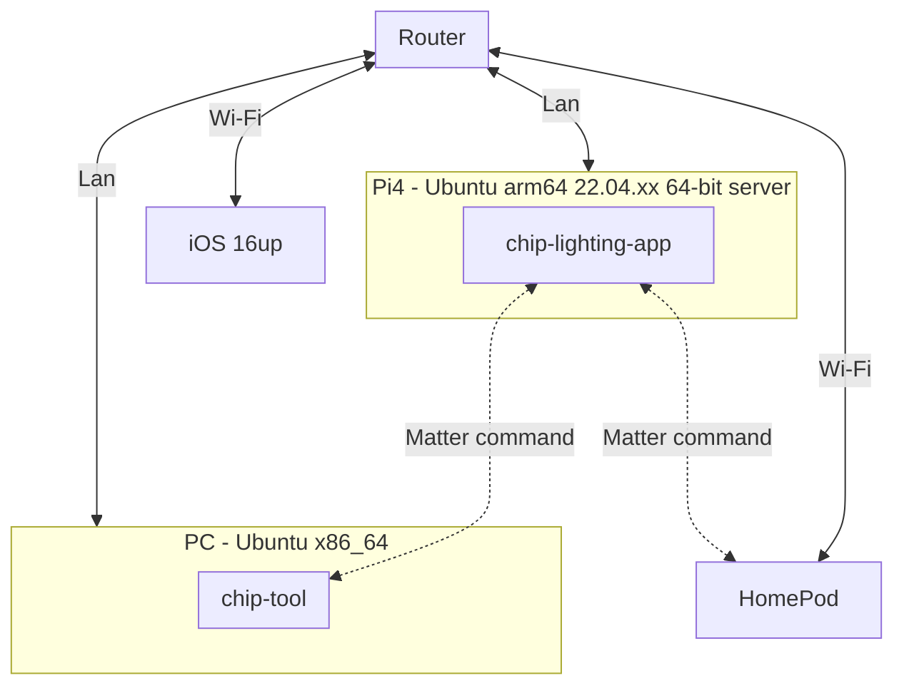

# Matter Controller - [chip-tool](https://github.com/project-chip/connectedhomeip/blob/master/examples/chip-tool)
[](https://github.com/lankahsu520/HelperX)
[![GitHub license][license-image]][license-url]
[![GitHub stars][stars-image]][stars-url]
[![GitHub forks][forks-image]][forks-url]
[![GitHub issues][issues-image]][issues-image]
[![GitHub watchers][watchers-image]][watchers-image]

[license-image]: https://img.shields.io/github/license/lankahsu520/HelperX.svg
[license-url]: https://github.com/lankahsu520/HelperX/blob/master/LICENSE
[stars-image]: https://img.shields.io/github/stars/lankahsu520/HelperX.svg
[stars-url]: https://github.com/lankahsu520/HelperX/stargazers
[forks-image]: https://img.shields.io/github/forks/lankahsu520/HelperX.svg
[forks-url]: https://github.com/lankahsu520/HelperX/network
[issues-image]: https://img.shields.io/github/issues/lankahsu520/HelperX.svg
[issues-url]: https://github.com/lankahsu520/HelperX/issues
[watchers-image]: https://img.shields.io/github/watchers/lankahsu520/HelperX.svg
[watchers-url]: https://github.com/lankahsu520/HelperX/watchers

# 1. Overview

> run on PC - Ubuntu x86_64

>  [chip-tool](https://github.com/project-chip/connectedhomeip/blob/master/examples/chip-tool) is a C++ command line controller with an interactive shell. More information on chip-tool can be found in the [chip-tool guide](https://github.com/project-chip/connectedhomeip/blob/master/docs/development_controllers/chip-tool/chip_tool_guide.md).
>
>  [chip-repl](https://github.com/project-chip/connectedhomeip/blob/master/src/controller/python/chip-repl.py) is a shell for the python controller. The chip-repl is part of the python controller framework, often used for testing. More information about the python controller can be found in the [python testing](https://github.com/project-chip/connectedhomeip/blob/master/docs/testing/python.md) documentation.

## 1.1. Topology



## 1.2. [Matter Client Example](https://github.com/project-chip/connectedhomeip/blob/master/examples/chip-tool/README.md)

> An example application that uses Matter to send messages to a Matter server.
>
> - [Building the Example Application](https://github.com/project-chip/connectedhomeip/blob/master/examples/chip-tool/README.md#building-the-example-application)
> - [Using the Client to Commission a Device](https://github.com/project-chip/connectedhomeip/blob/master/examples/chip-tool/README.md#using-the-client-to-commission-a-device)

#### A. by snap

```bash
# 你也可以透過 snap 安裝 chip-tool
$ sudo snap install chip-tool

$ tree -L 4 ~/snap/chip-tool/
/home/lanka/snap/chip-tool/
├── 199
├── common
│   ├── chip_tool_config.alpha.ini
│   ├── chip_tool_config.ini
│   ├── chip_tool_history
│   └── chip_tool_kvs
└── current -> 199

3 directories, 4 files
```

#### B. build by myself

# 2. Uses of mode

## 2.1. Single-command mode (default)

>  In this mode, the CHIP Tool will exit with a timeout error if any single command does not complete within a certain timeout period.

```bash
$ chip-tool
[1736406389.476] [678821:678821] [TOO] Missing cluster or command set name
Usage:
  /snap/chip-tool/199/bin/chip-tool cluster_name command_name [param1 param2 ...]
or:
  /snap/chip-tool/199/bin/chip-tool command_set_name command_name [param1 param2 ...]

  +-------------------------------------------------------------------------------------+
  | Clusters:                                                                           |
  +-------------------------------------------------------------------------------------+
  | * accesscontrol                                                                     |
  | * accountlogin                                                                      |
  | * actions                                                                           |
  | * activatedcarbonfiltermonitoring                                                   |
  | * administratorcommissioning                                                        |
  | * airquality                                                                        |
  | * applicationbasic                                                                  |
  | * applicationlauncher                                                               |
  | * audiooutput                                                                       |
  | * ballastconfiguration                                                              |
  | * basicinformation                                                                  |
  | * binding                                                                           |
  | * booleanstate                                                                      |
  | * booleanstateconfiguration                                                         |
  | * bridgeddevicebasicinformation                                                     |
  | * carbondioxideconcentrationmeasurement                                             |
  | * carbonmonoxideconcentrationmeasurement                                            |
  | * channel                                                                           |
  | * chime                                                                             |
  | * colorcontrol                                                                      |
  | * commissionercontrol                                                               |
  | * contentappobserver                                                                |
  | * contentcontrol                                                                    |
  | * contentlauncher                                                                   |
  | * demandresponseloadcontrol                                                         |
  | * descriptor                                                                        |
  | * deviceenergymanagement                                                            |
  | * deviceenergymanagementmode                                                        |
  | * diagnosticlogs                                                                    |
  | * dishwasheralarm                                                                   |
  | * dishwashermode                                                                    |
  | * doorlock                                                                          |
  | * ecosysteminformation                                                              |
  | * electricalenergymeasurement                                                       |
  | * electricalpowermeasurement                                                        |
  | * energyevse                                                                        |
  | * energyevsemode                                                                    |
  | * energypreference                                                                  |
  | * ethernetnetworkdiagnostics                                                        |
  | * fancontrol                                                                        |
  | * faultinjection                                                                    |
  | * fixedlabel                                                                        |
  | * flowmeasurement                                                                   |
  | * formaldehydeconcentrationmeasurement                                              |
  | * generalcommissioning                                                              |
  | * generaldiagnostics                                                                |
  | * groupkeymanagement                                                                |
  | * groups                                                                            |
  | * hepafiltermonitoring                                                              |
  | * icdmanagement                                                                     |
  | * identify                                                                          |
  | * illuminancemeasurement                                                            |
  | * keypadinput                                                                       |
  | * laundrydryercontrols                                                              |
  | * laundrywashercontrols                                                             |
  | * laundrywashermode                                                                 |
  | * levelcontrol                                                                      |
  | * localizationconfiguration                                                         |
  | * lowpower                                                                          |
  | * mediainput                                                                        |
  | * mediaplayback                                                                     |
  | * messages                                                                          |
  | * microwaveovencontrol                                                              |
  | * microwaveovenmode                                                                 |
  | * modeselect                                                                        |
  | * networkcommissioning                                                              |
  | * nitrogendioxideconcentrationmeasurement                                           |
  | * occupancysensing                                                                  |
  | * onoff                                                                             |
  | * operationalcredentials                                                            |
  | * operationalstate                                                                  |
  | * otasoftwareupdateprovider                                                         |
  | * otasoftwareupdaterequestor                                                        |
  | * ovencavityoperationalstate                                                        |
  | * ovenmode                                                                          |
  | * ozoneconcentrationmeasurement                                                     |
  | * pm10concentrationmeasurement                                                      |
  | * pm1concentrationmeasurement                                                       |
  | * pm25concentrationmeasurement                                                      |
  | * powersource                                                                       |
  | * powersourceconfiguration                                                          |
  | * powertopology                                                                     |
  | * pressuremeasurement                                                               |
  | * proxyconfiguration                                                                |
  | * proxydiscovery                                                                    |
  | * proxyvalid                                                                        |
  | * pulsewidthmodulation                                                              |
  | * pumpconfigurationandcontrol                                                       |
  | * radonconcentrationmeasurement                                                     |
  | * refrigeratoralarm                                                                 |
  | * refrigeratorandtemperaturecontrolledcabinetmode                                   |
  | * relativehumiditymeasurement                                                       |
  | * rvccleanmode                                                                      |
  | * rvcoperationalstate                                                               |
  | * rvcrunmode                                                                        |
  | * samplemei                                                                         |
  | * scenesmanagement                                                                  |
  | * servicearea                                                                       |
  | * smokecoalarm                                                                      |
  | * softwarediagnostics                                                               |
  | * switch                                                                            |
  | * targetnavigator                                                                   |
  | * temperaturecontrol                                                                |
  | * temperaturemeasurement                                                            |
  | * thermostat                                                                        |
  | * thermostatuserinterfaceconfiguration                                              |
  | * threadborderroutermanagement                                                      |
  | * threadnetworkdiagnostics                                                          |
  | * threadnetworkdirectory                                                            |
  | * timeformatlocalization                                                            |
  | * timesynchronization                                                               |
  | * timer                                                                             |
  | * totalvolatileorganiccompoundsconcentrationmeasurement                             |
  | * unitlocalization                                                                  |
  | * unittesting                                                                       |
  | * userlabel                                                                         |
  | * valveconfigurationandcontrol                                                      |
  | * wakeonlan                                                                         |
  | * waterheatermanagement                                                             |
  | * waterheatermode                                                                   |
  | * webrtctransportprovider                                                           |
  | * wifinetworkdiagnostics                                                            |
  | * wifinetworkmanagement                                                             |
  | * windowcovering                                                                    |
  +-------------------------------------------------------------------------------------+

  +-------------------------------------------------------------------------------------+
  | Command sets:                                                                       |
  +-------------------------------------------------------------------------------------+
  | * any                                                                               |
  |   - Commands for sending IM messages based on cluster id, not cluster name.         |
  | * delay                                                                             |
  |   - Commands for waiting for something to happen.                                   |
  | * discover                                                                          |
  |   - Commands for device discovery.                                                  |
  | * groupsettings                                                                     |
  |   - Commands for manipulating group keys and memberships for chip-tool itself.      |
  | * icd                                                                               |
  |   - Commands for client-side ICD management.                                        |
  | * pairing                                                                           |
  |   - Commands for commissioning devices.                                             |
  | * payload                                                                           |
  |   - Commands for parsing and generating setup payloads.                             |
  | * sessionmanagement                                                                 |
  |   - Commands for managing CASE and PASE session state.                              |
  | * subscriptions                                                                     |
  |   - Commands for shutting down subscriptions.                                       |
  | * interactive                                                                       |
  |   - Commands for starting long-lived interactive modes.                             |
  | * storage                                                                           |
  |   - Commands for managing persistent data stored by chip-tool.                      |
  +-------------------------------------------------------------------------------------+
[1736406389.476] [678821:678821] [TOO] Run command failure: ../examples/chip-tool/commands/common/Commands.cpp:230: Error 0x0000002F
```

## 2.2. Interactive mode

> In this mode, a command will terminate with an error if it does not complete within the timeout period. However, the CHIP Tool will not be terminated and it will not terminate processes that previous commands have started. Moreover, when using the interactive mode, the CHIP Tool will establish a new CASE session only when there is no session available yet. On the following commands, it will use the existing session.

```bash
$ chip-tool interactive start
[1736406127.408] [678778:678778] [DL] ChipLinuxStorage::Init: Using KVS config file: /home/lanka/snap/chip-tool/common/chip_tool_kvs
[1736406127.411] [678778:678778] [DL] ChipLinuxStorage::Init: Attempt to re-initialize with KVS config file: /tmp/chip_kvs
[1736406127.412] [678778:678778] [DL] ChipLinuxStorage::Init: Using KVS config file: /tmp/chip_factory.ini
[1736406127.413] [678778:678778] [DL] ChipLinuxStorage::Init: Using KVS config file: /tmp/chip_config.ini
[1736406127.413] [678778:678778] [DL] ChipLinuxStorage::Init: Using KVS config file: /tmp/chip_counters.ini
[1736406127.414] [678778:678778] [DL] Wrote settings to /tmp/chip_counters.ini
[1736406127.414] [678778:678778] [DL] NVS set: chip-counters/reboot-count = 3 (0x3)
[1736406127.417] [678778:678778] [DL] Got Ethernet interface: enp0s3
[1736406127.417] [678778:678778] [DL] Found the primary Ethernet interface:enp0s3
[1736406127.417] [678778:678778] [DL] Failed to get WiFi interface
[1736406127.417] [678778:678778] [DL] Failed to reset WiFi statistic counts
[1736406127.417] [678778:678778] [IN] UDP::Init bind&listen port=0
[1736406127.417] [678778:678778] [IN] UDP::Init bound to port=58623
[1736406127.417] [678778:678778] [IN] UDP::Init bind&listen port=0
[1736406127.417] [678778:678778] [IN] UDP::Init bound to port=59430
[1736406127.417] [678778:678778] [IN] BLEBase::Init - setting/overriding transport
[1736406127.417] [678778:678778] [IN] TransportMgr initialized
[1736406127.417] [678778:678778] [FP] Initializing FabricTable from persistent storage
[1736406127.417] [678778:678778] [TS] Last Known Good Time: 2023-10-14T01:16:48
[1736406127.418] [678778:678778] [FP] Fabric index 0x1 was retrieved from storage. Compressed FabricId 0x219D881E54F0F01B, FabricId 0x0000000000000001, NodeId 0x000000000001B669, VendorId 0xFFF1
[1736406127.419] [678778:678778] [ZCL] Using ZAP configuration...
[1736406127.419] [678778:678778] [IN] CASE Server enabling CASE session setups
[1736406127.419] [678778:678778] [IN] SecureSession[0x564018813480]: Allocated Type:2 LSID:26269
[1736406127.419] [678778:678778] [SC] Allocated SecureSession (0x564018813480) - waiting for Sigma1 msg
[1736406127.419] [678778:678778] [IM] WARNING ┌────────────────────────────────────────────────────
[1736406127.419] [678778:678778] [IM] WARNING │ Interaction Model Engine running in 'Checked' mode.
[1736406127.419] [678778:678778] [IM] WARNING │ This executes BOTH ember and data-model code paths.
[1736406127.419] [678778:678778] [IM] WARNING │ which is inefficient and consumes more flash space.
[1736406127.419] [678778:678778] [IM] WARNING │ This should be done for testing only.
[1736406127.419] [678778:678778] [IM] WARNING └────────────────────────────────────────────────────
[1736406127.419] [678778:678778] [CTL] System State Initialized...
[1736406127.420] [678778:678778] [CTL] Setting attestation nonce to random value
[1736406127.420] [678778:678778] [CTL] Setting CSR nonce to random value
[1736406127.420] [678778:678778] [IN] UDP::Init bind&listen port=5550
[1736406127.420] [678778:678778] [IN] UDP::Init bound to port=5550
[1736406127.420] [678778:678778] [IN] UDP::Init bind&listen port=5550
[1736406127.420] [678778:678778] [IN] UDP::Init bound to port=5550
[1736406127.420] [678778:678778] [IN] TransportMgr initialized
[1736406127.420] [678778:678802] [DL] CHIP task running
[1736406127.420] [678778:678802] [DL] HandlePlatformSpecificBLEEvent 32786
>>>

```

# 3. chip-tool command_set_name

> 以下用 interactive mode 進行操作

## 3.1. any

> Commands for sending IM messages based on cluster id, not cluster name.

```bash
>>> any
[1736408479.127] [678961:678961] [TOO] Command: any
[1736408479.127] [678961:678961] [TOO] Missing command name
Usage:
   any command_name [param1 param2 ...]

Commands for sending IM messages based on cluster id, not cluster name.

  +-------------------------------------------------------------------------------------+
  | Commands:                                                                           |
  +-------------------------------------------------------------------------------------+
  | * command-by-id                                                                     |
  | * read-by-id                                                                        |
  | * write-by-id                                                                       |
  | * subscribe-by-id                                                                   |
  | * read-event-by-id                                                                  |
  | * subscribe-event-by-id                                                             |
  | * read-none                                                                         |
  | * read-all                                                                          |
  | * subscribe-none                                                                    |
  | * subscribe-all                                                                     |
  +-------------------------------------------------------------------------------------+
>>>
```

#### any read-by-id

```bash
>>> any read-by-id
[1736408673.417] [678961:678961] [TOO] Command: any read-by-id
[1736408673.417] [678961:678961] [TOO] InitArgs: Wrong arguments number: 0 instead of 4
Usage:
   any read-by-id cluster-ids attribute-ids destination-id endpoint-ids [--paa-trust-store-path] [--cd-trust-store-path] [--commissioner-name] [--commissioner-nodeid] [--use-max-sized-certs] [--only-allow-trusted-cd-keys] [--dac-revocation-set-path] [--trace_file] [--trace_log] [--trace_decode] [--trace-to] [--ble-adapter] [--storage-directory] [--commissioner-vendor-id] [--fabric-filtered] [--data-version] [--lit-icd-peer] [--timeout] [--allow-large-payload]

# 6 (OnOff)
>>> any read-by-id 0x06 0xFFFFFFFF 1 1
```


## 3.2. delay

> Commands for waiting for something to happen.

```bash
>>> delay
[1736408467.020] [678961:678961] [TOO] Command: delay
[1736408467.020] [678961:678961] [TOO] Missing command name
Usage:
   delay command_name [param1 param2 ...]

Commands for waiting for something to happen.

  +-------------------------------------------------------------------------------------+
  | Commands:                                                                           |
  +-------------------------------------------------------------------------------------+
  | * sleep                                                                             |
  | * wait-for-commissionee                                                             |
  |   - Establish a CASE session to the provided node id.                               |
  +-------------------------------------------------------------------------------------+
>>>
```

## 3.3. discover

> Commands for device discovery.

```bash
>>> discover
[1736408445.015] [678961:678961] [TOO] Command: discover
[1736408445.016] [678961:678961] [TOO] Missing command name
Usage:
   discover command_name [param1 param2 ...]

Commands for device discovery.

  +-------------------------------------------------------------------------------------+
  | Commands:                                                                           |
  +-------------------------------------------------------------------------------------+
  | * resolve                                                                           |
  | * start                                                                             |
  | * stop                                                                              |
  | * list                                                                              |
  | * commissionables                                                                   |
  | * find-commissionable-by-short-discriminator                                        |
  | * find-commissionable-by-long-discriminator                                         |
  | * find-commissionable-by-commissioning-mode                                         |
  | * find-commissionable-by-vendor-id                                                  |
  | * find-commissionable-by-device-type                                                |
  | * find-commissionable-by-instance-name                                              |
  | * commissioners                                                                     |
  +-------------------------------------------------------------------------------------+
>>>
```

## 3.4. groupsettings

> Commands for manipulating group keys and memberships for chip-tool itself.

```bash
>>> groupsettings
[1736408433.134] [678961:678961] [TOO] Command: groupsettings
[1736408433.134] [678961:678961] [TOO] Missing command name
Usage:
   groupsettings command_name [param1 param2 ...]

Commands for manipulating group keys and memberships for chip-tool itself.

  +-------------------------------------------------------------------------------------+
  | Commands:                                                                           |
  +-------------------------------------------------------------------------------------+
  | * show-groups                                                                       |
  | * add-group                                                                         |
  | * remove-group                                                                      |
  | * show-keysets                                                                      |
  | * bind-keyset                                                                       |
  | * unbind-keyset                                                                     |
  | * add-keysets                                                                       |
  | * remove-keyset                                                                     |
  +-------------------------------------------------------------------------------------+
>>>
```

## 3.5. icd

> Commands for client-side ICD management.

```bash
>>> icd
[1736408408.632] [678961:678961] [TOO] Command: icd
[1736408408.632] [678961:678961] [TOO] Missing command name
Usage:
   icd command_name [param1 param2 ...]

Commands for client-side ICD management.

  +-------------------------------------------------------------------------------------+
  | Commands:                                                                           |
  +-------------------------------------------------------------------------------------+
  | * list                                                                              |
  |   - List ICDs registed by this controller.                                          |
  | * wait-for-device                                                                   |
  +-------------------------------------------------------------------------------------+
>>>
```

## 3.6. pairing

> Commands for commissioning devices.

>  Matter devices can use different commissioning channels:
>
>  - Devices that are not yet connected to the target IP network use Bluetooth LE as the commissioning channel.
>  - Devices that have already joined an IP network only need to use the IP protocol for commissioning to the Matter network.

```bash
>>> pairing
[1736406770.594] [678778:678778] [TOO] Command: pairing
[1736406770.595] [678778:678778] [TOO] Missing command name
Usage:
   pairing command_name [param1 param2 ...]

Commands for commissioning devices.

  +-------------------------------------------------------------------------------------+
  | Commands:                                                                           |
  +-------------------------------------------------------------------------------------+
  | * unpair                                                                            |
  | * code                                                                              |
  | * code-paseonly                                                                     |
  | * code-wifi                                                                         |
  | * code-thread                                                                       |
  | * code-wifi-thread                                                                  |
  | * ble-wifi                                                                          |
  | * ble-thread                                                                        |
  | * softap                                                                            |
  | * already-discovered                                                                |
  | * already-discovered-by-index                                                       |
  | * already-discovered-by-index-with-wifi                                             |
  | * already-discovered-by-index-with-code                                             |
  | * onnetwork                                                                         |
  | * onnetwork-short                                                                   |
  | * onnetwork-long                                                                    |
  | * onnetwork-vendor                                                                  |
  | * onnetwork-commissioning-mode                                                      |
  | * onnetwork-commissioner                                                            |
  | * onnetwork-device-type                                                             |
  | * onnetwork-instance-name                                                           |
  | * start-udc-server                                                                  |
  | * open-commissioning-window                                                         |
  | * get-commissioner-node-id                                                          |
  | * get-commissioner-root-certificate                                                 |
  |   - Returns a base64-encoded RCAC prefixed with: 'base64:'                          |
  | * issue-noc-chain                                                                   |
  |   - Returns a base64-encoded NOC, ICAC, RCAC, and IPK prefixed with: 'base64:'      |
  +-------------------------------------------------------------------------------------+
>>>
```

#### A. Commissioning into a Thread network over Bluetooth LE

 ```bash
>>> pairing ble-thread
Usage:
   pairing ble-thread node-id operationalDataset setup-pin-code discriminator [--paa-trust-store-path] [--cd-trust-store-path] [--commissioner-name] [--commissioner-nodeid] [--use-max-sized-certs] [--only-allow-trusted-cd-keys] [--dac-revocation-set-path] [--trace_file] [--trace_log] [--trace_decode] [--trace-to] [--ble-adapter] [--storage-directory] [--commissioner-vendor-id] [--bypass-attestation-verifier] [--case-auth-tags] [--icd-registration] [--icd-check-in-nodeid] [--icd-monitored-subject] [--icd-client-type] [--icd-symmetric-key] [--icd-stay-active-duration] [--skip-commissioning-complete] [--country-code] [--time-zone] [--dst-offset] [--timeout]

>>>
 ```

#### B. Commissioning into a Wi-Fi network over Bluetooth LE

 ```bash
>>> pairing ble-wifi
Usage:
   pairing ble-wifi node-id ssid password setup-pin-code discriminator [--paa-trust-store-path] [--cd-trust-store-path] [--commissioner-name] [--commissioner-nodeid] [--use-max-sized-certs] [--only-allow-trusted-cd-keys] [--dac-revocation-set-path] [--trace_file] [--trace_log] [--trace_decode] [--trace-to] [--ble-adapter] [--storage-directory] [--commissioner-vendor-id] [--bypass-attestation-verifier] [--case-auth-tags] [--icd-registration] [--icd-check-in-nodeid] [--icd-monitored-subject] [--icd-client-type] [--icd-symmetric-key] [--icd-stay-active-duration] [--skip-commissioning-complete] [--country-code] [--time-zone] [--dst-offset] [--timeout]

>>>
 ```

#### C. Commissioning into a network over IP

```bash
>>> pairing onnetwork
Usage:
   pairing onnetwork node-id setup-pin-code [--paa-trust-store-path] [--cd-trust-store-path] [--commissioner-name] [--commissioner-nodeid] [--use-max-sized-certs] [--only-allow-trusted-cd-keys] [--dac-revocation-set-path] [--trace_file] [--trace_log] [--trace_decode] [--trace-to] [--ble-adapter] [--storage-directory] [--commissioner-vendor-id] [--bypass-attestation-verifier] [--case-auth-tags] [--icd-registration] [--icd-check-in-nodeid] [--icd-monitored-subject] [--icd-client-type] [--icd-symmetric-key] [--icd-stay-active-duration] [--skip-commissioning-complete] [--pase-only] [--country-code] [--time-zone] [--dst-offset] [--timeout]

>>>
```

#### D. Commissioning with long discriminator

```bash
>>> pairing onnetwork-long 
Usage:
   pairing onnetwork-long node-id setup-pin-code discriminator [--paa-trust-store-path] [--cd-trust-store-path] [--commissioner-name] [--commissioner-nodeid] [--use-max-sized-certs] [--only-allow-trusted-cd-keys] [--dac-revocation-set-path] [--trace_file] [--trace_log] [--trace_decode] [--trace-to] [--ble-adapter] [--storage-directory] [--commissioner-vendor-id] [--bypass-attestation-verifier] [--case-auth-tags] [--icd-registration] [--icd-check-in-nodeid] [--icd-monitored-subject] [--icd-client-type] [--icd-symmetric-key] [--icd-stay-active-duration] [--skip-commissioning-complete] [--pase-only] [--country-code] [--time-zone] [--dst-offset] [--timeout]

>>>
```

#### E. Commissioning with QR code payload or manual pairing code

```bash
>>> pairing code
Usage:
   pairing code node-id payload [--paa-trust-store-path] [--cd-trust-store-path] [--commissioner-name] [--commissioner-nodeid] [--use-max-sized-certs] [--only-allow-trusted-cd-keys] [--dac-revocation-set-path] [--trace_file] [--trace_log] [--trace_decode] [--trace-to] [--ble-adapter] [--storage-directory] [--commissioner-vendor-id] [--bypass-attestation-verifier] [--case-auth-tags] [--icd-registration] [--icd-check-in-nodeid] [--icd-monitored-subject] [--icd-client-type] [--icd-symmetric-key] [--icd-stay-active-duration] [--skip-commissioning-complete] [--discover-once] [--use-only-onnetwork-discovery] [--country-code] [--time-zone] [--dst-offset] [--timeout]

>>>
```

#### F. Forgetting the already-commissioned device

```bash
>>> pairing unpair
Usage:
   pairing unpair node-id [--paa-trust-store-path] [--cd-trust-store-path] [--commissioner-name] [--commissioner-nodeid] [--use-max-sized-certs] [--only-allow-trusted-cd-keys] [--dac-revocation-set-path] [--trace_file] [--trace_log] [--trace_decode] [--trace-to] [--ble-adapter] [--storage-directory] [--commissioner-vendor-id] [--bypass-attestation-verifier] [--case-auth-tags] [--icd-registration] [--icd-check-in-nodeid] [--icd-monitored-subject] [--icd-client-type] [--icd-symmetric-key] [--icd-stay-active-duration] [--timeout]

>>>
```

## 3.7. payload

> Commands for parsing and generating setup payloads.

```bash
>>> payload
[1736408377.265] [678961:678961] [TOO] Command: payload
[1736408377.266] [678961:678961] [TOO] Missing command name
Usage:
   payload command_name [param1 param2 ...]

Commands for parsing and generating setup payloads.

  +-------------------------------------------------------------------------------------+
  | Commands:                                                                           |
  +-------------------------------------------------------------------------------------+
  | * generate-qrcode                                                                   |
  | * generate-manualcode                                                               |
  | * parse-setup-payload                                                               |
  | * parse-additional-data-payload                                                     |
  | * verhoeff-verify                                                                   |
  | * verhoeff-generate                                                                 |
  +-------------------------------------------------------------------------------------+
>>>
```

#### payload parse-setup-payload

```bash
>>> payload parse-setup-payload MT:-24J0IRV01DWLA39G00
[1736407855.826] [678778:678778] [TOO] Command: payload parse-setup-payload MT:-24J0IRV01DWLA39G00
[1736407855.826] [678778:678778] [SPL] Parsing base38Representation: MT:-24J0IRV01DWLA39G00
[1736407855.826] [678778:678778] [SPL] Version:             0
[1736407855.826] [678778:678778] [SPL] VendorID:            65521
[1736407855.826] [678778:678778] [SPL] ProductID:           32769
[1736407855.826] [678778:678778] [SPL] Custom flow:         0    (STANDARD)
[1736407855.827] [678778:678778] [SPL] Discovery Bitmask:   0x04 (On IP network)
[1736407855.827] [678778:678778] [SPL] Long discriminator:  3849   (0xf09)
[1736407855.827] [678778:678778] [SPL] Passcode:            20231206
```

## 3.8. sessionmanagement

> Commands for managing CASE and PASE session state.

```bash
>>> sessionmanagement
[1736408361.380] [678961:678961] [TOO] Command: sessionmanagement
[1736408361.380] [678961:678961] [TOO] Missing command name
Usage:
   sessionmanagement command_name [param1 param2 ...]

Commands for managing CASE and PASE session state.

  +-------------------------------------------------------------------------------------+
  | Commands:                                                                           |
  +-------------------------------------------------------------------------------------+
  | * send-close-session                                                                |
  |   - Sends a CloseSession message to the given node id.                              |
  | * expire-case-sessions                                                              |
  |   - Expires (evicts) all local CASE sessions to the given node id.                  |
  +-------------------------------------------------------------------------------------+
>>>
```

## 3.9. subscriptions

> Commands for shutting down subscriptions.

```bash
>>> subscriptions
[1736408345.247] [678961:678961] [TOO] Command: subscriptions
[1736408345.247] [678961:678961] [TOO] Missing command name
Usage:
   subscriptions command_name [param1 param2 ...]

Commands for shutting down subscriptions.

  +-------------------------------------------------------------------------------------+
  | Commands:                                                                           |
  +-------------------------------------------------------------------------------------+
  | * shutdown-one                                                                      |
  |   - Shut down a single subscription, identified by its subscription id and target...|
  | * shutdown-all-for-node                                                             |
  |   - Shut down all subscriptions targeting a given node.                             |
  | * shutdown-all                                                                      |
  |   - Shut down all subscriptions to all nodes.                                       |
  +-------------------------------------------------------------------------------------+
>>>
```

## 3.10. interactive

> Commands for starting long-lived interactive modes.

```bash
>>> interactive
[1736406701.652] [678778:678778] [TOO] Command: interactive
[1736406701.652] [678778:678778] [TOO] Missing command name
Usage:
   interactive command_name [param1 param2 ...]

Commands for starting long-lived interactive modes.

  +-------------------------------------------------------------------------------------+
  | Commands:                                                                           |
  +-------------------------------------------------------------------------------------+
  | * start                                                                             |
  |   - Start an interactive shell that can then run other commands.                    |
  | * server                                                                            |
  |   - Start a websocket server that can receive commands sent by another process.     |
  +-------------------------------------------------------------------------------------+
>>>
```

## 3.10. storage

> Commands for managing persistent data stored by chip-tool.

```bash
>>> storage
[1736408310.102] [678961:678961] [TOO] Command: storage
[1736408310.102] [678961:678961] [TOO] Missing command name
Usage:
   storage command_name [param1 param2 ...]

Commands for managing persistent data stored by chip-tool.

  +-------------------------------------------------------------------------------------+
  | Commands:                                                                           |
  +-------------------------------------------------------------------------------------+
  | * clear-all                                                                         |
  +-------------------------------------------------------------------------------------+
>>>
```

# 4. chip-tool cluster_name

## 4.1. basicinformation

```bash
>>> basicinformation
[1736409246.363] [678961:678961] [TOO] Command: basicinformation
[1736409246.363] [678961:678961] [TOO] Missing command name
Usage:
   basicinformation command_name [param1 param2 ...]

  +-------------------------------------------------------------------------------------+
  | Commands:                                                                           |
  +-------------------------------------------------------------------------------------+
  | * command-by-id                                                                     |
  | * mfg-specific-ping                                                                 |
  | * read-by-id                                                                        |
  | * read                                                                              |
  | * write-by-id                                                                       |
  | * force-write                                                                       |
  | * write                                                                             |
  | * subscribe-by-id                                                                   |
  | * subscribe                                                                         |
  | * read-event-by-id                                                                  |
  | * read-event                                                                        |
  | * subscribe-event-by-id                                                             |
  | * subscribe-event                                                                   |
  +-------------------------------------------------------------------------------------+
>>>
```

#### basicinformation read

```bash
>>> basicinformation read
[1736410274.443] [679162:679162] [TOO] Command: basicinformation read
[1736410274.443] [679162:679162] [TOO] Missing attribute name
Usage:
   basicinformation read attribute-name [param1 param2 ...]

  +-------------------------------------------------------------------------------------+
  | Attributes:                                                                         |
  +-------------------------------------------------------------------------------------+
  | * data-model-revision                                                               |
  | * vendor-name                                                                       |
  | * vendor-id                                                                         |
  | * product-name                                                                      |
  | * product-id                                                                        |
  | * node-label                                                                        |
  | * location                                                                          |
  | * hardware-version                                                                  |
  | * hardware-version-string                                                           |
  | * software-version                                                                  |
  | * software-version-string                                                           |
  | * manufacturing-date                                                                |
  | * part-number                                                                       |
  | * product-url                                                                       |
  | * product-label                                                                     |
  | * serial-number                                                                     |
  | * local-config-disabled                                                             |
  | * reachable                                                                         |
  | * unique-id                                                                         |
  | * capability-minima                                                                 |
  | * product-appearance                                                                |
  | * specification-version                                                             |
  | * max-paths-per-invoke                                                              |
  | * generated-command-list                                                            |
  | * accepted-command-list                                                             |
  | * event-list                                                                        |
  | * attribute-list                                                                    |
  | * feature-map                                                                       |
  | * cluster-revision                                                                  |
  +-------------------------------------------------------------------------------------+
>>>

>>> basicinformation read vendor-name 1 0xFFFF --timeout 5

>>> basicinformation read product-name 1 0xFFFF --timeout 5

>>> basicinformation read software-version 1 0xFFFF --timeout 5
```

## 4.2. descriptor

```bash
>>> descriptor
[1736409936.647] [679162:679162] [TOO] Command: descriptor
[1736409936.647] [679162:679162] [TOO] Missing command name
Usage:
   descriptor command_name [param1 param2 ...]

  +-------------------------------------------------------------------------------------+
  | Commands:                                                                           |
  +-------------------------------------------------------------------------------------+
  | * command-by-id                                                                     |
  | * read-by-id                                                                        |
  | * read                                                                              |
  | * write-by-id                                                                       |
  | * force-write                                                                       |
  | * subscribe-by-id                                                                   |
  | * subscribe                                                                         |
  | * read-event-by-id                                                                  |
  | * subscribe-event-by-id                                                             |
  +-------------------------------------------------------------------------------------+
>>>
```

#### descriptor read

```bash
>>> descriptor read
[1736410109.831] [679162:679162] [TOO] Command: descriptor read
[1736410109.831] [679162:679162] [TOO] Missing attribute name
Usage:
   descriptor read attribute-name [param1 param2 ...]

  +-------------------------------------------------------------------------------------+
  | Attributes:                                                                         |
  +-------------------------------------------------------------------------------------+
  | * device-type-list                                                                  |
  | * server-list                                                                       |
  | * client-list                                                                       |
  | * parts-list                                                                        |
  | * tag-list                                                                          |
  | * generated-command-list                                                            |
  | * accepted-command-list                                                             |
  | * event-list                                                                        |
  | * attribute-list                                                                    |
  | * feature-map                                                                       |
  | * cluster-revision                                                                  |
  +-------------------------------------------------------------------------------------+
>>>

>>> descriptor read parts-list 1 0xFFFF

# 列出 Clusters - server
>>> descriptor read server-list 1 1

# 列出 Clusters - client
>>> descriptor read client-list 1 1
```

## 4.3. levelcontrol

```bash
>>> levelcontrol
[1736410450.959] [679162:679162] [TOO] Command: levelcontrol
[1736410450.959] [679162:679162] [TOO] Missing command name
Usage:
   levelcontrol command_name [param1 param2 ...]

  +-------------------------------------------------------------------------------------+
  | Commands:                                                                           |
  +-------------------------------------------------------------------------------------+
  | * command-by-id                                                                     |
  | * move-to-level                                                                     |
  | * move                                                                              |
  | * step                                                                              |
  | * stop                                                                              |
  | * move-to-level-with-on-off                                                         |
  | * move-with-on-off                                                                  |
  | * step-with-on-off                                                                  |
  | * stop-with-on-off                                                                  |
  | * move-to-closest-frequency                                                         |
  | * read-by-id                                                                        |
  | * read                                                                              |
  | * write-by-id                                                                       |
  | * force-write                                                                       |
  | * write                                                                             |
  | * subscribe-by-id                                                                   |
  | * subscribe                                                                         |
  | * read-event-by-id                                                                  |
  | * subscribe-event-by-id                                                             |
  +-------------------------------------------------------------------------------------+
>>>
```

#### levelcontrol move-to-level

```bash
>>> levelcontrol move-to-level
[1736410480.614] [679162:679162] [TOO] Command: levelcontrol move-to-level
[1736410480.614] [679162:679162] [TOO] InitArgs: Wrong arguments number: 0 instead of 6
Usage:
   levelcontrol move-to-level Level TransitionTime OptionsMask OptionsOverride destination-id endpoint-id-ignored-for-group-commands [--paa-trust-store-path] [--cd-trust-store-path] [--commissioner-name] [--commissioner-nodeid] [--use-max-sized-certs] [--only-allow-trusted-cd-keys] [--dac-revocation-set-path] [--trace_file] [--trace_log] [--trace_decode] [--trace-to] [--ble-adapter] [--storage-directory] [--commissioner-vendor-id] [--timedInteractionTimeoutMs] [--busyWaitForMs] [--suppressResponse] [--repeat-count] [--repeat-delay-ms] [--lit-icd-peer] [--timeout] [--allow-large-payload]

destination-id:
  64-bit node or group identifier.
  Group identifiers are detected by being in the 0xFFFF'FFFF'FFFF'xxxx range.

endpoint-id-ignored-for-group-commands:
  Endpoint the command is targeted at.

>>> levelcontrol move-to-level 100 0 0 0 1 1
>>> levelcontrol move-to-level 200 0 0 0 1 1
>>> levelcontrol read current-level 1 1
>>> levelcontrol read max-level 1 1
>>> levelcontrol read min-level 1 1
```

## 4.4. onoff

```bash
>>> onoff
[1736410866.317] [679290:679290] [TOO] Command: onoff
[1736410866.317] [679290:679290] [TOO] Missing command name
Usage:
   onoff command_name [param1 param2 ...]

  +-------------------------------------------------------------------------------------+
  | Commands:                                                                           |
  +-------------------------------------------------------------------------------------+
  | * command-by-id                                                                     |
  | * off                                                                               |
  | * on                                                                                |
  | * toggle                                                                            |
  | * off-with-effect                                                                   |
  | * on-with-recall-global-scene                                                       |
  | * on-with-timed-off                                                                 |
  | * read-by-id                                                                        |
  | * read                                                                              |
  | * write-by-id                                                                       |
  | * force-write                                                                       |
  | * write                                                                             |
  | * subscribe-by-id                                                                   |
  | * subscribe                                                                         |
  | * read-event-by-id                                                                  |
  | * subscribe-event-by-id                                                             |
  +-------------------------------------------------------------------------------------+
>>>
```

#### onoff subscribe

```bash
>>> onoff subscribe
[1736411060.809] [679290:679290] [TOO] Command: onoff subscribe
[1736411060.809] [679290:679290] [TOO] Missing attribute name
Usage:
   onoff subscribe attribute-name [param1 param2 ...]

  +-------------------------------------------------------------------------------------+
  | Attributes:                                                                         |
  +-------------------------------------------------------------------------------------+
  | * on-off                                                                            |
  | * global-scene-control                                                              |
  | * on-time                                                                           |
  | * off-wait-time                                                                     |
  | * start-up-on-off                                                                   |
  | * generated-command-list                                                            |
  | * accepted-command-list                                                             |
  | * event-list                                                                        |
  | * attribute-list                                                                    |
  | * feature-map                                                                       |
  | * cluster-revision                                                                  |
  +-------------------------------------------------------------------------------------+
>>> onoff subscribe on-off 2 3600 1 1
```

#### onoff toggle

```bash
>>> onoff toggle
[1736410899.280] [679290:679290] [TOO] Command: onoff toggle
[1736410899.280] [679290:679290] [TOO] InitArgs: Wrong arguments number: 0 instead of 2
Usage:
   onoff toggle destination-id endpoint-id-ignored-for-group-commands [--paa-trust-store-path] [--cd-trust-store-path] [--commissioner-name] [--commissioner-nodeid] [--use-max-sized-certs] [--only-allow-trusted-cd-keys] [--dac-revocation-set-path] [--trace_file] [--trace_log] [--trace_decode] [--trace-to] [--ble-adapter] [--storage-directory] [--commissioner-vendor-id] [--timedInteractionTimeoutMs] [--busyWaitForMs] [--suppressResponse] [--repeat-count] [--repeat-delay-ms] [--lit-icd-peer] [--timeout] [--allow-large-payload]

destination-id:
  64-bit node or group identifier.
  Group identifiers are detected by being in the 0xFFFF'FFFF'FFFF'xxxx range.

endpoint-id-ignored-for-group-commands:
  Endpoint the command is targeted at.

>>> onoff toggle 1 1
>>> onoff read on-off 1 1
>>> onoff on 1 1
>>> onoff off 1 1
```

# 5. Examples

```bash
$ rm /tmp/chip_kvs

$ chip-tool interactive start
>>>

# 未配對之設備
>>> pairing onnetwork 1 20231206
# 已配對之設備
>>> pairing code 1 21718613662

>>> onoff toggle 1 1
>>> onoff read on-off 1 1
>>> onoff on 1 1
>>> onoff off 1 1
>>> onoff subscribe on-off 2 3600 1 1

>>> levelcontrol move-to-level 100 0 0 0 1 1
>>> levelcontrol move-to-level 200 0 0 0 1 1
>>> levelcontrol read current-level 1 1
>>> levelcontrol read max-level 1 1
>>> levelcontrol read min-level 1 1

>>> pairing unpair 1
```

```bash
# default 20202021
$ export MATTER_PINCODE=20231206
# default 3840
$ export MATTER_DISCRIMINATOR=3849

$ export MATTER_NODEID=1
$ export MATTER_EPID=1

# Commissioning
$ chip-tool pairing onnetwork $MATTER_NODEID $MATTER_PINCODE
$ chip-tool pairing onnetwork 1 20231206

# onoff-toggle
$ chip-tool onoff toggle $MATTER_NODEID $MATTER_EPID

$ chip-tool move-to-level 100 0

# Unpairing
$ chip-tool pairing unpair $MATTER_NODEID
```

# Footnote

[^1]:
[^2]:

# Appendix

# I. Study

# II. Debug

# III. Glossary

# IV. Tool Usage

## IV.1. chip-tool Usage

```bash
$ chip-tool --help
[1701937024.842395][192594:192594] CHIP:TOO: Unknown cluster or command set: --help
Usage:
  chip-tool cluster_name command_name [param1 param2 ...]
or:
  chip-tool command_set_name command_name [param1 param2 ...]

  +-------------------------------------------------------------------------------------+
  | Clusters:                                                                           |
  +-------------------------------------------------------------------------------------+
  | * accesscontrol                                                                     |
  | * accountlogin                                                                      |
  | * actions                                                                           |
  | * activatedcarbonfiltermonitoring                                                   |
  | * administratorcommissioning                                                        |
  | * airquality                                                                        |
  | * applicationbasic                                                                  |
  | * applicationlauncher                                                               |
  | * audiooutput                                                                       |
  | * ballastconfiguration                                                              |
  | * barriercontrol                                                                    |
  | * basicinformation                                                                  |
  | * binaryinputbasic                                                                  |
  | * binding                                                                           |
  | * booleanstate                                                                      |
  | * bridgeddevicebasicinformation                                                     |
  | * carbondioxideconcentrationmeasurement                                             |
  | * carbonmonoxideconcentrationmeasurement                                            |
  | * channel                                                                           |
  | * colorcontrol                                                                      |
  | * contentlauncher                                                                   |
  | * descriptor                                                                        |
  | * diagnosticlogs                                                                    |
  | * dishwasheralarm                                                                   |
  | * dishwashermode                                                                    |
  | * doorlock                                                                          |
  | * electricalmeasurement                                                             |
  | * ethernetnetworkdiagnostics                                                        |
  | * fancontrol                                                                        |
  | * faultinjection                                                                    |
  | * fixedlabel                                                                        |
  | * flowmeasurement                                                                   |
  | * formaldehydeconcentrationmeasurement                                              |
  | * generalcommissioning                                                              |
  | * generaldiagnostics                                                                |
  | * groupkeymanagement                                                                |
  | * groups                                                                            |
  | * hepafiltermonitoring                                                              |
  | * icdmanagement                                                                     |
  | * identify                                                                          |
  | * illuminancemeasurement                                                            |
  | * keypadinput                                                                       |
  | * laundrywashercontrols                                                             |
  | * laundrywashermode                                                                 |
  | * levelcontrol                                                                      |
  | * localizationconfiguration                                                         |
  | * lowpower                                                                          |
  | * mediainput                                                                        |
  | * mediaplayback                                                                     |
  | * modeselect                                                                        |
  | * networkcommissioning                                                              |
  | * nitrogendioxideconcentrationmeasurement                                           |
  | * occupancysensing                                                                  |
  | * onoff                                                                             |
  | * onoffswitchconfiguration                                                          |
  | * operationalcredentials                                                            |
  | * operationalstate                                                                  |
  | * otasoftwareupdateprovider                                                         |
  | * otasoftwareupdaterequestor                                                        |
  | * ozoneconcentrationmeasurement                                                     |
  | * pm10concentrationmeasurement                                                      |
  | * pm1concentrationmeasurement                                                       |
  | * pm25concentrationmeasurement                                                      |
  | * powersource                                                                       |
  | * powersourceconfiguration                                                          |
  | * pressuremeasurement                                                               |
  | * proxyconfiguration                                                                |
  | * proxydiscovery                                                                    |
  | * proxyvalid                                                                        |
  | * pulsewidthmodulation                                                              |
  | * pumpconfigurationandcontrol                                                       |
  | * radonconcentrationmeasurement                                                     |
  | * refrigeratoralarm                                                                 |
  | * refrigeratorandtemperaturecontrolledcabinetmode                                   |
  | * relativehumiditymeasurement                                                       |
  | * rvccleanmode                                                                      |
  | * rvcoperationalstate                                                               |
  | * rvcrunmode                                                                        |
  | * samplemei                                                                         |
  | * scenes                                                                            |
  | * smokecoalarm                                                                      |
  | * softwarediagnostics                                                               |
  | * switch                                                                            |
  | * targetnavigator                                                                   |
  | * temperaturecontrol                                                                |
  | * temperaturemeasurement                                                            |
  | * thermostat                                                                        |
  | * thermostatuserinterfaceconfiguration                                              |
  | * threadnetworkdiagnostics                                                          |
  | * timeformatlocalization                                                            |
  | * timesynchronization                                                               |
  | * totalvolatileorganiccompoundsconcentrationmeasurement                             |
  | * unitlocalization                                                                  |
  | * unittesting                                                                       |
  | * userlabel                                                                         |
  | * wakeonlan                                                                         |
  | * wifinetworkdiagnostics                                                            |
  | * windowcovering                                                                    |
  +-------------------------------------------------------------------------------------+

  +-------------------------------------------------------------------------------------+
  | Command sets:                                                                       |
  +-------------------------------------------------------------------------------------+
  | * any                                                                               |
  |   - Commands for sending IM messages based on cluster id, not cluster name.         |
  | * delay                                                                             |
  |   - Commands for waiting for something to happen.                                   |
  | * discover                                                                          |
  |   - Commands for device discovery.                                                  |
  | * groupsettings                                                                     |
  |   - Commands for manipulating group keys and memberships for chip-tool itself.      |
  | * pairing                                                                           |
  |   - Commands for commissioning devices.                                             |
  | * payload                                                                           |
  |   - Commands for parsing and generating setup payloads.                             |
  | * sessionmanagement                                                                 |
  |   - Commands for managing CASE and PASE session state.                              |
  | * subscriptions                                                                     |
  |   - Commands for shutting down subscriptions.                                       |
  | * interactive                                                                       |
  |   - Commands for starting long-lived interactive modes.                             |
  | * storage                                                                           |
  |   - Commands for managing persistent data stored by chip-tool.                      |
  +-------------------------------------------------------------------------------------+
[1701937024.842601][192594:192594] CHIP:TOO: Run command failure: examples/chip-tool/commands/common/Commands.cpp:238: Error 0x0000002F

```

#### A. [Command Reference](https://github.com/project-chip/connectedhomeip/tree/master/examples/chip-tool#command-reference)

# Author

> Created and designed by [Lanka Hsu](lankahsu@gmail.com).

# License

> [HelperX](https://github.com/lankahsu520/HelperX) is available under the BSD-3-Clause license. See the LICENSE file for more info.

