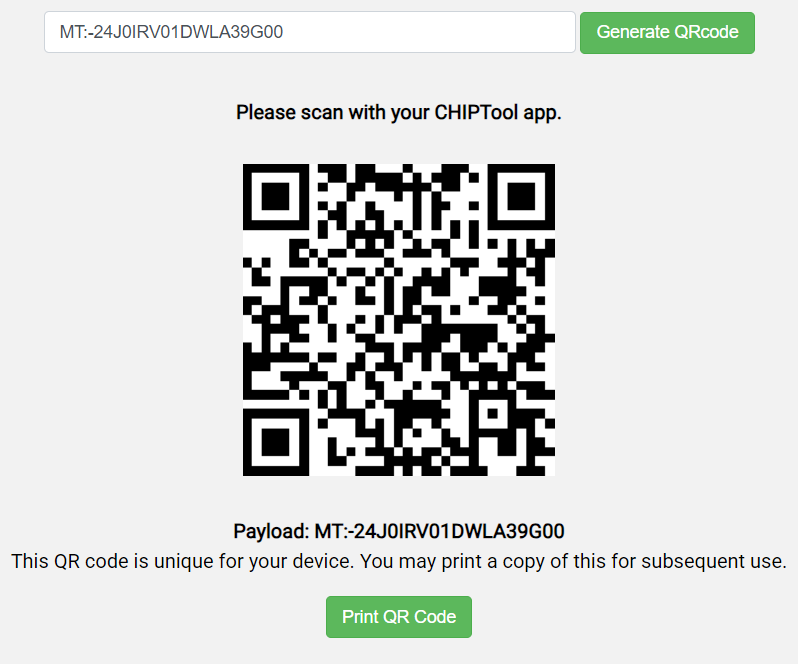

# Matter Controller - [chip-tool](https://github.com/project-chip/connectedhomeip/blob/master/examples/chip-tool)
[](https://github.com/lankahsu520/HelperX)
[![GitHub license][license-image]][license-url]
[![GitHub stars][stars-image]][stars-url]
[![GitHub forks][forks-image]][forks-url]
[![GitHub issues][issues-image]][issues-image]
[![GitHub watchers][watchers-image]][watchers-image]

[license-image]: https://img.shields.io/github/license/lankahsu520/HelperX.svg
[license-url]: https://github.com/lankahsu520/HelperX/blob/master/LICENSE
[stars-image]: https://img.shields.io/github/stars/lankahsu520/HelperX.svg
[stars-url]: https://github.com/lankahsu520/HelperX/stargazers
[forks-image]: https://img.shields.io/github/forks/lankahsu520/HelperX.svg
[forks-url]: https://github.com/lankahsu520/HelperX/network
[issues-image]: https://img.shields.io/github/issues/lankahsu520/HelperX.svg
[issues-url]: https://github.com/lankahsu520/HelperX/issues
[watchers-image]: https://img.shields.io/github/watchers/lankahsu520/HelperX.svg
[watchers-url]: https://github.com/lankahsu520/HelperX/watchers

# 1. Overview

> run on PC - Ubuntu x86_64

>  [chip-tool](https://github.com/project-chip/connectedhomeip/blob/master/examples/chip-tool) is a C++ command line controller with an interactive shell. More information on chip-tool can be found in the [chip-tool guide](https://github.com/project-chip/connectedhomeip/blob/master/docs/development_controllers/chip-tool/chip_tool_guide.md).
>
>  [chip-repl](https://github.com/project-chip/connectedhomeip/blob/master/src/controller/python/chip-repl.py) is a shell for the python controller. The chip-repl is part of the python controller framework, often used for testing. More information about the python controller can be found in the [python testing](https://github.com/project-chip/connectedhomeip/blob/master/docs/testing/python.md) documentation.

## 1.1. Topology


## 1.2. [Matter Client Example](https://github.com/project-chip/connectedhomeip/blob/master/examples/chip-tool/README.md)

> An example application that uses Matter to send messages to a Matter server.
>
> - [Building the Example Application](https://github.com/project-chip/connectedhomeip/blob/master/examples/chip-tool/README.md#building-the-example-application)
> - [Using the Client to Commission a Device](https://github.com/project-chip/connectedhomeip/blob/master/examples/chip-tool/README.md#using-the-client-to-commission-a-device)

### 1.2.1. How to get

#### A. install by snap

```bash
# 你也可以透過 snap 安裝 chip-tool
$ sudo snap install chip-tool

$ tree -L 4 ~/snap/chip-tool/
/home/lanka/snap/chip-tool/
├── 199
├── common
│   ├── chip_tool_config.alpha.ini
│   ├── chip_tool_config.ini
│   ├── chip_tool_history
│   └── chip_tool_kvs
└── current -> 199

3 directories, 4 files
```

#### B. build by myself

# 2. Operate in three modes

> [--paa-trust-store-path]:
>   Path to directory holding PAA certificate information.  Can be absolute or relative to the current working directory.
>
> [production/paa-root-certs](https://github.com/project-chip/connectedhomeip/tree/master/credentials/production/paa-root-certs): 如果要與市面上販售之設備進行配對，請將檔案放入指定之目錄
>
> [--storage-directory]:
>   Directory to place chip-tool's storage files in.  Defaults to $TMPDIR, with fallback to /tmp

## 2.1. Single-command mode (default)

>  In this mode, the CHIP Tool will exit with a timeout error if any single command does not complete within a certain timeout period.

```bash
$ chip-tool
Usage:
  chip-tool cluster_name command_name [param1 param2 ...]
or:
  chip-tool command_set_name command_name [param1 param2 ...]

  +-------------------------------------------------------------------------------------+
  | Clusters:                                                                           |
  +-------------------------------------------------------------------------------------+
  | * accesscontrol                                                                     |
  | * accountlogin                                                                      |
  | * actions                                                                           |
  | * activatedcarbonfiltermonitoring                                                   |
  | * administratorcommissioning                                                        |
  | * airquality                                                                        |
  | * applicationbasic                                                                  |
  | * applicationlauncher                                                               |
  | * audiooutput                                                                       |
  | * ballastconfiguration                                                              |
  | * basicinformation                                                                  |
  | * binding                                                                           |
  | * booleanstate                                                                      |
  | * booleanstateconfiguration                                                         |
  | * bridgeddevicebasicinformation                                                     |
  | * cameraavstreammanagement                                                          |
  | * carbondioxideconcentrationmeasurement                                             |
  | * carbonmonoxideconcentrationmeasurement                                            |
  | * channel                                                                           |
  | * chime                                                                             |
  | * colorcontrol                                                                      |
  | * commissionercontrol                                                               |
  | * contentappobserver                                                                |
  | * contentcontrol                                                                    |
  | * contentlauncher                                                                   |
  | * demandresponseloadcontrol                                                         |
  | * descriptor                                                                        |
  | * deviceenergymanagement                                                            |
  | * deviceenergymanagementmode                                                        |
  | * diagnosticlogs                                                                    |
  | * dishwasheralarm                                                                   |
  | * dishwashermode                                                                    |
  | * doorlock                                                                          |
  | * ecosysteminformation                                                              |
  | * electricalenergymeasurement                                                       |
  | * electricalpowermeasurement                                                        |
  | * energyevse                                                                        |
  | * energyevsemode                                                                    |
  | * energypreference                                                                  |
  | * ethernetnetworkdiagnostics                                                        |
  | * fancontrol                                                                        |
  | * faultinjection                                                                    |
  | * fixedlabel                                                                        |
  | * flowmeasurement                                                                   |
  | * formaldehydeconcentrationmeasurement                                              |
  | * generalcommissioning                                                              |
  | * generaldiagnostics                                                                |
  | * groupkeymanagement                                                                |
  | * groups                                                                            |
  | * hepafiltermonitoring                                                              |
  | * icdmanagement                                                                     |
  | * identify                                                                          |
  | * illuminancemeasurement                                                            |
  | * keypadinput                                                                       |
  | * laundrydryercontrols                                                              |
  | * laundrywashercontrols                                                             |
  | * laundrywashermode                                                                 |
  | * levelcontrol                                                                      |
  | * localizationconfiguration                                                         |
  | * lowpower                                                                          |
  | * mediainput                                                                        |
  | * mediaplayback                                                                     |
  | * messages                                                                          |
  | * microwaveovencontrol                                                              |
  | * microwaveovenmode                                                                 |
  | * modeselect                                                                        |
  | * networkcommissioning                                                              |
  | * nitrogendioxideconcentrationmeasurement                                           |
  | * occupancysensing                                                                  |
  | * onoff                                                                             |
  | * operationalcredentials                                                            |
  | * operationalstate                                                                  |
  | * otasoftwareupdateprovider                                                         |
  | * otasoftwareupdaterequestor                                                        |
  | * ovencavityoperationalstate                                                        |
  | * ovenmode                                                                          |
  | * ozoneconcentrationmeasurement                                                     |
  | * pm10concentrationmeasurement                                                      |
  | * pm1concentrationmeasurement                                                       |
  | * pm25concentrationmeasurement                                                      |
  | * powersource                                                                       |
  | * powersourceconfiguration                                                          |
  | * powertopology                                                                     |
  | * pressuremeasurement                                                               |
  | * proxyconfiguration                                                                |
  | * proxydiscovery                                                                    |
  | * proxyvalid                                                                        |
  | * pulsewidthmodulation                                                              |
  | * pumpconfigurationandcontrol                                                       |
  | * radonconcentrationmeasurement                                                     |
  | * refrigeratoralarm                                                                 |
  | * refrigeratorandtemperaturecontrolledcabinetmode                                   |
  | * relativehumiditymeasurement                                                       |
  | * rvccleanmode                                                                      |
  | * rvcoperationalstate                                                               |
  | * rvcrunmode                                                                        |
  | * samplemei                                                                         |
  | * scenesmanagement                                                                  |
  | * servicearea                                                                       |
  | * smokecoalarm                                                                      |
  | * softwarediagnostics                                                               |
  | * switch                                                                            |
  | * targetnavigator                                                                   |
  | * temperaturecontrol                                                                |
  | * temperaturemeasurement                                                            |
  | * thermostat                                                                        |
  | * thermostatuserinterfaceconfiguration                                              |
  | * threadborderroutermanagement                                                      |
  | * threadnetworkdiagnostics                                                          |
  | * threadnetworkdirectory                                                            |
  | * timeformatlocalization                                                            |
  | * timesynchronization                                                               |
  | * timer                                                                             |
  | * totalvolatileorganiccompoundsconcentrationmeasurement                             |
  | * unitlocalization                                                                  |
  | * unittesting                                                                       |
  | * userlabel                                                                         |
  | * valveconfigurationandcontrol                                                      |
  | * wakeonlan                                                                         |
  | * waterheatermanagement                                                             |
  | * waterheatermode                                                                   |
  | * webrtctransportprovider                                                           |
  | * webrtctransportrequestor                                                          |
  | * wifinetworkdiagnostics                                                            |
  | * wifinetworkmanagement                                                             |
  | * windowcovering                                                                    |
  | * zonemanagement                                                                    |
  +-------------------------------------------------------------------------------------+

  +-------------------------------------------------------------------------------------+
  | Command sets:                                                                       |
  +-------------------------------------------------------------------------------------+
  | * any                                                                               |
  |   - Commands for sending IM messages based on cluster id, not cluster name.         |
  | * delay                                                                             |
  |   - Commands for waiting for something to happen.                                   |
  | * discover                                                                          |
  |   - Commands for device discovery.                                                  |
  | * groupsettings                                                                     |
  |   - Commands for manipulating group keys and memberships for chip-tool itself.      |
  | * icd                                                                               |
  |   - Commands for client-side ICD management.                                        |
  | * pairing                                                                           |
  |   - Commands for commissioning devices.                                             |
  | * payload                                                                           |
  |   - Commands for parsing and generating setup payloads.                             |
  | * sessionmanagement                                                                 |
  |   - Commands for managing CASE and PASE session state.                              |
  | * subscriptions                                                                     |
  |   - Commands for shutting down subscriptions.                                       |
  | * interactive                                                                       |
  |   - Commands for starting long-lived interactive modes.                             |
  | * storage                                                                           |
  |   - Commands for managing persistent data stored by chip-tool.                      |
  +-------------------------------------------------------------------------------------+
```

## 2.2. Interactive mode

> In this mode, a command will terminate with an error if it does not complete within the timeout period. However, the CHIP Tool will not be terminated and it will not terminate processes that previous commands have started. Moreover, when using the interactive mode, the CHIP Tool will establish a new CASE session only when there is no session available yet. On the following commands, it will use the existing session.

```bash
$ chip-tool interactive start --storage-directory /work/IoT/matter/chip-tool --trace_file /tmp/chip-tool-123.log --paa-trust-store-path /work/IoT/matter/paa-root-certs
```

## 2.3. websocket mode

```bash
$ chip-tool interactive server --port 9002 --storage-directory /work/IoT/matter/chip-tool --trace_file /tmp/chip-tool-123.log --paa-trust-store-path /work/IoT/matter/paa-root-certs
```

# 3. chip-tool command_set_name

> 以下大部分用 interactive mode 進行操作

```bash
$ chip-tool interactive start --storage-directory /work/IoT/matter/chip-tool --trace_file /tmp/chip-tool-123.log --paa-trust-store-path /work/IoT/matter/paa-root-certs
```

## 3.1. [⚑] any

> Commands for sending IM messages based on cluster id, not cluster name.

```bash
>>> any
Usage:
   any command_name [param1 param2 ...]

Commands for sending IM messages based on cluster id, not cluster name.

  +-------------------------------------------------------------------------------------+
  | Commands:                                                                           |
  +-------------------------------------------------------------------------------------+
  | * command-by-id                                                                     |
  | * read-by-id                                                                        |
  | * write-by-id                                                                       |
  | * subscribe-by-id                                                                   |
  | * read-event-by-id                                                                  |
  | * subscribe-event-by-id                                                             |
  | * read-none                                                                         |
  | * read-all                                                                          |
  | * subscribe-none                                                                    |
  | * subscribe-all                                                                     |
  +-------------------------------------------------------------------------------------+
```

#### [✔] any read-by-id

```bash
>>> any read-by-id
Usage:
   any read-by-id cluster-ids attribute-ids destination-id endpoint-ids [--paa-trust-store-path] [--cd-trust-store-path] [--commissioner-name] [--commissioner-nodeid] [--use-max-sized-certs] [--only-allow-trusted-cd-keys] [--dac-revocation-set-path] [--trace_file] [--trace_log] [--trace_decode] [--trace-to] [--ble-adapter] [--storage-directory] [--commissioner-vendor-id] [--fabric-filtered] [--data-version] [--lit-icd-peer] [--timeout] [--allow-large-payload]

cluster-ids:
  Comma-separated list of cluster ids to read from (e.g. "6" or "8,0x201").
  Allowed to be 0xFFFFFFFF to indicate a wildcard cluster.

attribute-ids:
  Comma-separated list of attribute ids to read (e.g. "0" or "1,0xFFFC,0xFFFD").
  Allowed to be 0xFFFFFFFF to indicate a wildcard attribute.

destination-id:
  64-bit node or group identifier.
  Group identifiers are detected by being in the 0xFFFF'FFFF'FFFF'xxxx range.

endpoint-ids:
  Comma-separated list of endpoint ids (e.g. "1" or "1,2,3").
  Allowed to be 0xFFFF to indicate a wildcard endpoint.

[--paa-trust-store-path]:
  Path to directory holding PAA certificate information.  Can be absolute or relative to the current working directory.

[--cd-trust-store-path]:
  Path to directory holding CD certificate information.  Can be absolute or relative to the current working directory.

[--commissioner-name]:
  Name of fabric to use. Valid values are "alpha", "beta", "gamma", and integers greater than or equal to 4.  The default if not specified is "alpha".

[--commissioner-nodeid]:
  The node id to use for chip-tool.  If not provided, kTestControllerNodeId (112233, 0x1B669) will be used.

[--use-max-sized-certs]:
  Maximize the size of operational certificates. If not provided or 0 ("false"), normally sized operational certificates are generated.

[--only-allow-trusted-cd-keys]:
  Only allow trusted CD verifying keys (disallow test keys). If not provided or 0 ("false"), untrusted CD verifying keys are allowed. If 1 ("true"), test keys are disallowed.

[--dac-revocation-set-path]:
  Path to JSON file containing the device attestation revocation set. This argument caches the path to the revocation set. Once set, this will be used by all commands in interactive mode.

[--trace-to]:
  Trace destinations, comma-separated (json:log, json:<path>, perfetto, perfetto:<path>)

[--storage-directory]:
  Directory to place chip-tool's storage files in.  Defaults to $TMPDIR, with fallback to /tmp

[--commissioner-vendor-id]:
  The vendor id to use for chip-tool. If not provided, chip::VendorId::TestVendor1 (65521, 0xFFF1) will be used.

[--fabric-filtered]:
  Boolean indicating whether to do a fabric-filtered read. Defaults to true.

[--data-version]:
  Comma-separated list of data versions for the clusters being read.

[--lit-icd-peer]:
  Whether to treat the peer as a LIT ICD. false: Always no, true: Always yes, (not set): Yes if the peer is registered to this controller.

[--allow-large-payload]:
  If true, indicates that the session should allow large application payloads (which requires a TCP connection).Defaults to false, which uses a UDP+MRP session.

# 6 (OnOff)
>>> any read-by-id 0x06 0xFFFFFFFF 1 1
# 6 (OnOff) - 0 (attributeId)
>>> any read-by-id 0x06 0 1 1
```

## 3.2. [⚑] delay

> Commands for waiting for something to happen.

```bash
>>> delay
Usage:
   delay command_name [param1 param2 ...]

Commands for waiting for something to happen.

  +-------------------------------------------------------------------------------------+
  | Commands:                                                                           |
  +-------------------------------------------------------------------------------------+
  | * sleep                                                                             |
  | * wait-for-commissionee                                                             |
  |   - Establish a CASE session to the provided node id.                               |
  +-------------------------------------------------------------------------------------+
```

#### [✔] delay sleep

> 暫停幾 milliseconds
>
> 此功能用意不知

```bash
>>> delay sleep 3000
```

#### [⚑] delay  wait-for-commissionee

```bash
>>> delay wait-for-commissionee 1
```

## 3.3. [⚑] discover

> Commands for device discovery.

```bash
>>> discover
Usage:
   discover command_name [param1 param2 ...]

Commands for device discovery.

  +-------------------------------------------------------------------------------------+
  | Commands:                                                                           |
  +-------------------------------------------------------------------------------------+
  | * resolve                                                                           |
  | * start                                                                             |
  | * stop                                                                              |
  | * list                                                                              |
  | * commissionables                                                                   |
  | * find-commissionable-by-short-discriminator                                        |
  | * find-commissionable-by-long-discriminator                                         |
  | * find-commissionable-by-commissioning-mode                                         |
  | * find-commissionable-by-vendor-id                                                  |
  | * find-commissionable-by-device-type                                                |
  | * find-commissionable-by-instance-name                                              |
  | * commissioners                                                                     |
  +-------------------------------------------------------------------------------------+
```

#### [✔] discover commissionables

> 發現網路上 commissionable node

```bash
>>> discover commissionables
[1736835694.442] [752301:752331] [DIS] Discovered commissionable/commissioner node:
[1736835694.442] [752301:752331] [DIS]  Hostname: 080027337352
[1736835694.442] [752301:752331] [DIS]  IP Address #1: fe80::d49:8acb:9f1b:c4cf
[1736835694.442] [752301:752331] [DIS]  IP Address #2: fd95:6f29:461a:4860:d39b:f6b1:830c:7a4f
[1736835694.442] [752301:752331] [DIS]  IP Address #3: fd95:6f29:461a:4860:6545:6058:601c:ea2
[1736835694.442] [752301:752331] [DIS]  IP Address #4: fd91:956f:2946:1a48:453e:be21:1a78:27ba
[1736835694.442] [752301:752331] [DIS]  IP Address #5: fd91:956f:2946:1a48:27de:bdb6:e6ca:299e
[1736835694.442] [752301:752331] [DIS]  Port: 5540
[1736835694.442] [752301:752331] [DIS]  Mrp Interval idle: not present
[1736835694.442] [752301:752331] [DIS]  Mrp Interval active: not present
[1736835694.442] [752301:752331] [DIS]  Mrp Active Threshold: not present
[1736835694.442] [752301:752331] [DIS]  TCP Client Supported: 0
[1736835694.442] [752301:752331] [DIS]  TCP Server Supported: 0
[1736835694.442] [752301:752331] [DIS]  ICD: not present
[1736835694.442] [752301:752331] [DIS]  Rotating ID: 01005FDB39737473FB22B819CEBB1084AFD5
[1736835694.442] [752301:752331] [DIS]  Device Name: Test Bulb
[1736835694.442] [752301:752331] [DIS]  Vendor ID: 65521
[1736835694.442] [752301:752331] [DIS]  Product ID: 32769
[1736835694.442] [752301:752331] [DIS]  Device Type: 257
[1736835694.442] [752301:752331] [DIS]  Long Discriminator: 3849
[1736835694.442] [752301:752331] [DIS]  Pairing Hint: 33
[1736835694.442] [752301:752331] [DIS]  Instance Name: F8E6D53FB75B6847
[1736835694.442] [752301:752331] [DIS]  Commissioning Mode: 1
[1736835694.442] [752301:752331] [DIS]  Supports Commissioner Generated Passcode: false
[1736835694.443] [752301:752331] [CTL] Filter type none; all matches will fail
```

#### [✔] discover commissioners

> 發現網路上 commissioner node

```bash
>>> discover commissioners

```

## 3.4. [⚑] groupsettings

> Commands for manipulating group keys and memberships for chip-tool itself.

```bash
>>> groupsettings
Usage:
   groupsettings command_name [param1 param2 ...]

Commands for manipulating group keys and memberships for chip-tool itself.

  +-------------------------------------------------------------------------------------+
  | Commands:                                                                           |
  +-------------------------------------------------------------------------------------+
  | * show-groups                                                                       |
  | * add-group                                                                         |
  | * remove-group                                                                      |
  | * show-keysets                                                                      |
  | * bind-keyset                                                                       |
  | * unbind-keyset                                                                     |
  | * add-keysets                                                                       |
  | * remove-keyset                                                                     |
  +-------------------------------------------------------------------------------------+
```

## 3.5. [⚑] icd

> Commands for client-side ICD management.
>
> github: [icd](https://github.com/project-chip/connectedhomeip/tree/master/examples/chip-tool/commands/icd)

```bash
>>> icd
Usage:
   icd command_name [param1 param2 ...]

Commands for client-side ICD management.

  +-------------------------------------------------------------------------------------+
  | Commands:                                                                           |
  +-------------------------------------------------------------------------------------+
  | * list                                                                              |
  |   - List ICDs registed by this controller.                                          |
  | * wait-for-device                                                                   |
  +-------------------------------------------------------------------------------------+
```

#### [⚑] icd list

> github: [ICDCommand.h](https://github.com/project-chip/connectedhomeip/blob/master/examples/chip-tool/commands/icd/ICDCommand.h)

#### [⚑] icd wait-for-device

> github: [ICDCommand.h](https://github.com/project-chip/connectedhomeip/blob/master/examples/chip-tool/commands/icd/ICDCommand.h)

```bash
>>> icd wait-for-device
Usage:
   icd wait-for-device destination-id stay-active-duration-seconds [--paa-trust-store-path] [--cd-trust-store-path] [--commissioner-name] [--commissioner-nodeid] [--use-max-sized-certs] [--only-allow-trusted-cd-keys] [--dac-revocation-set-path] [--trace_file] [--trace_log] [--trace_decode] [--trace-to] [--ble-adapter] [--storage-directory] [--commissioner-vendor-id] [--lit-icd-peer] [--timeout] [--allow-large-payload]

destination-id:
  64-bit node or group identifier.
  Group identifiers are detected by being in the 0xFFFF'FFFF'FFFF'xxxx range.

stay-active-duration-seconds:
  The requested duration in seconds for the device to stay active after check-in completes.

>>> icd wait-for-device 0xFFFF 30
```

## 3.6. [⚑] pairing

> Commands for commissioning devices.
>
> github: [pairing](https://github.com/project-chip/connectedhomeip/tree/master/examples/chip-tool/commands/pairing)

>  Matter devices can use different commissioning channels:
>
>  - Devices that are not yet connected to the target IP network use Bluetooth LE as the commissioning channel.
>  - Devices that have already joined an IP network only need to use the IP protocol for commissioning to the Matter network.

```bash
>>> pairing
[1736406770.594] [678778:678778] [TOO] Command: pairing
[1736406770.595] [678778:678778] [TOO] Missing command name
Usage:
   pairing command_name [param1 param2 ...]

Commands for commissioning devices.

  +-------------------------------------------------------------------------------------+
  | Commands:                                                                           |
  +-------------------------------------------------------------------------------------+
  | * unpair                                                                            |
  | * code                                                                              |
  | * code-paseonly                                                                     |
  | * code-wifi                                                                         |
  | * code-thread                                                                       |
  | * code-wifi-thread                                                                  |
  | * ble-wifi                                                                          |
  | * ble-thread                                                                        |
  | * softap                                                                            |
  | * already-discovered                                                                |
  | * already-discovered-by-index                                                       |
  | * already-discovered-by-index-with-wifi                                             |
  | * already-discovered-by-index-with-code                                             |
  | * onnetwork                                                                         |
  | * onnetwork-short                                                                   |
  | * onnetwork-long                                                                    |
  | * onnetwork-vendor                                                                  |
  | * onnetwork-commissioning-mode                                                      |
  | * onnetwork-commissioner                                                            |
  | * onnetwork-device-type                                                             |
  | * onnetwork-instance-name                                                           |
  | * start-udc-server                                                                  |
  | * open-commissioning-window                                                         |
  | * get-commissioner-node-id                                                          |
  | * get-commissioner-root-certificate                                                 |
  |   - Returns a base64-encoded RCAC prefixed with: 'base64:'                          |
  | * issue-noc-chain                                                                   |
  |   - Returns a base64-encoded NOC, ICAC, RCAC, and IPK prefixed with: 'base64:'      |
  +-------------------------------------------------------------------------------------+
```

#### [✔] pairing unpair

> Forgetting the already-commissioned device

> 進行解配

```bash
>>> pairing unpair
Usage:
   pairing unpair node-id [--paa-trust-store-path] [--cd-trust-store-path] [--commissioner-name] [--commissioner-nodeid] [--use-max-sized-certs] [--only-allow-trusted-cd-keys] [--dac-revocation-set-path] [--trace_file] [--trace_log] [--trace_decode] [--trace-to] [--ble-adapter] [--storage-directory] [--commissioner-vendor-id] [--bypass-attestation-verifier] [--case-auth-tags] [--icd-registration] [--icd-check-in-nodeid] [--icd-monitored-subject] [--icd-client-type] [--icd-symmetric-key] [--icd-stay-active-duration] [--timeout]

[--paa-trust-store-path]:
  Path to directory holding PAA certificate information.  Can be absolute or relative to the current working directory.

[--cd-trust-store-path]:
  Path to directory holding CD certificate information.  Can be absolute or relative to the current working directory.

[--commissioner-name]:
  Name of fabric to use. Valid values are "alpha", "beta", "gamma", and integers greater than or equal to 4.  The default if not specified is "alpha".

[--commissioner-nodeid]:
  The node id to use for chip-tool.  If not provided, kTestControllerNodeId (112233, 0x1B669) will be used.

[--use-max-sized-certs]:
  Maximize the size of operational certificates. If not provided or 0 ("false"), normally sized operational certificates are generated.

[--only-allow-trusted-cd-keys]:
  Only allow trusted CD verifying keys (disallow test keys). If not provided or 0 ("false"), untrusted CD verifying keys are allowed. If 1 ("true"), test keys are disallowed.

[--dac-revocation-set-path]:
  Path to JSON file containing the device attestation revocation set. This argument caches the path to the revocation set. Once set, this will be used by all commands in interactive mode.

[--trace-to]:
  Trace destinations, comma-separated (json:log, json:<path>, perfetto, perfetto:<path>)

[--storage-directory]:
  Directory to place chip-tool's storage files in.  Defaults to $TMPDIR, with fallback to /tmp

[--commissioner-vendor-id]:
  The vendor id to use for chip-tool. If not provided, chip::VendorId::TestVendor1 (65521, 0xFFF1) will be used.

[--bypass-attestation-verifier]:
  Bypass the attestation verifier. If not provided or false, the attestation verifier is not bypassed. If true, the commissioning will continue in case of attestation verification failure.

[--case-auth-tags]:
  The CATs to be encoded in the NOC sent to the commissionee

[--icd-registration]:
  Whether to register for check-ins from ICDs during commissioning. Default: false

[--icd-check-in-nodeid]:
  The check-in node id for the ICD, default: node id of the commissioner.

[--icd-monitored-subject]:
  The monitored subject of the ICD, default: The node id used for icd-check-in-nodeid.

[--icd-client-type]:
  The ClientType of the client registering, default: Permanent client - 0

[--icd-symmetric-key]:
  The 16 bytes ICD symmetric key, default: randomly generated.

[--icd-stay-active-duration]:
  If set, a LIT ICD that is commissioned will be requested to stay active for this many milliseconds


>>> pairing unpair 1
```

#### [✔] pairing code

> Commissioning with QR code payload or manual pairing code

> 被配對設備基本上已經連上網路，使用 QR code or manual pairing code

```bash
>>> pairing code
Usage:
   pairing code node-id payload [--paa-trust-store-path] [--cd-trust-store-path] [--commissioner-name] [--commissioner-nodeid] [--use-max-sized-certs] [--only-allow-trusted-cd-keys] [--dac-revocation-set-path] [--trace_file] [--trace_log] [--trace_decode] [--trace-to] [--ble-adapter] [--storage-directory] [--commissioner-vendor-id] [--bypass-attestation-verifier] [--case-auth-tags] [--icd-registration] [--icd-check-in-nodeid] [--icd-monitored-subject] [--icd-client-type] [--icd-symmetric-key] [--icd-stay-active-duration] [--skip-commissioning-complete] [--discover-once] [--use-only-onnetwork-discovery] [--country-code] [--time-zone] [--dst-offset] [--timeout]

[--paa-trust-store-path]:
  Path to directory holding PAA certificate information.  Can be absolute or relative to the current working directory.

[--cd-trust-store-path]:
  Path to directory holding CD certificate information.  Can be absolute or relative to the current working directory.

[--commissioner-name]:
  Name of fabric to use. Valid values are "alpha", "beta", "gamma", and integers greater than or equal to 4.  The default if not specified is "alpha".

[--commissioner-nodeid]:
  The node id to use for chip-tool.  If not provided, kTestControllerNodeId (112233, 0x1B669) will be used.

[--use-max-sized-certs]:
  Maximize the size of operational certificates. If not provided or 0 ("false"), normally sized operational certificates are generated.

[--only-allow-trusted-cd-keys]:
  Only allow trusted CD verifying keys (disallow test keys). If not provided or 0 ("false"), untrusted CD verifying keys are allowed. If 1 ("true"), test keys are disallowed.

[--dac-revocation-set-path]:
  Path to JSON file containing the device attestation revocation set. This argument caches the path to the revocation set. Once set, this will be used by all commands in interactive mode.

[--trace-to]:
  Trace destinations, comma-separated (json:log, json:<path>, perfetto, perfetto:<path>)

[--storage-directory]:
  Directory to place chip-tool's storage files in.  Defaults to $TMPDIR, with fallback to /tmp

[--commissioner-vendor-id]:
  The vendor id to use for chip-tool. If not provided, chip::VendorId::TestVendor1 (65521, 0xFFF1) will be used.

[--bypass-attestation-verifier]:
  Bypass the attestation verifier. If not provided or false, the attestation verifier is not bypassed. If true, the commissioning will continue in case of attestation verification failure.

[--case-auth-tags]:
  The CATs to be encoded in the NOC sent to the commissionee

[--icd-registration]:
  Whether to register for check-ins from ICDs during commissioning. Default: false

[--icd-check-in-nodeid]:
  The check-in node id for the ICD, default: node id of the commissioner.

[--icd-monitored-subject]:
  The monitored subject of the ICD, default: The node id used for icd-check-in-nodeid.

[--icd-client-type]:
  The ClientType of the client registering, default: Permanent client - 0

[--icd-symmetric-key]:
  The 16 bytes ICD symmetric key, default: randomly generated.

[--icd-stay-active-duration]:
  If set, a LIT ICD that is commissioned will be requested to stay active for this many milliseconds

[--country-code]:
  Country code to use to set the Basic Information cluster's Location attribute

[--time-zone]:
  TimeZone list to use when setting Time Synchronization cluster's TimeZone attribute

[--dst-offset]:
  DSTOffset list to use when setting Time Synchronization cluster's DSTOffset attribute

>>> pairing code 1 33726345678
>>> pairing code 2 30510457783
```

#### [⚑] pairing code-paseonly

#### [✔] pairing code-wifi

> chip-tool 執行的平台必需要有 BLE

```bash
>>> pairing code-wifi
Usage:
   pairing code-wifi node-id ssid password payload [--paa-trust-store-path] [--cd-trust-store-path] [--commissioner-name] [--commissioner-nodeid] [--use-max-sized-certs] [--only-allow-trusted-cd-keys] [--dac-revocation-set-path] [--trace_file] [--trace_log] [--trace_decode] [--trace-to] [--ble-adapter] [--storage-directory] [--commissioner-vendor-id] [--bypass-attestation-verifier] [--case-auth-tags] [--icd-registration] [--icd-check-in-nodeid] [--icd-monitored-subject] [--icd-client-type] [--icd-symmetric-key] [--icd-stay-active-duration] [--skip-commissioning-complete] [--discover-once] [--use-only-onnetwork-discovery] [--country-code] [--time-zone] [--dst-offset] [--require-tc-acknowledgements] [--tc-acknowledgements] [--tc-acknowledgements-version] [--timeout]

[--paa-trust-store-path]:
  Path to directory holding PAA certificate information.  Can be absolute or relative to the current working directory.

[--cd-trust-store-path]:
  Path to directory holding CD certificate information.  Can be absolute or relative to the current working directory.

[--commissioner-name]:
  Name of fabric to use. Valid values are "alpha", "beta", "gamma", and integers greater than or equal to 4.  The default if not specified is "alpha".

[--commissioner-nodeid]:
  The node id to use for chip-tool.  If not provided, kTestControllerNodeId (112233, 0x1B669) will be used.

[--use-max-sized-certs]:
  Maximize the size of operational certificates. If not provided or 0 ("false"), normally sized operational certificates are generated.

[--only-allow-trusted-cd-keys]:
  Only allow trusted CD verifying keys (disallow test keys). If not provided or 0 ("false"), untrusted CD verifying keys are allowed. If 1 ("true"), test keys are disallowed.

[--dac-revocation-set-path]:
  Path to JSON file containing the device attestation revocation set. This argument caches the path to the revocation set. Once set, this will be used by all commands in interactive mode.

[--trace-to]:
  Trace destinations, comma-separated (json:log, json:<path>, perfetto, perfetto:<path>)

[--storage-directory]:
  Directory to place chip-tool's storage files in.  Defaults to $TMPDIR, with fallback to /tmp

[--commissioner-vendor-id]:
  The vendor id to use for chip-tool. If not provided, chip::VendorId::TestVendor1 (65521, 0xFFF1) will be used.

[--bypass-attestation-verifier]:
  Bypass the attestation verifier. If not provided or false, the attestation verifier is not bypassed. If true, the commissioning will continue in case of attestation verification failure.

[--case-auth-tags]:
  The CATs to be encoded in the NOC sent to the commissionee

[--icd-registration]:
  Whether to register for check-ins from ICDs during commissioning. Default: false

[--icd-check-in-nodeid]:
  The check-in node id for the ICD, default: node id of the commissioner.

[--icd-monitored-subject]:
  The monitored subject of the ICD, default: The node id used for icd-check-in-nodeid.

[--icd-client-type]:
  The ClientType of the client registering, default: Permanent client - 0

[--icd-symmetric-key]:
  The 16 bytes ICD symmetric key, default: randomly generated.

[--icd-stay-active-duration]:
  If set, a LIT ICD that is commissioned will be requested to stay active for this many milliseconds

[--country-code]:
  Country code to use to set the Basic Information cluster's Location attribute

[--time-zone]:
  TimeZone list to use when setting Time Synchronization cluster's TimeZone attribute

[--dst-offset]:
  DSTOffset list to use when setting Time Synchronization cluster's DSTOffset attribute

[--require-tc-acknowledgements]:
  Indicates whether Terms and Conditions acknowledgements are required during commissioning. If set to true, the tc-acknowledgements and tc-acknowledgements-version arguments must be provided for the commissioning to succeed. If false, the T&C acknowledgement step will be skipped.

[--tc-acknowledgements]:
  Bit-field value indicating which Terms and Conditions have been accepted by the user. This value is sent to the device during commissioning via the General Commissioning cluster

[--tc-acknowledgements-version]:
  Version number of the Terms and Conditions that were accepted by the user. This value is sent to the device during commissioning to indicate which T&C version was acknowledged


>>> pairing code-wifi 3 Lanka520 Lanka520 01234567890
```

#### [⚑] pairing code-thread

#### [⚑] pairing code-wifi-thread

#### [⚑] pairing ble-wifi

> Commissioning into a Wi-Fi network over Bluetooth LE

> 被配對設備有 BLE and Wi-Fi

 ```bash
>>> pairing ble-wifi
Usage:
   pairing ble-wifi node-id ssid password setup-pin-code discriminator [--paa-trust-store-path] [--cd-trust-store-path] [--commissioner-name] [--commissioner-nodeid] [--use-max-sized-certs] [--only-allow-trusted-cd-keys] [--dac-revocation-set-path] [--trace_file] [--trace_log] [--trace_decode] [--trace-to] [--ble-adapter] [--storage-directory] [--commissioner-vendor-id] [--bypass-attestation-verifier] [--case-auth-tags] [--icd-registration] [--icd-check-in-nodeid] [--icd-monitored-subject] [--icd-client-type] [--icd-symmetric-key] [--icd-stay-active-duration] [--skip-commissioning-complete] [--country-code] [--time-zone] [--dst-offset] [--timeout]

[--paa-trust-store-path]:
  Path to directory holding PAA certificate information.  Can be absolute or relative to the current working directory.

[--cd-trust-store-path]:
  Path to directory holding CD certificate information.  Can be absolute or relative to the current working directory.

[--commissioner-name]:
  Name of fabric to use. Valid values are "alpha", "beta", "gamma", and integers greater than or equal to 4.  The default if not specified is "alpha".

[--commissioner-nodeid]:
  The node id to use for chip-tool.  If not provided, kTestControllerNodeId (112233, 0x1B669) will be used.

[--use-max-sized-certs]:
  Maximize the size of operational certificates. If not provided or 0 ("false"), normally sized operational certificates are generated.

[--only-allow-trusted-cd-keys]:
  Only allow trusted CD verifying keys (disallow test keys). If not provided or 0 ("false"), untrusted CD verifying keys are allowed. If 1 ("true"), test keys are disallowed.

[--dac-revocation-set-path]:
  Path to JSON file containing the device attestation revocation set. This argument caches the path to the revocation set. Once set, this will be used by all commands in interactive mode.

[--trace-to]:
  Trace destinations, comma-separated (json:log, json:<path>, perfetto, perfetto:<path>)

[--storage-directory]:
  Directory to place chip-tool's storage files in.  Defaults to $TMPDIR, with fallback to /tmp

[--commissioner-vendor-id]:
  The vendor id to use for chip-tool. If not provided, chip::VendorId::TestVendor1 (65521, 0xFFF1) will be used.

[--bypass-attestation-verifier]:
  Bypass the attestation verifier. If not provided or false, the attestation verifier is not bypassed. If true, the commissioning will continue in case of attestation verification failure.

[--case-auth-tags]:
  The CATs to be encoded in the NOC sent to the commissionee

[--icd-registration]:
  Whether to register for check-ins from ICDs during commissioning. Default: false

[--icd-check-in-nodeid]:
  The check-in node id for the ICD, default: node id of the commissioner.

[--icd-monitored-subject]:
  The monitored subject of the ICD, default: The node id used for icd-check-in-nodeid.

[--icd-client-type]:
  The ClientType of the client registering, default: Permanent client - 0

[--icd-symmetric-key]:
  The 16 bytes ICD symmetric key, default: randomly generated.

[--icd-stay-active-duration]:
  If set, a LIT ICD that is commissioned will be requested to stay active for this many milliseconds

[--country-code]:
  Country code to use to set the Basic Information cluster's Location attribute

[--time-zone]:
  TimeZone list to use when setting Time Synchronization cluster's TimeZone attribute

[--dst-offset]:
  DSTOffset list to use when setting Time Synchronization cluster's DSTOffset attribute
 ```

#### [⚑] pairing ble-thread

> Commissioning into a Thread network over Bluetooth LE

> 被配對設備有 BLE and Thread

 ```bash
>>> pairing ble-thread
Usage:
   pairing ble-thread node-id operationalDataset setup-pin-code discriminator [--paa-trust-store-path] [--cd-trust-store-path] [--commissioner-name] [--commissioner-nodeid] [--use-max-sized-certs] [--only-allow-trusted-cd-keys] [--dac-revocation-set-path] [--trace_file] [--trace_log] [--trace_decode] [--trace-to] [--ble-adapter] [--storage-directory] [--commissioner-vendor-id] [--bypass-attestation-verifier] [--case-auth-tags] [--icd-registration] [--icd-check-in-nodeid] [--icd-monitored-subject] [--icd-client-type] [--icd-symmetric-key] [--icd-stay-active-duration] [--skip-commissioning-complete] [--country-code] [--time-zone] [--dst-offset] [--timeout]

[--paa-trust-store-path]:
  Path to directory holding PAA certificate information.  Can be absolute or relative to the current working directory.

[--cd-trust-store-path]:
  Path to directory holding CD certificate information.  Can be absolute or relative to the current working directory.

[--commissioner-name]:
  Name of fabric to use. Valid values are "alpha", "beta", "gamma", and integers greater than or equal to 4.  The default if not specified is "alpha".

[--commissioner-nodeid]:
  The node id to use for chip-tool.  If not provided, kTestControllerNodeId (112233, 0x1B669) will be used.

[--use-max-sized-certs]:
  Maximize the size of operational certificates. If not provided or 0 ("false"), normally sized operational certificates are generated.

[--only-allow-trusted-cd-keys]:
  Only allow trusted CD verifying keys (disallow test keys). If not provided or 0 ("false"), untrusted CD verifying keys are allowed. If 1 ("true"), test keys are disallowed.

[--dac-revocation-set-path]:
  Path to JSON file containing the device attestation revocation set. This argument caches the path to the revocation set. Once set, this will be used by all commands in interactive mode.

[--trace-to]:
  Trace destinations, comma-separated (json:log, json:<path>, perfetto, perfetto:<path>)

[--storage-directory]:
  Directory to place chip-tool's storage files in.  Defaults to $TMPDIR, with fallback to /tmp

[--commissioner-vendor-id]:
  The vendor id to use for chip-tool. If not provided, chip::VendorId::TestVendor1 (65521, 0xFFF1) will be used.

[--bypass-attestation-verifier]:
  Bypass the attestation verifier. If not provided or false, the attestation verifier is not bypassed. If true, the commissioning will continue in case of attestation verification failure.

[--case-auth-tags]:
  The CATs to be encoded in the NOC sent to the commissionee

[--icd-registration]:
  Whether to register for check-ins from ICDs during commissioning. Default: false

[--icd-check-in-nodeid]:
  The check-in node id for the ICD, default: node id of the commissioner.

[--icd-monitored-subject]:
  The monitored subject of the ICD, default: The node id used for icd-check-in-nodeid.

[--icd-client-type]:
  The ClientType of the client registering, default: Permanent client - 0

[--icd-symmetric-key]:
  The 16 bytes ICD symmetric key, default: randomly generated.

[--icd-stay-active-duration]:
  If set, a LIT ICD that is commissioned will be requested to stay active for this many milliseconds

[--country-code]:
  Country code to use to set the Basic Information cluster's Location attribute

[--time-zone]:
  TimeZone list to use when setting Time Synchronization cluster's TimeZone attribute

[--dst-offset]:
  DSTOffset list to use when setting Time Synchronization cluster's DSTOffset attribute
 ```

#### [⚑] pairing softap

#### [⚑] pairing already-discovered

#### [⚑] pairing already-discovered-by-index

#### [⚑] pairing already-discovered-by-index-with-wifi

#### [⚑] already-discovered-by-index-with-code

#### [✔] pairing onnetwork

> Commissioning into a network over IP

> 被配對設備基本上已經連上網路，使用 setup-pin-code （一般量產的設備只會有 QR code，可以 payload parse-setup-payload 解析）

```bash
>>> pairing onnetwork
Usage:
   pairing onnetwork node-id setup-pin-code [--paa-trust-store-path] [--cd-trust-store-path] [--commissioner-name] [--commissioner-nodeid] [--use-max-sized-certs] [--only-allow-trusted-cd-keys] [--dac-revocation-set-path] [--trace_file] [--trace_log] [--trace_decode] [--trace-to] [--ble-adapter] [--storage-directory] [--commissioner-vendor-id] [--bypass-attestation-verifier] [--case-auth-tags] [--icd-registration] [--icd-check-in-nodeid] [--icd-monitored-subject] [--icd-client-type] [--icd-symmetric-key] [--icd-stay-active-duration] [--skip-commissioning-complete] [--pase-only] [--country-code] [--time-zone] [--dst-offset] [--timeout]

[--paa-trust-store-path]:
  Path to directory holding PAA certificate information.  Can be absolute or relative to the current working directory.

[--cd-trust-store-path]:
  Path to directory holding CD certificate information.  Can be absolute or relative to the current working directory.

[--commissioner-name]:
  Name of fabric to use. Valid values are "alpha", "beta", "gamma", and integers greater than or equal to 4.  The default if not specified is "alpha".

[--commissioner-nodeid]:
  The node id to use for chip-tool.  If not provided, kTestControllerNodeId (112233, 0x1B669) will be used.

[--use-max-sized-certs]:
  Maximize the size of operational certificates. If not provided or 0 ("false"), normally sized operational certificates are generated.

[--only-allow-trusted-cd-keys]:
  Only allow trusted CD verifying keys (disallow test keys). If not provided or 0 ("false"), untrusted CD verifying keys are allowed. If 1 ("true"), test keys are disallowed.

[--dac-revocation-set-path]:
  Path to JSON file containing the device attestation revocation set. This argument caches the path to the revocation set. Once set, this will be used by all commands in interactive mode.

[--trace-to]:
  Trace destinations, comma-separated (json:log, json:<path>, perfetto, perfetto:<path>)

[--storage-directory]:
  Directory to place chip-tool's storage files in.  Defaults to $TMPDIR, with fallback to /tmp

[--commissioner-vendor-id]:
  The vendor id to use for chip-tool. If not provided, chip::VendorId::TestVendor1 (65521, 0xFFF1) will be used.

[--bypass-attestation-verifier]:
  Bypass the attestation verifier. If not provided or false, the attestation verifier is not bypassed. If true, the commissioning will continue in case of attestation verification failure.

[--case-auth-tags]:
  The CATs to be encoded in the NOC sent to the commissionee

[--icd-registration]:
  Whether to register for check-ins from ICDs during commissioning. Default: false

[--icd-check-in-nodeid]:
  The check-in node id for the ICD, default: node id of the commissioner.

[--icd-monitored-subject]:
  The monitored subject of the ICD, default: The node id used for icd-check-in-nodeid.

[--icd-client-type]:
  The ClientType of the client registering, default: Permanent client - 0

[--icd-symmetric-key]:
  The 16 bytes ICD symmetric key, default: randomly generated.

[--icd-stay-active-duration]:
  If set, a LIT ICD that is commissioned will be requested to stay active for this many milliseconds

[--country-code]:
  Country code to use to set the Basic Information cluster's Location attribute

[--time-zone]:
  TimeZone list to use when setting Time Synchronization cluster's TimeZone attribute

[--dst-offset]:
  DSTOffset list to use when setting Time Synchronization cluster's DSTOffset attribute


>>> pairing onnetwork 1 20231206
```

#### [⚑] pairing onnetwork-short

#### [✔] pairing onnetwork-long

> Commissioning with long discriminator

> 被配對設備基本上已經連上網路，使用 setup-pin-code 和 discriminator（一般量產的設備只會有 QR code，可以 payload parse-setup-payload 解析）

```bash
>>> pairing onnetwork-long
Usage:
   pairing onnetwork-long node-id setup-pin-code discriminator [--paa-trust-store-path] [--cd-trust-store-path] [--commissioner-name] [--commissioner-nodeid] [--use-max-sized-certs] [--only-allow-trusted-cd-keys] [--dac-revocation-set-path] [--trace_file] [--trace_log] [--trace_decode] [--trace-to] [--ble-adapter] [--storage-directory] [--commissioner-vendor-id] [--bypass-attestation-verifier] [--case-auth-tags] [--icd-registration] [--icd-check-in-nodeid] [--icd-monitored-subject] [--icd-client-type] [--icd-symmetric-key] [--icd-stay-active-duration] [--skip-commissioning-complete] [--pase-only] [--country-code] [--time-zone] [--dst-offset] [--timeout]

[--paa-trust-store-path]:
  Path to directory holding PAA certificate information.  Can be absolute or relative to the current working directory.

[--cd-trust-store-path]:
  Path to directory holding CD certificate information.  Can be absolute or relative to the current working directory.

[--commissioner-name]:
  Name of fabric to use. Valid values are "alpha", "beta", "gamma", and integers greater than or equal to 4.  The default if not specified is "alpha".

[--commissioner-nodeid]:
  The node id to use for chip-tool.  If not provided, kTestControllerNodeId (112233, 0x1B669) will be used.

[--use-max-sized-certs]:
  Maximize the size of operational certificates. If not provided or 0 ("false"), normally sized operational certificates are generated.

[--only-allow-trusted-cd-keys]:
  Only allow trusted CD verifying keys (disallow test keys). If not provided or 0 ("false"), untrusted CD verifying keys are allowed. If 1 ("true"), test keys are disallowed.

[--dac-revocation-set-path]:
  Path to JSON file containing the device attestation revocation set. This argument caches the path to the revocation set. Once set, this will be used by all commands in interactive mode.

[--trace-to]:
  Trace destinations, comma-separated (json:log, json:<path>, perfetto, perfetto:<path>)

[--storage-directory]:
  Directory to place chip-tool's storage files in.  Defaults to $TMPDIR, with fallback to /tmp

[--commissioner-vendor-id]:
  The vendor id to use for chip-tool. If not provided, chip::VendorId::TestVendor1 (65521, 0xFFF1) will be used.

[--bypass-attestation-verifier]:
  Bypass the attestation verifier. If not provided or false, the attestation verifier is not bypassed. If true, the commissioning will continue in case of attestation verification failure.

[--case-auth-tags]:
  The CATs to be encoded in the NOC sent to the commissionee

[--icd-registration]:
  Whether to register for check-ins from ICDs during commissioning. Default: false

[--icd-check-in-nodeid]:
  The check-in node id for the ICD, default: node id of the commissioner.

[--icd-monitored-subject]:
  The monitored subject of the ICD, default: The node id used for icd-check-in-nodeid.

[--icd-client-type]:
  The ClientType of the client registering, default: Permanent client - 0

[--icd-symmetric-key]:
  The 16 bytes ICD symmetric key, default: randomly generated.

[--icd-stay-active-duration]:
  If set, a LIT ICD that is commissioned will be requested to stay active for this many milliseconds

[--country-code]:
  Country code to use to set the Basic Information cluster's Location attribute

[--time-zone]:
  TimeZone list to use when setting Time Synchronization cluster's TimeZone attribute

[--dst-offset]:
  DSTOffset list to use when setting Time Synchronization cluster's DSTOffset attribute


>>> pairing onnetwork 1 20231206 3884
```

#### [⚑] pairing onnetwork-vendor

#### [⚑] pairing onnetwork-commissioning-mode

#### [⚑] pairing onnetwork-commissioner

#### [⚑] pairing onnetwork-device-type

#### [⚑] pairing onnetwork-instance-name

#### [⚑] pairing  start-udc-server

#### [✔] pairing open-commissioning-window

> 分享已配對之設備
>
> github: [OpenCommissioningWindowCommand.h](https://github.com/project-chip/connectedhomeip/blob/master/examples/chip-tool/commands/pairing/OpenCommissioningWindowCommand.h)

```bash
>>> pairing open-commissioning-window
Usage:
   pairing open-commissioning-window node-id option window-timeout iteration discriminator [--paa-trust-store-path] [--cd-trust-store-path] [--commissioner-name] [--commissioner-nodeid] [--use-max-sized-certs] [--only-allow-trusted-cd-keys] [--dac-revocation-set-path] [--trace_file] [--trace_log] [--trace_decode] [--trace-to] [--ble-adapter] [--storage-directory] [--commissioner-vendor-id] [--timeout]

node-id:
  Node to send command to.

option:
  1 to use Enhanced Commissioning Method.
  0 to use Basic Commissioning Method.

window-timeout:
  Time, in seconds, before the commissioning window closes.

iteration:
  Number of PBKDF iterations to use to derive the verifier.  Ignored if 'option' is 0.

discriminator:
  Discriminator to use for advertising.  Ignored if 'option' is 0.

[--paa-trust-store-path]:
  Path to directory holding PAA certificate information.  Can be absolute or relative to the current working directory.

[--cd-trust-store-path]:
  Path to directory holding CD certificate information.  Can be absolute or relative to the current working directory.

[--commissioner-name]:
  Name of fabric to use. Valid values are "alpha", "beta", "gamma", and integers greater than or equal to 4.  The default if not specified is "alpha".

[--commissioner-nodeid]:
  The node id to use for chip-tool.  If not provided, kTestControllerNodeId (112233, 0x1B669) will be used.

[--use-max-sized-certs]:
  Maximize the size of operational certificates. If not provided or 0 ("false"), normally sized operational certificates are generated.

[--only-allow-trusted-cd-keys]:
  Only allow trusted CD verifying keys (disallow test keys). If not provided or 0 ("false"), untrusted CD verifying keys are allowed. If 1 ("true"), test keys are disallowed.

[--dac-revocation-set-path]:
  Path to JSON file containing the device attestation revocation set. This argument caches the path to the revocation set. Once set, this will be used by all commands in interactive mode.

[--trace-to]:
  Trace destinations, comma-separated (json:log, json:<path>, perfetto, perfetto:<path>)

[--storage-directory]:
  Directory to place chip-tool's storage files in.  Defaults to $TMPDIR, with fallback to /tmp

[--commissioner-vendor-id]:
  The vendor id to use for chip-tool. If not provided, chip::VendorId::TestVendor1 (65521, 0xFFF1) will be used.

[--timeout]:
  Time, in seconds, before this command is considered to have timed out.

>>> pairing open-commissioning-window 1 1 300 2000 3884
[1736478513.589] [707435:707467] [CTL] Manual pairing code: [35008237717]

>>> pairing open-commissioning-window 3 1 300 2000 0
[1737514856.300] [1533:1535] [CTL] Successfully opened pairing window on the device
[1737514856.301] [1533:1535] [CTL] Manual pairing code: [00374612132]
[1737514856.301] [1533:1535] [CTL] SetupQRCode: [MT:04CT0KQM00AJVZ4-F00]

```

##### iPhone - Turn On Pairing Mode


##### iPhone - Connected Services


#### [✔] pairing get-commissioner-node-id

```bash
>>> pairing get-commissioner-node-id
[1736738898.495] [741148:741179] [TOO] Command: pairing get-commissioner-node-id
[1736738898.495] [741148:741179] [TOO] Commissioner Node Id 0x:000000000001B669

#** websocket **
[2025-01-13 11:28:18] pairing get-commissioner-node-id
[2025-01-13 11:28:18] {  "results": [{"value":{"nodeId":112233}}],"logs": [{  "module": "TOO",  "category": "Info",  "message": "Q29tbWFuZDogcGFpcmluZyBnZXQtY29tbWlzc2lvbmVyLW5vZGUtaWQg"},{  "module": "TOO",  "category": "Info",  "message": "Q29tbWlzc2lvbmVyIE5vZGUgSWQgMHg6MDAwMDAwMDAwMDAxQjY2OQ=="}]}
```

#### [✔] pairing get-commissioner-root-certificate

> Returns a base64-encoded RCAC prefixed with: 'base64:'

```bash
>>> pairing get-commissioner-root-certificate
[1736739276.267] [741148:741148] [TOO] Command: pairing get-commissioner-root-certificate
[1736739276.267] [741148:741179] [TOO] RCAC: base64:FTABAQEkAgE3AyQUARgmBIAigScmBYAlTTo3BiQUARgkBwEkCAEwCUEEqsTFR/uQGsisWIU2sQb61ZjOWwa8HR0IvVx9aembO8pnfxYBmXgkwMH7p0nGXCla7dftkNpk076lw1mBl18JdDcKNQEpARgkAmAwBBRvNvXk8ooY6MKAsGmXQfsIUH/kkjAFFG829eTyihjowoCwaZdB+whQf+SSGDALQCsl7LygeHr/TcMul7ZV5QlahCSnBtBLUEPC2wv3auIn/eiChbiynDshm5ln6+REHmi+Gj1xJFXLDigt3rY1sPAY

#** websocket **
[2025-01-13 11:34:36] pairing get-commissioner-root-certificate
[2025-01-13 11:34:36] {  "results": [{"value":{"RCAC":"base64:FTABAQEkAgE3AyQUARgmBIAigScmBYAlTTo3BiQUARgkBwEkCAEwCUEEqsTFR/uQGsisWIU2sQb61ZjOWwa8HR0IvVx9aembO8pnfxYBmXgkwMH7p0nGXCla7dftkNpk076lw1mBl18JdDcKNQEpARgkAmAwBBRvNvXk8ooY6MKAsGmXQfsIUH/kkjAFFG829eTyihjowoCwaZdB+whQf+SSGDALQCsl7LygeHr/TcMul7ZV5QlahCSnBtBLUEPC2wv3auIn/eiChbiynDshm5ln6+REHmi+Gj1xJFXLDigt3rY1sPAY"}}],"logs": [{  "module": "TOO",  "category": "Info",  "message": "Q29tbWFuZDogcGFpcmluZyBnZXQtY29tbWlzc2lvbmVyLXJvb3QtY2VydGlmaWNhdGUg"},{  "module": "TOO",  "category": "Info",  "message": "UkNBQzogYmFzZTY0OkZUQUJBUUVrQWdFM0F5UVVBUmdtQklBaWdTY21CWUFsVFRvM0JpUVVBUmdrQndFa0NBRXdDVUVFcXNURlIvdVFHc2lzV0lVMnNRYjYxWmpPV3dhOEhSMEl2Vng5YWVtYk84cG5meFlCbVhna3dNSDdwMG5HWENsYTdkZnRrTnBrMDc2bHcxbUJsMThKZERjS05RRXBBUmdrQW1Bd0JCUnZOdlhrOG9vWTZNS0FzR21YUWZzSVVIL2trakFGRkc4MjllVHlpaGpvd29Dd2FaZEIrd2hRZitTU0dEQUxRQ3NsN0x5Z2VIci9UY011bDdaVjVRbGFoQ1NuQnRCTFVFUEMyd3YzYXVJbi9laUNoYml5bkRzaG01bG42K1JFSG1pK0dqMXhKRlhMRGlndDNyWTFzUEFZ"}]}
```

#### [⚑] pairing  issue-noc-chain

> Returns a base64-encoded NOC, ICAC, RCAC, and IPK prefixed with: 'base64:'

## 3.7. [⚑] payload

> Commands for parsing and generating setup payloads.
>
>  主要是用來生成配對碼和解析配對碼
>
> github: [payload](https://github.com/project-chip/connectedhomeip/tree/master/examples/chip-tool/commands/payload)

> 請使用 Single-command mode

```bash
$ chip-tool payload
Usage:
  chip-tool payload command_name [param1 param2 ...]

Commands for parsing and generating setup payloads.

  +-------------------------------------------------------------------------------------+
  | Commands:                                                                           |
  +-------------------------------------------------------------------------------------+
  | * generate-qrcode                                                                   |
  | * generate-manualcode                                                               |
  | * parse-setup-payload                                                               |
  | * parse-additional-data-payload                                                     |
  | * verhoeff-verify                                                                   |
  | * verhoeff-generate                                                                 |
  +-------------------------------------------------------------------------------------+
```

#### [✔] payload  generate-qrcode

> 用於產生 QR code
>
> github: [SetupPayloadGenerateCommand.h](https://github.com/project-chip/connectedhomeip/blob/master/examples/chip-tool/commands/payload/SetupPayloadGenerateCommand.h)

> --rendezvous, for Discovery Bitmask
>
> --commissioning-mode, for Custom flow

```bash
$ chip-tool payload
Usage:
  chip-tool payload generate-qrcode [--existing-payload] [--discriminator] [--setup-pin-code] [--version] [--vendor-id] [--product-id] [--commissioning-mode] [--allow-invalid-payload] [--rendezvous] [--tlvBytes]

[--existing-payload]:
  An existing setup payload to modify based on the other arguments.

[--tlvBytes]:
  Pre-encoded TLV for the optional part of the payload.  A nonempty value should be passed as "hex:" followed by the bytes in hex encoding.  Passing an empty string to override the TLV in an existing payload is allowed.
```

```bash
$ chip-tool payload generate-qrcode help
Usage:
  chip-tool payload generate-qrcode [--existing-payload] [--discriminator] [--setup-pin-code] [--version] [--vendor-id] [--product-id] [--commissioning-mode] [--allow-invalid-payload] [--rendezvous] [--tlvBytes]

[--existing-payload]:
  An existing setup payload to modify based on the other arguments.

[--tlvBytes]:
  Pre-encoded TLV for the optional part of the payload.  A nonempty value should be passed as "hex:" followed by the bytes in hex encoding.  Passing an empty string to override the TLV in an existing payload is allowed.


$ chip-tool payload generate-qrcode \
 --version 0 --vendor-id 65521 --product-id 32769 \
 --discriminator 3849 --setup-pin-code 20231206 \
 --rendezvous 0x04

[1736918552.523] [764297:764297] [DL] ChipLinuxStorage::Init: Using KVS config file: /tmp/chip_tool_kvs
[1736918552.523] [764297:764297] [TOO] QR Code: MT:-24J0IRV01DWLA39G00
```

##### [qrcode](https://project-chip.github.io/connectedhomeip/qrcode.html)

> generate the **QRcode payload** to **QR Code**



#### [✔] payload generate-manualcode

> 用於產生 manual pairing code
>
> github: [SetupPayloadGenerateCommand.h](https://github.com/project-chip/connectedhomeip/blob/master/examples/chip-tool/commands/payload/SetupPayloadGenerateCommand.h)

```bash
$ chip-tool payload generate-manualcode help
Usage:
  chip-tool payload generate-manualcode [--existing-payload] [--discriminator] [--setup-pin-code] [--version] [--vendor-id] [--product-id] [--commissioning-mode] [--allow-invalid-payload] [--force-short-code]

[--existing-payload]:
  An existing setup payload to modify based on the other arguments.


$ chip-tool payload generate-manualcode \
 --version 0 --vendor-id 65521 --product-id 32769 \
 --discriminator 3849 --setup-pin-code 20231206 \
 --force-short-code 0

[1736918592.799] [764298:764298] [DL] ChipLinuxStorage::Init: Using KVS config file: /tmp/chip_tool_kvs
[1736918592.799] [764298:764298] [TOO] Manual Code: 36250212347
```

#### [✔] payload parse-setup-payload

> 解析指定的 payload
>
> github: [SetupPayloadParseCommand.h](https://github.com/project-chip/connectedhomeip/blob/master/examples/chip-tool/commands/payload/SetupPayloadParseCommand.h)

```bash
$ chip-tool payload parse-setup-payload "MT:-24J0IRV01DWLA39G00"
[1736918610.341] [764299:764299] [DL] ChipLinuxStorage::Init: Using KVS config file: /tmp/chip_tool_kvs
[1736918610.341] [764299:764299] [SPL] Parsing base38Representation: MT:-24J0IRV01DWLA39G00
[1736918610.341] [764299:764299] [SPL] Version:             0
[1736918610.341] [764299:764299] [SPL] VendorID:            65521
[1736918610.341] [764299:764299] [SPL] ProductID:           32769
[1736918610.341] [764299:764299] [SPL] Custom flow:         0    (STANDARD)
[1736918610.341] [764299:764299] [SPL] Discovery Bitmask:   0x04 (On IP network)
[1736918610.341] [764299:764299] [SPL] Long discriminator:  3849   (0xf09)
[1736918610.341] [764299:764299] [SPL] Passcode:            20231206

$ chip-tool payload parse-setup-payload "MT:04CT0KQM000AP67V710"
[1737516127.790] [6739:6739] [DL] ChipLinuxStorage::Init: Using KVS config file: /tmp/chip_tool_kvs
[1737516127.790] [6739:6739] [SPL] Parsing base38Representation: MT:04CT0KQM000AP67V710
[1737516127.790] [6739:6739] [SPL] Version:             0
[1737516127.790] [6739:6739] [SPL] VendorID:            4488
[1737516127.790] [6739:6739] [SPL] ProductID:           259
[1737516127.790] [6739:6739] [SPL] Custom flow:         0    (STANDARD)
[1737516127.790] [6739:6739] [SPL] Discovery Bitmask:   0x04 (On IP network)
[1737516127.790] [6739:6739] [SPL] Long discriminator:  0   (0x0)
[1737516127.790] [6739:6739] [SPL] Passcode:            57078310
```

#### [⚑] payload parse-additional-data-payload

#### [⚑] payload verhoeff-verify

#### [⚑] payload verhoeff-generate

## 3.8. sessionmanagement

> Commands for managing CASE and PASE session state.

```bash
>>> sessionmanagement
[1736408361.380] [678961:678961] [TOO] Command: sessionmanagement
[1736408361.380] [678961:678961] [TOO] Missing command name
Usage:
   sessionmanagement command_name [param1 param2 ...]

Commands for managing CASE and PASE session state.

  +-------------------------------------------------------------------------------------+
  | Commands:                                                                           |
  +-------------------------------------------------------------------------------------+
  | * send-close-session                                                                |
  |   - Sends a CloseSession message to the given node id.                              |
  | * expire-case-sessions                                                              |
  |   - Expires (evicts) all local CASE sessions to the given node id.                  |
  +-------------------------------------------------------------------------------------+
```

#### [⚑] sessionmanagement send-close-session  

#### [⚑] sessionmanagement send-close-session  

## 3.9. [✔] subscriptions

> Commands for shutting down subscriptions.
>
> 這邊只有移除 subscriptions
>
> github: [SubscriptionsCommands.h](https://github.com/project-chip/connectedhomeip/blob/master/examples/chip-tool/commands/clusters/SubscriptionsCommands.h)

```bash
>>> subscriptions
[1736408345.247] [678961:678961] [TOO] Command: subscriptions
[1736408345.247] [678961:678961] [TOO] Missing command name
Usage:
   subscriptions command_name [param1 param2 ...]

Commands for shutting down subscriptions.

  +-------------------------------------------------------------------------------------+
  | Commands:                                                                           |
  +-------------------------------------------------------------------------------------+
  | * shutdown-one                                                                      |
  |   - Shut down a single subscription, identified by its subscription id and target...|
  | * shutdown-all-for-node                                                             |
  |   - Shut down all subscriptions targeting a given node.                             |
  | * shutdown-all                                                                      |
  |   - Shut down all subscriptions to all nodes.                                       |
  +-------------------------------------------------------------------------------------+
```

#### [✔] subscriptions shutdown-one

```bash
# SubscriptionID: 0xb8136265
>>> subscriptions shutdown-one 0xb8136265 1
```

#### [✔] subscriptions shutdown-all-for-node

```bash
>>> subscriptions shutdown-all-for-node 1
```

#### [✔] subscriptions shutdown-all

```bash
>>> subscriptions shutdown-all
```

## 3.10. [✔] interactive

> Commands for starting long-lived interactive modes.
>
> github: [interactive](https://github.com/project-chip/connectedhomeip/tree/master/examples/chip-tool/commands/interactive)

> 請使用 Single-command mode

```bash
$ chip-tool interactive
Usage:
   interactive command_name [param1 param2 ...]

Commands for starting long-lived interactive modes.

  +-------------------------------------------------------------------------------------+
  | Commands:                                                                           |
  +-------------------------------------------------------------------------------------+
  | * start                                                                             |
  |   - Start an interactive shell that can then run other commands.                    |
  | * server                                                                            |
  |   - Start a websocket server that can receive commands sent by another process.     |
  +-------------------------------------------------------------------------------------+
```

#### [✔] interactive start

> github: [InteractiveCommands.h](https://github.com/project-chip/connectedhomeip/blob/master/examples/chip-tool/commands/interactive/InteractiveCommands.h)

```bash
$ chip-tool interactive start --storage-directory /work/IoT/matter/chip-tool --trace_file /tmp/chip-tool-123.log --paa-trust-store-path /work/IoT/matter/paa-root-certs
```

#### [✔] interactive server

> 使用 websocket 與 chip-tool 進行亙動。

> 目前測試：
>
> event 失敗
>
> SubscriptionID不會回傳

> github: [InteractiveCommands.h](https://github.com/project-chip/connectedhomeip/blob/master/examples/chip-tool/commands/interactive/InteractiveCommands.h)
>
> github: [WebSocketServer.cpp](https://github.com/project-chip/connectedhomeip/blob/master/examples/common/websocket-server/WebSocketServer.cpp)

```bash
$ chip-tool interactive server help
Usage:
  chip-tool interactive server [--paa-trust-store-path] [--cd-trust-store-path] [--commissioner-name] [--commissioner-nodeid] [--use-max-sized-certs] [--only-allow-trusted-cd-keys] [--dac-revocation-set-path] [--trace_file] [--trace_log] [--trace_decode] [--trace-to] [--ble-adapter] [--storage-directory] [--commissioner-vendor-id] [--advertise-operational] [--port]

Start a websocket server that can receive commands sent by another process.

[--paa-trust-store-path]:
  Path to directory holding PAA certificate information.  Can be absolute or relative to the current working directory.

[--cd-trust-store-path]:
  Path to directory holding CD certificate information.  Can be absolute or relative to the current working directory.

[--commissioner-name]:
  Name of fabric to use. Valid values are "alpha", "beta", "gamma", and integers greater than or equal to 4.  The default if not specified is "alpha".

[--commissioner-nodeid]:
  The node id to use for chip-tool.  If not provided, kTestControllerNodeId (112233, 0x1B669) will be used.

[--use-max-sized-certs]:
  Maximize the size of operational certificates. If not provided or 0 ("false"), normally sized operational certificates are generated.

[--only-allow-trusted-cd-keys]:
  Only allow trusted CD verifying keys (disallow test keys). If not provided or 0 ("false"), untrusted CD verifying keys are allowed. If 1 ("true"), test keys are disallowed.

[--dac-revocation-set-path]:
  Path to JSON file containing the device attestation revocation set. This argument caches the path to the revocation set. Once set, this will be used by all commands in interactive mode.

[--trace-to]:
  Trace destinations, comma-separated (json:log, json:<path>, perfetto, perfetto:<path>)

[--storage-directory]:
  Directory to place chip-tool's storage files in.  Defaults to $TMPDIR, with fallback to /tmp

[--commissioner-vendor-id]:
  The vendor id to use for chip-tool. If not provided, chip::VendorId::TestVendor1 (65521, 0xFFF1) will be used.

[--advertise-operational]:
  Advertise operational node over DNS-SD and accept incoming CASE sessions.

[--port]:
  Port the websocket will listen to. Defaults to 9002.
```

```bash
$ chip-tool interactive server --port 9002
```

> ws://127.0.0.1:9002


## 3.11. [✔] storage

> Commands for managing persistent data stored by chip-tool.
>
> github: [storage](https://github.com/project-chip/connectedhomeip/tree/master/examples/chip-tool/commands/storage)

```bash
>>> storage
Usage:
   storage command_name [param1 param2 ...]

Commands for managing persistent data stored by chip-tool.

  +-------------------------------------------------------------------------------------+
  | Commands:                                                                           |
  +-------------------------------------------------------------------------------------+
  | * clear-all                                                                         |
  +-------------------------------------------------------------------------------------+
```

#### [✔] storage clear-all

# 4. chip-tool cluster_name

> github: [clusters](https://github.com/project-chip/connectedhomeip/tree/master/src/app/clusters)
>
> 基本設備的組成為 device (node)  / endpoint / cluster，而 cluster 可視為一項功能

```bash
$ ls connectedhomeip/src/app/clusters/
access-control-server                    low-power-server
account-login-server                     media-input-server
administrator-commissioning-server       media-playback-server
air-quality-server                       messages-server
application-basic-server                 microwave-oven-control-server
application-launcher-server              mode-base-server
audio-output-server                      mode-select-server
basic-information                        network-commissioning
bindings                                 occupancy-sensor-server
boolean-state-configuration-server       on-off-server
bridged-device-basic-information-server  operational-credentials-server
channel-server                           operational-state-server
chime-server                             ota-provider
color-control-server                     ota-requestor
commissioner-control-server              power-source-configuration-server
concentration-measurement-server         power-source-server
content-app-observer                     power-topology-server
content-control-server                   pump-configuration-and-control-client
content-launch-server                    pump-configuration-and-control-server
descriptor                               refrigerator-alarm-server
device-energy-management-server          resource-monitoring-server
diagnostic-logs-server                   sample-mei-server
dishwasher-alarm-server                  scenes-server
door-lock-server                         service-area-server
ecosystem-information-server             smoke-co-alarm-server
electrical-energy-measurement-server     software-diagnostics-server
electrical-power-measurement-server      switch-server
energy-evse-server                       target-navigator-server
energy-preference-server                 temperature-control-server
ethernet-network-diagnostics-server      test-cluster-server
fan-control-server                       thermostat-client
fault-injection-server                   thermostat-server
fixed-label-server                       thermostat-user-interface-configuration-server
general-commissioning-server             thread-border-router-management-server
general-diagnostics-server               thread-network-diagnostics-server
group-key-mgmt-server                    thread-network-directory-server
groups-server                            time-format-localization-server
ias-zone-client                          time-synchronization-server
ias-zone-server                          user-label-server
icd-management-server                    valve-configuration-and-control-server
identify-server                          wake-on-lan-server
keypad-input-server                      water-heater-management-server
laundry-dryer-controls-server            wifi-network-diagnostics-server
laundry-washer-controls-server           wifi-network-management-server
level-control                            window-covering-server
localization-configuration-server
```

## 4.1. [✚] basicinformation - 0x00000028

> <font color="red"> 基本資訊</font>
>
> github: [basic-information](https://github.com/project-chip/connectedhomeip/tree/master/src/app/clusters/basic-information)
>
> github: [basic-information.cpp](https://github.com/project-chip/connectedhomeip/blob/master/src/app/clusters/basic-information/basic-information.cpp)

```bash
>>> basicinformation
Usage:
   basicinformation command_name [param1 param2 ...]

  +-------------------------------------------------------------------------------------+
  | Commands:                                                                           |
  +-------------------------------------------------------------------------------------+
  | * command-by-id                                                                     |
  | * mfg-specific-ping                                                                 |
  | * read-by-id                                                                        |
  | * read                                                                              |
  | * write-by-id                                                                       |
  | * force-write                                                                       |
  | * write                                                                             |
  | * subscribe-by-id                                                                   |
  | * subscribe                                                                         |
  | * read-event-by-id                                                                  |
  | * read-event                                                                        |
  | * subscribe-event-by-id                                                             |
  | * subscribe-event                                                                   |
  +-------------------------------------------------------------------------------------+
```

##### basicinformation read

```bash
>>> basicinformation read
Usage:
   basicinformation read attribute-name [param1 param2 ...]

  +-------------------------------------------------------------------------------------+
  | Attributes:                                                                         |
  +-------------------------------------------------------------------------------------+
  | * data-model-revision                                                               |
  | * vendor-name                                                                       |
  | * vendor-id                                                                         |
  | * product-name                                                                      |
  | * product-id                                                                        |
  | * node-label                                                                        |
  | * location                                                                          |
  | * hardware-version                                                                  |
  | * hardware-version-string                                                           |
  | * software-version                                                                  |
  | * software-version-string                                                           |
  | * manufacturing-date                                                                |
  | * part-number                                                                       |
  | * product-url                                                                       |
  | * product-label                                                                     |
  | * serial-number                                                                     |
  | * local-config-disabled                                                             |
  | * reachable                                                                         |
  | * unique-id                                                                         |
  | * capability-minima                                                                 |
  | * product-appearance                                                                |
  | * specification-version                                                             |
  | * max-paths-per-invoke                                                              |
  | * generated-command-list                                                            |
  | * accepted-command-list                                                             |
  | * event-list                                                                        |
  | * attribute-list                                                                    |
  | * feature-map                                                                       |
  | * cluster-revision                                                                  |
  +-------------------------------------------------------------------------------------+

# 製造商名稱
>>> basicinformation read vendor-name 1 0xFFFF --timeout 5
[1736825929.794] [750639:750673] [TOO] Endpoint: 0 Cluster: 0x0000_0028 Attribute 0x0000_0001 DataVersion: 2908716060
[1736825929.794] [750639:750673] [TOO]   VendorName: TEST_VENDOR

# 製造商ID
>>> basicinformation read vendor-id 1 0xFFFF --timeout 5
[1736826236.190] [750639:750673] [TOO] Endpoint: 0 Cluster: 0x0000_0028 Attribute 0x0000_0002 DataVersion: 2908716060
[1736826236.190] [750639:750673] [TOO]   VendorID: 65521

# 產品名稱
>>> basicinformation read product-name 1 0xFFFF --timeout 5
[1736825974.738] [750639:750673] [TOO] Endpoint: 0 Cluster: 0x0000_0028 Attribute 0x0000_0003 DataVersion: 2908716060
[1736825974.738] [750639:750673] [TOO]   ProductName: TEST_PRODUCT

# 產品ID
>>> basicinformation read product-id 1 0xFFFF --timeout 5
[1736826292.534] [750639:750673] [TOO] Endpoint: 0 Cluster: 0x0000_0028 Attribute 0x0000_0004 DataVersion: 2908716060
[1736826292.534] [750639:750673] [TOO]   ProductID: 32769

# 產品序號
[1736826338.623] [750639:750673] [TOO] Endpoint: 0 Cluster: 0x0000_0028 Attribute 0x0000_000F DataVersion: 2908716060
[1736826338.623] [750639:750673] [TOO]   SerialNumber: TEST_SN

# 軟體版本
>>> basicinformation read software-version 1 0xFFFF --timeout 5
[1736826013.427] [750639:750673] [TOO] Endpoint: 0 Cluster: 0x0000_0028 Attribute 0x0000_0009 DataVersion: 2908716060
[1736826013.427] [750639:750673] [TOO]   SoftwareVersion: 1

>>> basicinformation read software-version-string  1 0xFFFF --timeout 5
[1736826105.530] [750639:750673] [TOO] Endpoint: 0 Cluster: 0x0000_0028 Attribute 0x0000_000A DataVersion: 2908716060
[1736826105.530] [750639:750673] [TOO]   SoftwareVersionString: 1.0

# 硬體版本
>>> basicinformation read hardware-version 1 0xFFFF --timeout 5
[1736826153.282] [750639:750673] [TOO] Endpoint: 0 Cluster: 0x0000_0028 Attribute 0x0000_0007 DataVersion: 2908716060
[1736826153.282] [750639:750673] [TOO]   HardwareVersion: 0

```

## 4.2. [✚] descriptor - 0x0000001D

> <font color="red"> 描述功能</font>
>
> github: [descriptor](https://github.com/project-chip/connectedhomeip/tree/master/src/app/clusters/descriptor)
>
> github: [descriptor.cpp](https://github.com/project-chip/connectedhomeip/blob/master/src/app/clusters/descriptor/descriptor.cpp)

```bash
>>> descriptor
Usage:
   descriptor command_name [param1 param2 ...]

  +-------------------------------------------------------------------------------------+
  | Commands:                                                                           |
  +-------------------------------------------------------------------------------------+
  | * command-by-id                                                                     |
  | * read-by-id                                                                        |
  | * read                                                                              |
  | * write-by-id                                                                       |
  | * force-write                                                                       |
  | * subscribe-by-id                                                                   |
  | * subscribe                                                                         |
  | * read-event-by-id                                                                  |
  | * subscribe-event-by-id                                                             |
  +-------------------------------------------------------------------------------------+
```

##### descriptor read

```bash
>>> descriptor read
Usage:
   descriptor read attribute-name [param1 param2 ...]

  +-------------------------------------------------------------------------------------+
  | Attributes:                                                                         |
  +-------------------------------------------------------------------------------------+
  | * device-type-list                                                                  |
  | * server-list                                                                       |
  | * client-list                                                                       |
  | * parts-list                                                                        |
  | * tag-list                                                                          |
  | * generated-command-list                                                            |
  | * accepted-command-list                                                             |
  | * event-list                                                                        |
  | * attribute-list                                                                    |
  | * feature-map                                                                       |
  | * cluster-revision                                                                  |
  +-------------------------------------------------------------------------------------+


# 列出該設備有多少 endpoint
>>> descriptor read parts-list 1 0xFFFF
[1736825419.951] [750639:750673] [TOO] Endpoint: 0 Cluster: 0x0000_001D Attribute 0x0000_0003 DataVersion: 818204359
[1736825419.951] [750639:750673] [TOO]   PartsList: 1 entries
[1736825419.951] [750639:750673] [TOO]     [1]: 1
[1736825419.951] [750639:750673] [TOO] Endpoint: 1 Cluster: 0x0000_001D Attribute 0x0000_0003 DataVersion: 731862665
[1736825419.951] [750639:750673] [TOO]   PartsList: 0 entries

# 列出該設備所有的 device-type-list
>>> descriptor read device-type-list 1 0xFFFF
[1736825222.476] [750639:750673] [TOO] Endpoint: 0 Cluster: 0x0000_001D Attribute 0x0000_0000 DataVersion: 818204359
[1736825222.476] [750639:750673] [TOO]   DeviceTypeList: 1 entries
[1736825222.476] [750639:750673] [TOO]     [1]: {
[1736825222.476] [750639:750673] [TOO]       DeviceType: 22 (Matter Root Node)
[1736825222.476] [750639:750673] [TOO]       Revision: 1
[1736825222.476] [750639:750673] [TOO]      }
[1736825222.476] [750639:750673] [TOO] Endpoint: 1 Cluster: 0x0000_001D Attribute 0x0000_0000 DataVersion: 731862665
[1736825222.476] [750639:750673] [TOO]   DeviceTypeList: 1 entries
[1736825222.476] [750639:750673] [TOO]     [1]: {
[1736825222.476] [750639:750673] [TOO]       DeviceType: 257 (Matter Dimmable Light)
[1736825222.476] [750639:750673] [TOO]       Revision: 1
[1736825222.476] [750639:750673] [TOO]      }

# 列出 server-list
>>> descriptor read server-list 1 0xFFFF
[1736823539.973] [750639:750673] [TOO] Endpoint: 0 Cluster: 0x0000_001D Attribute 0x0000_0001 DataVersion: 818204359
[1736823539.973] [750639:750673] [TOO]   ServerList: 18 entries
[1736823539.973] [750639:750673] [TOO]     [1]: 29 (Descriptor)
[1736823539.973] [750639:750673] [TOO]     [2]: 31 (AccessControl)
[1736823539.973] [750639:750673] [TOO]     [3]: 40 (BasicInformation)
[1736823539.973] [750639:750673] [TOO]     [4]: 42 (OtaSoftwareUpdateRequestor)
[1736823539.973] [750639:750673] [TOO]     [5]: 48 (GeneralCommissioning)
[1736823539.973] [750639:750673] [TOO]     [6]: 49 (NetworkCommissioning)
[1736823539.973] [750639:750673] [TOO]     [7]: 50 (DiagnosticLogs)
[1736823539.973] [750639:750673] [TOO]     [8]: 51 (GeneralDiagnostics)
[1736823539.973] [750639:750673] [TOO]     [9]: 52 (SoftwareDiagnostics)
[1736823539.973] [750639:750673] [TOO]     [10]: 53 (ThreadNetworkDiagnostics)
[1736823539.973] [750639:750673] [TOO]     [11]: 54 (WiFiNetworkDiagnostics)
[1736823539.973] [750639:750673] [TOO]     [12]: 55 (EthernetNetworkDiagnostics)
[1736823539.973] [750639:750673] [TOO]     [13]: 59 (Switch)
[1736823539.973] [750639:750673] [TOO]     [14]: 60 (AdministratorCommissioning)
[1736823539.973] [750639:750673] [TOO]     [15]: 62 (OperationalCredentials)
[1736823539.973] [750639:750673] [TOO]     [16]: 63 (GroupKeyManagement)
[1736823539.973] [750639:750673] [TOO]     [17]: 64 (FixedLabel)
[1736823539.973] [750639:750673] [TOO]     [18]: 65 (UserLabel)
[1736823539.973] [750639:750673] [TOO] Endpoint: 1 Cluster: 0x0000_001D Attribute 0x0000_0001 DataVersion: 731862665
[1736823539.973] [750639:750673] [TOO]   ServerList: 7 entries
[1736823539.973] [750639:750673] [TOO]     [1]: 3 (Identify)
[1736823539.973] [750639:750673] [TOO]     [2]: 4 (Groups)
[1736823539.973] [750639:750673] [TOO]     [3]: 6 (OnOff)
[1736823539.973] [750639:750673] [TOO]     [4]: 8 (LevelControl)
[1736823539.973] [750639:750673] [TOO]     [5]: 29 (Descriptor)
[1736823539.973] [750639:750673] [TOO]     [6]: 98 (ScenesManagement)
[1736823539.973] [750639:750673] [TOO]     [7]: 768 (ColorControl)

# 列出 client-list
>>> descriptor read client-list 1 0xFFFF
[1736823600.489] [750639:750673] [TOO] Endpoint: 0 Cluster: 0x0000_001D Attribute 0x0000_0002 DataVersion: 818204359
[1736823600.489] [750639:750673] [TOO]   ClientList: 1 entries
[1736823600.489] [750639:750673] [TOO]     [1]: 41 (OtaSoftwareUpdateProvider)
[1736823600.489] [750639:750673] [TOO] Endpoint: 1 Cluster: 0x0000_001D Attribute 0x0000_0002 DataVersion: 731862665
[1736823600.489] [750639:750673] [TOO]   ClientList: 0 entries
```

##### descriptor subscribe

```bash
>>> descriptor subscribe
Usage:
   descriptor subscribe attribute-name [param1 param2 ...]

  +-------------------------------------------------------------------------------------+
  | Attributes:                                                                         |
  +-------------------------------------------------------------------------------------+
  | * device-type-list                                                                  |
  | * server-list                                                                       |
  | * client-list                                                                       |
  | * parts-list                                                                        |
  | * tag-list                                                                          |
  | * generated-command-list                                                            |
  | * accepted-command-list                                                             |
  | * event-list                                                                        |
  | * attribute-list                                                                    |
  | * feature-map                                                                       |
  | * cluster-revision                                                                  |
  +-------------------------------------------------------------------------------------+


# 可以註冊監聽的 server-list
>>> descriptor subscribe server-list 2 3600 1 0xFFFF
[1736823289.885] [750639:750673] [TOO] Endpoint: 0 Cluster: 0x0000_001D Attribute 0x0000_0001 DataVersion: 818204359
[1736823289.885] [750639:750673] [TOO]   ServerList: 18 entries
[1736823289.885] [750639:750673] [TOO]     [1]: 29 (Descriptor)
[1736823289.885] [750639:750673] [TOO]     [2]: 31 (AccessControl)
[1736823289.885] [750639:750673] [TOO]     [3]: 40 (BasicInformation)
[1736823289.885] [750639:750673] [TOO]     [4]: 42 (OtaSoftwareUpdateRequestor)
[1736823289.885] [750639:750673] [TOO]     [5]: 48 (GeneralCommissioning)
[1736823289.885] [750639:750673] [TOO]     [6]: 49 (NetworkCommissioning)
[1736823289.885] [750639:750673] [TOO]     [7]: 50 (DiagnosticLogs)
[1736823289.885] [750639:750673] [TOO]     [8]: 51 (GeneralDiagnostics)
[1736823289.885] [750639:750673] [TOO]     [9]: 52 (SoftwareDiagnostics)
[1736823289.885] [750639:750673] [TOO]     [10]: 53 (ThreadNetworkDiagnostics)
[1736823289.885] [750639:750673] [TOO]     [11]: 54 (WiFiNetworkDiagnostics)
[1736823289.885] [750639:750673] [TOO]     [12]: 55 (EthernetNetworkDiagnostics)
[1736823289.885] [750639:750673] [TOO]     [13]: 59 (Switch)
[1736823289.885] [750639:750673] [TOO]     [14]: 60 (AdministratorCommissioning)
[1736823289.885] [750639:750673] [TOO]     [15]: 62 (OperationalCredentials)
[1736823289.885] [750639:750673] [TOO]     [16]: 63 (GroupKeyManagement)
[1736823289.885] [750639:750673] [TOO]     [17]: 64 (FixedLabel)
[1736823289.885] [750639:750673] [TOO]     [18]: 65 (UserLabel)
[1736823289.885] [750639:750673] [TOO] Endpoint: 1 Cluster: 0x0000_001D Attribute 0x0000_0001 DataVersion: 731862665
[1736823289.885] [750639:750673] [TOO]   ServerList: 7 entries
[1736823289.885] [750639:750673] [TOO]     [1]: 3 (Identify)
[1736823289.885] [750639:750673] [TOO]     [2]: 4 (Groups)
[1736823289.885] [750639:750673] [TOO]     [3]: 6 (OnOff)
[1736823289.885] [750639:750673] [TOO]     [4]: 8 (LevelControl)
[1736823289.885] [750639:750673] [TOO]     [5]: 29 (Descriptor)
[1736823289.885] [750639:750673] [TOO]     [6]: 98 (ScenesManagement)
[1736823289.885] [750639:750673] [TOO]     [7]: 768 (ColorControl)
```

## pairing ble-wifi node-id ssid password setup-pin-code discriminator4.3. [✚] levelcontrol - 0x00000008

> <font color="red">調光器 (Dimmer) 功能</font>
>
> github: [level-control](https://github.com/project-chip/connectedhomeip/tree/master/src/app/clusters/level-control)
>
> github: [on-off-server.cpp](https://github.com/project-chip/connectedhomeip/blob/master/src/app/clusters/on-off-server/on-off-server.cpp)

```bash
>>> levelcontrol
Usage:
   levelcontrol command_name [param1 param2 ...]

  +-------------------------------------------------------------------------------------+
  | Commands:                                                                           |
  +-------------------------------------------------------------------------------------+
  | * command-by-id                                                                     |
  | * move-to-level                                                                     |
  | * move                                                                              |
  | * step                                                                              |
  | * stop                                                                              |
  | * move-to-level-with-on-off                                                         |
  | * move-with-on-off                                                                  |
  | * step-with-on-off                                                                  |
  | * stop-with-on-off                                                                  |
  | * move-to-closest-frequency                                                         |
  | * read-by-id                                                                        |
  | * read                                                                              |
  | * write-by-id                                                                       |
  | * force-write                                                                       |
  | * write                                                                             |
  | * subscribe-by-id                                                                   |
  | * subscribe                                                                         |
  | * read-event-by-id                                                                  |
  | * subscribe-event-by-id                                                             |
  +-------------------------------------------------------------------------------------+
```

##### levelcontrol move-to-level

```bash
>>> levelcontrol move-to-level 100 0 0 0 1 1
[1736822839.979] [750639:750673] [DMG] Received Command Response Status for Endpoint=1 Cluster=0x0000_0008 Command=0x0000_0000 Status=0x0

>>> levelcontrol move-to-level 200 0 0 0 1 1
[1736822875.477] [750639:750673] [DMG] Received Command Response Status for Endpoint=1 Cluster=0x0000_0008 Command=0x0000_0000 Status=0x0
```

##### levelcontrol read

```bash
>>> levelcontrol read
Usage:
   levelcontrol read attribute-name [param1 param2 ...]

  +-------------------------------------------------------------------------------------+
  | Attributes:                                                                         |
  +-------------------------------------------------------------------------------------+
  | * current-level                                                                     |
  | * remaining-time                                                                    |
  | * min-level                                                                         |
  | * max-level                                                                         |
  | * current-frequency                                                                 |
  | * min-frequency                                                                     |
  | * max-frequency                                                                     |
  | * options                                                                           |
  | * on-off-transition-time                                                            |
  | * on-level                                                                          |
  | * on-transition-time                                                                |
  | * off-transition-time                                                               |
  | * default-move-rate                                                                 |
  | * start-up-current-level                                                            |
  | * generated-command-list                                                            |
  | * accepted-command-list                                                             |
  | * event-list                                                                        |
  | * attribute-list                                                                    |
  | * feature-map                                                                       |
  | * cluster-revision                                                                  |
  +-------------------------------------------------------------------------------------+


# 讀取 levelcontrol 的目前的數值
>>> levelcontrol read current-level 1 1
[1736822951.591] [750639:750673] [TOO] Endpoint: 1 Cluster: 0x0000_0008 Attribute 0x0000_0000 DataVersion: 4022424782
[1736822951.591] [750639:750673] [TOO]   CurrentLevel: 200

# 讀取 levelcontrol 的最大值為多少
>>> levelcontrol read max-level 1 1
[1736822971.245] [750639:750673] [TOO] Endpoint: 1 Cluster: 0x0000_0008 Attribute 0x0000_0003 DataVersion: 4022424782
[1736822971.245] [750639:750673] [TOO]   MaxLevel: 254

# 讀取 levelcontrol 的最小值為多少
>>> levelcontrol read min-level 1 1
[1736822987.625] [750639:750673] [TOO] Endpoint: 1 Cluster: 0x0000_0008 Attribute 0x0000_0002 DataVersion: 4022424782
[1736822987.625] [750639:750673] [TOO]   MinLevel: 1
```

##### levelcontrol subscribe

```bash
>>> lcontrol subscribe
Usage:
   levelcontrol subscribe attribute-name [param1 param2 ...]

  +-------------------------------------------------------------------------------------+
  | Attributes:                                                                         |
  +-------------------------------------------------------------------------------------+
  | * current-level                                                                     |
  | * remaining-time                                                                    |
  | * min-level                                                                         |
  | * max-level                                                                         |
  | * current-frequency                                                                 |
  | * min-frequency                                                                     |
  | * max-frequency                                                                     |
  | * options                                                                           |
  | * on-off-transition-time                                                            |
  | * on-level                                                                          |
  | * on-transition-time                                                                |
  | * off-transition-time                                                               |
  | * default-move-rate                                                                 |
  | * start-up-current-level                                                            |
  | * generated-command-list                                                            |
  | * accepted-command-list                                                             |
  | * event-list                                                                        |
  | * attribute-list                                                                    |
  | * feature-map                                                                       |
  | * cluster-revision                                                                  |
  +-------------------------------------------------------------------------------------+


# 註冊監聽 levelcontrol 的變化
>>> levelcontrol subscribe current-level 2 3600 1 1
[1736823008.862] [750639:750673] [DMG] Subscription established with SubscriptionID = 0x17532287 MinInterval = 2s MaxInterval = 3600s Peer = 01:0000000000000001
```

## 4.4. [✚] onoff - 0x00000006

> <font color="red">開 / 關 (On / Off) 功能</font>
>
> github: [on-off-server](https://github.com/project-chip/connectedhomeip/tree/master/src/app/clusters/on-off-server)
>
> github: [on-off-server.cpp](https://github.com/project-chip/connectedhomeip/blob/master/src/app/clusters/on-off-server/on-off-server.cpp)

```bash
>>> onoff
Usage:
   onoff command_name [param1 param2 ...]

  +-------------------------------------------------------------------------------------+
  | Commands:                                                                           |
  +-------------------------------------------------------------------------------------+
  | * command-by-id                                                                     |
  | * off                                                                               |
  | * on                                                                                |
  | * toggle                                                                            |
  | * off-with-effect                                                                   |
  | * on-with-recall-global-scene                                                       |
  | * on-with-timed-off                                                                 |
  | * read-by-id                                                                        |
  | * read                                                                              |
  | * write-by-id                                                                       |
  | * force-write                                                                       |
  | * write                                                                             |
  | * subscribe-by-id                                                                   |
  | * subscribe                                                                         |
  | * read-event-by-id                                                                  |
  | * subscribe-event-by-id                                                             |
  +-------------------------------------------------------------------------------------+
```

##### onoff toggle/on/off

```bash
# 切换 on-off 的數值
>>> onoff toggle 1 1
[1736823175.178] [750639:750673] [TOO] Endpoint: 1 Cluster: 0x0000_0006 Attribute 0x0000_0000 DataVersion: 343485665
[1736823175.178] [750639:750673] [TOO]   OnOff: FALSE

# 將 on-off 設定 on
>>> onoff on 1 1
[1736823162.414] [750639:750673] [TOO] Endpoint: 1 Cluster: 0x0000_0006 Attribute 0x0000_0000 DataVersion: 343485664
[1736823162.414] [750639:750673] [TOO]   OnOff: TRUE

# 將 on-off 設定 off
>>> onoff off 1 1
[1736823130.450] [750639:750673] [TOO] Endpoint: 1 Cluster: 0x0000_0006 Attribute 0x0000_0000 DataVersion: 343485663
[1736823130.450] [750639:750673] [TOO]   OnOff: FALSE
```

##### onoff read

```bash
>>> Usage:
   onoff read attribute-name [param1 param2 ...]

  +-------------------------------------------------------------------------------------+
  | Attributes:                                                                         |
  +-------------------------------------------------------------------------------------+
  | * on-off                                                                            |
  | * global-scene-control                                                              |
  | * on-time                                                                           |
  | * off-wait-time                                                                     |
  | * start-up-on-off                                                                   |
  | * generated-command-list                                                            |
  | * accepted-command-list                                                             |
  | * event-list                                                                        |
  | * attribute-list                                                                    |
  | * feature-map                                                                       |
  | * cluster-revision                                                                  |
  +-------------------------------------------------------------------------------------+


# 讀取 on-off 目前的數值
>>> onoff read on-off 1 1
[1736821792.963] [750639:750673] [TOO] Endpoint: 1 Cluster: 0x0000_0006 Attribute 0x0000_0000 DataVersion: 343485660
[1736821792.963] [750639:750673] [TOO]   OnOff: TRUE

# 讀取 on-off 有什麼属性
>>> onoff read attribute-list 1 1
[1736821639.792] [750639:750673] [TOO] Endpoint: 1 Cluster: 0x0000_0006 Attribute 0x0000_FFFB DataVersion: 343485660
[1736821639.792] [750639:750673] [TOO]   AttributeList: 10 entries
[1736821639.792] [750639:750673] [TOO]     [1]: 0 (OnOff)
[1736821639.792] [750639:750673] [TOO]     [2]: 16384 (GlobalSceneControl)
[1736821639.792] [750639:750673] [TOO]     [3]: 16385 (OnTime)
[1736821639.792] [750639:750673] [TOO]     [4]: 16386 (OffWaitTime)
[1736821639.792] [750639:750673] [TOO]     [5]: 16387 (StartUpOnOff)
[1736821639.792] [750639:750673] [TOO]     [6]: 65528 (GeneratedCommandList)
[1736821639.792] [750639:750673] [TOO]     [7]: 65529 (AcceptedCommandList)
[1736821639.792] [750639:750673] [TOO]     [8]: 65531 (AttributeList)
[1736821639.792] [750639:750673] [TOO]     [9]: 65532 (FeatureMap)
[1736821639.792] [750639:750673] [TOO]     [10]: 65533 (ClusterRevision)
```

##### onoff subscribe

```bash
>>> onoff subscribe
Usage:
   onoff subscribe attribute-name [param1 param2 ...]

  +-------------------------------------------------------------------------------------+
  | Attributes:                                                                         |
  +-------------------------------------------------------------------------------------+
  | * on-off                                                                            |
  | * global-scene-control                                                              |
  | * on-time                                                                           |
  | * off-wait-time                                                                     |
  | * start-up-on-off                                                                   |
  | * generated-command-list                                                            |
  | * accepted-command-list                                                             |
  | * event-list                                                                        |
  | * attribute-list                                                                    |
  | * feature-map                                                                       |
  | * cluster-revision                                                                  |
  +-------------------------------------------------------------------------------------+


# 註冊監聽 on-off 的狀態
>>> onoff subscribe on-off 2 3600 1 1
[1736822503.043] [750639:750673] [DMG] Subscription established with SubscriptionID = 0xe84f4b2c MinInterval = 2s MaxInterval = 3600s Peer = 01:0000000000000001
```

# 5. Examples

```bash
# 預設儲存資料放在 /tmp/chip_tool_kvs，如果要重新配對請刪除
$ chip-tool interactive start --storage-directory /work/IoT/matter/chip-tool --trace_file /tmp/chip-tool-123.log --paa-trust-store-path /work/IoT/matter/paa-root-certs

>>>
# 未配對之設備，但是已經連上
>>> pairing onnetwork 1 20231206

# 已配對之設備
>>> pairing code 1 21718613662

# nodeid: 1
>>> onoff toggle 1 1
>>> onoff read on-off 1 1
>>> onoff on 1 1
>>> onoff off 1 1
>>> onoff subscribe on-off 2 3600 1 1

>>> levelcontrol move-to-level 100 0 0 0 1 1
>>> levelcontrol move-to-level 200 0 0 0 1 1
>>> levelcontrol read current-level 1 1
>>> levelcontrol read max-level 1 1
>>> levelcontrol read min-level 1 1

>>> subscriptions shutdown-one 0xb8136265 1
>>> subscriptions shutdown-all-for-node 1

>>> pairing unpair 1

# nodeid: 2
# 當要配對已過認證的設備
>>> pairing code 2 30330221131
#or
chip-tool pairing code 2 30330221131 --paa-trust-store-path /work/IoT/matter/paa-root-certs

>>> onoff toggle 2 1

>>> pairing unpair 2

# nodeid: 3
# 未配對之設備，但是已經連上
>>> pairing code-wifi 3 Lanka520 Lanka520 01234567890

>>> onoff toggle 3 1
>>> onoff toggle 3 2

>>> pairing open-commissioning-window 3 1 300 2000 0

>>> pairing unpair 3
```

```bash
# default 20202021
$ export MATTER_PINCODE=20231206
# default 3840
$ export MATTER_DISCRIMINATOR=3849

$ export MATTER_NODEID=1
$ export MATTER_EPID=1

# Commissioning
$ chip-tool pairing onnetwork $MATTER_NODEID $MATTER_PINCODE
$ chip-tool pairing onnetwork 1 20231206

# onoff-toggle
$ chip-tool onoff toggle $MATTER_NODEID $MATTER_EPID

$ chip-tool move-to-level 100 0

# Unpairing
$ chip-tool pairing unpair $MATTER_NODEID
```

# Footnote

[^1]:
[^2]:

# Appendix

# I. Study

# II. Debug

# III. Glossary

# IV. Tool Usage

## IV.1. chip-tool Usage

```bash
$ chip-tool --help
[1701937024.842395][192594:192594] CHIP:TOO: Unknown cluster or command set: --help
Usage:
  chip-tool cluster_name command_name [param1 param2 ...]
or:
  chip-tool command_set_name command_name [param1 param2 ...]

  +-------------------------------------------------------------------------------------+
  | Clusters:                                                                           |
  +-------------------------------------------------------------------------------------+
  | * accesscontrol                                                                     |
  | * accountlogin                                                                      |
  | * actions                                                                           |
  | * activatedcarbonfiltermonitoring                                                   |
  | * administratorcommissioning                                                        |
  | * airquality                                                                        |
  | * applicationbasic                                                                  |
  | * applicationlauncher                                                               |
  | * audiooutput                                                                       |
  | * ballastconfiguration                                                              |
  | * barriercontrol                                                                    |
  | * basicinformation                                                                  |
  | * binaryinputbasic                                                                  |
  | * binding                                                                           |
  | * booleanstate                                                                      |
  | * bridgeddevicebasicinformation                                                     |
  | * carbondioxideconcentrationmeasurement                                             |
  | * carbonmonoxideconcentrationmeasurement                                            |
  | * channel                                                                           |
  | * colorcontrol                                                                      |
  | * contentlauncher                                                                   |
  | * descriptor                                                                        |
  | * diagnosticlogs                                                                    |
  | * dishwasheralarm                                                                   |
  | * dishwashermode                                                                    |
  | * doorlock                                                                          |
  | * electricalmeasurement                                                             |
  | * ethernetnetworkdiagnostics                                                        |
  | * fancontrol                                                                        |
  | * faultinjection                                                                    |
  | * fixedlabel                                                                        |
  | * flowmeasurement                                                                   |
  | * formaldehydeconcentrationmeasurement                                              |
  | * generalcommissioning                                                              |
  | * generaldiagnostics                                                                |
  | * groupkeymanagement                                                                |
  | * groups                                                                            |
  | * hepafiltermonitoring                                                              |
  | * icdmanagement                                                                     |
  | * identify                                                                          |
  | * illuminancemeasurement                                                            |
  | * keypadinput                                                                       |
  | * laundrywashercontrols                                                             |
  | * laundrywashermode                                                                 |
  | * levelcontrol                                                                      |
  | * localizationconfiguration                                                         |
  | * lowpower                                                                          |
  | * mediainput                                                                        |
  | * mediaplayback                                                                     |
  | * modeselect                                                                        |
  | * networkcommissioning                                                              |
  | * nitrogendioxideconcentrationmeasurement                                           |
  | * occupancysensing                                                                  |
  | * onoff                                                                             |
  | * onoffswitchconfiguration                                                          |
  | * operationalcredentials                                                            |
  | * operationalstate                                                                  |
  | * otasoftwareupdateprovider                                                         |
  | * otasoftwareupdaterequestor                                                        |
  | * ozoneconcentrationmeasurement                                                     |
  | * pm10concentrationmeasurement                                                      |
  | * pm1concentrationmeasurement                                                       |
  | * pm25concentrationmeasurement                                                      |
  | * powersource                                                                       |
  | * powersourceconfiguration                                                          |
  | * pressuremeasurement                                                               |
  | * proxyconfiguration                                                                |
  | * proxydiscovery                                                                    |
  | * proxyvalid                                                                        |
  | * pulsewidthmodulation                                                              |
  | * pumpconfigurationandcontrol                                                       |
  | * radonconcentrationmeasurement                                                     |
  | * refrigeratoralarm                                                                 |
  | * refrigeratorandtemperaturecontrolledcabinetmode                                   |
  | * relativehumiditymeasurement                                                       |
  | * rvccleanmode                                                                      |
  | * rvcoperationalstate                                                               |
  | * rvcrunmode                                                                        |
  | * samplemei                                                                         |
  | * scenes                                                                            |
  | * smokecoalarm                                                                      |
  | * softwarediagnostics                                                               |
  | * switch                                                                            |
  | * targetnavigator                                                                   |
  | * temperaturecontrol                                                                |
  | * temperaturemeasurement                                                            |
  | * thermostat                                                                        |
  | * thermostatuserinterfaceconfiguration                                              |
  | * threadnetworkdiagnostics                                                          |
  | * timeformatlocalization                                                            |
  | * timesynchronization                                                               |
  | * totalvolatileorganiccompoundsconcentrationmeasurement                             |
  | * unitlocalization                                                                  |
  | * unittesting                                                                       |
  | * userlabel                                                                         |
  | * wakeonlan                                                                         |
  | * wifinetworkdiagnostics                                                            |
  | * windowcovering                                                                    |
  +-------------------------------------------------------------------------------------+

  +-------------------------------------------------------------------------------------+
  | Command sets:                                                                       |
  +-------------------------------------------------------------------------------------+
  | * any                                                                               |
  |   - Commands for sending IM messages based on cluster id, not cluster name.         |
  | * delay                                                                             |
  |   - Commands for waiting for something to happen.                                   |
  | * discover                                                                          |
  |   - Commands for device discovery.                                                  |
  | * groupsettings                                                                     |
  |   - Commands for manipulating group keys and memberships for chip-tool itself.      |
  | * pairing                                                                           |
  |   - Commands for commissioning devices.                                             |
  | * payload                                                                           |
  |   - Commands for parsing and generating setup payloads.                             |
  | * sessionmanagement                                                                 |
  |   - Commands for managing CASE and PASE session state.                              |
  | * subscriptions                                                                     |
  |   - Commands for shutting down subscriptions.                                       |
  | * interactive                                                                       |
  |   - Commands for starting long-lived interactive modes.                             |
  | * storage                                                                           |
  |   - Commands for managing persistent data stored by chip-tool.                      |
  +-------------------------------------------------------------------------------------+
[1701937024.842601][192594:192594] CHIP:TOO: Run command failure: examples/chip-tool/commands/common/Commands.cpp:238: Error 0x0000002F

```

#### A. [Command Reference](https://github.com/project-chip/connectedhomeip/tree/master/examples/chip-tool#command-reference)

# Author

> Created and designed by [Lanka Hsu](lankahsu@gmail.com).

# License

> [HelperX](https://github.com/lankahsu520/HelperX) is available under the BSD-3-Clause license. See the LICENSE file for more info.

