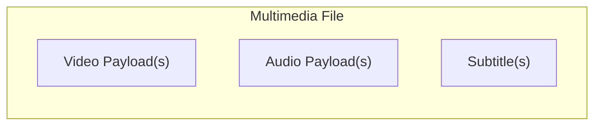
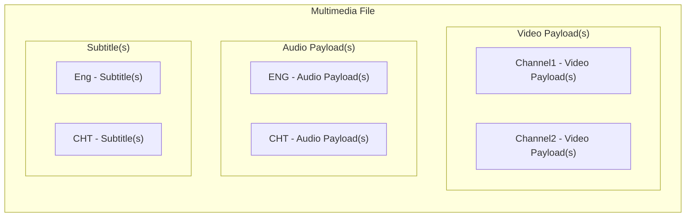
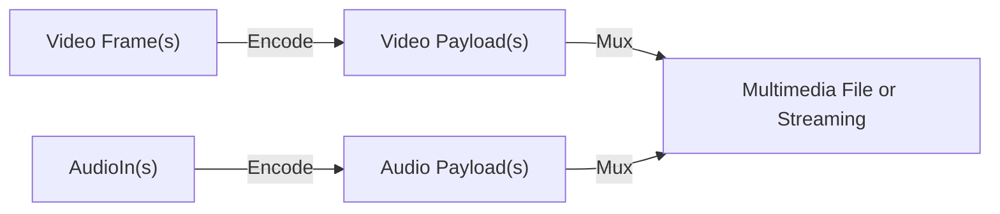
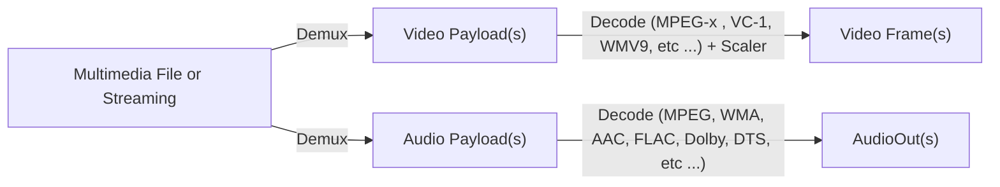
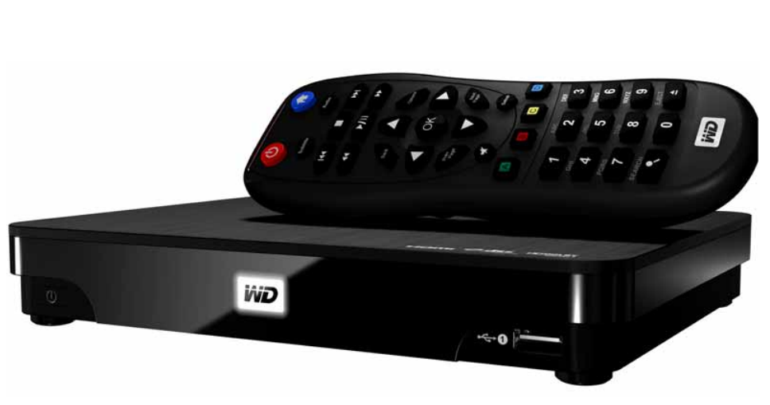

# Multimedia Mux and Demux

[![GitHub license][license-image]][license-url]
[![GitHub stars][stars-image]][stars-url]
[![GitHub forks][forks-image]][forks-url]
[![GitHub issues][issues-image]][issues-image]
[![GitHub watchers][watchers-image]][watchers-image]

[license-image]: https://img.shields.io/github/license/lankahsu520/HelperX.svg
[license-url]: https://github.com/lankahsu520/HelperX/blob/master/LICENSE
[stars-image]: https://img.shields.io/github/stars/lankahsu520/HelperX.svg
[stars-url]: https://github.com/lankahsu520/HelperX/stargazers
[forks-image]: https://img.shields.io/github/forks/lankahsu520/HelperX.svg
[forks-url]: https://github.com/lankahsu520/HelperX/network
[issues-image]: https://img.shields.io/github/issues/lankahsu520/HelperX.svg
[issues-url]: https://github.com/lankahsu520/HelperX/issues
[watchers-image]: https://img.shields.io/github/watchers/lankahsu520/HelperX.svg
[watchers-url]: https://github.com/lankahsu520/HelperX/watchers

# 1. Media container

> 在智慧手機、YouTube 尚未流行前，除了在電腦上看電影外，就是利用 CD Player、DVD Player 和多媒體播放機來觀看。
>
> 那時 Media Streaming 也處於低解析度不順暢的應用，所以大家大多都是抓取整個影音檔後再進行播放。檔案如下圖

## 1.1. 多視角、多聲道、多字幕

# 2. Multimedia Mux (Multiplex)

> 現在很多多媒體製作軟體能進行轉換，其實原理都是一樣的，只要遵循 Media container 的檔案格式，進行壓製即可。
>
> Encode 包含軟體壓縮或是硬體壓縮

# 3. Multimedia Demux (Demultiplex)

> 此為播放時的流程。
>
> Decode 包含軟體解壓縮或是硬體解壓縮

# Appendix

# I. Study

## I.1. [WD TV Live Hub Media Center](https://support-en.wd.com/app/products/product-detailweb/p/188)

> 本人有 3年的工作都是在此台播放機處理 Demux 的工作（雖然當時是接下離職員工的任務，但並未得到此人交接文件和教導，那幾年完全都只有本人單獨作業）。
>
> 因為有點年代，有些細項記憶已不清晰。

## I.2. [Container format](https://en.wikipedia.org/wiki/Container_format)

## I.3. [Comparison of video codecs](https://en.wikipedia.org/wiki/Comparison_of_video_codecs)

## I.4. [Comparison of audio coding formats](https://en.wikipedia.org/wiki/Comparison_of_audio_coding_formats)

## I.5. [Comparison of video container formats](https://en.wikipedia.org/wiki/Comparison_of_video_container_formats)

# II. Debug

# III. Glossary

# IV. Tool Usage

# Author

Created and designed by [Lanka Hsu](lankahsu@gmail.com).

# License

[HelperX](https://github.com/lankahsu520/HelperX) is available under the BSD-3-Clause license. See the LICENSE file for more info.

