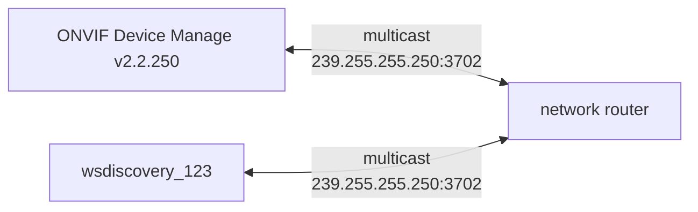
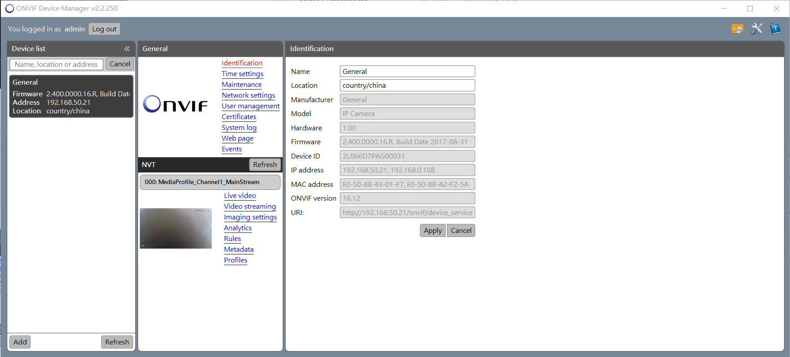
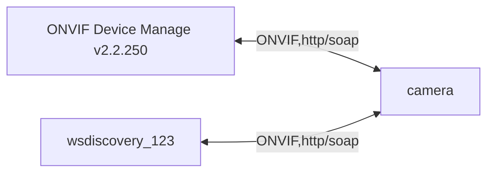

# 1. wsdiscovery to find camera



```bash
$ ./wsdiscovery_123 -d 4
[501487/501488] chainX_udp_bind:2113 - bind ... (239.255.255.250:3702)
[501487/501488] chainX_thread_handler_udp:3101 - udp-bind ok !!! (239.255.255.250:3702, dbg: 4, net_status: 1, sockfd: 3, net_security: 0)
[501487/501487] wsdiscovery_uuid_gen:293 - (messageid: uuid:5820BA78-F269-457E-8DA7-9694695B6B78)
[501487/501487] chainX_multi_sender:3027 - SOCKETX_SENDTO ... (:3702)
[501487/501487] wsdiscovery_uuid_gen:293 - (messageid: uuid:5820BA78-F269-457E-8DA7-9694695B6B78)
[501487/501487] chainX_multi_sender:3027 - SOCKETX_SENDTO ... (:3702)
[501487/501488] wsd_Probe_cb:66 - [192.168.50.72:3702]
[501487/501488] wsd_Probe_cb:69 - Non-implement !!!

[501487/501488] wsd_Probe_cb:66 - [192.168.50.72:3702]
[501487/501488] wsd_Probe_cb:69 - Non-implement !!!

[501487/501488] wsd_ProbeMatches_cb:28 - [192.168.50.21:3702]
[501487/501488] wsd_ProbeMatches_cb:36 - (Address: uuid:af83ca08-61e6-4758-9be7-2ef0c6ba45e5)
[501487/501488] wsd_ProbeMatches_cb:42 - (Types: dn:NetworkVideoTransmitter tds:Device)
[501487/501488] wsd_ProbeMatches_cb:48 - (Scopes: onvif://www.onvif.org/location/country/china onvif://www.onvif.org/name/General onvif://www.onvif.org/hardware/IP_Camera onvif://www.onvif.org/Profile/Streaming onvif://www.onvif.org/type/Network_Video_Transmitter onvif://www.onvif.org/extension/unique_identifier onvif://www.onvif.org/Profile/G)
[501487/501488] wsd_ProbeMatches_cb:54 - (XAddrs: http://192.168.50.21/onvif/device_service)

[501487/501488] ws_device_add:149 - (XAddrs: http://192.168.50.21/onvif/device_service)
[501487/501488] ws_entry_print_ex:75 - (types: dn:NetworkVideoTransmitter tds:Device, version: 1, url: http://192.168.50.21/onvif/device_service)
[501487/501488] wsd_ProbeMatches_cb:28 - [192.168.50.21:3702]
[501487/501488] wsd_ProbeMatches_cb:36 - (Address: uuid:af83ca08-61e6-4758-9be7-2ef0c6ba45e5)
[501487/501488] wsd_ProbeMatches_cb:42 - (Types: dn:NetworkVideoTransmitter tds:Device)
[501487/501488] wsd_ProbeMatches_cb:48 - (Scopes: onvif://www.onvif.org/location/country/china onvif://www.onvif.org/name/General onvif://www.onvif.org/hardware/IP_Camera onvif://www.onvif.org/Profile/Streaming onvif://www.onvif.org/type/Network_Video_Transmitter onvif://www.onvif.org/extension/unique_identifier onvif://www.onvif.org/Profile/G)
[501487/501488] wsd_ProbeMatches_cb:54 - (XAddrs: http://192.168.50.21/onvif/device_service)

[501487/501488] ws_device_add:149 - (XAddrs: http://192.168.50.21/onvif/device_service)
^C[501487/501488] chainX_loop_post:2840 - out !!! (:3702, quit: 1, status: 0)
[501487/501488] chainX_thread_handler_udp:3104 - udp-bind broken !!! (:3702, dbg: 4)
[501487/501488] chainX_thread_handler_udp:3110 - exit (:3702)
[501487/501487] chainX_thread_close:3393 - exit (mode: 5)
[501487/501487] app_stop:165 - exit
[501487/501487] app_exit:172 - exit

```



# 2. ONVIF Info (You must have)

#### URI

```bash
[501487/501488] wsd_ProbeMatches_cb:54 - (XAddrs: http://192.168.50.21/onvif/device_service)
```

#### name and passowrd

# 3. ONVIF Client ask camera 



```bash
$ ./onvif_client_123 --help
Usage: onvif_client
  -d, --debug       debug level
  -i, --ip          ip
  -p, --port        port
  -u, --user        user
  -s, --pass        pass
  -e, --dpath       device url path
  -m, --mpath       media url path
  -a, --auth        http auth
  -h, --help
Version: 0x01004000, 2589, 1668517373, lanka, 1668607007
Example:
  onvif_client -i 192.168.50.239 -p 80 -u admin -s hahahaha

```

#### run

```bash
$ ./onvif_client_123 -d3 -i 192.168.50.21 -p 80 -u admin -s admin -e "/onvif/device_service" -m "/onvif/media_service"
```

#### log

```bash
[503117/503117] main:784 - Start !!! (192.168.50.21:80, admin:admin, device_url_path: /onvif/device_service, media_url_path: /onvif/media_service)
[503117/503118] qtask_GetCapabilities:131 - (gid:769.0, tt:Analytics: http://192.168.50.21/onvif/analytics_service)
[503117/503118] qtask_GetCapabilities:131 - (gid:769.0, tt:Device: http://192.168.50.21/onvif/device_service)
[503117/503118] qtask_GetCapabilities:131 - (gid:769.0, tt:Events: http://192.168.50.21/onvif/event_service)
[503117/503118] qtask_GetCapabilities:131 - (gid:769.0, tt:Imaging: http://192.168.50.21/onvif/imaging_service)
[503117/503118] qtask_GetCapabilities:131 - (gid:769.0, tt:Media: http://192.168.50.21/onvif/media_service)
[503117/503118] qtask_GetCapabilities:110 - (gid:769.0, tt:DeviceIO: http://192.168.50.21/onvif/deviceIO_service)
[503117/503118] qtask_GetCapabilities:110 - (gid:769.0, tt:Recording: http://192.168.50.21/onvif/recording_service)
[503117/503118] qtask_GetCapabilities:110 - (gid:769.0, tt:Search: http://192.168.50.21/onvif/search_service)
[503117/503118] qtask_GetCapabilities:110 - (gid:769.0, tt:Replay: http://192.168.50.21/onvif/replay_service)
[503117/503118] qtask_GetCapabilities:110 - (gid:769.0, tt:Extensions: http://192.168.50.21/onvif/telecom_service)

[503117/503118] qtask_GetDeviceInformation:187 - (gid:769.0, Manufacturer: General)
[503117/503118] qtask_GetDeviceInformation:188 - (gid:769.0, Model: IP Camera)
[503117/503118] qtask_GetDeviceInformation:189 - (gid:769.0, FirmwareVersion: 2.400.0000.16.R, Build Date 2017-08-31)
[503117/503118] qtask_GetDeviceInformation:190 - (gid:769.0, SerialNumber: 2L066D7PAG00031)
[503117/503118] qtask_GetDeviceInformation:191 - (gid:769.0, HardwareId: 1.00)

[503117/503118] qtask_GetHostname:229 - (gid:769.0, FromDHCP: false, Name: IPC)

[503117/503118] qtask_GetServices:346 - (gid:769.0, Namespace: http://www.onvif.org/ver10/device/wsdl)
[503117/503118] qtask_GetServices:347 - (gid:769.0, XAddr: http://192.168.50.21/onvif/device_service)
[503117/503118] qtask_GetServices:346 - (gid:769.0, Namespace: http://www.onvif.org/ver20/analytics/wsdl)
[503117/503118] qtask_GetServices:347 - (gid:769.0, XAddr: http://192.168.50.21/onvif/analytics_service)
[503117/503118] qtask_GetServices:346 - (gid:769.0, Namespace: http://www.onvif.org/ver20/imaging/wsdl)
[503117/503118] qtask_GetServices:347 - (gid:769.0, XAddr: http://192.168.50.21/onvif/imaging_service)
[503117/503118] qtask_GetServices:346 - (gid:769.0, Namespace: http://www.onvif.org/ver10/media/wsdl)
[503117/503118] qtask_GetServices:347 - (gid:769.0, XAddr: http://192.168.50.21/onvif/media_service)
[503117/503118] qtask_GetServices:346 - (gid:769.0, Namespace: http://www.onvif.org/ver20/media/wsdl)
[503117/503118] qtask_GetServices:347 - (gid:769.0, XAddr: http://192.168.50.21/onvif/media2_service)
[503117/503118] qtask_GetServices:346 - (gid:769.0, Namespace: http://www.onvif.org/ver10/events/wsdl)
[503117/503118] qtask_GetServices:347 - (gid:769.0, XAddr: http://192.168.50.21/onvif/event_service)
[503117/503118] qtask_GetServices:346 - (gid:769.0, Namespace: http://www.onvif.org/ver10/deviceIO/wsdl)
[503117/503118] qtask_GetServices:347 - (gid:769.0, XAddr: http://192.168.50.21/onvif/deviceIO_service)
[503117/503118] qtask_GetServices:346 - (gid:769.0, Namespace: http://www.onvif.org/ver10/recording/wsdl)
[503117/503118] qtask_GetServices:347 - (gid:769.0, XAddr: http://192.168.50.21/onvif/recording_service)
[503117/503118] qtask_GetServices:346 - (gid:769.0, Namespace: http://www.onvif.org/ver10/search/wsdl)
[503117/503118] qtask_GetServices:347 - (gid:769.0, XAddr: http://192.168.50.21/onvif/search_service)
[503117/503118] qtask_GetServices:346 - (gid:769.0, Namespace: http://www.onvif.org/ver10/replay/wsdl)
[503117/503118] qtask_GetServices:347 - (gid:769.0, XAddr: http://192.168.50.21/onvif/replay_service)

[503117/503118] qtask_GetScopes:394 - (gid:769.0, [0] ScopeDef: Fixed, ScopeItem: onvif://www.onvif.org/location/country/china)
[503117/503118] qtask_GetScopes:394 - (gid:769.0, [1] ScopeDef: Fixed, ScopeItem: onvif://www.onvif.org/name/General)
[503117/503118] qtask_GetScopes:394 - (gid:769.0, [2] ScopeDef: Fixed, ScopeItem: onvif://www.onvif.org/hardware/IP_Camera)
[503117/503118] qtask_GetScopes:394 - (gid:769.0, [3] ScopeDef: Fixed, ScopeItem: onvif://www.onvif.org/Profile/Streaming)
[503117/503118] qtask_GetScopes:394 - (gid:769.0, [4] ScopeDef: Fixed, ScopeItem: onvif://www.onvif.org/type/Network_Video_Transmitter)
[503117/503118] qtask_GetScopes:394 - (gid:769.0, [5] ScopeDef: Fixed, ScopeItem: onvif://www.onvif.org/extension/unique_identifier)
[503117/503118] qtask_GetScopes:394 - (gid:769.0, [6] ScopeDef: Fixed, ScopeItem: onvif://www.onvif.org/Profile/G)

[503117/503118] qtask_GetNetworkInterfaces:287 - (gid:769.0, [0] token: eth0, Enabled: true, Name: eth0, HwAddress: e0:50:8b:43:01:f7, MTU: 1500)
[503117/503118] qtask_GetNetworkInterfaces:295 - (gid:769.0, [0] IPv4 Enabled: true)
[503117/503118] qtask_GetNetworkInterfaces:304 - (gid:769.0, [0] IPv6 Enabled: true)
[503117/503118] qtask_GetNetworkInterfaces:287 - (gid:769.0, [1] token: eth2, Enabled: true, Name: eth2, HwAddress: e0:50:8b:42:f2:5a, MTU: 1500)
[503117/503118] qtask_GetNetworkInterfaces:295 - (gid:769.0, [1] IPv4 Enabled: true)

[503117/503118] qtask_GetProfiles:437 - (gid:769.0, token: MediaProfile000)

[503117/503118] qtask_GetStreamUri:513 - GetStreamUri (media_uri: rtsp://192.168.50.21:554/cam/realmonitor?channel=1&subtype=0&unicast=true&proto=Onvif)
[503117/503118] http_request:1498 - No support !!! (HTTP_MODE_ID_DOWNLOAFILE_RTSP)
[503117/503118] onvif_GetVideoClip:318 - (http_req.log: )
[503117/503118] qtask_GetStreamUri:521 - qtask_GetStreamUri fail !!! (gid:769.0, video.h264)

[503117/503118] qtask_GetSnapshotUri:471 - GetSnapshotUri (snapshot_uri: http://192.168.50.21/onvifsnapshot/media_service/snapshot?channel=1&subtype=0)
[503117/503118] onvif_GetSnapshot:284 - (http_req.log: Download Ok !!! (snapshot.jpg, 191307 bytes, 108758.000 bytes/sec, total: 1.760 secs))
[503117/503118] qtask_GetSnapshotUri:475 - GetSnapshot ok !!! (gid:769.0, snapshot.jpg)

```

# 4. Test with curl

#### A. git pull utilx9

#### B. update your *.xml

##### B.1. GetProfiles.xml: without AUTH

```xml
<?xml version='1.0' encoding='utf-8'?>
<SOAP-ENV:Envelope xmlns:SOAP-ENV="http://www.w3.org/2003/05/soap-envelope" xmlns:tds="http://www.onvif.org/ver10/device/wsdl" xmlns:trt="http://www.onvif.org/ver10/media/wsdl" xmlns:tt="http://www.onvif.org/ver10/schema">
	<SOAP-ENV:Body>
		<trt:GetProfiles/>
	</SOAP-ENV:Body>
</SOAP-ENV:Envelope>
```

##### B.2. GetProfiles-auth.xml: with AUTH

```xml
Created: {ONVIF_XML_CREATED}
Nonce: {ONVIF_XML_NONCE}
Username: {ONVIF_XML_USERNAME}
Password: {ONVIF_XML_PASSWORD}
```

```bash
<?xml version='1.0' encoding='utf-8'?>
<SOAP-ENV:Envelope xmlns:SOAP-ENV="http://www.w3.org/2003/05/soap-envelope" xmlns:tds="http://www.onvif.org/ver10/device/wsdl" xmlns:trt="http://www.onvif.org/ver10/media/wsdl" xmlns:tt="http://www.onvif.org/ver10/schema">
	<SOAP-ENV:Body>
		<trt:GetProfiles/>
	</SOAP-ENV:Body>
	<SOAP-ENV:Header>
		<Security SOAP-ENV:mustUnderstand="1" xmlns="http://docs.oasis-open.org/wss/2004/01/oasis-200401-wss-wssecurity-secext-1.0.xsd">
			<UsernameToken>
				<Created xmlns="http://docs.oasis-open.org/wss/2004/01/oasis-200401-wss-wssecurity-utility-1.0.xsd">{ONVIF_XML_CREATED}</Created>
				<Nonce EncodingType="http://docs.oasis-open.org/wss/2004/01/oasis-200401-wss-soap-message-security-1.0#Base64Binary">{ONVIF_XML_NONCE}</Nonce>
				<Username>{ONVIF_XML_USERNAME}</Username>
				<Password Type="http://docs.oasis-open.org/wss/2004/01/oasis-200401-wss-username-token-profile-1.0#PasswordDigest">{ONVIF_XML_PASSWORD}</Password>
			</UsernameToken>
		</Security>
	</SOAP-ENV:Header>
</SOAP-ENV:Envelope>
```
#### C. update onvif_client.sh

```bash
USER=admin
PASSWORD=admin

ONVIF_URL="http://192.168.50.21/onvif/media_service"
ONVIF_ACTION="GetProfiles"
ONVIF_AUTH="-auth"

```

#### D. run

```bash
$ ./onvif_client.sh

```

# Appendix

# I. Study

# II. Debug

# III. Tools

## III.1. [ONVIF Device Manager](https://sourceforge.net/projects/onvifdm/)

# IV. [gSOAP](https://www.genivia.com/index.html)

## IV.1. onvif.h

```bash
$ wsdl2h -c -o onvif.h \
	http://www.onvif.org/onvif/ver10/device/wsdl/devicemgmt.wsdl \
	http://www.onvif.org/onvif/ver10/media/wsdl/media.wsdl \
	http://www.onvif.org/onvif/ver10/recording.wsdl \
	http://www.onvif.org/onvif/ver10/replay.wsdl \
	http://www.onvif.org/onvif/ver10/network/wsdl/remotediscovery.wsdl \
	http://www.w3.org/2006/03/addressing/ws-addr.xsd
```

## IV.2. xxx.req.xml & xxx.res.xml 

```bash
$ soapcpp2 -C -I../gsoap-2.8/gsoap/import onvif.h

```

