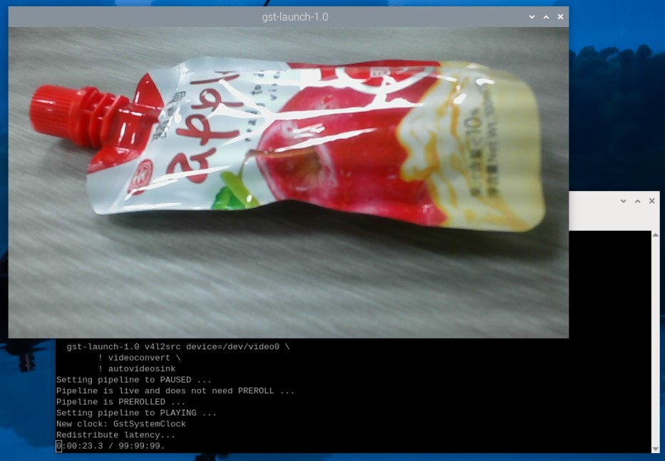
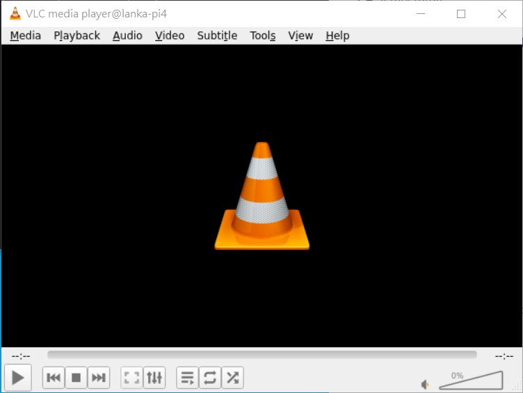
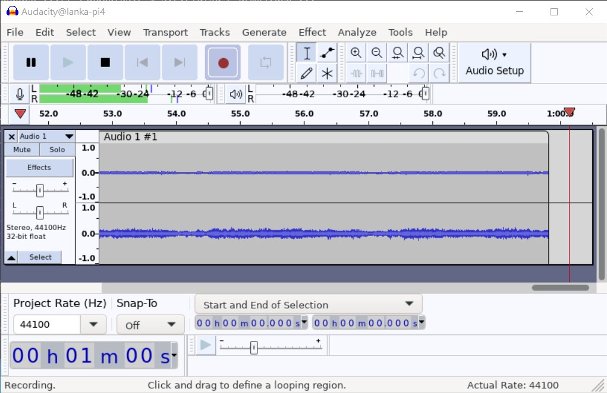

# Raspberry Pi
[](https://github.com/lankahsu520/HelperX)
[![GitHub license][license-image]][license-url]
[![GitHub stars][stars-image]][stars-url]
[![GitHub forks][forks-image]][forks-url]
[![GitHub issues][issues-image]][issues-image]
[![GitHub watchers][watchers-image]][watchers-image]

[license-image]: https://img.shields.io/github/license/lankahsu520/HelperX.svg
[license-url]: https://github.com/lankahsu520/HelperX/blob/master/LICENSE
[stars-image]: https://img.shields.io/github/stars/lankahsu520/HelperX.svg
[stars-url]: https://github.com/lankahsu520/HelperX/stargazers
[forks-image]: https://img.shields.io/github/forks/lankahsu520/HelperX.svg
[forks-url]: https://github.com/lankahsu520/HelperX/network
[issues-image]: https://img.shields.io/github/issues/lankahsu520/HelperX.svg
[issues-url]: https://github.com/lankahsu520/HelperX/issues
[watchers-image]: https://img.shields.io/github/watchers/lankahsu520/HelperX.svg
[watchers-url]: https://github.com/lankahsu520/HelperX/watchers

# 1. Raspberry Pi OS

## 1.1. [Install Raspberry Pi OS using Raspberry Pi Imager](https://www.raspberrypi.com/software/)

> I can't use Traditional Chinese !!!

#### A. Run

#### B. Select OS

#### C. Select Disk

#### D. Confirm

#### E. Burn


#### F. Insert SD card and turn on Raspberry Pi

## 1.2. 1st Bootup

#### A. 32-BIT

```bash
$ uname -a
Linux lanka-pi3 5.15.56-v7+ #1575 SMP Fri Jul 22 20:28:11 BST 2022 armv7l GNU/Linux

$ cat /proc/version
Linux version 5.15.56-v7+ (dom@buildbot) (arm-linux-gnueabihf-gcc-8 (Ubuntu/Linaro 8.4.0-3ubuntu1) 8.4.0, GNU ld (GNU Binutils for Ubuntu) 2.34) #1575 SMP Fri Jul 22 20:28:11 BST 2022

$ cat /etc/os-release
PRETTY_NAME="Raspbian GNU/Linux 11 (bullseye)"
NAME="Raspbian GNU/Linux"
VERSION_ID="11"
VERSION="11 (bullseye)"
VERSION_CODENAME=bullseye
ID=raspbian
ID_LIKE=debian
HOME_URL="http://www.raspbian.org/"
SUPPORT_URL="http://www.raspbian.org/RaspbianForums"
BUG_REPORT_URL="http://www.raspbian.org/RaspbianBugs"

$ cat /etc/issue
Raspbian GNU/Linux 11 \n \l

$ sudo rm sh
$ sudo ln -s bash sh
$ ls -al /bin/sh
lrwxrwxrwx 1 root root 4 Aug 25 12:41 /bin/sh -> bash
```

#### B. 64-BIT

```bash
$ uname -a
Linux lanka-pi4 6.6.20+rpt-rpi-v8 #1 SMP PREEMPT Debian 1:6.6.20-1+rpt1 (2024-03-07) aarch64 GNU/Linux

$ cat /proc/version
Linux version 6.6.20+rpt-rpi-v8 (debian-kernel@lists.debian.org) (gcc-12 (Debian 12.2.0-14) 12.2.0, GNU ld (GNU Binutils for Debian) 2.40) #1 SMP PREEMPT Debian 1:6.6.20-1+rpt1 (2024-03-07)

$ cat /etc/os-release
PRETTY_NAME="Debian GNU/Linux 12 (bookworm)"
NAME="Debian GNU/Linux"
VERSION_ID="12"
VERSION="12 (bookworm)"
VERSION_CODENAME=bookworm
ID=debian
HOME_URL="https://www.debian.org/"
SUPPORT_URL="https://www.debian.org/support"
BUG_REPORT_URL="https://bugs.debian.org/"

$ cat /etc/issue
Debian GNU/Linux 12 \n \l

$ sudo rm sh
$ sudo ln -s bash sh
$ ls -al /bin/sh
lrwxrwxrwx 1 root root 4 Mar 21 14:26 /bin/sh -> bash
```

## 1.3. Setting up Raspberry Pi

### 1.3.1. APT Install packages

#### A. General usage

```bash
sudo apt-get --yes update
sudo apt-get --yes upgrade

echo "==> vim"; #read yn_reply;
sudo apt-get --yes install vim

echo "==> gcc make"; #read yn_reply;
sudo apt-get --yes install gcc
sudo apt-get --yes install g++
sudo apt-get --yes install make
sudo apt-get --yes install cmake
#sudo apt-get --yes install qmake
sudo apt-get --yes install automake autoconf

sudo pip3 install meson
sudo apt-get --yes install ninja-build

echo "==> pkg-config"; #read yn_reply;
sudo apt-get --yes install pkg-config

echo "==> libglib2.0-dev"; #read yn_reply;
sudo apt-get --yes install libglib2.0-dev
sudo apt-get --yes install libjson-glib-dev
sudo apt-get --yes install libxml2-dev
sudo pip3 install hotdoc

echo "==> git"; #read yn_reply;
sudo apt-get --yes install git

echo "==> subversion"; #read yn_reply;
sudo apt-get --yes install subversion-tools
sudo apt-get --yes install subversion

echo "==> gstreamer1.0"; #read yn_reply;
sudo apt-get --yes install gstreamer1.0-plugins*
#sudo apt-get --yes install gstreamer1.0-ffmpeg*
sudo apt-get --yes install libgstreamer1.0-dev libgstreamer-plugins-base1.0-dev

# for pi4 only
sudo apt-get --yes install gstreamer1.0-libcamera

echo "==> ffmpeg"; #read yn_reply;
sudo apt-get --yes install ffmpeg
#sudo apt-get --yes install libav-tools
sudo apt-get --yes install libavformat-dev
sudo apt-get --yes install libavfilter-dev
sudo apt-get --yes install libavdevice-dev
```

```bash
$ autoconf -V
autoconf (GNU Autoconf) 2.69
Copyright (C) 2012 Free Software Foundation, Inc.
License GPLv3+/Autoconf: GNU GPL version 3 or later
<http://gnu.org/licenses/gpl.html>, <http://gnu.org/licenses/exceptions.html>
This is free software: you are free to change and redistribute it.
There is NO WARRANTY, to the extent permitted by law.

Written by David J. MacKenzie and Akim Demaille.

$ automake --version
automake (GNU automake) 1.16.3
Copyright (C) 2020 Free Software Foundation, Inc.
License GPLv2+: GNU GPL version 2 or later <https://gnu.org/licenses/gpl-2.0.html>
This is free software: you are free to change and redistribute it.
There is NO WARRANTY, to the extent permitted by law.

Written by Tom Tromey <tromey@redhat.com>
       and Alexandre Duret-Lutz <adl@gnu.org>.

$ cmake --version
cmake version 3.18.4

CMake suite maintained and supported by Kitware (kitware.com/cmake).

$ pkg-config --version
0.29.2

$ gcc --version
gcc (Raspbian 10.2.1-6+rpi1) 10.2.1 20210110
Copyright (C) 2020 Free Software Foundation, Inc.
This is free software; see the source for copying conditions.  There is NO
warranty; not even for MERCHANTABILITY or FITNESS FOR A PARTICULAR PURPOSE.
```

#### B. Python

> <font color="red">真的不建議更改系統的 Python，請儘量重新安裝 OS 至 SD-Card 中。</font>

##### A.1. [helper_Python.md](https://github.com/lankahsu520/HelperX/blob/master/helper_Python.md) - Python helper.

##### ~~A.2. [How to Update Python on Raspberry Pi](https://linuxhint.com/update-python-raspberry-pi/)~~

> 真的不建議更改系統的 Python。

```bash
$ wget https://www.python.org/ftp/python/3.11.4/Python-3.11.4.tgz
$ tar -zxvf Python-3.11.4.tgz
$ cd Python-3.11.4
$ ./configure --enable-optimizations
$ sudo make altinstall
$ ll /usr/local/bin/python3*
$ cd /usr/bin
$ ll python*
$ sudo rm python3
$ sudo rm python3-config
$ sudo ln -s /usr/local/bin/python3.11 python3
$ sudo ln -s /usr/local/bin/python3.11-config python3-config
$ python3 -V

$ python3 -m pip list

$ python3 -m pip install --upgrade --force-reinstall pip
$ sudo mv /usr/bin/pip3 /usr/bin/pip3-old
$ sudo cp /home/pi/.local/bin/pip3 /usr/bin/pip3
$ pip3 -V
```

### 1.3.2. Interface Options

```bash
$ sudo raspi-config
```

#### A. Camera

```bash
$ sudo raspi-config
Interface Options / I1 Legacy Camera 
```

#### B. SSH

```bash
$ sudo raspi-config
Interface Options / I2 SSH
```

#### C. VNC

> [VNC Viewer](https://www.realvnc.com/en/connect/download/viewer/)

```bash
$ sudo raspi-config
Interface Options / I3 VNC
```

#### D. Serial

> [[Raspberry Pi] 啟用Raspberry Pi 3B+ 序列埠功能](https://dumbcatnote.blogspot.com/2020/04/raspberry-pi-enable-serial-port.html)

```bash
$ sudo raspi-config
Interface Options / I6 Serial Port
```

# 2. Hardware Information

## 2.1. Clock frequency

```bash
$ vcgencmd measure_clock arm
frequency(48)=600169920

$ for src in arm core h264 isp v3d uart pwm emmc pixel vec hdmi dpi ; do \
  echo -e "$src:\t$(vcgencmd measure_clock $src)" ; \
done
arm:    frequency(48)=600169920
core:   frequency(1)=199995120
h264:   frequency(28)=0
isp:    frequency(45)=0
v3d:    frequency(46)=250000496
uart:   frequency(22)=48001464
pwm:    frequency(25)=107143064
emmc:   frequency(50)=250000496
pixel:  frequency(29)=74988280
vec:    frequency(10)=0
hdmi:   frequency(9)=119997072
dpi:    frequency(4)=0
```

## 2.2. Codec

```bash
$ for codec in H264 MPG2 WVC1 MPG4 MJPG WMV9 ; do \
  echo -e "$codec:\t$(vcgencmd codec_enabled $codec)" ; \
done
H264:   H264=enabled
MPG2:   MPG2=disabled
WVC1:   WVC1=disabled
MPG4:   MPG4=disabled
MJPG:   MJPG=enabled
WMV9:   WMV9=disabled
```

## 2.3. Memory

```bash
$ vcgencmd get_mem arm
arm=948M

$ vcgencmd get_mem gpu
gpu=76M
```

## 2.4. Temperature

```bash
$ vcgencmd measure_temp
temp=42.8'C
```

## 2.5. Voltage

```bash
$ vcgencmd measure_volts
volt=0.8600V

$ for id in core sdram_c sdram_i sdram_p ; do \
  echo -e "$id:\t$(vcgencmd measure_volts $id)" ; \
done
core:   volt=0.8600V
sdram_c:        volt=1.1000V
sdram_i:        volt=1.1000V
sdram_p:        volt=1.1000V
```

#### A. Under-voltage Detected Warning

```bash
$ vcgencmd get_throttled
throttled=0x50005
```

```bash
$ dmesg | grep -iC 3 "under-voltage detected"
```

| Hex    | Bin                 | Desc                                                       |
| ------ | ------------------- | ---------------------------------------------------------- |
| 0x0001 | 0001                | Under-voltage detected<br>檢測到欠壓                       |
| 0x0002 | 0010                | ARM frequency has been caped<br>ARM 頻率已封頂             |
| 0x0004 | 0100                | Currently throttled<br>當前已限制                          |
| 0x0008 | 1000                | Soft temperature limit is active<br>軟溫度限制處於活動狀態 |
| 0x1000 | 0001 0000 0000 0000 | Under-voltage has occurred<br>發生欠壓                     |
| 0x2000 | 0010 0000 0000 0000 | ARM frequency capping has occurred<br>發生了 ARM 頻率上限  |
| 0x4000 | 0100 0000 0000 0000 | Throttling has occurred<br>發生限制                        |
| 0x8000 | 1000 0000 0000 0000 | Soft temperature limit has occurred<br>出現軟溫度限制      |
|        |                     |                                                            |

```bash
# To disable the low voltage warning
$ sudo nano /boot/config.txt
avoid_warnings=1

# LXPanel plugin: The notification on the top-right corner of the screen
$ sudo apt remove lxplug-ptbatt

$ sudo reboot
```

## 2.6. Camera

```bash
# 因為我是使用 usb camera，所以找不到
$ vcgencmd get_camera
supported=0 detected=0, libcamera interfaces=0
```

# 3. Play Raspberry Pi

## 3.1. Maker (創客)

#### A. [RPiP9](https://github.com/lankahsu520/RPiP9)

> RPiP9 是個人的的創作。
>
> 把 Raspberry Pi 上常見的模組搜集而成。

## 3.2. Camera

#### A. cheese

```bash
$ sudo apt-get --yes install cheese
$ cheese
```


#### B. guvcview

```bash
$ sudo apt-get --yes install guvcview
$ guvcview
```


#### C. fswebcam

```bash
$ sudo apt-get --yes install fswebcam
$ fswebcam capture.jpg
```


#### D. v4l2-ctl

> 請見 [IV.2. v4l2-ctl Usage](#IV.2. v4l2-ctl Usage)

#### E. [libcamera](https://www.raspberrypi.com/documentation/accessories/camera.html#libcamera-still), raspistill

```bash
$ libcamera-jpeg -o capture.jpg
$ libcamera-still -e png -o capture.png
$ libcamera-hello
```

```bash
# pi3 only
$ raspistill -o capture.jpg
```

#### F. gstreamer

```bash
$ v4l2-ctl -d /dev/video0 --list-formats-ext

$ gst-launch-1.0 v4l2src device=/dev/video0 \
	! videoconvert \
	! autovideosink

# 'YUYV' (YUYV 4:2:2)
$ gst-launch-1.0 v4l2src device=/dev/video0 \
	! video/x-raw,width=640,height=480,framerate=30/1,format=YUY2 \
	! videoconvert \
	! autovideosink
```



##### F.1. v4l2src -> udpsink ⇢ udpsrc -> autovideosink

```bash
# v4l2src -> udpsink
$ gst-launch-1.0 v4l2src device=/dev/video0 \
	! video/x-raw,width=640,height=480,framerate=30/1 \
	! videoconvert \
	! x264enc \
	! rtph264pay \
	! udpsink host=127.0.0.1 port=50000

# udpsrc -> autovideosink
$ gst-launch-1.0 -v udpsrc \
	port=50000 \
	caps='application/x-rtp, media=(string)video, clock-rate=(int)90000, encoding-name=(string)H264, payload=(int)96' \
	! rtph264depay \
	! decodebin \
	! videoconvert ! autovideosink

$ gst-launch-1.0 -v udpsrc \
	port=50000 \
	caps='application/x-rtp, media=(string)video, encoding-name=(string)H264' \
	! rtph264depay \
	! decodebin \
	! videoconvert ! autovideosink
```

##### F2. libcamerasrc -> autovideosink

```bash
$ gst-launch-1.0 libcamerasrc \
	! video/x-raw,width=640,height=480,framerate=30/1 \
	! videoconvert \
	! clockoverlay time-format="%D %H:%M:%S" \
	! autovideosink
```

## 3.3. Media Player

#### A. VLC media player

> 這個不用介紹

```bash
$ vlc
```



## 3.4. Audio In

#### A. Audacity

```bash
$ sudo apt-get --yes install audacity
$ audacity
```



#### B. arecord

```bash
$ arecord --list-devices
**** List of CAPTURE Hardware Devices ****
card 3: w300 [w300], device 0: USB Audio [USB Audio]
  Subdevices: 1/1
  Subdevice #0: subdevice #0

$ arecord --format S16_LE --rate 44100 -d 60 -c 2 record.wav
Recording WAVE 'record.wav' : Signed 16 bit Little Endian, Rate 44100 Hz, Stereo
```

# Appendix

# I. Study

## I.1. [Day2 - 安裝樹莓派OS](https://ithelp.ithome.com.tw/articles/10235135)

## I.2. Operating system images

#### A. [raspios_arm64](https://downloads.raspberrypi.org/raspios_arm64/images/)

```html
[PARENTDIR]	Parent Directory	 	-	 
[DIR]	raspios_arm64-2020-05-28/	2020-05-28 06:01	-	 
[DIR]	raspios_arm64-2020-08-24/	2020-08-24 18:56	-	 
[DIR]	raspios_arm64-2021-04-09/	2021-04-09 15:57	-	 
[DIR]	raspios_arm64-2021-05-28/	2021-05-28 16:08	-	 
[DIR]	raspios_arm64-2021-11-08/	2021-11-08 07:49	-	 
[DIR]	raspios_arm64-2022-01-28/	2022-01-28 16:53	-	 
[DIR]	raspios_arm64-2022-04-07/	2022-04-07 12:03	-	 
[DIR]	raspios_arm64-2022-09-07/	2022-09-07 05:18	-	 
[DIR]	raspios_arm64-2022-09-26/	2022-09-26 09:37	-	 
[DIR]	raspios_arm64-2023-02-22/	2023-02-22 11:31	-	 
[DIR]	raspios_arm64-2023-05-03/	2023-10-10 15:09	-	 
[DIR]	raspios_arm64-2023-10-10/	2023-10-10 16:13	-	 
[DIR]	raspios_arm64-2023-12-06/	2023-12-06 02:23	-	 
[DIR]	raspios_arm64-2024-03-13/	2024-03-13 12:12	-	 
[DIR]	raspios_arm64-2024-03-15/	2024-03-15 16:13	-	 
```

#### B. [Install Ubuntu on a Raspberry Pi](https://ubuntu.com/download/raspberry-pi)

## I.3. [使用 vcgencmd 指令查看 Raspberry Pi 的 CPU 溫度、運行速度與電壓等資訊](https://blog.gtwang.org/iot/raspberry-pi-vcgencmd-hardware-information/)

## I.4. [树莓派raspistill、raspiyuv、raspivid使用以及相机Raw图获取、处理](https://zhaoxuhui.top/blog/2021/09/14/raspistill-raspiyuv-raspivid-and-camera-raw-data.html)

# II. Debug

## II.1. pip, error: externally-managed-environment

```bash
$ sudo mv /usr/lib/python3.11/EXTERNALLY-MANAGED /usr/lib/python3.11/EXTERNALLY-MANAGED-bak
```

# III. Glossary

# IV. Tool Usage

## IV.1. vcgencmd Usage

```bash
$ vcgencmd commands
commands="commands, set_logging, bootloader_config, bootloader_version, cache_flush, codec_enabled, get_mem, get_rsts, measure_clock, measure_temp, measure_volts, get_hvs_asserts, get_config, get_throttled, pmicrd, pmicwr, read_ring_osc, version, readmr, otp_dump, set_vll_dir, set_backlight, get_lcd_info, arbiter, test_result, get_camera, enable_clock, scaling_kernel, scaling_sharpness, hdmi_ntsc_freqs, hdmi_adjust_clock, hdmi_status_show, hvs_update_fields, pwm_speedup, force_audio, hdmi_stream_channels, hdmi_channel_map, display_power, memtest, dispmanx_list, schmoo, render_bar, disk_notify, inuse_notify, sus_suspend, sus_status, sus_is_enabled, sus_stop_test_thread, egl_platform_switch, mem_validate, mem_oom, mem_reloc_stats, hdmi_cvt, hdmi_timings, file, vcos, ap_output_control, ap_output_post_processing, vchi_test_init, vchi_test_exit, pm_set_policy, pm_get_status, pm_show_stats, pm_start_logging, pm_stop_logging, vctest_memmap, vctest_start, vctest_stop, vctest_set, vctest_get"
```

## IV.2. v4l2-ctl Usage

```bash
$ v4l2-ctl

General/Common options:
  --all              display all information available
  -C, --get-ctrl <ctrl>[,<ctrl>...]
                     get the value of the controls [VIDIOC_G_EXT_CTRLS]
  -c, --set-ctrl <ctrl>=<val>[,<ctrl>=<val>...]
                     set the value of the controls [VIDIOC_S_EXT_CTRLS]
  -D, --info         show driver info [VIDIOC_QUERYCAP]
  -d, --device <dev> use device <dev> instead of /dev/video0
                     if <dev> starts with a digit, then /dev/video<dev> is used
                     Otherwise if -z was specified earlier, then <dev> is the entity name
                     or interface ID (if prefixed with 0x) as found in the topology of the
                     media device with the bus info string as specified by the -z option.
  -e, --out-device <dev> use device <dev> for output streams instead of the
                     default device as set with --device
                     if <dev> starts with a digit, then /dev/video<dev> is used
                     Otherwise if -z was specified earlier, then <dev> is the entity name
                     or interface ID (if prefixed with 0x) as found in the topology of the
                     media device with the bus info string as specified by the -z option.
  -E, --export-device <dev> use device <dev> for exporting DMA buffers
                     if <dev> starts with a digit, then /dev/video<dev> is used
                     Otherwise if -z was specified earlier, then <dev> is the entity name
                     or interface ID (if prefixed with 0x) as found in the topology of the
                     media device with the bus info string as specified by the -z option.
  -z, --media-bus-info <bus-info>
                     find the media device with the given bus info string. If set, then
                     -d, -e and -E options can use the entity name or interface ID to refer
                     to the device nodes.
  -h, --help         display this help message
  --help-all         all options
  --help-io          input/output options
  --help-meta        metadata format options
  --help-misc        miscellaneous options
  --help-overlay     overlay format options
  --help-sdr         SDR format options
  --help-selection   crop/selection options
  --help-stds        standards and other video timings options
  --help-streaming   streaming options
  --help-subdev      sub-device options
  --help-tuner       tuner/modulator options
  --help-vbi         VBI format options
  --help-vidcap      video capture format options
  --help-vidout      vidout output format options
  --help-edid        edid handling options
  -k, --concise      be more concise if possible.
  -l, --list-ctrls   display all controls and their values [VIDIOC_QUERYCTRL]
  -L, --list-ctrls-menus
                     display all controls and their menus [VIDIOC_QUERYMENU]
  -r, --subset <ctrl>[,<offset>,<size>]+
                     the subset of the N-dimensional array to get/set for control <ctrl>,
                     for every dimension an (<offset>, <size>) tuple is given.
  -w, --wrapper      use the libv4l2 wrapper library.
  --list-devices     list all v4l devices. If -z was given, then list just the
                     devices of the media device with the bus info string as
                     specified by the -z option.
  --log-status       log the board status in the kernel log [VIDIOC_LOG_STATUS]
  --get-priority     query the current access priority [VIDIOC_G_PRIORITY]
  --set-priority <prio>
                     set the new access priority [VIDIOC_S_PRIORITY]
                     <prio> is 1 (background), 2 (interactive) or 3 (record)
  --silent           only set the result code, do not print any messages
  --sleep <secs>     sleep <secs>, call QUERYCAP and close the file handle
  --verbose          turn on verbose ioctl status reporting
  --version          show version information
```

#### A. --list-devices

```bash
$ v4l2-ctl --list-devices
bcm2835-codec-decode (platform:bcm2835-codec):
        /dev/video10
        /dev/video11
        /dev/video12
        /dev/video18
        /dev/video31
        /dev/media2

bcm2835-isp (platform:bcm2835-isp):
        /dev/video13
        /dev/video14
        /dev/video15
        /dev/video16
        /dev/video20
        /dev/video21
        /dev/video22
        /dev/video23
        /dev/media0
        /dev/media3

rpivid (platform:rpivid):
        /dev/video19
        /dev/media1

w300: w300 (usb-0000:01:00.0-1.4):
        /dev/video0
        /dev/video1
        /dev/media4
```

#### B. --list-formats-ext

```bash
$ v4l2-ctl -d /dev/video0 --list-formats-ext
ioctl: VIDIOC_ENUM_FMT
        Type: Video Capture

        [0]: 'MJPG' (Motion-JPEG, compressed)
                Size: Discrete 1920x1080
                        Interval: Discrete 0.033s (30.000 fps)
                Size: Discrete 1600x896
                        Interval: Discrete 0.033s (30.000 fps)
                Size: Discrete 1280x720
                        Interval: Discrete 0.033s (30.000 fps)
                Size: Discrete 1024x768
                        Interval: Discrete 0.033s (30.000 fps)
                Size: Discrete 1024x576
                        Interval: Discrete 0.033s (30.000 fps)
                Size: Discrete 960x544
                        Interval: Discrete 0.033s (30.000 fps)
                Size: Discrete 864x480
                        Interval: Discrete 0.033s (30.000 fps)
                Size: Discrete 848x480
                        Interval: Discrete 0.033s (30.000 fps)
                Size: Discrete 800x448
                        Interval: Discrete 0.033s (30.000 fps)
                Size: Discrete 640x480
                        Interval: Discrete 0.033s (30.000 fps)
                Size: Discrete 640x360
                        Interval: Discrete 0.033s (30.000 fps)
                Size: Discrete 352x288
                        Interval: Discrete 0.033s (30.000 fps)
                Size: Discrete 320x240
                        Interval: Discrete 0.033s (30.000 fps)
        [1]: 'YUYV' (YUYV 4:2:2)
                Size: Discrete 640x480
                        Interval: Discrete 0.033s (30.000 fps)
                Size: Discrete 864x480
                        Interval: Discrete 0.100s (10.000 fps)
                Size: Discrete 848x480
                        Interval: Discrete 0.100s (10.000 fps)
                Size: Discrete 800x448
                        Interval: Discrete 0.100s (10.000 fps)
                Size: Discrete 640x360
                        Interval: Discrete 0.033s (30.000 fps)
                Size: Discrete 352x288
                        Interval: Discrete 0.033s (30.000 fps)
                Size: Discrete 320x240
                        Interval: Discrete 0.033s (30.000 fps)
```

#### C.  --list-formats

```bash
$ v4l2-ctl -d /dev/video0 --list-formats
ioctl: VIDIOC_ENUM_FMT
        Type: Video Capture

        [0]: 'MJPG' (Motion-JPEG, compressed)
        [1]: 'YUYV' (YUYV 4:2:2)

```

#### D. --list-framesizes

```bash
$ v4l2-ctl -d /dev/video0 --list-framesizes=YUYV
ioctl: VIDIOC_ENUM_FRAMESIZES
        Size: Discrete 640x480
        Size: Discrete 864x480
        Size: Discrete 848x480
        Size: Discrete 800x448
        Size: Discrete 640x360
        Size: Discrete 352x288
        Size: Discrete 320x240
$ v4l2-ctl -d /dev/video0 --list-framesizes=MJPG
ioctl: VIDIOC_ENUM_FRAMESIZES
        Size: Discrete 1920x1080
        Size: Discrete 1600x896
        Size: Discrete 1280x720
        Size: Discrete 1024x768
        Size: Discrete 1024x576
        Size: Discrete 960x544
        Size: Discrete 864x480
        Size: Discrete 848x480
        Size: Discrete 800x448
        Size: Discrete 640x480
        Size: Discrete 640x360
        Size: Discrete 352x288
        Size: Discrete 320x240
```

#### E. --get-fmt-video

```bash
$ v4l2-ctl -d /dev/video0 --get-fmt-video
Format Video Capture:
        Width/Height      : 640/480
        Pixel Format      : 'MJPG' (Motion-JPEG)
        Field             : None
        Bytes per Line    : 0
        Size Image        : 614989
        Colorspace        : sRGB
        Transfer Function : Default (maps to sRGB)
        YCbCr/HSV Encoding: Default (maps to ITU-R 601)
        Quantization      : Default (maps to Full Range)
        Flags             :
```

#### F. --list-ctrls

```bash
$ v4l2-ctl --list-ctrls
User Controls

                     brightness 0x00980900 (int)    : min=-64 max=64 step=1 default=0 value=0
                       contrast 0x00980901 (int)    : min=0 max=64 step=1 default=32 value=32
                     saturation 0x00980902 (int)    : min=0 max=128 step=1 default=64 value=64
                            hue 0x00980903 (int)    : min=-40 max=40 step=1 default=0 value=0
        white_balance_automatic 0x0098090c (bool)   : default=1 value=1
                          gamma 0x00980910 (int)    : min=72 max=500 step=1 default=100 value=100
                           gain 0x00980913 (int)    : min=0 max=100 step=1 default=0 value=0
           power_line_frequency 0x00980918 (menu)   : min=0 max=2 default=2 value=1 (50 Hz)
      white_balance_temperature 0x0098091a (int)    : min=2800 max=6500 step=1 default=4600 value=4600 flags=inactive
                      sharpness 0x0098091b (int)    : min=0 max=6 step=1 default=4 value=4
         backlight_compensation 0x0098091c (int)    : min=0 max=160 step=1 default=80 value=80

Camera Controls

                  auto_exposure 0x009a0901 (menu)   : min=0 max=3 default=3 value=3 (Aperture Priority Mode)
         exposure_time_absolute 0x009a0902 (int)    : min=1 max=5000 step=1 default=157 value=157 flags=inactive
     exposure_dynamic_framerate 0x009a0903 (bool)   : default=0 value=1

```

#### G. --set-ctrl

```bash
$ v4l2-ctl --set-ctrl=rotate=180
$ v4l2-ctl --set-ctrl h264_i_frame_period=1
```

## IV.3. arecord Usage

```bash
$ arecord
Usage: arecord [OPTION]... [FILE]...

-h, --help              help
    --version           print current version
-l, --list-devices      list all soundcards and digital audio devices
-L, --list-pcms         list device names
-D, --device=NAME       select PCM by name
-q, --quiet             quiet mode
-t, --file-type TYPE    file type (voc, wav, raw or au)
-c, --channels=#        channels
-f, --format=FORMAT     sample format (case insensitive)
-r, --rate=#            sample rate
-d, --duration=#        interrupt after # seconds
-s, --samples=#         interrupt after # samples per channel
-M, --mmap              mmap stream
-N, --nonblock          nonblocking mode
-F, --period-time=#     distance between interrupts is # microseconds
-B, --buffer-time=#     buffer duration is # microseconds
    --period-size=#     distance between interrupts is # frames
    --buffer-size=#     buffer duration is # frames
-A, --avail-min=#       min available space for wakeup is # microseconds
-R, --start-delay=#     delay for automatic PCM start is # microseconds
                        (relative to buffer size if <= 0)
-T, --stop-delay=#      delay for automatic PCM stop is # microseconds from xrun
-v, --verbose           show PCM structure and setup (accumulative)
-V, --vumeter=TYPE      enable VU meter (TYPE: mono or stereo)
-I, --separate-channels one file for each channel
-i, --interactive       allow interactive operation from stdin
-m, --chmap=ch1,ch2,..  Give the channel map to override or follow
    --disable-resample  disable automatic rate resample
    --disable-channels  disable automatic channel conversions
    --disable-format    disable automatic format conversions
    --disable-softvol   disable software volume control (softvol)
    --test-position     test ring buffer position
    --test-coef=#       test coefficient for ring buffer position (default 8)
                        expression for validation is: coef * (buffer_size / 2)
    --test-nowait       do not wait for ring buffer - eats whole CPU
    --max-file-time=#   start another output file when the old file has recorded
                        for this many seconds
    --process-id-file   write the process ID here
    --use-strftime      apply the strftime facility to the output file name
    --dump-hw-params    dump hw_params of the device
    --fatal-errors      treat all errors as fatal
Recognized sample formats are: S8 U8 S16_LE S16_BE U16_LE U16_BE S24_LE S24_BE U24_LE U24_BE S32_LE S32_BE U32_LE U32_BE FLOAT_LE FLOAT_BE FLOAT64_LE FLOAT64_BE IEC958_SUBFRAME_LE IEC958_SUBFRAME_BE MU_LAW A_LAW IMA_ADPCM MPEG GSM S20_LE S20_BE U20_LE U20_BE SPECIAL S24_3LE S24_3BE U24_3LE U24_3BE S20_3LE S20_3BE U20_3LE U20_3BE S18_3LE S18_3BE U18_3LE U18_3BE G723_24 G723_24_1B G723_40 G723_40_1B DSD_U8 DSD_U16_LE DSD_U32_LE DSD_U16_BE DSD_U32_BE
Some of these may not be available on selected hardware
The available format shortcuts are:
-f cd (16 bit little endian, 44100, stereo)
-f cdr (16 bit big endian, 44100, stereo)
-f dat (16 bit little endian, 48000, stereo)
```

#### A. --list-devices

```bash
$ arecord --list-devices
**** List of CAPTURE Hardware Devices ****
card 3: w300 [w300], device 0: USB Audio [USB Audio]
  Subdevices: 1/1
  Subdevice #0: subdevice #0
```

#### B. --list-pcms

```bash
$ arecord --list-pcms
null
    Discard all samples (playback) or generate zero samples (capture)
default
    Playback/recording through the PulseAudio sound server
sysdefault
    Default Audio Device
lavrate
    Rate Converter Plugin Using Libav/FFmpeg Library
samplerate
    Rate Converter Plugin Using Samplerate Library
speexrate
    Rate Converter Plugin Using Speex Resampler
jack
    JACK Audio Connection Kit
oss
    Open Sound System
pulse
    PulseAudio Sound Server
speex
    Plugin using Speex DSP (resample, agc, denoise, echo, dereverb)
upmix
    Plugin for channel upmix (4,6,8)
vdownmix
    Plugin for channel downmix (stereo) with a simple spacialization
usbstream:CARD=vc4hdmi0
    vc4-hdmi-0
    USB Stream Output
usbstream:CARD=vc4hdmi1
    vc4-hdmi-1
    USB Stream Output
usbstream:CARD=Headphones
    bcm2835 Headphones
    USB Stream Output
hw:CARD=w300,DEV=0
    w300, USB Audio
    Direct hardware device without any conversions
plughw:CARD=w300,DEV=0
    w300, USB Audio
    Hardware device with all software conversions
sysdefault:CARD=w300
    w300, USB Audio
    Default Audio Device
front:CARD=w300,DEV=0
    w300, USB Audio
    Front output / input
dsnoop:CARD=w300,DEV=0
    w300, USB Audio
    Direct sample snooping device
usbstream:CARD=w300
    w300
    USB Stream Output
```

# Author

> Created and designed by [Lanka Hsu](lankahsu@gmail.com).

# License

> [HelperX](https://github.com/lankahsu520/HelperX) is available under the BSD-3-Clause license. See the LICENSE file for more info.

