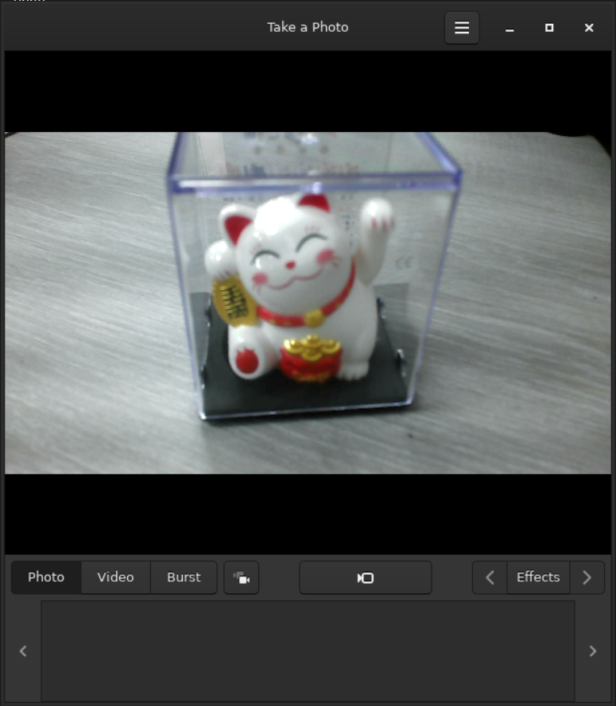
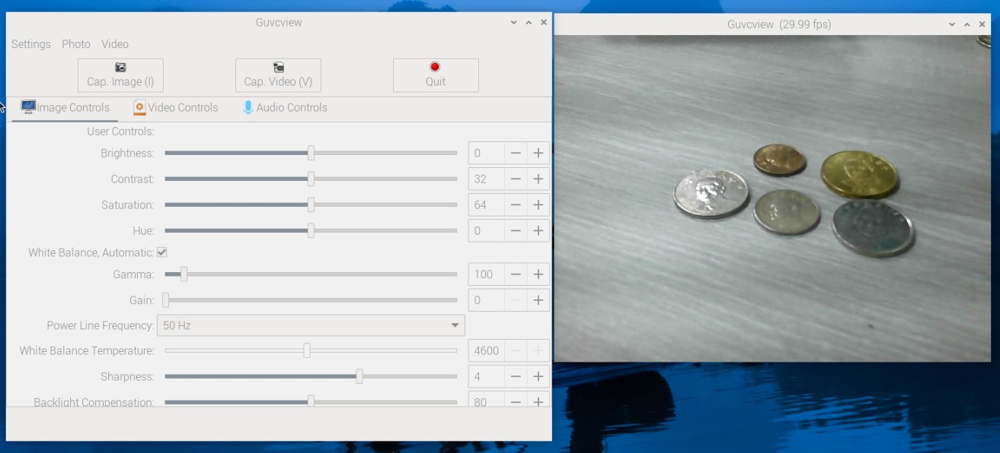

# Raspberry Pi
[](https://github.com/lankahsu520/HelperX)
[![GitHub license][license-image]][license-url]
[![GitHub stars][stars-image]][stars-url]
[![GitHub forks][forks-image]][forks-url]
[![GitHub issues][issues-image]][issues-image]
[![GitHub watchers][watchers-image]][watchers-image]

[license-image]: https://img.shields.io/github/license/lankahsu520/HelperX.svg
[license-url]: https://github.com/lankahsu520/HelperX/blob/master/LICENSE
[stars-image]: https://img.shields.io/github/stars/lankahsu520/HelperX.svg
[stars-url]: https://github.com/lankahsu520/HelperX/stargazers
[forks-image]: https://img.shields.io/github/forks/lankahsu520/HelperX.svg
[forks-url]: https://github.com/lankahsu520/HelperX/network
[issues-image]: https://img.shields.io/github/issues/lankahsu520/HelperX.svg
[issues-url]: https://github.com/lankahsu520/HelperX/issues
[watchers-image]: https://img.shields.io/github/watchers/lankahsu520/HelperX.svg
[watchers-url]: https://github.com/lankahsu520/HelperX/watchers

# 1. Raspberry Pi OS

## 1.1. [Install Raspberry Pi OS using Raspberry Pi Imager](https://www.raspberrypi.com/software/)

> I can't use Traditional Chinese !!!

#### A. Run

#### B. Select OS

#### C. Select Disk

#### D. Confirm

#### E. Burn


#### F. Insert SD card and turn on Raspberry Pi

## 1.2. 1st Boot

#### A. 32-BIT

```bash
$ uname -a
Linux lanka-pi3 5.15.56-v7+ #1575 SMP Fri Jul 22 20:28:11 BST 2022 armv7l GNU/Linux

$ cat /proc/version
Linux version 5.15.56-v7+ (dom@buildbot) (arm-linux-gnueabihf-gcc-8 (Ubuntu/Linaro 8.4.0-3ubuntu1) 8.4.0, GNU ld (GNU Binutils for Ubuntu) 2.34) #1575 SMP Fri Jul 22 20:28:11 BST 2022

$ cat /etc/os-release
PRETTY_NAME="Raspbian GNU/Linux 11 (bullseye)"
NAME="Raspbian GNU/Linux"
VERSION_ID="11"
VERSION="11 (bullseye)"
VERSION_CODENAME=bullseye
ID=raspbian
ID_LIKE=debian
HOME_URL="http://www.raspbian.org/"
SUPPORT_URL="http://www.raspbian.org/RaspbianForums"
BUG_REPORT_URL="http://www.raspbian.org/RaspbianBugs"

$ cat /etc/issue
Raspbian GNU/Linux 11 \n \l

$ sudo rm sh
$ sudo ln -s bash sh
$ ls -al /bin/sh
lrwxrwxrwx 1 root root 4 Aug 25 12:41 /bin/sh -> bash
```

#### B. 64-BIT

```bash
$ uname -a
Linux lanka-pi4 6.6.20+rpt-rpi-v8 #1 SMP PREEMPT Debian 1:6.6.20-1+rpt1 (2024-03-07) aarch64 GNU/Linux

$ cat /proc/version
Linux version 6.6.20+rpt-rpi-v8 (debian-kernel@lists.debian.org) (gcc-12 (Debian 12.2.0-14) 12.2.0, GNU ld (GNU Binutils for Debian) 2.40) #1 SMP PREEMPT Debian 1:6.6.20-1+rpt1 (2024-03-07)

$ cat /etc/os-release
PRETTY_NAME="Debian GNU/Linux 12 (bookworm)"
NAME="Debian GNU/Linux"
VERSION_ID="12"
VERSION="12 (bookworm)"
VERSION_CODENAME=bookworm
ID=debian
HOME_URL="https://www.debian.org/"
SUPPORT_URL="https://www.debian.org/support"
BUG_REPORT_URL="https://bugs.debian.org/"

$ cat /etc/issue
Debian GNU/Linux 12 \n \l

$ sudo rm sh
$ sudo ln -s bash sh
$ ls -al /bin/sh
lrwxrwxrwx 1 root root 4 Mar 21 14:26 /bin/sh -> bash
```

## 1.3. Setting up Raspberry Pi

### 1.3.1. APT Install packages

```bash
sudo apt-get --yes update
sudo apt-get --yes upgrade

echo "==> vim"; #read yn_reply;
sudo apt-get --yes install vim

echo "==> gcc make"; #read yn_reply;
sudo apt-get --yes install gcc
sudo apt-get --yes install g++
sudo apt-get --yes install make
sudo apt-get --yes install cmake
#sudo apt-get --yes install qmake
sudo apt-get --yes install automake autoconf

sudo pip3 install meson
sudo apt-get --yes install ninja-build

echo "==> pkg-config"; #read yn_reply;
sudo apt-get --yes install pkg-config

echo "==> git"; #read yn_reply;
sudo apt-get --yes install git

echo "==> subversion"; #read yn_reply;
sudo apt-get --yes install subversion-tools
sudo apt-get --yes install subversion

echo "==> gstreamer1.0"; #read yn_reply;
sudo apt-get --yes install gstreamer1.0-plugins*
#sudo apt-get --yes install gstreamer1.0-ffmpeg*
sudo apt-get --yes install libgstreamer1.0-dev libgstreamer-plugins-base1.0-dev

echo "==> ffmpeg"; #read yn_reply;
sudo apt-get --yes install ffmpeg
#sudo apt-get --yes install libav-tools
sudo apt-get --yes install libavformat-dev
sudo apt-get --yes install libavfilter-dev
sudo apt-get --yes install libavdevice-dev
```

```bash
$ autoconf -V
autoconf (GNU Autoconf) 2.69
Copyright (C) 2012 Free Software Foundation, Inc.
License GPLv3+/Autoconf: GNU GPL version 3 or later
<http://gnu.org/licenses/gpl.html>, <http://gnu.org/licenses/exceptions.html>
This is free software: you are free to change and redistribute it.
There is NO WARRANTY, to the extent permitted by law.

Written by David J. MacKenzie and Akim Demaille.

$ automake --version
automake (GNU automake) 1.16.3
Copyright (C) 2020 Free Software Foundation, Inc.
License GPLv2+: GNU GPL version 2 or later <https://gnu.org/licenses/gpl-2.0.html>
This is free software: you are free to change and redistribute it.
There is NO WARRANTY, to the extent permitted by law.

Written by Tom Tromey <tromey@redhat.com>
       and Alexandre Duret-Lutz <adl@gnu.org>.

$ cmake --version
cmake version 3.18.4

CMake suite maintained and supported by Kitware (kitware.com/cmake).

$ pkg-config --version
0.29.2

$ gcc --version
gcc (Raspbian 10.2.1-6+rpi1) 10.2.1 20210110
Copyright (C) 2020 Free Software Foundation, Inc.
This is free software; see the source for copying conditions.  There is NO
warranty; not even for MERCHANTABILITY or FITNESS FOR A PARTICULAR PURPOSE.
```

#### A. Python

> <font color="red">真的不建議更改系統的 Python，請儘量重新安裝 OS 至 SD-Card 中。</font>

##### A.1. [helper_Python.md](https://github.com/lankahsu520/HelperX/blob/master/helper_Python.md) - Python helper.

##### ~~A.2. [How to Update Python on Raspberry Pi](https://linuxhint.com/update-python-raspberry-pi/)~~

> 真的不建議更改系統的 Python。

```bash
$ wget https://www.python.org/ftp/python/3.11.4/Python-3.11.4.tgz
$ tar -zxvf Python-3.11.4.tgz
$ cd Python-3.11.4
$ ./configure --enable-optimizations
$ sudo make altinstall
$ ll /usr/local/bin/python3*
$ cd /usr/bin
$ ll python*
$ sudo rm python3
$ sudo rm python3-config
$ sudo ln -s /usr/local/bin/python3.11 python3
$ sudo ln -s /usr/local/bin/python3.11-config python3-config
$ python3 -V

$ python3 -m pip list

$ python3 -m pip install --upgrade --force-reinstall pip
$ sudo mv /usr/bin/pip3 /usr/bin/pip3-old
$ sudo cp /home/pi/.local/bin/pip3 /usr/bin/pip3
$ pip3 -V
```

### 1.3.2. Interface Options

```bash
$ sudo raspi-config
```

#### A. Camera

```bash
$ sudo raspi-config
Interface Options / I1 Legacy Camera 
```

#### B. SSH

```bash
$ sudo raspi-config
Interface Options / I2 SSH
```

#### C. VNC

```bash
$ sudo raspi-config
Interface Options / I3 VNC
```

- [VNC Viewer](https://www.realvnc.com/en/connect/download/viewer/)

#### D. Serial

```bash
$ sudo raspi-config
Interface Options / I6 Serial Port
```

- [[Raspberry Pi] 啟用Raspberry Pi 3B+ 序列埠功能](https://dumbcatnote.blogspot.com/2020/04/raspberry-pi-enable-serial-port.html)

# 2. Hardware Information

## 2.1. Clock frequency

```bash
$ vcgencmd measure_clock arm
frequency(48)=600169920

$ for src in arm core h264 isp v3d uart pwm emmc pixel vec hdmi dpi ; do \
  echo -e "$src:\t$(vcgencmd measure_clock $src)" ; \
done
arm:    frequency(48)=600169920
core:   frequency(1)=199995120
h264:   frequency(28)=0
isp:    frequency(45)=0
v3d:    frequency(46)=250000496
uart:   frequency(22)=48001464
pwm:    frequency(25)=107143064
emmc:   frequency(50)=250000496
pixel:  frequency(29)=74988280
vec:    frequency(10)=0
hdmi:   frequency(9)=119997072
dpi:    frequency(4)=0
```

## 2.2. Codec

```bash
$ for codec in H264 MPG2 WVC1 MPG4 MJPG WMV9 ; do \
  echo -e "$codec:\t$(vcgencmd codec_enabled $codec)" ; \
done
H264:   H264=enabled
MPG2:   MPG2=disabled
WVC1:   WVC1=disabled
MPG4:   MPG4=disabled
MJPG:   MJPG=enabled
WMV9:   WMV9=disabled
```

## 2.3. Memory

```bash
$ vcgencmd get_mem arm
arm=948M

$ vcgencmd get_mem gpu
gpu=76M
```

## 2.4. Temperature

```bash
$ vcgencmd measure_temp
temp=42.8'C
```

2.4. Version

```bash
$ vcgencmd version
Feb 29 2024 12:24:53
Copyright (c) 2012 Broadcom
version f4e2138c2adc8f3a92a3a65939e458f11d7298ba (clean) (release) (start)
```

## 2.5. Voltage

```bash
$ vcgencmd measure_volts
volt=0.8600V

$ for id in core sdram_c sdram_i sdram_p ; do \
  echo -e "$id:\t$(vcgencmd measure_volts $id)" ; \
done
core:   volt=0.8600V
sdram_c:        volt=1.1000V
sdram_i:        volt=1.1000V
sdram_p:        volt=1.1000V
```

#### A. Under-voltage Detected Warning

```bash
$ vcgencmd get_throttled
throttled=0x50005
```

```bash
$ dmesg | grep -iC 3 "under-voltage detected"
```

| Hex    | Bin                 | Desc                                                       |
| ------ | ------------------- | ---------------------------------------------------------- |
| 0x0001 | 0001                | Under-voltage detected<br>檢測到欠壓                       |
| 0x0002 | 0010                | ARM frequency has been caped<br>ARM 頻率已封頂             |
| 0x0004 | 0100                | Currently throttled<br>當前已限制                          |
| 0x0008 | 1000                | Soft temperature limit is active<br>軟溫度限制處於活動狀態 |
| 0x1000 | 0001 0000 0000 0000 | Under-voltage has occurred<br>發生欠壓                     |
| 0x2000 | 0010 0000 0000 0000 | ARM frequency capping has occurred<br>發生了 ARM 頻率上限  |
| 0x4000 | 0100 0000 0000 0000 | Throttling has occurred<br>發生限制                        |
| 0x8000 | 1000 0000 0000 0000 | Soft temperature limit has occurred<br>出現軟溫度限制      |
|        |                     |                                                            |

```bash
# To disable the low voltage warning
$ sudo nano /boot/config.txt
avoid_warnings=1

# LXPanel plugin: The notification on the top-right corner of the screen
$ sudo apt remove lxplug-ptbatt

$ sudo reboot
```

# 3. Play Raspberry Pi

## 3.1. Camera

#### A. cheese

```bash
$ sudo apt-get --yes install cheese
$ cheese
```



#### B. guvcview

```bash
$ sudo apt-get --yes install guvcview
$ guvcview
```



#### C. fswebcam

```bash
$ sudo apt-get --yes install fswebcam
$ fswebcam capture.jpg
```


# Appendix

# I. Study

## I.1. [Day2 - 安裝樹莓派OS](https://ithelp.ithome.com.tw/articles/10235135)

## I.2. Operating system images

#### A. [raspios_arm64](https://downloads.raspberrypi.org/raspios_arm64/images/)

```html
[PARENTDIR]	Parent Directory	 	-	 
[DIR]	raspios_arm64-2020-05-28/	2020-05-28 06:01	-	 
[DIR]	raspios_arm64-2020-08-24/	2020-08-24 18:56	-	 
[DIR]	raspios_arm64-2021-04-09/	2021-04-09 15:57	-	 
[DIR]	raspios_arm64-2021-05-28/	2021-05-28 16:08	-	 
[DIR]	raspios_arm64-2021-11-08/	2021-11-08 07:49	-	 
[DIR]	raspios_arm64-2022-01-28/	2022-01-28 16:53	-	 
[DIR]	raspios_arm64-2022-04-07/	2022-04-07 12:03	-	 
[DIR]	raspios_arm64-2022-09-07/	2022-09-07 05:18	-	 
[DIR]	raspios_arm64-2022-09-26/	2022-09-26 09:37	-	 
[DIR]	raspios_arm64-2023-02-22/	2023-02-22 11:31	-	 
[DIR]	raspios_arm64-2023-05-03/	2023-10-10 15:09	-	 
[DIR]	raspios_arm64-2023-10-10/	2023-10-10 16:13	-	 
[DIR]	raspios_arm64-2023-12-06/	2023-12-06 02:23	-	 
[DIR]	raspios_arm64-2024-03-13/	2024-03-13 12:12	-	 
[DIR]	raspios_arm64-2024-03-15/	2024-03-15 16:13	-	 
```

#### B. [Install Ubuntu on a Raspberry Pi](https://ubuntu.com/download/raspberry-pi)

## I.3. [使用 vcgencmd 指令查看 Raspberry Pi 的 CPU 溫度、運行速度與電壓等資訊](https://blog.gtwang.org/iot/raspberry-pi-vcgencmd-hardware-information/)

# II. Debug

## II.1. pip, error: externally-managed-environment

```bash
$ sudo mv /usr/lib/python3.11/EXTERNALLY-MANAGED /usr/lib/python3.11/EXTERNALLY-MANAGED-bak
```

# III. Glossary

# IV. Tool Usage

## IV.1. vcgencmd Usage

```bash
$ vcgencmd commands
commands="commands, set_logging, bootloader_config, bootloader_version, cache_flush, codec_enabled, get_mem, get_rsts, measure_clock, measure_temp, measure_volts, get_hvs_asserts, get_config, get_throttled, pmicrd, pmicwr, read_ring_osc, version, readmr, otp_dump, set_vll_dir, set_backlight, get_lcd_info, arbiter, test_result, get_camera, enable_clock, scaling_kernel, scaling_sharpness, hdmi_ntsc_freqs, hdmi_adjust_clock, hdmi_status_show, hvs_update_fields, pwm_speedup, force_audio, hdmi_stream_channels, hdmi_channel_map, display_power, memtest, dispmanx_list, schmoo, render_bar, disk_notify, inuse_notify, sus_suspend, sus_status, sus_is_enabled, sus_stop_test_thread, egl_platform_switch, mem_validate, mem_oom, mem_reloc_stats, hdmi_cvt, hdmi_timings, file, vcos, ap_output_control, ap_output_post_processing, vchi_test_init, vchi_test_exit, pm_set_policy, pm_get_status, pm_show_stats, pm_start_logging, pm_stop_logging, vctest_memmap, vctest_start, vctest_stop, vctest_set, vctest_get"
```

# Author

> Created and designed by [Lanka Hsu](lankahsu@gmail.com).

# License

> [HelperX](https://github.com/lankahsu520/HelperX) is available under the BSD-3-Clause license. See the LICENSE file for more info.

