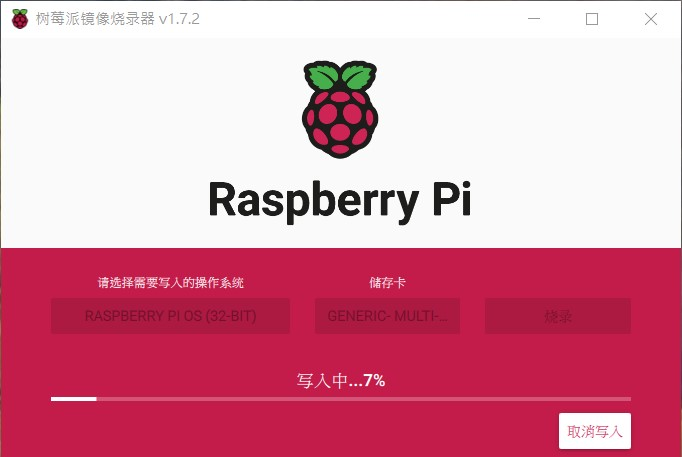

# Raspberry Pi
[](https://github.com/lankahsu520/HelperX)
[![GitHub license][license-image]][license-url]
[![GitHub stars][stars-image]][stars-url]
[![GitHub forks][forks-image]][forks-url]
[![GitHub issues][issues-image]][issues-image]
[![GitHub watchers][watchers-image]][watchers-image]

[license-image]: https://img.shields.io/github/license/lankahsu520/HelperX.svg
[license-url]: https://github.com/lankahsu520/HelperX/blob/master/LICENSE
[stars-image]: https://img.shields.io/github/stars/lankahsu520/HelperX.svg
[stars-url]: https://github.com/lankahsu520/HelperX/stargazers
[forks-image]: https://img.shields.io/github/forks/lankahsu520/HelperX.svg
[forks-url]: https://github.com/lankahsu520/HelperX/network
[issues-image]: https://img.shields.io/github/issues/lankahsu520/HelperX.svg
[issues-url]: https://github.com/lankahsu520/HelperX/issues
[watchers-image]: https://img.shields.io/github/watchers/lankahsu520/HelperX.svg
[watchers-url]: https://github.com/lankahsu520/HelperX/watchers

# 1. [Install Raspberry Pi OS using Raspberry Pi Imager](https://www.raspberrypi.com/software/)
> I can't use Traditional Chinese !!!

#### A. Run

#### B. Select OS

#### C. Select Disk

#### D. Confirm

#### E. Burn


# 2. Insert SD card

# 3. Raspberry Pi OS (32-BIT)

```bash
$ uname -a
Linux lanka-pi3 5.15.56-v7+ #1575 SMP Fri Jul 22 20:28:11 BST 2022 armv7l GNU/Linux

$ cat /proc/version
Linux version 5.15.56-v7+ (dom@buildbot) (arm-linux-gnueabihf-gcc-8 (Ubuntu/Linaro 8.4.0-3ubuntu1) 8.4.0, GNU ld (GNU Binutils for Ubuntu) 2.34) #1575 SMP Fri Jul 22 20:28:11 BST 2022

$ cat /etc/os-release
PRETTY_NAME="Raspbian GNU/Linux 11 (bullseye)"
NAME="Raspbian GNU/Linux"
VERSION_ID="11"
VERSION="11 (bullseye)"
VERSION_CODENAME=bullseye
ID=raspbian
ID_LIKE=debian
HOME_URL="http://www.raspbian.org/"
SUPPORT_URL="http://www.raspbian.org/RaspbianForums"
BUG_REPORT_URL="http://www.raspbian.org/RaspbianBugs"

$ cat /etc/issue
Raspbian GNU/Linux 11 \n \l

$ ls -al /bin/sh
lrwxrwxrwx 1 root root 4 Aug 25 12:41 /bin/sh -> bash

```

# 4. apt-get

```bash
sudo apt-get --yes update
sudo apt-get --yes upgrade

sudo apt-get --yes install gcc
sudo apt-get --yes install g++

sudo apt-get --yes install pkg-config

# cmake, automake
sudo apt-get --yes install cmake
sudo apt-get --yes install automake autoconf

# meson
sudo pip3 install meson
sudo apt-get --yes install ninja-build

```

```bash
$ autoconf -V
autoconf (GNU Autoconf) 2.69
Copyright (C) 2012 Free Software Foundation, Inc.
License GPLv3+/Autoconf: GNU GPL version 3 or later
<http://gnu.org/licenses/gpl.html>, <http://gnu.org/licenses/exceptions.html>
This is free software: you are free to change and redistribute it.
There is NO WARRANTY, to the extent permitted by law.

Written by David J. MacKenzie and Akim Demaille.

$ automake --version
automake (GNU automake) 1.16.3
Copyright (C) 2020 Free Software Foundation, Inc.
License GPLv2+: GNU GPL version 2 or later <https://gnu.org/licenses/gpl-2.0.html>
This is free software: you are free to change and redistribute it.
There is NO WARRANTY, to the extent permitted by law.

Written by Tom Tromey <tromey@redhat.com>
       and Alexandre Duret-Lutz <adl@gnu.org>.

$ cmake --version
cmake version 3.18.4

CMake suite maintained and supported by Kitware (kitware.com/cmake).

$ pkg-config --version
0.29.2

$ gcc --version
gcc (Raspbian 10.2.1-6+rpi1) 10.2.1 20210110
Copyright (C) 2020 Free Software Foundation, Inc.
This is free software; see the source for copying conditions.  There is NO
warranty; not even for MERCHANTABILITY or FITNESS FOR A PARTICULAR PURPOSE.

```

# 5. Interface Options

```bash
$ sudo raspi-config

```

#### A. Camera

```bash
$ sudo raspi-config
Interface Options / I1 Legacy Camera 

```

#### B. SSH

```bash
$ sudo raspi-config
Interface Options / I2 SSH

```

#### C. VNC

```bash
$ sudo raspi-config
Interface Options / I3 VNC

```

- [VNC Viewer](https://www.realvnc.com/en/connect/download/viewer/)

#### D. Serial

```bash
$ sudo raspi-config
Interface Options / I6 Serial Port

```

- [[Raspberry Pi] 啟用Raspberry Pi 3B+ 序列埠功能](https://dumbcatnote.blogspot.com/2020/04/raspberry-pi-enable-serial-port.html)

# Appendix

# I. Study

#### A. [Day2 - 安裝樹莓派OS](https://ithelp.ithome.com.tw/articles/10235135)

# II. Debug

# III. Glossary

# IV. Tool Usage


# Author

Created and designed by [Lanka Hsu](lankahsu@gmail.com).

# License

[HelperX](https://github.com/lankahsu520/HelperX) is available under the BSD-3-Clause license. See the LICENSE file for more info.

